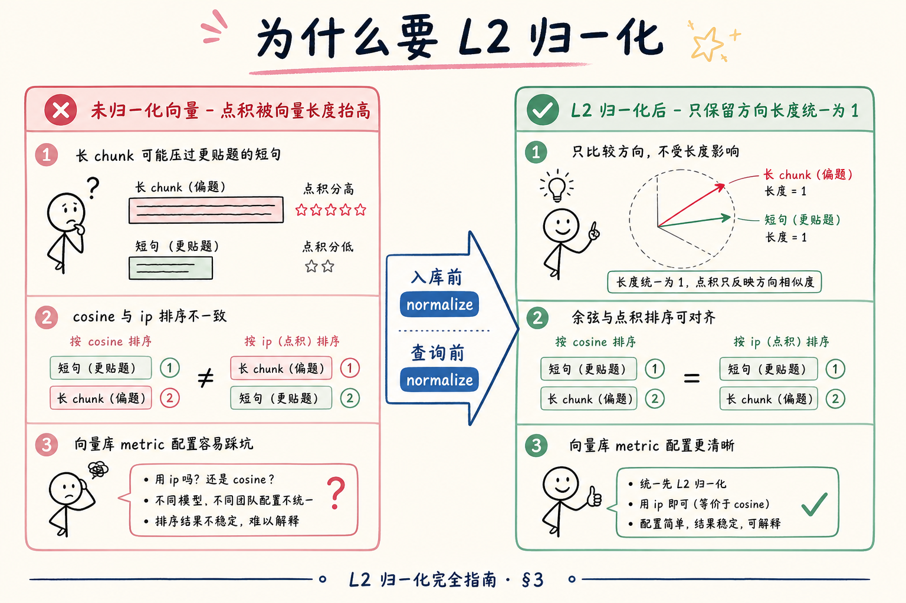
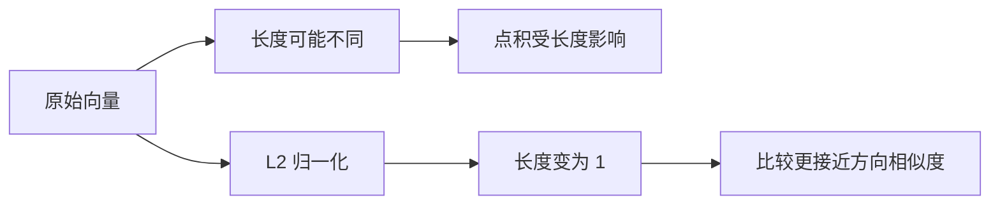
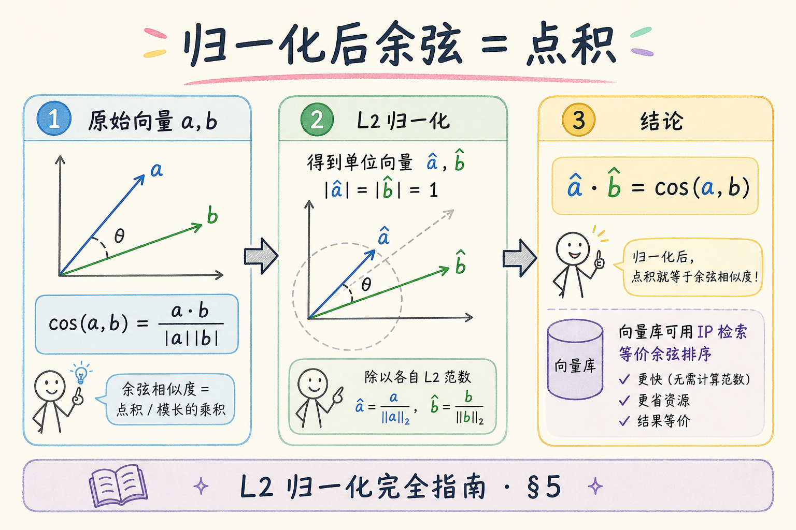
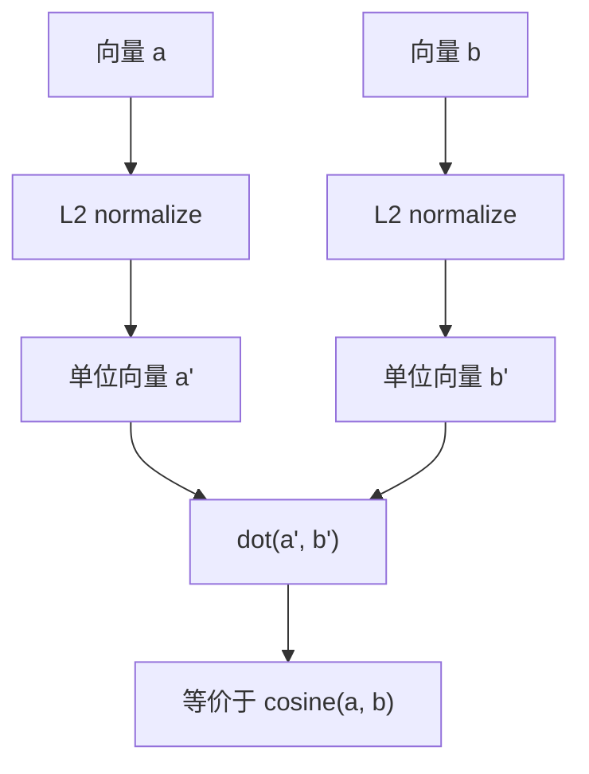
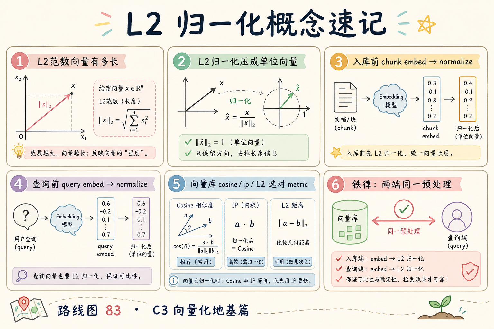
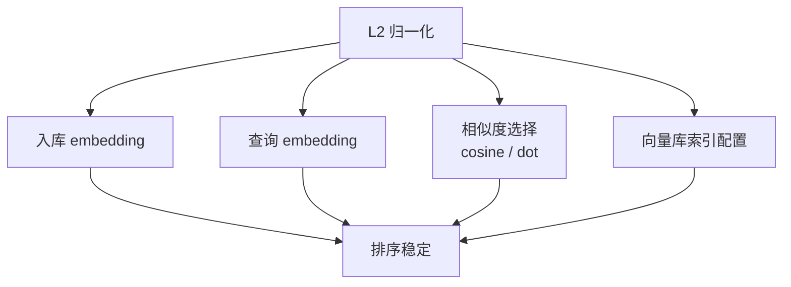

# C3 向量化（六）：L2 归一化完全指南

> [26 篇](26.similarity-metrics-tutorial.md) 讲过：余弦看方向、点积含长度；**L2 归一化** 后二者可对齐。但生产 RAG 里，归一化到底 **放在哪一步**？**只归一化文档、不归一化查询** 会怎样？向量库选 `cosine` 还是 `ip` 要不要自己先 normalize？这篇是 [企业 RAG 路线图](ENTERPRISE_RAG_ROADMAP.md) **C3 向量化第六篇**（路线图第 **83** 条），定位 **地基篇**：讲清 **L2 归一化在 Embedding 管线中的位置**、**怎么做**、**归一化后 cosine = dot** 的工程含义，以及 **向量库 metric 配置** 的连锁反应。前置：[25 Embedding](25.embedding-vector-tutorial.md)、[26 相似度度量](26.similarity-metrics-tutorial.md)。

---

## 目录

1. [前言：归一化不是「数学选修课」](#1-前言归一化不是数学选修课)
2. [本文边界与动手路径](#2-本文边界与动手路径)
3. [为什么要 L2 归一化](#3-为什么要-l2-归一化)
4. [L2 范数与归一化怎么做](#4-l2-范数与归一化怎么做)
5. [归一化后余弦 = 点积](#5-归一化后余弦--点积)
6. [向量库 metric 与存储含义](#6-向量库-metric-与存储含义)
7. [先错对对：四种典型翻车](#7-先错对对四种典型翻车)
8. [入库与查询流水线](#8-入库与查询流水线)
9. [综合实战：numpy 可跑示例](#9-综合实战numpy-可跑示例)
10. [与模型输出、批处理、缓存的衔接](#10-与模型输出批处理缓存的衔接)
11. [综合概念地图](#11-综合概念地图)
12. [常见陷阱与 FAQ](#12-常见陷阱与-faq)
13. [总结与系列下一步](#13-总结与系列下一步)

---

## 1. 前言：归一化不是「数学选修课」

上线 RAG 后，你迟早会在日志里看到这种对话：

> 工程师：「我们向量库配的是 inner product。」  
> 新人：「那检索分和 26 篇讲的余弦 0.87 对不上啊？」  
> 工程师：「入库前 normalize 了吗？查询端 normalize 了吗？两端一致吗？」

三个「吗」问完，往往发现：**代码里手写余弦做评测，向量库却用裸 IP；或者只归一化了文档向量，查询向量忘了。**

**L2 归一化**（L2 normalization）：把向量除以其 **L2 范数**（欧氏长度），使结果向量长度为 1，只保留方向信息。  
通俗说：把每支箭头 **拉成同样长**，再比「指的方向」——这样点积就不会被「谁更长」带偏。

在 RAG Embedding 管线里，L2 归一化通常发生在：

1. **模型输出之后**（若模型未内置单位化）；  
2. **写入向量库之前**；  
3. **查询向量生成之后、检索之前**——与入库端 **同一规则**。

26 篇从 **尺子** 角度讲了归一化与余弦/点积的关系；本篇从 **工程管线** 角度回答：**在哪做、怎么做、做错会怎样、向量库怎么配。**

**读完本文，你应该能做到：**

1. 用「长度干扰点积」解释为何 RAG 常做 L2 归一化。  
2. 写出 L2 归一化公式，并用 numpy 实现 **双向量 + 批量矩阵**。  
3. 说明 **单位向量上点积 = 余弦**，以及这对 `ip` 检索的意义。  
4. 区分向量库 `cosine` / `ip` / `L2` 配置与 **是否预归一化** 的组合。  
5. 画出 ingest / query 对称预处理数据流。  
6. 识别 §7 四种先错后对，避免线上排序静默漂移。

### 1.1 C3 主线在路线图中的位置

```text
78～82  Embedding 模型与维度成本
83  L2 归一化 ← 本篇（预处理铁律）
84  批量 Embedding
85  Embedding 缓存策略
86  API 重试与限流
```

25、26 篇解决 **「向量是什么、怎么比远近」**；83～85 解决 **「怎么稳定、便宜、快速地生产向量」**——归一化是三者共同的 **前提假设**。

### 1.2 术语双轨速查

| 中文 | English | 一句话 |
|------|---------|--------|
| L2 范数 | L2 norm | 向量长度；各分量平方和再开方 |
| L2 归一化 | L2 normalization | 除以范数，得到单位向量 |
| 单位向量 | unit vector | 长度为 1 的向量 |
| 点积 / 内积 | dot product / inner product | 对应分量相乘再求和 |
| 余弦相似度 | cosine similarity | 点积除以两范数之积 |
| metric | distance / similarity metric | 向量库用的比较规则 |

### 1.3 读完本篇的最小交付物

1. 一张 **入库 + 查询对称 normalize** 流程图（§8）；  
2. 一段可跑的 **numpy normalize + 验证 cosine=dot** 脚本（§9）；  
3. 一份 **向量库 metric 与预处理对照表**（§6）；  
4. 四条 **先错对对** 口述（§7）；  
5. 团队 wiki 里补一句：**换模型或改 normalize 策略 → 全量重嵌**。

---

## 2. 本文边界与动手路径

**档位：地基篇（路线图 83，C3 向量化）。**

**本文讲：** L2 归一化动机、公式与实现；归一化后余弦与点积等价；向量库 metric 含义；ingest/query 对称预处理；numpy 实战与先错对对。  
**本文不讲：** FAISS 量化细节、HNSW 图构建、学习型度量训练、完整线性代数证明。模型是否 **内置归一化** 会点到为止，以 **实测范数** 为准。

### 2.1 动手路径表

| 步骤 | 你做什么 | 验收 |
|------|----------|------|
| A | 读 §3～§4，能口述「为何要 normalize」 | 白板能讲 |
| B | 读 §5～§6，填 metric 对照表 | cosine vs ip 何时等价 |
| C | 跑 §9 numpy 示例 | 打印「归一化后 dot=c cosine」 |
| D | 完成 §7 先错对对 | 四种错法 |
| E | 对照 §11 概念地图 | 能画对称数据流 |

**环境：** Python 3.10+；`pip install numpy`。无需 API Key；有 Key 可在 §9 延伸里接真实 Embedding。

### 2.2 沿用前文

| 概念 | 来自 |
|------|------|
| Embedding 数据流 | [25 Embedding](25.embedding-vector-tutorial.md) |
| 余弦、点积、归一化直觉 | [26 相似度度量](26.similarity-metrics-tutorial.md) |
| 向量维度与存储 | 路线图 **82** |
| 批量 embed | 路线图 **84** → [67 篇](67.embedding-batching-tutorial.md) |
| 缓存键含 model | 路线图 **85** → [68 篇](68.embedding-cache-tutorial.md) |

---

## 3. 为什么要 L2 归一化

读下图前，先想：两段 **语义同样相关** 的 chunk，一段 50 token、一段 500 token，裸点积排序谁更容易占便宜？



下面这张图说明为什么要做 L2 归一化。读图时重点看：归一化会把向量长度统一，让比较更关注方向而不是长度。



结论：在很多向量检索场景里，我们更关心“语义方向是否接近”，而不是某个向量本身有多长。

对照上图：

- **左栏（未归一化）**：长文本的 Embedding 模长往往更大（不绝对，但常见）；裸 **内积检索** 可能让「又长又一般」压过「又短又贴题」。  
- **右栏（L2 归一化）**：长度被压成 1，排序主要由 **方向（语义）** 决定，与 **余弦相似度** 一致。  
- **中心铁律**：入库与查询 **同一预处理**——只改一端等于换了一把尺子只量一边。

### 3.1 从 26 篇公式回顾

余弦：

`cos(a, b) = (a · b) / (|a| × |b|)`

点积：

`a · b = |a| × |b| × cos(a, b)`

可见：**点积里藏着两个长度因子**。若你不想要长度参与排序，要么：

- 用 **余弦**（显式除掉长度）；要么  
- 先把 `a`、`b` **L2 归一化** 成单位向量 `â`、`b̂`，再算点积。

### 3.2 RAG 里更关心方向的原因

**Dense Embedding**（稠密向量）把整段文本压成一个向量，语义相近的文本希望 **箭头方向接近**。检索问的是：「哪条 chunk 与问题 **意思同向**？」——不是「哪条 chunk 的向量 **数值更大**」。

典型需要归一化的场景：

| 场景 | 原因 |
|------|------|
| 向量库 metric = `ip` / inner product | 需单位向量，IP 才等价余弦 |
| 混用不同长度 chunk | 减弱长度与 token 数的间接相关 |
| 自研评测用 numpy 余弦，生产用 IP 索引 | 对齐预处理，分数才可对照 |
| 多字段拼接后再 embed | 拼接长度不一，更应统一后处理 |

### 3.3 什么时候可以不做？

| 情况 | 说明 |
|------|------|
| 模型官方明确「输出已 L2 归一化」且你 **实测** ‖v‖≈1 | 可不再除，但仍须 **查询端同规则** |
| 向量库选 `cosine` 且库内 **自动归一化** | 你要确认文档，不是假设 |
| 训练目标就是裸点积且厂商要求 IP | 跟随官方；勿擅自再加 normalize |

**默认建议（地基阶段）**：**显式 L2 归一化 + 记录 `normalize_flag` 进缓存键**（见 [68 篇](68.embedding-cache-tutorial.md)）——比赌模型「大概已经单位化」更可排障。

### 3.4 与「相似度分数」的期望管理

归一化 **不提高** Embedding 模型本身的语义质量；它只 **修正尺子**。若 chunk 切得稀烂，归一化后该糊还是糊。它能减少的是：**同一套向量上的排序被长度噪声干扰**——这是工程上非常值得做的低成本步骤。

---

## 4. L2 范数与归一化怎么做

**L2 范数**（L2 norm，欧氏范数）：向量 `v = (v1, v2, …, vn)` 的长度，  
`|v| = sqrt(v1² + v2² + … + vn²)`。  
通俗说：高维勾股定理——尺子量箭头有多长。

**L2 归一化**：  
`v̂ = v / |v|`（当 |v| > 0）  
结果满足 `|v̂| = 1`，称为 **单位向量**（unit vector）。

### 4.1 单向量 numpy

下面代码演示 **单向量** 归一化。运行前请想：若 `v` 全是 0，会发生什么？

```python
import numpy as np

def l2_normalize(v: np.ndarray, eps: float = 1e-12) -> np.ndarray:
    """v: shape (d,). 返回单位向量；零向量时返回原样避免除零。"""
    norm = np.linalg.norm(v, ord=2)
    if norm < eps:
        return v
    return v / norm

v = np.array([3.0, 4.0])  # |v|=5
v_hat = l2_normalize(v)
print("归一化后:", v_hat)           # [0.6, 0.8]
print("范数:", np.linalg.norm(v_hat))  # 1.0
```

代码后解读：`ord=2` 即 L2；`eps` 防 **空文本 / 全零向量** 除零。生产要把异常向量 **拦截打日志**，别静默进库。

### 4.2 批量矩阵（一行向量化）

索引任务常一次处理 `(batch, dim)` 矩阵。应对 **每一行** 除以其 L2 范数：

```python
def l2_normalize_rows(mat: np.ndarray, eps: float = 1e-12) -> np.ndarray:
    """mat: shape (n, d). 每行一个 embedding。"""
    norms = np.linalg.norm(mat, axis=1, keepdims=True)
    norms = np.maximum(norms, eps)
    return mat / norms
```

代码后解读：`axis=1` 表示沿 **特征维** 算长度；`keepdims=True` 便于广播除法。与 [67 篇](67.embedding-batching-tutorial.md) 的批量 API 输出衔接时，**在写入向量库前** 统一调此函数。

### 4.3 sklearn 与框架内置

`sklearn.preprocessing.normalize(X, norm='l2')` 默认也是行归一化。LangChain、LlamaIndex 部分 VectorStore 封装里可能有 `normalize_embeddings=True`——**读你用的那层文档**，不要叠两次（见 §7）。

### 4.4 数值精度与 float32

向量库常存 **float32**。归一化后再 `astype(np.float32)` 可省存储；极高维时精度损失通常可接受，但 **换精度要全链路一致**。若 cosine 与 IP 差 1e-6 级，排序几乎不变；若差很多，先查 **是否只归一化了一端**。

### 4.5 归一化放在 GPU 还是 CPU

本地 `sentence-transformers` 推理可在 GPU 上 `encode(normalize_embeddings=True)`，省 CPU 往返。云端 API 返回的向量在 **应用侧** normalize 即可。原则不变：**入库与查询同一实现**——同一函数、同一 `eps`、同一 dtype。

---

## 5. 归一化后余弦 = 点积

读下图：从原始向量到单位向量，公式如何「塌缩」成一句 **点积即余弦**。




下面这张图解释“归一化后余弦相似度等于点积”的直觉。读图时重点看：当两个向量长度都变成 1，点积里剩下的主要就是夹角信息。



结论：如果索引和查询都已经归一化，用点积检索通常可以得到和余弦相似度一致的排序。

对照上图三步：

1. 原始 `a`、`b`：余弦 = `(a·b) / (|a||b|)`。  
2. 令 `â = a/|a|`，`b̂ = b/|b|`。  
3. `â · b̂ = cos(a, b)`——因为 `|â|=|b̂|=1`，分母为 1。

### 5.1 工程推论

| 推论 | 含义 |
|------|------|
| 双端单位化后，**IP 排序 = 余弦排序** | 可用 FAISS `IndexFlatIP`、Milvus `IP` 等 |
| 分数尺度约在 [-1, 1]（实向量、句向量常见正区间） | 利于跨 chunk 粗读阈值（仍要评测标定） |
| 查询与文档 **必须同一归一化** | 一端单位、一端非单位 → 排序失真 |

### 5.2 小数值验证（与 §9 衔接）

设 `a=[1,2,3]`，`b=[2,0,1]`。手算或 numpy：

- 先算 `cos(a,b)`；  
- 再算 `l2_normalize(a) · l2_normalize(b)`；  
- 二者应相等（浮点误差除外）。

这是团队 onboarding 的 **一分钟实验**——比背公式牢。

### 5.3 与 26 篇「只比点积」反例的关系

26 篇强调：未归一化时，**拉长向量可抬高点积**。L2 归一化正是 **拆掉长度杠杆**。若你线上用 IP 且未归一化，等于主动把 26 篇的「错法」搬进生产。

### 5.4 cosine 距离 vs cosine 相似度

部分库报 **cosine distance** = `1 - cosine_similarity`（或变体）。**越小越相似**。别与 **相似度越大越好** 混读日志。归一化只影响相似度计算，不改变「距离 / 相似」方向约定——仍以库文档为准。

---

## 6. 向量库 metric 与存储含义

向量库不会替你「理解语义」；它只按你选的 **metric** 比较向量。归一化与否，直接决定 metric 是否名副其实。

### 6.1 三类常见 metric

| metric | 口语 | 越大越好还是越小越好 | 与 L2 归一化的关系 |
|--------|------|----------------------|-------------------|
| **cosine** / 余弦相似度 | 比夹角 | 相似度：越大越好 | 库可能内部先归一化；也可能要求你已归一化 |
| **ip** / inner product 内积 | 比点积 | 越大越好（检索） | **强烈建议** 双端已 L2 归一化 |
| **l2** / 欧氏距离 | 比直线距离 | 距离：越小越好 | 与单位向量上的余弦单调相关，但 **数值尺度不同** |

**重要**：单位向量上，欧氏距离与余弦相似度可互相推导，但 **阈值不能混用**。你在 numpy 里标定的 `cosine > 0.75`，不能原样套到 `L2 distance < 0.5` 上。

### 6.2 常见向量库配置口头对照

| 引擎 | 你应确认的问题 |
|------|----------------|
| **pgvector** | `vector_cosine_ops` vs `vector_l2_ops` vs 内积算子；插入前是否 normalize |
| **FAISS** | `IndexFlatIP` vs `IndexFlatL2`；`faiss.normalize_L2` 是否调用 |
| **Qdrant** | `Distance.COSINE` vs `DOT`；服务端是否假设单位向量 |
| **Milvus** | `metric_type: IP/COSINE/L2` 与索引类型组合 |
| **Pinecone** | `metric: cosine` vs `dotproduct`；维度与 normalize 文档 |

**实践模板**：在 README 写死三行——  
`模型名` + `是否 L2 归一化（是/否，函数名）` + `向量库 metric`。新人排障先看这三行。

### 6.3 存归一化向量还是存原始向量？

| 策略 | 优点 | 缺点 |
|------|------|------|
| 存 **归一化后** 向量 | 与 IP/cosine 一致；检索省一步 | 换 normalize 策略要重算 |
| 存 **原始** 向量，查询时归一化 | 保留原始输出备查 | 库内 metric 易配错；占存储一样 |

生产多数选 **存归一化后**——简单、不易漏查询端步骤。原始向量若需审计，放 **对象存储或缓存层**，不必进 ANN 索引。

### 6.4 维度与归一化无关，但一起写在元数据里

[25 篇](25.embedding-vector-tutorial.md) 强调换模型要重建；换 **normalize 策略** 同理——旧向量与新向量 **不可比**。在 [51 chunk_id](51.metadata-chunk-id-tutorial.md) 旁增加 `embedding_schema_version` 字段是好习惯。

---

## 7. 先错对对：四种典型翻车
下面这些错误都和“向量空间是否一致”有关。模型、归一化、批处理、缓存和距离度量只要有一处不一致，系统仍然能返回结果，但结果会悄悄变差。

### 7.1 只归一化文档，不归一化查询

**错：** 入库 `v̂ = v/|v|`，查询用原始 `q`。  
**对：** `q̂ = q/|q|` 再检索。  
**后果：** 排序静默错误；有时「看起来还能用」——最危险。

### 7.2 向量库 cosine + 应用层又 normalize 两次

**错：** 库配置 `cosine` 且文档说会自动归一化，应用层仍手动除一遍，查询再除一遍。  
**对：** 读文档，**只 normalize 一次**；写单测验证 ‖v‖≈1。  
**后果：** 方向仍对，但浪费；极端实现下可能数值异常。

### 7.3 索引用 IP，评测用 numpy 余弦，两端预处理不一致

**错：** 离线 `cosine(raw, raw)` 调阈值，线上 `IP(normalized, normalized)`。  
**对：** 离线脚本 **复制生产同一 `l2_normalize` 函数**。  
**后果：** 阈值全废；Recall 评测与线上脱节。

### 7.4 换 Embedding 模型未重嵌，但继续用旧 normalize 假设

**错：** 新模型输出分布变了，仍假设「大概单位长」不再检查。  
**对：** 换模型 → 抽样打印 `np.linalg.norm` 分布 → 决定是否显式 normalize → **全量重嵌**（[25 篇](25.embedding-vector-tutorial.md)）。  
**后果：** metric 与分数解释全线崩溃。

### 7.5 团队 Review 清单（归一化 PR）

- [ ] 入库与查询调用 **同一** `l2_normalize`（或同参数 `normalize_embeddings=True`）  
- [ ] 向量库 metric 与预处理 **写在 README**  
- [ ] 空向量 / 零向量有 **拦截**  
- [ ] 离线评测脚本与生产 **同源预处理**  
- [ ] 缓存键含 `normalize_flag`（[68 篇](68.embedding-cache-tutorial.md)）  
- [ ] 换模型 ticket 含 **重嵌 + 清缓存**

---

## 8. 入库与查询流水线

把归一化画进 **对称** 数据流——这是 83 篇的核心交付物。

```text
【索引期 ingest】
chunk 文本
  → Embedding API / 本地 encode
  → 向量矩阵 (n, d)
  → L2 归一化（每行）
  → 写入向量库（metric: IP 或 COSINE）
  → 元数据：model, schema_version, normalize=true

【查询期 query】
用户问题
  → 同一 Embedding 模型
  → 查询向量 (d,)
  → L2 归一化（同一函数）
  → ANN 检索 Top-k
  → 返回 chunk 原文（不是向量）
```

注意：**返回给 LLM 的是原文**（[25 篇](25.embedding-vector-tutorial.md)）；向量与归一化只服务于 **找谁**。

### 8.1 与混合检索的边界

BM25 分数与余弦/IP 分数 **不可直接相加**。[26 篇](26.similarity-metrics-tutorial.md) 已提醒；归一化只保证 **稠密侧内部** 尺子一致。RRF 等融合在 C4 讲——83 篇只要保证：**稠密这一路别自己先乱**.

### 8.2 与重排序（rerank）的边界

Cross-encoder 重排常对 **query + 原文** 打分，不吃你 L2 归一化的 chunk 向量。归一化影响 **召回谁进 Top-k**；重排影响 **Top-k 内谁更前**。两层都重要，但 **别在 rerank 阶段又讨论 L2**——容易概念打架。

### 8.3 观测指标建议

| 指标 | 用途 |
|------|------|
| 入库向量 ‖v‖ 的均值/方差 | 应接近 1（若已归一化） |
| 查询向量 ‖q‖ | 查询向量也应接近 1；偏离时记录异常并排查在线编码流程 |
| Top-1 与 Top-2 分数差 | 阈值与空结果率参考 |
| 同一 query 归一化前后排序 Kendall τ | 上线前回归 |

---

## 9. 综合实战：numpy 可跑示例

**演示什么：** 构造「同向不同长」向量，展示裸点积排序翻转；L2 归一化后与余弦一致。  
**前置：** `pip install numpy`  
**预期：** 打印两种排序对比，验证 `dot(â,b̂) == cosine(a,b)`。

```python
import numpy as np

def l2_normalize(v, eps=1e-12):
    n = np.linalg.norm(v)
    return v if n < eps else v / n

def cosine(a, b):
    na, nb = np.linalg.norm(a), np.linalg.norm(b)
    if na < 1e-12 or nb < 1e-12:
        return 0.0
    return float(np.dot(a, b) / (na * nb))

# 语义「同向」：b 是 a 的 10 倍
a = np.array([1.0, 2.0, 3.0])
b = 10.0 * a
q = np.array([1.1, 2.0, 2.9])  # 查询更接近 a 方向

candidates = {"short": a, "long": b}

print("=== 裸点积排序（易被长度带偏）===")
for name, v in sorted(candidates.items(), key=lambda kv: np.dot(q, kv[1]), reverse=True):
    print(name, "dot=", round(np.dot(q, v), 4))

print("=== 余弦排序 ===")
for name, v in sorted(candidates.items(), key=lambda kv: cosine(q, kv[1]), reverse=True):
    print(name, "cos=", round(cosine(q, v), 4))

print("=== L2 归一化后点积排序（应等同余弦）===")
q_hat = l2_normalize(q)
for name, v in sorted(candidates.items(), key=lambda kv: np.dot(q_hat, l2_normalize(kv[1])), reverse=True):
    sim = np.dot(q_hat, l2_normalize(v))
    print(name, "dot_hat=", round(sim, 4), "cos=", round(cosine(q, v), 4))
```

代码后解读：`short` 与 `long` 方向相同，余弦应相等；裸点积往往 **`long` 更高**——这就是未归一化 IP 的坑。归一化后两者点积应相等，且与余弦一致。

### 9.1 延伸：接 OpenAI Embedding（可选）

有 API Key 时，对返回向量先检查范数再决定是否显式 normalize：

```python
# 伪代码片段：接 25 篇 client
# vec = np.array(resp.data[0].embedding, dtype=float)
# print("norm before:", np.linalg.norm(vec))
# vec_hat = l2_normalize(vec)
```

若 `norm before` 已≈1，仍建议 **显式走同一函数**——换模型时行为一致。

### 9.2 自检清单

- [ ] 能解释为何 `long` 裸点积更高  
- [ ] 能说明归一化后 `short`/`long` 等价  
- [ ] 能复述 ingest/query 对称步骤  
- [ ] 能填向量库 metric 表（§6）

---

## 10. 与模型输出、批处理、缓存的衔接
这一节先把「与模型输出、批处理、缓存的衔接」放到真实 RAG 流程里理解：它解决的不是单个函数怎么写，而是数据从入库、检索到展示时如何保持可解释、可验证、可排障。

### 10.1 模型内置 normalize 的检测

部分 Sentence-BERT 类模型 `encode(normalize_embeddings=True)`；部分 API 文档写「已归一化」。**上线前抽样 100 条**，画 `‖v‖` 直方图——别信口头。

### 10.2 与 [67 批量 Embedding](67.embedding-batching-tutorial.md)

批量 `(n,d)` 矩阵用 `l2_normalize_rows` 一次完成，比 Python for 循环快。批量不改变「每行一个方向」的语义——只是 **算得快**。

### 10.3 与 [68 Embedding 缓存](68.embedding-cache-tutorial.md)

缓存键必须含：

- `model`  
- `text` 或 hash  
- **`normalize_flag` 或 `schema_version`**

否则「同一文本、一次存归一化向量、一次存原始向量」会 **互相覆盖**，检索灾难。

### 10.4 与路线图 86 限流

归一化是本地 CPU 小头；大头仍是 API。别为了省 0.1ms normalize 去 **逐条** 调 API——批处理 + 缓存优先。

---

## 11. 综合概念地图

读下图前，用一句话串起：L2 范数、归一化、余弦、点积、metric。




下面这张概念地图总结 L2 归一化的落点。读图时重点看：入库向量和查询向量必须采用同一套处理逻辑。



结论：归一化最怕“只处理一边”。入库和查询不一致时，检索分数会变得很难解释。

对照上图：83 是 C3 **尺子对齐** 篇——让 **生产向量** 与 **26 篇数学** 一致。

### 11.1 速记表

| 概念 | 一句话 |
|------|--------|
| L2 范数 | 向量长度 |
| L2 归一化 | 除长度，变单位向量 |
| 单位向量上 | 点积 = 余弦 |
| ingest | embed → normalize → 入库 |
| query | embed → normalize → 检索 |
| metric | 与是否归一化配套 |
| 换模型 | 重嵌 + 清缓存 |

### 11.2 三十秒口述稿（面试用）

> RAG 里常用 L2 归一化把 embedding 压成单位向量，避免内积被长度带偏。归一化后点积等于余弦，所以可以用 IP 索引。关键是入库和查询同一预处理，向量库 metric 和文档一致；换模型或改 normalize 要全量重嵌，缓存键要带 model 和 schema 版本。

---

## 12. 常见陷阱与 FAQ
最后用 FAQ 检查 Embedding 工程是否稳固。重点看模型版本、向量维度、归一化、批量任务和缓存是否保持一致。

### 12.1 常见陷阱

1. **把归一化当成「提升语义」** — 只修尺子，不换模型。  
2. **零向量静默入库** — 空 chunk 要拦截。  
3. **float16 乱用** — 精度与排序稳定性要测。  
4. **cosine 距离当相似度** — 方向可能反。  
5. **只离线算余弦，线上另一套** — 评测与生产脱节。

### 12.2 FAQ

**Q：生产到底用 cosine 还是 ip？**  
A：若双端 L2 归一化，**排序等价**；选你向量库支持好、团队文档写清的那种。关键是 **预处理一致**，不是名字玄学。

**Q：归一化要放在 API 前还是 API 后？**  
A：**后**。归一化对象是 **模型输出的向量**，不是原始文本。

**Q：每个 chunk 归一化会不会丢失「重要性」信息？**  
A：标准 RAG 检索比的是 **语义方向**；若你真要「长文权重更大」，应在 **分块、元数据、重排** 里做，不是保留裸模长。

**Q：L2 归一化和 BatchNorm 是一回事吗？**  
A：不是。BatchNorm 是训练神经网络层的技巧；本篇是 **检索前对 embedding 向量除 L2 范数**，场景不同。

**Q：pgvector 用 `<=>` 算子还要自己 normalize 吗？**  
A：查你用的 **distance 定义** 与 pgvector 版本文档。很多团队选择 **插入前 normalize + cosine 算子**，最不易错。

**Q：和 26 篇什么分工？**  
A：26 讲 **公式与直觉**；83 讲 **管线放哪、怎么写代码、向量库怎么配**。

**Q：下一步读什么？**  
A：[67 批量 Embedding](67.embedding-batching-tutorial.md)——归一化后的矩阵如何高效算；[68 缓存](68.embedding-cache-tutorial.md)——如何避免重复 embed。

---

## 13. 总结与系列下一步

1. **L2 归一化** 把向量压成单位长，让排序主要看 **语义方向**。  
2. **单位向量上点积 = 余弦**——IP 检索与余弦检索可对齐。  
3. **入库与查询必须同一预处理**——不对称是最常见静默 bug。  
4. 向量库 **metric** 与是否归一化配套；阈值不能跨 metric 硬搬。  
5. 换模型 / 改 normalize → **全量重嵌**；缓存键带 **schema 版本**。

### 13.1 系列下一步

| 目标 | 阅读 |
|------|------|
| 批量 embed 提吞吐 | [67 批量 Embedding](67.embedding-batching-tutorial.md) |
| 缓存省 API 费 | [68 Embedding 缓存](68.embedding-cache-tutorial.md) |
| 回顾尺子公式 | [26 相似度度量](26.similarity-metrics-tutorial.md) |
| 向量从哪来 | [25 Embedding](25.embedding-vector-tutorial.md) |
| API 限流重试 | 路线图 **86** |

### 13.2 学习目标自检

- [ ] 能写 `l2_normalize` 与 `l2_normalize_rows`  
- [ ] 能演示「同向不同长」点积陷阱  
- [ ] 能画对称 ingest/query 图  
- [ ] 能填 §6 metric 表  
- [ ] 能口述四条先错对对  

### 13.3 30 分钟动手作业

1. 跑通 §9，截图排序对比贴 wiki；  
2. 对你项目在产 Embedding **抽样 20 条** 打印 `‖v‖`；  
3. 写三行 README：`model` / `normalize 函数` / `向量库 metric`；  
4. 检查查询路径是否调用 **同一 normalize**。

### 13.4 附录：常见 Embedding 模型与归一化实测建议

上线前对 **你们实际用的模型** 做一次「范数体检」，比背厂商一句话更可靠。下面表格是 **地基阶段操作清单**，不是替代官方文档：

| 模型族 | 建议实测 | 常见现象 |
|--------|----------|----------|
| OpenAI `text-embedding-3-*` | 抽样 50 条打印 `‖v‖` | 多数接近 1，仍建议显式 normalize 统一管线 |
| BGE / E5 本地 | `encode(normalize_embeddings=?)` 对比前后 | 官方示例常开 True；与 66 函数二选一 |
| 自建微调模型 | 必须实测 | 分布未知，勿假设 |

实测脚本可复用 §9：把 `fake_embed` 换成真实 API，输出 `min/mean/max` 范数。若 `mean` 远离 1 且你用 IP 索引，**归一化几乎是必选项**。

### 13.5 附录：归一化与量化（预告 C4）

路线图 C4 会讲 **向量量化**（float32 → int8）。量化前 **先固定归一化策略**——否则量化误差与长度噪声叠在一起，调参地狱。83 篇只需记住：**归一化是量化与 ANN 的共同前置假设**，细节留 C4。

### 13.6 给数据工程师的一句话

「我们把所有 chunk 和 query 的 embedding 都除以 L2 长度，让内积等于余弦；向量库用 IP 或 cosine 要和这一步写在同一张配置表里。换模型或改 normalize，整库重嵌，缓存键里的 schema 版本也要 bump。」

**延伸阅读**：许多「向量检索怪怪的」排障，最后都回到 **两端是否同一尺子**。83 篇不值得跳过——它是 84、85 批量与缓存的 **共同前提**。下一篇 [67](67.embedding-batching-tutorial.md) 在归一化之后教你 **怎么一次 embed 一整批**。

---

> **初学者可能仍困惑的点**  
> - 归一化 **不** 等于「把文本变短」——变的是 **向量长度**，不是 chunk 字数。  
> - 「模型说已归一化」仍建议 **实测**；实测通过也可 **走同一函数** 保一致。  
> - cosine 与 ip 在 **双端单位化** 后排序一致，但 **日志里的数字刻度** 仍可能因库实现略有差异——比的是 **相对顺序**，不是跨系统绝对分。  
> - 二维箭头图只是直觉；真实 1536 维无法画——**公式与代码** 才是可靠依据。
