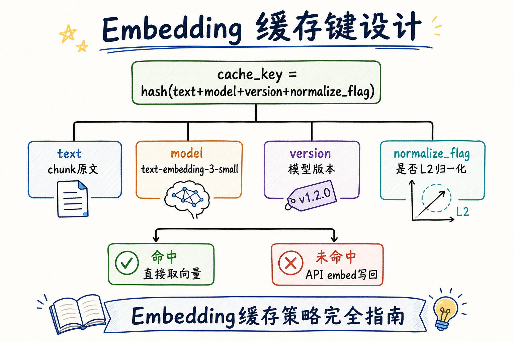
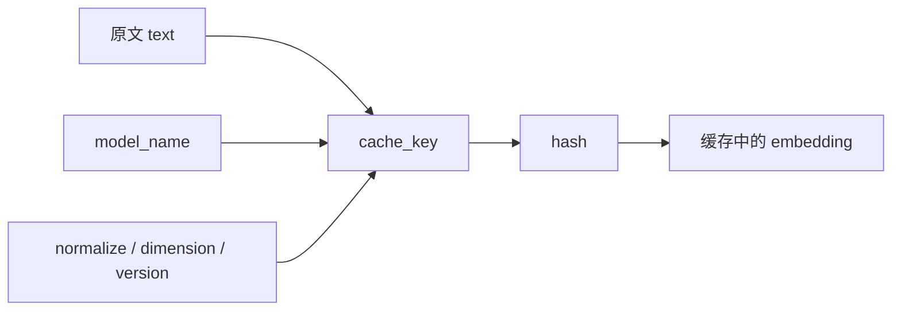
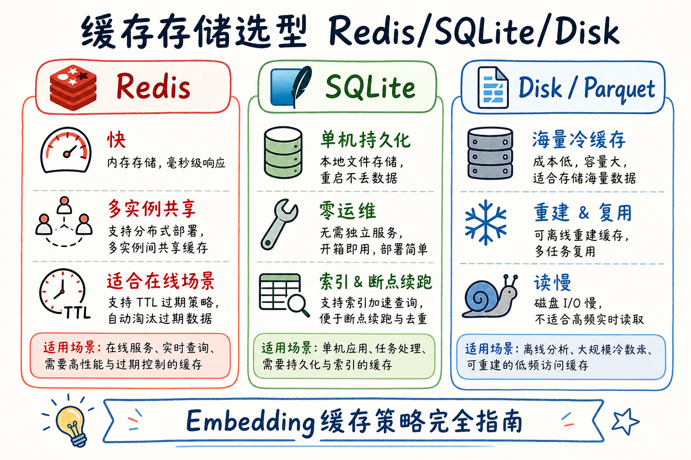
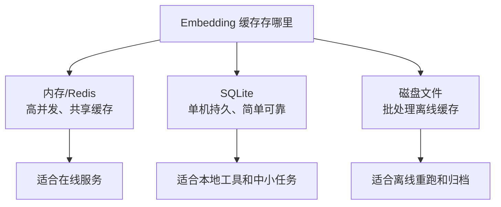
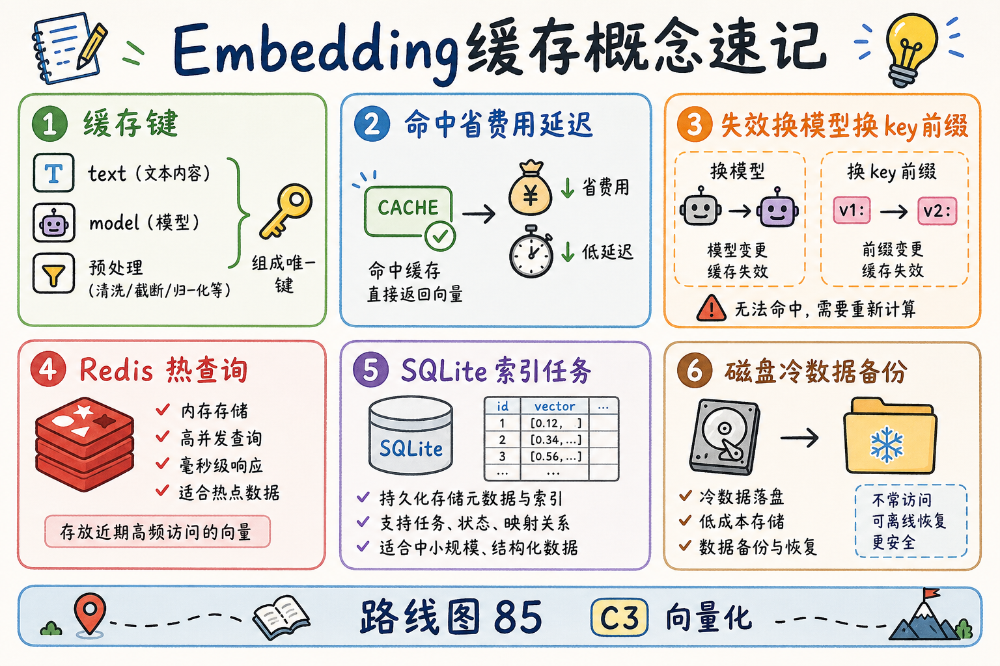
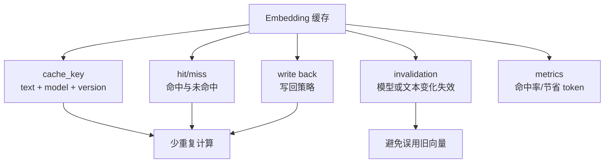

# C3 向量化（八）：Embedding 缓存策略完全指南

> 同一份员工手册 v3，全量重建索引时 **十万 chunk 又要 embed 一遍**；用户每晚问的那二十个高频问题，每次查询也 **重复调 API**。Embedding 按 token 计费（[27 篇](27.token-counting-billing-tutorial.md)）——**缓存**（cache）是 C3 里最直接的降本手段：算过的 `(文本, 模型)` 向量 **落盘或进 Redis**，下次 **命中就跳过 API**。这篇是 [企业 RAG 路线图](ENTERPRISE_RAG_ROADMAP.md) **C3 向量化第八篇**（路线图第 **85** 条），定位 **地基篇**：讲清 **缓存键怎么设计**、**Redis / SQLite / 磁盘** 怎么选、**换模型如何失效**、以及和 [67 批量](67.embedding-batching-tutorial.md) 如何配合。前置：[25 Embedding](25.embedding-vector-tutorial.md)、[66 L2 归一化](66.l2-normalization-tutorial.md)。

---

## 目录

1. [前言：重复 embed 是在烧钱](#1-前言重复-embed-是在烧钱)
2. [本文边界与动手路径](#2-本文边界与动手路径)
3. [缓存放在流水线的哪里](#3-缓存放在流水线的哪里)
4. [缓存键设计：text + model + 版本](#4-缓存键设计text--model--版本)
5. [命中、未命中与写回策略](#5-命中未命中与写回策略)
6. [Redis / SQLite / 磁盘怎么选](#6-redis--sqlite--磁盘怎么选)
7. [失效：换模型与预处理变更](#7-失效换模型与预处理变更)
8. [先错对对：四种典型翻车](#8-先错对对四种典型翻车)
9. [综合实战：SQLite 迷你缓存层](#9-综合实战sqlite-迷你缓存层)
10. [综合实战：Redis 查询侧热缓存](#10-综合实战redis-查询侧热缓存)
11. [综合概念地图](#11-综合概念地图)
12. [常见陷阱与 FAQ](#12-常见陷阱与-faq)
13. [总结与系列下一步](#13-总结与系列下一步)

---

## 1. 前言：重复 embed 是在烧钱

典型浪费场景：

| 场景 | 重复了什么 |
|------|------------|
| 索引任务崩溃重启 | 已 embed 的 8 万条 **重新调 API** |
| 文档 v3→v3.1 只改 200 段 | 未改段落 **仍全量 embed** |
| 热门 query「报销流程」 | 每天上千次 **同一问题 embed** |
| 开发环境反复跑 E2E | 测试语料 **无限次计费** |

**Embedding 缓存**（embedding cache）：以 **确定性键** 存储已算好的向量；请求前 **查键**，命中则 **直接取向量**，未命中再调模型并 **写回**。  
通俗说：**做过的坐标卡进抽屉**，下次别重新测绘。

缓存 **不** 替代向量库——向量库做 **ANN 近邻**；缓存做 **精确键值**「这段文本 + 这个模型 → 哪个向量」。二者互补：缓存省 **API**；向量库省 **暴力扫描**。

**读完本文，你应该能做到：**

1. 画出 embed 前 **查缓存 → 未命中再 API** 的流程。  
2. 设计含 **model、预处理版本** 的缓存键，避免张冠李戴。  
3. 为 **索引任务** 与 **在线查询** 各选一种存储（SQLite/Redis/磁盘）。  
4. 说明 **换模型必须失效** 旧缓存的规则与操作步骤。  
5. 估算简单场景下 **缓存命中率与成本节省**。  
6. 实现 §9 SQLite 与 §10 Redis 最小示例。

### 1.1 C3 主线在路线图中的位置

```text
83  L2 归一化
84  批量 Embedding
85  Embedding 缓存 ← 本篇
86  API 重试与限流
```

25 篇 §7 三角里的「缓存」在此落地；与路线图 **13 Redis 缓存模式**（Cache-Aside、TTL）同族，本篇专注 **Embedding 向量** 这一对象。

### 1.2 术语双轨速查

| 中文 | English | 一句话 |
|------|---------|--------|
| 缓存 | cache | 存已算结果，命中则复用 |
| 缓存键 | cache key | 唯一标识一次 embed 输入 |
| 命中 | cache hit | 键存在，跳过 API |
| 未命中 | cache miss | 键不存在，调 API 并写回 |
| TTL | time to live | 键过期时间 |
| 失效 | invalidation | 主动删除或换前缀废弃 |
| Cache-Aside | cache-aside | 应用先读缓存，miss 再读源并回填 |

---

## 2. 本文边界与动手路径

**档位：地基篇（路线图 85）。**

**本文讲：** 缓存位置、键设计、三种存储选型、失效策略、成本估算、SQLite/Redis 示例、先错对对。  
**本文不讲：** CDN 边缘缓存、向量库内置缓存层实现、分布式一致性协议完整理论、加密向量密文检索。

### 2.1 动手路径表

| 步骤 | 你做什么 | 验收 |
|------|----------|------|
| A | 读 §3～§4，写出 cache_key 公式 | 含 model + schema |
| B | 读 §6，为索引/查询各选存储 | 说清理由 |
| C | 跑 §9 SQLite 示例 | hit/miss 日志 |
| D | 读 §10 Redis 示例 | 理解 TTL |
| E | 完成 §8 先错对对 | 四种错法 |

**环境：** Python 3.10+；`pip install numpy`；SQLite 内置；Redis 示例需 `pip install redis` 与本地 Redis（可选）。

### 2.2 沿用前文

| 概念 | 来自 |
|------|------|
| Embedding API | [25 Embedding](25.embedding-vector-tutorial.md) |
| normalize 进 schema | [66 L2 归一化](66.l2-normalization-tutorial.md) |
| 批量写缓存 | [67 批量](67.embedding-batching-tutorial.md) |
| Token 计费 | [27 Token 计费](27.token-counting-billing-tutorial.md) |
| Redis 模式 | 路线图 **13** |

---

## 3. 缓存放在流水线的哪里

```text
【索引期】
chunk 文本
  → 算 cache_key
  → 查缓存 ──命中──→ 取向量 → upsert 向量库
           └─未命中→ API/本地 encode → 写缓存 → upsert

【查询期】
用户问题
  → 算 cache_key
  → 查缓存 ──命中──→ 取向量 → ANN 检索
           └─未命中→ embed → 写缓存 → ANN
```

**Cache-Aside**（旁路缓存）：应用 **自己管** 读缓存、miss 时调源、再写回——不是数据库透明缓存。Embedding 场景几乎都用此模式。

### 3.1 缓存什么：向量，不是原文

值（value）通常是 **float 数组序列化**（bytes、JSON list、numpy `.npy`、pickle 慎用）。键（key）绑定 **输入文本 + 模型 + 预处理**。  
**不要** 只缓存 API 原始 JSON 而不绑 model——换模型后 **灾难性误用**。

### 3.2 两层存储分工

| 层 | 作用 |
|----|------|
| **Embedding 缓存** | 精确键值：这段文本的向量 |
| **向量库** | 近似检索：哪个 chunk 与 query 近 |

索引时：缓存 **省 API**；向量库 **服务检索**。查询时：query 缓存 **省重复问题 embed**；结果仍从向量库 ANN。

### 3.3 与 [67 批量](67.embedding-batching-tutorial.md) 的配合

批量 embed 前 **先逐条或批量查缓存**，只对 **miss 集合** 调 API——「批」与「缓存」叠加是生产标配：

```text
chunks → 分区 hit/miss → 仅 miss 批处理 embed → 写回缓存 → 合并向量
```

---

## 4. 缓存键设计：text + model + 版本

读下图：一根 cache_key 上应挂哪些字段。




下面这张图展示 Embedding 缓存键应该包含哪些要素。读图时重点看：只用文本做 key 不够，模型和版本变化也会让向量结果变化。



结论：缓存键必须覆盖所有会影响向量结果的参数。否则换模型后可能误用旧向量。

对照上图：**缺任何一环都可能命中「错向量」**。

### 4.1 推荐键公式

```text
cache_key = HASH( canonical_text + model_id + embedding_schema_version )
```

| 字段 | 说明 |
|------|------|
| **canonical_text** | 规范化后的文本：如 `strip()`、统一换行 `\n`、可选 NFC  Unicode |
| **model_id** | `text-embedding-3-small` / `BAAI/bge-small-zh-v1.5` |
| **embedding_schema_version** | 含：是否 L2 归一化、维度、是否拼接标题前缀等 |

**为何 hash**：文本可能很长，Redis/SQLite 键有长度限制；SHA256 定长。  
**为何不用 chunk_id 单独做键**：同一文本可能出现在 **多版本 chunk**；缓存语义是 **「这段字 + 模型」→ 向量**，与 chunk_id 解耦利于 **未改段落复用**。chunk_id 可作为 **二级索引**，不是 embed 输入本身。

### 4.2 Python 键生成示例

```python
import hashlib

def canonicalize(text: str) -> str:
    return " ".join(text.strip().split())  # 简化空白；按业务可加深

def cache_key(text: str, model: str, schema: str = "l2norm-v1") -> str:
    payload = f"{canonicalize(text)}\nmodel={model}\nschema={schema}"
    return "emb:" + hashlib.sha256(payload.encode("utf-8")).hexdigest()
```

代码后解读：`schema` 变更（例如从不 normalize 改到 normalize）必须 **换 schema 字符串**——旧键自然 miss，不会误用。

### 4.3 键前缀与多租户

多租户时加 `tenant_id` 进 payload，或键前缀 `emb:{tenant}:`——避免 **跨租户** 读到同一 hash（极低概率但权限事故）。

### 4.4 与 [51 chunk_id](51.metadata-chunk-id-tutorial.md) 的关系

| 标识 | 用途 |
|------|------|
| chunk_id | 业务溯源、向量库主键 |
| cache_key | embed 计算 dedup |

文档 v3.1 更新：未改段落 **文本相同** → **cache 命中** → 新 chunk_id 仍可指向 **同一向量**（若你允许向量复用）或 **复制向量**——产品策略问题；缓存保证 **不必再调 API**。

---

## 5. 命中、未命中与写回策略
缓存不是“存了就完事”，它有一条固定读写路径：先按文本和模型算 key，命中就直接复用向量，未命中才调用 Embedding API，成功后再写回缓存。理解这条路径，后面排查费用暴涨、结果不一致、缓存污染才有抓手。

### 5.1 读路径

1. 算 key；  
2. `GET` 缓存；  
3. 命中 → 反序列化为 `np.ndarray`；  
4. 未命中 → embed → **先写缓存再 upsert**（或并行，见下）。

### 5.2 写路径与一致性

| 策略 | 说明 |
|------|------|
| **先写缓存再入库** | 崩溃时可能缓存有、库无——可接受，重试入库即可 |
| **先入库再写缓存** | 崩溃时可能重复 embed 下次——也可接受 |
| **同事务** | SQLite 可把向量与元数据放同一 DB；Redis 与 pgvector 无跨库事务，**最终一致** 即可 |

地基阶段：**miss 后 embed 成功即写缓存**——简单。

### 5.3 TTL 要不要？

| 场景 | TTL |
|------|-----|
| 查询热问题 Redis | 建议 24h～7d，防无限增长 |
| 索引 SQLite 持久 | 可无 TTL，靠 **版本失效** |
| 开发环境 | 短 TTL 或定期 flush |

Embedding 向量 **不过期也会变旧**——真正驱动力是 **换模型**，不是时间腐烂。TTL 主要是 **控内存**，不是语义新鲜度。

### 5.4 命中率粗算

若重建索引时 **80% 段落文本未变**，且缓存持久化——理论上 **80% API 省掉**（忽略 batch 开销）。  
查询侧若 Top 100 问题占 **50% 流量**——query 缓存可砍掉 **一半 embed 调用**（若问题字面稳定）。

### 5.5 负缓存（缓存「算不出」的结果）

对 **反复失败 embed** 的坏文本，可缓存 **短 TTL 的 miss 标记**（如 `NULL` 哨兵），避免 **每夜索引任务** 对同一条 OCR 垃圾 **重试一百次**。负缓存 TTL 宜短（分钟级），文本修复后 **主动删键**。

### 5.6 预热（warm-up）与冷启动

新部署空 Redis 时，首日 **命中率接近 0** 是正常现象。可选 **预热**：

- 把昨日 Top 1k query 文本 **离线 embed 写入 Redis**；  
- 索引任务结束后 **把 SQLite 热子集同步到 Redis**。

预热不是必需，但能避免 **上线首日 API 账单尖峰**。

---

## 6. Redis / SQLite / 磁盘怎么选

读下图：三种介质的典型分工。




下面这张图对比三类缓存存储。读图时重点看：选择取决于并发、持久化需求和运维复杂度。



结论：PoC 可以先用 SQLite 或磁盘文件；多进程在线服务再考虑 Redis。

对照上图：**没有唯一正确答案**，看 **读写模式、共享范围、持久化、运维成本**。

### 6.1 Redis

| 优点 | 缺点 |
|------|------|
| 毫秒读、多实例共享 | 内存贵；需运维 |
| 适合 **在线 query embed** 热缓存 | 大索引全量向量可能爆内存 |

**值格式**：`struct.pack` 的 float32 bytes，或 MessagePack。  
**模式**：Cache-Aside + TTL；键 `emb:{hash}`。

### 6.2 SQLite

| 优点 | 缺点 |
|------|------|
| 单文件、零运维、持久化 | 并发写有限 |
| 适合 **索引任务断点续跑** | 不适合高并发多写 |

**表结构示例**：

```sql
CREATE TABLE embedding_cache (
  cache_key TEXT PRIMARY KEY,
  model TEXT NOT NULL,
  schema_version TEXT NOT NULL,
  dim INTEGER NOT NULL,
  vector BLOB NOT NULL,
  created_at TEXT DEFAULT (datetime('now'))
);
CREATE INDEX idx_model ON embedding_cache(model);
```

### 6.3 磁盘（文件 / Parquet / npy 目录）

| 优点 | 缺点 |
|------|------|
| 海量、便宜 | 读慢于内存 |
| 适合 **冷备份、跨环境拷贝** | 需自管文件命名与清理 |

布局示例：`cache/{model}/{schema}/{hash[:2]}/{hash}.npy`

### 6.4 组合策略（生产常见）

| 层 | 介质 | 内容 |
|----|------|------|
| L1 | Redis | 热 query + 最近索引批 |
| L2 | SQLite / 磁盘 | 全量 embed 历史 |
| L3 | 向量库 | ANN 检索（不是替代缓存） |

---

## 7. 失效：换模型与预处理变更
Embedding 缓存最危险的问题不是“没命中”，而是“命中了不该用的旧向量”。只要模型、归一化、分块规则或清洗规则变了，旧缓存就可能和新索引不在同一个向量空间里，表面能跑，检索质量却会悄悄下降。

### 7.1 必须全量失效的情况

| 变更 | 操作 |
|------|------|
| 换 `model_id` | 新 model 新键空间；删旧前缀或换 `schema` |
| 改 L2 归一化策略 |  bump `embedding_schema_version` |
| 改维度 | 新 schema；旧向量 **不可入库** |
| 改 canonicalize 规则 | bump schema |

**不要**「原地覆盖」旧键——**并行新 schema 重建**，切换读路径，再删旧——见 [48 文档版本](48.doc-versioning-tutorial.md) 思维。

### 7.2 操作剧本

```text
1. 发布 embedding_schema_v2（含新 model 或 normalize）
2. 索引任务写新 cache 前缀 / 新表
3. 向量库新 collection 或 reindex
4. 切换查询读 v2
5. 监控 miss 率稳定后，删除 v1 缓存与旧 collection
```

### 7.3 与 [49 增量更新](49.incremental-update-tutorial.md)

增量只 embed **变更 chunk**；缓存让 **未变 chunk** 在「变更检测后」仍 **O(1) 取向量**。失效粒度是 **文本内容变**，不是「每晚全删缓存」。

### 7.4 蓝绿切换：双 schema 并行期

大版本换模型时，建议 **短期双写**：

```text
读路径仍 v1 → 后台任务写 v2 缓存 + v2 向量库
切换日：读路径改 v2
观察一周：删 v1 缓存前缀与 collection
```

并行期 **存储翻倍**——用 **时间换风险**。不要「周五下班一键删 v1」且无回滚——周一检索崩盘时没退路。

### 7.5 缓存与 [66 L2 归一化](66.l2-normalization-tutorial.md) 的版本字段

`embedding_schema_version` 推荐 **人类可读** 字符串，例如：

- `openai-te3-small-l2-v1`  
- `bge-small-zh-norm-true-v2`

勿用 **仅日期** 当 version——同一天可能 **先改 normalize 又改模型**，审计困难。Git commit 或配置中心版本号 **写入 schema** 是成熟团队常见做法。

---

## 8. 先错对对：四种典型翻车
下面四种翻车都属于“缓存看起来省钱，实际在制造脏结果”。读的时候重点看错法少了哪个维度：模型、schema、归一化方式，还是写入时机。

### 8.1 键只有 text，没有 model

**错：** `key = hash(text)`。  
**对：** `hash(text + model + schema)`。  
**后果：** 换模型后 **静默用旧向量**，检索全错。

### 8.2 缓存未归一化向量，入库已归一化

**错：** API 原始输出直接缓存，入库前才 normalize，读缓存 **跳过 normalize**。  
**对：** 缓存 **归一化后** 向量，或缓存原始但读路径 **统一走 normalize 函数**（键里 schema 标明）。  
**后果：** IP/cosine 排序错乱（[66 篇](66.l2-normalization-tutorial.md)）。

### 8.3 开发缓存灌进生产

**错：** 共用 Redis DB 0，dev 与 prod model 不同但 text 相同。  
**对：** **环境前缀** `emb:prod:` / `emb:dev:`；或分实例。  
**后果：** 难排查的跨环境污染。

### 8.4 只缓存不绑 chunk_id，增量更新混乱

**错：** 以为有缓存就不用管 chunk 版本。  
**对：** 缓存解决 **embed 计算**；**chunk_id / doc version** 仍要维护（[50 doc_id](50.metadata-doc-id-tutorial.md)、[51 chunk_id](51.metadata-chunk-id-tutorial.md)）。  
**后果：** 向量对新 chunk_id 复用错 **元数据绑定**。

### 8.5 团队 Review 清单（缓存 PR）

- [ ] 键含 **model + schema_version**  
- [ ] canonicalize 函数 **有单测**  
- [ ] 换模型 ticket 含 **缓存失效步骤**  
- [ ] Redis 有 **TTL 或内存上限**  
- [ ] 向量序列化 **dtype 一致**（float32）  
- [ ] 与 [67 批量](67.embedding-batching-tutorial.md) 的 miss-only 批处理已接入

---

## 9. 综合实战：SQLite 迷你缓存层

**演示什么：** Cache-Aside：miss 调假 embed，hit 跳过；批处理友好。  
**前置：** 仅标准库 + numpy  
**预期：** 第二次跑同一文本 **hit**。

```python
import hashlib
import sqlite3
import struct
import numpy as np

DB = "embedding_cache.db"
MODEL = "demo-model"
SCHEMA = "l2norm-v1"
DIM = 8  # 演示用小维度

def canonicalize(text: str) -> str:
    return " ".join(text.strip().split())

def cache_key(text: str) -> str:
    payload = f"{canonicalize(text)}\nmodel={MODEL}\nschema={SCHEMA}"
    return hashlib.sha256(payload.encode()).hexdigest()

def vec_to_blob(v: np.ndarray) -> bytes:
    return struct.pack(f"{len(v)}f", *v.astype(np.float32))

def blob_to_vec(blob: bytes, dim: int) -> np.ndarray:
    return np.array(struct.unpack(f"{dim}f", blob), dtype=np.float32)

def init_db():
    conn = sqlite3.connect(DB)
    conn.execute("""
        CREATE TABLE IF NOT EXISTS embedding_cache (
            cache_key TEXT PRIMARY KEY,
            dim INTEGER,
            vector BLOB
        )
    """)
    conn.commit()
    return conn

def fake_embed(text: str) -> np.ndarray:
    # 演示：确定性假向量；生产换 API
    seed = int(hashlib.md5(text.encode()).hexdigest(), 16) % (2**32)
    rng = np.random.default_rng(seed)
    v = rng.standard_normal(DIM).astype(np.float32)
    return v / np.linalg.norm(v)

def get_or_embed(conn, text: str) -> np.ndarray:
    key = cache_key(text)
    row = conn.execute(
        "SELECT dim, vector FROM embedding_cache WHERE cache_key=?", (key,)
    ).fetchone()
    if row:
        print("HIT", key[:12], "...")
        return blob_to_vec(row[1], row[0])
    print("MISS", key[:12], "...")
    v = fake_embed(text)
    conn.execute(
        "INSERT INTO embedding_cache(cache_key, dim, vector) VALUES (?,?,?)",
        (key, DIM, vec_to_blob(v)),
    )
    conn.commit()
    return v

if __name__ == "__main__":
    conn = init_db()
    t = "员工手册：一线城市住宿标准 500 元/晚"
    get_or_embed(conn, t)
    get_or_embed(conn, t)  # 第二次应 HIT
```

代码后解读：生产把 `fake_embed` 换成 [67 篇](67.embedding-batching-tutorial.md) 的 `batched_embed` 仅对 miss 列表；SQLite 作 **索引断点** 极佳。

### 9.1 批量查 miss（思路）

```python
def partition_hits(conn, texts):
    hits, misses = {}, []
    for t in texts:
        key = cache_key(t)
        row = conn.execute("SELECT dim, vector FROM embedding_cache WHERE cache_key=?", (key,)).fetchone()
        if row:
            hits[t] = blob_to_vec(row[1], row[0])
        else:
            misses.append(t)
    return hits, misses
```

对 `misses` 批量 API，回写后再与 `hits` 合并——索引吞吐 **最大化**。

### 9.2 单元测试：键稳定性

```python
def test_cache_key_stable_under_whitespace():
    a = cache_key("  差旅  标准  ")
    b = cache_key("差旅 标准")
    assert a == b

def test_cache_key_changes_when_model_global_changes():
    global MODEL
    k1 = cache_key("同文本")
    MODEL = "other-model"
    k2 = cache_key("同文本")
    assert k1 != k2
```

把 **canonicalize 与键** 放进 CI——比线上「命中率突然归零」再救火便宜得多。

### 9.3 与 [67 批量](67.embedding-batching-tutorial.md) 的 end-to-end 伪代码

```python
def index_chunks(chunks, conn, embed_fn):
    texts = [c["text"] for c in chunks]
    hits, misses_texts, misses_idx = {}, [], []
    for i, t in enumerate(texts):
        v = try_cache_get(conn, t)
        if v is not None:
            hits[i] = v
        else:
            misses_texts.append(t)
            misses_idx.append(i)
    if misses_texts:
        new_vecs = embed_fn(misses_texts)  # 67 篇 batched_embed
        for j, vec in enumerate(new_vecs):
            i = misses_idx[j]
            cache_set(conn, texts[i], vec)
            hits[i] = vec
    return [hits[i] for i in range(len(chunks))]
```

这是 **85 + 84** 的标准骨架——换任何向量库，这层 **dedup 逻辑** 都应保留。

---

## 10. 综合实战：Redis 查询侧热缓存

**演示什么：** 在线 query embed 短 TTL 缓存。  
**前置：** 本地 Redis；`pip install redis`  
**说明：** 无 Redis 时可跳过读代码。

```python
import hashlib
import struct
import numpy as np
import redis

r = redis.Redis(host="localhost", port=6379, db=0)
MODEL = "text-embedding-3-small"
SCHEMA = "l2norm-v1"
TTL = 86400  # 24h

def cache_key(text: str) -> str:
    payload = f"{text.strip()}\nmodel={MODEL}\nschema={SCHEMA}"
    h = hashlib.sha256(payload.encode()).hexdigest()
    return f"emb:prod:{h}"

def set_vec(key: str, v: np.ndarray):
    r.setex(key, TTL, v.astype(np.float32).tobytes())

def get_vec(key: str, dim: int):
    raw = r.get(key)
    if not raw:
        return None
    return np.frombuffer(raw, dtype=np.float32).copy()

def embed_query(text: str, dim: int = 1536):
    key = cache_key(text)
    cached = get_vec(key, dim)
    if cached is not None:
        return cached, True
    # vec = call_openai_embed(text)  # 生产替换
    vec = np.random.randn(dim).astype(np.float32)
    vec /= np.linalg.norm(vec)
    set_vec(key, vec)
    return vec, False
```

代码后解读：`emb:prod:` 环境前缀；`setex` 带 TTL 防内存涨。高 QPS 时 Redis 可挡 **大量重复问题 embed**。

### 10.1 成本粗算示例

假设：query embed 每次 $0.00002；日 10 万次查询；缓存命中率 40%：

`节省 ≈ 100000 × 0.4 × 0.00002 = $0.8/天`——单看不大，叠加 **索引重建**（十万段 × 命中率）更可观。用 **你们真实单价与命中率** 填表给财务。

### 10.2 索引重建场景：十万 chunk 省多少

设：每 chunk 平均 200 token；embedding 价 $0.0001 / 1k token；全量 10 万 chunk；**段落未变比例 70%**（版本小改常见）：

| 策略 | API 调用 chunk 数 | 粗算 token 费 |
|------|-------------------|---------------|
| 无缓存全量 embed | 100,000 | 100k×200/1k×0.0001 = **$2.0** |
| 70% 命中缓存 | 30,000 | **$0.6** |

数字随单价而变，但 **比例节省 70%** 在「小版本迭代频繁」的企业手册场景 **极常见**——这是推动 **上缓存** 的财务话术素材。再配合 [49 增量](49.incremental-update-tutorial.md)，未变段落甚至 **不必出现在本次任务列表**。

### 10.3 缓存大小估算

单条向量：1536 维 float32 ≈ 6KB。十万条 **全缓存** ≈ 600MB——SQLite/磁盘轻松；**全放 Redis** 要算内存预算。实践常 **Redis 只放热子集 + SQLite 全量**（§6.4 组合）。

### 10.4 安全与合规注意

缓存值是 **语义向量的浮点数组**，不是明文，但仍可能 **间接泄露语料分布**。若语料含 **ACL 敏感**（[53 篇](53.metadata-acl-tutorial.md)）：

- 缓存键若仅 hash 文本，**同文本不同权限** 会共享向量——向量本身不泄密原文，但 **侧信道** 需评估；  
- 高敏租户可 **缓存分库** 或 **禁用跨用户 query 缓存**；  
- 磁盘缓存文件要 **权限控制** 与备份加密——与向量库同级对待。

### 10.5 与文档版本（48 篇）的联动

[48 文档版本](48.doc-versioning-tutorial.md) 记录 `doc v3 → v3.1`。缓存键 **不绑 version** 是故意的：**文本不变则向量可复用**。版本元数据挂在 **chunk / 向量库记录** 上，而不是 embed 缓存键上。若业务要求「同文本不同版本必须重算」（极少），把 `doc_version` 编进 `schema`——明确是 **产品策略**，非常规默认。

### 10.6 调试技巧：采样 miss 日志

生产可记录 **1% miss** 的 `canonical_text[:80]` + `model`（注意脱敏）——当命中率 **突然暴跌**，常见原因：

1. 有人改了 `canonicalize` 却没 bump schema；  
2. 误连 **dev Redis** 清空；  
3. 模型 endpoint 悄悄升级；  
4. 分块改动导致 **大量文本微变**（标点、标题前缀）。

### 10.7 附录：磁盘缓存目录遍历示例

```python
from pathlib import Path
import numpy as np

def disk_cache_path(key: str, model: str, schema: str) -> Path:
    base = Path("embedding_cache") / model / schema
    return base / key[:2] / f"{key}.npy"

def disk_get(key: str, model: str, schema: str):
    p = disk_cache_path(key, model, schema)
    return np.load(p) if p.exists() else None

def disk_set(key: str, model: str, schema: str, vec: np.ndarray):
    p = disk_cache_path(key, model, schema)
    p.parent.mkdir(parents=True, exist_ok=True)
    np.save(p, vec.astype(np.float32))
```

适合 **跨机器拷贝缓存目录** 做灾备——比重新 embed 十万条 **省一天**。

---

## 11. 综合概念地图

读下图时，先看「Embedding 缓存概念速记」想表达的主线：它把本节的概念关系压缩成一张可对照的图。




下面这张概念地图总结 Embedding 缓存的关键设计。读图时重点看：缓存命中率、一致性和版本管理要同时考虑。



结论：缓存不是简单存一下结果，而是一套“什么时候复用、什么时候重算”的规则。

对照上图：85 是 C3 **降本** 篇——[84 批](67.embedding-batching-tutorial.md) 让你 **算得快**，85 让你 **少算**。

### 11.1 速记表

| 概念 | 一句话 |
|------|------|
| Cache-Aside | 先查缓存，miss 再 embed |
| 键 | text + model + schema |
| 失效 | 换模型 / 改预处理 → 新 schema |
| SQLite | 索引断点、持久 |
| Redis | 热 query、TTL |
| 磁盘 | 冷备、大批量 |
| 命中 | 省 API 与延迟 |

### 11.2 三十秒口述稿

> Embedding 缓存用 text、model 和预处理版本的 hash 做键，命中就直接取向量不调 API。索引任务用 SQLite 或磁盘做断点续跑，在线查询用 Redis 做热问题缓存。换模型必须换 schema 或清前缀，不能复用旧键。批处理时先 partition hit/miss，只对 miss 调 API。

---

## 12. 常见陷阱与 FAQ
最后用 FAQ 把缓存设计拉回实战。判断一个 Embedding 缓存是否可靠，不是只看命中率高不高，而是看它能否在模型切换、文本变更、并发写入和排障时保持可解释。

### 12.1 常见陷阱

1. **键不含 model** — 最危险的 silent bug。  
2. **缓存与向量库混为一谈** — 职责不同。  
3. **无 TTL 的 Redis 无限涨** — 内存事故。  
4. **pickle 序列化向量** — 安全与版本问题；用 bytes。  
5. **忽略 canonicalize** — 多空格导致 **应命中却 miss**。

### 12.2 FAQ

**Q：缓存能替代向量库吗？**  
A：**不能**。缓存是精确键值；检索要 ANN **扫全库近邻**——仍需 pgvector/Qdrant 等（路线图 C4）。

**Q：同一段文本不同 chunk_id 要 embed 几次？**  
A：**一次**——键绑文本不绑 chunk_id；取向量后 **挂到多个 chunk** 是元数据层的事。

**Q：缓存向量要不要 L2 归一化？**  
A：与 [66 篇](66.l2-normalization-tutorial.md) 入库策略 **一致**；schema 里写清。

**Q：全量重建索引要先清缓存吗？**  
A：**不必**——未变文本 **应命中** 才是目标。只有 **换模型/改 schema** 才清。

**Q：和 67 批量谁先谁后？**  
A：先 **partition hit/miss**，再对 miss **批量 embed**，最后 **写回缓存**。

**Q：下一步读什么？**  
A：路线图 **86 API 重试与限流**——miss 风暴时如何 **不打爆自己**。

**Q：和路线图 13 Redis 缓存模式关系？**  
A：13 讲通用 Cache-Aside/TTL；本篇是 **Embedding 向量专用键值设计**。

**Q：缓存穿透（大量不存在的 key）怎么办？**  
A：Embedding 场景较少「恶意假文本」；若担心，可对 **连续 miss 的同一 hash** 短 TTL 负缓存（存空标记），避免 **坏文本打穿 API**。索引任务更常见的是 **坏 chunk 死信**（[67 篇](67.embedding-batching-tutorial.md) §6）。

**Q：多模态 embed 也能用同一套键吗？**  
A：原则相同，但 `canonical_text` 要换成 **规范化输入描述**（如图片 URL + 裁剪版本 + 模型）。路线图 56 多模态另论；键里 **media_type** 应进 schema。

**Q：SQLite 缓存文件可以提交到 Git 吗？**  
A：**不要**。那是运行时产物，应进 `.gitignore`；用 **对象存储备份** 或运维快照。提交进 Git 会让仓库膨胀且可能 **泄露语料向量指纹**。

**Q：缓存和 CDN 缓存知识库 HTML 是一回事吗？**  
A：不是。CDN 缓存 **静态页面**；Embedding 缓存的是 **模型输出的浮点向量**。对象完全不同，失效策略也不同。

### 12.3 读路径自检（6 题）

1. 缓存与向量库各解决什么问题？  
2. cache_key 为什么必须含 model？  
3. 换 L2 策略如何失效旧缓存？  
4. 索引任务为什么推荐 SQLite？  
5. 查询热问题为什么推荐 Redis TTL？  
6. 批处理前为什么要 partition hit/miss？

### 12.4 团队 Wiki 模板（可直接粘贴）

```markdown
## Embedding 缓存配置
- model_id: text-embedding-3-small
- embedding_schema_version: l2norm-v1
- canonicalize: strip + collapse whitespace
- 索引缓存: SQLite 路径 ./data/emb_cache.db
- 查询缓存: Redis prefix emb:prod: TTL 86400
- 换模型流程: bump schema → 新 collection → 切换读 → 删旧前缀
```

---

## 13. 总结与系列下一步

1. **Embedding 缓存** 用确定性键避免 **重复 API**，索引与查询都受益。  
2. 键必须含 **canonical_text + model_id + embedding_schema_version**。  
3. **SQLite** 适合索引断点；**Redis** 适合热 query；**磁盘** 适合冷备。  
4. **换模型 / 改 normalize** → 新 schema，**禁止** 误用旧向量。  
5. 与 [67 批量](67.embedding-batching-tutorial.md) 结合：**只对 miss 批处理**。

### 13.1 系列下一步

| 目标 | 阅读 |
|------|------|
| API 限流重试 | 路线图 **86** |
| 批量 embed | [67 批量 Embedding](67.embedding-batching-tutorial.md) |
| L2 归一化 | [66 L2 归一化](66.l2-normalization-tutorial.md) |
| 增量更新 | [49 增量更新](49.incremental-update-tutorial.md) |
| 向量库 ANN | 路线图 C4 |

### 13.2 学习目标自检

- [ ] 能写 `cache_key` 函数  
- [ ] 能画 Cache-Aside 流程  
- [ ] 能选 Redis vs SQLite 场景  
- [ ] 能写换模型失效剧本  
- [ ] 能列四条先错对对  

### 13.3 30 分钟动手作业

1. 跑 §9，确认第二次 HIT；  
2. 改 `SCHEMA` 字符串，观察 **全部 MISS**；  
3. 用 100 条重复文本估 **命中率** 与假 API 调用次数；  
4. 在团队 README 增加 **embedding_schema_version** 字段说明。

### 13.4 与 OpenAI 兼容网关的缓存注意

[35 OpenAI 兼容 API](35.openai-compatible-api-tutorial.md) 网关可能 **换模型名映射** 或 **隐式量化**。缓存键里的 `model_id` 必须用 **你代码里写的那个字符串**，并在网关变更映射时 **bump schema**——否则「同名不同模型」会 **命中旧向量**。网关文档若写「兼容 text-embedding-3-small」，仍以 **实际路由到的后端** 为准做版本登记。

### 13.5 财务一页纸：何时缓存 ROI 最高

| 业务模式 | ROI |
|----------|-----|
| 手册 **高频小版本**（周更） | **极高**——未变段落命中 |
| 日志型语料 **几乎全变** | 低——靠批处理，不靠缓存 |
| C 端 **重复热门问** | 高——query Redis |
| 一次性导入 **从不重建** | 中——主要省首次失败重跑 |

用你们 **变更率 × 查询重复率** 填表，比抽象讲「缓存很好」更能批预算。

### 13.6 给后端 Review 的反模式清单

- ❌ `redis.set(hash(text), vec)` 无 model  
- ❌ 缓存原始向量、入库归一化向量，读缓存跳过 normalize  
- ❌ 换模型不清缓存、不重建向量库  
- ❌ 生产与测试共用 `emb:` 前缀  
- ✅ 键含 model + schema；miss 批处理；失效剧本进 Runbook

### 13.7 观测：缓存命中率仪表盘

建议至少三张图：

| 指标 | 解读 |
|------|------|
| `embed_cache_hit_ratio` | 索引/查询分别看图；骤降查 schema 或 canonicalize |
| `embed_cache_size_bytes` | Redis 内存；SQLite 文件大小 |
| `embed_api_calls_saved` | `hits × 均价` 估算节省 |

把 **命中率 × 单价** 做成月度报表，缓存从「工程师偷懒」变成 **可审计的降本项**。

### 13.8 与权限（53 篇）再强调一句

缓存不替代 **检索侧 ACL 过滤**（[53 metadata ACL](53.metadata-acl-tutorial.md)）。向量命中后仍要在 **向量库查询带 filter**——缓存只省 embed，不省 **能不能看这条 chunk** 的鉴权责任。

### 13.9 一句话给产品经理

「同一段话、同一个模型，我们只 embed 一次，以后都读抽屉里的坐标卡——手册小改版时，没改的字一句都不用再花钱调 API。」

### 13.10 冷知识：为什么 hash 键仍要保留 model 明文索引

SQLite 表里的 `model` 列与 Redis 键前缀 **不是为了重复存储**，而是为了 **运维查询**：「当前库里 `text-embedding-3-small` 缓存了多少条？」「换模型前要删多少键？」——纯 hash 键无法回答，**辅助索引列** 是成熟缓存表的标准设计。

**延伸阅读**：83～85 形成 C3 铁三角——**归一化** 对齐尺子，**批量** 算得快，**缓存** 少算。接下来该读 **86 限流**，否则 miss 风暴时 **缓存也救不了 429**。C4 向量库篇将假设你已 **稳定产出向量**。

---

> **初学者可能仍困惑的点**  
> - 缓存命中 **不** 等于「答案正确」——只保证 **同一输入同一向量**；语义质量仍看模型。  
> - hash 键 **不可逆**——调试时另存 `text_hash → snippet` 映射表或采样日志。  
> - 极长文本（超模型上限）要先 **截断策略进 schema**，否则同一键在不同版本截断规则下 **不一致**。  
> - Redis 丢了数据 **不是** 业务灾难——最多 **多调 API**；SQLite 文件要 **备份**。
