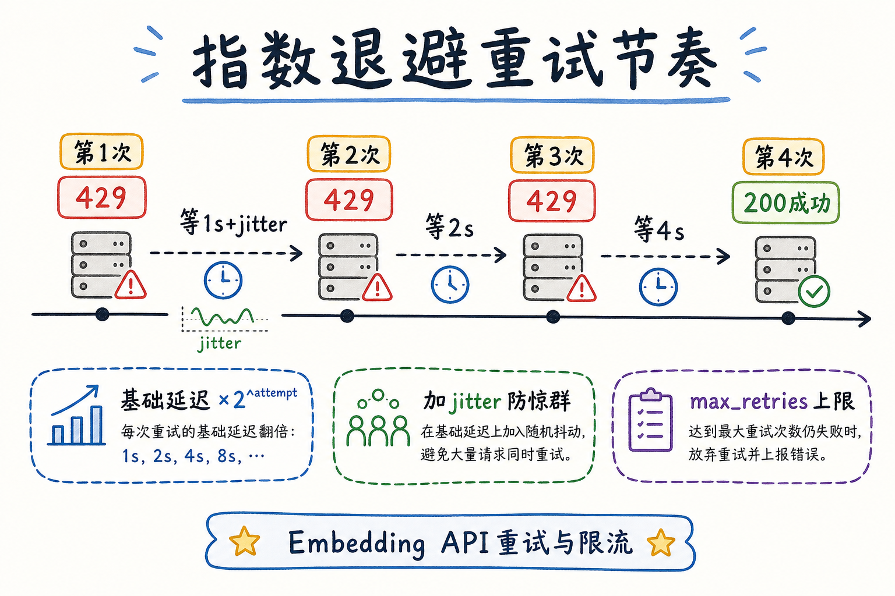
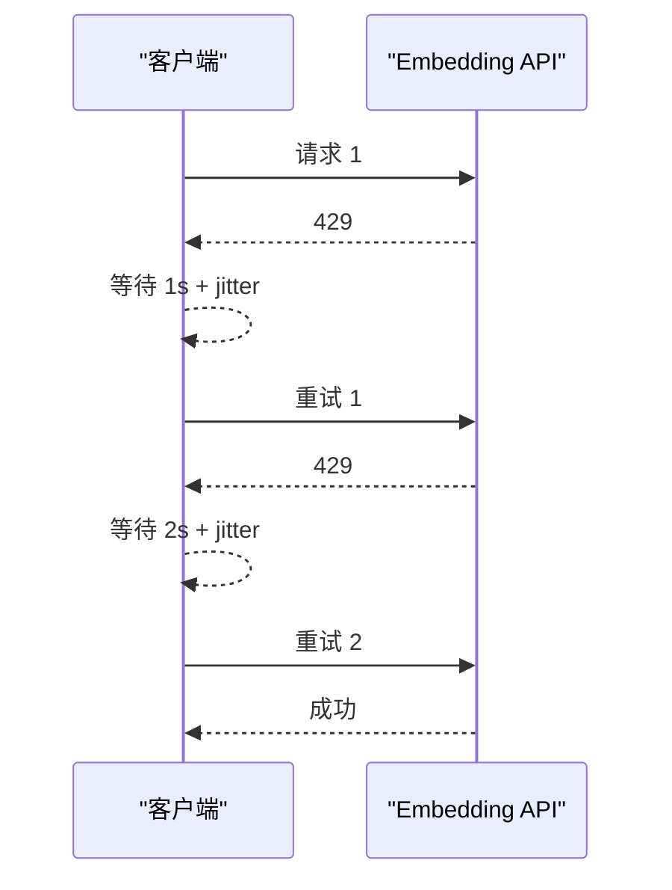
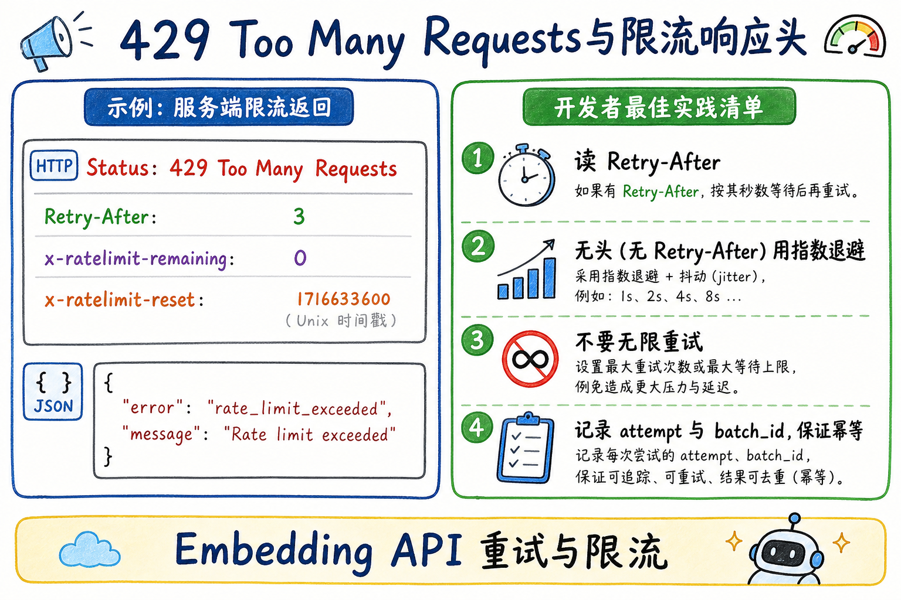
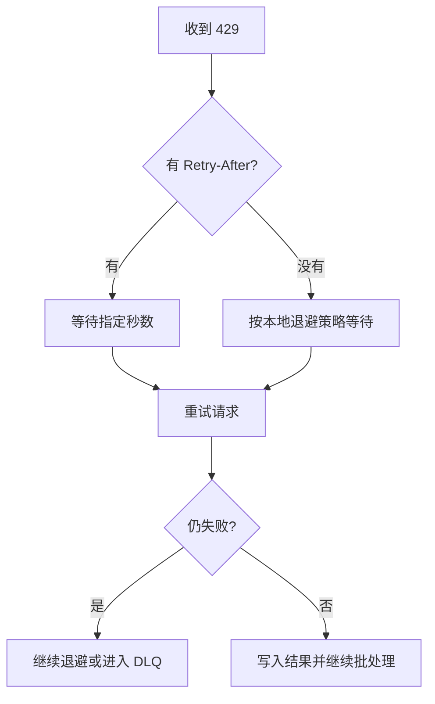
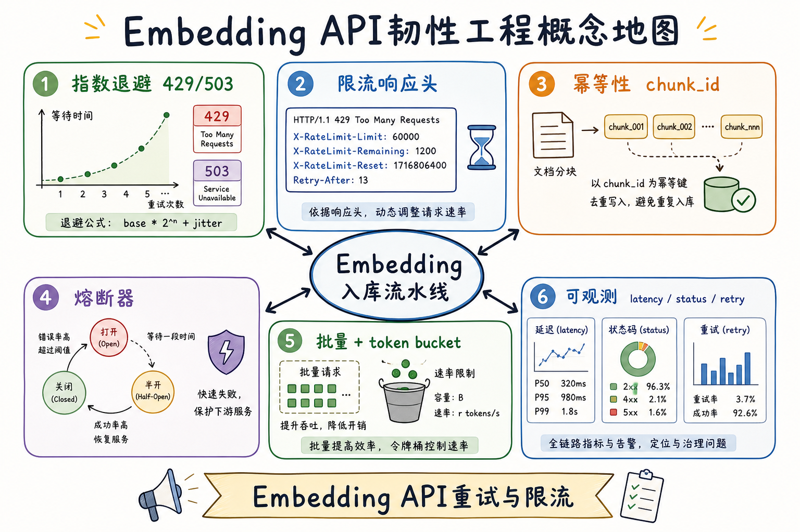
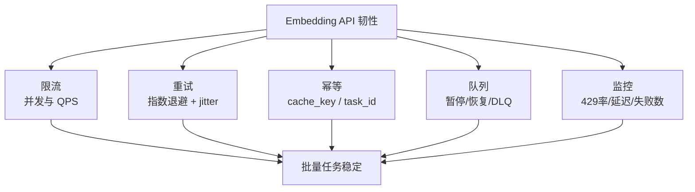

# 向量化（九）：Embedding API 重试与限流完全指南

> [25 Embedding 向量](25.embedding-vector-tutorial.md) 讲清了「文本→向量」；[35 OpenAI 兼容 API](35.openai-compatible-api-tutorial.md) 在 §7 提过「429 要不要重试」的直觉。真正跑 **十万 chunk 入库** 时，你会在凌晨三点被 **Rate Limit**（限流）叫醒：任务跑到 37% 突然全红，日志里一片 `429 Too Many Requests`，有人把 `max_retries` 设成 100 把账号打得更封。企业 RAG 的 Embedding 阶段是 **批处理 + 外部 API** 的典型战场——这篇是 [企业 RAG 路线图](ENTERPRISE_RAG_ROADMAP.md) **C3 向量化地基篇**（路线图第 **86** 条），讲清 **指数退避**（Exponential Backoff）、**429 处理**、**限流响应头**、**幂等性**（Idempotency）与 **熔断器**（Circuit Breaker）基础，并给出可粘贴的 Python 重试封装。前置：[35 API 调用](35.openai-compatible-api-tutorial.md)、[27 Token 计费](27.token-counting-billing-tutorial.md)、路线图 **84 批量 Embedding**、**85 缓存策略**。

---

## 目录

1. [前言：十万 chunk 入库的第一夜](#1-前言十万-chunk-入库的第一夜)
2. [本文边界与动手路径](#2-本文边界与动手路径)
3. [Embedding API 为何特别容易撞限流](#3-embedding-api-为何特别容易撞限流)
4. [指数退避：别立刻重试](#4-指数退避别立刻重试)
5. [429 与限流响应头怎么读](#5-429-与限流响应头怎么读)
6. [幂等性：重试不等于重复入库](#6-幂等性重试不等于重复入库)
7. [熔断器基础：连续失败时先停手](#7-熔断器基础连续失败时先停手)
8. [先错后对：四种典型翻车](#8-先错对对四种典型翻车)
9. [最小实现：带退避的 Embedding 客户端](#9-最小实现带退避的-embedding-客户端)
10. [批量、并发与 Token Bucket 配合](#10-批量并发与-token-bucket-配合)
11. [综合概念地图](#11-综合概念地图)
12. [可观测性与排障手册](#12-可观测性与排障手册)
13. [常见陷阱与 FAQ](#13-常见陷阱与-faq)
14. [总结与系列下一步](#14-总结与系列下一步)

---

## 1. 前言：十万 chunk 入库的第一夜

**Rate Limit**（速率限制）：API 服务商对单位时间内请求数（RPM，Requests Per Minute）或 token 数（TPM，Tokens Per Minute）设的上限，超出则拒绝服务，常返回 HTTP **429**。  
通俗说：**收费站每分钟只放行 N 辆车**——你车队开太快，栏杆放下，得排队等。

**Exponential Backoff**（指数退避）：重试时等待时间按指数增长（如 1s、2s、4s、8s），并常加 **Jitter**（随机抖动）避免所有客户端同一秒再撞限流。  
通俗说：**第一次等 1 秒，第二次等 2 秒，别一百辆车同时按喇叭**。

真实场景：

> 法务知识库 12 万 chunk，夜间全量重建索引。脚本开 32 线程调 `embeddings.create`，前 4 万条正常，之后每分钟几百条 429，任务卡死；运维把重试间隔改成 0，账号被临时封禁 15 分钟。

根因往往不是「API 坏了」，而是 **并发 × 批量 × 重试策略** 没设计。Embedding 入库是 **可重试的批处理**——学会 86 条，比换更贵的向量库更能救命。

**读完本文，你应该能做到：**

1. 解释 RPM/TPM 与 429 的关系，以及 **哪些错误该重试、哪些不该**。  
2. 实现带 **指数退避 + jitter** 的 embed 调用封装。  
3. 读取 **Retry-After** 等响应头并优先遵守。  
4. 用 **chunk_id 幂等** 设计，避免重试导致向量库重复行。  
5. 说出 **熔断器** 何时打开、何时半开探测。  
6. 识别 §8 四种「疯狂重试 / 不重试 / 重复入库 / 无熔断」翻车。

### 1.1 C3 向量化在路线图中的位置

```text
78～81 模型选型（OpenAI / BGE / E5 / GTE）
82～83 维度、L2 归一化
84 批量 Embedding
85 缓存策略
86 API 重试与限流 ← 本篇
87 中英混合语料
88 领域评测
```

84、85 解决 **「怎么少调 API」**；本篇解决 **「不得不调时怎么调不坏」**——是入库流水线从 Demo 到生产的门槛。

### 1.2 术语双轨速查

| 中文 | English | 一句话 |
|------|---------|--------|
| 限流 | Rate Limit | 单位时间请求/token 上限 |
| 指数退避 | Exponential Backoff | 重试等待时间指数增长 |
| 抖动 | Jitter | 随机加一点等待，防惊群 |
| 幂等 | Idempotency | 同一操作执行多次结果一样 |
| 熔断器 | Circuit Breaker | 连续失败则暂停调用 |
| 瞬态错误 | Transient Error | 重试可能成功的错误（429/503） |

### 1.3 读完本篇的最小交付物

1. 一张 **退避时间轴** 图（§4）；  
2. 一份 **可重试 vs 不可重试** 状态码表（§5）；  
3. 一个 **§9 可跑的重试封装**；  
4. 入库任务的 **chunk_id 幂等 upsert** 约定（§6）；  
5. 四条 **先错只对** 口述（§8）。

---

## 2. 本文边界与动手路径

**档位：C3 地基篇（路线图 86，工程韧性导向）。**

**本文讲：** 限流原理、退避算法、429/响应头、幂等入库、熔断直觉、Python 最小封装、与批量/并发配合。  
**本文不讲：** 自研 API 网关源码、Kubernetes HPA 自动扩缩、完整分布式事务、各云厂商 SLA 合同谈判。

### 2.1 动手路径表

| 步骤 | 你做什么 | 验收 |
|------|----------|------|
| A | 读 §3～§4，画 RPM/TPM 与退避时间轴 | 白板能讲 |
| B | 读 §5，对 401/429/500 各说是否重试 | 口头能判 |
| C | 跑 §9 `EmbeddingClient` | 模拟 429 能退避 |
| D | 设计 chunk_id upsert 幂等（§6） | SQL/伪代码写出来 |
| E | 完成 §8 先错对对 | 四种错法 |
| F | 对照 §11 概念地图 | 能串起 84～86 |

**环境：** Python 3.10+；`pip install openai httpx`；可选 `pip install tenacity`（成熟重试库）。无 Key 时跟读 §9 逻辑，用 mock 429 单测。

### 2.2 沿用前文

| 概念 | 来自 |
|------|------|
| embeddings endpoint | [35 OpenAI 兼容 API](35.openai-compatible-api-tutorial.md) |
| Token 与计费 | [27 Token 计数](27.token-counting-billing-tutorial.md) |
| chunk_id 稳定 | [51 chunk_id](51.metadata-chunk-id-tutorial.md) |
| 增量重试直觉 | [49 增量更新](49.incremental-update-tutorial.md) |
| 批量 embed | 路线图 **84** |
| 缓存减调用 | 路线图 **85** |

---

## 3. Embedding API 为何特别容易撞限流

Embedding 入库与 Chat 不同：**量大、并发高、几乎无用户等待**。

| 维度 | Chat 在线问答 | Embedding 批量入库 |
|------|---------------|-------------------|
| 调用模式 | 用户问一句打一次 | 十万 chunk 连打 |
| 延迟敏感度 | 首 token 要快 | 总吞吐优先 |
| 典型并发 | 低～中 | 工程师爱开满 |
| 限流触发 | 突发流量 | **持续高压** |

**RPM**（Requests Per Minute）：每分钟允许的 **请求次数** 上限。  
**TPM**（Tokens Per Minute）：每分钟允许的 **输入 token** 上限。  
通俗说：收费站有两个闸口——**车数**和**车上货量**，哪个先满哪个拦你。

算一笔粗账：每批 100 chunk、平均每 chunk 200 token，每秒 5 批 = 500 请求/分、100k token/分。若账号 TPM 上限 150k、RPM 3k，看起来够——但若 **32 线程各打各的**，峰值一秒 32 请求，再叠加 **失败重试**，瞬间翻倍，429 就来了。

### 3.1 一次入库任务的流量模型

把入库想成向收费站连续发车：

```text
有效吞吐 ≈ min(RPM预算, TPM预算/平均每批token) × 成功率
成功率 = 1 - 429率 - 硬失败率
```

若 `成功率` 因错误重试策略掉到 0.3，你开再高的并发也只是 **原地踩油门**。先让 **单次请求成功率** 回到 0.95+，再谈加 worker。

### 3.2 Embedding 与 Chat 共享配额时

小团队常 **同一个 API Key** 既跑夜间 embed 又跑白天问答。此时：

- 入库任务应 **夜间低峰** 跑，并设 **全局 token bucket**；  
- 白天 Chat 高峰时 **暂停 embed 消费者**（背压）；  
- 监控分 **两条曲线**：`embed_429` 与 `chat_429`。

否则产品会说「白天问答也卡」，工程却还在夜里加 embed 并发——其实是 **配额互抢**。

### 3.3 国内网关的特殊注意

部分兼容网关把限流信息放在 **响应体 JSON** 而非标准头：

```json
{"error": {"message": "rate limit", "type": "rate_limit_error", "code": "429"}}
```

封装层应 **统一解析**：头优先，体次之，最后才退避。写进团队适配器，别每个项目 copy 一份。

---

## 4. 指数退避：别立刻重试

收到 429 或 503 时，**立刻原样重试**是最差的策略：你和所有其他客户端在同一毫秒再次撞门，限流窗口永远过不去。

下面这张图说明指数退避的节奏。读图时重点看：失败后不要立刻反复请求，而是逐步拉长等待时间，并加入随机抖动。






结论：退避的目标是保护对方服务，也保护自己的任务队列，避免越失败越拥堵。

对照上图：

- **第 1 次失败** → 等 `base_delay`（如 1s）+ 随机 jitter → 再试。  
- **第 2 次仍失败** → 等 `base_delay × 2` + jitter。  
- **第 3 次** → 4s；**第 4 次** → 8s……直到 **成功** 或 **达到 max_retries / max_wait**。  
- **Jitter**：在 `[0, delay×0.1]` 随机加一点，避免多实例同步重试。

### 4.1 退避公式（口头版）

```text
delay = min(max_wait, base × 2^attempt) + random_jitter
```

**attempt** 从 0 或 1 开始要在团队内统一——文档写清，避免两人实现差一倍。

### 4.2 哪些错误适合退避重试

| HTTP / 异常 | 典型含义 | 是否退避重试 |
|-------------|----------|--------------|
| 429 | 限流 | **是**（首选读 Retry-After） |
| 500 / 502 / 503 | 服务端临时故障 | **是** |
| 408 | 超时 | **是**（有限次数） |
| 401 / 403 | 鉴权失败 | **否**——修 Key |
| 400 | 请求体非法 | **否**——修 payload |
| 404 | 模型/路径错误 | **否**——修配置 |

**4xx 除 429 外多数不该盲重试**——[35 篇](35.openai-compatible-api-tutorial.md) §7 的直觉在这里落地成表。

### 4.3 退避参数经验起点

| 参数 | 建议起点 | 说明 |
|------|----------|------|
| base_delay | 1.0s | 429 密集时可调到 2s |
| max_retries | 5～8 | 全库任务可总任务级再排队 |
| max_wait | 60s | 单次等待上限，防一夜睡死 |
| jitter | delay 的 0～10% | 多 Pod 必备 |

---

## 5. 429 与限流响应头怎么读

429 响应体常很短，**真正的_HINT_ 在响应头**。客户端应 **先读头、再决定睡多久**。

下面这张图说明遇到 429 时应该读哪些信号。读图时重点看：如果响应头给了 `Retry-After`，优先尊重服务端建议。






结论：429 不是普通异常，它是服务端明确告诉你“慢一点”。正确处理能显著提升批量入库稳定性。

对照上图：

| 响应头（常见） | 含义 | 客户端动作 |
|----------------|------|------------|
| `Retry-After` | 建议等待秒数或 HTTP 日期 | **优先 sleep 该值** |
| `x-ratelimit-remaining` | 窗口内剩余请求/token | 接近 0 时主动降速 |
| `x-ratelimit-reset` | 窗口重置时间戳 | 可算「等到何时再满血」 |
| `x-ratelimit-limit` | 窗口上限 | 容量规划用 |

不同厂商头名略有差异（Azure、OpenRouter、国内网关），**入库脚本应打日志把原始头记下来**——排障时比猜强十倍。

### 5.1 伪代码：尊重 Retry-After

```python
def sleep_after_rate_limit(resp) -> None:
    retry_after = resp.headers.get("Retry-After")
    if retry_after and retry_after.isdigit():
        time.sleep(int(retry_after))
        return
    # 无头则交给指数退避
    backoff_sleep(attempt)
```

### 5.2 429 与 503 的分工

- **429**：你 **太快了**——降并发、加长退避。  
- **503**：服务 **暂时忙不过来**——可退避，但也可换区域/网关（若架构允许）。  
二者都可重试，但 **调参方向不同**：429 先减 `max_workers`，503 先查服务商状态页。

---

## 6. 幂等性：重试不等于重复入库

**Idempotency**（幂等性）：同一业务操作执行一次与执行多次，**系统最终状态一致**。  
通俗说：**同一张 chunk 重试 embed 三次，向量库里仍只有一行**。

Embedding 重试会发生在：

1. HTTP 超时——你不知道服务端算不算过费、算不算成功；  
2. 客户端崩溃——任务从 checkpoint 重跑；  
3. 消息队列 **at-least-once** 投递——同一条 ingest 消息处理两次。

若没有幂等，向量库会出现 **同一 chunk_id 多行**，检索 Top-k 被重复段落占满，Grounding 引用混乱。

### 6.1 幂等键选什么

用 [51 篇](51.metadata-chunk-id-tutorial.md) 的 **稳定 chunk_id**：

```text
chunk_id = hash(doc_id + version + section_path + chunk_index)
```

入库用 **UPSERT**（有则更新，无则插入）：

```sql
INSERT INTO chunk_vectors (chunk_id, embedding, updated_at)
VALUES ($1, $2, now())
ON CONFLICT (chunk_id) DO UPDATE
  SET embedding = EXCLUDED.embedding,
      updated_at = EXCLUDED.updated_at;
```

### 6.2 请求级幂等（可选进阶）

部分网关支持 `Idempotency-Key` 请求头——同一 Key 24h 内重复请求返回同一结果。Embedding 批处理更常见的是 **业务层 chunk_id 幂等**，而非 HTTP 头；但若厂商支持，可对 **单批 batch 请求** 设 Key = `hash(batch_chunk_ids)`。

### 6.3 计费与幂等

幂等 **不保证** 不重复计费——超时后重试，服务端可能算两次 token。配合路线图 **85 缓存**：embed 前先查 `chunk_id → vector` 缓存，命中则 **不调 API**，同时解决计费与限流。

---

## 7. 熔断器基础：连续失败时先停手

**Circuit Breaker**（熔断器）：当下游连续失败率达到阈值，**暂时停止调用**，过一段时间再 **半开**（Half-Open）试探一两笔，成功则关闭熔断恢复全量。  
通俗说：**电闸跳了别一直按开关——先冷却，再试一盏灯**。

Embedding 全库任务中，若网关整体故障，**无限退避重试** 会：

- 占满 worker 线程，队列堆积；  
- 把错误放大成 **重试风暴**；  
- 掩盖「根本修不好」的配置错误（401 被误当 503 重试）。

### 7.1 三态直觉

| 状态 | 行为 |
|------|------|
| Closed（关闭） | 正常调用 |
| Open（打开） | 直接失败/入死信，不调 API |
| Half-Open（半开） | 允许少量探测请求 |

### 7.2 简单阈值示例

```text
连续 10 次 5xx/429 → Open 60s
60s 后 Half-Open：放行 1 个 batch
成功 → Closed；失败 → 再 Open 120s
```

生产可用 **pybreaker**、**resilience4j** 等库；小团队 §9 手写计数器亦够 MVP。

### 7.3 与死信队列衔接

熔断 Open 期间，batch 应 **写入 DLQ**（Dead Letter Queue，死信队列）或标 `status=failed_transient`，由 [49 增量更新](49.incremental-update-tutorial.md) 的夜间任务重放——而非在内存里 silent drop。

---

## 8. 先错只对：四种典型翻车
限流和重试的错误通常不是代码报错，而是系统“自我放大”：越失败越重试，越重试越触发 429。下面的错法都围绕一个原则展开：失败时要减速、排队、记录状态，而不是盲目继续打 API。

### 8.1 错：429 立即无限重试

```python
while True:
    try:
        return client.embeddings.create(...)
    except RateLimitError:
        continue  # 零等待
```

**后果**：账号封禁、IP 拉黑、全任务雪崩。  
**对**：指数退避 + max_retries + 读 Retry-After。

### 8.2 错：401 也退避重试

Key 过期或 model 无权限，重试一万次仍是 401。  
**对**：4xx（除 429）**快速失败**，告警修配置。

### 8.3 错：重试成功但重复 INSERT

每次 embed 成功都 `INSERT` 新行，同一 chunk 三条向量。  
**对**：`chunk_id` **UPSERT** + 检索前去重（路线图 123）。

### 8.4 错：无熔断，下游挂了一夜

日志刷满 `503`，磁盘爆，没人看见根因是 **区域故障**。  
**对**：连续失败 **Open 熔断** + 告警 + DLQ。

---

## 9. 最小实现：带退避的 Embedding 客户端

下面封装 **单批** embed，含退避、可选 Retry-After、可重试异常分类。无 Key 时可 mock `RateLimitError` 做单元测试。

```python
import os
import random
import time
from typing import List

from openai import OpenAI, APIStatusError, RateLimitError, APITimeoutError

RETRYABLE = {429, 500, 502, 503, 504}


class EmbeddingClient:
    def __init__(
        self,
        base_delay: float = 1.0,
        max_retries: int = 6,
        max_wait: float = 60.0,
    ):
        self.client = OpenAI(
            api_key=os.environ["OPENAI_API_KEY"],
            base_url=os.environ.get("OPENAI_BASE_URL"),
        )
        self.model = os.environ.get("OPENAI_EMBED_MODEL", "text-embedding-3-small")
        self.base_delay = base_delay
        self.max_retries = max_retries
        self.max_wait = max_wait
        self._consecutive_failures = 0
        self._circuit_open_until = 0.0

    def _circuit_ok(self) -> bool:
        if time.time() < self._circuit_open_until:
            raise RuntimeError("circuit open: embedding API paused")
        return True

    def _sleep_backoff(self, attempt: int, resp=None) -> None:
        if resp is not None:
            ra = getattr(resp, "headers", {}) or {}
            retry_after = ra.get("Retry-After") or ra.get("retry-after")
            if retry_after and str(retry_after).isdigit():
                time.sleep(int(retry_after))
                return
        delay = min(self.max_wait, self.base_delay * (2 ** attempt))
        jitter = random.uniform(0, delay * 0.1)
        time.sleep(delay + jitter)

    def embed_batch(self, texts: List[str]) -> List[List[float]]:
        self._circuit_ok()
        last_err = None
        for attempt in range(self.max_retries + 1):
            try:
                resp = self.client.embeddings.create(
                    model=self.model,
                    input=texts,
                )
                self._consecutive_failures = 0
                return [d.embedding for d in resp.data]
            except RateLimitError as e:
                last_err = e
                self._consecutive_failures += 1
                resp = getattr(e, "response", None)
                self._sleep_backoff(attempt, resp)
            except APITimeoutError as e:
                last_err = e
                self._consecutive_failures += 1
                self._sleep_backoff(attempt)
            except APIStatusError as e:
                if e.status_code in RETRYABLE:
                    last_err = e
                    self._consecutive_failures += 1
                    self._sleep_backoff(attempt, e.response)
                else:
                    raise  # 401/400 等不重试
            if self._consecutive_failures >= 10:
                self._circuit_open_until = time.time() + 60
                raise RuntimeError("circuit opened after 10 failures") from last_err
        raise RuntimeError(f"embed failed after retries: {last_err}")
```

### 9.1 使用与入库幂等衔接

```python
def ingest_chunks(chunks: list[dict], embedder: EmbeddingClient, db):
    for batch in batched(chunks, 64):
        ids = [c["chunk_id"] for c in batch]
        texts = [c["text"] for c in batch]
        vectors = embedder.embed_batch(texts)
        for chunk_id, vec in zip(ids, vectors):
            db.upsert_vector(chunk_id, vec)  # 幂等
```

### 9.3 单元测试：mock 429

无 Key 也能验退避逻辑：

```python
class FakeRateLimit(Exception):
    def __init__(self, retry_after=None):
        self.response = type("R", (), {"headers": {"Retry-After": retry_after}})()

def test_backoff_respects_retry_after(monkeypatch):
    sleeps = []
    monkeypatch.setattr(time, "sleep", lambda s: sleeps.append(s))
    # 注入 Fake client：第一次 429+Retry-After:2，第二次成功
    ...
```

**先写测试再调参**——避免在生产夜任务里做实验。

### 9.4 超时与重试的边界

`APITimeoutError` 时，服务端 **可能已成功** embed 但未返回。处理：

1. 用 **chunk_id UPSERT**（§6）；  
2. 超时 `max_retries` 宜 **少于** 429（如 3 次）；  
3. 记录 `timeout_batch_id` 供人工对账账单。

**超时不是 429**——别用同一套 8 次退避，否则慢请求占满 worker。

### 9.5 同步 vs 异步客户端

`openai` SDK 的 `AsyncOpenAI` 适合高并发，但 **更猛撞限流**。异步场景更依赖 **全局 Token Bucket** + **Semaphore** 限制在飞请求数：

```python
sem = asyncio.Semaphore(8)  # 同时在飞 embed 请求

async def embed_batch_guarded(texts):
    async with sem:
        return await async_client.embeddings.create(...)
```

Semaphore **8** 与 worker **32** 不是一回事——在飞请求才是 TPM 瞬时压力来源。

---

## 10. 批量、并发与 Token Bucket 配合

路线图 **84** 教你 **加大 batch size** 减请求次数；本篇教你 **失败时怎么活**。二者要一起调：

| 旋钮 | 限流紧张时 | 限流宽松时 |
|------|------------|------------|
| batch_size | 略增（减 RPM） | 按延迟收益测 |
| max_workers | **降低** | 可略升 |
| base_delay | 增大 | 减小 |
| 缓存 85 | **必开** | 仍建议开 |

**Token Bucket**（令牌桶）：以固定速率往桶里放令牌，拿令牌才能发请求；桶空则等待。  
通俗说：**发令枪每 100ms 响一次，没听到枪响不许跑**。

```python
import threading
import time

class TokenBucket:
    def __init__(self, rate: float, capacity: float):
        self.rate = rate
        self.capacity = capacity
        self.tokens = capacity
        self.last = time.monotonic()
        self.lock = threading.Lock()

    def acquire(self, n: float = 1.0) -> None:
        while True:
            with self.lock:
                now = time.monotonic()
                self.tokens = min(
                    self.capacity,
                    self.tokens + (now - self.last) * self.rate,
                )
                self.last = now
                if self.tokens >= n:
                    self.tokens -= n
                    return
            time.sleep(0.05)
```

### 10.3 死信队列（DLQ）消息格式

```json
{
  "batch_id": "job-20250710-0042",
  "chunk_ids": ["c1", "c2"],
  "last_error": "429",
  "attempts": 8,
  "last_retry_after": 30,
  "failed_at": "2025-07-10T03:14:00+08:00"
}
```

运维从 DLQ **重放** 时，仍走同一 `EmbeddingClient`——不要手写无退避的「修复脚本」，否则二次风暴。

### 10.4 全局限流 vs 每 Key 限流

企业采购 **多 Key 轮换** 不能绕过服务商的 **账户级 TPM**——只是把 429 从 Key A 移到 Key B。正确做法是 **协调总并发**，不是无限 Key 轮询。  
若商务谈下来 **独立配额 Key**，也要在配置中心登记 **每条 Key 的 RPM/TPM**，Token Bucket **按 Key 实例化**，共享一个 **全局 ceiling**。

### 10.5 与 85 缓存的联合决策树

```text
chunk 文本未变？
  是 → 读缓存，0 次 API（最减压）
  否 → 需要 embed
    缓存 miss → 走 Token Bucket + 退避
    成功 → 写缓存 + UPSERT 向量库
```

86 与 85 不是二选一——**缓存优先，退避兜底**。

---

## 11. 综合概念地图

读下图时，先看「Embedding API 韧性概念地图」想表达的主线：它把本节的概念关系压缩成一张可对照的图。




下面这张概念地图总结 Embedding API 韧性设计。读图时重点看：重试、限流、幂等、队列和监控要一起做。



结论：可靠的批量向量化不是靠“多重试几次”，而是靠可控节奏、可恢复队列和可观测指标。

对照上图，把 84～86 串成一句：**批量减次数、缓存减重复、退避+熔断保活着跑完**。

---

## 12. 可观测性与排障手册

上线 Embedding 入库流水线时，**可观测性**（Observability）和退避算法一样重要——没有指标，你只能凭感觉调 `max_workers`。

### 12.1 建议记录的字段

| 字段 | 用途 |
|------|------|
| `job_id` / `batch_id` | 关联一次全库任务 |
| `chunk_id` 范围 | 定位卡在哪一段 |
| `attempt` | 第几次重试 |
| `http_status` | 429 vs 503 vs 401 |
| `retry_after_sec` | 是否读了响应头 |
| `latency_ms` | 区分慢与失败 |
| `tokens_in_batch` | 对照 TPM |
| `worker_id` | 多线程争用分析 |

把这些打进 **结构化日志**（JSON Lines），比 `print("error")` 强百倍。凌晨三点on-call 时，你要能回答：「是全网 503 还是我们并发太高？」

### 12.2 三张必备监控图

1. **429 率 / 分钟**：突然尖峰 → 并发或别家任务抢配额；  
2. **embed 吞吐（chunk/分钟）**：退避是否正确生效——有效退避时吞吐会 **平滑下降** 而非归零；  
3. **熔断 Open 次数**：一天 Open 超过 N 次应告警修根因，不是默默续跑。

### 12.3 Checkpoint 续跑设计

全库 12 万 chunk，跑到 4 万因熔断暂停，不应从 0 开始。

```python
def load_checkpoint(path: str) -> int:
    try:
        return int(Path(path).read_text())
    except FileNotFoundError:
        return 0

def save_checkpoint(path: str, index: int) -> None:
    Path(path).write_text(str(index))

def embed_all(chunks, embedder, db, ckpt_path="ckpt.txt", batch_size=64):
    start = load_checkpoint(ckpt_path)
    for i in range(start, len(chunks), batch_size):
        batch = chunks[i : i + batch_size]
        vectors = embedder.embed_batch([c["text"] for c in batch])
        for c, v in zip(batch, vectors):
            db.upsert_vector(c["chunk_id"], v)
        save_checkpoint(ckpt_path, i + batch_size)
```

**Checkpoint**（检查点）：持久化「已处理到第几条」，任务重启后从断点继续。  
通俗说：**书签夹在第 40001 页**——合上书再开不用从封面重读。

Checkpoint 与 **幂等 UPSERT** 双保险：即使 checkpoint 回退几个 batch，库内也不会 duplicate。

### 12.4 用 tenacity 的统一策略（可选）

团队若已标准化 **tenacity**，可与 §9 等价：

```python
from tenacity import retry, stop_after_attempt, wait_exponential_jitter, retry_if_exception

def is_retryable(exc):
    if hasattr(exc, "status_code"):
        return exc.status_code in {429, 500, 502, 503, 504}
    return isinstance(exc, (TimeoutError, ConnectionError))

@retry(
    retry=retry_if_exception(is_retryable),
    wait=wait_exponential_jitter(initial=1, max=60),
    stop=stop_after_attempt(7),
    reraise=True,
)
def embed_once(client, model, texts):
    return client.embeddings.create(model=model, input=texts)
```

无论手写还是 tenacity，**文档要写清**：哪些异常重试、最多几次、是否读 Retry-After（tenacity 需自定义 `wait` 读响应）。

### 12.5 案例复盘：32 线程打爆 TPM

**现象**：RPM 未满，TPM 先红，全批 429。  
**根因**：每批 200 条长 chunk，单请求 token 过大，32 并发叠加。  
**修复**：batch_size 64→32；`max_workers` 32→8；开启 [85 缓存](ENTERPRISE_RAG_ROADMAP.md) 跳过未变 chunk；退避 `base_delay` 1→2。  
**教训**：限流有两道闸 **RPM 与 TPM**，看面板时要 **两条曲线都看**。

### 12.6 与消息队列的协作

Kafka / SQS 消费 embed 任务时：

- 消费端 **prefetch 不要过大**——积压等于隐形并发；  
- 失败消息 **visibility timeout** 要大于最大退避等待；  
- 连续 429 应 **暂停消费**（背压），而非疯狂 requeue。

**背压**（Backpressure）：下游处理不过来时，上游主动减速。  
通俗说：**食堂窗口排长队时，门口先停止发号**。

### 12.7 读路径自检（8 题）

1. 429 和 401 重试策略有何不同？  
2. Retry-After 与指数退避谁先？  
3. 幂等键用什么字段？  
4. 熔断 Open 时 batch 应怎样？  
5. Token Bucket 解决什么问题？  
6. checkpoint 与 UPSERT 如何配合？  
7. TPM 与 RPM 区别？  
8. 为何要多 Pod 共享限流？

---

## 13. 常见陷阱与 FAQ
FAQ 重点解决两个实战疑问：重试会不会多收费，以及失败任务到底该自动恢复还是人工介入。只要把“幂等、退避、队列、缓存”四件事放在一起看，Embedding 批处理才不会因为一次限流变成全链路事故。

### 13.1 重试会不会 double charge？

可能。超时重试最暧昧——服务端可能已算费。缓解：**85 缓存**、较小 batch、记录 `request_id`（若响应返回）。

### 13.2 tenacity 和手写哪个好？

团队熟 **tenacity** 就用装饰器统一策略；要教学透明就 §9 手写。原则一致：**可重试异常白名单 + 退避 + 上限**。

### 13.3 多 Pod 怎么避免集体撞 429？

共享 **Redis 令牌桶** 或 **分布式限流**；每 Pod 各自 `max_workers=32` 是经典踩坑。

### 13.4 全库任务一半 429，该停还是该扛？

先 **降并发 + 加长退避**；若 Retry-After 稳定很大，任务 **checkpoint 暂停**，等窗口重置再续——比硬扛省 Key 封禁风险。

### 13.5 和 49 增量更新的关系？

增量只 embed 变更 chunk，天然减压；但 **变更风暴**（全库 version  bump）仍会 429——重试策略仍是标配。

### 13.6 本地 sentence-transformers 还要限流吗？

不走 HTTP 429，但 **GPU OOM** 类似——要 batch 与队列，那是路线图 **89** 的话题。

---

## 14. 总结与系列下一步

1. **429/503 要退避，401/400 要快失败**——别一种重试打天下。  
2. **Retry-After 优先于自算退避**——读响应头。  
3. **chunk_id UPSERT** 保证幂等——重试不重复入库。  
4. **熔断器** 防重试风暴——连续失败先停手。  
5. **Token Bucket + 降并发** 与 84 批量、85 缓存 **三旋钮同调**。

### 14.1 系列下一步

| 目标 | 阅读 |
|------|------|
| 中英混合语料选型 | [70  mixed-language](70.mixed-language-embedding-tutorial.md) |
| 领域 Embedding 评测 | [71 domain-eval](71.domain-embedding-evaluation-tutorial.md) |
| API 调用基础 | [35 OpenAI 兼容](35.openai-compatible-api-tutorial.md) |
| chunk_id 稳定 | [51 chunk_id](51.metadata-chunk-id-tutorial.md) |

### 14.2 学习目标自检

- [ ] 能画指数退避时间轴并解释 jitter  
- [ ] 能列举至少 4 个限流相关响应头  
- [ ] 能跑 §9 并对 401 选择不重试  
- [ ] 能写出 chunk_id UPSERT 伪 SQL  
- [ ] 能口述熔断三态  

### 14.3 面试 30 秒版

「Embedding 入库对 429 用指数退避加 jitter，优先读 Retry-After；401 不重试；用稳定 chunk_id 做向量 UPSERT 保证幂等；连续失败开熔断并进死信；并发用 token bucket 与批量 84、缓存 85 配合，避免重试风暴。」

### 14.4 60 分钟动手作业

1. 用 §9 封装对你方网关打 **10 条** embed；  
2. 故意把 `max_workers` 调高，观察是否 429，记录响应头；  
3. 实现 `TokenBucket(rate=5)` 包裹 embed；  
4. 写 `upsert_vector(chunk_id)` 幂等接口，同一 id 连写两次查库只有一行。

### 14.5 附录：状态码决策树（口述版）

```text
收到错误
├─ 401/403 → 停任务，修 Key/权限，不重试
├─ 400/404/422 → 停任务，修 payload/模型名，不重试
├─ 429 → 读 Retry-After；否则退避；降并发；checkpoint 续跑
├─ 500/502/503/504 → 退避；连续多次→熔断→DLQ
└─ 超时 → 按 503 处理有限次；chunk_id UPSERT 防重复
```

### 14.6 附录：入库任务 Runbook（给 on-call）

| 步骤 | 动作 |
|------|------|
| 1 | 看 429 率是否全区域 / 单账号 |
| 2 | 查 Retry-After 是否异常大（>120s） |
| 3 | 临时 halve `max_workers` |
| 4 | 确认 checkpoint 在前进 |
| 5 | 若熔断 Open >15min，查服务商状态页 |
| 6 | 恢复后从 checkpoint 续跑，勿删库重来 |

### 14.7 附录：与 84 批量的数值例子

假设单 chunk 平均 180 token，batch=100 → 单请求 18k token。账号 TPM=1M 时，理论每分钟最多约 **55 次** 这样的请求（未计其他服务占用）。若开 20 worker 每 worker 每秒 1 次，理论 1200 次/分——**必 429**。先算 **TPM 预算**，再定 worker，而不是反过来。

### 14.8 给产品经理的一句话

「夜间建索引慢，Often 不是模型慢，是 **收费站限流**；我们会自动排队、退避、断点续跑，避免把 API 打封导致白天问答也挂。」

### 14.9 C3 周计划：84→85→86 串联

| 天 | 任务 | 产出 |
|----|------|------|
| Mon | 路线图 84 调 batch_size | 吞吐基线 |
| Tue | 85 缓存未变 chunk | API 调用减半 |
| Wed | 86 退避 + checkpoint | 压测 429 可恢复 |
| Thu | 接真实向量库 UPSERT | 幂等验收 |
| Fri | 全量夜间任务演练 | Runbook 定稿 |

### 14.10 团队 Review 清单（入库韧性 PR）

- [ ] 429/503 有退避 + 上限  
- [ ] 401/400 不重试  
- [ ] chunk_id UPSERT  
- [ ] checkpoint 文件或表  
- [ ] 结构化日志含 attempt/status  
- [ ] 多实例有限流协调方案  
- [ ] DLQ 或 failed_transient 状态  

Embedding 入库的韧性不是「多写几个 try-except」——它是 **限流数学 + 幂等数据模型 + 可恢复任务** 的组合拳。把 86 做扎实，87、88 选型评测时你才能专心比模型，而不是半夜修重试风暴。

### 14.11 夜任务值日生 checklist（打印贴墙）

1. 入库前：确认 **缓存 85** 已启用，预估 API 调用量。  
2. 入库中：每 15 分钟看 **429 率 + checkpoint 进度**。  
3. 熔断 Open：暂停 **加大并发** 的冲动，先读 Retry-After。  
4. 入库后：抽样 **chunk_id** 对账向量条数 = catalog 条数。  
5. 次日：把 **失败 batch** 从 DLQ 重放，别与下一夜全量混在一起。

**值日生** 不是人肉盯屏——是看三张图（429、吞吐、checkpoint）是否健康；异常按 Runbook §14.6 处理，而不是重启了事。

### 14.12 与 Chat 限流的区别（再强调）

Chat 在线 429 用户能感知；Embedding 离线 429 用户 **无感知直到索引陈旧**。因此 embed 任务更要 **可恢复 + 可观测**——Silently fail 一夜等于 **静默腐烂** 的知识库。把 embed 任务接进与 Chat 同级的 **告警通道**（PagerDuty/飞书），别只用「明天看日志」。**可恢复、可观测、可告警** 三件套齐活，86 才算落地。

---

> **初学者可能仍困惑的点**  
> - 退避不是「等越久越好」——有 **max_retries**，失败任务要进 DLQ 人工看。  
> - 幂等解决 **库内重复**，不解决 **重复计费**——靠缓存与合理超时。  
> - 熔断 Open 不是任务失败——是 **暂停保护**，要结合 checkpoint 续跑。  
> - 限流头各厂商不统一——**打日志记原始头**，别只记 429 三个字母。
