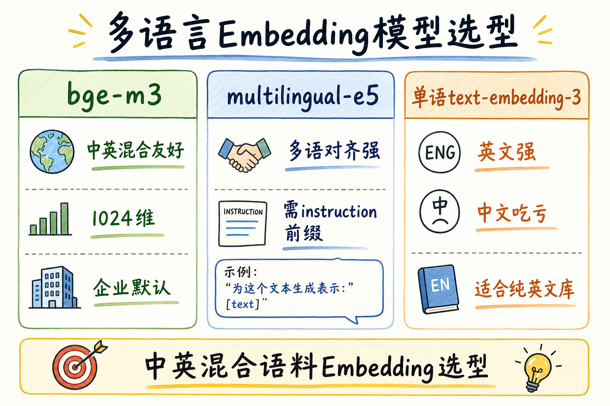
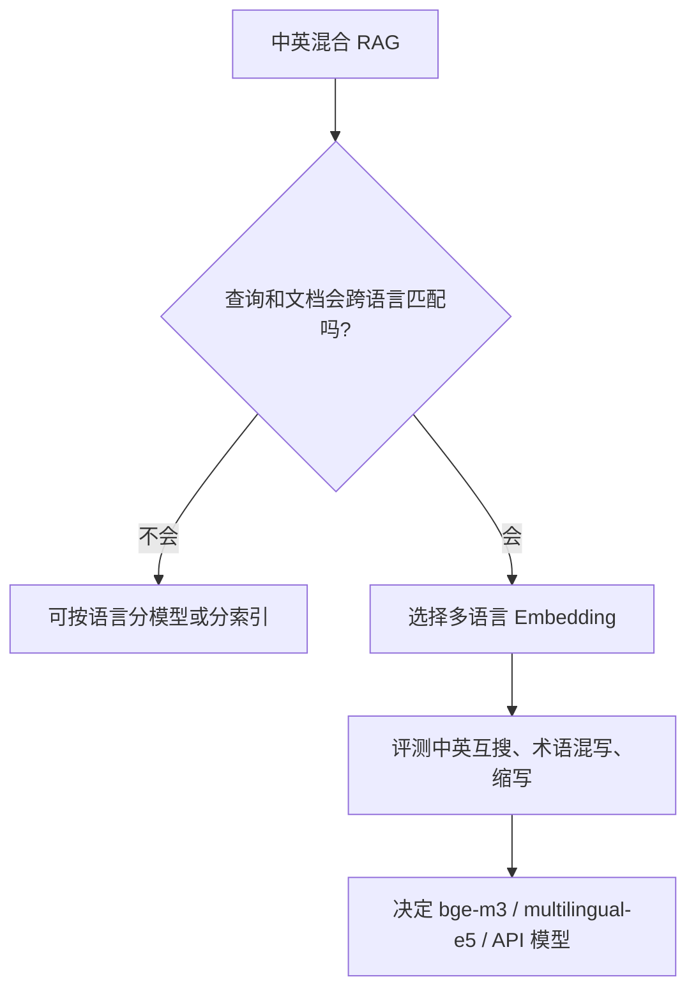
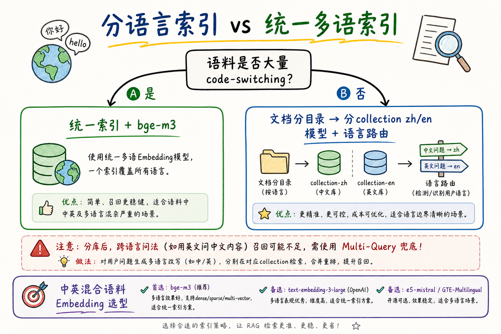
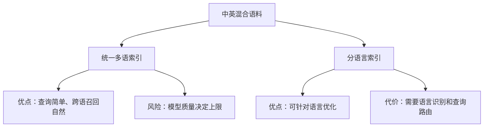
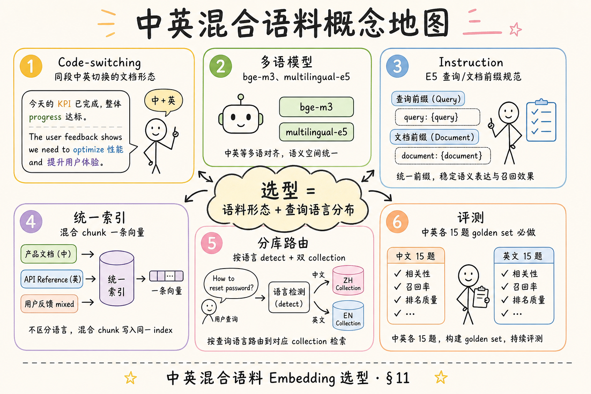
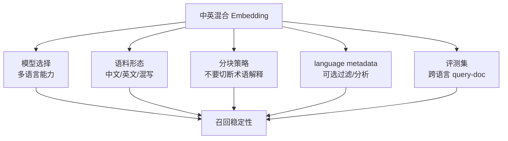

# 向量化（十）：中英混合语料 Embedding 选型完全指南

> 国内企业的知识库很少「纯中文」或「纯英文」：产品手册中英双语、Jira 里中英夹杂、合同英文条款旁注中文释义、技术文档 API 名英文而说明中文——这叫 **Code-switching**（语码转换）。用只训英文的 `text-embedding-3-small` 去 embed 整库，中文问法 Recall 掉一截；盲目上 **multilingual-e5** 又可能不懂自家 **E5 instruction 前缀** 规矩。这篇是 [企业 RAG 路线图](ENTERPRISE_RAG_ROADMAP.md) **C3 向量化地基篇**（路线图第 **87** 条），讲清 **多语模型**（bge-m3、multilingual-e5）、混合文档形态、**按语言分库 vs 统一索引** 的决策树，并给出最小评测对比脚本。前置：[25 Embedding](25.embedding-vector-tutorial.md)、[26 相似度](26.similarity-metrics-tutorial.md)、路线图 **78～80** 模型族、[41 编码检测](41.text-encoding-detection-tutorial.md)。

---

## 目录

1. [前言：「报销 policy」搜不到「差旅制度」](#1-前言报销-policy搜不到差旅制度)
2. [本文边界与动手路径](#2-本文边界与动手路径)
3. [多语言 Embedding 模型对照](#3-多语言-embedding-模型对照)
4. [混合语料长什么样](#4-混合语料长什么样)
5. [bge-m3 与 multilingual-e5 工程差异](#5-bge-m3-与-multilingual-e5-工程差异)
6. [分语言索引 vs 统一多语索引](#6-分语言索引-vs-统一多语索引)
7. [先错只对：四种选型翻车](#7-先错对对四种选型翻车)
8. [查询侧：语言检测与路由](#8-查询侧语言检测与路由)
9. [最小评测：中英各 10 题对比](#9-最小评测中英各-10-题对比)
10. [与分块、元数据的配合](#10-与分块元数据的配合)
11. [综合概念地图](#11-综合概念地图)
12. [真实语料抽样与运维清单](#12-真实语料抽样与运维清单)
13. [常见陷阱与 FAQ](#13-常见陷阱与-faq)
14. [总结与系列下一步](#14-总结与系列下一步)

---

## 1. 前言：「报销 policy」搜不到「差旅制度」

**Multilingual Embedding**（多语言嵌入）：在多种语言的文本对上训练，使「语义相同、语言不同」的句段在向量空间中靠近的表示模型。  
通俗说：**中文问「住宿标准」能找回英文写的 "hotel cap" 那段**——前提是模型和索引策略配对正确。

**Code-switching**（语码转换 / 中英夹杂）：同一段落或同一 chunk 内混用两种及以上语言，常见于外企邮件、技术博客、产品 UI 文案。  
通俗说：**一句话里既有「报销」又有 "reimbursement"**——切成纯中文库或纯英文库都会丢半边语义。

典型翻车：

> 知识库 60% 中文制度、40% 英文供应商合同；索引用英文 embedding；用户中文问「违约金上限」，Top-5 全是英文合同标题，中文细则节永远进不了 Top-20。

**读完本文，你应该能做到：**

1. 对比 **bge-m3**、**multilingual-e5**、单语 API 模型的适用场景。  
2. 识别语料中的 **code-switching** 与「按文档语言分目录」两种形态。  
3. 在 **统一索引** 与 **分 collection 按语言路由** 之间做决策。  
4. 正确配置 **E5 的 query/passage 前缀**（若选 E5 系）。  
5. 跑 §9 最小 A/B，用 20 题粗评中英 Recall。  
6. 说出 §7 四种错法：纯英模型硬上、分库却混排 chunk、忘 instruction、不做跨语言评测。

### 1.1 C3 在路线图中的位置

```text
78 OpenAI embedding
79 BGE 系列
80 E5 系列
86 API 重试与限流
87 中英混合语料 ← 本篇
88 领域评测
```

87 回答 **「同一索引里中英怎么共存」**；88 回答 **「在自家领域上哪个模型更好」**——先定语料策略，再跑 golden set。

### 1.2 术语双轨速查

| 中文 | English | 一句话 |
|------|---------|--------|
| 多语嵌入 | Multilingual Embedding | 跨语言语义对齐 |
| 语码转换 | Code-switching | 同段中英混杂 |
| 统一索引 | Unified Index | 混合 chunk 同一向量库 |
| 分库路由 | Language-routed Collections | 按语言搜不同库 |
| 查询前缀 | Query Instruction | E5 系必填格式 |
| 跨语言检索 | Cross-lingual Retrieval | 中文问英文档 |

### 1.3 读完本篇的最小交付物

1. 一张 **三模型对照** 表（§3）；  
2. 一张 **分库 vs 统一** 决策草图（§6）；  
3. **20 题** 中英混合 mini golden set 草稿；  
4. E5 **前缀模板** 贴在团队 wiki；  
5. 四条 **先错只对**（§7）。

---

## 2. 本文边界与动手路径

**档位：C3 地基篇（路线图 87）。**

**本文讲：** 混合语料形态、多语模型选型、bge-m3 vs e5 工程差异、索引架构决策、语言路由、最小评测。  
**本文不讲：** 完整 MTEB 榜单复现、多语模型微调训练、语音识别多语、翻译机替代检索方案。

### 2.1 动手路径表

| 步骤 | 你做什么 | 验收 |
|------|----------|------|
| A | 抽样 50 chunk，标是否 code-switching | 比例心里有数 |
| B | 读 §3～§5，定 2 个候选模型 | 写下理由 |
| C | 画 §6 决策树，定统一或分库 | 团队对齐 |
| D | 跑 §9 对比 Recall@5 | 有数字 |
| E | 完成 §7 先错对对 | 能口述 |

**环境：** Python 3.10+；`pip install sentence-transformers` 或 OpenAI 兼容 embed API；可选 `langdetect` 做语言检测 demo。

### 2.2 沿用前文

| 概念 | 来自 |
|------|------|
| 向量与相似度 | [25](25.embedding-vector-tutorial.md)、[26](26.similarity-metrics-tutorial.md) |
| L2 归一化 | 路线图 **83** |
| 编码与乱码 | [41 编码检测](41.text-encoding-detection-tutorial.md) |
| 结构分块 | [63 MD](63.markdown-ast-chunking-tutorial.md)、[64 HTML](64.html-dom-chunking-tutorial.md) |
| 重试限流 | [69 重试限流](69.embedding-retry-rate-limit-tutorial.md) |

---

## 3. 多语言 Embedding 模型对照

读下图，盯住「混合语料」行——那是国内 SaaS 知识库的主战场。




下面这张图说明多语言 Embedding 选型的判断路径。读图时重点看：先看语料和查询是否真的跨语言，再决定是否统一多语模型。



结论：多语言模型不是为了“看起来更全能”，而是为了让中文问题能找到英文资料、英文缩写能找到中文制度。

对照上图，展开成表：

| 模型族 | 代表 | 混合语料 | 跨语言检索 | 工程备注 |
|--------|------|----------|------------|----------|
| OpenAI | text-embedding-3-small/large | 英文强，中文段落可用但非最优 | 中英互搜中等 | API 简单，[35 篇](35.openai-compatible-api-tutorial.md) |
| BGE | **bge-m3** | **强项** | **强** | 1024 维；本地/API 均可；企业常用 |
| E5 | **multilingual-e5-base/large** | 强 | 强 | **必须** query/passage 前缀 |
| 单语中文 | bge-large-zh 等 | 纯中文好 | 英文差 | 仅适合纯中文库 |

**没有银弹**：选模型 = 看 **语料语言分布** + **用户问法语言分布** + **是否 code-switching** + **能否本地推理**（89）。

### 3.1 何时不必强行多语

- 语料与查询 **99% 同一语言**（纯中文内网制度）；  
- 英文仅附录且从不被中文问法检索；  
- 可用 **翻译查询**（中问→英搜）且延迟可接受——这是 C5 查询优化，不是本篇默认路径。

---

## 4. 混合语料长什么样

动手前先 **抽样标注**，比读十篇论文有用。

### 4.1 四类常见形态

| 类型 | 示例 | 索引暗示 |
|------|------|----------|
| A. 文档级分语言 | `/zh/制度.pdf` 与 `/en/policy.pdf` 分开 | 可分库 + 路由 |
| B. 段落级双语 | 同一 H2 下先中文后英文对照 | **统一多语** 或 parent 级双语 |
| C. Code-switching | 「请提交 expense report 并附发票」 | **必须统一多语** |
| D. 实体英文+说明中文 | `GET /v1/users` 接口描述中文 | 技术库常见，bge-m3 友好 |

### 4.2 和分块的关系

[63 篇](63.markdown-ast-chunking-tutorial.md) 按标题切时，**不要** 把中英对照表硬切成「上半中文 child、下半英文 child」——除非表格本身要求行级对齐。Code-switching 段 **保持在一个 chunk 内**，让 embedding 看见完整语义。

### 4.3 元数据记语言（可选）

```json
{
  "chunk_id": "doc1:v3:sec2:c4",
  "lang_primary": "zh",
  "lang_tags": ["zh", "en"],
  "code_switching": true
}
```

`lang_primary` 用于 **分库路由**；`code_switching` 为 true 的 chunk **不可** 只放进纯中文库。

### 4.4 典型企业语料画像（三家虚构合成）

| 公司类型 | 语料画像 | 推荐起步 |
|----------|----------|----------|
| 制造业集团 | 制度中文为主，设备手册英文 PDF | 统一 bge-m3 + 跨语言 golden |
| 跨境 SaaS | UI 文案、工单 code-switching 高 | 统一 bge-m3，勿分库 |
| 律所联盟 | 合同英译中对照，段落级双语 | parent 双语节 + 统一索引 |

画像不对，模型再贵也救不了——**先审计再选型**（§12.1）。

### 4.5 用户查询语言分布怎么采

从搜索日志统计 `query_lang`（检测 + 人工修正 100 条）：

```text
若 en_query_ratio > 30% 且 zh_corpus_ratio > 50%
  → 跨语言检索是主场景，必须 multilingual
```

别只盯着语料语言——**问法语言** 决定用户体验。

---

## 5. bge-m3 与 multilingual-e5 工程差异

二者都是混合语料热门，但 **调用形状** 不同。

### 5.1 bge-m3

- 维度 **1024**（注意与 1536 的 OpenAI 索引 **不可混用**）；  
- 多数场景 **直接 encode 原文**，无需前缀；  
- 支持 dense（本篇够用）；sparse/colbert 为进阶；  
- 本地：`sentence-transformers` 或 `FlagEmbedding`。

```python
from sentence_transformers import SentenceTransformer

model = SentenceTransformer("BAAI/bge-m3")
q = "差旅住宿上限是多少？"
doc = "Tier-1 cities: hotel cap USD 80/night excluding breakfast."
q_vec = model.encode(q, normalize_embeddings=True)
d_vec = model.encode(doc, normalize_embeddings=True)
```

### 5.2 multilingual-e5

E5 训练时区分 **查询** 与 **文档**，前缀错误等于白训：

```python
def e5_query(text: str) -> str:
    return f"query: {text}"

def e5_passage(text: str) -> str:
    return f"passage: {text}"

# 入库 embed passage；在线查询 embed query
```

**先错只对**：入库和查询都裸文本、不加前缀 → 跨语言 Recall 莫名低于榜单。  
团队 wiki 应贴 **两行模板**，写进 embed 封装，别靠人记。

### 5.3 本地部署 bge-m3 的最低工程清单

| 项 | 说明 |
|----|------|
| GPU | 16GB+ 显存较稳；CPU 可跑但慢 |
| 批大小 | 从 8 起调，防 OOM |
| 归一化 | `normalize_embeddings=True` |
| 版本锁定 | `model revision` 写进索引元数据 |
| 与 API 混用 | **禁止** 同一 collection 混 API 与本地向量 |

本地无 429，但 [69 重试](69.embedding-retry-rate-limit-tutorial.md) 的 **checkpoint 幂等** 仍需要——机器也会重启。

### 5.4 API vs 本地

| | API（OpenAI 等） | 本地 bge-m3 |
|--|------------------|-------------|
| 混合语料 | 3-small 可起步 | m3 常更稳 |
| 成本 | 按 token | GPU/CPU 固定 |
| 限流 | [69 篇](69.embedding-retry-rate-limit-tutorial.md) | OOM 与 batch |
| 换模型 | 重建索引 | 重建索引 |

---

## 6. 分语言索引 vs 统一多语索引

读决策图前，记住：**code-switching 比例 > 15%** 时，分库风险急剧上升（经验起点，务必用自家数据验证）。




下面这张图对比“分语言索引”和“统一多语索引”。读图时重点看：统一索引使用简单，分语言索引可控但路由更复杂。



结论：多数初学者项目先用统一多语索引更稳。只有当某种语言效果明显拖后腿时，再考虑分语言索引。

对照上图：

### 6.1 统一多语索引（推荐默认）

**适用：**

- 大量 code-switching；  
- 用户中文问、库中英混排；  
- 希望 **一套运维、一套评测**。

**做法：** 选一个多语模型（常 **bge-m3**），全库同一 collection，query 与 doc **同一套 encode 规则**。

### 6.2 分 language collection + 路由

**适用：**

- 文档 **物理分离**（`/zh`、`/en`），且 chunk **极少混排**；  
- 中文库要极致中文 Recall，英文库用英文优化模型；  
- 查询语言可检测且与文档语言 **强相关**。

**做法：**

```text
detect(query_lang)
  zh → search collection_zh (bge-large-zh)
  en → search collection_en (e5-large-en)
  mixed → search collection_multilingual (bge-m3)  # 兜底
```

**陷阱**：中文用户问英文缩写「SLA penalty」——纯中文库可能全灭；兜底 collection 或 **Multi-Query**（路线图 118）要有。

### 6.3 决策清单（打勾）

- [ ] 抽样 code-switching 比例？  
- [ ] 用户查询跨语言比例？  
- [ ] 能否接受 **两套 embed 流水线**？  
- [ ] 评测集是否含 **中问英档、英问中档**？  
### 6.4 混合查询的 Multi-Query 兜底（路线图 118）

当用户问法 **无法被语言检测**（全英文缩写 + 中文语境）时，可生成两条 query 并行检索：

```text
原问: 「报销 SLA 怎么算」
  → q_zh: 「报销服务等级违约怎么计算」
  → q_en: 「reimbursement SLA penalty calculation」
```

两路结果 RRF 融合——比单路检测错语言更稳，代价是 **双倍 embed 查询成本**（在线侧）。入库侧仍建议 **统一多语索引** 减复杂度。

### 6.5 产品文档里的「双语标题」策略

很多 SaaS 帮助中心标题写成：

```markdown
## 配置 Webhook | Configure Webhook
```

这类标题对 **统一多语模型** 极友好——child chunk 带双语标题前缀（路线图标题增强）时，用户无论中英问法都更容易命中。  
**不要** 把中文标题章只 embed 中文、英文标题章只 embed 英文，若正文混排。

### 6.6 外资子公司场景：合规语言要求

部分合规要求 **用户语言=回答语言**。Embedding 层仍可统一多语检索，但 **生成侧** 要约束输出语种——检索策略与生成策略 **解耦**。选型评测时应用 **用户实际问法语言** 写 query，别只用一种语言写 golden set。

---

## 7. 先错只对：四种选型翻车
中英混合检索最怕把“语言问题”误判成“向量检索天然不准”。下面几种错法分别对应模型选错、分库策略过重、评测集缺失和分块破坏语义，读完要能反问自己：我的语料到底是中文为主、英文为主，还是大量混写？

### 7.1 错：纯英文 embedding 索引中文为主库

Recall 掉、团队怪「向量检索不行」——先换多语模型再调 chunk size。

### 7.2 错：code-switching chunk 只入中文库

半句英文的语义被截断；检索「API rate limit」命中失败。  
**对**：混合段进 **多语统一库**。

### 7.3 错：E5 不加 query/passage 前缀

榜单很高、自家很低——先查前缀再怪模型。

### 7.4 错：分库却无语言兜底

检测错语言 → 搜空 collection → 用户看「没有答案」。  
**对**：默认 **multilingual 兜底** 或双库 merge RRF（路线图 111）。

---

## 8. 查询侧：语言检测与路由

**Language Detection**（语言检测）：Guess 查询文本主语言，用于选 collection 或调权重。  
通俗说：**看用户问的是中文还是英文，决定去哪个书架找**。

```python
from langdetect import detect, LangDetectException

def route_collection(query: str) -> str:
    try:
        lang = detect(query)
    except LangDetectException:
        return "multilingual"
    if lang.startswith("zh"):
        return "zh"
    if lang == "en":
        return "en"
    return "multilingual"
```

### 8.1 检测不可靠的场景

- 极短查询：「SLA」「OKR」；  
- 纯数字/型号：「A100 显存」；  
- 拼音混输。

策略：**短 query 直接搜 multilingual**；或 **并行搜 zh+en 再 RRF 融合**（多一倍延迟，换 Recall）。

### 8.2 与 HyDE、改写的关系

[路线图 119 HyDE](ENTERPRISE_RAG_ROADMAP.md) 生成假想英文档时，若库是中文，会伤检索——混合库要先统一 **生成语言策略**，本篇不展开，但选型时要知会 C5 同事。

---

## 9. 最小评测：中英各 10 题对比

[88 领域评测](71.domain-embedding-evaluation-tutorial.md) 会讲完整 golden set；此处 **20 题快测** 够筛模型。

### 9.1 构造 mini set

| id | query_lang | query | relevant_chunk 摘要语言 |
|----|------------|-------|-------------------------|
| q01 | zh | 一线城市住宿标准 | zh 段含金额 |
| q02 | en | hotel cap tier-1 | en 段含 USD |
| q03 | zh | 违约金怎么算 | en 合同中的 penalty 段 |
| … | … | … | … |

至少含：**5 条同语言**、**5 条跨语言**、**5 条 code-switching chunk**。

### 9.2 评测脚本骨架

```python
import numpy as np
from sentence_transformers import SentenceTransformer

def cosine(a, b):
    return float(np.dot(a, b))

def recall_at_k(queries, corpus_chunks, relevant_map, model, k=5, e5=False):
    if e5:
        encode_q = lambda t: model.encode(f"query: {t}", normalize_embeddings=True)
        encode_d = lambda t: model.encode(f"passage: {t}", normalize_embeddings=True)
    else:
        encode_q = encode_d = lambda t: model.encode(t, normalize_embeddings=True)

    doc_vecs = [encode_d(c["text"]) for c in corpus_chunks]
    doc_ids = [c["chunk_id"] for c in corpus_chunks]
    hits = 0
    for qid, qtext in queries:
        qv = encode_q(qtext)
        scores = [(cosine(qv, dv), did) for dv, did in zip(doc_vecs, doc_ids)]
        scores.sort(reverse=True)
        topk = {did for _, did in scores[:k]}
        if relevant_map[qid] & topk:
            hits += 1
    return hits / len(queries)

# 对比 bge-m3 vs multilingual-e5-base，同一 corpus
```

### 8.3 在线检索路径的统一 encode

```python
def encode_query(text: str, model_kind: str) -> np.ndarray:
    if model_kind == "e5":
        return model.encode(f"query: {text}", normalize_embeddings=True)
    return model.encode(text, normalize_embeddings=True)
```

**入库** 与 **查询** 必须用同一套规则——有人改前缀只改一半，会出现「离线评测 0.8、线上 0.5」的灵异现象。

### 8.4 混合语料下的 BM25 互补（路线图 110）

纯向量对 **罕见英文缩写** 有时弱于 BM25。中英混合库可考虑 **hybrid**：

```text
final_score = α * dense_score + (1-α) * bm25_score
```

α 用 20 题 mini set 粗调（0.6～0.8 常见）。混合语料不是「只能向量」——英文 token 精确匹配仍是便宜信号。

### 9.3 评测结果记录表（建议）

| model | R@5 | R@10 | cross-lingual R@5 | 延迟 ms | 备注 |
|-------|-----|------|-------------------|---------|------|
| bge-m3 | | | | | |
| e5-base | | | | | 前缀已加 |

**cross-lingual** 列单独填——总体 Recall 掩盖跨语言短板。

---

## 10. 与分块、元数据的配合
多语 Embedding 不是只换一个模型就结束。分块时要避免把英文术语和中文解释切散，metadata 要记录语言特征，标题前缀也可以保留双语线索；这些配合能让召回、过滤和排障都更稳定。

### 10.1 标题前缀（路线图 标题增强）

中英混合 parent 的 **section 标题** 可双语并列写入 child 前缀：

```text
[差旅规范 | Travel Policy] 一线城市住宿上限 …
```

对 code-switching 正文帮助有限，但对 **目录级** 检索仍有加成。

### 10.2 勿按语言切 chunk

错：见英文就切开 → 两个 child 语义不完整。  
对：**语义完整优先**（[61 chunk size](61.chunk-size-tradeoff-tutorial.md)），语言是属性不是切刀。

### 10.3 ACL 与多语

[53 ACL](53.metadata-acl-tutorial.md) 过滤与语言无关——但 **德语法务库** 与 **中文销售库** 可能应用不同 collection + ACL 组合，避免一库万能。

---

## 11. 综合概念地图

读下图时，先看「中英混合语料概念地图」想表达的主线：它把本节的概念关系压缩成一张可对照的图。




下面这张概念地图总结中英混合 Embedding 的关键检查点。读图时重点看：模型、分块、语言 metadata 和评测集要一起设计。



结论：中英混合不是只换模型。没有针对跨语言问法的评测集，就无法判断模型是否真的适合你的业务。

对照上图：**语料形态 → 模型 → 索引架构 → 20 题评测** 四步闭环。

---

## 12. 真实语料抽样与运维清单
上线前不要只看几条人工挑选的漂亮样例。真实语料抽样的目的，是确认库里到底有多少中文、英文、代码、缩写和混写句；运维清单则把这些发现转成可持续检查的指标。

### 12.1 五分钟语料审计脚本

```python
import re
from collections import Counter

def audit_corpus(chunks):
    stats = Counter()
    for c in chunks:
        t = c["text"]
        has_zh = bool(re.search(r"[\u4e00-\u9fff]", t))
        has_en = bool(re.search(r"[A-Za-z]{3,}", t))
        if has_zh and has_en:
            stats["code_switching"] += 1
        elif has_zh:
            stats["zh_only"] += 1
        elif has_en:
            stats["en_only"] += 1
        else:
            stats["other"] += 1
    return stats
```

跑完看 `code_switching / total`：超过 **15%** 强烈建议统一多语索引（§6 经验起点）。

### 12.2 维度与存储（衔接路线图 82）

| 模型 | 维度 | 百万 chunk 粗算存储（仅向量） |
|------|------|------------------------------|
| text-embedding-3-small | 1536 | ~6 GB float32 |
| bge-m3 | 1024 | ~4 GB |
| multilingual-e5-large | 1024 | ~4 GB |

混合语料选型 **别只看 Recall**——维数影响 [82 存储成本](ENTERPRISE_RAG_ROADMAP.md) 与 ANN 内存。两模型 Recall 打平时，选 **维数更低且运维成熟** 的。

### 12.3 L2 归一化一致性

[83 L2 归一化](ENTERPRISE_RAG_ROADMAP.md) 后 cosine 与内积等价（[26 篇](26.similarity-metrics-tutorial.md)）。bge-m3、e5 本地推理时设 `normalize_embeddings=True`；API 模型按厂商文档。  
**中英混合库** 若一边归一化一边未归一化，跨语言分数 **不可比**——评测会骗人。

### 12.4 入库流水线中的语言字段

```json
{
  "chunk_id": "handbook:v2:travel:c3",
  "text": "一线城市 Tier-1 hotel cap 500 CNY/night",
  "metadata": {
    "lang_primary": "zh",
    "lang_tags": ["zh", "en"],
    "code_switching": true
  }
}
```

后续 [105 Metadata Filter](ENTERPRISE_RAG_ROADMAP.md) 可按 `lang_primary` 缩小搜索空间——但 **code_switching=true 的 chunk 别只用 zh filter 排除英文关键词**。

### 12.5 与 OCR / 扫描件（路线图 62）

扫描 PDF OCR 后常出现 **中英标点混用、识别错字**。多语模型对轻微 OCR 噪声有一定容忍，但 golden set 应含 **OCR 错题** 测稳健性——这是 [88 篇](71.domain-embedding-evaluation-tutorial.md) 的延伸，选型时预留 5 题 OCR 边界案例。

### 12.6 企业沟通：何时坚持统一索引

给法务/财务解释时：

> 「合同里中英在同一段的，必须同一个搜索引擎看见整段；拆成中文库、英文库会像把一张支票撕成两半，只拿一半去银行兑现。」

### 12.7 分库场景下的运维双倍成本

两套 collection = 两套 embed 任务、两套监控、两套评测子集。除非 **Recall 提升 >5%** 且 **语料确实分离**，否则统一索引的 **运维税** 更低。

### 12.8 读路径自检（8 题）

1. code-switching 定义？  
2. bge-m3 与 e5 前缀差异？  
3. 何时分库、何时统一？  
4. 短 query 语言检测不准怎么办？  
5. 维数对存储的影响？  
6. 跨语言评测最少几题？  
7. 翻译整库 vs 多语 embed？  
8. 换模型后索引要做什么？

---

## 13. 常见陷阱与 FAQ
FAQ 用来处理选型时最常见的摇摆：要不要全库翻译、要不要分语言建索引、中文查询能不能搜英文资料。判断标准不是“哪种更高级”，而是数据比例、用户查询习惯、成本和评测结果。

### 13.1 翻译整个库再 embed 行不行？

可行但贵、且翻译失真（条款编号、专有名词）；**多语 embed** 通常更便宜。翻译更适合 **查询侧** 小文本。

### 13.2 bge-m3 和 bge-large-zh 能混维吗？

不能同一 collection；可分库，但查询要路由，见 §6。

### 13.3 用户全中文，库 30% 英文合同要不要管？

要：中文问「进口合同 liability limit」会跨语言——**统一多语** 或 **英库兜底**。

### 13.4 简体繁体？

multilingual 模型多数能部分处理；若繁体为主，抽样评测 **简繁互搜** 再定。

### 13.5 和 88 领域评测关系？

本篇定 **候选 2～3 个**；88 用 **30～100 题 golden set** 在真实 chunk 上定稿。

---

## 14. 总结与系列下一步

1. **先看语料形态**——code-switching 高则 **统一多语索引** 是默认。  
2. **bge-m3** 工程简单；**multilingual-e5** 强但 **前缀不能错**。  
3. **分库要兜底**——检测错语言不能搜空。  
4. **评测必须含跨语言题**——同语言榜高不代表混合库好用。  
5. 分块 **按语义不切语言**；元数据 `lang_tags` 辅助路由。

### 14.1 系列下一步

| 目标 | 阅读 |
|------|------|
| 领域 golden set 评测 | [71 domain-eval](71.domain-embedding-evaluation-tutorial.md) |
| API 重试限流 | [69 retry](69.embedding-retry-rate-limit-tutorial.md) |
| 相似度与归一化 | [26](26.similarity-metrics-tutorial.md)、路线图 **83** |

### 14.2 学习目标自检

- [ ] 能解释 code-switching 与分库风险  
- [ ] 能写出 E5 query/passage 前缀  
- [ ] 能画统一 vs 分库决策  
- [ ] 能跑 §9 对比两模型 Recall@5  

### 14.3 面试 30 秒版

「混合语料先看 code-switching 比例；高则 bge-m3 统一索引；文档物理分语言且少混排可分 zh/en collection 加 multilingual 兜底；E5 必须 query/passage 前缀；评测要有中问英档与英问中档。」

### 14.4 动手作业

1. 抽样 100 chunk 标 `code_switching` 比例；  
2. 写 20 题 mini golden set；  
3. 对比 bge-m3 与 multilingual-e5-base 的 Recall@5；  
4. 写一段团队 **选型结论**（模型 + 统一/分库 + 理由）。

### 14.5 附录：20 题 mini golden set 模板

| query_id | lang | query | 期望命中类型 |
|----------|------|-------|--------------|
| m01 | zh | 出差住宿一晚多少钱 | zh 金额段 |
| m02 | en | business travel hotel limit | en policy 段 |
| m03 | zh | SLA 违约赔偿怎么算 | en SLA 段（跨语言） |
| m04 | zh | 报销需要哪些 attachment | code-switching 段 |
| m05 | en | 年假 carry over 规则 | 混合段 |
| m06 | zh | API 限流 RPM 多少 | 技术中英混排 |
| m07 | en | 社保公积金比例 | zh 制度段（跨语言） |
| m08 | zh | force majeure 定义 | 合同英文术语 |
| m09 | en | 试用期解除条件 | zh 劳动法段 |
| m10 | zh | Kubernetes 资源 quota | 技术英文实体 |

复制表进表格工具，补 `relevant_chunk_id` 列即可开测。

### 14.6 附录：OpenAI API 混合库起步配置

若团队已标准化 OpenAI 兼容网关、暂不想本地 GPU：

```bash
OPENAI_EMBED_MODEL=text-embedding-3-small
# 混合语料可先用；若 20 题跨语言 Recall 低，再换 bge-m3 本地或托管
```

**起步策略**：3-small 跑通流水线 → 20 题评测 → 不达标再上 bge-m3。避免第一天就堆复杂度。

### 14.7 附录：RRF 双库融合（了解）

分库时可将 zh、en 两路 Top-20 用 [RRF（111）](ENTERPRISE_RAG_ROADMAP.md) 融合：

```text
score_rrf(d) = Σ 1 / (k + rank_i(d))   # k 常取 60
```

融合后 **跨语言** 候选可同时出现——延迟翻倍，作为 **兜底通路** 而非默认。

### 14.8 C3 周计划：86→87→88

| 天 | 任务 |
|----|------|
| Mon | [69 重试限流](69.embedding-retry-rate-limit-tutorial.md) 跑通 embed |
| Tue | 本篇语料审计 + 定统一/分库 |
| Wed | 20 题 mini 评测两模型 |
| Thu | [88 篇](71.domain-embedding-evaluation-tutorial.md) 扩到 50 题 |
| Fri | 选型签字 + 排重建索引 |

### 14.9 团队 Review 清单（混合语料 PR）

- [ ] 语料 code-switching 比例已记录  
- [ ] 选定模型及 encode 规则（含 E5 前缀）  
- [ ] 统一索引或分库+兜底已文档化  
- [ ] 评测含跨语言子集  
- [ ] 维数与存储评估已完成  

中英混合不是「选一个最贵的多语模型」——是 **看清语料长什么样、问法怎么来、索引怎么收** 的三位一体决策。

### 14.10 常见混合语料问答（扩展）

**Q：外企总部英文制度，中国区中文 FAQ，怎么建？**  
A：若 FAQ 与制度 **段落级对应**，parent 双语节 + 统一 bge-m3；若完全独立文档树，可分 **zh FAQ / en policy** 两 collection，查询 **detect + 兜底 multilingual**。

**Q：代码注释英文、说明中文的技术库？**  
A：典型 code-switching，**统一索引**；chunk 保持 [76 代码块完整](ENTERPRISE_RAG_ROADMAP.md)，别只 embed 注释不 embed 签名。

**Q：用户全英文问，库全中文，要不要翻译库？**  
A：优先 **multilingual embed 跨语言检索**；整库翻译成本高且失真。评测用 **全英文 query 子集** 验证 Recall。

**Q：上线后能否中途从分库改统一库？**  
A：可以，但需 **全量重 embed + 重建索引**——排期当作小版本发布，用 [88 golden set](71.domain-embedding-evaluation-tutorial.md) 验收不退步。

### 14.11 混合语料与 34 Grounding 的衔接

检索命中 code-switching chunk 后，[34 Grounding](34.grounding-citation-tutorial.md) 引用 UI 应显示 **用户偏好的语言摘要**（若生成模型做了翻译总结），但 **chunk_id 溯源** 仍指向原文——多语检索不改变「引哪段」。产品评审时确认：**引用片段** 可含中英，**链接** 回到源文档页码（[52 source/page](52.metadata-source-page-tutorial.md)）。

### 14.12 维数迁移的灰度策略

从 1536 维 OpenAI 迁到 1024 维 bge-m3：  
1. 新 collection 并行建索引；  
2. 20 题 mini + 50 题 golden 验收；  
3. 查询 **双读** 一周（影子流量比分数）；  
4. 切主读新库，旧库保留 rollback 窗口。  
避免周五切库周一才发现跨语言 Recall 崩。

### 14.13 与 69 限流联调

混合语料若选 **API embed**，[69 重试限流](69.embedding-retry-rate-limit-tutorial.md) 与 **多语长 chunk** 叠加更易撞 TPM——夜间入库前用 **语料 token 抽样** 估算总 TPM，调低 `max_workers` 比白天撞 429 再救火省事。

### 14.14 后记：混合语料是常态不是例外

国内 ToB 知识库 **纯单语** 反而少见。把 87 当作 C3 默认必修课：先审计语料、再选模型、再定索引，最后用 88 签字——三步缺一，上线后就会用 **「向量不行」** 背锅，而根因常在 **索引策略** 不在模型。读完本篇请立刻做 **100 chunk 审计** 和 **20 题 mini 评测**，别停在「懂了」。

### 14.15 FAQ 补充

**中日韩混排怎么办？** multilingual 模型多数能部分处理日韩，但 **必须** 用含日韩的 golden 子集测；不要从中文中英经验直接外推。  
**繁体用户、简体语料？** 抽样简繁互搜；若港台用户多，考虑繁体标注的 10 题子集。  
**能否按段落语言切 chunk？** 不推荐——一切语言就碎语义；用多语模型统一 encode 整段更稳。混合语料选型的终点是 **可重复的 20 题数字**，不是 PPT 上的模型 Logo。动手跑完再开会。87 与 88 之间 **不要跳步**：没有 golden set 的模型偏好，只是个人口味。先 20 题，再 50 题，数字说话。

---

> **初学者可能仍困惑的点**  
> - 多语模型 ≠ 翻译机——它是对齐 **语义空间**，不是生成译文。  
> - 分库不是「更专业」——混排语料分库往往 **更差**。  
> - OpenAI 3-small 能用的混合库，不代表 **最优**——用 20 题测一下再定。  
> - 换多语模型仍要 **全量重建索引**（[25 篇](25.embedding-vector-tutorial.md)）。
