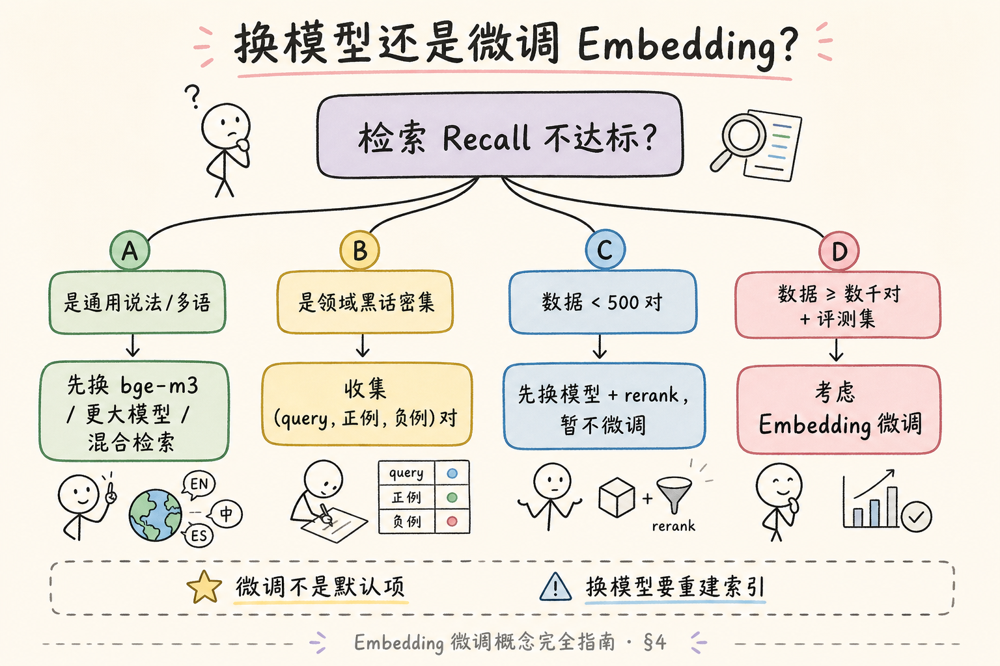
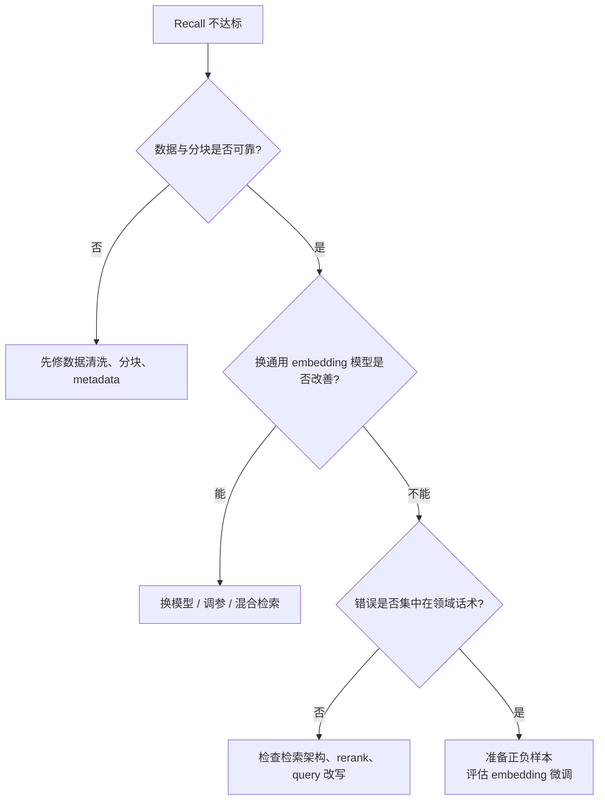
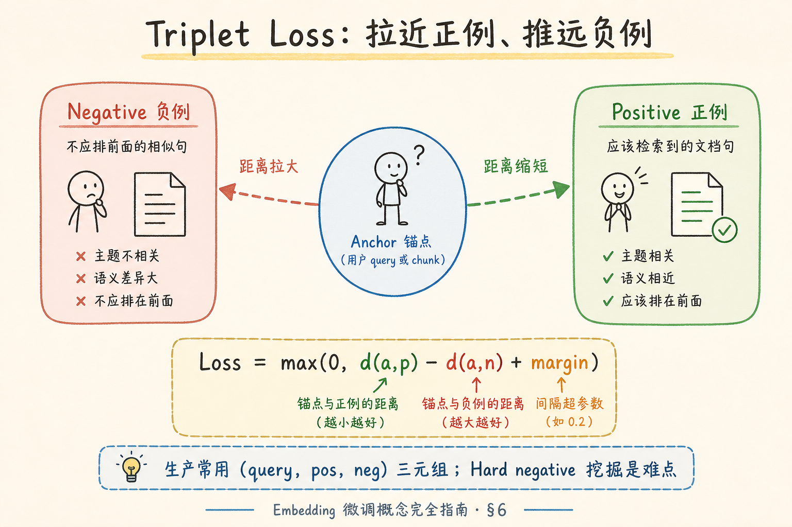
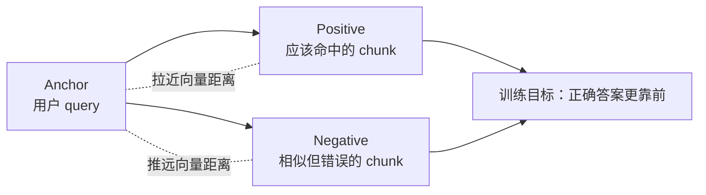
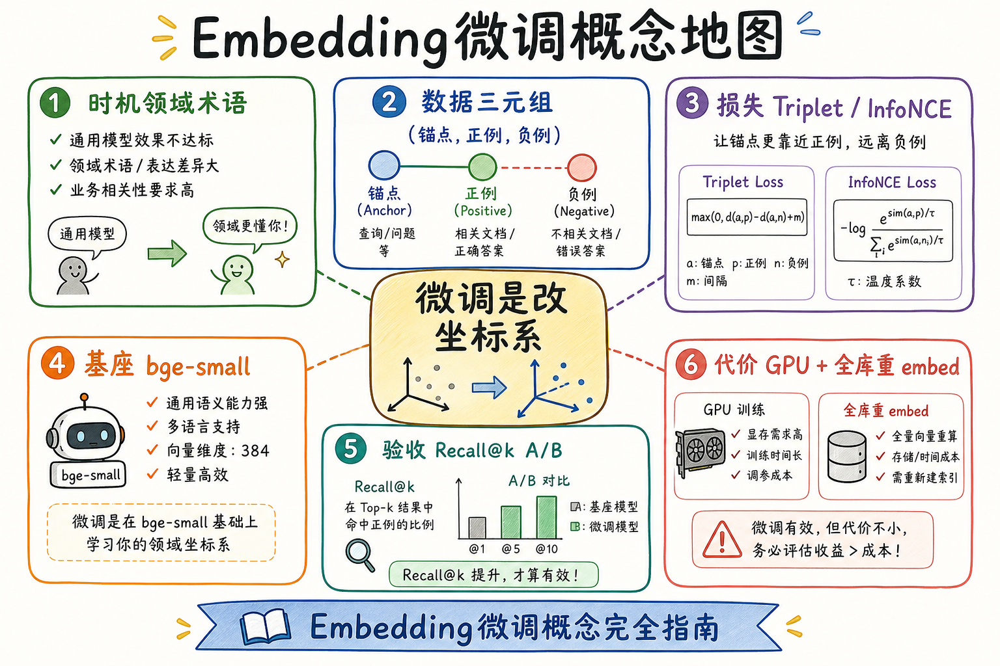
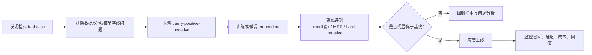

# C3 向量化（十三）：Embedding 微调概念完全指南

> [72 本地 Embedding 推理](72.local-embedding-inference-tutorial.md) 带你用 **现成 BGE 权重** 在本机 `encode`；[88 领域专用 Embedding 评估](ENTERPRISE_RAG_ROADMAP.md)（路线图）教你 **用评测集选模型**。但当换遍 `bge-small` / `bge-m3` / 混合检索后，Recall 仍卡在 **行业黑话、内部 SKU、工单口语** 上，有人会提议：**微调 Embedding**。这篇是 [企业 RAG 路线图](ENTERPRISE_RAG_ROADMAP.md) **C3 收束/进阶篇**（路线图第 **90** 条）：**不讲完整训练教程**，而讲清 **何时微调 vs 换模型**、**Triplet Loss** 直觉、**数据要多少**、**决策树** 与 **工程代价**——让你能参加评审会说「先别训」。前置：[25 Embedding](25.embedding-vector-tutorial.md)、[72 本地推理](72.local-embedding-inference-tutorial.md)、[24 预训练与微调](24.pretrain-finetune-tutorial.md)；延伸 [74 对比学习](74.contrastive-learning-tutorial.md)。

---

## 目录

1. [前言：微调不是默认选项](#1-前言微调不是默认选项)
2. [本文边界与学习目标](#2-本文边界与学习目标)
3. [Embedding 微调在改什么](#3-embedding-微调在改什么)
4. [换模型 vs 微调：决策树](#4-换模型-vs-微调决策树)
5. [什么时候该考虑微调](#5-什么时候该考虑微调)
6. [Triplet Loss 与训练数据形态](#6-triplet-loss-与训练数据形态)
7. [数据量、质量与 Hard Negative](#7-数据量质量与-hard-negative)
8. [微调流程概览（概念级）](#8-微调流程概览概念级)
9. [代价、风险与替代方案](#9-代价风险与替代方案)
10. [先错后对：四种常见误区](#10-先错对对四种常见误区)
11. [综合概念地图](#11-综合概念地图)
12. [常见陷阱与 FAQ](#12-常见陷阱与-faq)
13. [总结与系列下一步](#13-总结与系列下一步)

---

## 1. 前言：微调不是默认选项

RAG 检索不达标时，团队的「冲动顺序」常常是：

1. 调 chunk 大小（[61 篇](61.chunk-size-tradeoff-tutorial.md)）  
2. 换 Embedding 模型（路线图 78～79）  
3. 上混合检索 / rerank（C4）  
4. **「我们微调一个吧」**

第 4 步 **往往最贵、最慢、最容易过度承诺**——却不是不能做的事。问题是：**很多人把微调当成调参旋钮**，而不是 **改整个语义坐标系的重工程**。

**Embedding 微调**（Embedding Fine-tuning）：在已有句向量模型（如 BGE）权重上，用 **领域相关的 (query, 正例, 负例)** 等监督信号继续训练，使 **业务问法** 与 **应召回 chunk** 在向量空间中更近。  
通俗说：**给编目员补一门「你们公司方言课」**——学完后同一句话的坐标会变，**全书要重贴标签**（全库重 embed）。

**读完本文，你应该能做到：**

1. 用 §4 决策树判断 **先换模型还是先微调**。  
2. 解释 **Triplet Loss**「拉近正例、推远负例」在检索里的含义。  
3. 列出微调所需的 **最低数据形态与规模直觉**。  
4. 说明微调后的 **验收指标**（Recall@k，同一评测集 A/B）。  
5. 识别 §10 四种「不该微调却微调」的误区。  
6. 知道完整训练脚本应查 **sentence-transformers 官方 fine-tune 文档**，本篇不替代。

### 1.1 与 Chat 微调的分工

| | Chat / 生成模型微调 | Embedding 微调 |
|--|---------------------|----------------|
| 改什么 | 答案怎么说 | **谁该被检索到** |
| 典型数据 | 指令-回答对 | query-文档对、三元组 |
| 失败表现 | 胡说、格式错 | **该进的进不来、不该进的排前面** |
| RAG 顺序 | 检索对了再谈 | **检索层**；生成再好也救不了漏召回 |

[24 篇](24.pretrain-finetune-tutorial.md) 的「预训练 + 微调」大框架适用；本篇只钉 **检索侧 embedding**。

### 1.2 C3 进阶在路线图中的位置

```text
89 本地推理（跑通现成权重）
90 Embedding 微调概念 ← 本篇（收束/进阶 · 决策）
91 对比学习（了解损失函数背景）
92～ 向量库与混合检索
```

---

## 2. 本文边界与学习目标

**档位：C3 收束/进阶篇（路线图 90）。**

**本文讲：** 动机、换模型 vs 微调决策树、Triplet 直觉、数据需求、流程概览、代价与替代、误区。  
**本文不讲：** 完整 PyTorch 训练循环、分布式 DeepSpeed 配置、每个 loss 的梯度推导、自动 hard negative 挖掘算法细节。

**动手预期：** 读完能 **写一页评审 memo**（是否微调、要什么数据、如何验收）；**不要求** 本周训出 checkpoint。

### 2.1 阅读路径

| 步骤 | 内容 | 验收 |
|------|------|------|
| A | §4 决策树，对自家项目走一遍 | 写出「暂微调」理由 |
| B | §6 Triplet 图，用自己的 query 举例 | 能指 anchor/pos/neg |
| C | §7 估数据：现有多少 labeled 对 | 数量级 |
| D | §9 列替代方案是否未穷尽 | 至少 2 条 |
| E | §11 概念地图 + §13 自检 | 面试能讲 1 分钟 |

### 2.2 沿用前文

| 概念 | 来自 |
|------|------|
| 换模型要重建索引 | [25 Embedding](25.embedding-vector-tutorial.md) |
| 本地加载与 encode | [72 本地推理](72.local-embedding-inference-tutorial.md) |
| 预训练/微调框架 | [24 预训练与微调](24.pretrain-finetune-tutorial.md) |
| 评测 Recall | 路线图 **88** |
| 对比学习损失 | [74 对比学习](74.contrastive-learning-tutorial.md) |

---

## 3. Embedding 微调在改什么

[25 篇](25.embedding-vector-tutorial.md) 说过：Embedding 模型把文本映射到 **固定维向量**，检索靠 **近邻**。预训练模型（BGE、E5）在 **大规模通用语料** 上学过「语义相近则靠近」。

微调 **不改动** 向量维度、不改动 tokenizer 词表（通常）；**改动** 的是权重矩阵，使得：

- 「工单里的口语问法」靠近「制度 PDF 里的正式条款」；  
- 「错误但相似的 SOP」在空间里 **被推开**。

因此：

1. **微调后向量与微调前不可混用**——必须 **全库重 embed**（与换模型同级）。  
2. **评测必须同一 hold-out 集** 做 A/B，不能只看「感觉好了」。  
3. **过拟合** 风险：记住训练集问法，对新问法泛化差。

---

## 4. 换模型 vs 微调：决策树

读下图，从「Recall 不达标」出发走分支——**默认先走左边（换模型与检索架构）**。微调是更重的工程动作，只有在问题确实来自领域语义不匹配时才值得做。






上图给出的实用结论是：微调不是第一反应。先确认数据、分块、基线模型、混合检索和 rerank 都做过，再判断是否真的需要训练自己的 embedding。

对照上图可以得出一个实用结论：先确认「换模型 vs 微调」里的主流程，再去调整具体参数或实现细节。

### 4.1 决策树（文字版，可贴 wiki）

```text
检索 Recall@k 未达标？
├─ 是否已试：chunk 调参 + 混合检索 + rerank？
│   └─ 否 → 先做（成本低）
├─ 错误类型是「通用同义改写」还是「领域术语」？
│   ├─ 通用 → 换更大/多语模型（bge-m3 等），重建索引
│   └─ 领域 → 继续下支
├─ 是否有 ≥ 数百～数千 条「query → 应命中 chunk」标注？
│   ├─ 否 → 先积累日志 + 人工标注；或 query 改写 / 同义词表
│   └─ 是 → 继续下支
├─ 换模型 + rerank 后评测仍显著低于目标？
│   ├─ 否 → 不微调
│   └─ 是 → 评估 GPU/人力 → 可立项 Embedding 微调 PoC
└─ PoC 验收：同一评测集 Recall@k 提升 ≥ 团队约定阈值（如 +5pt）
```

**铁律：微调是 **分支末端**，不是捷径。**

### 4.2 与「换模型」对比表

| 维度 | 换开源模型 | Embedding 微调 |
|------|------------|----------------|
| 数据需求 | 无（零样本） | **成对/三元组** 监督 |
| 工程 | 重 embed + 配置 | 训练 pipeline + 重 embed |
| 风险 | 可能仍不懂黑话 | 过拟合、负例质量差 |
| 周期 | 天～周 | 周～月（含标注） |
| 适合 | 通用语义、多语 | **域内话术、SKU、法规编号** |

### 4.3 白板演练：走一遍决策树

**设定**：Recall@5=0.52，目标 0.70；已用 bge-small-zh；chunk 为 H2 结构分块；hybrid 未上。

1. hybrid 未试 → **先上 BM25+向量**（不是微调）。  
2. 上新后 0.61；错例多为「内部项目代号 ALP-7」→ 术语问题。  
3. 标注仅 120 对 → **继续标 + 实体表**，暂不微调。  
4. 标到 800 对，rerank 后 0.66 → 仍差 → **立项微调 PoC**。  

把自家数字代入 §4 树，比抽象读一小时更有用。

---

## 5. 什么时候该考虑微调
Embedding 微调解决的是“通用模型不懂你的领域相似性”。真正决定效果的不是训练命令，而是正样本、难负样本和评测集是否能反映真实检索场景。

### 5.1 典型「值得讨论微调」的信号

1. **评测集上错例聚类**：大量是「内部缩写 / 产品代号 / 条款编号」——换 BGE-m3 仍错。  
2. **用户问法与文档写法系统性错位**：工单口语 vs 书面制度（[31 Few-shot](31.few-shot-prompting-tutorial.md) 救生成，救不了漏召回）。  
3. **已有历史检索日志 + 点击/人工标注**：能构造 **query–正例** 对。  
4. **合规允许** 用业务文本训练（脱敏后）在 **内网 GPU** 上跑。

### 5.2 典型「不该先微调」的信号

1. **总 chunk 数很少**，错因是 **切块把答案切断**（[65 Parent-Document](65.parent-document-retriever-tutorial.md)）。  
2. **还没固定 Embedding 模型与评测集**——每周换模型，微调目标漂移。  
3. **标注只有几十条**——噪声大，不如 **rerank**（路线图 **112**）。  
4. **问题在生成幻觉**（[33 篇](33.llm-hallucination-tutorial.md)）——检索已 Top-1 正确。

### 5.3 行业场景速查

| 行业 | 微调讨论热度 | 更常先做什么 |
|------|--------------|--------------|
| 金融制度 | 高（术语密） | hybrid + 编号 BM25 |
| 电商 SKU | 中 | 属性表 + 向量 |
| 通用企业 wiki | 低～中 | 换 bge-m3、Parent-Document |
| 客服工单 | 高（口语） | query 改写 + rerank |

「行业热」不等于「你该微调」——看 **错例是否集中在术语**，以及 **有没有标注预算**。

---

## 6. Triplet Loss 与训练数据形态

读下图时，先看「Triplet Loss」想表达的主线：让 query 更靠近正确 passage，同时远离容易混淆但不该命中的 passage。





上图可以这样读：`anchor` 是问题，`positive` 是应该被召回的证据，`negative` 是模型容易误召回的干扰项。微调的价值，主要来自这些高质量正负样本，而不是来自「多跑几轮训练」。

**Triplet**（三元组）：`(anchor, positive, negative)`  
- **Anchor（锚点）**：通常是 **用户 query**（或待编码的 chunk）；  
- **Positive（正例）**： **应该** 被检索到的 passage / chunk；  
- **Negative（负例）**： **不应** 排在前面的 passage——最好「看起来有点像但不对」。

**Triplet Loss**（三元组损失）：训练目标让 `distance(anchor, positive)` **小于** `distance(anchor, negative)` 至少一个 **margin**（间隔）。  
通俗说：**对的要更近，错的要更远，且要拉开差距**。

口头公式（不必背符号）：

```text
loss = max(0, d(a,p) - d(a,n) + margin)
```

若正例已经比负例近 enough，loss 为 0；否则惩罚。

### 6.1 与 InfoNCE 的关系（预告 74 篇）

一个 batch 里 **1 个正例、多个 in-batch 负例** 的训练方式，常用 **InfoNCE**（对比学习损失）。Triplet 可看作 **极简版「一对负例」**。生产 fine-tune 脚本里 **InfoNCE / MultipleNegativesRankingLoss** 更常见——见 [74 对比学习](74.contrastive-learning-tutorial.md)。

### 6.2 数据形态示例

| 形态 | 字段 | 来源 |
|------|------|------|
| 三元组 | query, pos_chunk, neg_chunk | 人工标注 + 挖掘 |
| 二元组 | query, pos_chunk | 点击日志；负例 in-batch 采样 |
| 对称句对 | sentence_a, sentence_b（相似/不相似标签） | 客服标准问与文档句 |

**RAG 最常见**：以 **query 为 anchor**，正例为 **标注的正确 chunk 文本**（或标题+段）。

### 6.3 MultipleNegativesRankingLoss 一句话

sentence-transformers 里常见：**一个 anchor 对一个正例**，batch 内其他样本的正例 **自动当负例**——与 InfoNCE 同族，工程上比手写 Triplet 循环省事。读 [74 篇](74.contrastive-learning-tutorial.md) §6 后再看 73 的 loss 表，不会觉得是两个星球。

### 6.4 与分类式「相关 / 不相关」标签

有些团队标 `label=1/0` 句对，训练时用 `CosineSimilarityLoss` 等——仍是 **拉近推远**，只是标签显式。三元组只是 **把 0 侧拆成具体 neg 文本**，便于 **hard negative** 控制。

---

## 7. 数据量、质量与 Hard Negative
Embedding 微调解决的是“通用模型不懂你的领域相似性”。真正决定效果的不是训练命令，而是正样本、难负样本和评测集是否能反映真实检索场景。

### 7.1 数量级直觉（非硬性标准）

| 规模 | 预期 |
|------|------|
| &lt; 200 对 | 难稳；优先 rerank / 换模型 |
| 500～2k 对 | PoC 可试；要强正则、小学习率 |
| 5k～50k+ | 更有机会稳定提升 Recall |
| 质量 &gt; 数量 | 错标一条 ≈ 教模型学错 |

### 7.2 Hard Negative 是什么

**Easy negative**：随机抽一段无关文档——模型本来就能分开，**学不到东西**。  
**Hard negative**：与 query **表面相似** 但答案错误——例如同章相邻条、同 SKU 不同规格。

挖掘 hard negative 常用：

- 用 **当前模型** 检索 Top-10，去掉正例，剩的当候选负例；  
- 用 **BM25** 高分但人工标为错的段；  
- 同文档 **易混淆小节**。

**坑**：hard 过头（负例其实可接受）会 **伤害泛化**——要标注规范。

### 7.3 数据治理

- **脱敏**：微调数据与生产库同源时走 [53 ACL](53.metadata-acl-tutorial.md) 规则；  
- **时间切分**：用 **新月份工单** 做验证，防泄漏；  
- **版本**：微调数据 snapshot id 写入模型 card（接 [54 时间戳](54.metadata-timestamp-version-tutorial.md)）。

### 7.4 标注效率：主动学习（概念）

当人工标注重时，可：

1. 用当前模型检索 **高不确定** query（Top1 与 Top2 分数接近）；  
2. 优先标这些 **边界样本**；  
3. 每轮标 200 条 → 微调 → 再看错例分布。

这是 **数据飞轮**，不是「一次性标完再训」——与 [88 领域评估](ENTERPRISE_RAG_ROADMAP.md) 共用同一评测集，防止自嗨。

### 7.5 隐私与合规再提醒

微调数据若含 **PII、客户名、未公开条款**，训练集存储与 GPU 日志须走 **脱敏与权限**（[53 ACL](53.metadata-acl-tutorial.md)）。微调 checkpoint 本身可能 **记忆训练短语**——对外演示前要做 **成员推断** 粗检（能否从向量反推敏感句——通常不必深做，但合规部门会问）。

---

## 8. 微调流程概览（概念级）

**不是手把手训练**，而是评审用的 **七步清单**：

```text
1. 冻结评测集（≥ 100～300 query，人工标 gold chunk）
2. baseline：当前 bge-small-zh + 全 pipeline Recall@k
3. 尝试换模型 / hybrid / rerank → 记录 best baseline
4. 构造训练集（query, pos, neg），划分 train/val
5. 用 sentence-transformers 官方 fine-tune 示例
   - 基座：与线上一致的 MODEL_ID
   - loss：MultipleNegativesRankingLoss 等
   - 小学习率、少 epoch，盯 val loss 与 Recall
6. 导出 new checkpoint → 全库重 embed → 同一评测集 A/B
7. 上线：embedding_model_version 变更 + 回滚预案
```

### 8.1 超参直觉（交给训练同事）

| 旋钮 | 保守起点 |
|------|----------|
| learning rate | 2e-5 量级（小） |
| epochs | 1～3（防过拟合） |
| batch size | 尽量大（in-batch neg） |
| max_seq_length | 与线上一致（512） |

### 8.2 验收示例

| 指标 | baseline | 微调后 | 是否上线 |
|------|----------|--------|----------|
| Recall@5 | 0.62 | 0.71 | 讨论 |
| MRR@10 | 0.55 | 0.56 | 可能不值 |
| 新问法 hold-out | — | 下降 | **拒绝** |

**Recall@k**：前 k 条结果里是否出现至少一条 gold——路线图 **88** 与 C4 评测常用。

### 8.3 训练数据 JSONL 长什么样（示意）

```jsonl
{"query": "AX-9 保修多久", "pos": "型号 AX-9 整机保修二十四个月，不含人为损坏。", "neg": "AX-9 开箱注册流程见附录 B。"}
{"query": "一线住宿上限", "pos": "一线城市出差住宿费用每晚不超过五百元。", "neg": "二线城市出差住宿费用每晚不超过三百元。"}
```

第二条的 neg 是 **hard negative**（同主题不同数字）——比随机抽「食堂菜单」更有训练价值。导入 sentence-transformers 时用 `InputExample` 或官方 `datasets` 适配器，具体字段名以所选脚本为准。

### 8.4 正则化与「别学太狠」

| 手段 | 作用 |
|------|------|
| 小学习率 | 少破坏预训练通用语义 |
| 少 epoch | 降低死记训练 query |
| 混合通用对 | 防止只会内部缩写 |
| Early stopping | val Recall 掉头即停 |
| 权重衰减 | 抑制过大参数更新 |

微调不是 **把 loss 训到 0**——val 集 Recall@k 与 **新问法 hold-out** 同时看。

---

## 9. 代价、风险与替代方案
这一节不再只看功能是否能跑，而是补上成本、风险和验收标准，帮助你判断方案能不能进入真实项目。

### 9.1 代价清单

| 类型 | 内容 |
|------|------|
| 人力 | 标注、挖负例、训练排障 |
| 算力 | GPU 训练数小时～数天 |
| 工程 | 训练环境、模型 registry、重 embed job |
| 机会成本 | 延迟 hybrid/rerank/分块优化 |

### 9.2 风险

- **过拟合训练问法**：评测涨、线上新问法跌。  
- **灾难性遗忘**：通用语义变差——可用 **小学习率 + 混合通用数据**。  
- **版本噩梦**：微调模型与预训练混索引——**禁止**。

### 9.4 组织分工：谁负责什么

| 角色 | 微调前 | 微调立项后 |
|------|--------|------------|
| 业务/运营 | 提供真实问法、参与 gold 标注 | 持续供难例 |
| 数据工程 | 日志清洗、chunk 管道 | 训练集 JSONL 流水线 |
| 算法 | 可选：换模型建议 | 训练、导出 checkpoint |
| RAG 后端 | hybrid、rerank、索引 | 重 embed job、版本切换 |
| 合规 | 脱敏审批 | checkpoint 访问控制 |

90 篇的价值是让 **RAG 后端** 在立项会上能说「我们还没穷尽 rerank」——而不是等算法单方面宣布要训两个月。

### 9.5 何时「永远不该微调」

- 文档每月大变、**检索目标漂移** 且无稳定评测；  
- 知识库极小（&lt;500 chunk），暴力全文进 prompt 更便宜；  
- 核心问题是 **权限过滤**（[53 ACL](53.metadata-acl-tutorial.md)）导致该看的看不到——微调不碰 ACL。

---

## 10. 先错对对：四种常见误区
下面这些错误都和“向量空间是否一致”有关。模型、归一化、批处理、缓存和距离度量只要有一处不一致，系统仍然能返回结果，但结果会悄悄变差。

### 10.1 「样本少先微调试试」

错：50 条噪声三元组上猛训。  
对：积累数据；或 **rerank** 用同样数据更有效率。

### 10.2 「微调完不重 embed」

错：只换模型文件，库里的旧向量照旧。  
对：**全量重 embed**，更新 `embedding_model_version`。

### 10.3 「训练负例全随机」

错：负例来自无关部门文档，loss 很快为 0，**指标不涨**。  
对：**hard negative** 挖掘 + 人工抽检。

### 10.4 「检索差就微调，生成差也微调 Embedding」

错：Top-3 已含答案，LLM 仍胡说。  
对：调 prompt / 生成模型 / [34 Grounding](34.grounding-citation-tutorial.md)。

---

## 11. 综合概念地图

读下图时，先看「概念地图」想表达的主线：从是否需要微调，到样本准备、训练、离线评测，再到灰度上线和回滚。






上图强调完整闭环：微调不是训练完模型就结束。真正可上线的流程必须包含基线对照、离线评测、灰度、监控和回滚。

六格回顾：

1. **时机**：领域话术失配，且基线手段已试。  
2. **数据**：query-正-负 三元组是核心资产。  
3. **损失**：Triplet / InfoNCE 拉近推远。  
4. **基座**：与线上一致的 BGE checkpoint。  
5. **验收**：同一评测集 Recall@k。  
6. **代价**：训练 + **全库重 embed**。

---

## 12. 常见陷阱与 FAQ

**Q：微调能和 LoRA 一样轻吗？**  
Embedding 全量微调参数量仍可观；领域 PoC 有人试 **LoRA 只训部分层**——属研究/进阶，生产要看厂商实践与 A/B。

**Q：用 GPT 造训练对可以吗？**  
可作 **扩增**，但必须 **人工抽检验证**——合成 query 与真实工单分布差会误导。

**Q：微调后还要 normalize 吗？**  
与 [72 篇](72.local-embedding-inference-tutorial.md) 一致：训练配置与线上一致，通常 **仍 L2 normalize + cosine**。

**Q：和 [74 对比学习](74.contrastive-learning-tutorial.md) 什么关系？**  
74 讲 **为什么** 用对比损失训句向量；本篇讲 **何时** 在你的 RAG 里值得做第二步 fine-tune。

**Q：有没有一键脚本？**  
sentence-transformers 文档有 `train_script` 示例；企业应用需接 **数据管道、评测、模型登记**——本篇只给概念边界。

### 12.2 更多 FAQ

**Q：能否只微调最后一层？**  
可讨论 **层冻结** 策略——仍属算法细节；决策上仍按 73 决策树，不是省数据捷径。

**Q：开源数据集如 MS MARCO 能直接用在企业微调吗？**  
域不同，**增益有限**；可作 **混合数据** 防遗忘，不能替代内部 query-chunk 标注。

**Q：微调后 API 与本地推理都要更新吗？**  
若线上用 **自托管微调权重**，API 网关指向新 checkpoint；若仍调云 embedding，须确认云厂商 **不提供** 你的私有微调——通常 **只能本地托管** 微调结果。

**Q：和 ColBERT 等 late interaction 的关系？**  
ColBERT 是 **另一套检索架构**（token 级交互），不是 Embedding 微调——C4 进阶，不在 90 范围。

### 12.4 时间线：典型微调项目（概念）

```text
Week 1-2：评测集 + baseline + hybrid/rerank
Week 3-4：标注规范 + 积累至 500+ 对
Week 5：PoC 训练 + val Recall
Week 6：全库重 embed + A/B
Week 7：灰度 + 回滚演练
```

若 Week 1 就发现 **gold chunk 被切碎**——先回 [65 Parent-Document](65.parent-document-retriever-tutorial.md)，整个时间线后移。微调救不了 **切块物理丢失**。

### 12.5 给法务/合规的说明模板

「Embedding 微调在 **脱敏后的内部问答对上** 继续训练开源模型权重；训练与推理均在 **境内 VPC**；不将客户原文发往第三方 Embedding API；产出 checkpoint 纳入 **与生产代码同级** 的访问控制与版本审计。」

---

## 13. 总结与系列下一步

1. **Embedding 微调** 改的是 **检索坐标系**，不是 chunk 大小、不是 prompt。  
2. **默认路径**：调分块 → 换模型 → hybrid/rerank → **再谈** 微调。  
3. **Triplet**：拉近正例、推远负例；数据质量与 **hard negative** 决定上限。  
4. **上线 = 新 checkpoint + 全库重 embed + 严格 A/B**。  
5. 本篇 **收束 C3 进阶决策**；训练细节查官方文档 + MLOps 同事。

### 13.1 系列下一步

| 目标 | 阅读 |
|------|------|
| 对比损失背景 | [74 对比学习](74.contrastive-learning-tutorial.md) |
| 本地 encode | [72 本地推理](72.local-embedding-inference-tutorial.md) |
| Rerank | 路线图 **112 Cross-Encoder** |
| 向量库 | 路线图 **92 FAISS** |

### 13.2 学习目标自检

- [ ] 能画 §4 决策树主要分支  
- [ ] 能举例 anchor/pos/neg  
- [ ] 能说出两条「不该微调」信号  
- [ ] 知道微调后必须重 embed  
- [ ] 能区分检索差 vs 生成差  

### 13.3 面试 30 秒版

「Embedding 微调用在领域话术与文档写法系统性失配、且有足够 query-chunk 标注、换模型和 rerank 仍不够时；用 triplet 或 InfoNCE 拉近正例推远负例；训练后要全库重 embed；默认先调 chunk 和换 BGE，微调是末位选项。」

### 13.4 作业：写一页「暂不微调」memo

1. 当前 Recall@5 与目标差距。  
2. 已尝试的三项优化（模型/chunk/hybrid）。  
3. 现有标注对数量。  
4. 结论：**微调 / 继续积累 / 上 rerank**。  
5. 若微调，列出 **最低数据与 GPU** 需求。

### 13.5 附录：从检索日志构造训练数据（概念）

```text
1. 收集 (session_id, query, clicked_chunk_id, timestamp)
2. 过滤：点击间隔过短、机器人流量、测试账号
3. 正例：clicked_chunk 的文本（或 parent 节）
4. 负例候选：同 session 检索 Top-10 去掉正例
5. 人工抽检 5% 负例是否「其实也对」
6. 导出 JSONL：{"query","pos","neg"}
```

**弱监督** 数据噪声大——适合 **PoC**，上线前要有 **人工 gold 评测集** 兜底。与 [50 doc_id](50.metadata-doc-id-tutorial.md)、[51 chunk_id](51.metadata-chunk-id-tutorial.md) 对齐，避免点的是旧版本 chunk。

### 13.6 附录：标注规范示例（贴 wiki）

| 字段 | 规范 |
|------|------|
| query | 真实用户问法，保留口语 |
| 正例 chunk | 必须 **单独一段能支撑答案** |
| 负例 | 同主题误导项优于随机无关段 |
| 多正例 | 一 query 多个 chunk 都对时 **全标** |
| 无法回答 | 标「无 gold」，不进训练集 |

争议样本进 **标注委员会** 二审——否则 loss 学的是标注员分歧。

### 13.7 附录：微调 vs Rerank 选型表

| 维度 | Embedding 微调 | Cross-encoder Rerank |
|------|----------------|----------------------|
| 改的是 | 全库向量几何 | 仅 Top-k 精排 |
| 数据量 | 通常要更多三元组 | 数百对也可能有效 |
| 在线成本 | 检索不变 | 每 query 多一次交叉编码 |
| 全库重建 | **必须** | 不需要 |
| 适合 | 召回阶段漏得多 | 召回有 gold 但排序靠后 |

很多团队 **先 rerank 后微调**——rerank 见效快，微调动坐标系。

### 13.8 附录：失败案例口述（先错后对）

**案例 A**：法务条款编号检索差。团队直接微调，数据只有 80 条。结果训练 loss 下降，Recall@5 从 0.58→0.59。  
**复盘**：应先上 **BM25 + 向量混合**（编号关键词），微调样本扩到 2k 再试。

**案例 B**：客服话术微调成功，但未重 embed，线上仍用旧向量。  
**复盘**：上线 checklist 缺 **embedding_model_version** 字段，与 [54 时间戳版本](54.metadata-timestamp-version-tutorial.md) 联动可发现。

### 13.9 读路径自检（7 题）

1. Embedding 微调改的是检索还是生成？  
2. Triplet 三个角色各是什么？  
3. Easy negative 为何学得慢？  
4. 微调后必须做哪件索引侧操作？  
5. 列出两条「不该先微调」信号。  
6. InfoNCE 与 Triplet 的粒度差异？  
7. 90 篇与 74 篇分工？

### 13.10 团队 Review 清单（Embedding 微调立项）

- [ ] 固定 hold-out 评测集（≥100 query）  
- [ ] baseline 含 **换模型 + hybrid + rerank**  
- [ ] 训练数据 snapshot id 与脱敏审批  
- [ ] 新 checkpoint 的 **全量重 embed** 排期  
- [ ] 回滚：保留上一版 `embedding_model_version`  
- [ ] 新问法 hold-out 未下降  
- [ ] 文档说明与 Chat 微调边界  

### 13.11 给算法同学协作时的提问清单

1. 基座 checkpoint 是否与线上一致？  
2. loss 选 MultipleNegativesRanking 还是 Triplet？  
3. hard negative 挖掘策略与更新频率？  
4. val 集 Recall@k 曲线是否过拟合？  
5. 导出 ONNX 是否与 [72 本地推理](72.local-embedding-inference-tutorial.md) 数值对齐？  

### 13.13 给产品经理的一句话

「Embedding 微调是 **让搜索更懂公司内部黑话** 的培训班——要准备教材（标注）、教室（GPU）、毕业考（Recall 评测）；没考过先用 **换课本（BGE-m3）和助教（rerank）**，别一上来就定制教材。」

### 13.14 与 Chat 微调排期冲突时

同一季度若 **生成模型微调** 与 **Embedding 微调** 抢 GPU，优先 **Embedding** 当检索仍不达标——因为 [33 幻觉](33.llm-hallucination-tutorial.md) 常是 **检索没给对页**，生成微调救不了漏召回。两者都立项时，**共享评测集** 与 **统一版本发布窗口**，避免索引与模型不同步。

---

> **初学者可能仍困惑的点**  
> - 微调 **不会** 自动修切块错误——先确认 gold chunk 在库里且被切完整。  
> - **Chat 微调** 与 **Embedding 微调** 是两条线；RAG 检索差先查 embedding。  
> - 没有评测集就不要微调——否则无法证明提升。  
> - [74 篇](74.contrastive-learning-tutorial.md) 帮你懂损失函数；**不必自己会推公式** 也能做正确决策。
