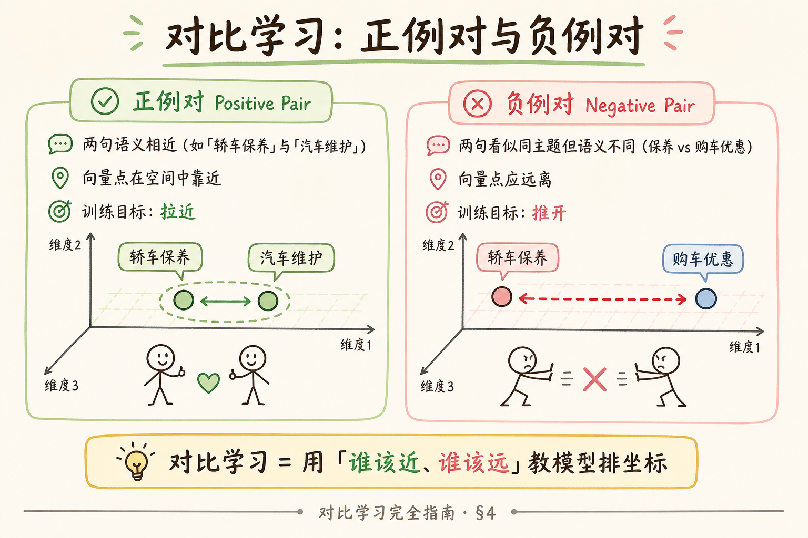
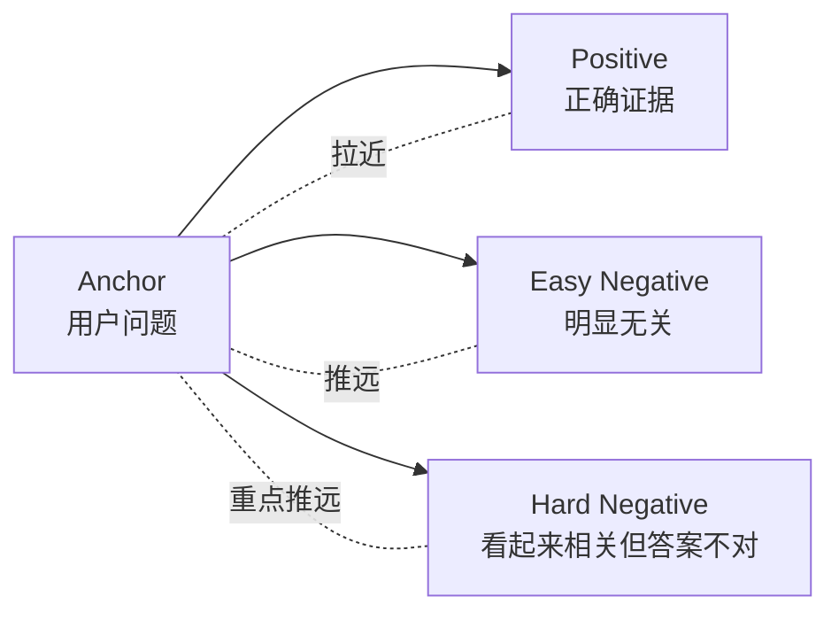
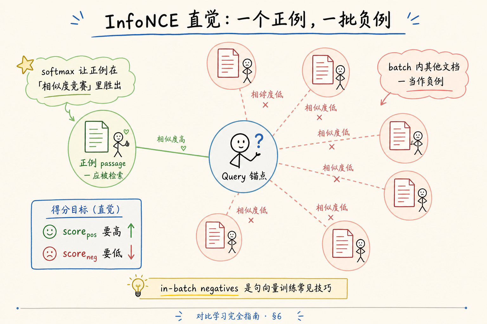
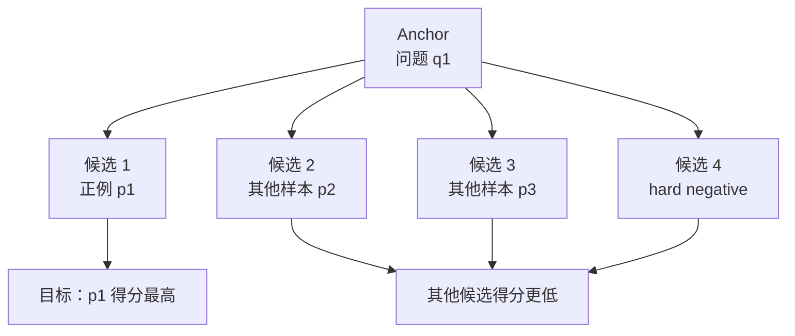
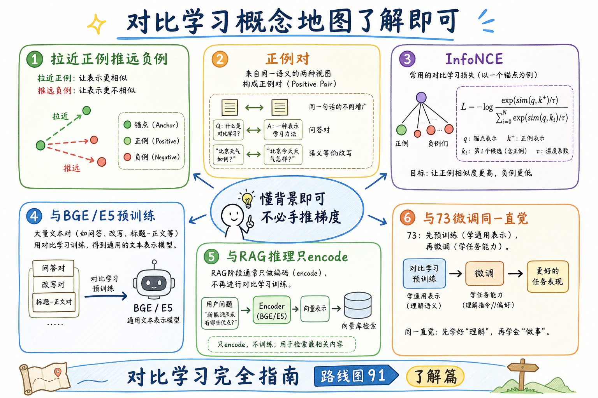
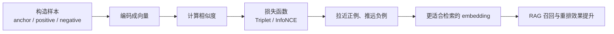

# C3 向量化（十四）：对比学习完全指南（了解篇）

> 你用 [25 Embedding](25.embedding-vector-tutorial.md) 做检索、用 [72 本地推理](72.local-embedding-inference-tutorial.md) 跑 BGE、在 [73 篇](73.embedding-finetune-tutorial.md) 里听说 **Triplet Loss**——这些句向量模型 **凭什么** 知道「轿车保养」和「汽车维护」该靠近？背后一大类训练范式叫 **对比学习**（Contrastive Learning）。这篇是 [企业 RAG 路线图](ENTERPRISE_RAG_ROADMAP.md) **C3 了解篇**（路线图第 **91** 条）：讲清 **正例/负例对**、**InfoNCE** 口语直觉、与 **Embedding 预训练/微调** 的衔接——**定位「了解即可」**：帮你读论文摘要、与算法同事对齐名词，**不要求** 手推梯度或自己训 BGE。前置：[25 Embedding](25.embedding-vector-tutorial.md)、[26 相似度](26.similarity-metrics-tutorial.md)；衔接 [73 微调概念](73.embedding-finetune-tutorial.md)、[24 预训练与微调](24.pretrain-finetune-tutorial.md)。

---

## 目录

1. [前言：为什么 RAG 工程师要了解对比学习](#1-前言为什么-rag-工程师要了解对比学习)
2. [本文边界与阅读预期](#2-本文边界与阅读预期)
3. [对比学习一句话](#3-对比学习一句话)
4. [正例对与负例对](#4-正例对与负例对)
5. [从对比学习到句向量](#5-从对比学习到句向量)
6. [InfoNCE：一批里「认出」正例](#6-infonce一批里认出正例)
7. [与 Triplet、微调的关系](#7-与-triplet微调的关系)
8. [RAG 推理阶段：你还用得到什么](#8-rag-推理阶段你还用得到什么)
9. [先错后对：三个名词误区](#9-先错对对三个名词误区)
10. [综合概念地图](#10-综合概念地图)
11. [常见陷阱与 FAQ](#11-常见陷阱与-faq)
12. [总结与系列下一步](#12-总结与系列下一步)

---

## 1. 前言：为什么 RAG 工程师要了解对比学习

做 RAG 的日常工作 **99%** 是：`encode` → 存向量 → `query` → 近邻搜索。你 **不必** 训练模型也能交付系统。但当出现以下场景，对比学习会突然 **出现在 PPT 里**：

- 算法同学说「BGE 用 **对比损失** 预训练」；  
- [73 篇](73.embedding-finetune-tutorial.md) 评审里出现 **InfoNCE、in-batch negatives**；  
- 你读一篇 **dense retrieval** 论文，摘要写 **contrastive objective**。

若完全没概念，容易要么 **神化**（「对比学习万能」），要么 **恐惧**（「我是不是要学完深度学习才能做 RAG」）。本篇给你 **一层透明玻璃**：看见训练时在发生什么，回到工位继续 `encode`。

**对比学习**（Contrastive Learning）：通过构造 **正例对**（应相似）与 **负例对**（应不相似），训练模型使正例在表示空间中 **靠近**、负例 **远离** 的一类学习方法。  
通俗说：**用「谁跟谁一伙、谁跟谁别一伙」来教模型画地图**——地图画好后，RAG 推理只是 **查地图**（[25 篇](25.embedding-vector-tutorial.md)）。

### 1.1 「了解即可」是什么意思

| 本篇希望你做到 | 本篇不要求 |
|--------------|------------|
| 听懂正例/负例/anchor | 推 InfoNCE 梯度 |
| 理解 BGE 为何「懂语义」的大致原因 | 复现 BGE 预训练 |
| 与 [73 微调](73.embedding-finetune-tutorial.md) 损失名词对齐 | 写分布式训练代码 |
| 读论文摘要不懵 | 考对比学习数学证明 |

### 1.2 C3 收尾在路线图中的位置

```text
89 本地推理（工程）
90 微调概念（决策）
91 对比学习 ← 本篇（了解 · 训练背景）
92～ FAISS、混合检索、rerank（检索工程）
```

91 是 C3「向量化」主题的 **理论补完**；下一章进入 **C4 向量存储与检索**。

### 1.3 一句话带走

**对比学习 = 用「该近该远」的样本训练向量空间；RAG 推理 = 在这个空间里找邻居。** 91 篇到此为止；更深的数学与 CV 变体，留给选修课与算法同事。

---

## 2. 本文边界与阅读预期

**档位：C3 了解篇（路线图 91）。**

**本文讲：** 对比学习定义、正负例、InfoNCE 直觉、与句向量预训练/微调的关系、RAG 推理侧分工、名词误区。  
**本文不讲：** SimCLR/MoCo 等 CV 对比学习细节、完整损失求导、负样本队列理论、各 SOTA 论文横向评测。

**阅读时间：** 约 25～35 分钟；无代码依赖。

### 2.1 与相邻篇章分工

| 篇章 | 你得到什么 |
|------|------------|
| [25 Embedding](25.embedding-vector-tutorial.md) | 推理时向量怎么用 |
| [72 本地推理](72.local-embedding-inference-tutorial.md) | 怎么 `encode` |
| [73 微调](73.embedding-finetune-tutorial.md) | 何时改权重、Triplet |
| **本篇** | 权重 **最初怎么学出来** 的直觉 |
| C4 | 向量怎么存、怎么搜 |

### 2.2 与 73 篇的阅读顺序

**先 72 后 73 再 91（本篇）** 最顺：能跑权重 → 知道何时改权重 → 懂权重为何如此。若只读 91 不读 72，容易把对比学习当成 **线上要实现的模块**；若只读 72 不读 91，听算法讲 InfoNCE 会心虚——两篇加起来也就 **一次午休** 阅读量。本篇 **无代码作业**，适合通勤读完。下一章 **92 FAISS** 起，请把笔记本切回 **终端与向量库配置**——工程主战场在 C4，91 是回头看见的来时路。

---

## 3. 对比学习一句话

把世界上所有句子想成地图上的点。对比学习 **不直接教**「这句话的意思是 X」（那是分类），而是反复出题：

> 「这两句 **该不该站一起**？」  
> 「这句 query，**哪段文档是配对**、哪些 **不是**？」

答对加分、答错扣分—— millions 轮之后，模型把 **语义近** 的句子 **聚** 在一起。  
RAG 用的 **cosine 近邻**，吃的正是这张 **对比学习画出来的图**（再接 [26 篇](26.similarity-metrics-tutorial.md) 的尺子）。

### 3.2 历史一分钟（可选阅读）

对比学习在 **CV 自监督** 里因 SimCLR 等出圈（约 2020 前后），很快 **迁移到文本检索**——Sentence-BERT、DPR、后来的 BGE/E5 都把 **「batch 内认正例」** 当核心配料。你不需要背时间线；只需知道：**现在 RAG 用的句向量，是这套范式十年迭代的工程产物**，不是 Word2Vec 简单加长。

### 3.3 与「度量学习」的关系

**度量学习**（Metric Learning）广义的 **学一个距离函数**；对比学习是其中 **用正负对监督** 的主流做法。面试若混听两个词，可记：**对比学习 ⊂ 度量学习常见工具箱**——RAG 口语里两者常混用，指的都是 **让相似句靠近**。

---

## 4. 正例对与负例对

读下图时，先看「正例与负例」想表达的主线：对比学习不是直接教模型背答案，而是教它判断「谁应该更像谁」。






上图里最值得关注的是 hard negative。初学者可以把它理解成「最容易骗过模型的错误证据」；训练时把这类样本推远，通常比只加入明显无关的负例更有效。

对照上图可以得出一个实用结论：先确认「正例与负例」里的主流程，再去调整具体参数或实现细节。

### 4.1 正例对（Positive Pair）

**应被认为相似** 的一对（或多段）文本。例如：

- 「轿车保养周期」↔「汽车维护间隔」  
- 用户 query ↔ 应检索到的 passage（检索训练里最常见）  
- 同一文档的两种改写（数据增广）

训练目标：**它们的 embedding 距离变小**（在某种 metric 下）。

### 4.2 负例对（Negative Pair）

**应被认为不相似** 的一对。例如：

- query ↔ 随机抽的无关文档（太简单，学习价值低）  
- query ↔ **看起来像但答案错** 的段落（**hard negative**，[73 篇](73.embedding-finetune-tutorial.md)）  
- 「保养周期」↔「购车优惠政策」

训练目标：**距离变大**。

### 4.3 Anchor（锚点）

很多设定里有一个 **中心**：

- 检索训练：**query 是 anchor**，正例是正确 doc，负例是错误 doc；  
- Triplet：`(anchor, positive, negative)` 三个角色。

**RAG 工程师记忆点**：你线上 `encode(query)` 的那个向量，就是训练时 **被当作 anchor 一类对象** 学出来的几何性质。

### 4.3 一对多：一个 query 多个正例

检索里常 **多个 chunk 都能答**——训练可采 **多正例** 或 **多次采样**。对比学习不限制「一对一」；RAG 标注规范（73 §13.6）要写清 **多 gold 怎么处理**。推理时 Top-k 本就应该 **多条相关**——与「只有一个正例」的训练 demo 不矛盾。

---

## 5. 从对比学习到句向量

现代 **句向量模型**（BGE、E5、GTE、sentence-transformers 生态）预训练阶段常见套路（简化）：

```text
1. 底座：Transformer 编码器（[22 篇](22.transformer-architecture-tutorial.md)）
2. 池化：mean / CLS → 得到一个句向量
3. 对比目标：一批 (query, doc+) 与多个 doc-
4. 大规模数据：网页对、搜索点击、维基改写…
5. 产出 checkpoint：给你 [72 篇](72.local-embedding-inference-tutorial.md) encode 用
```

你 **下载的 BGE**，已经是 **对比学习 + 其他目标** 训完的产物；本地推理 **不再算 loss**，只做前向。

### 5.1 与「分类」的区别

| 分类头 | 对比学习 |
|--------|----------|
| 输出固定类别标签 | 输出 **连续向量** |
| 新类别要改头 | 新领域可用 **微调** 或 **换数据继续对比** |
| 不适合「相似度排序」为主任务 | **天然适合检索** |

RAG 要的是 **排序**（谁更近），不是「这句话属于 37 号类」——对比学习与检索目标 **同向**。

### 5.2 温度系数（只记直觉）

InfoNCE 里常有一个 **temperature**（温度）：控制 softmax「有多尖锐」。  
通俗说：**分数差距要被放大还是磨平**——训练内部超参，**推理时你不管**；听同事提到时知道是 **训练旋钮** 即可。

### 5.3 数据从哪来（预训练视角，了解）

| 信号来源 | 构造的正例对 |
|----------|--------------|
| 搜索点击 | query ↔ 被点网页摘要 |
| 维基改写 | 同义段落 |
| 论坛问答 | 问题 ↔ 最佳答案 |
| 机器翻译平行句 | 中英互译（多语模型） |

企业 **拿不到** 这套互联网规模数据，才 **下载现成 checkpoint**（72）而非自己预训练。73 的微调是用 **你们自己的「小版点击日志」** 续写对比作业。

### 5.4 表示坍塌（collapse）是什么

训练失败时，所有句向量 **挤到空间一点**，cosine 谁都差不多——检索全废。表现：训练 loss 很低，但 **验证 Recall 极差**。  
**RAG 工程师**：线上若突然 **分数分布变窄**、Top-k 毫无区分度，除检查 metric 外，可问算法是否 **微调训崩**——对比学习特有坑，不是向量库坏了。

---

## 6. InfoNCE：一批里「认出」正例

读下图时，先看「InfoNCE 直觉」想表达的主线：在一个 batch 里，anchor 要从多个候选里认出自己的正例。





上图把 InfoNCE 的直觉压缩成一句话：同一批样本里，正确配对要赢过其他候选。batch 越合理，负例越有挑战，模型越能学到有用的相似度边界。

**InfoNCE**（Noise Contrastive Estimation 一族）：在一个 batch 里，给定 **anchor**，有 **1 个正例** 和 **多个负例**，做「**相似度竞赛**」——让正例的相似度分数 **相对** 所有负例 **最高**。

### 6.1 口语版流程

假设 batch 里有 8 个 query，每个配 1 个正确 passage（共 8 对正例）。  
对 query₁：

- 计算它与 **自己正例 passage** 的相似度 → 希望 **高**；  
- 计算它与 **batch 里其他 7 个 passage**（甚至更多）的相似度 → 希望 **低**；  
- 用 softmax 形式把「认对正例」变成分类问题：**在 N 个候选里选中那一个**。

**In-batch negatives**：别的样本的正例，自动当我的负例——**不用额外采样** 就能有一批负例，这是句向量训练 **省数据、提吞吐** 的常见技巧。

### 6.2 与 [26 篇](26.similarity-metrics-tutorial.md) 的衔接

竞赛里的「相似度」常用 **点积** 或 **cosine**（向量常 **L2 归一化**，路线图 **83**）。  
训练时优化的是 **相对排序**；推理时你用 **同一 metric** 做 ANN——**训练与推理一致** 很重要（[72 篇](72.local-embedding-inference-tutorial.md) `normalize_embeddings`）。

### 6.3 不必背的公式（给好奇者）

若你看到论文：

\[
\mathcal{L} = -\log \frac{\exp(\text{sim}(q, d^+)/\tau)}{\exp(\text{sim}(q, d^+)/\tau) + \sum_{d^-} \exp(\text{sim}(q, d^-)/\tau)}
\]

读法：**分子是正例，分母是正例加所有负例**；取 log 后做梯度下降。  
**记不住完全正常**——RAG 交付不考这个。

### 6.4 Batch size 与负例数量（直觉）

batch=32 时，每个 query 大约有 **31 个 in-batch 负例** 参与竞赛；batch 越大，负例越多、训练越「难」也越稳——但显存涨。这是 **训练机房** 的 trade-off；你做 RAG 索引时选的 `batch_size`（[72 篇](72.local-embedding-inference-tutorial.md)）只为 **吞吐**，与训练里的「负例丰富度」 **不是同一概念**，勿混谈。

### 6.5 对比学习 ≠ 只能用于文本

图像、语音、多模态也用 **拉近推远**——RAG 工程师知道 **同源** 即可。文本栈里 BGE、E5、GTE 的预训练都大量用对比式目标；[56 多模态](56.multimodal-image-text-tutorial.md) 路线图里图文对齐同样是对比思想，只是 **编码器与正负构造不同**。

---

## 7. 与 Triplet、微调的关系
Embedding 微调解决的是“通用模型不懂你的领域相似性”。真正决定效果的不是训练命令，而是正样本、难负样本和评测集是否能反映真实检索场景。

### 7.5 损失函数族谱（一页纸）

| 名字 | 负例从哪来 | 常见场景 |
|------|------------|----------|
| Triplet Loss | 显式指定 1 个 neg | 小数据微调（73） |
| InfoNCE | batch 内多个 neg | 大规模预训练 |
| MultipleNegativesRanking | 同 InfoNCE 味 | sentence-transformers 微调 |

三者在 **拉近 anchor–positive、推开 negatives** 上同族；差别在 **负例怎么凑、分母里有几个候选**。会议上听到任何一个，都可以点头说「对比学习一族」——不必装懂推导。

---

```text
预训练（91 本篇背景）→ 通用 BGE checkpoint
       ↓
可选微调（73）→ 领域 BGE' checkpoint
       ↓
RAG 推理（25/72）→ encode，不算 loss
```

---

## 8. RAG 推理阶段：你还用得到什么

对比学习 **主要发生在训练机房**；线上 RAG **继承结果**：

| 训练里学的 | 推理里你用 |
|------------|------------|
| 近义句靠近 | cosine 检索能召回改写问法 |
| query-doc 对齐 | 问句与段落匹配 |
| 推开 hard neg | 减少「看起来像」的错误段 |

**你用不到的**（除非你去训模型）：

- batch 构造、in-batch neg 采样；  
- loss 反传、学习率调度；  
- 温度 τ、margin 调参。

### 8.1 对排障的帮助

当检索错时，用对比学习 **语言** 描述现象：

- 「这是 **负例不够 hard**」→ 73 里挖 hard neg 或 rerank；  
- 「**正例对** 在训练分布里没见过」→ 考虑微调或 query 改写；  
- 「**坐标系** 不对」→ 换模型或重建索引，不是调 temperature（那是训练期的）。

### 8.2 与多模态、CV 的对比学习

图像领域 SimCLR 等也讲对比学习——**思想同源**（拉近推远），**数据与编码器不同**。  
RAG 文本栈 **知道同源即可**；不必为做 RAG 去学 CV 论文。

### 8.2 评测语言：怎么说「模型学得好」

算法同事说「对比损失收敛」，你应追问：**hold-out Recall@k 多少**？  
对比学习训练目标与 **业务检索指标** 相关但不等同——[88 领域评估](ENTERPRISE_RAG_ROADMAP.md) 的 **同一评测集** 才是合同语言。91 篇帮你听懂 **他们怎么训**；88 帮你验收 **训完有没有用**。

### 8.3 与 [26 相似度](26.similarity-metrics-tutorial.md) 的闭环

训练优化 **sim(q, d+)** 相对 **sim(q, d-)** 的大小；推理用 **同一 sim**（常是点积或 cosine）做 ANN。若训练用 cosine、推理用未归一化点积，等于 **尺子换了**——[72 normalize](72.local-embedding-inference-tutorial.md) 与库 metric 必须对齐。对比学习是 **教模型适应这把尺子** 的过程。

---

## 9. 先错对对：三个名词误区
下面这些错误看起来只是实现细节，实际会破坏检索、引用、评测或用户体验。读的时候重点看：错法缺少了哪个必要信息，以及正确做法如何补上这个缺口。

### 9.1 「对比学习 = 线上要做对比」

错：以为生产要同时 encode 正负例算 loss。  
对：**只有训练算 loss**；线上 **单向量检索**。

### 9.2 「InfoNCE 是一种 Embedding 模型」

错：把损失函数当成模型名。  
对：InfoNCE 是 **训练目标**；BGE 是 **模型**。

### 9.4 误区补充：「多负例一定更好」

训练时 in-batch 负例随 batch 增大而增多，但 **推理库** 里候选是 **全量 chunk**——不是 batch 越大线上越好。91 篇讲的是 **训练几何**；**库规模与 ANN** 在 C4 讨论。勿把「训练 batch=256」误当成「检索要一次比 256 个」。

### 10.4 与 RAG 全链路的站位图

```text
分块(C2) → 本地 encode(72) → 向量库(C4) → 检索 → rerank → LLM 生成
                ↑
         对比学习(91) 解释权重从哪来
                ↑
         微调(73) 可选改权重
```

**91 篇不插入流水线新盒子**——它解释的是 **encode 盒子里的模型怎么长大**。读完全系列，你应能指着图说：「我们停在预训练 BGE，还没走 73。」

### 10.5 推荐复习顺序（若时间紧）

1. [25 Embedding](25.embedding-vector-tutorial.md) 10 分钟  
2. 本篇 §4～§6 15 分钟  
3. [73 微调](73.embedding-finetune-tutorial.md) §4 决策树 10 分钟  
4. 回头做 72 §8 脚本 15 分钟  

合计约一小时，C3 **89～91** 名词闭环。

---

## 10. 综合概念地图

读下图时，先看「概念地图」想表达的主线：对比学习从样本对开始，经过相似度打分和损失函数，最后服务于检索排序。






上图的收束结论是：对比学习的目标不是生成文本，而是塑造向量空间。对 RAG 来说，它真正影响的是「哪些 chunk 会排在前面」。

六格速记：

1. **核心**：拉近正例、推远负例。  
2. **正例对**：同义、query-doc。  
3. **InfoNCE**：一批里认出正例。  
4. **BGE/E5**：这样预训练来的。  
5. **RAG 推理**：只 encode。  
6. **73 微调**：同一套直觉换领域数据。

---

## 11. 常见陷阱与 FAQ

**Q：我要学对比学习才能做 RAG 吗？**  
**不要。** 先 [25→72→C4](25.embedding-vector-tutorial.md) 跑通；本篇是 **背景选修**。

**Q：对比学习和 [24 预训练](24.pretrain-finetune-tutorial.md) 什么关系？**  
预训练阶段用对比目标 **学表示**；微调可 **继续** 对比损失或换任务——24 是总框，91 是框里 **一块拼图**。

**Q：负例越多越好吗？**  
训练时 **适量 hard 负例** 有用；**错标负例** 伤人。推理时 **没有负例这个概念**——只有库里的其他向量。

**Q：和 RLHF、DPO 一样吗？**  
不一样。那些多针对 **生成偏好**；对比学习针对 **表示空间几何**，服务 **检索**。

**Q：读完能自己训 BGE 吗？**  
能 **起步读文档**；工业级预训练要 **数据与算力**——企业 RAG 更常 **微调**（73）而非从零预训练。

### 11.2 更多 FAQ

**Q：对比学习和对抗训练是一回事吗？**  
不是。对抗训练在输入上加扰动；对比学习在 **样本对** 上拉近推远。名词不同，别在会议上混用。

**Q：负样本一定是「错文档」吗？**  
训练时是的；**推理时没有显式负样本**——全库都是候选，靠相似度排序。

**Q：需要为了 91 篇去学 PyTorch 吗？**  
不需要。继续把 [72 encode](72.local-embedding-inference-tutorial.md) 与 C4 检索做好；91 是 **沟通词汇表**。

**Q：CLIP 也算对比学习吗？**  
是，图文配对拉近——与文本 RAG **思想同源**；做纯文本 RAG 不必深读 CLIP，知道 **多模态也玩同一套** 即可（[56 篇](56.multimodal-image-text-tutorial.md)）。

### 11.3 小测验（自测，无标准答案）

1. 用一句话向非技术经理解释「为什么 BGE 不用你公司的数据也能初跑」。  
2. 「in-batch negatives」翻译成会议口语。  
3. 同事说「我们上线对比学习吧」——你应该如何澄清？  

参考答案方向：BGE 已预训练；一批里其他正例当负例；上线只做 encode 不算对比 loss。

---

## 12. 总结与系列下一步

1. **对比学习** 用 **正负例远近** 教模型画语义地图。  
2. **InfoNCE** = 一批候选里 **把正例认出来**；in-batch neg 很常用。  
3. **BGE/E5** 的检索能力， largely 来自这类预训练——你 `encode` 的是 **成果的用**，不是 **过程的复现**。  
4. **[73 微调](73.embedding-finetune-tutorial.md)** 是 **同一哲学 + 你的三元组**；决策树在 73，不在 91。  
5. **了解篇**：读懂名词、对齐沟通即可；深度训练交给算法同事。

### 12.1 系列下一步

| 目标 | 阅读 |
|------|------|
| 向量库与 ANN | 路线图 **92 FAISS** |
| 混合检索 | 路线图 **110 Hybrid** |
| 本地 encode | [72 本地推理](72.local-embedding-inference-tutorial.md) |
| 是否微调 | [73 微调概念](73.embedding-finetune-tutorial.md) |

### 12.2 学习目标自检

- [ ] 能解释正例对 / 负例对  
- [ ] 能口语描述 InfoNCE「竞赛」  
- [ ] 能说明训练 vs 推理分工  
- [ ] 不会把 InfoNCE 当成模型名  
- [ ] 知道 91 是 **了解即可**  

### 12.3 面试 30 秒版

「对比学习通过拉近正例、推远负例学表示；InfoNCE 在一个 batch 里让 query 认出自己的正文档；BGE 这样预训练；RAG 线上只 encode 不做 loss；领域适配看 73 微调。」

### 12.4 15 分钟轻量作业

1. 自选 3 句：写一对 **正例**、一对 **负例**。  
2. 用 [72 篇](72.local-embedding-inference-tutorial.md) BGE 本地 `encode`，算余弦——正例是否高于负例。  
3. 写两句话：若不高，是 **模型不懂** 还是 **本来就不是语义相似**（如纯数字编号）。  
4. 把「对比学习」与「RAG 推理」各写一句分工。

### 12.5 附录：训练与推理对照表（贴显示器旁）

| 阶段 | 输入 | 输出 | 你是否参与 |
|------|------|------|------------|
| 预训练对比学习 | 百万 query-doc 对 | BGE 权重 | 下载权重（72） |
| 领域微调（73） | 你的三元组 | BGE' 权重 | 立项 + 验收 |
| RAG 索引 | chunk 文本 | 向量入库 | **日常主工作** |
| RAG 查询 | user query | Top-k chunk | **日常主工作** |

记住：**loss 只在前两行出现**；后两行是 cosine 近邻，不算负例。

### 12.6 附录：正例/负例 mini 故事板

**故事 1（正例对）**  
用户问：「年假最多几天？」文档写：「带薪年休假上限十五个工作日。」对比学习希望两句 embedding 靠近——你线上检索就靠这个几何。

**故事 2（负例对）**  
用户仍问年假，候选段是「病假申请流程」——主题沾边但 **不能回答问题**。训练要推开；若没推开，你会在 Top-3 看到 **似是而非** 的段，[112 rerank](ENTERPRISE_RAG_ROADMAP.md) 可补救。

**故事 3（hard negative）**  
候选段写「年假 **最少** 申请半天」——含「年假」但不是「最多几天」。这是 [73 篇](73.embedding-finetune-tutorial.md) 挖负例的典型；对比学习在预训练里也会见到大量此类 **细粒度** 区分。

### 12.7 附录：与自监督、监督的谱系（极简）

```text
自监督（大量无标注）→ 对比式目标构造伪标签 → BGE 通用能力
        ↓
监督微调（73，有标注 query-chunk）→ 同一对比损失族 → 领域能力
        ↓
RAG 推理（25/72）→ 无 loss
```

你不需要分清 SimCLR 与 MoCo 的队列细节——文本 RAG 栈 **知道「预训练在大规模上做过对比作业」** 即可。

### 12.8 附录：读论文摘要时的「翻译器」

| 摘要词汇 | 人话 |
|----------|------|
| contrastive objective | 拉近正例、推远负例 |
| in-batch negatives | 同批别人正例当我负例 |
| temperature τ | 训练 softmax 尖锐度 |
| hard negative mining | 专挑易混淆段当负例 |
| representation collapse | 全向量挤成一团（训练失败） |

看到 **collapse** 知道是训练挂了，不是你 pgvector 配置错了。

### 12.9 读路径自检（6 题）

1. 对比学习一句话？  
2. InfoNCE 在 batch 里做什么「竞赛」？  
3. anchor 在检索训练里通常是谁？  
4. 推理阶段还算 loss 吗？  
5. 91 篇与 73 篇各回答什么问题？  
6. 对比学习能替代 BM25 吗？

### 12.10 团队沟通：何时需要算法深度支持

| 场景 | 91 篇够吗 | 找算法 |
|------|-----------|--------|
| 日常 encode + FAISS | 够 | 否 |
| 评审「要不要微调」 | 够（配合 73） | 可选 |
| 自研预训练 embedding | 不够 | **是** |
| 论文复现 InfoNCE 变体 | 不够 | **是** |

### 12.11 后记：C3 三章闭环

```text
72 本地推理 — 怎么跑权重
73 微调概念 — 何时改权重
91 对比学习 — 权重为何长这样（了解）
        ↓
92+ 向量库 — 向量存哪、怎么搜
```

三章合在一起：**工程能跑、决策不盲从、名词能对齐**。91 不要求你成为训练专家，但能让你 **不参加错会议**——把「对比学习」听成「线上要做负样本实时对比」的误会，本篇就是疫苗。

### 12.13 与课程式学习的边界

若你在上深度学习课，老师讲的 **SimCLR、MoCo、CLIP** 都是对比学习家族——做 **企业文本 RAG** 可 **战略跳过** 作业推导，只保留本篇 + [73 Triplet](73.embedding-finetune-tutorial.md) 即可应付 **90% 工作会议**。剩下 10% 再请算法同事白板。

### 12.7 收束：了解篇不是边缘篇

路线图把 91 标成 **了解**，是因为 **你不必会训**；不是因为 **对比学习不重要**。没有对比式预训练，就没有今天拿来就用的 BGE——[72 本地 encode](72.local-embedding-inference-tutorial.md) 的每一毫秒 GPU，都在消费几年前 **百万次拉近推远** 的成果。带着这份敬意进 C4，你会更珍惜 **评测集与 metric 对齐**，而不是迷信「再训一个就好」。

---

> **初学者可能仍困惑的点**  
> - **了解篇** 不是 **不重要**——是 **分工**：你先把 RAG 管道跑通，再来补这堂理论课。  
> - 对比学习 **不替代** BM25、rerank、好分块。  
> - 看到 **contrastive** 就想到 **拉近推远**，不必立刻打开公式。  
> - 下一章 **C4** 开始谈 **向量存哪、怎么搜快**——回到工程主战场。
