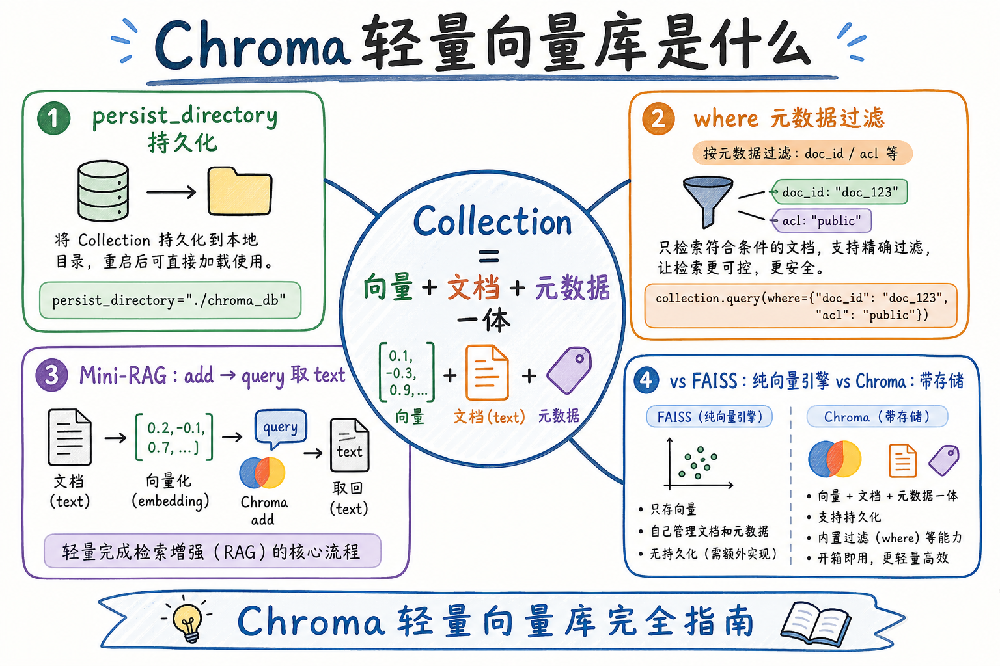
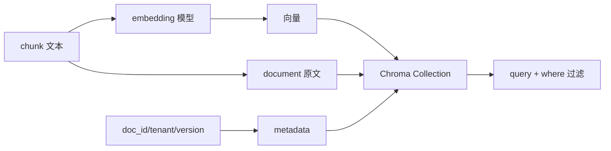
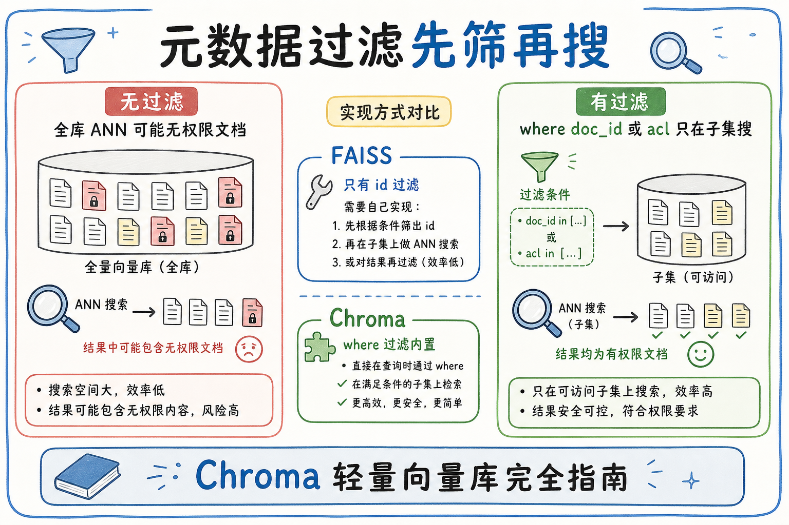
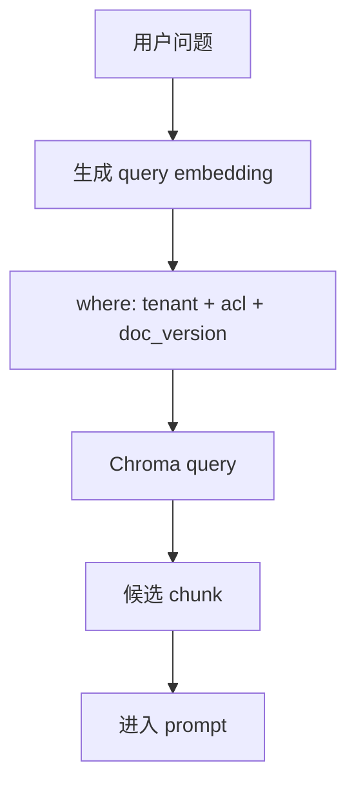
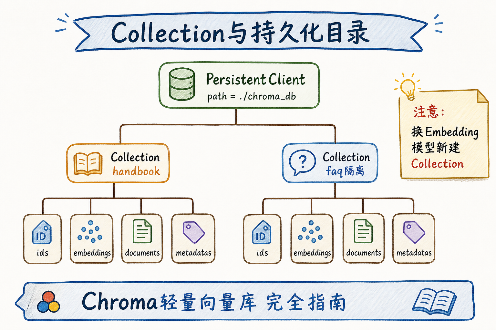

# C4 向量存储（二）：Chroma 轻量向量库完全指南

**Chroma** 是一个适合本地 PoC 和教学实验的向量数据库。它能把文本、向量和 metadata 放在同一个 collection 里，方便你快速做“入库、检索、过滤”的最小 RAG。

读完本文，你应能解释 Chroma 是做什么的、适合什么阶段、如何写入和查询 chunk，以及什么时候该迁移到更强的向量库。

---

## 目录

1. [前言：从向量引擎到向量库](#1-前言从向量引擎到向量库)
2. [本文边界与动手路径](#2-本文边界与动手路径)
3. [Chroma 是什么](#3-chroma-是什么)
4. [核心概念：Client、Collection、Record](#4-核心概念clientcollectionrecord)
5. [最小可运行示例](#5-最小可运行示例)
6. [metadata 过滤与多租户边界](#6-metadata-过滤与多租户边界)
7. [持久化与 collection 命名](#7-持久化与-collection-命名)
8. [Chroma 的适用边界](#8-chroma-的适用边界)
9. [常见翻车与排障](#9-常见翻车与排障)
10. [总结与下一步](#10-总结与下一步)

---

## 1. 前言：从向量引擎到向量库

FAISS 更像“向量相似度引擎”，Chroma 更像“带管理能力的轻量向量库”。初学者可以把 Chroma 理解成一个小仓库：每条记录既放向量，也放原文和标签。

RAG 里最小记录通常包含：`id`、`document`、`embedding`、`metadata`。metadata 用来过滤租户、文档、权限和版本。

### 1.1 为什么先学 Chroma 而不是直接上 Milvus

| 阶段 | 痛点 | Chroma 价值 |
|------|------|-------------|
| 第一次写 RAG | 不知道向量库接口长什么样 | `add` / `query` / `where` 几行跑通 |
| 本地调试 embedding | 只想验证 chunk 能否被召回 | 无需 Docker、集群或 schema 设计 |
| 教学演示 | 听众注意力在 RAG 链路 | 少讲运维，多讲数据形状 |

这不是说 Chroma 是终点。当你的 chunk 上万、需要多实例写入或严格 SLA 时，再读 [77 Milvus](77.milvus-tutorial.md) 或 [78 Qdrant](78.qdrant-tutorial.md) 更合适。Chroma 的价值是**尽快建立“向量库该存什么”的肌肉记忆**。

### 1.2 和 RAG 链路的关系

检索只是 RAG 的一环。Chroma 若只按相似度 `query`、不加 `where` 过滤租户，会召回别家文档——后面 rerank 和 LLM 再强也救不回来。理解 Chroma，是在 **metadata 过滤** 与 **向量相似度** 之间写对一次查询，而不是把向量库当“黑盒相似度 API”。

## 2. 本文边界与动手路径

本文聚焦 PoC 用法，不讲 Chroma Cloud、分布式部署和大规模运维。动手路径如下：

| 步骤 | 你做什么 | 验收 |
|------|----------|------|
| A | 创建本地持久化 client | 目录里出现数据库文件 |
| B | 建 collection | 能写入 chunk |
| C | 查询相似文本 | 返回 top-k |
| D | 加 metadata 过滤 | 只返回指定 doc 或 tenant |

最小交付物是：你能用 Python 写出一次“按租户过滤 + 向量相似度 top-k + 返回 document 原文”的完整调用。

### 2.1 每步建议花多久

| 步骤 | 建议时间 | 要点 |
|------|----------|------|
| A | 20 分钟 | `PersistentClient` 落盘，确认 `./chroma_db` 目录生成 |
| B | 30 分钟 | 建 collection，维度与 embedding 模型一致 |
| C | 45 分钟 | 用真实或假向量跑通 `query`，看懂返回结构 |
| D | 30 分钟 | 加 `where={"tenant": ...}`，验证跨租户 chunk 不出现 |

### 2.2 本文不展开

- Chroma 服务端部署、多副本与高可用
- 内置 embedding 函数与远程 Server 模式的全部配置项
- 与 LangChain/LlamaIndex 框架封装的细节（接口本质仍是 collection + add + query）
- 大规模索引调优（见 [86 HNSW](86.hnsw-index-tutorial.md)、[87 ANN 评测](87.ann-recall-latency-tutorial.md)）

## 3. Chroma 是什么

Chroma 把“向量检索 + 文本存储 + metadata 过滤”打包到一个易用接口里。





这张图的结论是：Chroma 不只是存向量，还要存可追踪的原文与 metadata。

### 3.1 与 FAISS、专用向量库怎么选（粗指南）

| 信号 | 倾向 Chroma | 倾向 FAISS / 专用库 |
|------|-------------|---------------------|
| 需要同时存原文和 metadata | ✓ | FAISS 需自己管 |
| 单人本地 PoC、快速验证 | ✓ | |
| 纯向量、无过滤、极致速度 | | FAISS |
| 百万 chunk + 分布式 + 运维 | | Milvus / Qdrant |

初学者先用 Chroma 跑通 **入库 → 过滤检索 → 返回 document**，再按评测数据决定是否迁移。

## 4. 核心概念：Client、Collection、Record

**Client**：连接 Chroma 的入口。本地 PoC 常用 `PersistentClient`，让数据落盘。

**Collection**：一组同维度、同 embedding 模型的记录。不要把不同 embedding 模型写进同一个 collection。

**Record**：一条可检索数据，通常包含四元组：

| 字段 | 作用 |
|------|------|
| `ids` | 稳定 chunk_id |
| `documents` | 原文片段 |
| `embeddings` | 向量数组 |
| `metadatas` | doc_id、tenant、acl、version |

### 4.1 字段设计建议

| 字段 | 用途 | 易错点 |
|------|------|--------|
| `ids` | 增量更新、日志引用 | 重跑入库若 id 变，无法 upsert |
| `documents` | 生成答案时引用证据 | 只存向量会导致 prompt 无原文 |
| `embeddings` | 相似度检索 | 维度必须与模型输出一致 |
| `metadatas` | 租户、权限、版本 | 类型要稳定，过滤表达式才可靠 |

可选：在 metadata 里加 `model_id`、`chunk_index`，换模型或重建索引时便于分批处理。

## 5. 最小可运行示例

先安装：

```bash
pip install chromadb
```

下面代码用假向量演示接口，便于先理解数据形状。真实项目里应替换成 embedding 模型输出。

```python
import chromadb

client = chromadb.PersistentClient(path="./chroma_db")
collection = client.get_or_create_collection(name="rag_demo_v1")

collection.add(
    ids=["handbook-2025#001", "travel-2025#001"],
    documents=["员工每年享有带薪年假。", "一线城市住宿标准为每晚 600 元。"],
    embeddings=[[0.1, 0.2, 0.3], [0.2, 0.1, 0.4]],
    metadatas=[
        {"doc_id": "handbook-2025", "tenant": "acme"},
        {"doc_id": "travel-2025", "tenant": "acme"},
    ],
)

result = collection.query(
    query_embeddings=[[0.2, 0.1, 0.35]],
    n_results=1,
    where={"tenant": "acme"},
)
print(result["documents"])
```

如果输出能返回住宿标准那条记录，说明“写入、向量查询、metadata 过滤”这条最小链路已跑通。

### 5.1 返回结构要会读

`query` 返回字典，常见键有 `ids`、`documents`、`metadatas`、`distances`。调试时先 `print(result.keys())`，确认 top-k 顺序与距离是否符合直觉。距离越小（或越大，取决于 metric）表示越相似——以你用的 embedding 和 Chroma 默认 metric 为准。

真实项目里，`embeddings` 应由统一服务生成（同一模型、同一归一化策略），不要把用户原文直接当向量传入。PoC 阶段可以手写假向量理解形状，上线前必须换成生产 embedding，并固定 `collection` 与模型版本的对应关系，否则后续无法做有意义的 recall 对比。

## 6. metadata 过滤与多租户边界

RAG 不应只按相似度召回，还要先过滤租户和权限。否则 A 租户的问题可能召回 B 租户的文档。





这里的关键是：metadata 过滤必须在检索阶段生效，而不是生成答案后再删除。

### 案例

某内部知识库 PoC：两家子公司 `tenant=acme` 与 `tenant=beta` 共用一套 embedding 流水线，但文档不能互见。入库时每条 chunk 的 metadata 写 `tenant`；查询差旅政策时：

```python
where={"tenant": "acme", "doc_id": {"$in": ["travel-2025", "handbook-2025"]}}
```

验收：用 `tenant=beta` 的 query 向量检索，结果集应为空或不含 acme 文档；acme 用户问“住宿标准”应命中 `travel-2025#001`。这类 case 是 Chroma 教学里最该先跑通的权限边界，比 benchmark 数字更能说明 metadata 的价值。

### 先错对已

```text
-- ❌ 应用层：query 取 top-10，再在 Python 里 if meta["tenant"] != user_tenant 丢弃
-- 问题：日志、缓存、rerank 可能已接触越权 chunk

-- ✅ 检索层：where={"tenant": user_tenant} 与 query_embeddings 同一次 collection.query
```

另一条常见错误：metadata 值类型不一致（有时 `"1"` 有时 `1`），`where` 过滤会静默漏匹配。入库脚本应对 tenant、doc_id 等字段做统一类型校验。

## 7. 持久化与 collection 命名

本地实验建议用 `PersistentClient(path="./chroma_db")`。collection 命名要包含业务、模型和版本，例如：




```text
kb_handbook_text_embedding_3_small_v1
```

换 embedding 模型时应新建 collection，而不是把新旧向量混在一起。向量维度或模型不同，距离分数没有可比性。

### 7.1 持久化目录与版本管理

`./chroma_db` 目录即本地数据库文件，备份 PoC 时直接拷贝该目录即可。生产前若要换模型：新建 collection 名（如 `_v2`），全量重算 embedding 写入，评测通过后再切流量，最后删除旧 collection。不要原地覆盖混写，否则 recall 与审计都无法追溯。

## 8. Chroma 的适用边界

| 场景 | 是否适合 Chroma | 原因 |
|------|-----------------|------|
| 本地学习 | 适合 | 安装简单 |
| 小型 PoC | 适合 | 方便验证流程 |
| 多人生产写入 | 谨慎 | 需要评估并发和运维 |
| 大规模多租户 | 通常换 Milvus/Qdrant/pgvector | 权限、扩展、监控要求更高 |

Chroma 的价值是让你尽快理解向量库接口，不是替代所有生产数据库。

### 8.1 规模粗算：何时该认真评估迁移

假设单 collection 10 万 chunk、每秒几十次查询，单机 Chroma 可能仍可用；到百万级、需要水平扩展、独立备份与监控告警时，应对比 [77 Milvus](77.milvus-tutorial.md) 或 [81 pgvector](81.pgvector-tutorial.md)。迁移前用同一评测集在两套库各跑 recall@k，避免“为迁移而迁移”。

另一个常见信号是 **多人同时写入**：本地 SQLite 式持久化在并发下可能出现锁等待或写入失败。若团队已有多服务增量入库需求，应尽早用压测验证，而不是等到上线前一周才发现瓶颈。Chroma 教会你数据形状；规模问题交给有 schema、索引和运维手册的引擎。

## 9. 常见翻车与排障

**错：不同 embedding 模型写同一个 collection。** 结果是相似度分数混乱。正确做法是按模型和版本拆 collection。

**错：只存向量不存原文。** 生成答案时无法引用证据。正确做法是 `documents` 和 `metadatas` 一起写。

**错：把权限过滤放到生成后。** 这会让模型有机会看到越权内容。正确做法是在 `where` 里过滤。

**错：chunk_id 不稳定。** 重跑入库后无法增量更新。正确做法是 `doc_id + version + chunk_index/hash`。

### 排错

1. **query 返回空**：检查 collection 是否为空、`n_results` 是否过大、`where` 是否过严（可先去掉 where 对比）
2. **距离反常**：确认 query 向量与入库向量同一模型、同一维度；混模型时距离无意义
3. **持久化丢失**：是否误用 `EphemeralClient`；`path` 是否指向可写目录
4. **重复 id 报错**：`add` 时 id 已存在需 `update` 或先 `delete`；批量重跑应用稳定 id 做 upsert 策略
5. **过滤不生效**：打印单条 `metadatas` 看键名、类型是否与 `where` 一致

把 `collection_name`、`where`、`n_results`、`latency_ms` 打进结构化日志（[190](190.structured-logging-rag-tutorial.md)），便于对比改版前后。

### 评测

不必一开始上千条 query。从业务或 PoC 问答里抽 30～50 条，人工标注期望 `chunk_id`，对比：

| 指标 | 说明 |
|------|------|
| recall@k | 返回的 id 与标注期望的重叠 |
| 越权率 | 错误 tenant 的 query 是否返回 0 条 |
| p95 latency | 含 embedding 与 Chroma query |

调参顺序：先确认 `where` 与数据形状正确 → 再换 embedding 或 chunk 策略 → 数据上万后再考虑是否迁移到带 ANN 索引的专用库。Chroma 小数据量往往暴力扫描即可，延迟可接受时不必过早优化索引。

## 10. 总结与下一步

Chroma 是理解向量库的好入口：它让你在一台机器上跑通 collection、add、query、where 过滤和持久化。初学者重点掌握数据形状和 metadata 过滤，不要一开始就陷入大规模运维。


### 本篇检查清单

- [ ] `PersistentClient` 落盘成功，能 `get_or_create_collection`
- [ ] 一次 `add` 同时写入 ids、documents、embeddings、metadatas
- [ ] `query` 带 `where` 过滤租户，跨租户 query 不越权
- [ ] collection 命名含模型与版本，换模型时新建 collection
- [ ] 用 30+ 条标注 query 测过 recall@k，知道何时该读 Milvus/Qdrant

下一步可以读 [77 Milvus](77.milvus-tutorial.md) 或 [78 Qdrant](78.qdrant-tutorial.md)，理解生产级向量库为什么需要分布式、索引和更强的过滤能力。
