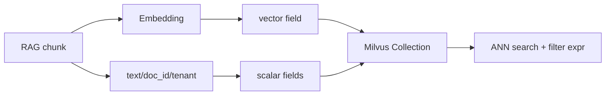
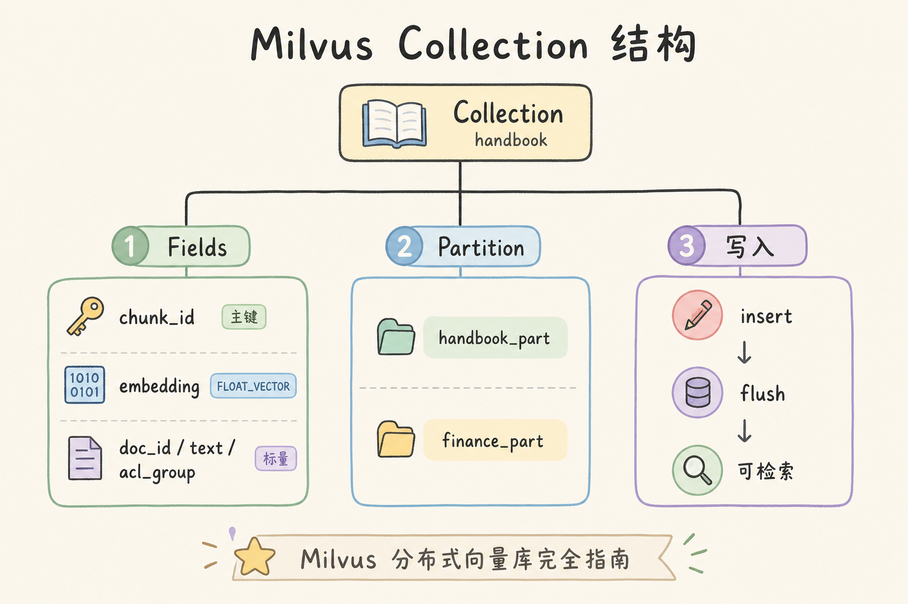
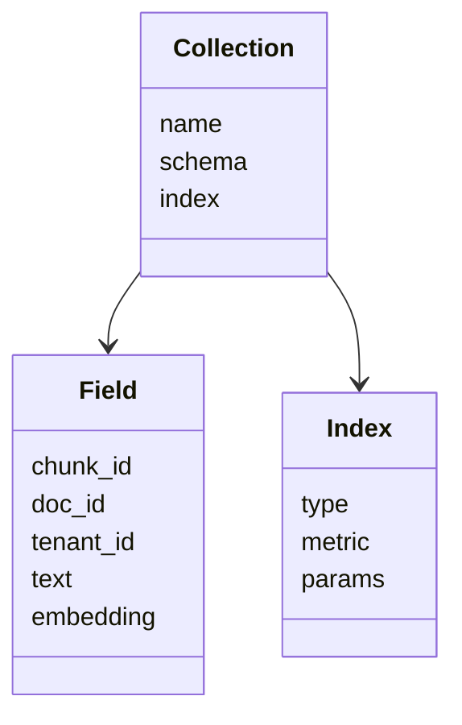
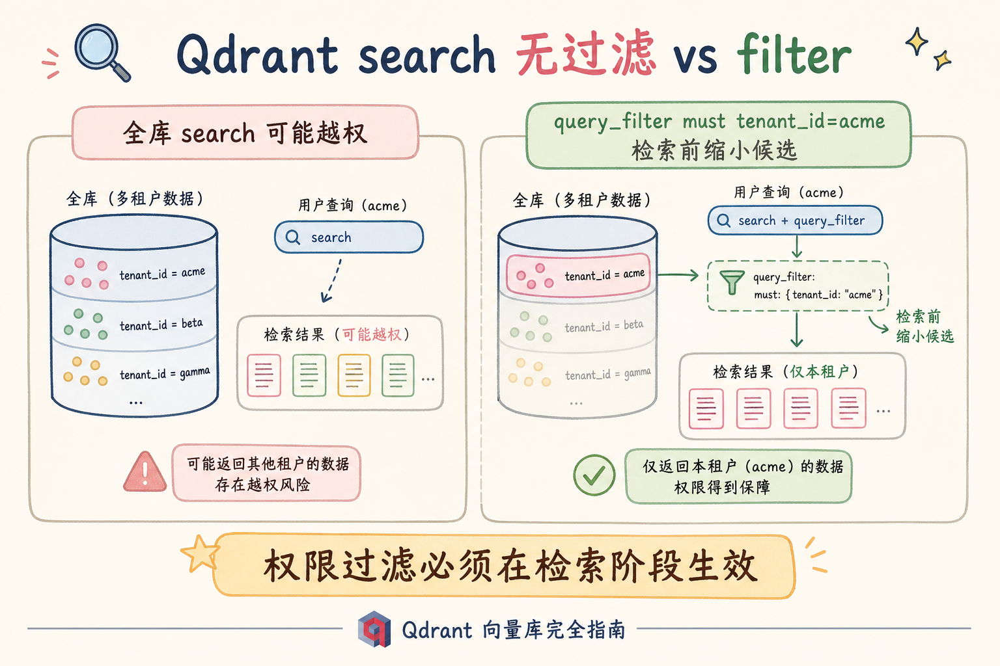
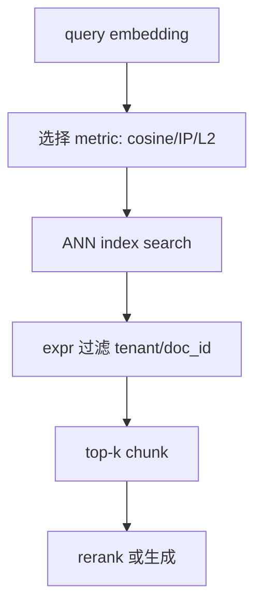

# C4 向量存储（三）：Milvus 分布式向量库完全指南

**Milvus** 是面向大规模向量检索的开源向量数据库。和 Chroma 相比，它更强调分布式、索引类型、集合 schema、批量写入和生产运维。

读完本文，你应能说清 Milvus 做什么、解决什么问题、最小怎么用，以及什么时候不该一上来就用它。

---

## 目录

1. [前言：从轻量库到可扩展向量仓库](#1-前言从轻量库到可扩展向量仓库)
2. [本文边界与动手路径](#2-本文边界与动手路径)
3. [Milvus 是什么](#3-milvus-是什么)
4. [核心概念：Collection、Field、Index](#4-核心概念collectionfieldindex)
5. [部署形态怎么选](#5-部署形态怎么选)
6. [最小写入与查询示例](#6-最小写入与查询示例)
7. [索引、metric 与过滤](#7-索引metric-与过滤)
8. [生产使用注意事项](#8-生产使用注意事项)
9. [常见翻车与 FAQ](#9-常见翻车与-faq)
10. [总结与下一步](#10-总结与下一步)

---

## 1. 前言：从轻量库到可扩展向量仓库

当文档从几千 chunk 增长到几千万 chunk，本地轻量库会遇到写入、查询、内存、备份和监控问题。Milvus 的定位就是把向量检索做成可扩展服务。

初学者可以把 Milvus 理解成“专门存向量的分布式数据库”：它有表结构、有索引、有分区，也有运维成本。

### 1.1 什么时候从 Chroma 切到 Milvus

| 信号 | 轻量库够用 | 该认真看 Milvus |
|------|------------|-----------------|
| chunk 总量 | < 5～10 万 | 百万级以上 |
| 写入模式 | 单人批量、偶尔更新 | 持续增量、多服务并发写 |
| 运维要求 | 本机目录备份即可 | 需要监控、分片、高可用 |
| 过滤复杂度 | 简单 `where` | 复杂 expr、分区、多字段组合 |

这不是“Milvus 一定更好”。学习和小 PoC 用 [76 Chroma](76.chroma-vector-db-tutorial.md) 更快；当评测里延迟、吞吐或运维成为瓶颈，再引入 Milvus 的工程化能力。

### 1.2 和 RAG 链路的关系

检索只是 RAG 的一环。Milvus 若 `search` 时不带 `filter` 表达式，ANN 可能先召回跨租户向量，再在应用层丢弃——日志与缓存仍可能泄露。理解 Milvus，是在 **expr 过滤** 与 **索引加速的 ANN** 之间设计对 schema 和查询，而不是只把 `insert` / `search` 当黑盒。

## 2. 本文边界与动手路径

本文讲 Milvus 的入门工程路径，不讲集群调优细节和所有索引算法。建议路径：

| 步骤 | 你做什么 | 验收 |
|------|----------|------|
| A | 理解 collection schema | 知道向量字段和标量字段 |
| B | 本地启动 Milvus Lite 或 standalone | 能连接 |
| C | 插入几条向量 | 能 search |
| D | 加 filter 表达式 | 能按 doc_id/tenant 过滤 |

最小交付物是：你能定义带向量与标量字段的 collection，并完成一次“filter + search + 返回 text/doc_id”的调用。

### 2.1 每步建议花多久

| 步骤 | 建议时间 | 要点 |
|------|----------|------|
| A | 45 分钟 | 画 schema：chunk_id、tenant_id、text、embedding 维度 |
| B | 30 分钟 | Milvus Lite 本地文件或 Docker standalone |
| C | 1 小时 | 插入 10～100 条，确认 search 有结果 |
| D | 45 分钟 | `filter='tenant_id == "acme"'`，验证越权不出现 |

### 2.2 本文不展开

- Kubernetes 上 Milvus 集群的完整生产清单
- 所有索引类型（HNSW、IVF、DiskANN 等）的参数扫表（见 [86 HNSW](86.hnsw-index-tutorial.md)、[85 IVF](85.ivf-index-tutorial.md)）
- Milvus 与 Kafka/Pulsar 等流式入库的集成细节
- 跨地域多副本与灾备架构

## 3. Milvus 是什么

Milvus 把向量和标量字段存在 collection 中，通过索引加速相似度检索。




这张图的结论是：Milvus 不是只存向量，标量字段决定了过滤、权限和版本控制能否落地。

### 3.1 与 Chroma、pgvector 怎么选（粗指南）

| 信号 | 倾向 Milvus | 倾向 Chroma / pgvector |
|------|-------------|------------------------|
| 纯向量、大规模、要分片 | ✓ | |
| 数据与权限已在 Postgres | | pgvector |
| 本地单人 PoC | | Chroma |
| 需要复杂 expr + 专用 ANN 调优 | ✓ | |

先用轻量库跑通 RAG 链路，再用同一评测集在 Milvus 上对比 recall@k 与 P95，再决定是否迁移。

## 4. 核心概念：Collection、Field、Index

**Collection** 类似一张表，包含 schema。RAG 常见字段：`chunk_id`、`doc_id`、`tenant_id`、`text`、`embedding`。



**Field** 是字段定义。向量字段要指定维度，标量字段要指定类型。

**Index** 是加速向量检索的数据结构。索引类型影响召回、速度和资源消耗。



### 4.1 字段与分区设计建议

| 字段 | 用途 | 易错点 |
|------|------|--------|
| `chunk_id` | 主键、日志、去重 | 与上游 chunk 命名要对齐 |
| `tenant_id` | 多租户 filter | 类型与 expr 一致（字符串勿混 int） |
| `text` | 返回答案证据 | search 时 `output_fields` 要显式带上 |
| `embedding` | ANN 检索 | 维度与模型一致，换模型新建 collection |

**Partition** 可按 `tenant_id` 或业务线划分，减少单次搜索扫描范围；但分区策略错了会导致热点或运维复杂，PoC 阶段可先单 partition，规模上来再拆。

## 5. 部署形态怎么选

| 形态 | 适用 | 初学者建议 |
|------|------|------------|
| Milvus Lite | 本地学习、Notebook | 最先用 |
| Standalone | 单机 PoC、演示环境 | 第二步 |
| Cluster | 大规模生产 | 有运维能力后再上 |

不要为了“生产感”直接开集群。先用 Lite 或 standalone 验证 schema、过滤和查询，再讨论容量规划。

### 5.1 形态切换时机

Lite 适合验证 API 与 schema；当需要独立进程、远程连接或多客户端并发时，上 Standalone。出现数据分片、查询 QPS 持续压满单机、需要滚动升级时，再评估 Cluster。每一步都应用同一批标注 query 做 recall@k 回归，避免“换部署形态却换了默认索引参数”导致 silent 召回下降。

运维上要为 Milvus 预留 **对象存储与消息队列**（Cluster 模式常见依赖）。PoC 阶段可以忽略，但容量规划表应写明：向量原始数据、索引文件、备份保留天数，以及谁负责 on-call。没有监控的 ANN 服务，上线后很难区分是索引劣化还是流量突增。

## 6. 最小写入与查询示例

下面示例展示数据形状。实际版本 API 可能略有差异，应以当前 Milvus SDK 文档为准。

```python
from pymilvus import MilvusClient

client = MilvusClient("./milvus_demo.db")
client.create_collection(
    collection_name="rag_chunks",
    dimension=3,
)

client.insert(
    collection_name="rag_chunks",
    data=[
        {"id": 1, "vector": [0.1, 0.2, 0.3], "text": "员工年假规则", "doc_id": "hr-2025"},
        {"id": 2, "vector": [0.2, 0.1, 0.4], "text": "差旅住宿标准", "doc_id": "travel-2025"},
    ],
)

res = client.search(
    collection_name="rag_chunks",
    data=[[0.2, 0.1, 0.35]],
    limit=1,
    output_fields=["text", "doc_id"],
)
print(res)
```

重点不是背 API，而是理解：写入时要有向量、原文和业务字段；查询时要能返回证据文本和 doc_id。

### 6.1 插入与加载

部分部署模式下，新建 collection 或大批量 `insert` 后需 **load** 到内存才能低延迟 `search`；若 search 很慢或报错，先查官方文档当前版本的 load 流程。索引构建也可能是异步的——未建索引时小数据可暴力搜，数据量大后必须建索引并等待构建完成。

批量入库建议分批 `insert`（例如每批几千条），观察内存与构建进度，避免单次超大 payload 导致 OOM。`output_fields` 只取生成答案需要的列（`text`、`doc_id`、`chunk_id`），减少网络与反序列化开销。主键设计要支持幂等：同一 `chunk_id` 重跑时应 upsert 或先删后插，否则会出现重复向量干扰 ANN 结果。

## 7. 索引、metric 与过滤

Milvus 常见检索流程如下：





metric 必须和 embedding 训练与归一化方式匹配。过滤表达式应承接权限和租户逻辑，不能只靠业务层后处理。

### 案例

某企业制度库百万 chunk，按 `tenant_id` 分区，向量字段 768 维 cosine。财务组只能搜 `acl_group == "finance"` 的文档。查询时：

```python
filter='tenant_id == "acme" and acl_group == "finance"'
```

`search` 的 `limit` 取 10，`output_fields` 含 `text`、`doc_id`、`chunk_id`。验收：无权限用户的 filter 组合应返回空；有权限用户问“住宿标准”应命中含差旅政策的 chunk。这类 case 说明 **expr 与 schema 要一起设计**，不能等上线后再补字段。

### 先错对已

```text
-- ❌ search limit=50，应用层再 if row.tenant_id != user_tenant 丢弃
-- 问题：ANN 已扩大候选，日志与 rerank 可能接触越权 text

-- ✅ search 时 filter='tenant_id == "acme"'，与向量检索同一次请求
```

另一条错误：metric 选 L2 但 embedding 按 cosine 训练且未 normalize，距离语义错误，recall 断崖。应与 [91 Dense Retrieval](91.dense-retrieval-tutorial.md) 的向量规范一致。

## 8. 生产使用注意事项

生产前至少确认：


- embedding 维度固定，collection schema 不随意变。
- chunk_id 稳定，支持增量更新和删除。
- tenant_id、doc_id、acl_group 作为标量字段可过滤。
- 索引构建、加载、备份、监控有明确负责人。
- 查询日志记录 collection、metric、top_k、filter、latency。

### 8.1 增量更新与删库策略

文档版本升级时：用稳定 `chunk_id` 做 upsert 或 delete-by-expr 再 insert；换 embedding 模型应 **新建 collection**（或明确版本字段），全量重算向量并重建索引。只改应用层模型名、不重算向量，是生产最常见召回事故之一。

### 排错

1. **search 无结果或极慢**：collection 是否 load、索引是否 build 完成、`limit` 是否过大
2. **filter 不生效**：expr 语法与字段类型；先在无 filter 下 search 确认有数据
3. **跨租户泄漏**：检查 filter 是否传入 `search`；勿仅在 LLM 前过滤
4. **内存暴涨**：索引类型（如 HNSW）与数据量；评估分区、量化或 IVF
5. **写入失败**：主键冲突、维度不匹配、字段名与 schema 不一致

用 `EXPLAIN` 类工具（若版本支持）或官方 benchmark 脚本对比索引前后延迟；把 `collection`、`filter`、`top_k`、`latency_ms` 写入结构化日志（[190](190.structured-logging-rag-tutorial.md)）。

### 评测

从业务日志抽 50～200 条 query，标注期望 `chunk_id`。在同一 collection 上对比：

| 指标 | 说明 |
|------|------|
| recall@k | 与暴力 Flat 或小样本 gold 的重叠 |
| p95 latency | 含 load、网络、filter |
| 越权率 | 无权限 filter 组合是否 0 命中 |

调参顺序：先确认 metric 与 filter 正确 → 选默认 HNSW 或 IVF 建索引 → 扫 `ef` / `nprobe` 等参数（见 [86](86.hnsw-index-tutorial.md)、[87](87.ann-recall-latency-tutorial.md)）。**带 filter 的查询要单独测 recall**，不能只在无 filter 环境调参。

## 9. 常见翻车与 FAQ

**Milvus 一定比 Chroma 更好吗？** 不是。Milvus 更适合规模和生产运维，学习和小 PoC 用 Chroma 更快。

**为什么 search 很慢？** 可能 collection 未加载、索引没建好、top_k 太大或过滤字段设计不合理。

**为什么结果跨租户？** 多半是 filter 没进检索表达式。权限过滤必须在检索阶段生效。

**换模型怎么办？** 新建 collection 或字段版本，不要把不同维度、不同模型的向量混写。

### 9.1 为什么 insert 成功但 search 为空？

常见原因：collection 未 load、向量字段名与 search 参数不一致、或 filter 过严把候选全部滤掉。排查顺序：去掉 filter 做一次 search → 确认数据条数 → 再逐步加回 `tenant_id` 等条件。不要一上来就怀疑索引坏了，很多“空结果”是状态或表达式问题。

### 9.2 Milvus 能替代全文搜索吗？

不能。编号、SKU、专有名词仍应结合 BM25 或 Sparse 检索（[92 Sparse](92.sparse-retrieval-rag-tutorial.md)）。Milvus 擅长语义近邻；精确词匹配应走混合检索 pipeline，而不是指望 ANN 单独覆盖所有 query 类型。

### 9.3 和 Qdrant 比怎么选？

两者都面向生产向量场景。Milvus 在超大规模分片、企业级部署案例上资料较多；Qdrant 的 payload 过滤与运维体验在不同团队评价不一。按你们栈的 SDK 成熟度、托管选项和评测 recall@k 选型，避免仅凭社区热度做决定。

## 10. 总结与下一步

Milvus 解决的是大规模向量检索的工程化问题：schema、索引、过滤、分布式和运维。初学者先掌握 collection、field、index、search + filter 四件事，再进入容量和集群调优。

### 本篇检查清单

- [ ] 能说出 Collection、Field、Index 各管什么
- [ ] Lite/Standalone 跑通 insert 与 search，并返回 text/doc_id
- [ ] `search` 使用 filter 表达式，跨租户 query 不越权
- [ ] 知道换 embedding 要新建 collection 并重算向量
- [ ] 用标注 query 测过 recall@k，知道带 filter 要单独评测

下一步可以读 [78 Qdrant](78.qdrant-tutorial.md)，对比 payload 过滤体验；也可以读 [85 IVF](85.ivf-index-tutorial.md)，理解索引为什么能加速检索。
