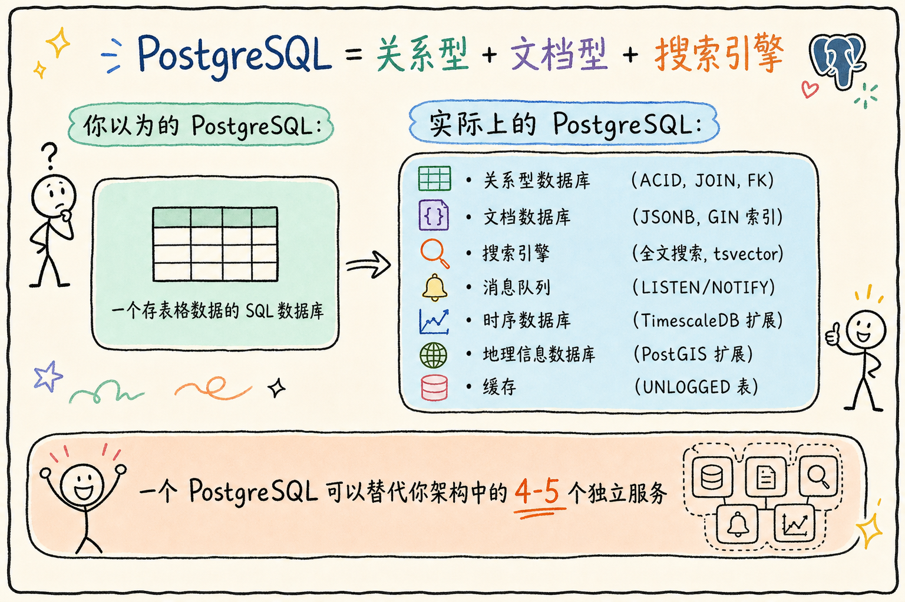
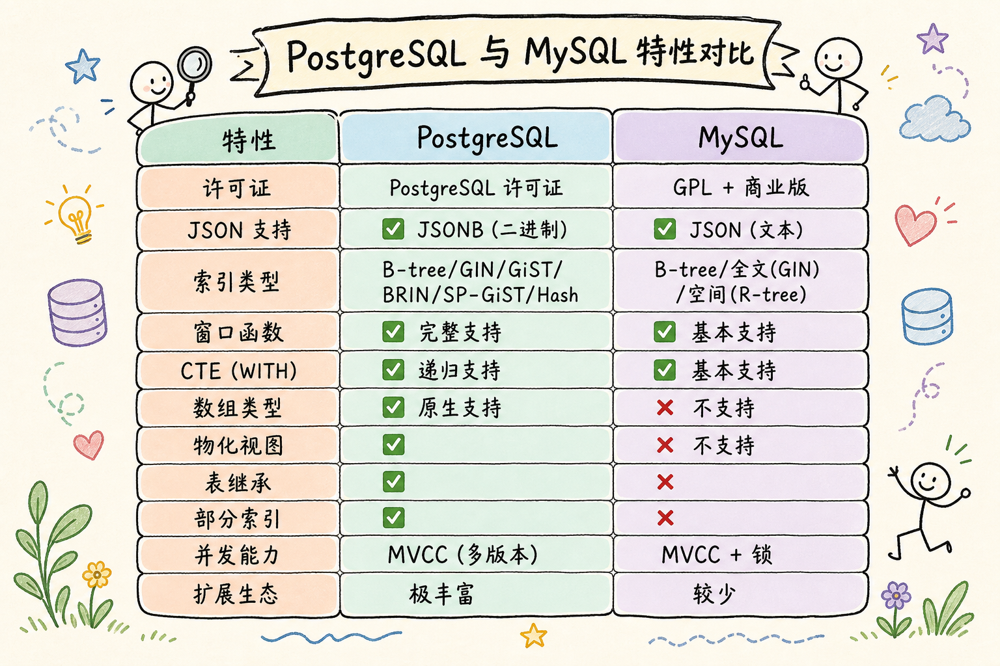
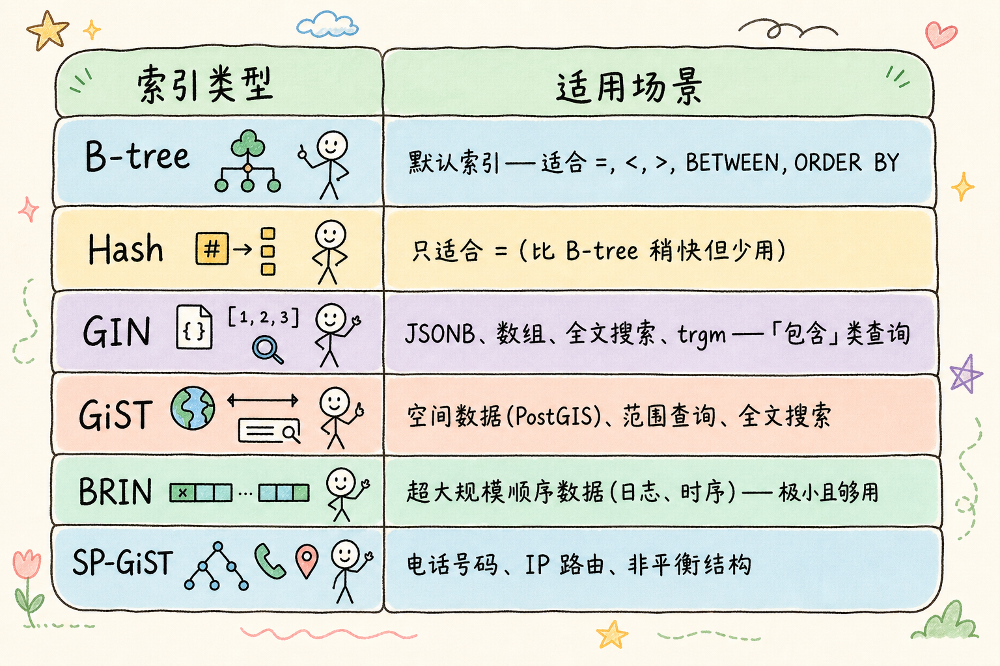
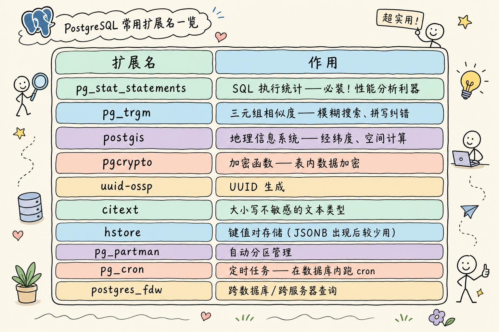
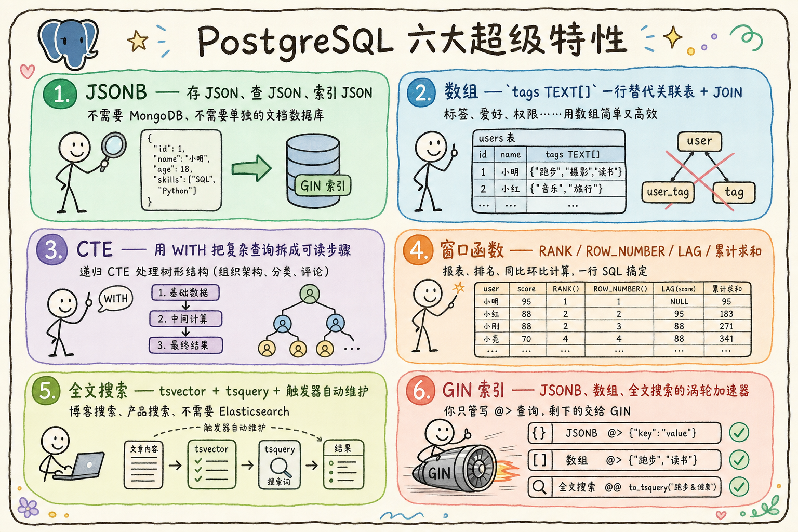

# PostgreSQL 常用特性完全指南：从增删改查到 JSON、全文搜索、窗口函数

> 你还把 PostgreSQL 当成「大号 MySQL」来用吗？你还在用 ORM 生成低效的 SQL 然后抱怨数据库慢吗？这篇教程带你深入 PostgreSQL 的常用特性——JSON 查询比 MongoDB 还好用、窗口函数三行解决复杂报表、全文搜索不用 Elasticsearch、CTE 让 SQL 像编程语言一样优雅。读完你会发现，这些年你只用到了 PostgreSQL 10% 的功力。

---

## 目录

1. [前言：那些年我们暴殄的天物](#1-前言那些年我们暴殄的天物)
2. [PostgreSQL 是什么——不止是关系型数据库](#2-postgresql-是什么不止是关系型数据库)
3. [JSON 与 JSONB——当关系型数据库比文档数据库还好用](#3-json-与-jsonb当关系型数据库比文档数据库还好用)
4. [数组类型——列表中台不再需要](#4-数组类型列表中台不再需要)
5. [CTE 与递归查询——SQL 变得像编程语言](#5-cte-与递归查询sql-变得像编程语言)
6. [窗口函数——复杂报表三行搞定](#6-窗口函数复杂报表三行搞定)
7. [全文搜索——不需要 Elasticsearch 的轻量方案](#7-全文搜索不需要-elasticsearch-的轻量方案)
8. [UPSERT——不存在就插入、存在就更新](#8-upsert不存在就插入存在就更新)
9. [索引进阶——GIN、GiST、BRIN、部分索引、覆盖索引](#9-索引进阶gin-gist-brin-部分索引覆盖索引)
10. [事务与并发控制](#10-事务与并发控制)
11. [常用扩展推荐](#11-常用扩展推荐)
12. [最佳实践与避坑指南](#12-最佳实践与避坑指南)
13. [总结](#13-总结)

---

## 1. 前言：那些年我们暴殄的天物

来看看这些常见场景，你是不是也这么干的：

**场景一：用户表需要存标签**

```sql
-- ❌ 老办法：建关联表
CREATE TABLE user_tags (
    user_id INT,
    tag VARCHAR(50),
    PRIMARY KEY (user_id, tag)
);
-- 查一个用户的所有标签要 JOIN，更新要删了再插
```

PostgreSQL 其实可以这样：

```sql
-- ✅ PostgreSQL 原生数组
ALTER TABLE users ADD COLUMN tags TEXT[];
-- 查标签: SELECT tags FROM users WHERE id = 1;
-- 查有某个标签的用户: SELECT * FROM users WHERE 'vip' = ANY(tags);
-- 加索引: CREATE INDEX ON users USING GIN(tags);
```

**场景二：需要存一些灵活的配置数据**

```sql
-- ❌ 老办法：用 TEXT 存 JSON 字符串——然后无法查询
INSERT INTO configs VALUES (1, '{"theme":"dark","lang":"zh"}');
-- 想查所有 theme=dark 的配置？抱歉，办不到

-- ✅ PostgreSQL JSONB
CREATE TABLE configs (
    id INT PRIMARY KEY,
    data JSONB
);
-- 查所有暗色主题:
SELECT * FROM configs WHERE data->>'theme' = 'dark';
-- 还能建索引:
CREATE INDEX ON configs USING GIN(data);
```

**场景三：给每个部门的员工按工资排名**

```sql
-- ❌ 老办法：应用层处理——查出所有数据，用 Python/Java 排序分组
rows = db.execute("SELECT * FROM employees ORDER BY dept, salary DESC")
# 然后写嵌套循环……

-- ✅ PostgreSQL 窗口函数
SELECT name, dept, salary,
       RANK() OVER (PARTITION BY dept ORDER BY salary DESC)
FROM employees;
-- 一行 SQL，搞定。
```

读完本文，你应该能做到三件事：

1. 用 PostgreSQL 写出常见的增删改查、JSONB、数组、窗口函数和全文搜索查询。
2. 判断什么时候应该用 PostgreSQL 自带能力，什么时候不必上 Elasticsearch、Redis 或额外服务。
3. 避开连接池、索引、事务、时间类型这些初学者最容易踩的坑。

本文示例默认使用 PostgreSQL 15+。如果你只想本地练习，推荐用 Docker 启动一个临时数据库；如果你还没学过 SQL，建议先熟悉 `SELECT`、`INSERT`、`UPDATE`、`DELETE` 再读后面的进阶章节。



上图概括了 PostgreSQL 的「全栈」定位：关系型、JSONB 文档、全文搜索、LISTEN/NOTIFY 等能力可以集中在同一实例里，减少架构里的独立组件数量。

---

## 2. PostgreSQL 是什么——不止是关系型数据库

### 2.1 和 MySQL 的根本区别

如果你从 MySQL 转过来，先建立直觉：两者都能存表和数据，但 PostgreSQL 在**扩展性、标准 SQL 支持、复杂查询**上更「全栈」。读下图时重点看 JSONB、索引类型、窗口函数、CTE 这几行——后面章节都会用到。



对照上图：**JSONB** 让文档型数据可索引、可查询；**GIN/GiST/BRIN** 等索引类型覆盖 JSON、全文、大表分区等场景；**窗口函数与 CTE** 在 SQL 里就能写复杂报表和树形查询。选 PostgreSQL 通常不是因为「MySQL 不能用」，而是当你需要这些能力且希望少引外部组件时，它更省事。

### 2.2 推荐安装

```bash
# macOS
brew install postgresql@16

# Ubuntu/Debian
sudo apt install postgresql postgresql-contrib

# Docker（推荐开发环境）
docker run --name pg -e POSTGRES_PASSWORD=secret -p 5432:5432 -d postgres:16-alpine

# Windows
# 下载安装包: https://www.postgresql.org/download/windows/
```

```bash
# 连接
psql -h localhost -U postgres -d mydb

# 或使用 GUI 工具
# • DBeaver (免费、跨平台)
# • TablePlus (macOS/Windows)
# • pgAdmin (官方、Web 界面)
```

---

## 3. JSON 与 JSONB——当关系型数据库比文档数据库还好用

### 3.1 JSON vs JSONB——选哪个

**JSONB**：PostgreSQL 的二进制 JSON 存储格式，适合存结构灵活但仍要查询的字段。
通俗说：它像一个“可被数据库理解的 JSON 文件”，既能保存灵活属性，也能用索引加速查询。

```sql
-- JSON: 纯文本存储，保留原始格式（空格、键顺序）
--       每次查询都要重新解析 → 慢
-- JSONB: 二进制存储，解析过的高效格式
--        支持索引，查询快 → 99% 的场景用 JSONB

-- 一个简单的对照
SELECT
    '{"b": 2, "a": 1}'::json   AS json_col,    -- 保持原样
    '{"b": 2, "a": 1}'::jsonb  AS jsonb_col;   -- 变成 {"a": 1, "b": 2}（重排了键）
```

> 结论：**存数据用 JSONB，只有需要保留原始文档格式（如 API 日志）才用 JSON。**

### 3.2 JSONB 的查询操作符

```sql
-- 准备测试数据
CREATE TABLE products (
    id SERIAL PRIMARY KEY,
    name TEXT NOT NULL,
    attributes JSONB NOT NULL
);

INSERT INTO products (name, attributes) VALUES
    ('iPhone 15', '{"brand": "Apple", "color": "black", "storage": 256, "price": 7999, "tags": ["5G", "FaceID"]}'),
    ('MacBook Pro', '{"brand": "Apple", "color": "silver", "ram": 16, "price": 14999, "tags": ["M3", "Retina"]}'),
    ('ThinkPad X1', '{"brand": "Lenovo", "color": "black", "ram": 32, "price": 12999, "tags": ["4G", "Touch"]}'),
    ('Galaxy S24', '{"brand": "Samsung", "color": "black", "storage": 512, "price": 6999, "tags": ["5G", "AI"]}');

-- ===== 查询操作符速查 =====

-- ->  返回 JSON 对象（保持 JSONB 类型）
SELECT attributes -> 'brand' FROM products;
-- 结果: "Apple", "Apple", "Lenovo", "Samsung"  (带引号的 JSON 值)

-- ->> 返回文本
SELECT attributes ->> 'brand' FROM products;
-- 结果: Apple, Apple, Lenovo, Samsung  (纯文本，不带引号)

-- @>  包含操作符——JSONB 最强大的查询能力
-- 查所有 Apple 产品
SELECT name FROM products
WHERE attributes @> '{"brand": "Apple"}';

-- 查所有黑色、256G 存储的产品
SELECT name FROM products
WHERE attributes @> '{"color": "black", "storage": 256}';
-- 注意：必须精确匹配

-- ?   键是否存在
SELECT name FROM products
WHERE attributes ? 'storage';  -- 有 storage 属性的产品

-- ?|  任意键存在
SELECT name FROM products
WHERE attributes ?| ARRAY['ram', 'storage'];  -- 有 ram 或 storage

-- ?&  所有键都存在
SELECT name FROM products
WHERE attributes ?& ARRAY['brand', 'price'];  -- 同时有 brand 和 price

-- 查数组中包含某个值
SELECT name FROM products
WHERE attributes->'tags' @> '"5G"';
-- 注意: tags → JSON 值，'"5G"' 是 JSON 格式的字符串

-- 组合查询——JSON + 关系字段
SELECT name, attributes->>'price' AS price
FROM products
WHERE attributes->>'brand' = 'Apple'
  AND (attributes->>'price')::int < 10000
ORDER BY (attributes->>'price')::int DESC;
```

### 3.3 JSONB 索引

本节是进阶内容。日常开发先记住一句：经常按 JSONB 字段过滤时再建索引，不要为了“看起来高级”给所有 JSONB 字段都建索引。

```sql
-- GIN 索引——最常用的 JSONB 索引
CREATE INDEX idx_products_attributes ON products USING GIN(attributes);

-- 这个索引可以加速: @>, ?, ?|, ?& 操作符
-- 以下查询都能用到索引:
SELECT * FROM products WHERE attributes @> '{"brand": "Apple"}';
SELECT * FROM products WHERE attributes ? 'storage';

-- 针对特定字段的 B-tree 索引——如果经常按某个 JSON 字段排序/比较
CREATE INDEX idx_products_price ON products ((attributes->>'price'));
-- 注意双括号——表达式索引

-- 查找某个字段值大于 10000 的产品——会用到上面的索引
SELECT name FROM products WHERE (attributes->>'price')::int > 10000;
```

### 3.4 JSONB 的修改操作

```sql
-- 添加/更新字段
UPDATE products
SET attributes = attributes || '{"warranty": 12}'::jsonb;
-- || 合并 JSON，重复的键会被覆盖

-- 删除字段
UPDATE products
SET attributes = attributes - 'color';
-- 删除 color 键

-- 删除多个字段
UPDATE products
SET attributes = attributes - ARRAY['warranty', 'tags'];

-- 嵌套修改——用 jsonb_set
-- 先插入一个带嵌套结构的记录
INSERT INTO products (name, attributes) VALUES
    ('iPad Air', '{"specs": {"screen": 10.9, "weight": 462}, "price": 5499}');

-- 修改嵌套字段: specs.screen → 11.0
UPDATE products
SET attributes = jsonb_set(attributes, '{specs,screen}', '11.0')
WHERE name = 'iPad Air';

-- 追加数组元素
UPDATE products
SET attributes = jsonb_set(
    attributes,
    '{tags}',
    COALESCE(attributes->'tags', '[]'::jsonb) || '"Pencil"'::jsonb
)
WHERE name = 'iPad Air';
```

### 3.5 JSONB 与 ORM 配合——Python 示例

```python
# SQLAlchemy + PostgreSQL JSONB
from sqlalchemy import Column, Integer, String
from sqlalchemy.dialects.postgresql import JSONB
from sqlalchemy.orm import declarative_base

Base = declarative_base()

class Product(Base):
    __tablename__ = 'products'

    id = Column(Integer, primary_key=True)
    name = Column(String)
    attributes = Column(JSONB)

# 查询
products = session.query(Product).filter(
    Product.attributes['brand'].astext == 'Apple'
).all()

# 包含查询
products = session.query(Product).filter(
    Product.attributes.contains({'color': 'black'})
).all()
```

---

## 4. 数组类型——列表中台不再需要

### 4.1 数组的创建与查询

```sql
-- 创建带数组列的表
CREATE TABLE blog_posts (
    id SERIAL PRIMARY KEY,
    title TEXT,
    tags TEXT[],           -- 字符串数组
    view_counts INT[],     -- 整数数组（每日浏览量）
    created_at TIMESTAMPTZ DEFAULT NOW()
);

-- 插入数据
INSERT INTO blog_posts (title, tags, view_counts) VALUES
    ('PostgreSQL 教程', ARRAY['postgresql', 'database', 'tutorial'], ARRAY[120, 85, 200]),
    ('Python 异步', ARRAY['python', 'async'], ARRAY[300, 450]),
    ('REST API 设计', ARRAY['api', 'rest', 'tutorial'], ARRAY[50, 60, 55, 80]);

-- 查询——数组比关联表方便太多了
SELECT title FROM blog_posts WHERE 'tutorial' = ANY(tags);
-- 等价于: SELECT title FROM blog_posts WHERE tags @> ARRAY['tutorial'];

SELECT title FROM blog_posts WHERE 'api' = ANY(tags);

-- 多标签——同时包含
SELECT title FROM blog_posts
WHERE tags @> ARRAY['tutorial', 'database'];
-- @> 是「包含」——左边的数组包含右边的所有元素

-- 标签数超过 2 个的文章
SELECT title, cardinality(tags) AS tag_count
FROM blog_posts
WHERE cardinality(tags) > 2;

-- 展开数组为行（用于统计）
SELECT tag, COUNT(*) FROM (
    SELECT unnest(tags) AS tag FROM blog_posts
) t
GROUP BY tag ORDER BY COUNT(*) DESC;
-- 结果:
-- tutorial: 2, postgresql: 1, database: 1, python: 1, async: 1, api: 1, rest: 1
```

### 4.2 数组操作符速查

```sql
-- 准备工作
SELECT ARRAY[1, 2, 3] || ARRAY[4, 5];          -- {1,2,3,4,5}  拼接
SELECT ARRAY[1, 2, 3] || 4;                    -- {1,2,3,4}    追加元素
SELECT 0 || ARRAY[1, 2, 3];                    -- {0,1,2,3}    前面插入

SELECT ARRAY[1, 2, 3, 4, 5][1];                -- 1            取第1个（从1开始！）
SELECT ARRAY[1, 2, 3, 4, 5][1:3];              -- {1,2,3}      切片

SELECT ARRAY[1, 2, 3] @> ARRAY[1, 2];          -- true         包含
SELECT ARRAY[1, 2] <@ ARRAY[1, 2, 3];          -- true         被包含
SELECT ARRAY[1, 2, 3] && ARRAY[2, 3, 4];       -- true         有交集

SELECT unnest(ARRAY[1, 2, 3]);                 -- 展开为行
SELECT array_agg(id) FROM products;             -- 聚合成数组
SELECT string_agg(name, ', ') FROM products;    -- 聚合成字符串

SELECT array_length(ARRAY[1,2,3], 1);           -- 3            数组长度
SELECT cardinality(ARRAY[1,2,3]);               -- 3            数组长度（推荐）
```

### 4.3 数组索引

```sql
-- GIN 索引——加速 @>, &&, <@ 等包含操作
CREATE INDEX idx_posts_tags ON blog_posts USING GIN(tags);

-- 以下查询都能用到索引
SELECT * FROM blog_posts WHERE tags @> ARRAY['tutorial'];
SELECT * FROM blog_posts WHERE tags && ARRAY['python', 'api'];
```

---

## 5. CTE 与递归查询——SQL 变得像编程语言

### 5.1 普通 CTE (WITH)

CTE（Common Table Expression，公用表表达式）让你把复杂查询拆成可读的步骤：

```sql
-- ❌ 一层套一层——根本无法维护
SELECT *
FROM (
    SELECT *, ROW_NUMBER() OVER (PARTITION BY dept ORDER BY salary DESC) AS rn
    FROM (
        SELECT * FROM employees WHERE status = 'active'
    ) e
) ranked
WHERE rn = 1;

-- ✅ 用 CTE 拆成一步步——清晰优雅
WITH
    active_employees AS (
        SELECT * FROM employees WHERE status = 'active'
    ),
    ranked AS (
        SELECT *, ROW_NUMBER() OVER (PARTITION BY dept ORDER BY salary DESC) AS rn
        FROM active_employees
    )
SELECT * FROM ranked WHERE rn = 1;
-- 每个 CTE 都可以被后面的 CTE 引用
```

**CTE 对比子查询的优势：**


CTE 把复杂 SQL 拆成**有名字的中继步骤**，读起来像「先算 A，再用 A 算 B」；嵌套子查询则像俄罗斯套娃，越深越难维护。递归 CTE 还能在 SQL 里遍历树——这是普通子查询很难优雅表达的。

### 5.2 递归 CTE——查询树形结构的神器

```sql
-- 组织架构表
CREATE TABLE employees (
    id INT PRIMARY KEY,
    name TEXT,
    manager_id INT REFERENCES employees(id)
);

INSERT INTO employees VALUES
    (1, 'CEO', NULL),
    (2, 'CTO', 1),
    (3, 'CFO', 1),
    (4, '后端主管', 2),
    (5, '前端主管', 2),
    (6, '后端开发A', 4),
    (7, '后端开发B', 4),
    (8, '前端开发A', 5),
    (9, '财务经理', 3),
    (10, '会计', 9);

-- 查询某人的所有下属（向下递归）
WITH RECURSIVE subordinates AS (
    -- 起点: 找 CTO（id=2）
    SELECT id, name, manager_id, 0 AS level
    FROM employees
    WHERE id = 2

    UNION ALL

    -- 递归: 找上一批人的所有下属
    SELECT e.id, e.name, e.manager_id, s.level + 1
    FROM employees e
    JOIN subordinates s ON e.manager_id = s.id
)
SELECT REPEAT('  ', level) || name AS org_chart
FROM subordinates;
```

输出：

```
CTO
  后端主管
    后端开发A
    后端开发B
  前端主管
    前端开发A
```

**递归 CTE 的结构：**

```
WITH RECURSIVE 名称 AS (
    -- 基础查询——起点（不递归）
    SELECT ... FROM ...
    WHERE ...

    UNION ALL  (或 UNION)

    -- 递归查询——引用 CTE 自身
    SELECT ... FROM ... JOIN 名称 ON ...
)
SELECT * FROM 名称;
```

### 5.3 实战：商品分类树

```sql
CREATE TABLE categories (
    id SERIAL PRIMARY KEY,
    name TEXT NOT NULL,
    parent_id INT REFERENCES categories(id)
);

INSERT INTO categories (id, name, parent_id) VALUES
    (1, '电子产品', NULL),
    (2, '手机', 1),
    (3, '电脑', 1),
    (4, '智能手机', 2),
    (5, '功能手机', 2),
    (6, '笔记本', 3),
    (7, '台式机', 3),
    (8, '苹果笔记本', 6),
    (9, 'Windows笔记本', 6);

-- 查「电脑」类别下的所有子类别（含自身）——生成面包屑
WITH RECURSIVE category_tree AS (
    -- 起点
    SELECT id, name, parent_id, name AS path, 1 AS depth
    FROM categories
    WHERE id = 3

    UNION ALL

    SELECT c.id, c.name, c.parent_id,
           ct.path || ' > ' || c.name, ct.depth + 1
    FROM categories c
    JOIN category_tree ct ON c.parent_id = ct.id
)
SELECT depth, path FROM category_tree ORDER BY depth;
```

输出：

```
depth | path
------+-----------------------------------
    1 | 电脑
    2 | 电脑 > 笔记本
    2 | 电脑 > 台式机
    3 | 电脑 > 笔记本 > 苹果笔记本
    3 | 电脑 > 笔记本 > Windows笔记本
```

---

## 6. 窗口函数——复杂报表三行搞定

### 6.1 窗口函数基础

窗口函数 = 在「窗口」（一组相关的行）上执行计算。和 GROUP BY 的区别在于：**GROUP BY 把每组聚合为一行，窗口函数保留每一行，同时在旁边附上聚合结果。**

```sql
-- 测试数据
CREATE TABLE sales (
    id SERIAL PRIMARY KEY,
    salesperson TEXT,
    product TEXT,
    amount DECIMAL(10,2),
    sale_date DATE
);

INSERT INTO sales VALUES
    (1, '张三', '产品A', 1000, '2024-01-05'),
    (2, '张三', '产品B', 1500, '2024-01-10'),
    (3, '张三', '产品C', 800,  '2024-01-15'),
    (4, '李四', '产品A', 1200, '2024-01-05'),
    (5, '李四', '产品B', 2000, '2024-01-12'),
    (6, '王五', '产品A', 900,  '2024-01-08'),
    (7, '王五', '产品C', 1100, '2024-01-18');

-- 窗口函数基本语法
SELECT
    salesperson,
    product,
    amount,
    -- ROW_NUMBER(): 行号——窗口内第几个
    ROW_NUMBER() OVER (PARTITION BY salesperson ORDER BY amount DESC) AS rank_by_person,

    -- SUM() 作为窗口函数——每个人的总销售额
    SUM(amount) OVER (PARTITION BY salesperson) AS person_total,

    -- 占总计的百分比
    ROUND(amount * 100.0 / SUM(amount) OVER (), 1) AS pct_of_total,

    -- 累计求和——按日期排序的累计销售额
    SUM(amount) OVER (ORDER BY sale_date) AS running_total

FROM sales
ORDER BY salesperson, amount DESC;
```

输出解读：

```
salesperson | product | amount | rank  | person_total | pct  | running_total
------------+---------+--------+-------+-------------+------+--------------
张三        | 产品B   | 1500   |   1   |   3300      | 17.6 |  2200
张三        | 产品A   | 1000   |   2   |   3300      | 11.8 |  5200
张三        | 产品C   |  800   |   3   |   3300      |  9.4 |  7700
李四        | 产品B   | 2000   |   1   |   3200      | 23.5 |  3200
李四        | 产品A   | 1200   |   2   |   3200      | 14.1 |  4200
王五        | 产品C   | 1100   |   1   |   2000      | 12.9 |  8800
王五        | 产品A   |  900   |   2   |   2000      | 10.6 |  6800

每行的 person_total 是按人分组的总和（保留每行）
running_total 是按日期累计（不分组，全表累计）
```

### 6.2 常用窗口函数速查

```sql
-- 排名函数（三个的区别仅在处理平局时）
SELECT
    name, score,
    ROW_NUMBER()   OVER (ORDER BY score DESC) AS row_num,   -- 1,2,3,4... 即使分数相同也不同号
    RANK()         OVER (ORDER BY score DESC) AS rank,      -- 1,2,2,4... 同分同名次，跳号
    DENSE_RANK()   OVER (ORDER BY score DESC) AS dense_rank -- 1,2,2,3... 同分同名次，不跳号
FROM exam_results;

-- LAG / LEAD——访问前一行 / 后一行
SELECT
    sale_date,
    amount,
    LAG(amount) OVER (ORDER BY sale_date) AS prev_amount,
    amount - LAG(amount) OVER (ORDER BY sale_date) AS diff,
    LEAD(amount) OVER (ORDER BY sale_date) AS next_amount
FROM sales;

-- FIRST_VALUE / LAST_VALUE——窗口内第一个 / 最后一个值
SELECT
    salesperson,
    sale_date,
    amount,
    FIRST_VALUE(amount) OVER (
        PARTITION BY salesperson ORDER BY sale_date
    ) AS first_sale_amount
FROM sales;

-- NTILE——把数据分桶
SELECT name, score,
       NTILE(4) OVER (ORDER BY score DESC) AS quartile  -- 分成 4 个档次
FROM exam_results;
```

### 6.3 窗口函数实战：用户留存分析

```sql
-- 用户签到表
CREATE TABLE checkins (
    user_id INT,
    checkin_date DATE,
    PRIMARY KEY (user_id, checkin_date)
);

-- 计算每个用户的连续签到天数
WITH ordered AS (
    SELECT user_id, checkin_date,
           -- 用日期减去排名——连续的日期会得到相同的值！
           checkin_date - (ROW_NUMBER() OVER (
               PARTITION BY user_id ORDER BY checkin_date
           ))::int AS grp
    FROM checkins
)
SELECT user_id,
       MIN(checkin_date) AS streak_start,
       MAX(checkin_date) AS streak_end,
       COUNT(*) AS streak_days
FROM ordered
GROUP BY user_id, grp
HAVING COUNT(*) >= 3  -- 只看 3 天以上的连续签到
ORDER BY user_id, streak_start;

-- 核心技巧: 日期差 - 行号 = 连续标识
-- 解释:
-- 1月1日(第1天) → 1 - 1 = 0
-- 1月2日(第2天) → 2 - 2 = 0  ← 同样的 0!
-- 1月3日(第3天) → 3 - 3 = 0  ← 还是 0!
-- 1月5日(第5天) → 5 - 4 = 1  ← 断了! 新的一组
```

---

## 7. 全文搜索——不需要 Elasticsearch 的轻量方案

### 7.1 快速上手

```sql
-- 准备数据
CREATE TABLE articles (
    id SERIAL PRIMARY KEY,
    title TEXT,
    content TEXT,
    search_vector TSVECTOR    -- 搜索向量列
);

INSERT INTO articles (title, content) VALUES
    ('Python 异步编程指南', 'Python 的 asyncio 库让你可以用协程处理高并发 I/O 操作'),
    ('PostgreSQL 全文搜索', 'PostgreSQL 内置了强大的全文搜索功能，支持中文分词'),
    ('REST API 设计最佳实践', '设计 REST 风格的 API 需要注意 URL 命名和状态码使用');

-- 创建搜索向量
UPDATE articles SET search_vector = to_tsvector('simple', title || ' ' || content);

-- 搜索！
SELECT title, ts_rank(search_vector, query) AS rank
FROM articles, to_tsquery('simple', 'python | 异步') AS query
WHERE search_vector @@ query
ORDER BY rank DESC;
```

### 7.2 搜索语法

```sql
-- to_tsquery 支持的搜索表达式:

-- 或 (OR)
SELECT to_tsquery('simple', 'python | postgresql');

-- 与 (AND)
SELECT to_tsquery('simple', 'python & search');

-- 取反 (NOT)
SELECT to_tsquery('simple', 'python & !java');

-- 短语搜索
SELECT to_tsquery('simple', '''rest api''');

-- 前缀匹配
SELECT to_tsquery('simple', 'async:*');    -- 匹配 async, asynchronous 等

-- 实际搜索
SELECT title FROM articles
WHERE search_vector @@ to_tsquery('simple', 'python & !java');

-- 查看搜索词在文本中的位置
SELECT title, ts_headline('simple', content, query) AS snippet
FROM articles, to_tsquery('simple', 'postgresql') AS query
WHERE search_vector @@ query;
```

### 7.3 中文全文搜索

```sql
-- PostgreSQL 自带的 'simple' 字典按空格分词，对中文无效
-- 解决方案: 安装 zhparser 扩展或用 pg_bigm/pg_jieba/pg_trgm

-- 方案一: 用 pg_trgm (三角词法——对中文勉强能用)
CREATE EXTENSION IF NOT EXISTS pg_trgm;

CREATE INDEX idx_articles_title_trgm ON articles USING GIN(title gin_trgm_ops);

-- 模糊搜索中文
SELECT title FROM articles
WHERE title % '异步编程';   -- % 是相似度操作符

SELECT title, similarity(title, '异步编程') AS sim
FROM articles
WHERE title % '异步编程'
ORDER BY sim DESC;

-- 方案二: 安装 zhparser (推荐，但需要编译)
-- CREATE EXTENSION zhparser;
-- CREATE TEXT SEARCH CONFIGURATION zh (PARSER = zhparser);
-- ALTER TEXT SEARCH CONFIGURATION zh ADD MAPPING FOR n,v,a,i,e,l WITH simple;
-- SELECT to_tsvector('zh', 'PostgreSQL 全文搜索教程');
```

### 7.4 自动维护搜索向量——触发器

```sql
-- 创建触发器——插入/更新时自动更新 search_vector
CREATE OR REPLACE FUNCTION update_search_vector()
RETURNS TRIGGER AS $$
BEGIN
    NEW.search_vector := to_tsvector('simple', COALESCE(NEW.title, '') || ' ' || COALESCE(NEW.content, ''));
    RETURN NEW;
END;
$$ LANGUAGE plpgsql;

CREATE TRIGGER trg_articles_search
    BEFORE INSERT OR UPDATE ON articles
    FOR EACH ROW
    EXECUTE FUNCTION update_search_vector();

-- 生成列方式（PostgreSQL 12+，更简洁）
-- ALTER TABLE articles ADD COLUMN search_vector TSVECTOR
--     GENERATED ALWAYS AS (to_tsvector('simple', COALESCE(title, '') || ' ' || COALESCE(content, '')))
--     STORED;
```

---

## 8. UPSERT——不存在就插入、存在就更新

### 8.1 基本语法

```sql
-- 传统方式（MySQL 的 REPLACE 或先 SELECT 再判断——麻烦且不安全）
-- PostgreSQL: ON CONFLICT 一行搞定

-- 准备: 用户收藏表，user_id + article_id 唯一
CREATE TABLE favorites (
    user_id INT,
    article_id INT,
    favorited_at TIMESTAMPTZ DEFAULT NOW(),
    PRIMARY KEY (user_id, article_id)
);

-- UPSERT: 收藏/取消收藏
INSERT INTO favorites (user_id, article_id)
VALUES (1, 42)
ON CONFLICT (user_id, article_id)
DO NOTHING;
-- 已存在 → 什么都不做。不存在 → 插入

-- 或者: 更新收藏时间
INSERT INTO favorites (user_id, article_id)
VALUES (1, 42)
ON CONFLICT (user_id, article_id)
DO UPDATE SET favorited_at = NOW();
-- 已存在 → 更新收藏时间。不存在 → 插入

-- 更复杂: 合并更新
INSERT INTO favorites (user_id, article_id, favorited_at)
VALUES (1, 42, NOW())
ON CONFLICT (user_id, article_id)
DO UPDATE SET
    favorited_at = EXCLUDED.favorited_at;
-- EXCLUDED 引用被拒绝插入的那一行数据
```

### 8.2 实战：批量统计计数器

```sql
-- 文章阅读量统计表
CREATE TABLE article_stats (
    article_id INT PRIMARY KEY,
    view_count INT DEFAULT 0,
    like_count INT DEFAULT 0,
    last_updated TIMESTAMPTZ DEFAULT NOW()
);

-- 批量更新——如果不存在就创建，存在就累加
INSERT INTO article_stats (article_id, view_count, like_count)
VALUES
    (1, 10, 3),
    (2, 5, 1),
    (3, 20, 8)
ON CONFLICT (article_id)
DO UPDATE SET
    view_count = article_stats.view_count + EXCLUDED.view_count,
    like_count = article_stats.like_count + EXCLUDED.like_count,
    last_updated = NOW();
-- 一个 SQL 完成「有则加、无则插」的批量操作
```

---

## 9. 索引进阶——GIN、GiST、BRIN、部分索引、覆盖索引

### 9.1 索引类型速查



本章术语较多，先看一张地图即可。后面的 SQL 示例只是帮你把这些名字落到代码里。

| 索引类型 | 通俗解释 | 适合场景 |
|----------|----------|----------|
| B-tree | 像字典目录，按顺序快速定位 | 等值、范围、排序，默认首选 |
| GIN | 像倒排表，一个值能对应很多行 | JSONB、数组、全文搜索 |
| GiST | 像通用空间索引框架 | 地理位置、范围类型、相似度 |
| BRIN | 像给大文件每一段贴摘要 | 超大表、按时间递增写入的数据 |
| 部分索引 | 只给一部分行建索引 | 只查活跃用户、未删除记录 |
| 覆盖索引 | 索引里顺手带上查询需要的列 | 让查询少回表，减少随机读 |

### 9.2 部分索引——只为关心的数据建索引

```sql
-- 只给活跃用户建索引（活跃用户只占 10%）
CREATE INDEX idx_active_users ON users(email)
WHERE status = 'active';

-- 这个索引只包含 status='active' 的行
-- 查询活跃用户时→走索引，快！且索引很小
-- 查询所有用户时→走全表扫描，没关系
```

### 9.3 覆盖索引——不用回表查数据

```sql
-- 普通索引: 先查索引找到 ctid → 再回表读数据
-- 覆盖索引: 索引本身包含了所有需要的列

-- 如果经常执行这个查询:
SELECT name, email FROM users WHERE department = 'Engineering';

-- 建覆盖索引——索引里就存着 name 和 email
CREATE INDEX idx_users_dept_cover ON users(department) INCLUDE (name, email);
--                                             ^^^^^^^^^^^^^^^^^^^^^^^^
--                                             辅助列——只存不索引

-- 这个查询只需要扫描索引，不必访问表本身（Index-Only Scan）
```

### 9.4 表达式索引

```sql
-- 如果经常按小写的邮箱查询
SELECT * FROM users WHERE LOWER(email) = 'zhangsan@example.com';

-- 直接给表达式建索引——而不是给字段
CREATE INDEX idx_users_lower_email ON users (LOWER(email));

-- 其他常见的表达式索引:
CREATE INDEX idx_orders_date ON orders ((created_at::date));        -- 按日期（去掉时间）
CREATE INDEX idx_products_json_price ON products ((attributes->>'price'));  -- JSON 字段
```

### 9.5 索引使用检查

```sql
-- 查看查询是否用到索引
EXPLAIN ANALYZE
SELECT * FROM products WHERE attributes @> '{"brand": "Apple"}';

-- 输出中看到:
-- Bitmap Index Scan on idx_products_attributes  ← 用到索引了！
-- Seq Scan on products                          ← 没用索引（全表扫）

-- 查看表上都有哪些索引
SELECT indexname, indexdef FROM pg_indexes WHERE tablename = 'products';

-- 查看未使用的索引（浪费空间）
SELECT schemaname, tablename, indexname, idx_scan
FROM pg_stat_user_indexes
WHERE idx_scan = 0
ORDER BY pg_relation_size(indexrelid::regclass) DESC;

-- 查看哪些查询最慢
SELECT query, calls, mean_exec_time, total_exec_time
FROM pg_stat_statements
ORDER BY mean_exec_time DESC
LIMIT 10;
-- 需要先: CREATE EXTENSION pg_stat_statements;
```

---

## 10. 事务与并发控制

### 10.1 事务隔离级别

```sql
-- PostgreSQL 默认隔离级别: READ COMMITTED

-- 查看当前级别
SHOW transaction_isolation;

-- 设置隔离级别
BEGIN;
SET TRANSACTION ISOLATION LEVEL SERIALIZABLE;
-- ... 操作
COMMIT;

-- 也可在全局设置
-- ALTER DATABASE mydb SET default_transaction_isolation = 'repeatable read';
```

### 10.2 乐观锁——用版本号防并发冲突

```sql
-- 电商减库存——避免超卖
CREATE TABLE inventory (
    product_id INT PRIMARY KEY,
    quantity INT,
    version INT DEFAULT 1     -- 版本号
);

INSERT INTO inventory VALUES (1, 100, 1);

-- 扣减库存的 SQL
UPDATE inventory
SET quantity = quantity - 5,
    version = version + 1
WHERE product_id = 1 AND quantity >= 5 AND version = 1;
--                                    ^^^^^^^^^^^^^
--                                    关键: 检查版本号

-- 如果 UPDATE 影响了 0 行 → 别人已经改过了 → 重试
```

### 10.3 行级锁——FOR UPDATE

```sql
-- 事务 A:
BEGIN;
SELECT * FROM inventory WHERE product_id = 1 FOR UPDATE;
-- 锁定这行，别的事务不能修改
-- ... 检查库存、计算 ...
UPDATE inventory SET quantity = quantity - 5 WHERE product_id = 1;
COMMIT;

-- 事务 B 在 A COMMIT 之前会阻塞等待

-- FOR UPDATE——排他锁（别人不能读也不能写被锁的行）
-- FOR SHARE——共享锁（别人可以读但不能写）
-- SKIP LOCKED——跳过已经被锁的行（适合队列场景）
```

### 10.4 咨询锁——应用层的互斥

```sql
-- 场景: 确保同一个定时任务不会同时运行两个实例

-- 获取咨询锁（非阻塞）
SELECT pg_try_advisory_lock(42);  -- 42 是应用定义的 ID
-- 返回 true → 拿到锁，执行任务
-- 返回 false → 别人正在执行，跳过

-- 释放
SELECT pg_advisory_unlock(42);

-- 会话级——连接断开自动释放
SELECT pg_try_advisory_lock(42);

-- 事务级——事务结束自动释放
SELECT pg_try_advisory_xact_lock(42);
```

---

## 11. 常用扩展推荐

```sql
-- 查看已安装的扩展
SELECT * FROM pg_extension;

-- 查看可用扩展列表
SELECT * FROM pg_available_extensions ORDER BY name;
```

PostgreSQL 的很多「超能力」来自**扩展（extension）**——按需 `CREATE EXTENSION` 即可，不必换数据库。下图列出日常开发最常碰到的几个；后面代码块演示如何安装和使用。



```sql
-- 核心扩展安装示例

-- pg_stat_statements: 找出哪些查询最费时
CREATE EXTENSION pg_stat_statements;
SELECT query, calls, mean_exec_time, total_exec_time
FROM pg_stat_statements
ORDER BY total_exec_time DESC LIMIT 10;

-- uuid-ossp: 生成 UUID 主键
CREATE EXTENSION "uuid-ossp";
CREATE TABLE users (
    id UUID DEFAULT uuid_generate_v4() PRIMARY KEY,
    name TEXT
);

-- pgcrypto: 密码哈希
CREATE EXTENSION pgcrypto;
INSERT INTO users (name, password_hash) VALUES
    ('张三', crypt('mypassword', gen_salt('bf')));
-- 验证: SELECT * FROM users WHERE name = '张三' AND password_hash = crypt('mypassword', password_hash);

-- pg_trgm: 模糊搜索
CREATE EXTENSION pg_trgm;
CREATE INDEX idx_users_name_trgm ON users USING GIN(name gin_trgm_ops);
SELECT name, similarity(name, '张三丰') FROM users
WHERE name % '张三丰' ORDER BY similarity DESC;
-- 可以找到 "张三峰"、"张山峰" 等近似匹配
```

---

## 12. 最佳实践与避坑指南

### 12.1 十条常用法则

**法则一：ID 用 UUID 而非自增整数（对外场景）**

```sql
-- ❌ 自增 ID 暴露了数据规模、容易被遍历
-- GET /api/users/42 → 知道了这是第 42 号用户

-- ✅ UUID 隐藏信息，别人才猜不到
CREATE EXTENSION "uuid-ossp";
CREATE TABLE users (
    id UUID DEFAULT uuid_generate_v4() PRIMARY KEY
);
-- GET /api/users/550e8400-e29b-41d4-a716-446655440000
```

**法则二：用 `TEXT` 而不是 `VARCHAR(N)`**

```sql
-- ❌ VARCHAR(255)——长度限制既不能提升性能，还会导致数据被截断
-- ✅ TEXT——PostgreSQL 中 TEXT 和 VARCHAR 性能完全相同，TEXT 更灵活

-- 如果确实需要长度限制，在应用层或 CHECK 约束中做
-- ALTER TABLE users ADD CONSTRAINT name_length CHECK (char_length(name) <= 100);
```

**法则三：记录真实发生时刻时，用 `TIMESTAMPTZ` 而不是 `TIMESTAMP`**

```sql
-- ❌ TIMESTAMP——只是一段不带时区的日期时间文本，跨时区展示时容易混乱
-- ✅ TIMESTAMPTZ——表示一个真实时间点，PostgreSQL 会按会话时区展示

-- 设置数据库时区
ALTER DATABASE mydb SET timezone = 'Asia/Shanghai';
```

注意：`TIMESTAMPTZ` 适合记录“订单创建于某个真实瞬间”。如果你要存“每周一纽约时间 9:00 开会”这类未来日程，还需要单独保存地点/时区规则，不能只靠一个时间戳解决。

**法则四：连接池是必须的**

```bash
# PostgreSQL 每个连接 fork 一个进程——非常重
# 生产环境必须用连接池
# 推荐: PgBouncer（轻量）或 Pgpool-II（功能丰富）

# 应用层连接池 (Python):
# SQLAlchemy: pool_size=5, max_overflow=10
# Django: CONN_MAX_AGE=60 (持久连接)
```

**法则五：用 `COPY` / `\copy` 而不是 `INSERT` 做大批量导入**

```sql
-- ❌ 100 万条 INSERT——慢
INSERT INTO users VALUES (...), (...), ...;

-- ✅ COPY——由数据库服务器读取文件，适合文件就在数据库服务器上的场景
COPY users FROM '/tmp/users.csv' WITH (FORMAT csv, HEADER true);

-- ✅ \copy——由本机 psql 读取文件，再传给数据库，更适合本地开发
\copy users FROM './users.csv' WITH (FORMAT csv, HEADER true);

-- 从程序中使用:
-- Python: cursor.copy_expert("COPY users FROM STDIN WITH CSV", file)
```

**法则六：大表满足明确条件时再分区**

分区不是“大了就一定要做”的魔法按钮。只有当数据天然按时间、租户、地区等字段切开，并且查询/归档/删除也经常按这个字段发生时，分区才通常值得。

```sql
-- 按日期分区的日志表
CREATE TABLE logs (
    id SERIAL,
    created_at TIMESTAMPTZ DEFAULT NOW(),
    level TEXT,
    message TEXT
) PARTITION BY RANGE (created_at);

-- 创建分区
CREATE TABLE logs_202401 PARTITION OF logs
    FOR VALUES FROM ('2024-01-01') TO ('2024-02-01');
CREATE TABLE logs_202402 PARTITION OF logs
    FOR VALUES FROM ('2024-02-01') TO ('2024-03-01');

-- 查询时限定日期范围——自动只扫描相关分区
SELECT * FROM logs WHERE created_at >= '2024-01-15' AND created_at < '2024-01-16';
```

**法则七：`EXPLAIN ANALYZE` 是性能调试的第一工具**

```sql
-- 永远在写查询后 EXPLAIN
EXPLAIN ANALYZE SELECT * FROM users WHERE email = 'test@example.com';

-- 关注:
-- Seq Scan (全表扫——可能需要加索引)
-- Index Scan / Index Only Scan (好)
-- Nested Loop / Hash Join / Merge Join (JOIN 方式)
-- actual time (实际耗时) / cost (估算代价)
```

**法则八：JSONB 适合「结构灵活、经常一起读取」的数据，不要把所有列都换成 JSONB**

```sql
-- ✅ 好的设计: 关系字段 + JSONB 补充
CREATE TABLE products (
    id SERIAL PRIMARY KEY,
    name TEXT NOT NULL,            -- 核心字段用传统列（有类型约束、索引快）
    price DECIMAL NOT NULL,
    category TEXT NOT NULL,
    attributes JSONB               -- 灵活的扩展属性
);

-- ❌ 坏的设计: 所有数据堆在 JSONB 里
CREATE TABLE products (id SERIAL, data JSONB);
-- 查询性能差、没有类型安全、数据完整性无法保证
```

**法则九：善用 `RETURNING` 子句**

```sql
-- 插入后立即返回数据——省去一次 SELECT
INSERT INTO users (name, email) VALUES ('张三', 'zhangsan@example.com')
RETURNING id, created_at;

-- 删除后返回被删的数据
DELETE FROM sessions WHERE expired_at < NOW()
RETURNING user_id;

-- 更新后返回新值
UPDATE users SET login_count = login_count + 1 WHERE id = 1
RETURNING login_count;
```

**法则十：用 `LISTEN/NOTIFY` 做轻量级消息通知**

```sql
-- 一个简单的实时通知——不需要 Redis！

-- 会话 1: 监听
LISTEN new_order;

-- 会话 2: 发通知
NOTIFY new_order, '{"user_id": 123, "amount": 500}';

-- 会话 1 立刻收到通知
-- (在 psql 中会自动显示; 在程序中通过驱动异步接收)
```

```python
# Python 端使用 LISTEN/NOTIFY
import asyncio
import asyncpg

async def listen_for_orders():
    conn = await asyncpg.connect(user='postgres', password='secret', database='mydb')
    await conn.add_listener('new_order', lambda conn, pid, channel, payload:
        print(f'新订单: {payload}'))

    # 保持运行
    await asyncio.Event().wait()

asyncio.run(listen_for_orders())
```

### 12.2 常见踩坑

**坑一：`NULL` 和空字符串的语义混淆**

```sql
-- PostgreSQL 中 ''（空字符串）≠ NULL
-- 从其他数据库迁移时，要显式检查空字符串、NULL、默认值和非法日期的处理差异

-- ✅ 统一: 可选字段设 NOT NULL DEFAULT ''
-- 或: 使用 CHECK 约束保证数据一致性
ALTER TABLE users ADD CONSTRAINT name_not_empty CHECK (name <> '');
```

**坑二：`COUNT(*)` 在大表上很慢**

```sql
-- COUNT(*) 需要全表扫描——在千万级表上可能跑几秒到几十秒

-- 如果需要频繁获取表行数:
-- 方案一: 用估算（快但不精确）
SELECT reltuples::bigint AS estimate
FROM pg_class WHERE relname = 'users';

-- 方案二: 维护计数表
-- 用触发器在 INSERT/DELETE 时更新计数器
```

**坑三：在热表上建索引——阻塞写入**

```sql
-- CREATE INDEX 默认会锁表——在写入密集的大表上这是灾难

-- ✅ 用 CONCURRENTLY——不阻塞写入（但稍慢）
CREATE INDEX CONCURRENTLY idx_users_email ON users(email);
```

**坑四：事务长时间未提交或空闲**

```sql
-- 查看长时间运行的事务
SELECT pid, now() - xact_start AS duration, state, query
FROM pg_stat_activity
WHERE state = 'idle in transaction' AND now() - xact_start > interval '5 minutes';

-- 杀进程
SELECT pg_terminate_backend(pid);

-- 设置空闲事务超时
SET idle_in_transaction_session_timeout = '5min';
-- 或全局:
-- ALTER DATABASE mydb SET idle_in_transaction_session_timeout = '5min';
```

---

## 13. 总结

### 六大核心认知



六特性对应正文章节：JSONB、数组、CTE/递归、窗口函数、全文搜索、UPSERT/高级索引——「一个数据库干多件事」，减少外部组件依赖。

### 一句话总结

> **PostgreSQL 不是一个普通的关系型数据库——它是一把瑞士军刀。JSONB 把文档数据库融进了 SQL，窗口函数把报表计算移到了数据库层，全文搜索让你省掉了 Elasticsearch，CTE 让复杂查询变得可读。把计算交给数据库，把简单留给应用层。**

---

> **延伸阅读：**
> - [PostgreSQL 官方文档](https://www.postgresql.org/docs/current/)——最权威的参考
> - [PostgreSQL Wiki](https://wiki.postgresql.org/wiki/Main_Page)——社区维护的各类教程
> - [Use the Index, Luke!](https://use-the-index-luke.com/)——SQL 索引原理深入讲解
> - [The Art of PostgreSQL](https://theartofpostgresql.com/)——一本优秀的 PostgreSQL 进阶书
> - [pgMustard 的 EXPLAIN 教程](https://www.pgmustard.com/docs/explain)——学会读执行计划
> - [Postgres Guide](http://postgresguide.com/)——给开发者的 PostgreSQL 实用指南
