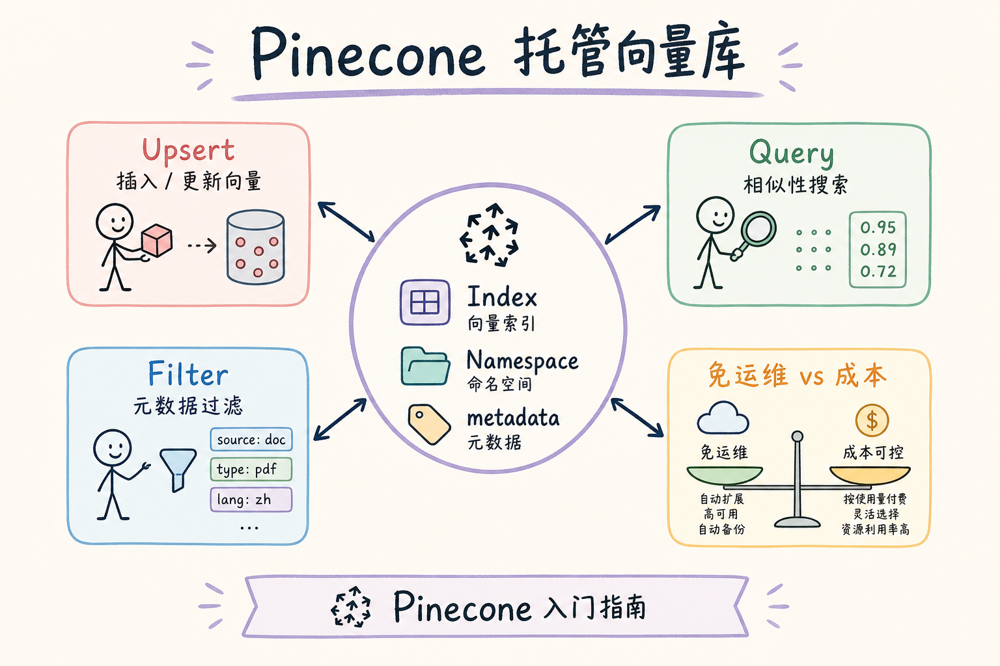
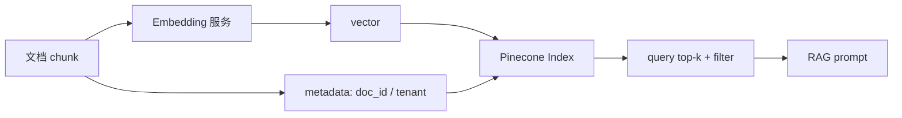
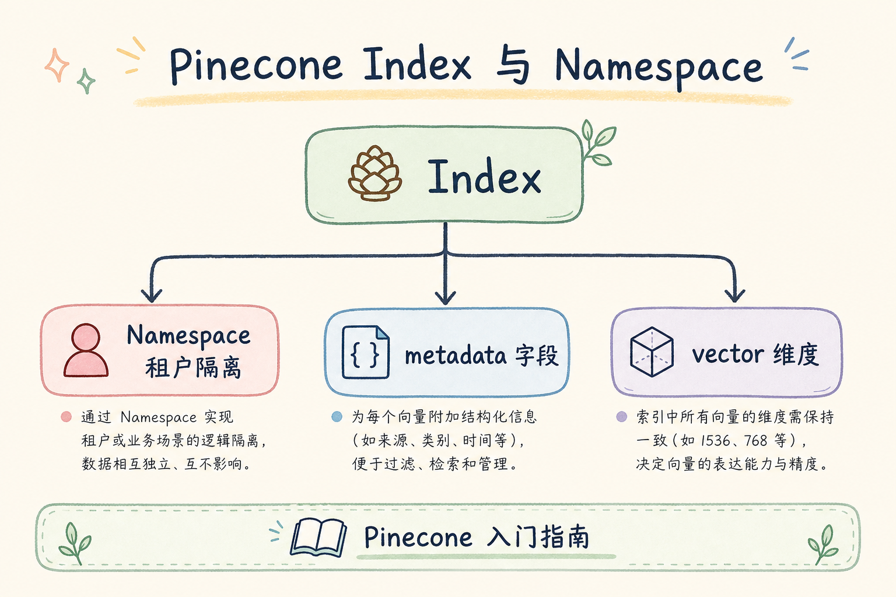
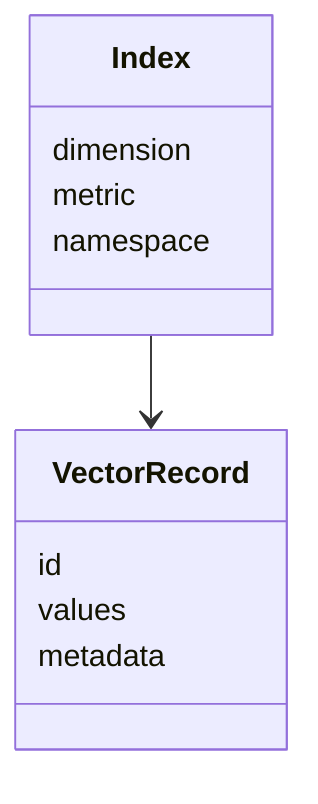
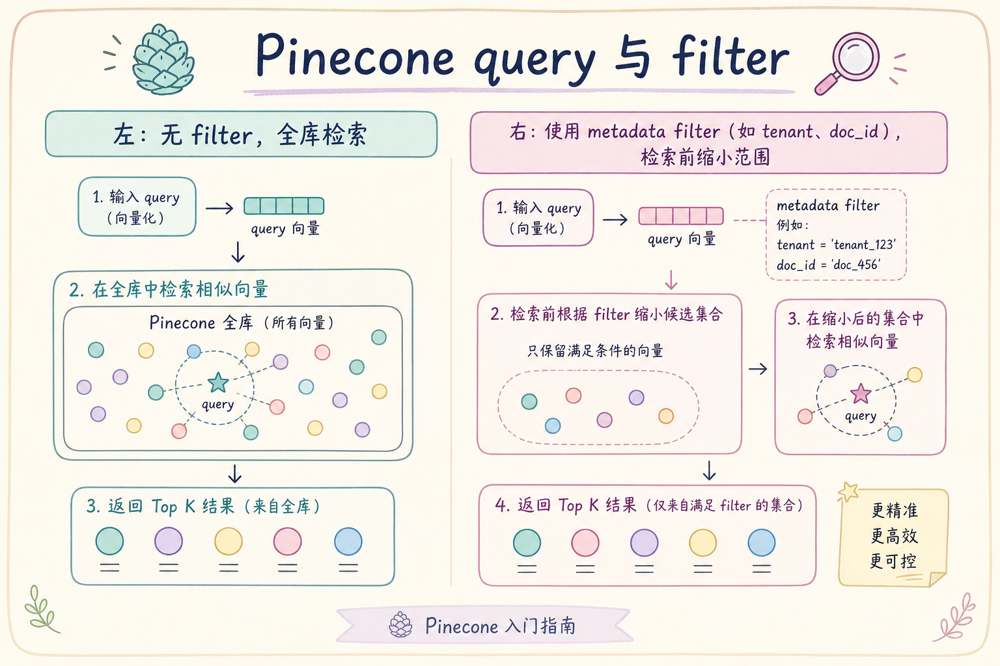
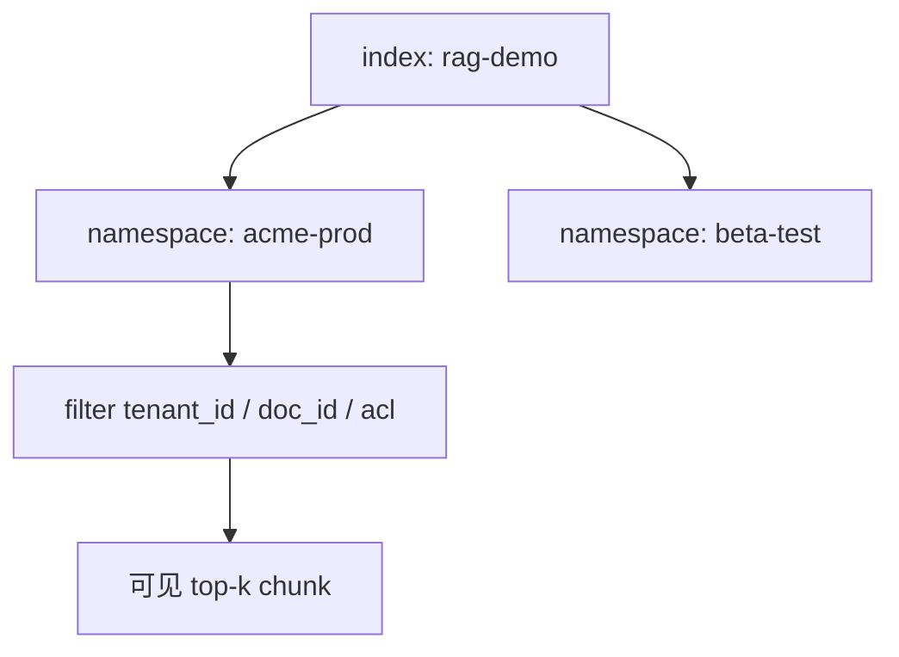

# C4 向量存储（了解）：Pinecone 托管向量库入门指南

**Pinecone** 是托管型向量数据库。它的核心价值是少管服务器、快速获得可用的向量检索服务；代价是费用、区域、厂商绑定和数据出境合规都要提前评估。  
通俗说：Pinecone 像“云端向量仓库”，你把向量和 metadata 发过去，它负责存储和相似度检索。

读完本文，你应能说清 Pinecone 是做什么的、解决什么问题、Index / Namespace / Vector 分别是什么、最小怎么写入查询，以及什么时候不该优先选择它。

---

## 目录

1. [前言：向量库的托管选项](#1-前言向量库的托管选项)
2. [本文边界与动手路径](#2-本文边界与动手路径)
3. [Pinecone 是什么](#3-pinecone-是什么)
4. [它解决什么问题](#4-它解决什么问题)
5. [核心概念：Index、Namespace、Vector](#5-核心概念indexnamespacevector)
6. [最小写入与查询示例](#6-最小写入与查询示例)
7. [metadata 过滤与 namespace](#7-metadata-过滤与-namespace)
8. [成本、合规与运维边界](#8-成本合规与运维边界)
9. [与 Chroma、Qdrant、Milvus 对比](#9-与-chromaqdrantmilvus-对比)
10. [调参与评测](#10-调参与评测)
11. [常见翻车与 FAQ](#11-常见翻车与-faq)
12. [总结与下一步](#12-总结与下一步)

---

## 1. 前言：向量库的托管选项

自建向量库要关心机器、磁盘、索引、备份、升级和监控。Pinecone 把这些运维细节托管出去，让团队更快验证产品。

但“托管”不等于“没有工程问题”。企业 RAG 仍要自己设计 embedding 生成、metadata 字段、权限过滤、引用回填、成本控制和合规审批。

### 1.1 和 RAG 链路的关系

Pinecone 只负责托管检索。若 `query` 不带 metadata filter、只靠 namespace 粗隔离，细粒度权限仍会漏。理解 Pinecone，是在 **namespace 环境隔离** 与 **metadata filter 权限** 之间分层设计，而不是把“上了云”当成“安全已解决”。

### 1.2 三个典型“适合先托管”的场景

| 场景 | 痛点 | Pinecone 价值 |
|------|------|---------------|
| 产品 MVP | 无运维人力 | 快速有 index |
| 出海 SaaS | 区域托管节点 | 少自建多区域 |
| Hackathon / PoC | 时间紧 | API 即检索 |

若数据不能出内网、预算敏感、已有 Postgres 强约束，应先评估 [81 pgvector](81.pgvector-tutorial.md) 或 [78 Qdrant](78.qdrant-tutorial.md) 自建，而不是默认 Pinecone。

## 2. 本文边界与动手路径

本文只讲入门概念和 RAG 常见用法，不讲供应商价格细节和企业采购流程。动手路径如下：

| 步骤 | 你做什么 | 验收 |
|------|----------|------|
| A | 创建 index | 指定维度和 metric |
| B | upsert vectors | 写入 id、vector、metadata |
| C | query top-k | 能返回相似 chunk |
| D | 加 filter / namespace | 能隔离租户或环境 |

最小交付物是：你能说明一个 vector record 里为什么必须同时有 `id`、`values` 和 `metadata`。

### 2.1 每步建议花多久

| 步骤 | 建议时间 | 要点 |
|------|----------|------|
| A | 30 分钟 | 控制台建 index，维度与 embedding 一致 |
| B | 45 分钟 | upsert 20 条带 metadata 的 chunk |
| C | 30 分钟 | query + `include_metadata=True` |
| D | 45 分钟 | namespace 与 filter 组合测越权 |

### 2.2 本文不展开

- Pinecone 各套餐单价、企业合同谈判
- Serverless vs Pod 架构选型细节（以当前文档为准）
- 多区域灾备与数据导出合规流程

## 3. Pinecone 是什么

Pinecone 负责托管向量索引，应用侧负责生成 embedding、组织 metadata、控制权限和拼接 prompt。





上图的结论是：Pinecone 不是 RAG 全家桶，它只是检索层的一部分。你的系统仍要负责解析、分块、向量化、权限、引用和生成。

### 3.1 托管边界：谁管什么

| 责任 | Pinecone | 你的应用 |
|------|----------|----------|
| 索引存储与 ANN | ✓ | |
| embedding 生成 | | ✓ |
| 权限 filter 逻辑 | | ✓ |
| 答案生成与引用格式 | | ✓ |
| 合规审批与数据分类 | | ✓ |

## 4. 它解决什么问题

Pinecone 主要解决“团队想快速使用托管向量检索”的问题。



| 问题 | 自建向量库时 | 使用 Pinecone 后 |
|------|--------------|------------------|
| 部署运维 | 要管理服务和索引 | 托管服务承担 |
| 扩缩容 | 需要自己规划 | 由托管能力支持 |
| 快速验证 | 环境搭建较多 | 更快接入 |
| 合规控制 | 数据留在自有环境更可控 | 需评估外部托管 |

它不解决“数据能不能出域”“metadata 怎么设计”“答案是否可信”这些问题。这些仍是你的系统设计责任。

### 4.1 案例：两周 MVP 的知识库问答

某创业团队要在两周内 demo 给客户：上传 PDF、能问制度问题。团队无 K8s 经验，合规允许试用数据上云。

- **自建 Qdrant**：要搭服务、备份、监控，时间不够
- **Pinecone**：当天建 index、upsert、query 跑通；metadata 带 `doc_id` 和短 `text` 供引用

验收：demo 通过不等于生产可上。上线前仍要补：正式合规评审、成本预算、从 Pinecone 迁出自建或 pgvector 的退出方案。

## 5. 核心概念：Index、Namespace、Vector

**Index**：一组维度和距离度量一致的向量集合。不同 embedding 模型通常应使用不同 index 或版本。  
**Namespace**：index 内的逻辑隔离空间，常用于环境、租户或实验版本隔离。  
**Vector**：一条记录，通常包含 `id`、`values`、`metadata`。



初学者要特别注意维度：index 的 dimension 必须和 embedding 模型输出维度一致。换模型时，通常要新建 index 或重建数据。

### 5.1 metadata 字段设计建议

| 字段 | 用途 | 易错点 |
|------|------|--------|
| `tenant_id` | 过滤 | 与 namespace 职责混淆 |
| `doc_id` | 单文档问答 | upsert 时漏写 |
| `text` | 回显 | 过长 metadata 增费用与延迟 |
| `model_id` | 换模型隔离 | 混模型不写 |

Pinecone metadata 有过滤支持的类型限制（字符串、数字、布尔等），设计前查当前文档，避免把复杂 JSON 当 filter 键。

## 6. 最小写入与查询示例

下面是伪代码式示例，实际 SDK 版本以当前 Pinecone 文档为准。重点看数据形状，而不是死记具体包名。

```python
from pinecone import Pinecone

pc = Pinecone(api_key="YOUR_API_KEY")
index = pc.Index("rag-demo")

index.upsert(
    namespace="acme-prod",
    vectors=[
        {
            "id": "travel-2025#001",
            "values": [0.1, 0.2, 0.3],
            "metadata": {
                "doc_id": "travel-2025",
                "tenant_id": "acme",
                "text": "住宿标准",
            },
        }
    ],
)

res = index.query(
    namespace="acme-prod",
    vector=[0.2, 0.1, 0.35],
    top_k=3,
    include_metadata=True,
    filter={"tenant_id": {"$eq": "acme"}},
)

print(res)
```

预期行为是：在 `acme-prod` namespace 内查找相似向量，并通过 metadata filter 限定租户。RAG 场景中，结果必须能回到原始 chunk 文本或 chunk_id。

### 6.1 先错对已：filter 写在哪

```python
# ❌ query(top_k=20) 后在 Python 里 if meta["tenant_id"] != "acme"
# ✅ query(..., filter={"tenant_id": {"$eq": "acme"}})
```

### 6.2 id 与 namespace 命名

`id` 建议稳定可回溯，如 `doc_id#chunk_index`。namespace 用环境（`prod` / `staging`）或粗租户可以，但**不要**用 namespace 替代细粒度 ACL（见 [89 Namespace](89.multi-tenant-namespace-tutorial.md)）。

## 7. metadata 过滤与 namespace

namespace 和 metadata filter 经常一起用，但它们不是同一层。





建议：环境隔离用 namespace，权限、doc_id、版本用 metadata filter。不要只靠 namespace 承担所有权限逻辑，否则权限粒度会很粗，也不利于审计。

### 7.1 先错对已：只靠 namespace 做权限

```python
# ❌ 每个租户一个 namespace，认为“进不了 namespace 就安全”
#    运维误 upsert 到错 namespace 即越权，且无 doc 级 filter
# ✅ namespace 管环境；tenant_id / acl 进 metadata filter，后端可信生成
```

### 7.2 双层隔离测试

同一用例在 metadata filter 正确、namespace 错误各测一遍，能抓住“只修了一处”的回归。这与 [88 metadata 过滤](88.metadata-filter-retrieval-tutorial.md) 的负例测试一致。

## 8. 成本、合规与运维边界

托管服务不是“免费省心”。上线前至少确认：

- 数据是否允许进入第三方托管服务。
- 区域是否满足合规要求。
- embedding 模型更换时如何重建 index。
- metadata 是否包含敏感字段。
- 成本是否按存储、读写、请求或容量计费。
- 服务异常时是否能降级或切换。

对企业 RAG 来说，Pinecone 的核心评估点经常不是“能不能搜”，而是“数据能不能放、成本能不能控、故障能不能兜”。

### 8.1 成本直觉

向量条数 × 维度 × 元数据大小，都会影响账单。把整段 chunk 正文塞进 metadata 既贵又慢；只存 `text` 摘要或 `chunk_id`，正文从对象存储或 DB 回填更常见（见 [193 向量存储成本](193.vector-storage-cost-tutorial.md)）。

### 8.2 合规与退出策略

上线前写清：数据保留期、删除请求流程、能否导出 vectors 迁到 Qdrant/pgvector。避免 vendor lock-in 到无法切换。

## 9. 与 Chroma、Qdrant、Milvus 对比

| 工具 | 主要特点 | 更适合 |
|------|----------|--------|
| Chroma | 本地轻量 | 学习和 PoC |
| Qdrant | payload 过滤顺手 | 服务化 RAG |
| Milvus | 分布式与规模 | 大规模自建 |
| Pinecone | 托管、省运维 | 快速上线、愿意使用云服务 |

如果数据不能出内网、预算敏感、团队已有 Postgres/ES 强约束，应先评估自建或已有搜索栈，而不是默认选择托管向量库。

### 9.1 何时从 Pinecone 迁出

信号：月度账单超预期、合规要求数据回内网、需要与 Postgres ACL 同事务。迁移前用同一评测集在目标库跑 recall@k，并计划 **双写或冻结读** 窗口。

### 9.2 与 rerank、Sparse 的衔接

Pinecone 返回的 top-k 常接 cross-encoder rerank（见 [95 cross-encoder](95.cross-encoder-rerank-tutorial.md)）。编号类 query 若只靠向量，可能漏掉精确匹配；应评估 [92 Sparse](92.sparse-retrieval-rag-tutorial.md) 或混合检索并联，而不是指望 Pinecone 单独解决所有召回形态。

## 10. 调参与评测

从业务日志抽 50～100 条 query，在固定 namespace + filter 下测：

| 指标 | 说明 |
|------|------|
| recall@k | 与无 ANN 基线（小样本）重叠 |
| p95 latency | 含 Pinecone API 往返 |
| 越权率 | 负例 query 是否 0 命中 |
| 月成本 | 条数、维度、QPS 粗算 |

把 `namespace`、`filter` 摘要、`top_k`、延迟写入结构化日志（[190](190.structured-logging-rag-tutorial.md)）。

### 10.1 评测：正负例模板

| 用例 | 设置 | 期望 |
|------|------|------|
| 正例 | 正确 namespace + filter | 命中目标 chunk |
| 负例 | 他租户 filter | 0 条 |
| 错 namespace | 合法 token 错环境 | 0 条或明确错误 |
| 回归 | 改 filter 后 | CI 跑负例全集 |

### 10.2 线上观测与告警

监控 Pinecone API 错误率、P95 延迟、月度向量条数。账单突增往往先于性能告警——设置条数与 QPS 阈值，对接 [191 Prometheus](191.prometheus-metrics-rag-tutorial.md)。检索日志里记录 `index_name`、`namespace`、`filter_hash`，便于从一次越权投诉反查当时条件。

### 10.3 故障降级思路

Pinecone 不可用时，是否有只读副本、缓存最近 query 结果、或降级到关键词检索？托管不等于无 SLA 设计。MVP 可接受短暂不可用，生产应在架构图里画清 **降级路径**，避免单点硬依赖。

## 11. 常见翻车与 FAQ

**Pinecone 会替我生成 embedding 吗？**  
主要职责是存储和检索向量。embedding 生成通常仍由你的模型服务完成。

**namespace 能替代权限系统吗？**  
不能。namespace 是隔离手段之一，权限仍要在后端、metadata filter 和审计中闭环。

**为什么查询结果没有原文？**  
可能 upsert 时没有存 `text` 或没有 `include_metadata=True`。RAG 需要能拿回证据文本或 chunk_id。

**什么时候不优先 Pinecone？**  
数据不能出内网、预算敏感、团队已有 Postgres/ES 强约束时，应先评估自建或已有搜索栈。

### 11.1 排错速查

| 现象 | 可能原因 |
|------|----------|
| query 空结果 | namespace 错、filter 过严、index 空 |
| 维度错误 | embedding 与 index dimension 不一致 |
| 分数异常 | metric 与模型不匹配（cosine vs dotproduct） |
| 账单突增 | metadata 过大、未删旧 namespace、QPS 飙升 |

### 11.2 换 embedding 模型

新建 index（或清空重建），全量重算 `values`，更新 metadata 里 `model_id`。不能在同一 index 里混两种维度的向量。

### 11.3 API Key 与多环境

开发、预发、生产应使用不同 API Key 与 namespace，避免测试 upsert 污染生产 index。Key 泄露等于向量库裸奔，轮换流程要写在运维手册里。

### 11.4 与 pgvector、Qdrant 的对照记忆

| 概念 | Pinecone | Qdrant / pgvector |
|------|----------|-------------------|
| 集合 | Index | Collection / Table |
| 逻辑隔离 | Namespace | payload / schema / DB |
| 业务字段 | metadata | payload / columns |
| 运维 | 托管 | 自建或同库 |

## 12. 总结与下一步

Pinecone 的价值是托管向量检索，让团队少管底层服务。但企业 RAG 仍要自己设计 embedding、metadata、权限、引用和成本控制。初学者重点理解 Index、Namespace、Vector 三个概念，以及托管服务的合规边界。

### 12.1 本篇检查清单

- [ ] index dimension、metric 与 embedding 模型一致
- [ ] upsert 的 id、values、metadata 三者齐全，能回显证据
- [ ] 理解 namespace 与 metadata filter 分层，filter 来自后端可信身份
- [ ] 评估过合规、成本与迁出方案
- [ ] 正负例测试覆盖错 namespace 与错 filter

下一步可以读 [81 pgvector](81.pgvector-tutorial.md)，了解把向量放进 Postgres 的另一种路线。
