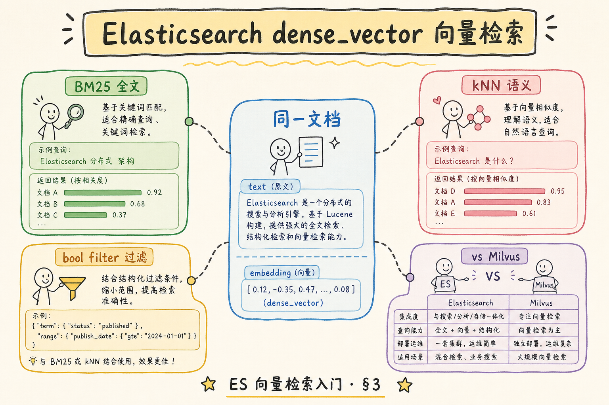
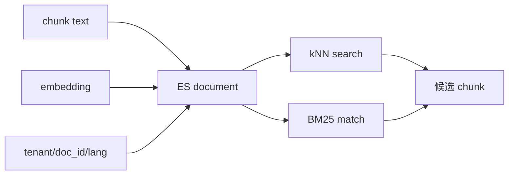
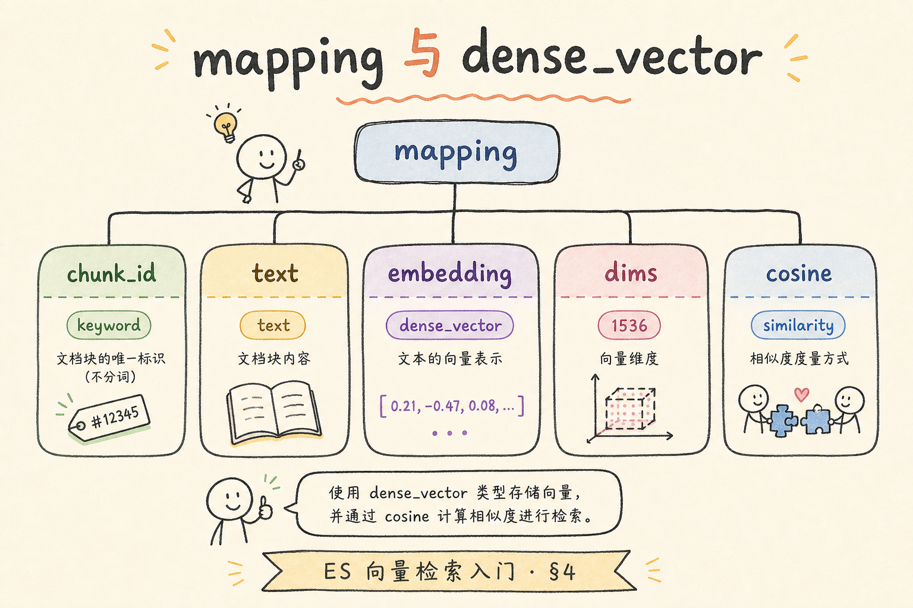
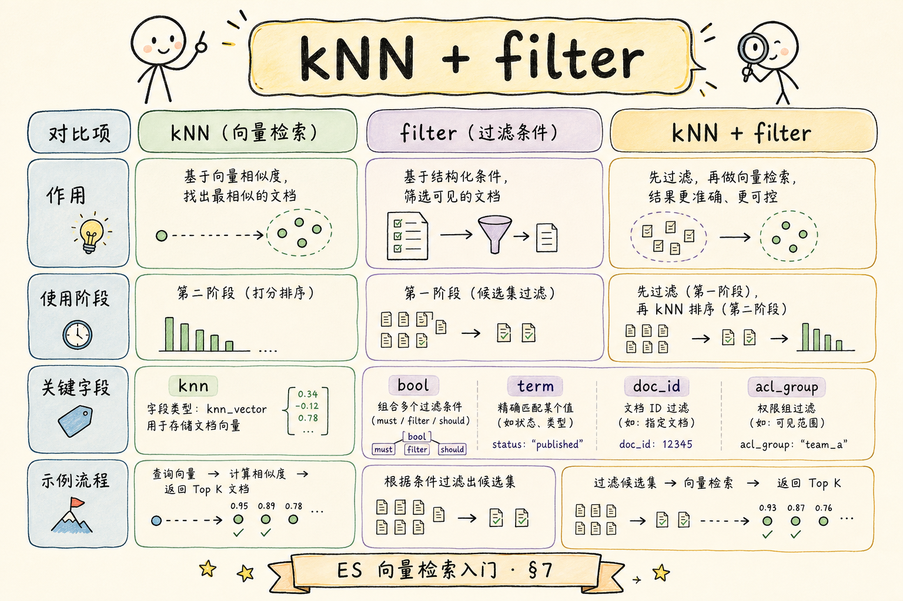
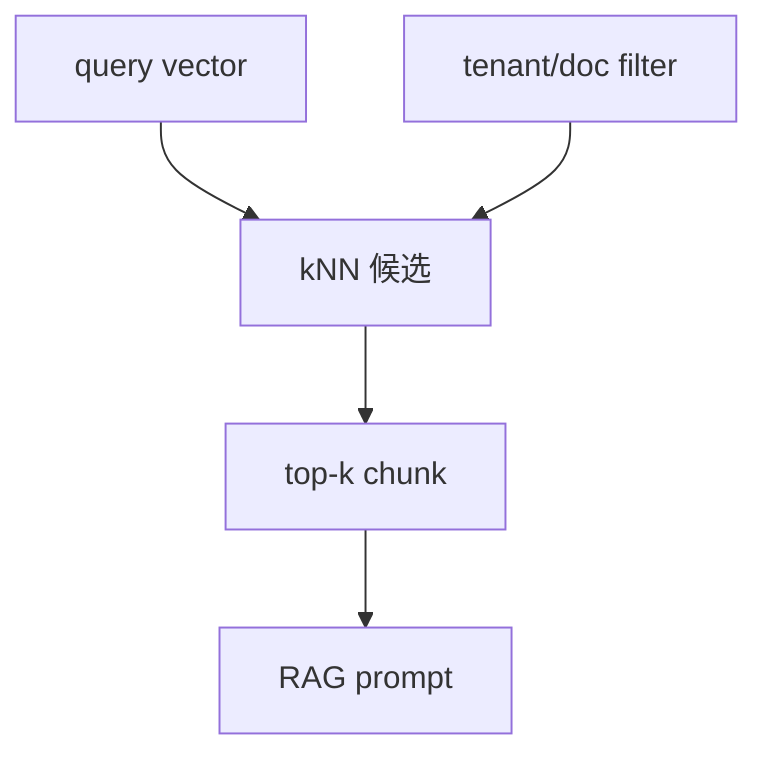

# C4 向量存储（地基）：Elasticsearch 向量检索入门指南

Elasticsearch 不只做关键词搜索，也能通过 `dense_vector` 字段做向量检索。它适合已经使用 ES 做搜索、希望在同一搜索栈里加入语义召回的团队。  
通俗说：ES 原来擅长“按词找文档”，加上向量字段后，也能“按意思找相似片段”。

读完本文，你应能理解 dense_vector、mapping、bulk 入库、kNN 查询和 filter 的基本关系，并知道 ES 向量检索适合解决什么问题。

---

## 目录

1. [前言：搜索栈里的向量字段](#1-前言搜索栈里的向量字段)
2. [本文边界与动手路径](#2-本文边界与动手路径)
3. [ES 向量检索是什么](#3-es-向量检索是什么)
4. [它解决什么问题](#4-它解决什么问题)
5. [dense_vector 与 mapping](#5-dense_vector-与-mapping)
6. [最小入库与查询示例](#6-最小入库与查询示例)
7. [kNN 查询与 filter](#7-knn-查询与-filter)
8. [向量与 BM25 的分工](#8-向量与-bm25-的分工)
9. [适用边界与生产注意](#9-适用边界与生产注意)
10. [调参与评测](#10-调参与评测)
11. [常见翻车与 FAQ](#11-常见翻车与-faq)
12. [总结与下一步](#12-总结与下一步)

---

## 1. 前言：搜索栈里的向量字段

很多企业已经用 Elasticsearch 做日志、文档和站内搜索。如果 RAG 文档也在 ES 里，加一个向量字段就能做语义检索，避免再引入新系统。

但 ES 的核心仍是搜索引擎。向量检索只是其中一类能力，复杂 RAG 仍要认真设计 mapping、filter、权限和召回融合。不要因为 ES 支持 `dense_vector`，就默认它会自动变成完整 RAG 系统。

生产环境里，预算问题往往表现为 **检索明明命中了，答案却说不知道**：不是召回失败，而是证据在组装 prompt 时被历史消息挤掉。ES 向量检索阶段就要保证 `chunk_text` 与 filter 同 document 返回，否则后面 rerank 再强也缺原材料。

### 1.1 三个典型“已有 ES”场景

| 场景 | 用户问法 | 只靠 BM25 的风险 | 加向量后 |
|------|----------|------------------|----------|
| 口语改写 | “出差住酒店能报多少” | 文档写“住宿标准”可能漏 | 语义相近可召回 |
| 标准编号 | `GB/T 12345` | BM25 强 | 向量不应替代 BM25 |
| 错误码 | `S3 AccessDenied` | 字面命中稳 | 向量补“上传失败”类改写 |

企业文档里三类问题都常见，所以 ES 向量检索的价值往往是 **与 BM25 共存**，而不是替换关键词路（见 [92 Sparse](92.sparse-retrieval-rag-tutorial.md)）。

### 1.2 和 RAG 链路的关系

ES 只负责召回候选 chunk。若 kNN 的 `num_candidates` 过小，正确证据进不了候选池，后面 rerank 和 LLM 无从谈起。理解 ES 向量检索，是在 **mapping 正确**、**filter 在查询内**、**kNN 参数可评测** 三件事上打基础。

## 2. 本文边界与动手路径

本文讲入门概念，不覆盖所有 ES 版本差异，也不展开集群运维。动手路径如下：

建议先在单节点开发集群跑通，确认 `dense_vector` 的 `index: true` 与 `dims` 无误，再考虑分片与副本——过早调集群参数会掩盖 mapping 层面的基础错误。验收物是 index mapping 与 kNN DSL，而不是“能 curl 通一次”。

| 步骤 | 你做什么 | 验收 |
|------|----------|------|
| A | 建 mapping | 有 `dense_vector` 字段 |
| B | bulk 写入 chunk | text 与 vector 同存 |
| C | kNN 查询 | 返回相似 chunk |
| D | 加 filter | tenant/doc_id 条件生效 |

最小交付物是：你能写出一个包含 `chunk_text`、`doc_id`、`tenant_id`、`embedding` 的 index，并完成一次带过滤条件的向量查询。

### 2.1 每步建议花多久

| 步骤 | 建议时间 | 要点 |
|------|----------|------|
| A | 45 分钟 | 建 index mapping，`dims` 与模型一致 |
| B | 1 小时 | `_bulk` 写入 20+ chunk |
| C | 45 分钟 | kNN 查询，调 `k` 与 `num_candidates` |
| D | 30 分钟 | 加 `tenant_id` filter，验证不跨租户 |

### 2.2 本文不展开

- 集群分片、副本、滚动升级等运维
- 各 ES 大版本 kNN API 差异（以你用的版本文档为准）
- RRF 公式与 hybrid pipeline 细节（见 [83 OpenSearch 混合](83.opensearch-hybrid-tutorial.md)）

## 3. ES 向量检索是什么

ES 向量检索把 chunk 文本、业务字段和 dense_vector 放在同一文档里。读下图时，重点看：同一个 ES document 既能走 kNN，也能走 BM25。

ES document 把文本、向量和 keyword 打成一体，这决定了企业 RAG 常走“同索引双路召回”路线。初学者要牢记：kNN 找的是向量近邻，返回给 LLM 的却是 `chunk_text`——漏存原文等于检索管道最后一公里断掉。





上图的结论是：ES 的优势在于向量和关键词检索可以在同一搜索体系内协作。对企业 RAG 来说，这通常比单纯只做向量更稳。

### 3.1 同一 document 里要存什么

| 字段类型 | 示例 | 检索用途 |
|----------|------|----------|
| text | `chunk_text` | BM25、返回证据 |
| dense_vector | `embedding` | kNN |
| keyword | `tenant_id`, `doc_id` | filter，不参与分词 |

`chunk_text` 只存向量、不存原文，RAG 无法把证据塞进 prompt——这是初学者最常漏的字段。

## 4. 它解决什么问题

ES 向量检索适合解决“已有搜索系统想补语义召回”的问题。

搜索引擎做向量的典型动机是补语义，而不是抛弃关键词。运维手册、制度 PDF 转 chunk 后，错误码和标准号仍依赖 BM25 的字面锚定；向量负责“用户没说出文档原词”的那部分改写空间。两种能力叠在同一索引，filter 才能一次生效。



| 问题 | 只用 BM25 时 | 加向量后 |
|------|--------------|----------|
| 用户改写问题 | 可能搜不到 | 语义相近也能召回 |
| 文档和问题用词不同 | 依赖同词命中 | 可按 embedding 相似度找 |
| 搜索栈分裂 | 关键词在 ES，向量在别处 | 可先统一在 ES 内 |
| 精确词检索 | BM25 仍强 | 不应丢掉 BM25 |

它不是“自动问答”。ES 负责召回候选证据，答案仍需要 LLM、prompt、引用和安全策略。

### 4.1 场景案例：运维手册 RAG

知识库已在 ES 做站内搜索。用户问 `S3 AccessDenied 上传失败`：

- **只 kNN**：可能召回讲“权限”的泛化段落，错误码未字面出现
- **只 BM25**：错误码命中稳，但“上传失败”口语改写可能弱
- **双路 + filter**：BM25 保底错误码，kNN 补语义，RRF 合并（见 [83](83.opensearch-hybrid-tutorial.md)）

验收：评测集里 5 条含错误码的 query，recall@5 应稳定；同时 5 条纯口语 query 不应比单 BM25 更差。

## 5. dense_vector 与 mapping

`dense_vector` 是 ES 用来保存稠密向量的字段类型。`dims` 必须和 embedding 模型输出维度一致，否则写入会失败。

mapping 是 ES 向量检索的地基，且大多不可热改 `dims`。上线前把 embedding 模型版本、similarity 与是否归一化写进 runbook；换模型时走新 index + alias 切换，比原地强行 reindex 更可控。

```json
PUT rag_chunks
{
  "mappings": {
    "properties": {
      "chunk_text": { "type": "text" },
      "doc_id": { "type": "keyword" },
      "tenant_id": { "type": "keyword" },
      "embedding": {
        "type": "dense_vector",
        "dims": 3,
        "index": true,
        "similarity": "cosine"
      }
    }
  }
}
```

真实项目里，`dims: 3` 要换成模型维度，例如 768、1024、1536 或 3072。mapping 一旦建好，维度通常不能随便改；换模型时要规划新 index 或重建流程。

### 5.1 mapping 易错点

| 项 | 正确做法 | 常见错误 |
|----|----------|----------|
| `dims` | 与 embedding 输出一致 | 演示用 3，上线忘改 |
| `similarity` | 与模型训练 metric 一致 | cosine 模型却用 dot_product |
| `index: true` | 需要 kNN 时必须开 | 忘了开导致只能 script_score 慢查 |
| keyword 字段 | `tenant_id` 用 keyword | 用 text 导致 filter 不稳定 |

换模型标准流程：新 index → 重算向量 bulk → 别名切换 → 删旧 index。

## 6. 最小入库与查询示例

下面示例用 `_bulk` 写入两条 chunk。每条文档同时保存原文、业务字段和向量，方便检索后返回证据。

bulk 写入要当作小批量可重试任务设计：RAG 全量重建 embedding 常在夜间跑数小时，单批过大一旦失败难以定位脏文档。`_id` 用 `chunk_id` 还能让更新与向量重算、对账脚本共享同一主键语义。

```json
POST _bulk
{ "index": { "_index": "rag_chunks", "_id": "travel-2025#001" } }
{ "chunk_text": "一线城市住宿标准为每晚 600 元。", "doc_id": "travel-2025", "tenant_id": "acme", "embedding": [0.1, 0.2, 0.3] }
{ "index": { "_index": "rag_chunks", "_id": "hr-2025#001" } }
{ "chunk_text": "员工每年享有带薪年假。", "doc_id": "hr-2025", "tenant_id": "acme", "embedding": [0.2, 0.1, 0.4] }
```

入库时不要只存向量。RAG 最终需要把证据文本、来源、权限字段和引用信息带回应用层。

### 6.1 bulk 入库注意

- 单批不宜过大，失败时要能重试单条
- `_id` 建议用 `chunk_id`，便于更新与对账
- 写入后 `_refresh` 或等 refresh interval，否则立刻 kNN 可能搜不到

## 7. kNN 查询与 filter

下面示例展示带租户过滤的 kNN 查询。`k` 是返回数量，`num_candidates` 是候选池大小，二者会影响召回和延迟。

filter 进入 kNN 查询体内，语义是：近似搜索只在租户子空间内进行。若先全库 kNN 再应用层过滤，不仅 `num_candidates` 预算被浪费，还可能在日志里留下跨租户候选的痕迹——这在多租户合规场景是不可接受的。

```json
POST rag_chunks/_search
{
  "knn": {
    "field": "embedding",
    "query_vector": [0.2, 0.1, 0.35],
    "k": 3,
    "num_candidates": 20,
    "filter": {
      "term": { "tenant_id": "acme" }
    }
  },
  "_source": ["chunk_text", "doc_id", "tenant_id"]
}
```





上图的关键结论是：filter 应进入查询阶段，而不是拿到结果后再删。否则中间结果可能已经包含越权候选。

### 7.1 先错对已：filter 位置

```json
// ❌ kNN 无 filter，应用层丢弃 tenant_id != "acme" 的 hit
// 问题：越权 chunk 已进入候选与日志

// ✅ knn.filter 与 term tenant_id 写在同一次 _search
```

### 7.2 `k` 与 `num_candidates`

| 参数 | 作用 | 调参直觉 |
|------|------|----------|
| `k` | 最终返回条数 | RAG 常 5～20，后面还有 rerank |
| `num_candidates` | ANN 候选池 | 太小漏召回，太大延迟升 |

建议：固定 query 集，扫 `num_candidates`（如 50→200），对小样本用 [84 Flat](84.flat-brute-force-search-tutorial.md) 思路算 recall@k 重叠（若可导出全量向量）。

## 8. 向量与 BM25 的分工

向量检索擅长语义相似，BM25 擅长精确词、编号、英文缩写和标准号。

企业文档的问题分布决定了没有单一检索路由能通吃。把 BM25 当“精确锚”、向量当“语义网”，再在融合层汇合，比赌某一路上线默认参数更贴近真实 bad case。评测集务必同时含口语改写与编号类 query，否则容易误判“只上向量就够了”。

| 问题类型 | 更依赖 |
|----------|--------|
| “住宿标准怎么报销” | 向量 |
| “GB/T 12345” | BM25 |
| “S3 AccessDenied” | BM25 + 向量 |
| “和年假类似的福利” | 向量 |

不要因为接入 `dense_vector` 就丢掉全文检索。很多企业 RAG 的稳定方案，反而是 ES 里同时跑 BM25 和向量，再用 RRF 或 rerank 融合。

### 8.1 怎么判断该走哪一路

| 信号 | 更依赖 kNN | 更依赖 BM25 |
|------|------------|-------------|
| 问题含 SKU、条款号、错误码 | | ✓ |
| 问题是大白话、无专有名词 | ✓ | |
| 评测 Dense 漏编号 | | ✓ |
| 评测 Sparse 漏同义改写 | ✓ | |

### 8.2 混合检索预告

同一 index 内可先分别跑 BM25 与 kNN，再在应用层 RRF——与 [83 OpenSearch 混合](83.opensearch-hybrid-tutorial.md) 思路一致。ES 8.x 部分版本支持 hybrid 查询，以官方文档为准；入门阶段“两请求 + RRF”已足够稳。

## 9. 适用边界与生产注意

ES 适合已经有搜索栈的团队。如果你只需要向量库，Qdrant、Milvus、pgvector 可能更直接。

生产前确认这些事项：

生产注意列表不是合规 checklist 摆件：每一条都应对一次真实事故或 near-miss。特别是 kNN 与 BM25 是否在同一评测集上回归——版本升级后默认 ANN 实现变更并不罕见，不能假设“配置没变结果就不变”。

- mapping 版本和重建流程是否清楚。
- embedding 维度、模型版本是否记录。
- 权限 filter 是否在查询阶段生效。
- kNN 召回、BM25 召回和混合召回是否有评测。
- 查询延迟和 `num_candidates` 是否可接受。

ES 的强项是搜索生态，不是替你自动完成 RAG 质量评估。

### 9.1 排错：kNN 无结果或很慢

1. mapping 里 `embedding.index` 是否为 true
2. `dims` 与写入向量长度是否一致
3. filter 是否过严（租户写错等于空库）
4. `num_candidates` 与分片负载——看节点 CPU 与 search 线程池

### 9.2 版本与许可证注意

Elastic 与 OpenSearch 在 kNN 实现、默认 ANN 算法上可能分叉。选型时把“我们跑的是哪条发行版、哪个大版本”写进 runbook，升级前用同一评测集做回归，避免文档示例与线上 DSL 不一致。

## 10. 调参与评测

迷你评测集（20～50 条）建议分三类：口语语义、精确编号/错误码、无答案负例。指标：

调参时把 query 按类型分层统计 recall，比只看整体均值更能暴露 BM25 或 kNN 谁拖后腿。结构化日志里记 `num_candidates` 与 tenant，改版后对比同 query 的候选重叠，往往比盲目加 `k` 更有效。

| 指标 | 说明 |
|------|------|
| recall@k | 标注 chunk 是否在 top-k |
| p95 latency | 含 kNN + filter |
| 越权命中 | 错误 tenant 的 query 应为 0 |

调参顺序：mapping 与 bulk 正确 → 单独测 kNN recall → 加 BM25 与融合 → 再调 rerank。日志记录 `num_candidates`、`k`、tenant（[190](190.structured-logging-rag-tutorial.md)）。

### 10.1 迷你评测表模板

| query 类型 | 条数 | 标注字段 | 通过标准 |
|------------|------|----------|----------|
| 口语语义 | 10 | gold chunk_id | recall@5≥0.8 |
| 错误码/编号 | 10 | gold chunk_id | recall@5≥0.9 |
| 负例 | 5 | 期望无命中 | top-5 不含干扰 doc |

每周从生产日志补 5 条新 query，防止评测集老化。

## 11. 常见翻车与 FAQ

ES 向量检索的 FAQ 高度集中于 mapping 维度和分数尺度——前者导致写入失败或 silent 错位，后者导致混合检索时被某一路 dominate。遇到 kNN 无结果，先查 `index: true` 与 refresh，再查 filter 是否把库筛空。

### 11.1 dims 不一致怎么办？

修正 mapping 或换 index；已建 mapping 不能随意改维度。换 embedding 模型时要规划重建。

### 11.2 为什么编号问题搜不到？

只走向量会弱化精确符号，应该结合 BM25（[92](92.sparse-retrieval-rag-tutorial.md)）。

### 11.3 ES 能直接生成答案吗？

不能。ES 只召回候选文档，答案仍由 LLM 生成。

### 11.4 能和 OpenSearch 通用吗？

概念相近，但 DSL、插件、版本能力和 pipeline 细节不同，应按具体版本验证。

### 11.5 为什么 kNN 分数不能和 BM25 直接相加？

尺度不同，应用 RRF 或 cross-encoder rerank（[83](83.opensearch-hybrid-tutorial.md)）。

### 11.6 升级 ES 版本后 kNN 行为变了？

大版本可能改默认 ANN 实现。升级后用小评测集回归 recall 与延迟，不能假设“配置没变结果就不变”。

## 12. 总结与下一步

Elasticsearch 向量检索适合在已有搜索栈中补语义召回。初学者要抓住 `dense_vector`、mapping、bulk、kNN filter、BM25 分工和版本重建。

Elasticsearch 向量能力让你留在熟悉搜索栈里补语义，而不是重造一个向量孤岛。走完 mapping、bulk、kNN filter 与 BM25 分工，再进入混合检索专题，会天然衔接 [83](83.opensearch-hybrid-tutorial.md) 的双路召回叙事。

### 12.1 本篇检查清单

- [ ] mapping 中 `dims`、`similarity`、`index: true` 正确
- [ ] bulk 同时写入 `chunk_text` 与 `embedding`
- [ ] kNN 查询带 `tenant_id` filter
- [ ] 能说明 `k` 与 `num_candidates` 对召回/延迟的影响
- [ ] 知道编号类 query 需 BM25 补位

下一步可以读 [83 OpenSearch 混合检索](83.opensearch-hybrid-tutorial.md)，把向量和关键词召回组合成更稳的 RAG 检索。
