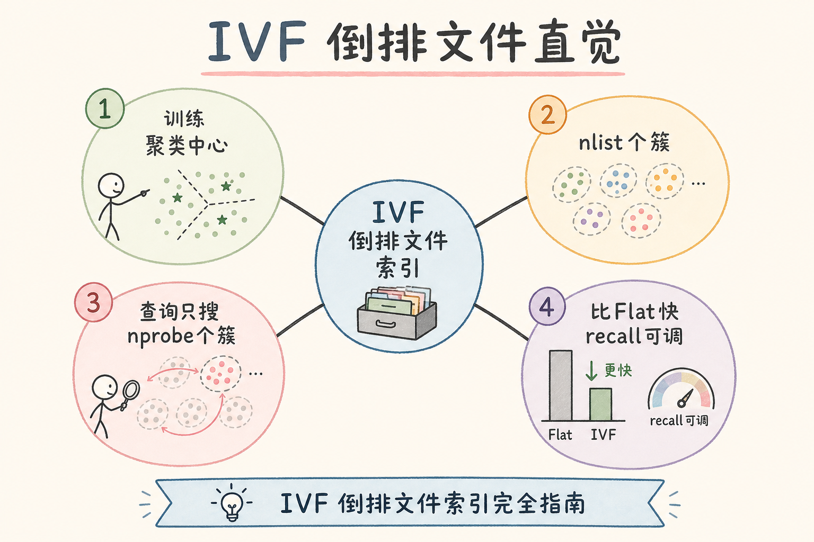
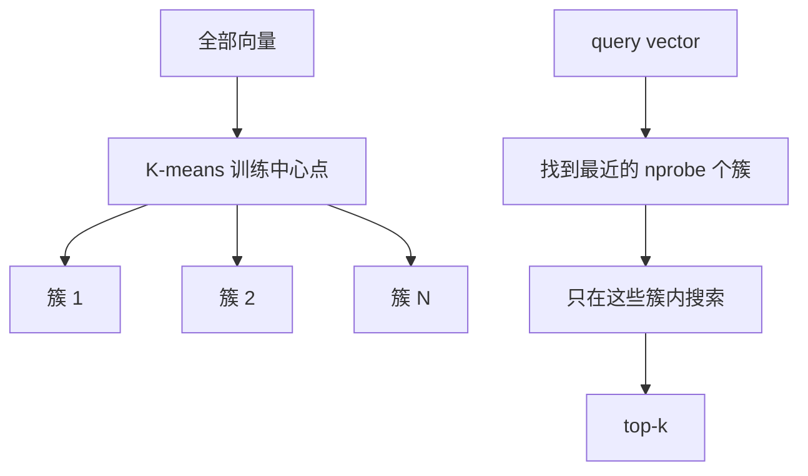
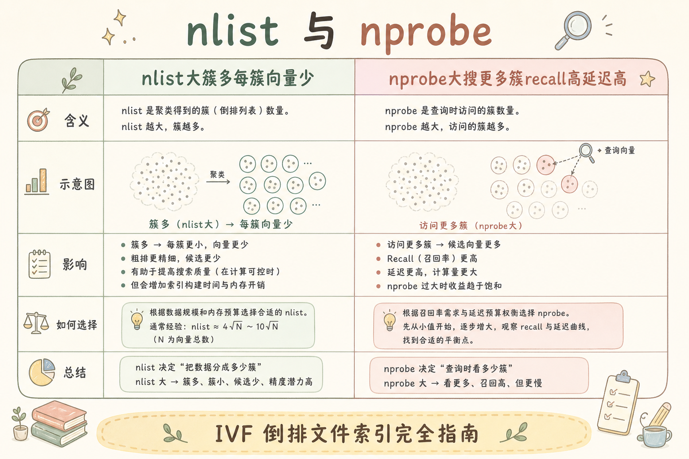
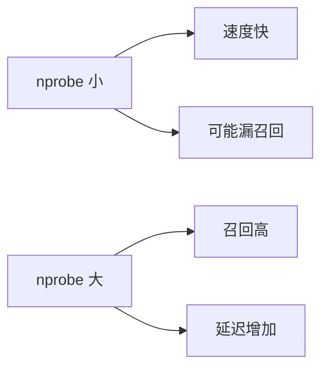
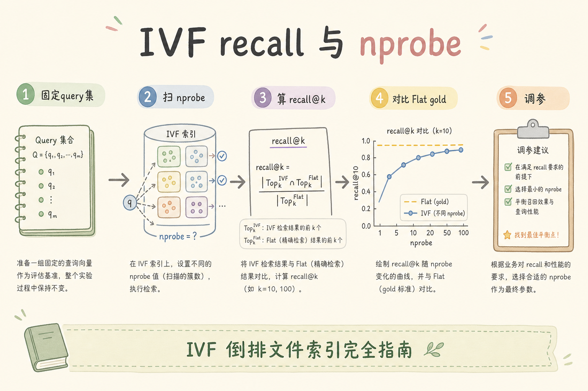
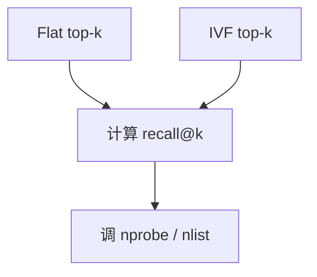

# C4 向量存储（十一）：IVF 倒排文件索引完全指南

**IVF**（Inverted File Index，倒排文件索引）是一类 ANN 索引。它先把向量分成多个簇，查询时只搜索最相关的几个簇，从而减少距离计算。  
通俗说：先把图书按书架分类，找书时不用翻完整个图书馆。

读完本文，你应能解释 IVF 解决什么问题、训练阶段做什么、`nlist` 和 `nprobe` 如何影响速度与召回，并能用它和 Flat 做对比。

---

## 目录

1. [前言：分簇再搜，少算距离](#1-前言分簇再搜少算距离)
2. [本文边界与动手路径](#2-本文边界与动手路径)
3. [IVF 是什么](#3-ivf-是什么)
4. [它解决什么问题](#4-它解决什么问题)
5. [训练阶段：K-means 与 nlist](#5-训练阶段k-means-与-nlist)
6. [查询阶段：nprobe 决定搜多少簇](#6-查询阶段nprobe-决定搜多少簇)
7. [最小 FAISS 示例](#7-最小-faiss-示例)
8. [IVF 与 Flat 的评测对比](#8-ivf-与-flat-的评测对比)
9. [参数调优与适用边界](#9-参数调优与适用边界)
10. [调参与评测](#10-调参与评测)
11. [常见翻车与 FAQ](#11-常见翻车与-faq)
12. [总结与下一步](#12-总结与下一步)

---

## 1. 前言：分簇再搜，少算距离

Flat 每次查询都要和所有向量计算距离。数据量变大后，这会很慢。IVF 的思路是先把向量分簇，查询时只去最可能相关的簇里找。

这会带来取舍：搜的簇越少越快，但可能漏掉真正最近邻；搜的簇越多越准，但速度接近 Flat。IVF 不是“免费变快”，而是用可评测的召回损失换查询速度。

IVF 的工程心智模型是“先粗分桶、再桶内精搜”：训练阶段决定桶边界是否贴合数据分布，查询阶段 `nprobe` 决定你愿意打开几个桶。任一阶段偷懒，表现都不是“略慢一点”，而是某些 query 系统性漏掉正确 chunk。

### 1.1 和 RAG 链路的关系

IVF 降低检索 P95，但若 `nprobe` 过小漏掉正确 chunk，rerank 与 LLM 无法补救。调 IVF 必须对照 [84 Flat](84.flat-brute-force-search-tutorial.md) 的 recall@k，不能只看延迟仪表盘变绿。

建议在检索服务配置里把 `nprobe`/`lists` 与版本号写入配置中心；变更时自动跑冒烟评测集，未过 recall 阈值则阻断发布。

### 1.2 何时考虑 IVF 而非 HNSW

| 信号 | 倾向 IVF | 倾向 HNSW |
|------|----------|-----------|
| 内存预算紧、可离线训练 | ✓ | |
| 数据分布稳定、批量建库 | ✓ | |
| 高召回、少重建、增量写入多 | | ✓ |
| 托管库默认 HNSW | | 先用默认评测 |

详见 [86 HNSW](86.hnsw-index-tutorial.md) 对比。

## 2. 本文边界与动手路径

本文讲 IVF 入门，不讲 IVF_PQ、HNSW、GPU 调优。动手路径如下：

动手顺序强制 Flat 先行：没有 gold top-k，扫 `nprobe` 只会得到一条“延迟很好看”的曲线。建议把 `nlist`、`nprobe` 与 recall@10 写入同一张参数表，发版时与索引版本绑定。

| 步骤 | 你做什么 | 验收 |
|------|----------|------|
| A | 用 Flat 得到基线 | 有精确 top-k |
| B | 训练 IVF | index 可 search |
| C | 调 `nprobe` | 看速度/召回变化 |
| D | 记录 recall@k | 能解释取舍 |

最小交付物是：你能跑出一组 Flat vs IVF 的结果，并解释为什么 IVF 可能漏召回。

### 2.1 每步建议花多久

| 步骤 | 建议时间 | 要点 |
|------|----------|------|
| A | 45 分钟 | Flat 基线 top-k |
| B | 1 小时 | `train` + `add`，理解必须先 train |
| C | 1～2 小时 | 扫 `nprobe`，记 recall 与耗时 |
| D | 30 分钟 | 写一页结论：可上线的 nprobe 拐点 |

### 2.2 本文不展开

- IVF_PQ 量化组合
- GPU 训练与 billion-scale 调优
- 与 BM25“倒排”同名不同义的深入对比（见 [92 Sparse](92.sparse-retrieval-rag-tutorial.md)）

## 3. IVF 是什么

读下图时，注意 IVF 有两个阶段：先训练簇中心，再查询少量簇。

IVF 的速度来自“少看候选”，召回损失也来自“可能少看了正确候选”。这和 HNSW 的图导航是不同机制：IVF 的风险集中在簇划分是否代表全库分布，以及 query 是否落在正确簇的 `nprobe` 覆盖范围内。





上图的结论是：IVF 的速度来自“少看候选”，召回损失也来自“可能少看了正确候选”。

### 3.1 两阶段别搞混

| 阶段 | 做什么 | 关键参数 |
|------|--------|----------|
| 训练 | K-means 学簇中心 | `nlist`、训练样本量 |
| 查询 | 找最近若干簇，簇内暴力 | `nprobe` |

未 `train` 就 `add` 会失败或效果极差——这是 IVF 最常见的入门坑。

## 4. 它解决什么问题

IVF 解决的是“Flat 太慢，但又想保留可控召回”的问题。

对 RAG 而言，IVF 降低的是检索 P95，不是答案幻觉率。若 `nprobe` 过小导致漏召回，用户看到的往往是“引用了相关但错误的制度条”——LLM 仍可能流畅作答。这类 bad case 只能靠 recall 评测与 chunk_id 标注发现，不能凭生成文风判断检索好坏。



| 问题 | Flat | IVF |
|------|------|-----|
| 每次查全库 | 是 | 否，只查部分簇 |
| 精确性 | 最高 | 近似，需要评测 |
| 速度 | 数据大时慢 | 通常更快 |
| 参数 | 少 | 需要调 `nlist`、`nprobe` |

对 RAG 来说，IVF 的意义是降低向量检索延迟。但它必须通过 recall@k 验证，否则可能把正确证据漏掉。

### 4.1 场景案例：制度库从 Flat 迁 IVF

10 万 chunk，Flat P95 检索 800ms，SLA 要求 <200ms。上 IVF：`nlist=256`，`nprobe` 从 1 扫到 16：

| nprobe | recall@10（对 Flat） | P95 ms |
|--------|---------------------|--------|
| 1 | 0.72 | 90 |
| 4 | 0.91 | 140 |
| 8 | 0.96 | 180 |
| 16 | 0.99 | 260 |

选 `nprobe=8` 作为折中——**没有 Flat 列，无法做此表**。上线后每月抽样回归，防数据分布漂移。

### 4.2 IVF 漏召回在 RAG 里的表现

用户问“年假能否连休”，正确 chunk 在簇 7，但 query 最近簇只有 3 和 9、`nprobe=2` 未包含簇 7——检索结果全是“调休”相关段落，LLM 仍可能流畅作答但**引用错误**。这类 bad case 只能靠 recall 评测与 chunk_id 标注发现，不能靠肉眼看生成文风。

## 5. 训练阶段：K-means 与 nlist

`nlist` 表示簇的数量。训练阶段会用样本向量学习这些簇中心。

训练不是一次性形式主义：新政策集中入库、换 embedding 模型、租户结构变化都会让旧簇中心偏离真实分布。把“何时重 train”写进运维日历，比等到 recall 连续两周下滑再救火更便宜。

| 参数 | 太小 | 太大 |
|------|------|------|
| `nlist` | 每簇太大，查询慢 | 训练成本高，簇太碎 |
| 训练样本 | 中心点不准 | 训练慢 |

初学阶段可以记：数据越大，`nlist` 通常要更大，但必须用实验验证。训练样本要代表真实数据分布，否则簇中心会偏，查询时更容易漏。

### 5.1 训练样本不足会怎样

若只用 1 万条训练 100 万向量库的 `nlist=1024`，中心点不代表全库，query 常进错簇，`nprobe` 加大也救不回来。经验：训练集宜 ≥ `nlist` 的数倍，且覆盖主要业务域。

### 5.2 nlist 粗选起点

| 向量总量 | nlist 起点（需实验） |
|----------|----------------------|
| 1 万 | 32～64 |
| 10 万 | 128～256 |
| 100 万 | 1024～4096 |

## 6. 查询阶段：nprobe 决定搜多少簇

`nprobe` 表示查询时搜索几个最近簇。

调 `nprobe` 的本质是在延迟曲线上找拐点：过小会漏簇，过大则接近 Flat 的桶内暴力扫描。务必固定 query 集、一次只动一个参数，否则无法解释 recall 变化来自 `nlist` 还是 `nprobe`。



调参的本质是找到业务可接受的延迟和召回平衡。不要只看单次查询，要用一组 query set 评估平均召回和 p95 延迟。

### 6.1 调参顺序（推荐）

1. 固定 `nlist`，用默认 `nprobe` 建索引
2. 在 query 集上扫 `nprobe`：1 → 2 → 4 → 8 → 16…
3. 画 recall@10 vs P95 曲线，选拐点
4. recall 仍不够且可重建：略增 `nlist` 并 **重新 train**

不要同时改 `nlist` 和 `nprobe`，否则无法归因。

## 7. 最小 FAISS 示例

下面代码演示 IVF 的基本流程。注意：IVF 必须先 `train` 再 `add`。

FAISS 示例里的 `nlist=20` 只为演示；生产量级要把 `nlist`、`nprobe` 与数据规模一起实验。输出下标必须映射回 `chunk_id`，并在日志里记录当前 IVF 参数——`nprobe` 被误改小有时表现为“延迟突然变好”，实则是漏召回。

```python
import faiss
import numpy as np

np.random.seed(0)
d = 8
xb = np.random.random((1000, d)).astype("float32")
xq = np.random.random((5, d)).astype("float32")

quantizer = faiss.IndexFlatL2(d)
index = faiss.IndexIVFFlat(quantizer, d, 20)  # nlist=20

index.train(xb)
index.add(xb)

index.nprobe = 3
D, I = index.search(xq, k=5)
print(I)
```

这段代码的预期行为是返回每个 query 的 5 个近邻下标。生产里要把下标映射回 `chunk_id`，并记录当前 `nlist/nprobe`。

### 7.1 逐行说明

| 代码 | 含义 |
|------|------|
| `IndexFlatL2` 作 quantizer | 簇内用精确 L2 |
| `nlist=20` | 20 个簇，演示用小 |
| `train` 再 `add` | 必须先训练中心 |
| `nprobe=3` | 每次只搜 3 个最近簇 |

动手：把 `nprobe` 改为 1 和 10，对比 `I` 与 Flat 重叠率。

## 8. IVF 与 Flat 的评测对比

IVF 是否可用，要和 Flat 做对比。



Flat 与 IVF 对比时，metric、normalize 与 filter 语义必须锁定。只盯 P95 上线是 IVF 最常见的生产事故形态：延迟达标、引用 chunk 悄悄变错。recall@k 低于业务阈值时，应先增大 `nprobe`，再考虑重建 `nlist`，不要反过来。



最小评测思路：用 Flat 作为标准答案，计算 IVF 找回了多少相同 id。

```python
def recall_at_k(flat_ids, ivf_ids):
    hit = 0
    total = 0
    for gold, pred in zip(flat_ids, ivf_ids):
        hit += len(set(gold) & set(pred))
        total += len(gold)
    return hit / total
```

如果 recall 明显下降，就算延迟很好，也不能直接上线到高风险 RAG 场景。

### 8.1 先错对已：只看延迟上线

```python
# ❌ nprobe=1 时 P95 很美，未算 recall@10
# 用户：引用的 chunk 经常不对

# ✅ 固定 query 集，recall@10 ≥ 0.95（或业务阈值）再定 nprobe
```

### 8.2 线上观测

日志记录 `nprobe`、`nlist`、`retrieval_latency_ms`、`index_type=ivf`。若 latency 突然下降，有时是 `nprobe` 被误改小——与 [86 HNSW](86.hnsw-index-tutorial.md) 里 `efSearch` 误改类似。

## 9. 参数调优与适用边界

IVF 适合中大型向量集，但要接受 **离线 train 与分布漂移** 的运维成本。小数据集先用 Flat 或 HNSW 基线更容易排查；内存极紧、可批量建库时再优先评估 IVF。与 HNSW 二选一时，用同一 Flat 评测集画 recall–延迟曲线，比信“社区默认”更可靠。

| 目标 | 调整 |
|------|------|
| 延迟太高 | 降低 `nprobe` 或优化 `nlist` |
| 召回太低 | 提高 `nprobe`，检查训练样本 |
| 新数据分布变化 | 重新训练或重建索引 |
| 小数据集 | Flat 可能更简单 |

IVF 适合中大型向量集，不适合一开始就盲目套到几千条数据上。小数据先用 Flat 或 HNSW 基线更容易排查。

### 9.1 排错清单

1. 是否 `train` 后再 `add`
2. 新数据是否与训练分布一致
3. `nprobe` 是否相对 `nlist` 过小（如 nlist=4096, nprobe=1）
4. metric 是否与 Flat 基线一致
5. 带 filter 时有效搜索空间是否变小（需单独测 recall）

### 9.2 IVF 与 HNSW 二选一（粗指南）

数据量 10 万～500 万、可接受离线 train、内存紧：优先试 IVF。追求高召回、少调 train、增量写入多：优先 HNSW（[86](86.hnsw-index-tutorial.md)）。两者都应用同一 Flat 评测集对比，不要只信“社区默认”。

## 10. 调参与评测

评测集：50～200 真实 query + Flat gold top-k。指标：

IVF 发版除 recall 与延迟外，还应记录 train+add 耗时——大规模 `nlist` 可能挤占发版窗口。数据增量超阈值或换 embedding 时，把重 train 纳入变更单，与 pgvector IVFFlat 的 `lists`/`probes` 调参逻辑同源（见 [81](81.pgvector-tutorial.md)）。

| 指标 | 说明 |
|------|------|
| recall@k | 对 Flat 重叠比例 |
| p95 latency | 含批量 query |
| build time | train+add，影响发版窗口 |
| 内存 | 簇中心 + 倒排列表 |

数据增量超过 30% 或换 embedding 模型时，计划 **重 train 或重建**。

### 10.1 动手实验清单

- [ ] 固定 `nlist=20`，扫 `nprobe` 1/3/5/10，记录 recall@5
- [ ] 固定 `nprobe=3`，试 `nlist` 10 与 40（需重建），看训练时间与 recall
- [ ] 故意跳过 `train` 观察报错或乱序结果
- [ ] 与 [86 HNSW](86.hnsw-index-tutorial.md) 同数据对比 recall–延迟曲线

完成四项后再决定生产用 IVF 还是 HNSW，比只看一篇文档更可靠。

### 10.2 与 pgvector IVFFlat 的对应

Postgres pgvector 的 `lists` 类似 `nlist`，查询时的 `probes` 类似 `nprobe`。FAISS 里练熟的“先 Flat gold、再扫 probes”流程，可直接迁移到 pgvector 调参，见 [81 pgvector](81.pgvector-tutorial.md)。Milvus 等托管库的 IVF 参数名可能不同，但 **train → 搜部分簇 → 对照 Flat** 的逻辑不变。

## 11. 常见翻车与 FAQ

IVF 翻车高频词是 **未 train**、**nprobe 过小** 和 **分布漂移未重训**。名字里的“倒排”也容易与 BM25 混淆——机制完全不同。下面 FAQ 按训练、查询、增量写入与 filter 场景排列，便于对照日志排查。

### 11.1 为什么必须 train？

IVF 需要先学习簇中心，否则不知道向量该分到哪里。

### 11.2 nprobe 越大越好吗？

不一定。召回会提高，但延迟也会上升。要用评测选择折中点。

### 11.3 IVF 和 BM25 倒排一样吗？

名字相似，机制不同。BM25 倒排按词项组织；IVF 按向量簇组织。

### 11.4 为什么新增大量数据后效果变差？

新数据分布可能和训练样本不同，需要重新训练或重建。

### 11.5 IVF 和 HNSW 能叠吗？

FAISS 等有组合索引；工程上常二选一或分环境。先单索引调通 recall，再考虑组合。

### 11.6 增量写入 IVF 质量下降？

大量 `add` 后簇大小不均，可 periodic 重建或 merge。高频更新场景查引擎是否更推荐 HNSW 增量。

### 11.7 filter 后 recall 突然变差？

若线上先 filter 再 IVF，有效向量变少，相同 `nprobe` 下覆盖比例下降。应对 **带 filter 的 query 子集** 单独标 gold 并调 `nprobe`，不能只用无 filter 评测集定参。

### 11.8 训练数据与业务季节性的关系

制度库若在年初集中入库新政策，用去年样本 train 的 IVF 在年初可能漏召回。按季度或按数据增量阈值重 train，比固定“每年一次”更贴近真实分布。

## 12. 总结与下一步

IVF 的核心思想是“先分簇，再只搜少量簇”。它通过牺牲少量精确性换速度，因此必须用 Flat 做基线评估 recall@k。

IVF 与 [86 HNSW](86.hnsw-index-tutorial.md) 是同一问题的两种近似策略：前者靠簇，后者靠图。无论选哪条，Flat gold 与版本化参数表都是检索质量门——没有数字的索引调参，最终都会由用户投诉买单。

### 12.1 本篇检查清单

- [ ] 理解 train → add 顺序
- [ ] 能扫 `nprobe` 并画 recall–延迟曲线
- [ ] 用 Flat 算过 recall@k，有业务阈值
- [ ] 知道分布漂移时要重 train
- [ ] 区分 IVF 倒排与 BM25 倒排
- [ ] 带 metadata filter 的 query 单独测过 recall

下一步可以读 [86 HNSW](86.hnsw-index-tutorial.md)，理解另一类常见 ANN 索引如何用图结构加速搜索。
