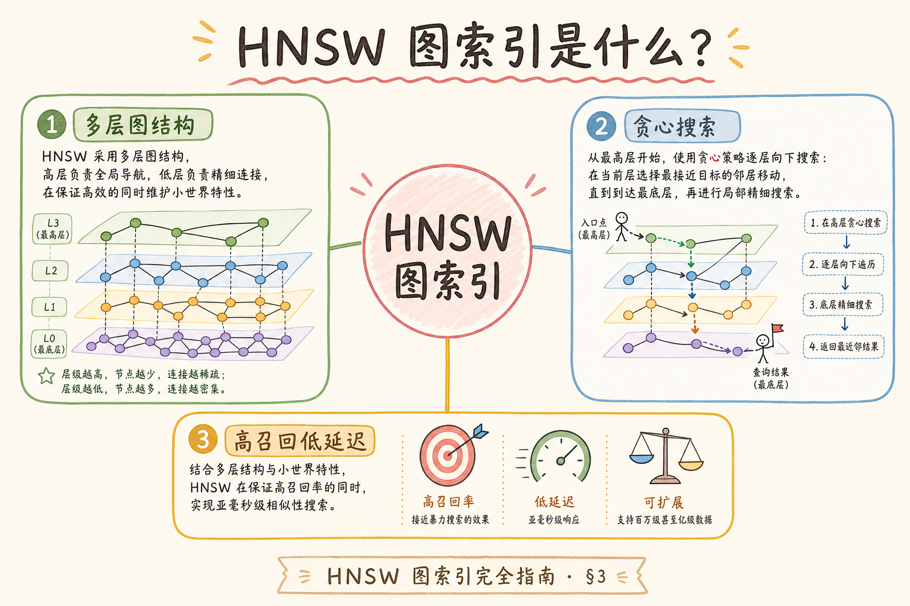
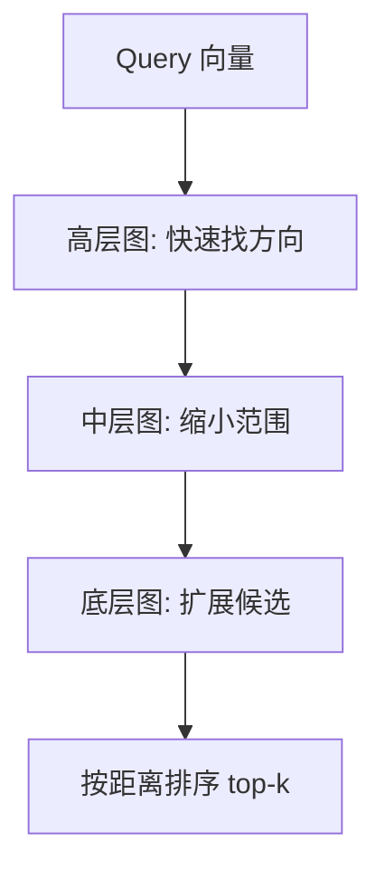
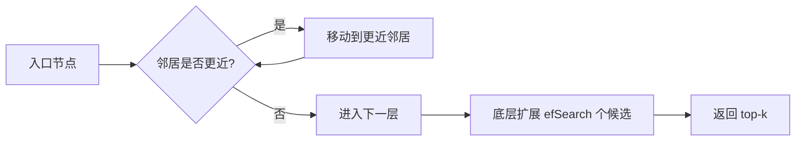
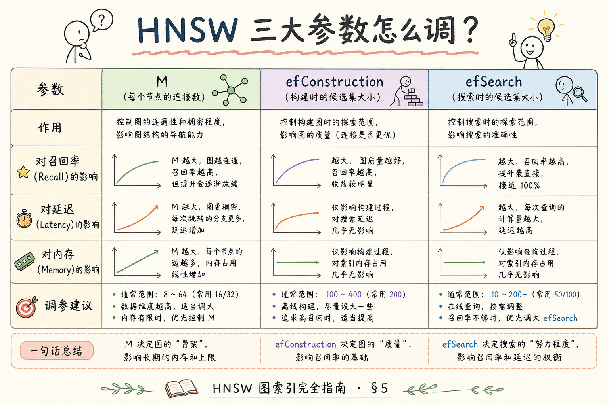
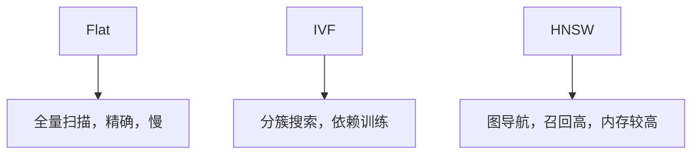

# C4 向量存储（十二）：HNSW 图索引完全指南

**HNSW**（Hierarchical Navigable Small World）是一类常见 ANN 索引。它把向量组织成多层近邻图，查询时从高层粗找方向，再到底层精找邻居。通俗说：先看城市地图找大方向，再进街区找门牌号。

读完本文，你应能解释 HNSW 解决什么问题、`M` 和 `efSearch` 大致控制什么、为什么它常被向量数据库默认推荐，以及如何用 Flat 做召回基线。

---

## 目录

1. [前言：为什么需要图索引](#1-前言为什么需要图索引)
2. [本文边界与动手路径](#2-本文边界与动手路径)
3. [HNSW 是什么](#3-hnsw-是什么)
4. [查询流程：从高层到低层](#4-查询流程从高层到低层)
5. [核心参数：M、efConstruction、efSearch](#5-核心参数mefconstructionefsearch)
6. [最小 FAISS 示例](#6-最小-faiss-示例)
7. [与 Flat、IVF 的对比](#7-与-flativf-的对比)
8. [调参与观测指标](#8-调参与观测指标)
9. [常见翻车与 FAQ](#9-常见翻车与-faq)
10. [总结与下一步](#10-总结与下一步)

---

## 1. 前言：为什么需要图索引

Flat 会和所有向量计算距离，精确但慢；IVF 先分簇再搜，速度快但依赖簇划分。HNSW 的思路是把向量连成“近邻图”，查询时沿着越来越近的节点前进。

企业 RAG 里，HNSW 常出现在 Qdrant、pgvector、Milvus、Elasticsearch 等系统中。你不一定手写 HNSW，但必须理解它的速度、召回和内存取舍。

HNSW 是多数向量库的默认索引，不等于“不用调参”。生产事故常见形态是 `efSearch` 被悄悄改小、延迟仪表盘变绿、两周后制度类引用 chunk 系统性偏移——没有 Flat recall 曲线，这类变更本不该通过发版门禁。

### 1.1 百万向量时 Flat 为什么扛不住

假设 collection 有 100 万条 768 维向量，每次查询若做全量距离计算，CPU 要算 100 万次点积或 L2。P95 延迟会随数据量线性恶化，而用户期望的是“秒级以内”的检索体验。

ANN（近似最近邻）用**可接受的召回损失**换**数量级的速度提升**。HNSW 是 ANN 家族里召回/速度平衡较好的一类，所以很多向量库把它设为默认。

### 1.2 和 RAG 链路的关系

检索只是 RAG 的一环。若 HNSW 的 `efSearch` 设太小，漏掉正确 chunk，后面 rerank 和 LLM 再强也救不回来；若设太大，检索 P95 拉高，端到端 SLA 超标。理解 HNSW 参数，是在 **召回质量** 与 **API 延迟** 之间做有依据的权衡。

---

## 2. 本文边界与动手路径

本文讲 HNSW 入门，不展开论文细节和底层 C++ 实现。建议路径：

建议路径的核心是 **先懂图导航直觉，再用 Flat 量化 efSearch**。手画三层图、跑通 FAISS 示例、扫 `efSearch` 列表，比背参数表更能建立 recall–延迟权衡的肌肉记忆。

| 步骤 | 你做什么 | 验收 |
|------|----------|------|
| A | 理解图索引直觉 | 能解释“沿近邻走” |
| B | 跑一个 HNSW 示例 | 能 search |
| C | 调 `efSearch` | 看召回和延迟变化 |
| D | 用 Flat 对比 | 能算 recall@k |

### 2.1 每步建议花多久

| 步骤 | 建议时间 | 要点 |
|------|----------|------|
| A | 30 分钟 | 手画三层图：高层少节点、底层全量 |
| B | 1 小时 | 跑通下文 FAISS 示例，改 `k` 看输出 |
| C | 1～2 小时 | 固定数据，扫 `efSearch` 列表，记 recall 与耗时 |
| D | 1 小时 | 同一 query 集对比 HNSW 与 Flat top-k 重叠率 |

### 2.2 本文不展开

- HNSW 论文证明与复杂度严格推导
- 各云厂商托管向量库的内置默认参数表（以你用的引擎文档为准）
- GPU 版 HNSW 与量化（INT8/PQ）组合——知道“量化会进一步影响召回”即可

---

## 3. HNSW 是什么

HNSW 用多层图组织向量。高层节点少，负责快速接近目标区域；底层节点多，负责细找近邻。

读下图时，想象 query 从最高层“跳伞”落点，每层沿边走向更近邻居，最后在底层摊开 `efSearch` 个候选再排序。图的质量由建索引时的 `M` 与 `efConstruction` 决定，查询时能调的主要杠杆通常是 `efSearch`。




这张图的结论是：HNSW 的速度来自图导航，不需要扫描所有向量。

### 3.1 “小世界”直觉

社交网络里“六度分隔”：任意两人通过少量中间人可连上。HNSW 建图时让**相近向量之间连边**，查询时贪心沿边走向更近节点，避免在全库随机跳跃。

**层数**：新插入的向量以一定概率进入更高层；高层是“高速公路”，底层是“街巷明细”。层数由算法和数据规模决定，一般不需要你手工指定。

### 3.2 建索引 vs 查询：两套参数

| 阶段 | 主要参数 | 影响 |
|------|----------|------|
| 建索引 | `M`、`efConstruction` | 图的质量、构建时间、内存 |
| 查询 | `efSearch` | 单次搜索的候选宽度、延迟、召回 |

线上出问题，先查 **efSearch** 和 **top_k**；重建索引慢，再查 **efConstruction** 和批量入库策略。

---

## 4. 查询流程：从高层到低层

查询大致分两步：先贪心走到更近节点，再在底层维护一个候选队列。

查询阶段要区分“图导航误差”和“metric 配错”：前者靠增大 `efSearch` 缓解，后者会让整条图上的近邻语义失真，调参无效。入口节点实现因库而异，但 normalize 与 cosine/L2 一致性是你能主动控制的变量。



初学者只需记住：`efSearch` 越大，底层看的候选越多，召回通常越高，延迟也更高。

### 4.1 和“贪心 + 优先队列”的关系

底层搜索常维护一个大小为 `efSearch` 的候选集合（实现细节因库而异）。可以理解为：在图上同时探索多条“可能更近”的路径，最后从候选里取距离最小的 `k` 个。

**不是**保证全局最优——那是 Flat 的工作。HNSW 保证的是在有限探索步数内，**大概率**找到足够好的近邻。

### 4.2 入口节点从哪来

不同实现会用固定入口、随机入口或上次查询缓存。对使用者透明，但若召回异常低，除参数外还要查：**向量是否已 normalize**、**距离度量是否与训练 embedding 一致**（cosine vs L2）。

---

## 5. 核心参数：M、efConstruction、efSearch

| 参数 | 控制什么 | 调大后通常怎样 |
|------|----------|----------------|
| `M` | 每个节点连多少邻居 | 召回提高，内存增加 |
| `efConstruction` | 建图时搜索多宽 | 索引更好，构建更慢 |
| `efSearch` | 查询时候选多宽 | 召回提高，延迟增加 |

建索引与查询是两套旋钮：`M` 和 `efConstruction` 影响图质量与构建成本，改它们通常要重建；`efSearch` 影响单次查询，是线上最常动的参数。先固定 `M` 和 `efConstruction`，再用 `efSearch` 找延迟和召回平衡，不要一次改多个变量。



### 5.1 调参顺序（推荐）

1. 用引擎默认 `M`（常见 16～64）和 `efConstruction` 建一版索引
2. 在固定 query 集上扫 `efSearch`：16 → 32 → 64 → 128…
3. 画 recall@10 vs P95 latency 曲线，选拐点
4. 若 recall 仍不够且内存可接受，再略增 `M` 并 **重建索引**（不能热改）

### 5.2 经验关系（非硬性公式）

- `efSearch` 建议 **≥ 你想要的 top_k**，常见取 `top_k` 的 2～10 倍作为起点
- `efConstruction` 常设为与 `M` 同量级或更大，建库慢一次，查询长期受益
- 数据量从 10 万涨到 1000 万，**同一组参数** 的 recall 可能下降，需重新评测

### 5.3 内存粗算直觉

每条边在图里占存储。`M` 越大，平均出度越高，索引文件和 RAM 占用上升。预算紧张时，先压 `M` 和向量维度（或量化），再接受略低的 recall，而不是无限增大 `efSearch` 却扛不住内存。

---

## 6. 最小 FAISS 示例

下面代码展示 HNSW 的使用形状：建图参数影响索引质量，查询参数影响每次搜索质量。大数据应分批 `add` 并监控内存峰值；输出下标要映射回 `chunk_id`，并与当前 `M`、`efConstruction`、`efSearch` 一并记入发版记录。

```python
import faiss
import numpy as np

np.random.seed(0)
d = 8
xb = np.random.random((1000, d)).astype("float32")
xq = np.random.random((5, d)).astype("float32")

index = faiss.IndexHNSWFlat(d, 32)  # M=32
index.hnsw.efConstruction = 80
index.add(xb)

index.hnsw.efSearch = 40
D, I = index.search(xq, k=5)
print(I)
```

这段代码展示了 HNSW 的使用形状：建图参数影响索引质量，查询参数影响每次搜索质量。

### 6.1 逐行说明

| 代码 | 含义 |
|------|------|
| `IndexHNSWFlat(d, 32)` | 维度 `d`，`M=32` |
| `efConstruction = 80` | 插入每条向量时，在图里宽搜 80 个候选找邻居 |
| `add(xb)` | 批量建图；大数据应分批 add 并监控内存 |
| `efSearch = 40` | 每次 query 底层候选宽度 |
| `search(xq, k=5)` | 返回距离 `D` 与下标 `I` |

### 6.2 动手实验

在同一脚本里加 Flat 基线：

```python
flat = faiss.IndexFlatL2(d)
flat.add(xb)
_, I_flat = flat.search(xq, k=5)
# 对比 I 与 I_flat 的行重叠数 -> recall@5
```

把 `efSearch` 从 10 改到 200，观察重叠率何时接近 Flat。你会直观看到 **延迟与 recall 的曲线**，比背参数表更有用。

---

## 7. 与 Flat、IVF 的对比

三类索引解决同一问题：在可接受的召回损失下少算距离。Flat 是精确尺子，IVF 靠簇划分剪枝，HNSW 靠多层图导航。选型没有绝对冠军，只有你的数据规模、内存预算、是否可离线 train 与增量写入频率共同决定的 Pareto 点。



| 方法 | 优点 | 风险 |
|------|------|------|
| Flat | 精确、好理解 | 大库慢 |
| IVF | 可控簇搜索 | 需训练，参数敏感 |
| HNSW | 常见默认选择，召回好 | 内存占用和构建成本高 |

### 7.1 何时仍用 Flat

- 数据量 < 1～5 万（视硬件而定），延迟已达标
- 离线评测 **gold 近邻**，需要 100% 精确
- 调试 embedding 或距离度量是否配错

### 7.2 IVF 和 HNSW 怎么选（粗指南）

| 情况 | 倾向 |
|------|------|
| 托管向量库默认 HNSW | 先用默认，用评测说话 |
| 内存极紧、可接受训练 | 评估 IVF + PQ |
| 数据持续高频写入 | 查引擎对增量建 HNSW 的支持；有的场景写入期用 IVF，稳定后重建 HNSW |

详见 [88 IVF](88.ivf-index-tutorial.md)（若系列中有）及 [87 ANN 召回与延迟评测](87.ann-recall-latency-tutorial.md)。

---

## 8. 调参与观测指标

建议先建立 Flat 基线，再观察 HNSW：

线上观测要把 `efSearch`（若引擎暴露）、`top_k` 与 `retrieval_latency_ms` 打进结构化日志。延迟突然变低有时是 `efSearch` 被误改小，而非索引“变聪明了”；召回下降往往先于用户投诉出现，应用监控做早期预警。

| 指标 | 说明 |
|------|------|
| recall@k | 与 Flat top-k 的重叠比例 |
| p95 latency | 用户查询延迟 |
| memory usage | 图边会占内存 |
| build time | 建索引耗时 |

如果召回不够，先增大 `efSearch`；如果内存过高，再评估 `M` 和数据规模。

### 8.1 评测集从哪来

不必一开始上千条。从业务日志抽样 50～200 个真实 query，对每个 query 用 Flat 算 **gold top-10 的 chunk_id**，再测 HNSW 的 recall@10。加上 10 条“难负例”（易混淆文档），防止参数只对简单 query 好看。

### 8.2 线上观测对接

把 `retrieval_latency_ms`、`ef_search`（若引擎暴露）、`top_k` 打进结构化日志（[190](190.structured-logging-rag-tutorial.md)），用 Prometheus 看 P95（[191](191.prometheus-metrics-rag-tutorial.md)）。**召回下降**往往先于用户投诉出现——若日志里 latency 突然变低，有时是 `efSearch` 被误改小。

### 8.3 过滤对 HNSW 的影响

带 metadata filter 的查询（如 `tenant_id`）在部分引擎里会 **先 filter 再搜** 或 **搜后再 filter**，行为不同会导致有效 `efSearch` 变相变小。权限 filter 应在索引设计阶段测 recall，不能只在无 filter 环境调参。

---

## 9. 常见翻车与 FAQ

HNSW FAQ 集中在建索引慢、线上延迟高、recall 断崖与增量写入质量下降。多数根因可归结为 **efSearch 与 top_k 不匹配**、**metric 混用** 或 **带 filter 场景未单独评测**。下面按发生频率整理，便于对照 trace 分阶段耗时。

### 9.1 HNSW 一定比 IVF 好吗？

不一定。HNSW 常有高召回，但内存成本也高；IVF 在特定规模和硬件下可能更可控。百万级以下、延迟要求不严时，Flat 甚至更简单。

### 9.2 为什么建索引很慢？

`efConstruction` 太大、数据量大或机器资源不足都会影响构建。批量入库时避免峰值内存：分批 `add`、调低并发、在从库或离线窗口建索引。

### 9.3 为什么线上延迟变高？

`efSearch` 太大、top_k 太大、过滤条件选择性差都可能导致查询变慢。还有：**冷启动**、磁盘 IO、与 rerank 串行叠加——用 trace 拆阶段耗时。

### 9.4 能不能不用 Flat 基线？

不建议。没有 Flat，很难知道 HNSW 漏了多少正确邻居。至少在小样本上用 Flat 标 gold，再外推到全库参数。

### 9.5 更新向量后要重建吗？

**改 embedding 模型** → 全量重算向量，通常重建索引。  
**只增删 chunk** → 看引擎是否支持增量；HNSW 增量插入质量依赖 `efConstruction`，大批量更新后有时需 compact 或重建。

### 9.6 cosine 和 L2 混用会怎样？

距离度量与 embedding 训练方式不一致时，图上的“近邻”语义错误，recall 断崖式下跌。统一 normalize + inner product 或明确选 L2，并与 [91 Dense Retrieval](91.dense-retrieval-tutorial.md) 的向量规范一致。

---

## 10. 总结与下一步

HNSW 通过多层近邻图加速向量搜索，是很多向量数据库的常见默认索引。初学者重点掌握三件事：图导航直觉、`efSearch` 的召回/延迟取舍、用 Flat 做评测基线。

从 [84 Flat](84.flat-brute-force-search-tutorial.md) 的精确基线到本篇图索引，再到 [87](87.ann-recall-latency-tutorial.md) 的系统化评测，构成 ANN 调参的完整闭环。记住：**没有 recall 数字的 efSearch 优化，只是延迟优化。**


### 10.1 本篇检查清单

- [ ] 能解释高层导航 + 底层扩展的两阶段查询
- [ ] 能说出 `M`、`efConstruction`、`efSearch` 各影响建库还是查询
- [ ] 跑通 FAISS 示例并对比 Flat recall@k
- [ ] 知道 filter 场景要单独测 recall
- [ ] 线上问题先查 `efSearch` 和 top_k，再考虑重建

下一步读 [87 ANN 召回与延迟评测](87.ann-recall-latency-tutorial.md)，把索引调参变成可量化实验。
