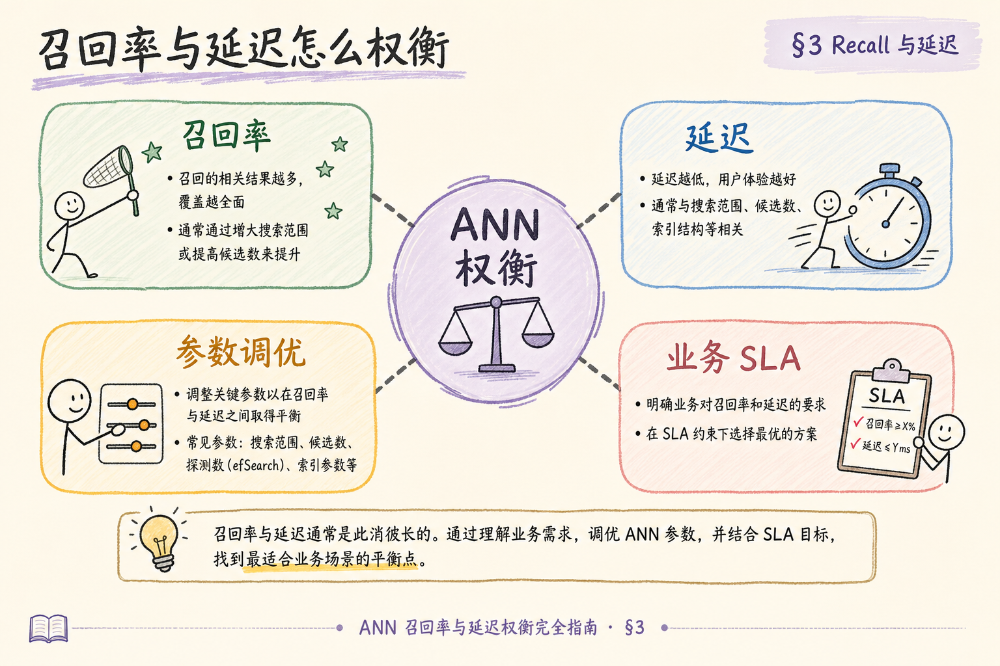
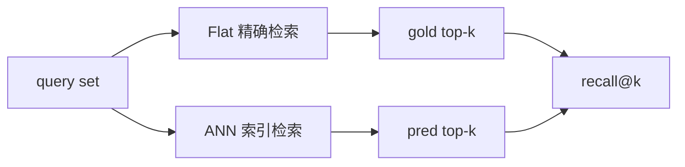
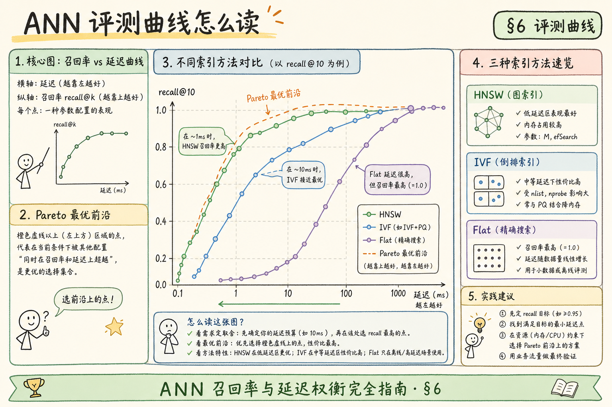
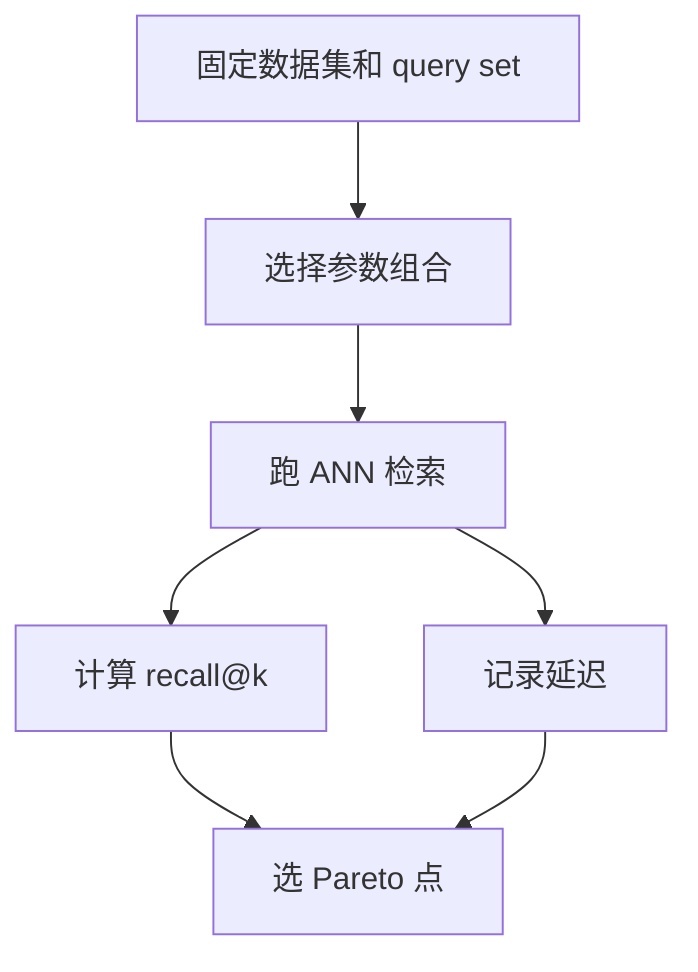
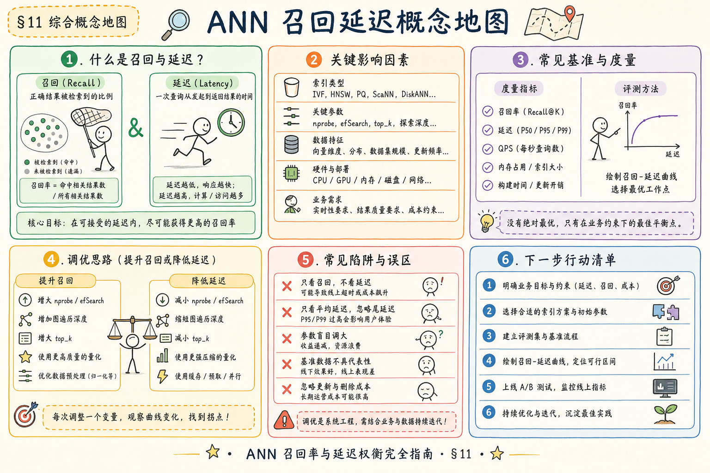

# C4 向量存储（十三）：ANN 召回率与延迟评测指南

**ANN**（Approximate Nearest Neighbor，近似最近邻）索引的价值是“更快地找到差不多正确的近邻”。但“差不多”必须量化，否则调参只是凭感觉。

本文讲如何用 Flat 做标准答案，评估 HNSW、IVF 等索引的 recall@k 和延迟。读完本文，你应能设计一个小型 ANN 评测表，记录 `recall@k`、p95 延迟和索引参数。

---

## 目录

1. [前言：为什么 ANN 必须评测](#1-前言为什么-ann-必须评测)
2. [本文边界与动手路径](#2-本文边界与动手路径)
3. [评测对象：Flat 与 ANN](#3-评测对象flat-与-ann)
4. [它解决什么问题](#4-它解决什么问题)
5. [核心指标：recall@k 与延迟](#5-核心指标recallk-与延迟)
6. [最小评测脚本](#6-最小评测脚本)
7. [参数实验表怎么设计](#7-参数实验表怎么设计)
8. [在 RAG 中怎么解释结果](#8-在-rag-中怎么解释结果)
9. [上线阈值与监控](#9-上线阈值与监控)
10. [常见翻车与 FAQ](#10-常见翻车与-faq)
11. [总结与下一步](#11-总结与下一步)

---

## 1. 前言：为什么 ANN 必须评测

HNSW、IVF 这类索引会跳过一部分候选来换速度。跳过多少、是否影响答案质量，必须用指标说话。

RAG 的检索质量最终影响答案。如果正确 chunk 没进 top-k，后面的 rerank 和生成都救不回来。所以 ANN 调参不能只看“快了多少”，还要看“漏了多少”。

ANN 评测应纳入发版门禁：任何 `efSearch`、`nprobe` 或索引重建都属于检索行为变更。没有 Flat gold 与 recall 曲线的变更，宁可延迟高一点，也不要用不可解释的召回下滑换仪表盘绿色。

### 1.1 一个典型线上事故

某团队把 HNSW 的 `efSearch` 从 80 调到 20，P95 延迟从 90ms 降到 35ms，周报里写“检索提速 60%”。两周后客服反馈“制度类问题答错变多”。复盘发现：ANN recall@10 从 0.97 掉到 0.86，正确 chunk 经常挤不进 top-10，rerank 再强也救不回来。**没有 Flat 基线和 recall 曲线，这次变更本不该上线。**

### 1.2 和 HNSW 专题的关系

若你还不熟悉 HNSW 参数含义，先读 [86 HNSW](86.hnsw-index-tutorial.md)。本篇专注 **怎么测**：用同一 query 集、同一 gold 标准，把索引调参从“凭感觉”变成“有数字”。

## 2. 本文边界与动手路径

本文只讲检索层评测，不讲答案评测和人工满意度。动手路径如下：

动手路径的交付物是一张 **可版本化的参数实验表**，而不是单次 Jupyter 截图。query 集、Flat gold、ANN pred 列表三者应能进 Git 或内部文档库，与 index 版本、embedding 版本绑定，半年后仍能复盘“当时为何选这个点”。

| 步骤 | 你做什么 | 验收 |
|------|----------|------|
| A | 用 Flat 得到 gold top-k | 有标准答案 |
| B | 用 ANN 得到 pred top-k | 有候选结果 |
| C | 计算 recall@k | 有质量指标 |
| D | 记录 p95 延迟 | 有性能指标 |

最小交付物是：一张参数实验表，能同时展示 recall、延迟、索引参数和结论。

### 2.1 每步建议花多久

| 步骤 | 建议时间 | 要点 |
|------|----------|------|
| A | 1～2 小时 | 小样本先用 Flat 跑 gold top-k |
| B | 1 小时 | 同一 query 集跑 ANN |
| C | 30 分钟 | 写 recall@k 脚本或复用下文示例 |
| D | 1～2 小时 | 扫参数画 recall-latency 曲线 |

### 2.2 本文不展开

- 答案层 faithfulness、人工满意度评测
- 各云厂商托管向量库的内置 benchmark 工具
- GPU 批量查询与多线程压测细节

## 3. 评测对象：Flat 与 ANN

读下图时，注意同一批 query 要分别跑 Flat 和 ANN。Flat 结果当 gold，ANN 结果当 pred。

评测流水线要尽量自动化：同一脚本输入 query 集，输出 recall@k、p95 与原始 pred id，避免“每次改参数手工拼命令”导致不可复现。子集 Flat gold 可代表趋势，但发版前应在更大样本或分层抽样上复核绝对值。





Flat 提供标准答案，ANN 提供生产候选。两者对比后，才能判断索引参数是否可接受。

### 3.1 Flat 当 gold 的前提

Flat 全量扫描得到的是 **精确近邻**，适合当评测 gold。注意三点：query 和 document 向量必须用 **同一 embedding 模型**；距离度量（cosine / L2）与线上一致；评测数据量可以比全库小，但 query 集应覆盖真实业务问法。百万级全库每次评测都跑 Flat 可能太慢，可对 **1 万～10 万条子集** 做 gold，再外推参数趋势。

### 3.2 常见 ANN 索引对照

| 索引 | 主要旋钮 | 评测时重点看 |
|------|----------|--------------|
| HNSW | `efSearch` | recall 对延迟敏感 |
| IVF | `nprobe` | 簇划分是否适配数据 |
| 量化 + ANN | 码本、压缩率 | recall 掉幅是否可接受 |

## 4. 它解决什么问题

ANN 评测解决的是“速度和质量如何取舍”的问题。

有评测后，bad case 可以分层归因：是 ANN 漏召回、embedding 不合适，还是 chunk 切分问题。没有检索层数字，团队往往在 rerank 和 prompt 上反复折腾，却解决不了“正确证据从未进候选”的底线问题。

| 决策问题 | 没有评测时 | 有评测后 |
|----------|------------|----------|
| HNSW 参数怎么设 | 凭经验猜 | 看 recall/latency 曲线 |
| IVF 的 nprobe 选多少 | 只看延迟 | 找可接受 Pareto 点 |
| 是否能上线 | 只说变快了 | 有质量阈值和性能阈值 |
| bad case 来自哪里 | 难定位 | 可判断是否检索漏召回 |

对 RAG 来说，ANN 评测是检索层质量门。它不能证明答案一定正确，但能证明正确证据是否有机会进入候选。

### 4.1 谁该参与 ANN 评测

| 角色 | 做什么 |
|------|--------|
| 检索开发 | 跑参数表、维护脚本 |
| 算法 / 数据 | 提供 query 集与 gold chunk |
| SRE | 把 recall、P95 接监控 |
| 产品 | 定可接受的误漏召回边界 |

评测不是一次性活动。每次 **换 embedding、重建索引、改 filter 策略**，都应触发回归。

## 5. 核心指标：recall@k 与延迟

**recall@k**：ANN 返回的 top-k 中，有多少也出现在 Flat top-k 中。

recall@k 与 p95 必须同屏看：高 recall 慢查询伤体验，低 recall 快查询伤答案。延迟测时要预热、分阶段计时，并带 metadata filter 测——无 filter benchmark 不能代表多租户线上。

```text
recall@k = 命中数量 / k
```

延迟建议记录 p50、p95、p99，而不是只看平均值。平均值可能掩盖长尾慢查询。

| 指标 | 说明 |
|------|------|
| recall@5 | 前 5 个候选是否接近精确结果 |
| p95 latency | 95% 查询能在多少毫秒内完成 |
| build time | 索引构建耗时 |
| memory | 索引占用内存 |

初学者要同时看 recall 和 latency。只看一个指标，很容易得到不可用的结论。

### 5.1 recall@k 的两种用法

**索引评测**（本篇重点）：pred 是 ANN top-k，gold 是 Flat top-k，看重叠率——衡量“近似索引漏了多少精确近邻”。**业务评测**：gold 是人工标注的“应命中 chunk_id”，pred 是检索 top-k——衡量“正确证据有没有进候选”。两者可一起做：索引 recall 低时，业务 recall 往往也低；索引 recall 高但业务仍差，就要查 embedding 或 chunk 切分。

### 5.2 延迟怎么测才可信

- 预热：丢弃前 N 次查询，避免冷缓存
- 固定并发：单线程测基线，再加生产相近并发看 P95
- 分阶段计时：embedding 耗时 vs 纯索引 search 耗时分开记
- 带 filter 测：无 filter 的 benchmark 不能代表多租户线上

## 6. 最小评测脚本

下面代码只表达结构：真实评测要记录每个 query 的耗时，再算 p95。

脚本输出应是结构化指标而非“感觉快了”：固定 query 集、保存 pred id 列表，才能在 recall 下滑时回放具体 query，判断是参数问题还是数据漂移。评测与发版流程绑定，比个人笔记本上的最后一次 benchmark 更可信。



```python
import time


def recall_at_k(gold, pred, k):
    scores = []
    for g, p in zip(gold, pred):
        scores.append(len(set(g[:k]) & set(p[:k])) / k)
    return sum(scores) / len(scores)


latencies = []
ann_ids = []

for query in queries:
    start = time.perf_counter()
    ann_ids.append(ann_search(query, k=5))
    latencies.append((time.perf_counter() - start) * 1000)

score = recall_at_k(flat_ids, ann_ids, k=5)
latencies_sorted = sorted(latencies)
p95 = latencies_sorted[int(len(latencies_sorted) * 0.95) - 1]

print({"recall@5": score, "p95_ms": p95})
```

预期输出是一组指标，而不是单个“快/慢”的主观判断。评测脚本要固定 query set，否则不同参数之间无法公平比较。

## 7. 参数实验表怎么设计

读下图时，注意实验必须固定数据集和 query set，只改变索引参数。

参数实验表应记录索引名、旋钮取值、recall@k、p95 与一句结论，并标出 Pareto 候选区与上线点/回滚点。只改一个参数、每个组合跑多次取 P95 中位数，是避免“偶然一次跑得快”误判的基础纪律。



表格示例：

| 索引 | 参数 | recall@5 | p95 ms | 备注 |
|------|------|----------|--------|------|
| HNSW | efSearch=20 | 0.91 | 28 | 快但略漏 |
| HNSW | efSearch=80 | 0.98 | 70 | 质量好 |
| IVF | nprobe=4 | 0.88 | 20 | 适合低延迟 |

所谓 Pareto 点，就是在质量和速度之间比较划算的点：再提高质量会明显变慢，再降低延迟会明显掉召回。

### 7.1 实验设计检查清单

- [ ] query 集固定且可版本化（如 `queries_v3.jsonl`）
- [ ] 只改一个索引参数，其他变量锁定
- [ ] 记录索引版本、embedding 模型版本、数据条数
- [ ] 每个参数组合至少跑 3 次取 P95 中位数
- [ ] 保存原始 pred id 列表，方便 bad case 回放

### 7.2 读曲线的直觉

recall@k 随 `efSearch` 或 `nprobe` 增大通常 **先陡后平**；延迟往往 **近似线性或超线性** 上升。拐点附近就是 Pareto 候选区。若曲线一直平缓，可能是 query 太简单或 k 太小，应加入难负例 query。

## 8. 在 RAG 中怎么解释结果

检索 recall 不等于答案正确率，但它是底线。如果 gold chunk 没进候选，模型无法引用它。

分层评测能避免“索引 recall 很高、业务仍答错”的假象：索引 recall 衡量近似漏了多少精确近邻，业务 gold 衡量正确证据是否进候选。两层都差时先修检索；索引好、业务差时再查 chunk 切分与 embedding。

RAG 评测建议分两层：先看 ANN recall，再看答案 faithfulness、citation 和人工 bad case。这样能判断问题发生在检索层，还是生成层。

| 现象 | 可能原因 |
|------|----------|
| 正确 chunk 没进 top-k | ANN 参数太激进或 embedding 不合适 |
| 正确 chunk 进了但没被引用 | rerank、裁剪或 prompt 问题 |
| 引用了但答案编错 | 生成和 grounding 问题 |

## 9. 上线阈值与监控

上线前给出明确阈值，例如：

阈值需用自有 gold set 标定，并写入 runbook：例如 `recall@10 >= 0.95` 与 `p95 <= 120ms` 可并行作为门禁。线上监控要关联 index 版本与 embedding 版本，否则质量波动无法追溯到某次参数变更。

- `recall@10 >= 0.95`
- `p95 latency <= 120ms`
- 权限 filter 后仍满足 recall 目标
- 参数变更必须重新跑评测

线上监控记录 query latency、top_k、filter、index version 和参数版本。没有版本记录时，线上质量波动很难追踪到具体参数变更。

### 9.1 建议阈值示例（需按业务校准）

| 场景 | recall@10 | p95 检索延迟 |
|------|-----------|--------------|
| 内部知识库 FAQ | ≥ 0.95 | ≤ 100ms |
| 多租户 + filter | ≥ 0.93（带 filter 测） | ≤ 150ms |
| 高合规、低幻觉 | ≥ 0.97 | 可适当放宽 |

阈值不是行业标准，必须用自己的 gold set 标定。上线后若 **拒答率升、引用错升**，先查近期是否改了 `efSearch` 或重建了索引。

## 10. 常见翻车与 FAQ

ANN 评测 FAQ 围绕“能否只看延迟”“query 集怎么选”“子集 gold 是否够用”。核心原则不变：**索引参数变更 = 检索行为变更 = 必须回归**。下面条目含排错速查，便于与线上日志对照。

**只看延迟可以吗？**  
不行。延迟低但 recall 差，会直接导致 RAG 答错。

**只看 recall 可以吗？**  
也不行。召回很高但 p95 太慢，用户体验和成本会出问题。

**query set 怎么选？**  
用真实问题、合成边界问题和高价值业务问题混合，避免只测简单 FAQ。

**每次改参数都要评测吗？**  
是。索引参数属于检索行为变更，应有评测记录。

### 10.1 排错速查

| 现象 | 先查什么 |
|------|----------|
| recall 突然下降 | 是否换了 embedding、是否误改 `efSearch`、索引是否建完 |
| 延迟升但 recall 不变 | 数据量增长、filter 选择性差、是否与 rerank 串行叠加 |
| 评测 recall 高、线上答案仍差 | 业务 gold 与 Flat gold 不一致；chunk 切分问题 |
| 不同环境结果不一致 | 向量是否 normalize、距离度量、索引是否同步 |

### 10.2 FAQ 补充

**子集 Flat gold 能代表全库吗？**  
趋势可以，绝对值要定期在全量或更大样本上复核。  
**要测 recall@1 还是 recall@10？**  
RAG 常先 recall@10 或 recall@20，因为后面还有 rerank；若 top_k 很小，也要测对应的 k。

### 10.3 动手作业：画一张 recall-latency 图

用 50 条 query、固定 `top_k=10`，横轴 `efSearch`（或 `nprobe`），纵轴左 recall@10、右 p95 ms。标出 **上线点** 与 **回滚点**（recall 跌破阈值即回滚）。该图应与索引版本、embedding 版本一并归档，方便半年后仍能解释“当时为什么选这个参数”。

## 11. 总结与下一步

ANN 调参必须用 Flat 基线、recall@k 和延迟指标闭环。没有评测，HNSW、IVF 的参数只是猜测。

本篇把 [84 Flat](84.flat-brute-force-search-tutorial.md)、[85 IVF](85.ivf-index-tutorial.md)、[86 HNSW](86.hnsw-index-tutorial.md) 的调参直觉收束为可执行流程：固定 query、Flat gold、参数表、门禁阈值与版本化归档。检索质量从此不再依赖某位工程师的直觉记忆。



### 11.1 本篇检查清单

- [ ] 有 Flat（或等价精确）gold top-k
- [ ] 能算 recall@k 和 p95 延迟
- [ ] 参数实验表含索引名、参数、recall、延迟、结论
- [ ] 带 metadata filter 的场景单独测过
- [ ] 线上日志能关联 index / embedding 版本

评测脚本与参数表建议纳入 Git 或内部文档库，与发版流程绑定，避免“只有某台笔记本上有最后一次 benchmark”。

下一步可以读 [88 metadata filter](88.metadata-filter-retrieval-tutorial.md)，把检索质量和权限过滤结合起来看。
