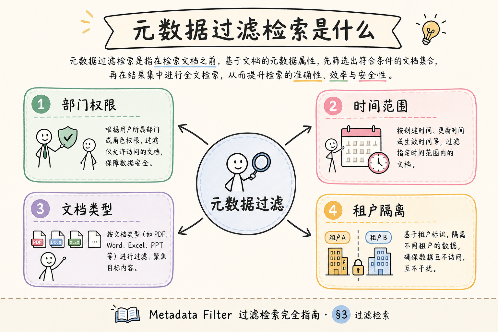
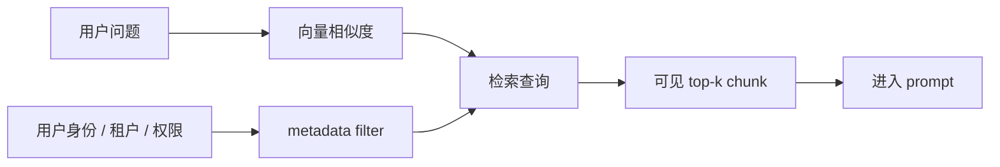
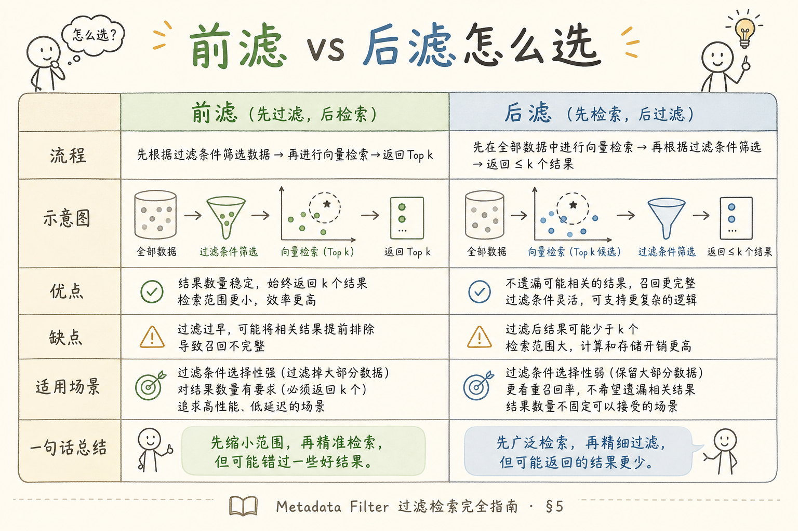
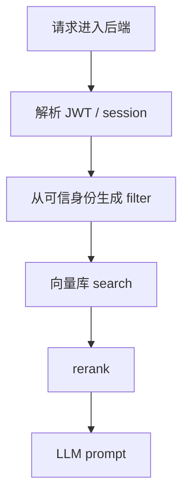
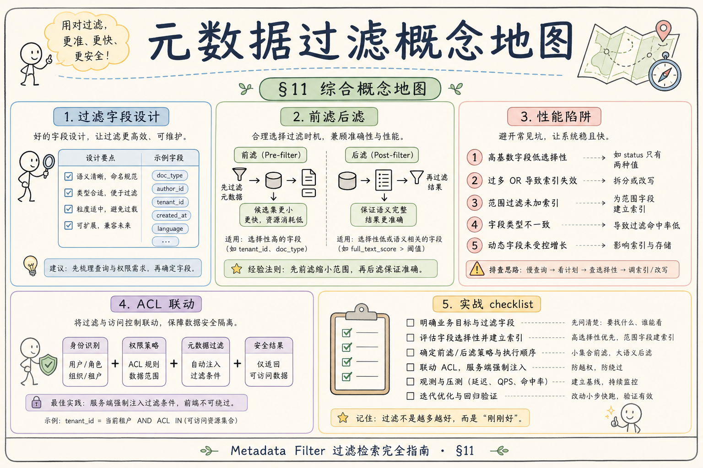

# C4 向量存储（十四）：Metadata 过滤检索完全指南

RAG 不能只按语义相似召回。企业系统还必须按租户、权限、文档版本、语言、时间等 metadata 过滤候选。**Metadata 过滤检索**就是把这些业务条件放进检索阶段，而不是答案生成后再补救。  
通俗说：相似只是“像不像”，metadata filter 决定“能不能给这个用户看”。

读完本文，你应能解释 metadata filter 解决什么问题、常见字段怎么设计、如何避免越权召回，并能写出最小过滤查询。

---

## 目录

1. [前言：相似不代表可见](#1-前言相似不代表可见)
2. [本文边界与动手路径](#2-本文边界与动手路径)
3. [Metadata 过滤是什么](#3-metadata-过滤是什么)
4. [它解决什么问题](#4-它解决什么问题)
5. [字段设计：tenant、doc、acl、version](#5-字段设计tenantdocaclversion)
6. [最小过滤查询示例](#6-最小过滤查询示例)
7. [过滤放在哪一层](#7-过滤放在哪一层)
8. [常见业务场景](#8-常见业务场景)
9. [评测与日志](#9-评测与日志)
10. [常见翻车与 FAQ](#10-常见翻车与-faq)
11. [总结与下一步](#11-总结与下一步)

---

## 1. 前言：相似不代表可见

“财务报销制度”和“人事报销流程”在语义上可能很近，但不是每个人都能看。向量检索如果只按相似度返回 chunk，就可能把越权内容放进 prompt。

Metadata filter 的核心原则是：不可见的 chunk 不应该进入候选集。不要把安全希望寄托在“模型不要说出来”，因为模型一旦看过越权文本，泄漏风险已经发生。

### 1.1 三个典型越权场景

| 场景 | 无 filter 时 | 后果 |
|------|--------------|------|
| 多租户 SaaS | B 公司问退款，召回 A 公司制度 | 数据泄露、合规事故 |
| 部门权限 | 实习生问薪酬，召回 HR 密级文档 | 内部泄密 |
| 文档版本 | 问 2025 政策，召回 2023 废止版 | 答案过时、决策错误 |

### 1.2 和 Dense 检索的关系

语义相似 **不等于** 业务可见。即使用户问题和某 chunk 向量很近，若该 chunk 不在其权限内，也 **不得** 进入候选。filter 与相似度是 **与** 关系，不是二选一。详见 [91 Dense Retrieval](91.dense-retrieval-tutorial.md)。

## 2. 本文边界与动手路径

本文讲检索阶段过滤，不讲完整 RBAC 系统实现，也不展开每个向量库的 DSL 差异。先掌握四步：

| 步骤 | 你做什么 | 验收 |
|------|----------|------|
| A | 定义 metadata 字段 | 字段名统一 |
| B | 写入向量库 | 每个 chunk 带 metadata |
| C | 查询时加 filter | 只返回可见内容 |
| D | 写负例测试 | 越权问题召回为空 |

最小交付物是：一个有权限用户能召回、无权限用户不能召回的测试用例。

### 2.1 每步建议花多久

| 步骤 | 建议时间 | 要点 |
|------|----------|------|
| A | 1 小时 | 字段命名与租户、权限模型对齐 |
| B | 2 小时 | 入库脚本保证每个 chunk 带齐 metadata |
| C | 1 小时 | 查询 DSL 与后端 filter 生成逻辑 |
| D | 1 小时 | 正负例自动化测试 |

### 2.2 本文不展开

- 完整 RBAC、ABAC 权限引擎实现
- 各向量库 filter DSL 差异对照表
- 行级安全与数据库权限同步

## 3. Metadata 过滤是什么

读下图时，注意检索查询由两部分组成：语义相似度和业务可见性。二者必须同时进入检索。

在生产环境里，metadata 过滤不是“加分项”，而是检索 API 的默认契约。很多团队的第一次 RAG 上线只调 embedding 和 top-k，Demo 里答案很漂亮，一接真实租户就发现 A 公司能搜到 B 公司的制度。漏 filter 的代价通常是合规事故，而不是多返几条无关结果。因此从 Day 1 起就应把 filter 与向量 search 写在同一次调用里，并在 code review 里把“检索入口是否必带 filter”列为阻断项。





上图的结论是：filter 必须和相似度查询一起执行，不能等模型看完后再删除。

## 4. 它解决什么问题

Metadata 过滤主要解决“相似但不该返回”的问题。

| 问题 | 没有 filter 时 | 有 filter 后 |
|------|----------------|--------------|
| 多租户 | A 租户可能搜到 B 租户内容 | 按 `tenant_id` 限制 |
| 权限组 | 普通员工可能看到财务制度细节 | 按 `acl_group` 限制 |
| 文档版本 | 旧制度仍被召回 | 按 `is_active/version` 限制 |
| 单文档问答 | 搜到其他文档片段 | 按 `doc_id` 限制 |

它解决的是候选边界，不负责候选内部排序。排序质量仍要靠 embedding、BM25、rerank 和评测。

### 4.1 Pre-filter vs Post-filter

部分引擎支持 **检索前过滤**（只在可见子集上搜）或 **检索后过滤**（先 ANN 再删）。Post-filter 在可见文档占比很小时，有效候选可能不足，导致 recall 虚低。设计索引时要向厂商确认行为，并在 **带 filter** 条件下单独跑 [87 ANN 评测](87.ann-recall-latency-tutorial.md)。

## 5. 字段设计：tenant、doc、acl、version

字段应少而稳定。不要今天叫 `tenant`，明天叫 `org_id`，后天又叫 `workspace`。字段混乱会让 filter 失效，而且很难排查。



| 字段 | 示例 | 作用 |
|------|------|------|
| `tenant_id` | `acme` | 多租户隔离 |
| `doc_id` | `travel-2025` | 文档级筛选 |
| `acl_group` | `finance` | 权限组 |
| `version` | `v2` | 文档版本 |
| `is_active` | `true` | 排除废弃 chunk |
| `lang` | `zh` | 多语言过滤 |

初学者优先设计会参与查询的字段。只用于展示的大字段可以放在文档库或对象存储里，不一定都塞进向量库 metadata。

### 5.1 字段设计原则

- **少而稳**：参与 filter 的字段变更成本高，避免随意改名
- **可审计**：`tenant_id`、`doc_id` 应能回溯到源文档
- **类型一致**：`is_active` 不要有时布尔有时字符串 `"true"`
- **与 Namespace 配合**：租户级边界见 [89 多租户 Namespace](89.multi-tenant-namespace-tutorial.md)

### 5.2 反例：metadata 膨胀

把整段标题、作者、标签全塞进 metadata，filter 变慢、入库易不一致，且与对象存储重复。只保留 **检索、权限、审计** 必需的键。

## 6. 最小过滤查询示例

下面以 Chroma 风格举例，不同向量库 DSL 不同，但原则一致：检索时就把用户可见性限制进去。

工程上建议把业务 filter 抽象成独立对象（如 `VisibilityFilter`），由鉴权层根据 JWT 生成，检索层只负责映射到各引擎 DSL。这样做的好处是：换向量库时 filter 语义不变，审计时也能打印同一份条件摘要。切勿在业务 handler 里手写 JSON 字符串拼接 tenant_id——字段改名或类型不一致时，最常在边缘场景（异步任务、批量导入）静默失效。

```python
where = {
    "$and": [
        {"tenant_id": {"$eq": "acme"}},
        {"acl_group": {"$in": ["finance", "all"]}},
        {"is_active": {"$eq": True}},
    ]
}

hits = collection.query(
    query_embeddings=[query_vec],
    n_results=5,
    where=where,
)
```

这段代码的预期行为是：只从 `acme` 租户、当前用户可见的有效 chunk 中返回 top-k。不要先全库检索再在 Python 里删，因为中间结果已经越界。

### 6.1 引擎差异提醒

Chroma、Qdrant、Milvus、pgvector 的 filter DSL 不同，但 **语义相同**：`where` / `filter` 必须在 `search` 调用里传入。写适配层时把“业务 filter 对象”映射到各引擎语法，避免在业务代码里散落字符串拼接。

## 7. 过滤放在哪一层

filter 应由后端生成，前端传来的 `tenant_id` 或 `acl_group` 只能作为显示信息，不能作为可信权限来源。

典型反模式是：浏览器把 `tenant_id` 塞进检索请求体，后端原样转发给向量库。攻击者改一个参数就能跨租户查询，而 LLM 层完全不知情。更稳妥的做法是让 API 网关或 BFF 在解析登录态后注入 filter，向量库 SDK 调用层不接受来自前端的裸 filter 对象。调试台、内部脚本、评测任务也要走同一条链路，否则“生产安全、内网裸奔”会在一次事故里同时成立。



上图的关键是：权限上下文来自认证系统，而不是用户自己提交的参数。前端可以请求“只看某个文档”，但最终 filter 应由后端校验后生成。

## 8. 常见业务场景

| 场景 | filter |
|------|--------|
| 多租户 SaaS | `tenant_id = 当前租户` |
| 部门权限 | `acl_group in 用户组` |
| 文档版本 | `is_active = true` |
| 单文档问答 | `doc_id = 指定文档` |
| 多语言 | `lang = 用户语言` |

复杂场景中，metadata filter 只解决“能不能看”；排序质量还要靠向量、BM25 和 rerank。不要把权限字段和相关性字段混在一起解释。

### 8.1 案例：单文档问答

用户在某 PDF 内追问，filter 应固定 `doc_id`，避免同主题其他文件干扰。若只靠语义，可能召回同目录下相似但非本文件的 chunk。

### 8.2 案例：多语言知识库

同一政策有中英文两版，filter `lang=zh` 避免英文 chunk 进入中文用户的 prompt，减少模型混用语言。

## 9. 评测与日志

至少准备两类测试：

- 正例：有权限用户能召回目标文档。
- 负例：无权限用户召回为空或只返回公开文档。

日志应记录 filter 摘要、命中 chunk_id、tenant_id、权限组和 index version，但不要记录敏感正文。这样既能排查问题，也能降低日志泄密风险。

### 9.1 评测用例模板

| 用例类型 | 用户身份 | 期望 |
|----------|----------|------|
| 正例 | 财务组成员 | 能召回财务制度 chunk |
| 负例 | 无财务权限 | 不返回财务 chunk |
| 边界 | 跨组只读 | 仅 `acl_group` 含 `all` 的文档 |
| 回归 | 改 filter 代码后 | 自动化跑全量负例 |

### 9.2 结构化日志字段建议

记录 `filter_hash`（条件摘要）、`hits_count`、`tenant_id`、是否触发 **空结果**，便于与 [190 结构化日志](190.structured-logging-rag-tutorial.md) 对接。

## 10. 常见翻车与 FAQ

**为什么不能生成后再删越权引用？**  
因为模型已经看过越权内容，泄漏已经发生。过滤必须在检索阶段完成。

**metadata 字段越多越好吗？**  
不是。字段越多越容易不一致，也可能拖慢过滤。只保留查询、审计和回显真正需要的字段。

**前端传 tenant_id 可以信吗？**  
不可以。后端应从认证上下文推导 tenant 和权限。

**filter 会降低召回吗？**  
会缩小候选集，但这是安全要求。需要用有权限的 gold set 单独评测召回质量。

### 10.1 排错速查

| 现象 | 可能原因 |
|------|----------|
| 有权限却搜不到 | filter 过严、`is_active` 未设、post-filter 候选不足 |
| 无权限却能搜到 | 漏写 filter、信任前端 tenant_id、调试接口未隔离 |
| 偶发越权 | 缓存 key 未含 tenant、异步任务用错用户上下文 |

### 10.2 与 Namespace 的联合测试

同一用例在 [89 Namespace](89.multi-tenant-namespace-tutorial.md) 隔离下再跑一遍：即使 metadata filter 写错，Namespace 正确时仍不应跨租户。双层测试能抓住“只修了一处”的回归。

### 10.3 入库侧常见遗漏

异步任务、批量迁移、管理员代传文档时，最容易写错 `tenant_id`。入库流水线应对 **每条 chunk** 校验 metadata 必填字段，失败则拒写并告警，而不是静默进默认租户。

## 11. 总结与下一步

Metadata 过滤让 RAG 从“语义相似”走向“业务可用”。初学者要记住：filter 在检索阶段执行，由后端基于可信身份生成，并通过正负例测试验证。



### 11.1 本篇检查清单

- [ ] filter 在检索阶段执行，非生成后删除
- [ ] tenant / acl 来自后端可信身份
- [ ] 正负例测试可自动化
- [ ] 带 filter 条件下测过 recall
- [ ] 日志不含敏感正文

权限相关变更应走 code review checklist：任何新增检索入口都必须显式列出 filter 来源，防止“临时接口”绕过鉴权。

### 11.2 与结构化日志联动

filter 摘要、`hits_count`、空结果标记应写入检索 span（参见 [190 结构化日志](190.structured-logging-rag-tutorial.md)），便于从一次用户投诉反查到“当时 filter 是否过严”。

下一步读 [89 多租户 namespace](89.multi-tenant-namespace-tutorial.md)，继续理解租户隔离的工程边界。
