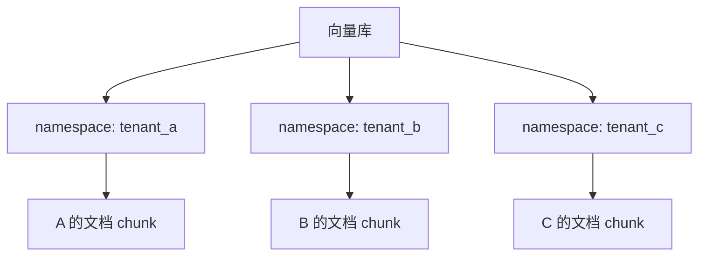
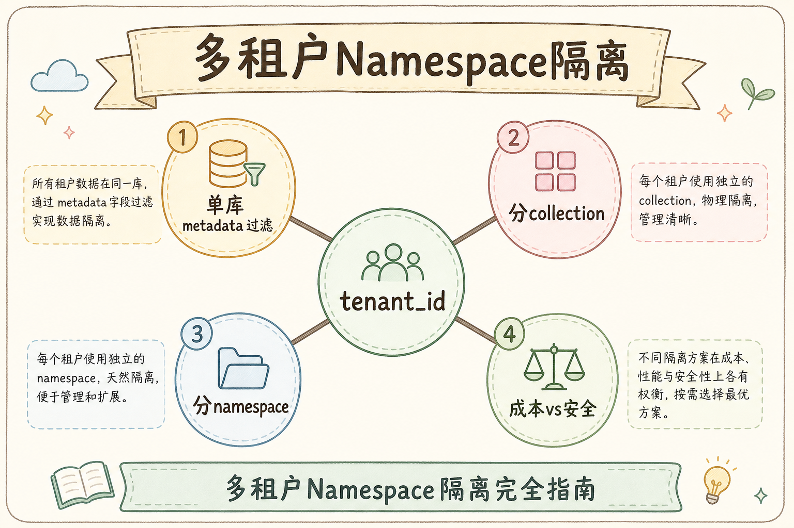
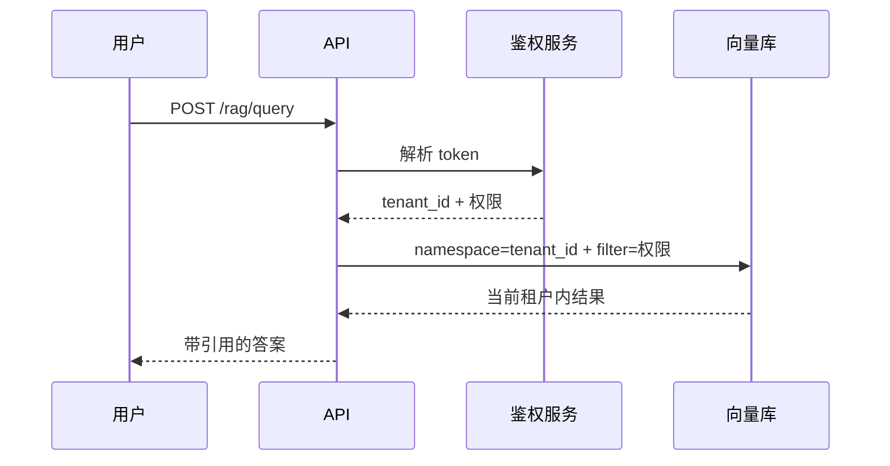
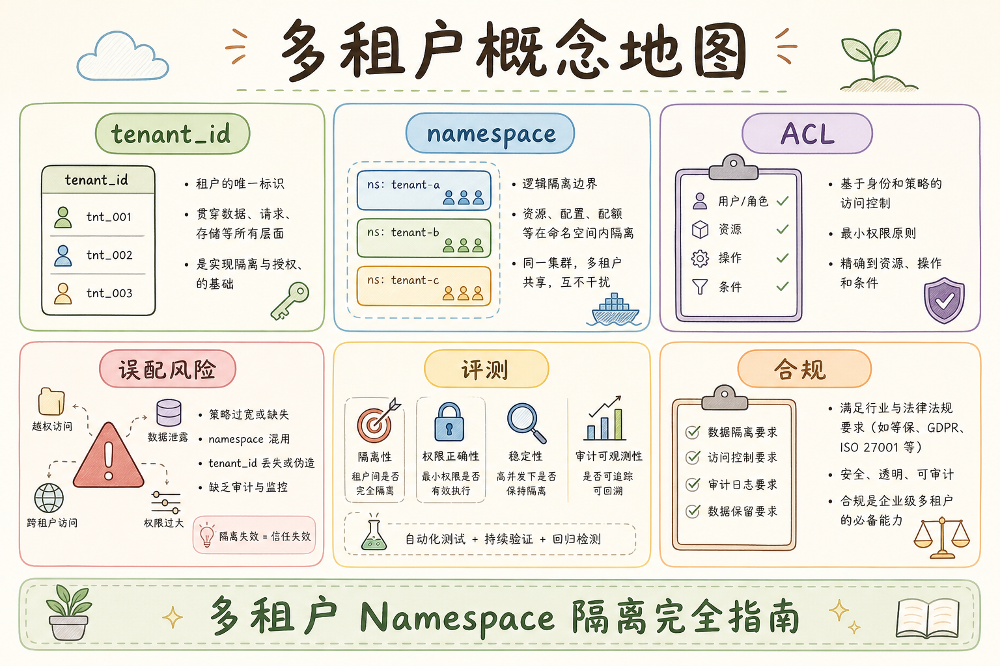

# C6 检索安全（四）：多租户 Namespace 隔离完全指南

> 多租户 RAG 系统里，最严重的事故不是“搜不到答案”，而是“搜到了别人的文档”。**Namespace** 可以先理解为向量库里的“租户隔间”：同一套检索服务里，不同客户、部门或项目的数据必须分区存放、分区查询。本文讲清楚 Namespace 是什么、解决什么问题、怎么在 RAG 检索链路中使用，以及初学者最容易踩的隔离坑。

---

## 目录

1. [为什么需要 Namespace](#1-为什么需要-namespace)
2. [本文边界与动手路径](#2-本文边界与动手路径)
3. [Namespace 是什么](#3-namespace-是什么)
4. [它解决什么问题](#4-它解决什么问题)
5. [Namespace 与 metadata filter 的关系](#5-namespace-与-metadata-filter-的关系)
6. [入库时怎么写 Namespace](#6-入库时怎么写-namespace)
7. [查询时怎么带 Namespace](#7-查询时怎么带-namespace)
8. [常见陷阱与 FAQ](#8-常见陷阱与-faq)
9. [总结](#9-总结)

---

## 1. 为什么需要 Namespace

假设你的 RAG 系统服务多个客户：

- A 公司上传了合同、客服手册、内部流程；
- B 公司也上传了同类资料；
- 两家公司都问“退款流程是什么？”。

如果检索时没有隔离条件，系统可能把 A 公司的文档片段返回给 B 公司。这个问题比答案不准更严重，因为它是数据泄露。

多租户系统至少要保证：

- A 租户只能检索 A 的文档；
- B 租户只能检索 B 的文档；
- 管理员跨租户调试时必须显式授权；
- 日志、评测、调试台也不能绕过隔离。

### 1.1 和 metadata filter 的分工预告

Namespace 管 **租户级大边界**；租户内的部门、文档、角色权限仍要靠 metadata filter。两者叠加才是完整隔离，详见第 4 节与 [88 Metadata 过滤](88.metadata-filter-retrieval-tutorial.md)。

## 2. 本文边界与动手路径

本文讲 Namespace 隔离概念与接入要点，不讲具体向量库 SDK 全量 API。

Namespace 的价值在于把租户边界做“粗而硬”：哪怕某次代码 review 漏看了 metadata filter，错误 namespace 往往仍能把 blast radius 限制在单租户内。这和只在 metadata 里写 `tenant_id` 有本质区别——filter 漏写等于全库可见，namespace 错写通常只会搜空或搜错房间，比跨租户泄露容易早发现。动手时优先改 ingest 与 retrieve 各一处，再补 CI 跨租户负例，比先写长篇设计文档更能验证隔离是否真实生效。

| 步骤 | 你做什么 | 验收 |
|------|----------|------|
| A | 定 Namespace 命名规范 | 如 `tenant:{id}` |
| B | 入库绑定 Namespace | chunk 进正确分区 |
| C | 查询从登录态取 Namespace | 不信任前端 |
| D | 负例跨租户测试 | 改参数也不能越权 |

### 2.1 每步建议花多久

| 步骤 | 建议时间 | 要点 |
|------|----------|------|
| A | 30 分钟 | 与 DBA、安全对齐命名 |
| B～C | 半天 | 改 ingest / retrieve 各一处 |
| D | 1 小时 | CI 里跑跨租户负例 |

---

## 3. Namespace 是什么

**Namespace**：向量库或检索系统中的逻辑分区，用来把不同租户、项目或业务线的数据隔开。

通俗说：向量库像一个大型仓库，Namespace 就是仓库里的独立房间。检索前先进入正确房间，再在房间里找资料。



### 3.1 各引擎叫法对照（查阅文档用）

| 概念 | 常见叫法 |
|------|----------|
| Namespace | Pinecone namespace、Qdrant collection+tenant、Milvus partition |
| 逻辑分区 | 有的引擎用独立 collection 代替 namespace |

实现名因产品而异，**原则不变**：查询前必须先限定租户边界。以你所用向量库文档为准，不要照搬别家字段名。

---

## 4. 它解决什么问题

Namespace 主要解决三类问题。



| 问题 | 没有 Namespace | 有 Namespace |
|---|---|---|
| 数据泄露 | 查询可能扫到其他租户文档 | 先限制在当前租户分区 |
| 检索干扰 | 不同客户相似文档互相竞争排名 | 排名只在当前租户内发生 |
| 运维隔离 | 删除或重建索引容易误伤其他租户 | 可按租户清理、备份、迁移 |

### 4.2 合规与合同视角

多租户 SaaS 合同常要求 **逻辑隔离、可删除、可审计**。Namespace 是实现“可删除”的关键：删租户时 drop 对应分区，比在全库 filter 删除更可控。向客户解释安全架构时，可用“房间 + 房间内权限”类比 Namespace 与 metadata。

Namespace 不是性能优化的小技巧，而是多租户 RAG 的基本安全边界。

### 4.1 隔离模式怎么选（粗指南）

| 模式 | 说明 | 适用 |
|------|------|------|
| 每租户独立 Namespace | 物理/逻辑分区清晰 | 强隔离、合规要求高 |
| 共享索引 + metadata | 运维简单 | 必须永不漏 filter |
| 每租户独立 collection | 部分引擎支持 | 中小租户数、可独立扩缩 |

没有银弹。Namespace + metadata 双保险，比单靠其一更抗“漏写一行代码”的人为失误。

---

## 5. Namespace 与 metadata filter 的关系

**metadata filter**：检索时按文档元数据过滤，例如 `department = "sales"`、`visibility = "internal"`。

Namespace 和 metadata filter 不是二选一。推荐关系是：


可以这样理解：

- Namespace 管“大边界”：这个请求属于哪个租户；
- metadata filter 管“细权限”：这个用户能看该租户里的哪些文档。

| 层级 | 例子 | 能否由前端自由传 |
|---|---|---|
| Namespace | `tenant_a` | 不能，必须来自登录态或后端鉴权 |
| metadata filter | `department=sales` | 可由前端选择，但后端必须校验 |
| query | `退款流程` | 用户输入 |

最危险的写法是让前端直接传 `namespace`，后端不校验。攻击者只要改请求参数，就可能跨租户查询。

### 5.1 纵深防御：为什么 metadata 里仍保留 tenant_id

即使 Namespace 已隔离，metadata 中的 `tenant_id` 仍可用于：**审计日志**、导出对账、二次校验（防止 SDK 误传 namespace）、离线评测按租户切分。不要觉得“有了 Namespace 就可以删掉 metadata 里的租户字段”。

---

## 6. 入库时怎么写 Namespace

文档入库时，后端应根据认证信息或管理后台选择，把 chunk 写入正确 Namespace。

入库链路的常见事故点不在单次 API 调用，而在 **异步 worker** 和 **批量迁移**：消息体没带 `tenant_id`、脚本写死默认 namespace、管理员代传文档却用了客服个人身份。这类 bug 往往上线数周后才被客户发现。建议对每条 upsert 做双字段校验：`namespace` 与 `metadata.tenant_id` 必须一致，不一致则拒写并告警。重建索引、跨环境导入时也要显式指定租户上下文，不能假设“环境变量里的默认租户就是对的”。


示例伪代码如下。这里演示的是流程，不绑定具体向量库 SDK。

```python
def ingest_document(document, current_user, vector_store):
    tenant_id = current_user.tenant_id
    namespace = f"tenant:{tenant_id}"

    chunks = split_document(document.text)
    vectors = embed_chunks(chunks)

    vector_store.upsert(
        namespace=namespace,
        items=[
            {
                "id": f"{document.id}:{index}",
                "vector": vector,
                "text": chunk,
                "metadata": {
                    "tenant_id": tenant_id,
                    "document_id": document.id,
                    "visibility": document.visibility,
                },
            }
            for index, (chunk, vector) in enumerate(zip(chunks, vectors))
        ],
    )
```

这段代码有两个重点：

1. `namespace` 来自 `current_user.tenant_id`，不是来自用户自由输入；
2. metadata 里仍然保留 `tenant_id`，便于审计和二次校验。

### 6.1 入库检查清单

- [ ] `namespace` 与 `metadata.tenant_id` 一致
- [ ] 批量迁移脚本带租户上下文，不能写死默认 Namespace
- [ ] 异步 worker 从消息体取 `tenant_id`，非全局变量

---

## 7. 查询时怎么带 Namespace

查询时也必须从后端认证上下文中取租户，而不是信任前端参数。

```python
def retrieve(query, current_user, vector_store):
    tenant_id = current_user.tenant_id
    namespace = f"tenant:{tenant_id}"

    allowed_doc_ids = load_allowed_document_ids(current_user)

    return vector_store.search(
        namespace=namespace,
        query=query,
        top_k=8,
        filter={
            "document_id": {"$in": allowed_doc_ids},
            "visibility": {"$in": ["team", "public"]},
        },
    )
```

推荐的完整链路如下：



这张图的结论：Namespace 和权限 filter 都应该由后端生成。前端可以选择知识库，但后端必须确认用户确实有权访问。

### 7.2 评测与运维场景

| 场景 | Namespace 要求 |
|------|----------------|
| 离线 benchmark | 每条 query 绑定 tenant fixture |
| 数据导出 | 只导出授权 namespace |
| 全库重建 | 按 namespace 分批，避免误删 |
| 客服代客查询 | 代客身份仍映射到 **客户** namespace，非客服个人 |

### 7.3 缓存与消息队列

Redis 缓存 key、Kafka 消费组、Celery 任务参数都必须含 `tenant_id`。曾有多起事故是 **检索带了 namespace，但缓存没分租户**，导致 B 用户读到 A 用户的上次答案摘要。

---

## 8. 常见陷阱与 FAQ

这一节集中处理 Namespace 最容易被误用的地方。判断一个方案是否安全，不只看它能不能查到数据，还要看它是否能防止“少写一个过滤条件就跨租户泄露”。

### 8.1 错：把 tenant_id 只放在 metadata

只靠 metadata filter 也能工作，但更容易被漏写 filter 的代码绕过。Namespace 可以作为更粗的一道边界。

### 8.2 错：前端传什么 namespace 就查什么

Namespace 是安全边界，不能信任前端。前端传来的租户 ID 只能作为展示或选择意图，后端必须用登录态重新校验。

### 8.3 错：调试台绕过 Namespace

内部调试台也要带租户限制。跨租户调试必须有明确权限和审计记录。

### 8.4 FAQ：每个用户都要一个 Namespace 吗？

通常不用。多数系统按租户或知识库建 Namespace，再用 metadata filter 做用户级权限。每用户一个 Namespace 会让管理和重建索引变复杂。

### 8.5 FAQ：删除租户时怎么处理？

先停止该租户访问，再删除对象存储、数据库记录、向量 Namespace、缓存和日志中的相关数据，并写入审计记录。

### 8.6 排错速查

| 现象 | 先查什么 |
|------|----------|
| B 租户看到 A 的数据 | retrieve 是否漏 Namespace；缓存 key 是否含 tenant |
| 本租户搜不到 | Namespace 拼写、入库分区是否写错 |
| 仅调试环境越权 | 调试 API 是否绕过鉴权 |

### 8.7 FAQ：共享索引多租户够吗？

小团队、低合规场景有时只用 metadata filter 也能跑。但随着代码路径增多，漏 filter 概率上升。**Namespace（或等价分区）+ metadata** 是更抗失误的默认。若客户合同要求强隔离，应优先物理或逻辑分区方案。

### 8.8 与向量库扩容

按 namespace 分片迁移时，注意 **双写、切换读、校验条数** 三步。迁移期间临时接口最容易忘带 namespace，应在网关层强制注入 tenant，而不是依赖每个业务 handler 自觉。

---

## 9. 总结

多租户 Namespace 隔离的核心是：先选对租户房间，再做细粒度权限过滤。



最小落地做法：

1. 入库时按 `tenant_id` 写入 Namespace；
2. 查询时从登录态生成 Namespace；
3. metadata filter 负责部门、角色、文档权限；
4. 调试台、评测、日志都不能绕过租户边界；
5. 删除、重建、备份都按 Namespace 维度设计。

如果只记一句话：**Namespace 是租户级边界，metadata filter 是租户内权限；两者要一起用。**

### 9.1 本篇检查清单

- [ ] 入库、查询 Namespace 均来自可信 `tenant_id`
- [ ] 前端传的租户 ID 不参与鉴权
- [ ] 跨租户负例测试进 CI
- [ ] 调试台、评测不默认全库
- [ ] 删租户流程覆盖向量 Namespace

上线前组织 **红队式检查**：在测试环境用错误 namespace、空 namespace、他人 tenant_id 调用 API，应全部失败或空结果。

多租户默认链路：**网关注入 tenant → Namespace → metadata filter → 检索**。威胁模型里应写明少任一环节的残余风险。

下一步可结合 [88 Metadata 过滤](88.metadata-filter-retrieval-tutorial.md) 做端到端隔离测试，并阅读 [195 PII 脱敏](195.pii-redaction-rag-tutorial.md) 了解日志侧泄露面。

### 9.2 系列阅读顺序建议

先 [88 filter](88.metadata-filter-retrieval-tutorial.md) 理解细权限，再本篇 Namespace 理解粗边界，最后在 [93 Hybrid](93.hybrid-search-tutorial.md) 检索链路里同时带上两者，避免“检索调优时拆掉安全栏”。

**合规提示**：等保、SOC2 类审计常要求证明“租户 A 无法读取租户 B 数据”。保留 Namespace 负例测试报告与日志样本，可显著缩短审计应答时间。
