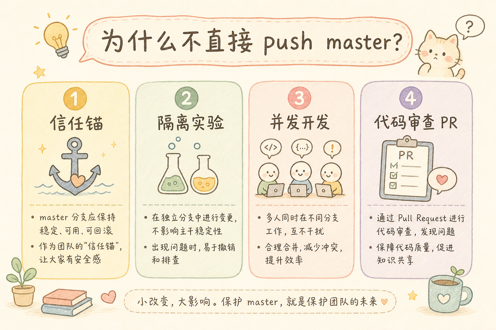
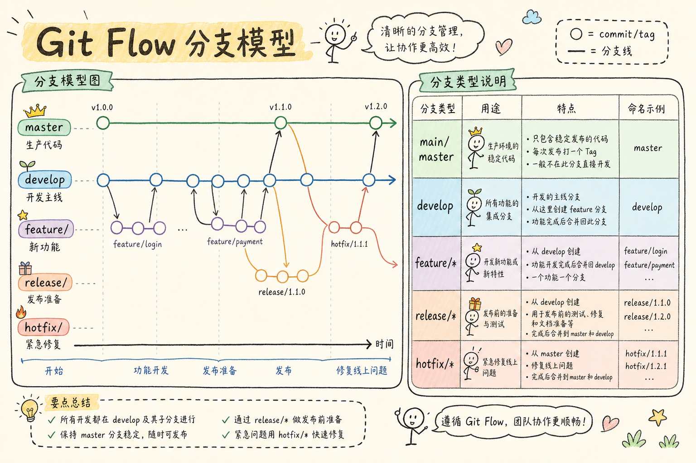
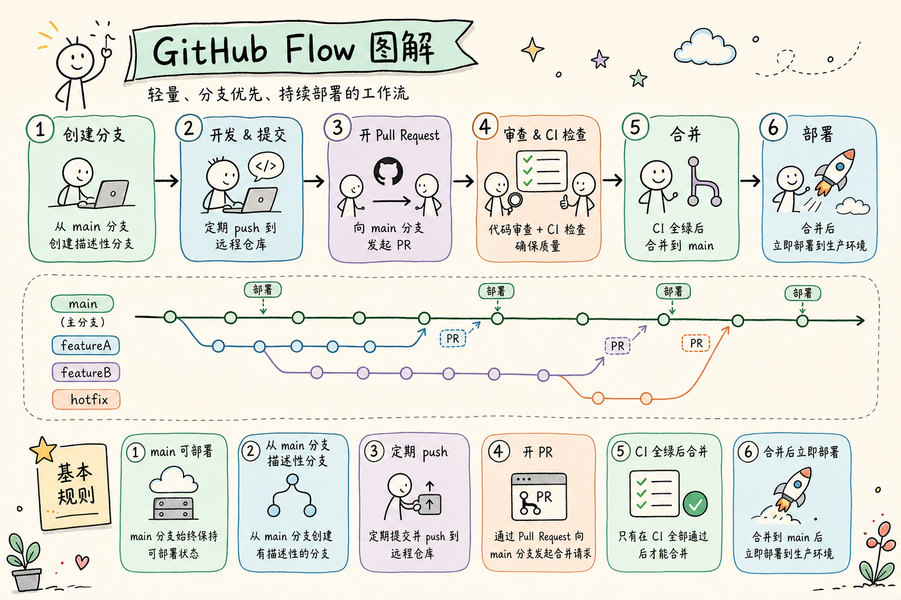
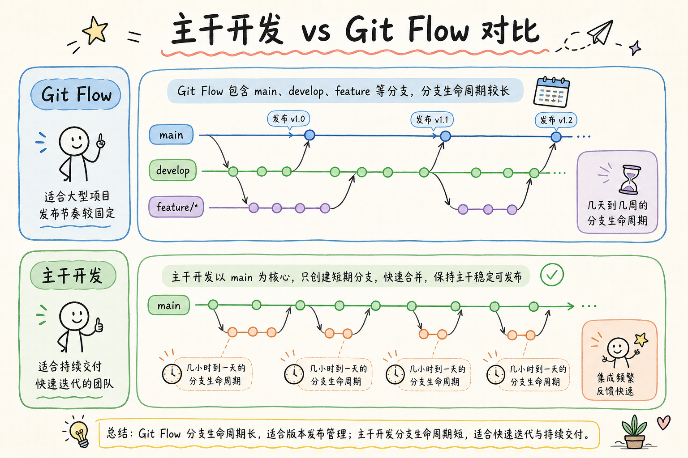
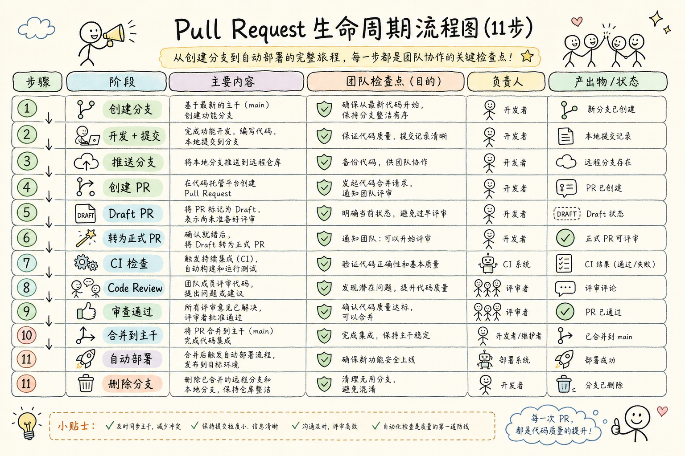
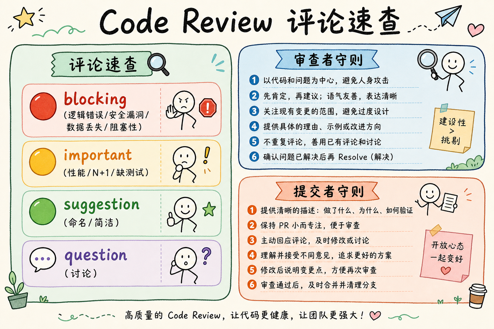
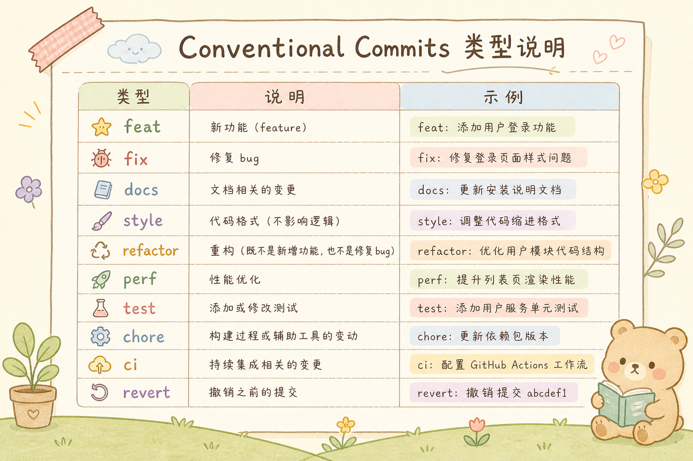
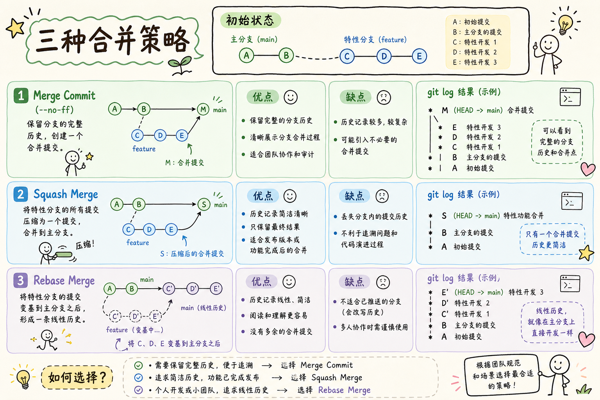
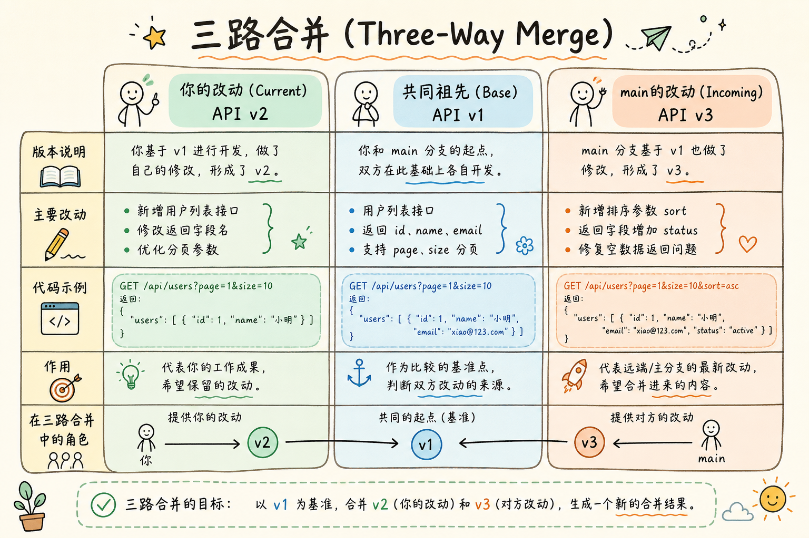
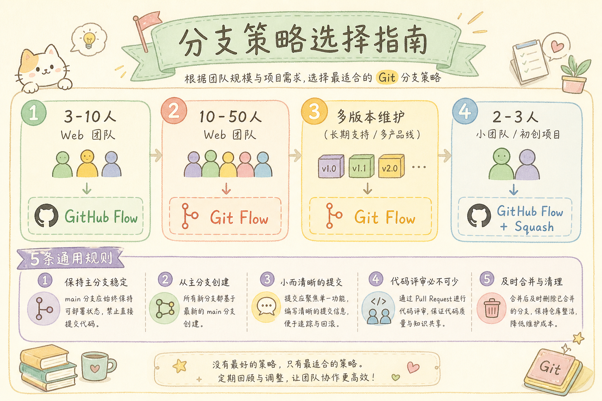

# Git 分支策略与 PR 流程完全指南：从「直接 push master」到规范的协作开发

> 你是否经历过——队友把代码直接推到 master，你的 PR 合并时冲突到怀疑人生？或者发布当天加班到深夜，只因为你不知道这次上线到底该包含哪些提交？这篇教程从零带你掌握 Git 分支策略与 Pull Request 流程，用规范的分支模型和代码审查机制，让团队协作从「胆战心惊」变成「游刃有余」。

> 术语说明：很多旧仓库把默认分支叫 `master`，新仓库更常见的是 `main`。本文前面的混乱案例沿用 `master`，后面的规范流程统一用 `main`。

---

## 目录

1. [前言：一个混乱的团队仓库](#1-前言一个混乱的团队仓库)
2. [为什么要用分支策略——从一条线到一棵树](#2-为什么要用分支策略从一条线到一棵树)
3. [Git Flow——经典但偏重](#3-git-flow经典但偏重)
4. [GitHub Flow——简单即是美](#4-github-flow简单即是美)
5. [Trunk-Based Development——主干开发新潮流](#5-trunk-based-development主干开发新潮流)
6. [Pull Request 的正确姿势](#6-pull-request-的正确姿势)
7. [Code Review 最佳实践](#7-code-review-最佳实践)
8. [分支命名与 Commit 规范](#8-分支命名与-commit-规范)
9. [合并策略：Merge vs Squash vs Rebase](#9-合并策略merge-vs-squash-vs-rebase)
10. [解决合并冲突的艺术](#10-解决合并冲突的艺术)
11. [CI/CD 与分支保护规则](#11-cicd-与分支保护规则)
12. [避坑指南](#12-避坑指南)
13. [总结](#13-总结)

---

## 1. 前言：一个混乱的团队仓库

2024 年某个周四下午，你的团队准备发布 v3.2.0 版本。你打开 GitHub，看到的景象让人头皮发麻：

```
* 8d3f2a1 (5 分钟前) fix typo                      (直接在 master 上改的)
* c7b4e9f (30 分钟前) hotfix: 修复支付 bug          (也是直接在 master 上改的)
* a1c8d4e (1 小时前) WIP: 重构用户模块——先存一下    (未完成的代码 push 了)
* f6e2b3c (2 小时前) feat: 新功能 A
* 2a7f1d9 (3 小时前) Merge branch 'feature/B'       (巨大无比的 merge commit)
* b3d5c7f (昨天) fix: 修个样式
* e9f4a1b (昨天) Merge branch 'feature/C'
* 4c8e2d0 (昨天) fix: 修上次的 fix
* 7a1b3c5 (前天) feat: 大功能 D—第一部分
* 1d5f7a9 (前天) feat: 大功能 D—第二部分
* 8e2c4b6 (大前天) Merge pull request #47 from ...
```

你花了两个小时试图弄清楚：「v3.2.0 到底该包含哪些提交？哪些功能完成了、哪些还是个半成品？」

然后你打开 `git log --graph`，看到了这幅绝景：

```
                    Git 分支——混乱版

  * fix typo (master)
  * hotfix 支付
  * WIP: 重构用户模块（只做了一半！）
  |\
  | * feat: 功能 B（实际没做完）
  | * feat: 功能 B 的一部分
  * | feat: 功能 A
  |\|
  | * feat: 功能 C
  * | fix 样式
  |/
  * Merge feature/C
  |\
  | * feat: 功能 D part 1
  | * feat: 功能 D part 2
  * | fix 上次的 fix
  |/
  * 上一个版本……

  问题:
  • master 上有未完成的代码 (WIP)
  • 功能 B 到底合进来了没有？找不到了
  • hotfix 直接在 master 上改——跳过测试
  • 分支合并完没人删——20 个僵尸分支
  • 没有 Release Notes——不知道 v3.2.0 有什么变化
```

**这就是没有分支策略的后果——仓库变成垃圾场，发布变成赌博。**

一个好的分支策略能带来什么？


读完本文，你应该能做到三件事：

1. 判断 Git Flow、GitHub Flow、Trunk-Based Development 分别适合什么团队。
2. 写出清晰的分支名、commit message 和 PR 描述。
3. 知道合并冲突、强制推送、分支保护这些高风险操作该怎么安全处理。

前置要求：你已经会 `git clone`、`git add`、`git commit`、`git push`。如果这些命令还不熟，建议先读一篇 Git 基础教程，再回来看分支策略。

---

## 2. 为什么要用分支策略——从一条线到一棵树

### 2.1 核心概念：分支的本质

```
分支 = 一条独立的开发线

想象你写了一本书的初稿（master）
现在你想尝试重写第三章——但你不想直接改原稿

所以你把原稿复印一份，在复印件上修改
    复印 → 这就是「创建分支」
    在复印件上改 → 这就是「在分支上开发」
    把修改写回原稿 → 这就是「合并」(merge)
    扔掉复印 → 这就是「删除分支」

如果改得不好，扔掉复印件就行——原稿毫发无损
这就是分支的核心价值：隔离风险
```

### 2.2 永远不应该直接 push master 的原因




---

## 3. Git Flow——经典但偏重

### 3.1 分支模型

Git Flow 由 Vincent Driessen 在 2010 年提出，是流传最广的分支模型。




### 3.2 工作流程

```
场景：开发一个「用户头像上传」功能

# 1. 从 develop 分出 feature 分支
git checkout develop
git pull origin develop
git checkout -b feature/user-avatar

# 2. 在 feature 分支上开发
git add .
git commit -m "feat: 完成头像上传功能"
git push origin feature/user-avatar

# 3. 开发完成——创建 PR 合并到 develop
# (在 GitHub/GitLab 上操作)
# feature/user-avatar → develop
# 代码审查 → 通过 → 合并

# 4. 准备发布——从 develop 分出 release 分支
git checkout develop
git checkout -b release/v1.2.0

# 5. 在 release 分支上做最后修整
# ——修小 bug、更新版本号、更新 CHANGELOG
git commit -m "chore: bump version to 1.2.0"

# 6. 发布——release 合并到 main + develop
git checkout main
git merge release/v1.2.0 --no-ff  # --no-ff 保留分支历史
git tag -a v1.2.0 -m "Release v1.2.0"
git push origin main --tags

git checkout develop
git merge release/v1.2.0 --no-ff
git push origin develop

# 7. 删掉 release 分支
git branch -d release/v1.2.0

# === 紧急修复 ===
# 8. 线上出了 bug——从 main 分出 hotfix 分支
git checkout main
git checkout -b hotfix/payment-crash

# 9. 修 bug
git commit -m "fix: 支付过程中余额为0时崩溃"

# 10. 合并到 main + develop（和 release 的流程一样）
git checkout main
git merge hotfix/payment-crash --no-ff
git tag -a v1.2.1 -m "Hotfix v1.2.1"
git push origin main --tags

git checkout develop
git merge hotfix/payment-crash --no-ff
git push origin develop
```

### 3.3 Git Flow 的优缺点

```
✅ 优点:
  • 结构清晰——每个分支有明确的角色
  • 适合有固定发布周期的项目（如每两周一个版本）
  • release 分支提供了「发布前修整」的缓冲区

❌ 缺点:
  • 分支类型太多了——小团队受不了
  • develop 和 main 之间的同步容易遗漏
  • release 分支往往活不过 3 天——有点浪费
  • 不适合持续部署（每天发版多次）

适合:
  • 有计划发布周期的产品（SaaS、企业软件）
  • 需要同时维护多个版本的场景
  • 团队规模 5 人以上
```

---

## 4. GitHub Flow——简单即是美

### 4.1 核心原则

GitHub Flow 只有一个长期分支——`main`。其他一切都从 `main` 分出，合并回 `main`。




### 4.2 一天的工作流

```bash
# 早上——从 main 分出分支
git checkout main
git pull origin main
git checkout -b add-user-avatar

# 开发——频繁小提交
git add avatar_upload.py
git commit -m "Add avatar upload endpoint"

git add avatar_resize.py
git commit -m "Add image resizing for avatars"

git add tests/
git commit -m "Add tests for avatar upload"

# 推送到远程（即使还没做完——这样同事能看到你的进展）
git push origin add-user-avatar

# 在 GitHub 上开 Draft PR——标记为「还在开发中」
# → 同事可以提前看、提前评论
# → CI 自动跑测试

# 开发完成——把 Draft PR 转为正式 PR
# → 请求 Code Review
# → CI 全绿
# → Review 通过

# 合并到 main → 自动部署！
# 删除远程分支
```

### 4.3 GitHub Flow 适合谁

```
✅ 优点:
  • 极其简单——只需要理解一个长期分支
  • 天然适配持续部署——合并 = 上线
  • 分支生命周期短——合并即删除，不会积累僵尸分支
  • PR 是核心——代码审查强制嵌入工作流

❌ 缺点:
  • 不适合需要同时维护多个版本的场景
  • 不适合有固定发布周期的项目
  • 对代码审查和 CI 质量要求高（合并 = 上线！）

适合:
  • Web 应用——你只维护一个最新版本
  • 持续部署团队——每天合并多次
  • 3-20 人的开发团队
```

---

## 5. Trunk-Based Development——主干开发新潮流

### 5.1 核心思想

Trunk-Based Development（TBD，主干开发）是 GitHub Flow 的「激进版」。核心原则：

**所有开发者每天至少向主干（trunk/main）合并一次代码。**




### 5.2 核心实践

```bash
# 实践 1: 小步提交，频繁合并
# 不要把功能攒一周再合并——拆成能独立提交的小块

# ❌ 一个分支开发一周
git checkout -b feature/big-refactor
# ... 7 天后 ...
git commit -m "Massive refactor: 200 files changed"
# → 合并冲突能让你哭

# ✅ 拆成小步，每天合并
git checkout -b refactor/extract-user-service
# 只改用户模块，2 小时后合并
git checkout -b refactor/extract-order-service
# 只改订单模块，3 小时后合并
```

**Feature Flag**（功能开关）：用配置控制新功能是否对用户可见。
通俗说：代码可以先合进 `main`，但开关没打开时，用户仍然走旧功能。

下面是一个最小 Python 示例。它演示的是“用环境变量控制新旧逻辑”，不是完整业务代码：

```python
import os

def checkout():
    if os.getenv("FEATURE_NEW_CHECKOUT", "false") == "true":
        # 新结算流程（还没做完，但代码已在 main 上）
        return new_checkout()
    else:
        # 旧结算流程（用户看到的还是这个）
        return old_checkout()
```

功能做好后，改环境变量就能上线；如果出问题，也可以先关开关，而不是立刻回滚整段代码。

```bash
# 实践 3: 分支命名简洁——因为这个分支活不过一天
git checkout -b fix/login-redirect    # 修一个 bug
git checkout -b feat/add-export-btn  # 加一个按钮
```

### 5.3 主干开发的优缺点

```
✅ 优点:
  • 合并冲突极少——分支生命周期几个小时，冲突几乎不存在
  • 代码审查极其高效——每次 PR 的改动都在可读范围内
  • 知识共享快——所有人的代码每天汇入主干，不存在「独立分支」
  • 没有「合并日」的恐怖——合并每天都在发生

❌ 缺点:
  • 需要功能开关来管理未完成功能
  • 对 CI 要求高——每次合并都必须保证主干可部署
  • 需要团队纪律——小提交、频繁合并、写功能开关
  • 不适合大改动的重构（思考：有没有办法把大重构也拆小？）

适合:
  • 高绩效的敏捷团队
  • 每天部署多次的 SaaS 产品
  • Google、Facebook、Netflix 等都在用
```

---

## 6. Pull Request 的正确姿势

### 6.1 PR 的完整生命周期




### 6.2 完美的 PR 描述模板

在项目根目录创建 `.github/pull_request_template.md`：

```markdown
## 概述
<!-- 一句话描述这个 PR 做了什么 -->

## 动机
<!-- 为什么要做这个改动？关联哪个 Issue？ -->
Closes #123

## 改动内容
<!-- 具体改了什么——用列表而非大段叙述 -->
- [ ] 添加用户头像上传接口 `POST /api/users/:id/avatar`
- [ ] 添加图片裁剪服务（限制 200x200）
- [ ] 上传到 S3，返回 CDN URL
- [ ] 添加单元测试和集成测试

## 截图 / 录屏
<!-- UI 改动请附截图或录屏 GIF -->
| 改动前 | 改动后 |
|--------|--------|
|  |  |

## 测试
<!-- 如何测试这个改动？ -->
1. 登录任意用户
2. 访问 `/settings/profile`
3. 点击「上传头像」，选择一张图片
4. 确认头像更新，刷新后仍显示新头像

## 风险评估
<!-- 这个改动有什么风险？影响到哪些模块？ -->
- 风险: 低
- 可能影响的模块: 用户服务、图片服务
- 数据库变更: 无
- 回滚方案: 直接 revert 此 PR

## 检查清单
- [ ] 代码通过 lint 检查
- [ ] 单元测试全部通过
- [ ] 添加了新功能的测试
- [ ] 文档已更新（如有必要）
- [ ] 数据库迁移已测试（如有变更）
- [ ] 已在本地完整测试

## 额外说明
<!-- 给审查者的提示、已知的局限、后续 TODO -->
```

### 6.3 PR 的大小控制


---

## 7. Code Review 最佳实践

### 7.1 给提交者的建议

```
  PR 提交者六条守则:

  1. PR 越小越好——超过 400 行先考虑拆分
  2. 写好 PR 描述——为什么改比改了什么更重要
  3. 自己先 review 一遍——在开 PR 前，逐行看一遍 diff
     「这个变量名能更好吗？」「这段逻辑能更清晰吗？」
  4. 回复每一条评论——哪怕只是 👍 或「已修复」
  5. 不要对审查意见有情绪——审查者在帮你，不是在挑刺
  6. PR 在「等待审查」状态时，不要继续往上堆新 commit
     ——要么等到审查完，要么明确通知审查者
```

### 7.2 给审查者的建议

```
  PR 审查者六条守则:

  1. 24 小时内给出反馈——哪怕只是「明天细看」
     等三天的 PR → 提交者已经忘了自己在写什么

  2. 评论分优先级:
     🔴 Must fix: 有 bug、安全漏洞、数据丢失风险 → 必须修
     🟡 Should fix: 性能问题、不好维护、缺少测试 → 最好修
     🟢 Nice to have: 命名建议、代码风格、简化方式 → 建议修
     💬 Question: 好奇为什么这么做，没有对错 → 纯讨论

     用标签标明优先级，避免审查者和提交者进入「战争状态」

  3. 具体而非模糊:
     ❌ 「这段代码不太好」  → 说了等于没说
     ✅ 「这个 N+1 查询会在用户数多时产生性能问题，
          建议用 select_related 预加载」→ 具体、可执行

  4. 指出好代码——不是只挑毛病
     「这个错误处理写得很优雅 👍」
     → 正反馈让提交者知道什么做法是对的

  5. 不要替代 CI 检查:
     • 格式问题让 linter 管（而不是在 PR 里手动指出）
     • 测试能不能过让 CI 跑（而不是审查者肉眼判断）
     → 审查者专注看逻辑、设计、可维护性

  6. 响应时间: ≤ 1 个工作日
     如果不能完整审查——先扫一遍，看看有没有明显问题
     「粗略看了一遍没有大问题，明天上午细看」
```

### 7.3 PR Review 的评论类型




---

## 8. 分支命名与 Commit 规范

### 8.1 分支命名规范

```bash
# 推荐命名格式: <type>/<description>

# Feature——新功能
feature/user-avatar-upload
feature/oauth-login
feature/bulk-export-csv

# Bugfix——修 bug
fix/login-redirect-loop
fix/payment-rounding-error
fix/typo-in-readme

# Hotfix——紧急修复（从 main 分出，直接合并回 main）
hotfix/security-patch-2024-03
hotfix/database-connection-leak

# Chore——杂项（依赖更新、配置变更）
chore/update-dependencies
chore/migrate-to-node-20

# Refactor——重构（不改变功能）
refactor/extract-payment-service
refactor/simplify-auth-middleware

# Docs——文档
docs/api-documentation-update
docs/add-contributing-guide

# Test——测试
test/add-integration-tests
test/fix-flaky-login-test


# ❌ 坏的分支名
my-branch                       # 不知所云
feature/user_avatar_and_email_verification_and_profile_page
                                # 太长——做了太多事
fix-bug                         # 什么 bug？
zhangsan/test                   # 不要用个人名
dev                             # 太宽泛
```

### 8.2 Conventional Commits——约定式提交




### 8.3 设置团队规范——commitlint

```bash
# 安装 commitlint
npm install --save-dev @commitlint/cli @commitlint/config-conventional

# commitlint.config.js
module.exports = {
    extends: ['@commitlint/config-conventional'],
    rules: {
        'type-enum': [2, 'always', [
            'feat', 'fix', 'docs', 'style', 'refactor',
            'perf', 'test', 'chore', 'ci', 'revert'
        ]],
        'subject-max-length': [2, 'always', 72],
        'body-max-line-length': [2, 'always', 100],
    }
};

# 配合 husky (git hooks)
npx husky add .husky/commit-msg 'npx --no -- commitlint --edit $1'
```

> 注意：Husky 不同大版本的命令略有差异。上面写法适合较老版本；如果你使用 Husky v9，可以先运行 `npx husky init`，再把 `npx --no -- commitlint --edit $1` 写入 `.husky/commit-msg`。

---

## 9. 合并策略：Merge vs Squash vs Rebase

### 9.1 三种合并策略对比




### 9.2 推荐方案

```bash
# 我的推荐: 根据分支类型选择合并策略

# Feature 分支 → Squash Merge
# 道理: feature 分支上的 "WIP"、"fix typo"、"fix the fix" 
#       这些提交对主干历史没有价值，合并为一条干净的 commit

# Long-running 协作分支 → Merge Commit
# 道理: 多个人在同一分支上协作，需要保留每个人的提交历史

# Hotfix → Squash Merge
# 道理和 feature 一样——主干历史要干净


# GitHub 设置——强制 Squash Merge
# Settings → Branches → 编辑保护规则
# ☑ "Require pull request reviews before merging"
# ☑ "Require status checks to pass before merging"
# ☑ "Require linear history"  (禁止 merge commit)

# 仓库设置——只允许 Squash Merge
# Settings → General → Pull Requests
# ☑ "Allow squash merging" (默认选中)
# ☐ "Allow merge commits"   (取消)
# ☐ "Allow rebase merging"  (取消)
```

---

## 10. 解决合并冲突的艺术

### 10.1 理解冲突的本质

```
冲突发生的原因: 两个分支修改了同一个文件的同一行

    main:    const API_URL = 'https://api.example.com/v1';

    feature: const API_URL = 'https://api.example.com/v2';
             // 同事也改了这一行！

    合并时 Git 不知道用哪个 → 让你来决定
```

### 10.2 一步一步解决冲突

```bash
# 场景: 你的 feature 分支需要合并到最新的 main

# 第一步: 拉取最新 main
git checkout main
git pull origin main

# 第二步: 切回 feature 分支，开始 rebase
git checkout feature/user-avatar
git rebase main

# 冲突发生!
# Auto-merging src/api/config.js
# CONFLICT (content): Merge conflict in src/api/config.js
# error: could not apply 3f8a2c1... feat: update API config

# 第三步: 查看冲突文件
git status
# Unmerged paths:
#   both modified:   src/api/config.js

# 第四步: 用 VS Code 解决冲突（推荐）
code src/api/config.js
# VS Code 会高亮冲突区域，点击按钮选择:
# "Accept Current Change" (保留你的改动)
# "Accept Incoming Change" (保留 main 的改动)
# "Accept Both Changes"    (两个都保留)
# "Compare Changes"        (并排对比)

# 第五步: 标记为已解决并继续 rebase
git add src/api/config.js
git rebase --continue

# 第六步: 强制推送（rebase 后必须 force push）
git push origin feature/user-avatar --force-with-lease
#                          ^^^^^^^^^^^^^^^^
# 用 --force-with-lease，而不是 --force
# --force-with-lease: 如果远程分支有你不知道的提交 → 拒绝推送
# --force: 强行覆盖 → 可能覆盖掉别人的提交！
```

### 10.3 VS Code 三路合并视图




### 10.4 减少冲突的日常习惯

```
1. 小步提交，频繁合并——分支活越久，冲突越多
2. 每天拉取 main 的最新代码并 rebase 你的分支
3. 不要美化/格式化不是你写的代码——避免无意义的冲突
4. 拆分大文件——10000 行的 monster file 是冲突多发地带
5. 提前和同事沟通——「我要改 payment.js，你暂时别动」
```

---

## 11. CI/CD 与分支保护规则

### 11.1 分支保护规则

在 GitHub 里进入 `Settings → Branches → Add branch protection rule`，给 `main` 配置下面这些规则：

| 目标 | 推荐设置 | 通俗解释 |
|------|----------|----------|
| 禁止直接推送 | Require a pull request before merging | 所有改动都先走 PR |
| 强制审查 | Require approvals，至少 1 人 | 至少有另一个人看过 |
| 新提交后重新审查 | Dismiss stale pull request approvals | PR 更新后旧批准失效 |
| CI 必须通过 | Require status checks to pass | 测试、lint 不过不能合 |
| 对话必须解决 | Require conversation resolution | review 评论不能悬着 |
| 禁止强推 | 不开启 Allow force pushes | 保护 `main` 历史不被覆盖 |
| 保护发布标签 | Tags 里保护 `v*` | 防止误删或覆盖版本号 |

如果团队要求线性历史，可以再启用 `Require linear history`。它的意思是主干上不允许普通 merge commit，通常要配合 Squash Merge 或 Rebase Merge 使用。

### 11.2 典型的 CI 流程

```yaml
# .github/workflows/pr-checks.yml
name: PR Checks

on:
  pull_request:
    branches: [main]

jobs:
  lint:
    runs-on: ubuntu-latest
    steps:
      - uses: actions/checkout@v4
      - uses: actions/setup-python@v5
        with: { python-version: '3.12' }
      - run: pip install ruff
      - run: ruff check .

  type-check:
    runs-on: ubuntu-latest
    steps:
      - uses: actions/checkout@v4
      - uses: actions/setup-python@v5
        with: { python-version: '3.12' }
      - run: pip install mypy
      - run: mypy src/ --strict

  test:
    runs-on: ubuntu-latest
    services:
      postgres:
        image: postgres:16-alpine
        env:
          POSTGRES_PASSWORD: test
        ports:
          - 5432:5432
    steps:
      - uses: actions/checkout@v4
      - uses: actions/setup-python@v5
        with: { python-version: '3.12' }
      - run: pip install -r requirements.txt
      - run: pytest --cov=src --cov-report=xml
      - uses: codecov/codecov-action@v3
        with: { file: ./coverage.xml }
```

---

## 12. 避坑指南

### 12.1 六大常见错误

**错误一：`git push --force` 不加 `--force-with-lease`**

```bash
# ❌ 危险——会覆盖所有远程提交，包括你不知道的
git push --force

# ✅ 安全——如果远程有你不知道的提交，会拒绝推送
git push --force-with-lease
```

**错误二：合并 PR 后不删远程分支**

```bash
# 合并 PR 后——在 GitHub 上点「Delete branch」
# 或在本地:
git push origin --delete feature/old-branch

# 同时清理本地已删除的远程分支引用
git remote prune origin

# 查看所有远程分支
git branch -r
# 删除一个月前的僵尸分支
```

**错误三：把密钥、密码、`.env` 文件提交到仓库**

```bash
# 已经提交了？→ 立刻轮换密钥！然后清理历史
# .gitignore 加:
.env
*.pem
credentials.json
secrets/
```

**错误四：一个 PR 做太多事**

```
❌ PR: 重构用户模块 + 添加支付功能 + 修复三个 bug + 更新文档
   → 审查者需要切换四次上下文才能审查完
   → 如果有一个部分需要回滚，整个 PR 都得回滚

✅ PR1: 重构用户模块
✅ PR2: 添加支付功能（依赖 PR1）
✅ PR3: 修复三个小 bug（独立的，不依赖其他 PR）
```

**错误五：不了解团队策略，就随手把 main 合并到 feature 分支**

```bash
# 如果团队要求线性历史，下面这种写法会让 feature 分支多一个 merge commit
git merge main

# 这种团队通常更推荐 rebase:
git rebase main
# 把 feature 分支的提交「接」到 main 最新位置
```

注意：`git merge main` 本身不是绝对错误。很多团队允许用 merge 更新 feature 分支，因为它不会改写已有提交历史。关键是先遵守团队约定：要求线性历史就用 rebase；不要求线性历史时，merge main 也是常见做法。

**错误六：不写 `.gitignore` 或写了但不更新**

```bash
# 每个新项目开始就要写 .gitignore
# Python 项目推荐:
echo "__pycache__/" >> .gitignore
echo ".venv/" >> .gitignore
echo "*.pyc" >> .gitignore
echo ".env" >> .gitignore
echo "dist/" >> .gitignore
```

### 12.2 救命命令速查

```bash
# 🆘 「我搞砸了——怎么撤销？」

git status
# 先看清楚当前在哪个分支、有哪些未提交改动

git branch backup/before-fix
# 做危险操作前，先留一个备份分支

# 撤销最后一次 commit（保留改动在暂存区）
git reset --soft HEAD~1

# 撤销最后一次 commit（丢弃改动——危险！）
git reset --hard HEAD~1

# 已经 push 到远程或别人可能拉过的提交，优先用 revert
git revert <commit-hash>

# 「我提交到错误的分支了」
git log --oneline              # 找到你要的 commit hash
git checkout correct-branch
git cherry-pick <commit-hash>  # 把 commit 复制过来
git checkout wrong-branch
git reset --hard HEAD~1        # 从错误的分支删除；如果已 push，改用 revert 更安全

# 「我 force push 了，别人说代码丢了」
git reflog
# 找到 force push 之前的 commit hash
git reset --hard <old-hash>
git push --force-with-lease

# 「合并冲突了，我放弃了，重新来」
git merge --abort        # 放弃 merge
git rebase --abort       # 放弃 rebase
```

---

## 13. 总结

### 策略选择——一言蔽之




### 一句话总结

> **Git 分支策略不是为了「管理 Git」，而是为了让你在任何时刻都能回答三个问题：生产环境上跑的是什么？下一个版本包含什么？谁在做什么？好的分支策略让这些问题一目了然，差的策略让你连 `git log` 都不敢看。**

---

> **延伸阅读：**
> - [Git 官方文档——分支](https://git-scm.com/book/zh/v2/Git-%E5%88%86%E6%94%AF-%E5%88%86%E6%94%AF%E7%AE%80%E4%BB%8B)
> - [A successful Git branching model](https://nvie.com/posts/a-successful-git-branching-model/)——Git Flow 的原始提出文章
> - [GitHub Flow 官方指南](https://docs.github.com/en/get-started/using-github/github-flow)
> - [Trunk Based Development](https://trunkbaseddevelopment.com/)——主干开发的权威网站
> - [Conventional Commits 规范](https://www.conventionalcommits.org/zh-hans/)
> - [Google Engineering Practices: Code Review](https://google.github.io/eng-practices/review/)——Google 的 Code Review 指南
> - [How to Write a Git Commit Message](https://cbea.ms/git-commit/)——写出好的 commit message
> - [Oh Shit, Git!?!](https://ohshitgit.com/)——Git 常见错误及补救方法（有中文版）
