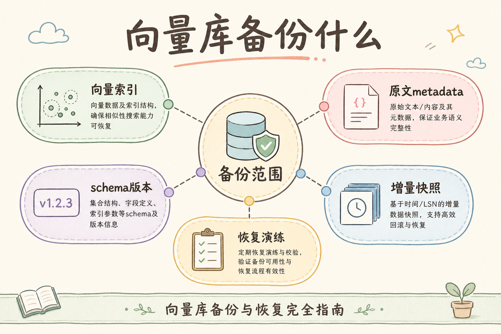
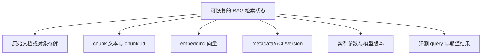
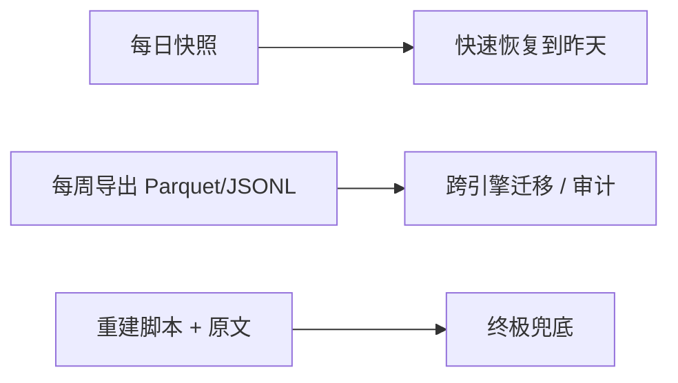
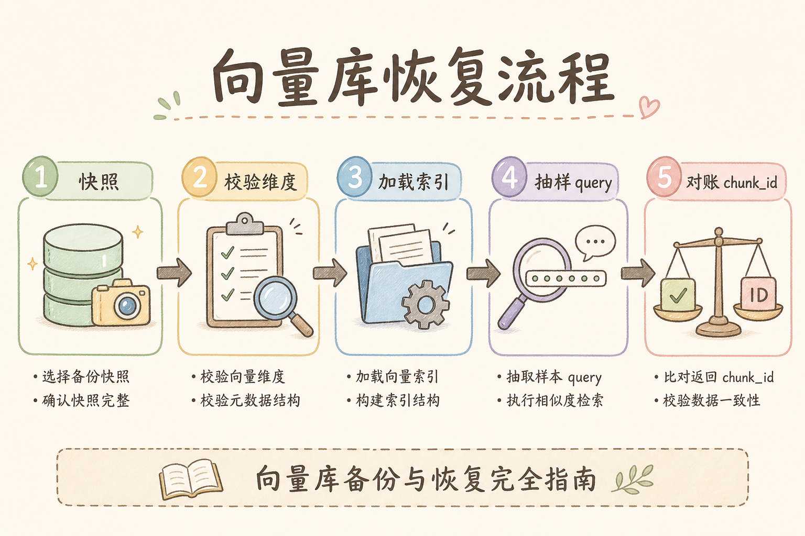
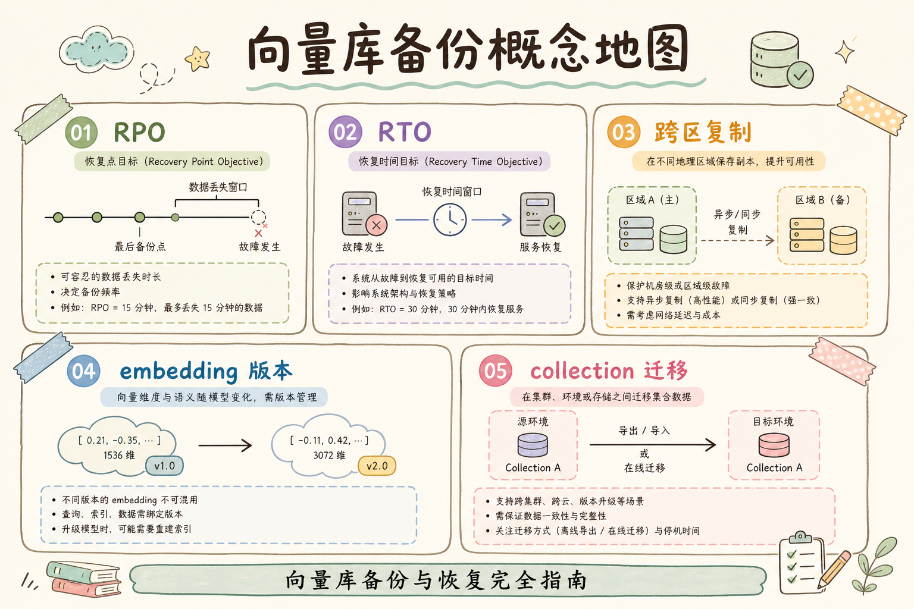

# C4 向量存储（十五）：向量数据库备份与恢复指南

向量库不是临时缓存。生产 RAG 中，向量、chunk 文本、metadata、索引参数和 embedding 模型版本共同决定检索结果。**备份与恢复**的目标是：系统出故障后，能恢复到可解释、可验证的检索状态。

读完本文，你应能说清向量库要备份什么、如何设计恢复演练，以及为什么只备份向量文件不够。

---

## 目录

1. [前言：向量库为什么也要备份](#1-前言向量库为什么也要备份)
2. [本文边界与动手路径](#2-本文边界与动手路径)
3. [到底要备份什么](#3-到底要备份什么)
4. [备份策略：快照、导出、重建](#4-备份策略快照导出重建)
5. [恢复流程怎么设计](#5-恢复流程怎么设计)
6. [一致性：文档、向量、metadata](#6-一致性文档向量metadata)
7. [恢复演练与验收](#7-恢复演练与验收)
8. [成本与保留周期](#8-成本与保留周期)
9. [常见翻车与 FAQ](#9-常见翻车与-faq)
10. [总结与下一步](#10-总结与下一步)

---

## 1. 前言：向量库为什么也要备份

如果向量库丢了，最坏情况不是“重新跑一遍就好”。你可能已经换过 embedding 模型、清洗规则、chunk_id 规则或权限字段，重跑结果未必和线上一致。

备份的价值是保证恢复后的检索行为可追踪，而不是只保住一堆向量数组。

### 1.1 真实事故长什么样

| 事故 | 表面现象 | 根因往往是 |
|------|----------|------------|
| 误删 collection | API 500 或空结果 | 只有向量快照，没有 chunk 文本导出 |
| 区域故障 | 切换备用区后答案全变 | 备用区用新模型重 embed，未对齐 `embedding_model` 版本 |
| 权限 bug 修复后 | 恢复备份又泄露旧数据 | metadata/ACL 与向量来自不同恢复点 |
| “重建很快” | 72 小时仍对不齐线上 | 解析器、分块规则、清洗脚本已升级 |

RAG 的“状态”是 **检索函数**，不是单个数据库文件。恢复要验证的是：同一 query 是否召回同一批可引用 chunk（在权限允许范围内）。

### 1.2 RTO / RPO 白话

- **RPO**（恢复点目标）：最多能接受丢多久的数据。例如 RPO=1 小时，备份至少每小时一次。
- **RTO**（恢复时间目标）：从故障到恢复读写要多久。含拉快照、导入、校验、回归测试。

向量库体积大，RTO 常被低估。没有演练过的团队，纸面“30 分钟恢复”很容易变成半天。

---

## 2. 本文边界与动手路径

本文讲备份恢复方法，不绑定某个具体向量库。不同引擎的快照 API 名字各异，但 **要备份的对象清单** 和 **恢复后如何证明检索没走样** 是通用的。建议把下面四步当成第一次 runbook 草稿，而不是“读完就算”的 checklist。

动手时最容易跳过的其实是步骤 D：很多人把快照脚本写好就以为完工，直到真故障才发现没有固定 query 回归集，恢复后只能肉眼抽几条问答。备份工作的验收标准永远是 **同一 query 在恢复后是否仍命中同一批 chunk_id**，而不是 collection 能 ping 通。

| 步骤 | 你做什么 | 验收 |
|------|----------|------|
| A | 列备份对象 | 不只向量 |
| B | 选策略 | 快照/导出/重建 |
| C | 写恢复流程 | 有步骤 |
| D | 做演练 | 能恢复并通过检索测试 |

### 2.1 建议产出物（可贴进 runbook）

1. **备份清单表**：每项数据谁负责、频率、保留多久、存在哪
2. **恢复 runbook**：从告警到 `恢复读写` 的逐步命令与负责人
3. **固定 query 回归集**：20+ 条，含权限负例
4. **版本清单**：`embedding_model`、`parser_version`、索引类型与参数

### 2.2 本文不绑定

- 某云向量库一键备份按钮截图
- 跨云迁移的 legal/compliance 细节
- 冷归档存储厂商选型

---

## 3. 到底要备份什么

恢复“可检索的 RAG”至少需要下图中的每一类对象。缺一类，就可能出现“服务起来了，但答案不可信”。

这张图的结论是：向量只是恢复对象之一，metadata 和模型版本同样关键。

### 3.1 各类对象说明

| 对象 | 恢复时干什么用 | 只备向量时缺什么 |
|------|----------------|------------------|
| 原始文档 | 审计、重建、法务留存 | 无法证明 chunk 来源 |
| chunk 文本 + chunk_id | LLM 引用、展示给用户 | 只有向量无法生成答案 |
| embedding 向量 | ANN 检索 | — |
| metadata / ACL | 租户隔离、过滤、有效期 | 可能越权或漏召回 |
| 索引参数与模型版本 | 复现召回排序 | 同向量不同索引 recall 不同 |
| 评测 query 与期望 | 自动化验收恢复是否成功 | 只能靠人工抽测 |

### 3.2 chunk_id 规则也要版本化

若 `chunk_id = hash(doc_id + offset)` 的规则在中途改过，恢复旧向量 + 新规则会导致 ID 对不上引用链路。把 **分块脚本版本** 和 **chunk_id 算法** 写进配置仓库，与备份同期打 tag。

---

## 4. 备份策略：快照、导出、重建

选策略时不要问“哪种最省事”，而要问 **故障时你手里有什么、能证明什么**。快照适合把 RTO 压短，但绑死引擎版本；导出适合跨环境迁移和审计抽样；重建是慢但最“干净”的兜底，前提是原文和流水线配置仍可复现。生产里三者往往叠加：日常靠快照扛误删，周导出扛合规抽查，重建脚本扛模型换代。

另一个常见误区是把“能导出向量”当成备份完成。若导出文件里没有 `embedding_model` 和 `chunk_hash`，半年后恢复时你无法判断这批向量是否仍对应当前解析规则——那时只能全库重 embed，纸面 RPO 再好也救不了语义漂移。

| 策略 | 做法 | 优点 | 风险 |
|------|------|------|------|
| 快照 | 备份数据库存储层 | 恢复快 | 依赖引擎格式 |
| 导出 | 导出 ids/documents/vectors/metadatas | 可迁移 | 文件大 |
| 重建 | 从原文重新解析、分块、embedding | 干净 | 慢且可能不一致 |

生产通常组合使用：定期快照 + 可审计导出 + 保留重建脚本和配置。

### 4.1 三种策略怎么组合

| 层级 | 策略 | 典型频率 |
|------|------|----------|
| 热恢复 | 引擎快照 | 小时～日 |
| 可移植 | 结构化导出（含 metadata） | 日～周 |
| 终极兜底 | 原文 + 流水线配置 | 原文实时；脚本随发布版本 |

### 4.2 导出格式注意点

导出时保持 **id、vector、document、metadata** 同一行或可通过 id join。不要向量和文本分两个无版本号的文件，恢复时不知哪次导出配对。

大库导出用分片文件 + manifest（文件列表、条数、checksum、`embedding_model`）。

### 4.3 重建何时是正确选择

- embedding 模型换代，旧向量全部作废
- 快照损坏或跨版本无法挂载
- 合规要求“只从审定过的原文重生数据”

重建前 **冻结** 配置：parser、chunk 大小、清洗规则、模型名，并记录在 runbook。

---

## 5. 恢复流程怎么设计

恢复不是 `docker compose up`。值班第一次真恢复时，压力往往不在“会不会敲导入命令”，而在 **要不要先冻结写入、选哪个备份点、谁签字放量**。下面流程里每一步都应有命令、负责人和预计耗时；缺任何一环，都可能出现“服务绿了、答案却和昨天不一样”的隐性故障。

演练时建议刻意制造一次“选错恢复点”：例如故意导入含已知坏数据的快照，看回归集能否拦住。能拦住，说明验收有效；拦不住，说明你的 gold query 还没覆盖权限和模型版本边界。

恢复流程必须包含校验，不要只看服务能启动。

### 5.1 各步骤要点

| 步骤 | 做什么 | 常见失误 |
|------|--------|----------|
| 冻结写入 | 停 Worker、只读 API 或维护页 | 边恢复边写入，增量对不齐 |
| 选择恢复点 | 按 RPO 选最近干净快照 | 选了含坏数据的备份 |
| 导入 | 挂载快照或 bulk import | 索引未 rebuild，查询超时 |
| 数量校验 | 条数、collection 名、维度 | 恢复到错环境 |
| 检索回归 | 固定 query + 负例 | 跳过，上线后用户发现答案变了 |
| 恢复读写 | 逐步放量 | 一次性全量，故障叠加 |

### 5.2 蓝绿或只读演练

季度演练尽量在 **独立测试环境** 做全量恢复；生产可做 **只读挂载旧快照** 跑回归，不影响当前写入。演练要记录实际 RTO，回写 runbook。

---

## 6. 一致性：文档、向量、metadata

最常见事故是三者不一致：向量来自旧文本，metadata 来自新权限，doc_id 又指向另一个版本。

建议每条 chunk 记录包含：`doc_id`、`doc_version`、`chunk_hash`、`embedding_model`、`parser_version`。恢复后抽样比对这些字段。

### 6.1 一致性检查脚本（逻辑）

恢复完成后，随机抽 N 条：

1. 用 `chunk_id` 取向量库中的 `chunk_text` 与 metadata
2. 从对象存储取 `doc_id` + `doc_version` 原文，按 **当前或备份时的 parser** 重算 chunk
3. 比对 `chunk_hash` 是否一致
4. 检查 `embedding_model` 与备份 manifest 一致

不一致比例超过阈值（如 0.1%）则 **不要** 切生产流量。

### 6.2 权限 metadata 单独强调

`tenant_id`、`visibility`、`expired_at` 必须与 chunk 同源恢复。只恢复向量而 metadata 用手工 SQL 补，极易造成 **恢复后越权召回**——这比短暂不可用更严重。

### 6.3 与主库、搜索库的多副本

若 Sparse 在 OpenSearch、Dense 在向量库，恢复时要 **同一业务时间点** 对齐两边的 doc/chunk 集合，否则 Hybrid 一路有新数据、一路有旧数据，融合结果不可解释。

---

## 7. 恢复演练与验收

没有演练的备份策略只是磁盘上的希望。季度演练的价值不在于“证明我们能恢复”，而在于 **把纸面 RTO 校准成真实分钟数**，并让 RAG 工程、SRE、安全在同一套回归集上对齐“什么叫恢复成功”。演练失败往往比成功更有用：它会在用户发现之前暴露 manifest 缺字段、Hybrid 两路时间点不一致等问题。

至少每季度演练一次：

- 恢复到测试环境。
- 检查记录数量和 collection 名称。
- 用 20 个固定 query 做检索回归。
- 检查越权负例仍然无法召回。
- 记录 RTO 和 RPO。

### 7.1 回归集怎么设计

| 类型 | 条数 | 验收标准 |
|------|------|----------|
| 核心业务的 gold query | 10～15 | top-3 内命中期望 `chunk_id`（或与基线 Jaccard 重叠 ≥ 阈值） |
| 权限负例 | 5+ | 跨租户 query 不得召回对方 chunk |
| 边界：已下线文档 | 2～3 | `is_active=false` 不应出现 |
| 延迟 smoke | 5 | P95 在 SLA 内（索引已 warm） |

结果存档：恢复日期、备份点、通过/失败、失败 diff。下次演练对比，防止“慢慢变坏”。

### 7.2 演练角色分工

| 角色 | 职责 |
|------|------|
| 值班 / SRE | 执行 runbook、记录 RTO |
| RAG 工程 | 跑检索回归、比对 chunk_id |
| 安全 / 合规 | 抽测权限负例 |
| 产品或业务 | 抽测 2～3 条真实问题答案可读性 |

---

## 8. 成本与保留周期

备份会占存储成本，但 **省备份省出来的钱，常在一次误删或区域故障里加倍花掉**——重算 embedding、加班对答案、业务停摆。FinOps 视角应把向量快照看成“避免重复调用 Embedding API 的保险”，而不是纯存储账单里的一行。

保留周期也不是越长越好：旧备份里可能含已删除文档、旧 ACL，恢复时若未重放删除队列，会短暂“复活”用户以为已经抹掉的数据。合规与安全要在保留时长和删除权之间写清楚策略。

| 数据 | 保留建议 |
|------|----------|
| 原始文档 | 长期 |
| chunk + metadata 导出 | 中长期 |
| 向量快照 | 按恢复目标 |
| 临时实验 index | 短期 |

如果 embedding 费用很高，保留向量快照可能比全量重算更便宜。

### 8.1 成本粗算

存储费 ≈ 向量维度 × 4 字节 × 条数 × 副本系数 + 文本与 metadata。1000 万 × 768 维 float32 仅向量约 30GB 量级，快照多版本线性叠加。

**省钱不对的做法**：只保留向量不保留文本，省下的存储会在一次故障里变成数倍 embedding 账单 + 业务损失。

### 8.2 生命周期

| 环境 | 建议 |
|------|------|
| 生产 | 按 RPO 多版本快照 + 周导出 |
| 预发 | 可从生产导出脱敏副本，短期保留 |
| 实验库 | 7～14 天，不与生产备份混目录 |

---

## 9. 常见翻车与 FAQ

### 9.1 只备份原文够吗？

不一定。重建可能因模型、分块和清洗规则变化导致结果不同。原文是兜底，不是唯一恢复路径。

### 9.2 只备份向量够吗？

不够。没有 chunk 文本和 metadata，向量无法生成可引用答案，也无法做权限过滤。

### 9.3 恢复后为什么答案变了？

检索候选变了。检查模型版本、chunk_id、索引参数和 metadata。用同一套固定 query 与故障前基线 diff top-k。

### 9.4 实验库要备份吗？

可短期保留，但不要和生产备份混在一起。恢复时误选实验快照到生产是真实发生过的事故。

### 9.5 多云冗余怎么算 RPO？

以 **最后一份成功校验的备份** 为准。若快照异步复制延迟 1 小时，有效 RPO ≥ 1 小时。

### 9.6 删除请求与备份保留

用户删除文档后，备份里可能仍含旧 chunk。恢复旧备份会“复活”已删数据。需在 runbook 里定义：恢复后是否重放删除队列、或接受临时不一致窗口。

---

## 10. 总结与下一步

向量库备份关注的是“可恢复的检索状态”，包括原文、chunk、向量、metadata、索引参数和评测集。恢复是否成功，要用检索回归和权限负例验证。

把备份理解成保存“检索函数的快照”比保存“一堆向量文件”更准确：同一 query 应召回同一批可引用 chunk（在权限允许范围内），否则业务会认为系统“悄悄换了脑子”。恢复演练不必等真实故障才做——季度在测试环境全量恢复一次，记录实际 RTO，比纸面 SLA 更有说服力。演练失败时优先查模型版本与 metadata 时间点是否对齐，再查向量条数；只看 collection 能连通往往掩盖了一半的一致性问题。

### 10.1 本篇检查清单

- [ ] 备份清单含原文、chunk、向量、metadata、模型版本、评测集
- [ ] 有书面恢复 runbook（含冻结写入与回归）
- [ ] 季度演练记录 RTO，并更新阈值
- [ ] chunk 记录含 `chunk_hash` 与 `embedding_model`
- [ ] 实验库与生产库备份物理隔离

下一步可以读 [91 Dense Retrieval](91.dense-retrieval-tutorial.md)，继续理解向量召回本身的质量边界。
