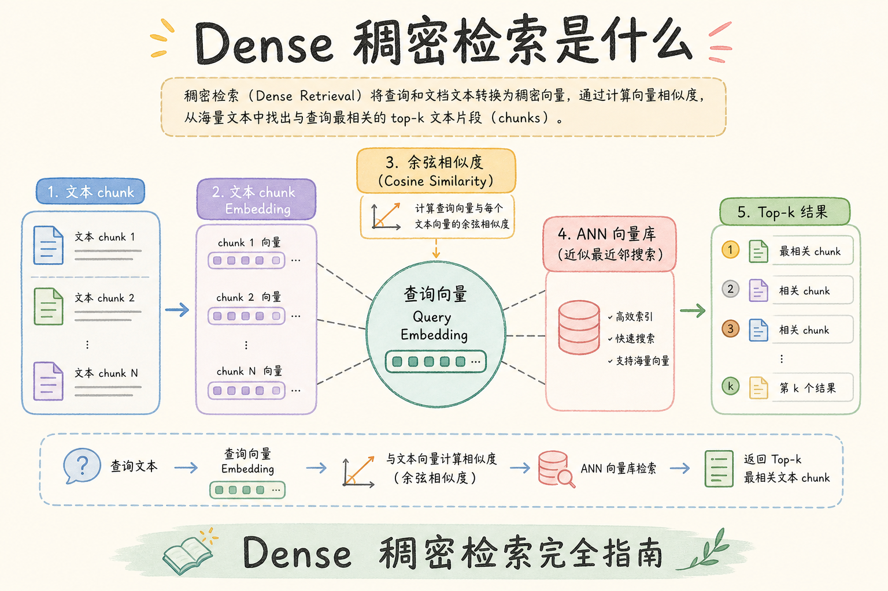
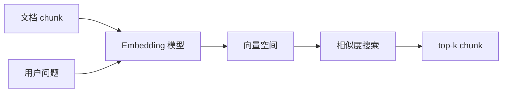
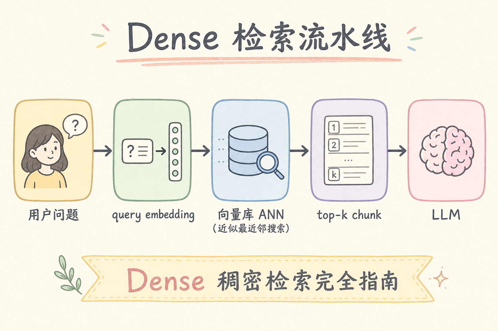
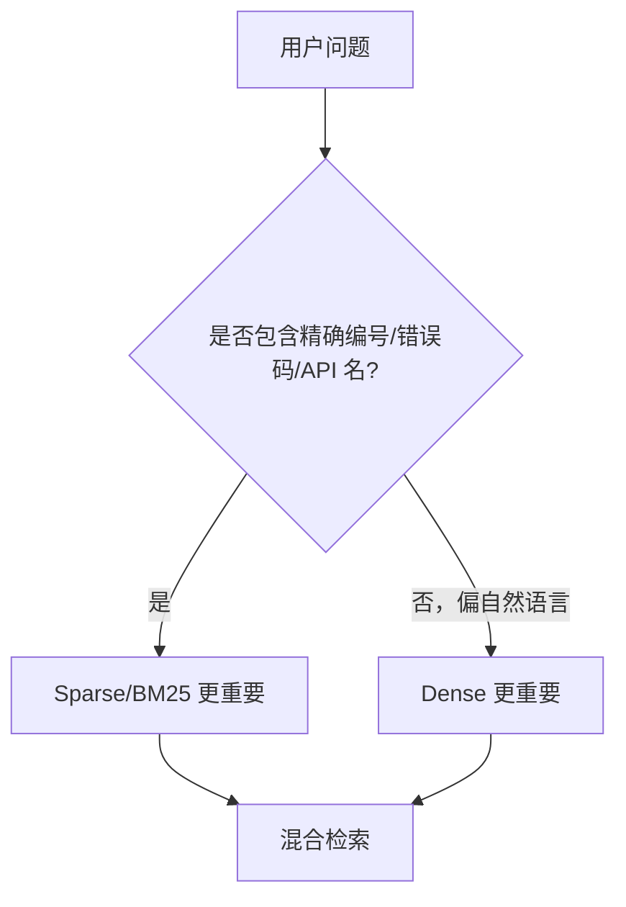
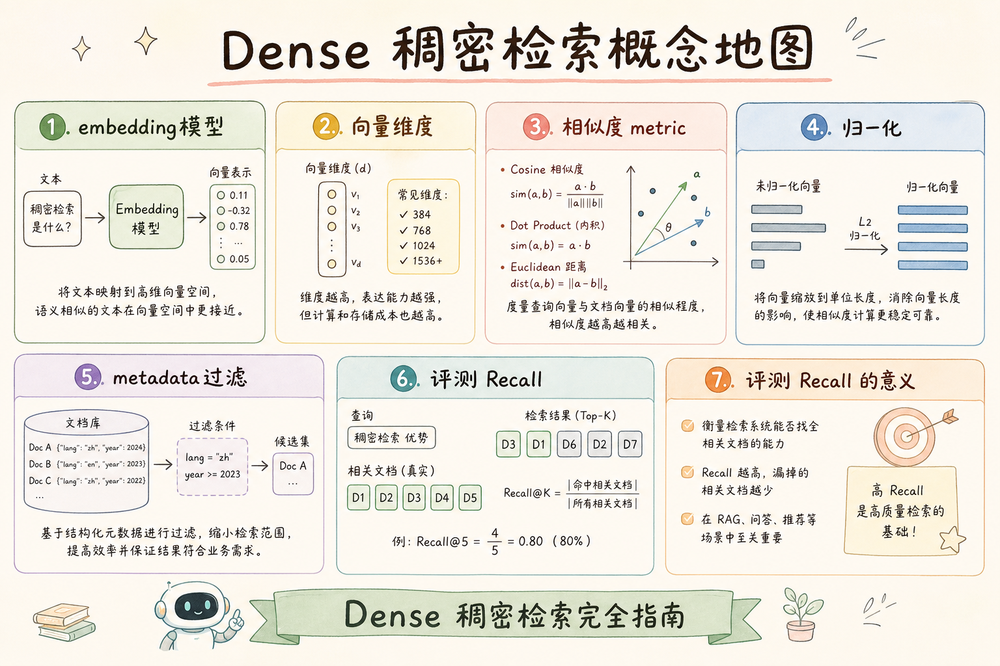

# C5 检索（一）：Dense Retrieval 稠密检索完全指南

**Dense Retrieval**（稠密检索）：把用户问题和文档片段都变成向量，再按向量相似度找最相关的片段。  
通俗说：它不是看两个句子有没有相同关键词，而是看它们表达的意思像不像。

读完本文，你应能回答四个问题：Dense Retrieval 是什么、有什么用、解决了 RAG 里的什么问题、最小怎么接入一个检索流程。

---

## 目录

1. [前言：从关键词到语义相似](#1-前言从关键词到语义相似)
2. [本文边界与动手路径](#2-本文边界与动手路径)
3. [Dense Retrieval 是什么](#3-dense-retrieval-是什么)
4. [它解决什么问题](#4-它解决什么问题)
5. [Embedding 与向量相似度](#5-embedding-与向量相似度)
6. [最小检索流程](#6-最小检索流程)
7. [与 Sparse Retrieval 的分工](#7-与-sparse-retrieval-的分工)
8. [在 RAG 管道中的位置](#8-在-rag-管道中的位置)
9. [评测与常见指标](#9-评测与常见指标)
10. [常见翻车与 FAQ](#10-常见翻车与-faq)
11. [总结与下一步](#11-总结与下一步)

---

## 1. 前言：从关键词到语义相似

关键词检索要求用户问法和文档写法尽量一致。文档写的是“住宿费报销上限”，用户问“出差住酒店最多能报多少”，传统关键词可能命中不稳，因为两边没有完全相同的词。

Dense Retrieval 的价值是补上这类“表达不同但意思接近”的召回。它先用 Embedding 模型把文本变成向量，再在向量空间里找邻居。对初学者来说，可以把向量理解成一张“语义坐标卡”：意思接近的句子，坐标也更接近。

### 1.1 和 Sparse 的分工（先建立预期）

Dense 强在 **改写、同义、口语问法**；弱在 **编号、错误码、API 名** 等字面匹配。读完本篇后应继续 [92 Sparse](92.sparse-retrieval-rag-tutorial.md) 与 [93 Hybrid](93.hybrid-search-tutorial.md)。

### 1.2 企业知识库里的“表达鸿沟”

员工问 HR 系统：“产假休完能否接着请年假？”文档写法可能是“产假与年休假衔接按第 7.2 条执行”。没有 Dense，用户必须猜文档原词；有了语义向量，改写问法仍有机会命中。这正是 Dense 进入 RAG 主链路的原因。

## 2. 本文边界与动手路径

本文讲检索概念和最小流程，不讲 embedding 模型训练，也不比较所有向量数据库。你只需要先理解：哪些文本要变向量、查询时怎么找、结果如何进入 RAG。

| 步骤 | 你做什么 | 验收 |
|------|----------|------|
| A | 文档分块后计算 chunk embedding | 每个 chunk 有一个向量 |
| B | 用户问题计算 query embedding | 问题也变成同维度向量 |
| C | 向量库按相似度搜索 | 返回 top-k chunk |
| D | 加 metadata filter 和 rerank | 结果既相关又不越权 |

最小交付物不是“知道 Dense Retrieval 这个词”，而是能画出“问题向量 -> 向量库 -> top-k chunk -> LLM”的链路。

### 2.1 每步建议花多久

| 步骤 | 建议时间 | 要点 |
|------|----------|------|
| A | 2～4 小时 | 分块策略影响召回，先固定一种 chunk 大小 |
| B | 30 分钟 | query 与 document 用同一 embed 模型 |
| C | 1 小时 | 跑通 search，看 top-k 文本是否合理 |
| D | 2 小时 | 加 filter + 可选 rerank |

### 2.2 本文不展开

- Embedding 模型训练与微调
- 各向量数据库运维与分片
- HNSW 参数调优（见 [86](86.hnsw-index-tutorial.md)、[87](87.ann-recall-latency-tutorial.md)）

## 3. Dense Retrieval 是什么

读下图时，重点看两件事：文档和问题都经过同一个 Embedding 模型；检索器比较的是向量，不是原始字符串。

企业 FAQ、制度、流程类问题里，用户很少按文档原词提问，Dense 的价值正是弥合这种“表达鸿沟”。但也要清醒：向量邻近只表示语义接近，不表示答案正确、不过期、不越权。生产上线前应准备一批改写问法（同义、口语、中英混排），与编号类 query 分开评测——前者看 Dense 是否够强，后者决定是否必须上 Sparse 或 Hybrid。





上图的结论是：稠密检索用同一个向量空间比较问题和文档。只要 embedding 模型能把“酒店报销上限”和“住宿费标准”放得足够近，检索器就有机会召回正确 chunk。

## 4. 它解决什么问题

Dense Retrieval 主要解决三类问题：

| 问题 | 关键词检索的弱点 | Dense Retrieval 的帮助 |
|------|------------------|-------------------------|
| 同义表达 | “住宿费” vs “酒店报销”可能错过 | 语义接近时仍可命中 |
| 自然语言提问 | 用户不会照文档原词提问 | 能处理更口语的问题 |
| 长文本知识库 | 人很难记住准确标题和词 | 按语义找候选片段 |

但它不是万能的。错误码、标准号、函数名、合同编号这类精确符号，Dense Retrieval 可能不如关键词检索稳定。后面第 7 节会讲它和 Sparse Retrieval 的分工。

### 4.1 案例：制度 FAQ vs 技术文档

| 知识类型 | Dense 表现 | 建议 |
|----------|------------|------|
| 人事制度、流程说明 | 通常较好 | Dense 为主 |
| API 文档、错误码表 | 易漏字面 | 加 Sparse 或 Hybrid |
| 中英混排产品名 | 视模型而定 | 用业务 query 评测 |

## 5. Embedding 与向量相似度

**Embedding**（嵌入向量）：把文本转换成一串数字，用这串数字表示文本的大致语义位置。  


通俗说：一句话被模型压缩成坐标，坐标相近就可能意思相近。

| 概念 | 白话解释 | 初学者要注意 |
|------|----------|--------------|
| query vector | 用户问题的向量 | 每次提问实时计算 |
| document vector | chunk 的向量 | 入库时提前计算 |
| cosine similarity | 看两个方向像不像 | 文本 embedding 常用 |
| top-k | 返回最相近的 k 个候选 | 不是越大越好 |

相似度只是“像不像”的打分，不等于“答案一定正确”。RAG 还需要权限过滤、重排、引用和生成阶段共同兜底。

### 5.1 向量规范（易翻车点）

- **同一模型**：入库与查询必须同一 embedding 版本
- **归一化**：cosine 场景常对向量 L2 normalize
- **维度一致**：换模型通常要 **全量重建** 向量与索引
- **距离度量**：与引擎配置一致（inner product / L2 / cosine）

## 6. 最小检索流程

下面示例展示调用形状，不绑定具体向量数据库。你可以把 `embed()` 和 `vector_store.search()` 替换成自己的模型和库。

最小可运行链路里，最容易被跳过的是 **filter** 和 **模型版本一致性**：本地用 A 模型 embed、线上用 B 模型 query，top-k 会像随机抽样。建议第一次跑通就把 `tenant_id`、`is_active` 写进 search 调用，并固定 embedding 模型名写入配置。这样后续换模型、调 chunk、上 rerank 时，评测集才有可比基线。

```python
query = "出差酒店最多报多少？"

query_vec = embed(query)

hits = vector_store.search(
    vector=query_vec,
    top_k=5,
    filter={"tenant_id": "acme", "is_active": True},
)

for hit in hits:
    print(hit.chunk_id, hit.score, hit.text[:80])
```

这段代码的预期行为是：先把问题变成向量，再只在当前租户、有效文档里找相似 chunk。初学者不要把 filter 放到检索后才删，因为那样可能先召回了越权内容，再在应用层补救。

## 7. 与 Sparse Retrieval 的分工

**Sparse Retrieval**（稀疏检索）：通常指 BM25、倒排索引这类关键词检索。  
通俗说：Sparse 更擅长“字面命中”，Dense 更擅长“意思相近”。



上图的结论是：企业 RAG 很少只靠 Dense。制度、代码文档、日志、标准号混在一起时，Dense 和 Sparse 组合通常更稳。

### 7.1 选型决策树（口述版）

1. 问题是否 **必须命中原词**？是 → 需要 Sparse 或 Hybrid  
2. 是否只有自然语言 FAQ？是 → 可先 Dense-only + 评测  
3. Dense 评测已漏编号类 query？是 → 上 Hybrid，不必犹豫  

## 8. 在 RAG 管道中的位置

Dense Retrieval 位于“用户问题进来之后、LLM 生成之前”。它负责从知识库里找候选证据，不负责最终组织答案。


上图要注意：稠密检索只是候选召回。候选是否足够准确，还要看后面的 rerank、上下文裁剪和引用校验。

### 8.1 端到端延迟直觉

一次问答里，embedding 计算、向量 search、filter、rerank、LLM 生成 **串行叠加**。Dense 只负责其中 search 一段；若 P95 超标，要用 trace 拆开看，避免误把 LLM 慢算在检索头上。

### 8.2 chunk 质量对 Dense 的影响

chunk 切得过大：语义模糊，相似度虚高。切得过碎：上下文不足，LLM 难答全。Dense 召回上限受 **分块策略** 约束，换 chunk 规则后应重跑 hit@k。

## 9. 评测与常见指标

最小评测不要从线上用户投诉开始，而是先准备一小组 query 和期望命中的 doc_id / chunk_id。

| 指标 | 看什么 | 白话解释 |
|------|--------|----------|
| recall@k | top-k 是否包含正确证据 | 正确答案有没有被找进来 |
| MRR | 第一个正确结果排多靠前 | 用户和 reranker 要翻多远 |
| nDCG | 排序整体质量 | 多个相关结果的顺序是否合理 |
| bad case 回归 | 修过的问题是否复发 | 每次改模型/参数都重跑 |

最小评测表示例：

| 问题 | 期望 doc_id | top-5 是否命中 | 备注 |
|------|-------------|----------------|------|
| 出差住宿上限 | travel-2025 | 是 | 语义命中 |
| GB/T 12345 | standard-doc | 否 | 需要 BM25 补召回 |

### 9.1 最小评测流程

1. 准备 30～100 条业务 query + 期望 `chunk_id`
2. 跑 Dense top-10，算 hit@10 / MRR
3. 改 embedding、chunk、top_k 后 **回归同一套 query**
4. 区分“没进候选”与“进了但没被 LLM 引用”

### 9.2 和 ANN 评测的关系

向量库用 HNSW 时，业务 hit@k 低要先查 [87 ANN recall](87.ann-recall-latency-tutorial.md)——有时是索引漏了近邻，不是 embedding 本身差。

## 10. 常见翻车与 FAQ

**Dense Retrieval 能替代关键词搜索吗？**  
不能。精确词、编号、错误码、函数名仍需要 Sparse Retrieval 或混合检索。

**为什么看起来语义相关但答案错？**  
可能 chunk 太宽、缺少权限过滤、top_k 太小，或者召回结果没有经过 rerank。相似不等于正确。

**top_k 越大越好吗？**  
不一定。太大会把噪声带进 prompt，增加成本和幻觉风险。通常要配合 rerank 和 context budget。

**换 embedding 模型影响大吗？**  
大。不同模型的向量空间不同，换模型通常意味着重建向量、重跑评测、重新检查阈值。

### 10.1 排错速查

| 现象 | 可能原因 |
|------|----------|
| 全库结果像随机 | 模型不一致、未 normalize、距离度量错 |
| 语义对但权限错 | 漏 metadata filter |
| 以前准、突然变差 | 索引未重建、ANN 参数被改小 |

### 10.2 换 embedding 前的检查

- [ ] 新模型在子集上 hit@10 不低于旧模型
- [ ] 计划全量 re-embed 与索引重建窗口
- [ ] 通知下游阈值、rerank 需重标定

## 11. 总结与下一步

Dense Retrieval 用向量表示语义相似，是 RAG 召回的主力之一。它解决的是“用户问法和文档写法不同”的问题，但必须和 metadata filter、Sparse Retrieval、rerank 和评测配合。



### 11.1 本篇检查清单

- [ ] query / doc 同一 embedding 模型
- [ ] 检索带 tenant / acl filter
- [ ] 有 hit@k 或 MRR 小评测集
- [ ] 知道何时要加 Sparse / Hybrid
- [ ] 换模型计划含重建索引

生产环境建议为 embedding 模型、索引类型、normalize 策略写 **一页运行手册**，新人 onboarding 时先读再改检索代码，减少“本地能跑、线上全错”的情况。

下一步读 [92 Sparse Retrieval](92.sparse-retrieval-rag-tutorial.md)，理解关键词检索如何补足稠密检索的短板。
