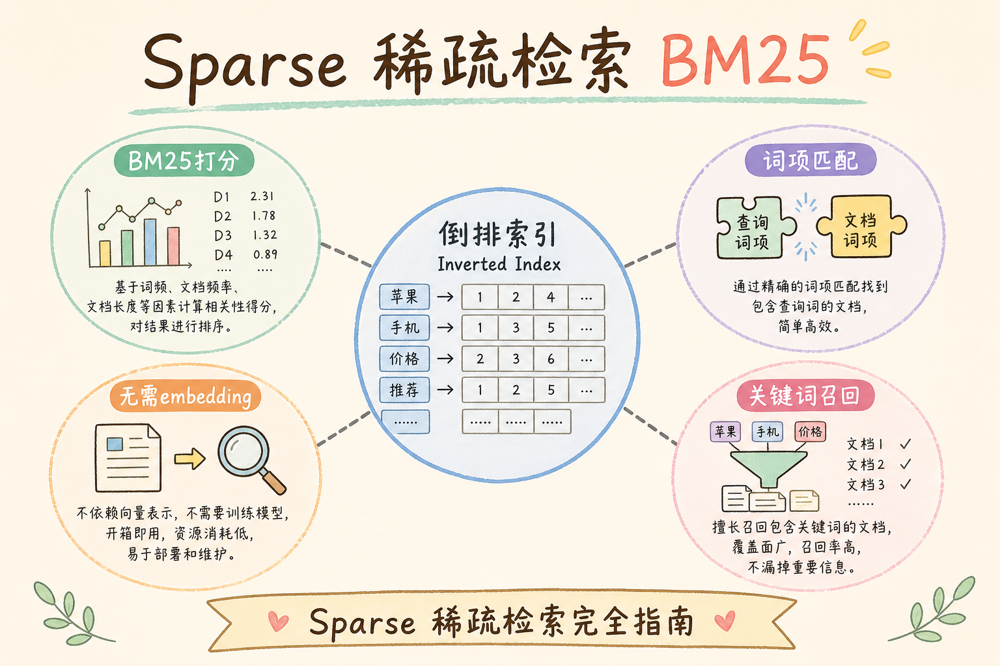
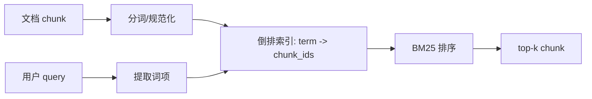
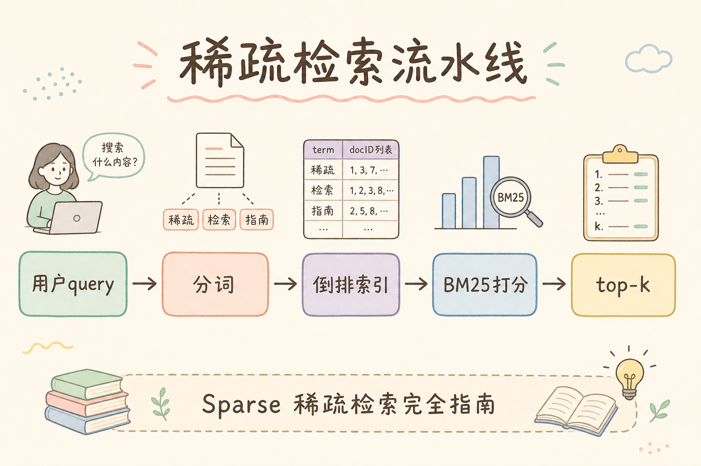
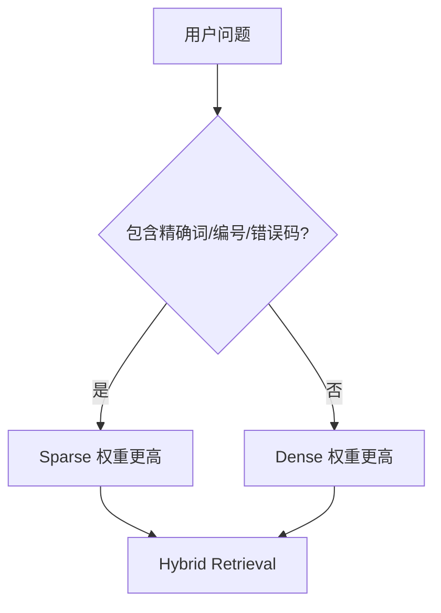
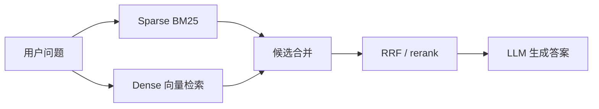
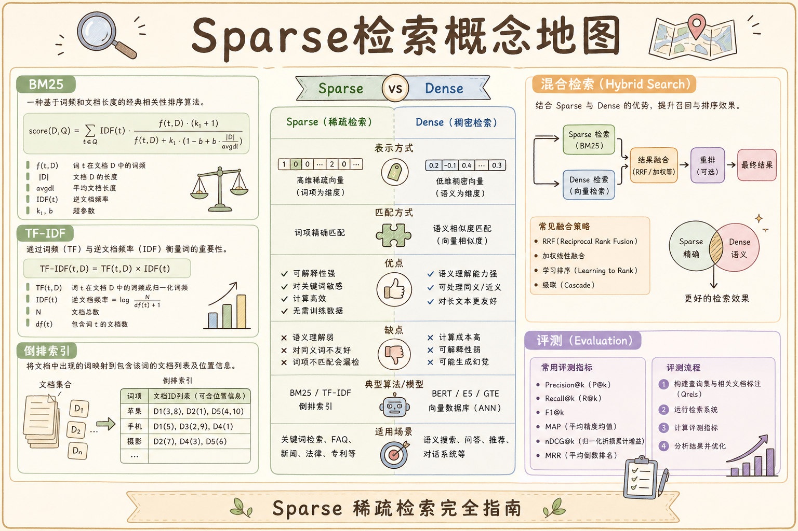

# C5 检索（二）：Sparse Retrieval 稀疏检索完全指南

**Sparse Retrieval**（稀疏检索）通常指 BM25 这类关键词检索。它不像 Dense Retrieval 那样把文本变成稠密向量，而是看词项、词频、倒排索引和字段匹配。通俗说：Dense 更像“理解意思”，Sparse 更像“准确找字”。

读完本文，你应能解释稀疏检索解决什么问题、为什么 RAG 不能只靠向量、如何写最小 BM25 查询，以及它如何与 Dense 组合。

---

## 目录

1. [前言：为什么关键词检索仍然重要](#1-前言为什么关键词检索仍然重要)
2. [本文边界与动手路径](#2-本文边界与动手路径)
3. [Sparse Retrieval 是什么](#3-sparse-retrieval-是什么)
4. [BM25 的白话直觉](#4-bm25-的白话直觉)
5. [最小查询示例](#5-最小查询示例)
6. [与 Dense Retrieval 的分工](#6-与-dense-retrieval-的分工)
7. [在 RAG 管道中的位置](#7-在-rag-管道中的位置)
8. [调参与评测](#8-调参与评测)
9. [常见翻车与 FAQ](#9-常见翻车与-faq)
10. [总结与下一步](#10-总结与下一步)

---

## 1. 前言：为什么关键词检索仍然重要

很多初学者一学 RAG 就想全靠 embedding。问题是：企业文档里有大量编号、产品名、错误码、制度条款、API 名称。比如用户搜 `GB/T 12345`、`S3 AccessDenied`、`第 7.2 条`，这些并不一定靠语义向量稳定命中。

稀疏检索的价值是把“字面必须出现”的信息找回来，尤其适合精确词和低频专有名词。

### 1.1 三个典型“只靠 Dense 会漏”的场景

| 场景 | 用户问法 | 文档写法 | Dense 风险 |
|------|----------|----------|--------------|
| 标准编号 | `GB/T 12345 适用范围` | 正文写标准全称，编号在页眉 | 向量相近但编号未命中 |
| 云错误码 | `S3 AccessDenied 怎么办` | AWS 文档用英文错误名 | 同义词再多，也不如字面稳 |
| 制度条款 | `第 7.2 条 年假` | 条款号与正文在同段 | 换说法问“年假规则”时 Dense 强，问条款号时 Sparse 强 |

这不是说 Dense 没用——[91 Dense Retrieval](91.dense-retrieval-tutorial.md) 负责“意思接近”的召回。Sparse 负责“字必须对”的召回。企业知识库里两类问题都常见，所以生产 RAG 往往两路都要。

### 1.2 先建立直觉：倒排索引在干什么

**倒排索引**（Inverted Index）：从“词”指向“包含该词的文档列表”的索引结构。  
通俗说：字典的反向查法——不是从文档找词，而是从词找文档。

你不需要先会搭 Elasticsearch 集群，只要能在白板上画出：`term "AccessDenied" -> [chunk_12, chunk_45]`，就理解了 Sparse 检索的核心数据结构。

---

## 2. 本文边界与动手路径

本文讲 BM25 和倒排索引直觉，不讲搜索引擎集群运维。四步路径刻意把 **filter 与 match 写在一起** 放在步骤 C：Sparse 再准，若租户隔离在应用层事后过滤，日志和缓存里仍可能短暂接触越权 chunk。自学时宁可少调一个 BM25 参数，也要先跑通带 `tenant_id` filter 的查询。

步骤 D 要求与 Dense 对照，是因为很多团队评测只跑“语义题”，上线后却被编号类 query 打穿。用同一批 gold query 分别看 Sparse-only、Dense-only、Hybrid 的 recall 曲线，比背公式更能建立工程直觉。

| 步骤 | 你做什么 | 验收 |
|------|----------|------|
| A | 理解倒排索引 | 能解释“词到文档”的映射 |
| B | 写 BM25 查询 | 精确词能命中 |
| C | 加 filter | 租户和权限生效 |
| D | 与 Dense 对比 | 知道何时用混合检索 |

### 2.1 每步建议花多久（自学参考）

| 步骤 | 建议时间 | 不要跳过的原因 |
|------|----------|----------------|
| A | 30～45 分钟 | 不懂倒排，后面 `match` 和 `filter` 容易混 |
| B | 1～2 小时 | 用 OpenSearch/ES 或本地 BM25 库跑通一条查询 |
| C | 30 分钟 | 租户隔离是生产底线，和检索算法无关但必须一起做 |
| D | 1 小时 | 对照 [93 Hybrid Search](93.hybrid-search-tutorial.md) 画双路架构 |

### 2.2 本文不展开的内容

- 搜索引擎分片、副本、集群扩容（见向量库与搜索专题其他篇）
- 中文分词器训练与词典维护（知道“要测分词效果”即可）
- RRF 公式推导（见 [94 RRF](94.rrf-fusion-tutorial.md)）

---

## 3. Sparse Retrieval 是什么

稀疏检索把文本拆成词项，再建立“词项 -> 文档列表”的倒排索引。查询时，系统看问题里的词在哪些文档中出现，并按相关度排序。

读下图时，从左到右跟一遍数据流：chunk 先分词进索引，用户问题也提取词项，最后在倒排表上算 BM25 分数并取 top-k。




这张图的结论是：Sparse 不是理解整句话，而是高效利用词项匹配。

### 3.1 “稀疏”两个字是什么意思

向量检索里，每个维度都有值，所以叫“稠密”（Dense）。BM25 只在**出现过的词项**上打分，未出现的词项不参与，向量表示里大量位置为 0，因此传统上叫“稀疏”。

初学者不必纠结数学定义，记住对比即可：

| | Sparse（BM25） | Dense（Embedding） |
|---|----------------|---------------------|
| 表示 | 词项权重 | 固定维度浮点向量 |
| 强项 | 精确词、编号、错误码 | 同义改写、口语问法 |
| 索引 | 倒排表 | 向量 ANN 索引 |

### 3.2 入库侧要准备什么

Sparse 路与 Dense 路可以共用同一份 chunk 文本，但索引不同：

1. **分词/规范化**：大小写、全半角、英文缩写是否保留（`AccessDenied` 不要被打碎）
2. **字段设计**：`chunk_text` 检索、`title` 加权、`doc_id` 只 filter 不参与打分
3. **metadata**：`tenant_id`、`is_active` 等走 filter，不要混进 BM25 文本字段

---

## 4. BM25 的白话直觉

BM25 不是“数词出现几次”那么简单。它在问：这个词对 **区分文档** 有没有帮助、这篇 chunk 是不是因为太长而虚胖、以及词频是否已经饱和（再出现十次也不该无限加分）。企业文档里错误码、标准号往往 IDF 极高——全库只有几篇提到 `AccessDenied` 时，一旦出现就应大幅拉升排名。

理解三因素时，建议拿自己知识库里最冷僻的一个专有名词做实验：把 query 改成只含该词，看 top-3 是否稳定。若长文 chunk 总压过短而精准的段落，优先怀疑 chunk 粒度和字段 boost，而不是急着调 `k1`。

BM25 会同时考虑三件事：

| 因素 | 白话解释 |
|------|----------|
| 词频 | query 词在 chunk 中出现越多，可能越相关 |
| 逆文档频率 | 很少见的词更重要，例如错误码 |
| 文档长度归一 | 长文档不能因为词多就天然占便宜 |

例如 `AccessDenied` 这种词很少见，一旦出现在 chunk 里，BM25 会给较高权重。

### 4.1 用一个小例子串起三因素

假设知识库里有三份 chunk：

| chunk | 内容摘要 |
|-------|----------|
| A | 短：仅一句 `S3 AccessDenied` 说明 |
| B | 长：五千字运维手册，其中出现一次 `AccessDenied` |
| C | 未出现 `AccessDenied`，只讲“上传失败请检查权限” |

用户 query：`S3 AccessDenied 上传失败`

- **词频**：A 里错误码密度高，B 里被长文稀释——长度归一会拉平 B 的优势
- **逆文档频率**：`AccessDenied` 若全库只有 A、B 出现，比常见词“上传”更有区分度
- **长度归一**：避免 B 仅因篇幅长而压过 A

最终排序因分词和参数而异，但直觉是：**稀有词 + 合理长度** 的 chunk 应靠前。

### 4.2 和 TF-IDF 的关系（知道即可）

BM25 可看作 TF-IDF 的改进版，多了文档长度归一和词频饱和（词出现太多次收益递减）。RAG 工程里你调的是引擎参数（`k1`、`b`），不必手推公式；详见 [19 BM25](19.bm25-sparse-retrieval-tutorial.md) 与 [18 倒排索引](20.inverted-index-tutorial.md)。

---

## 5. 最小查询示例

以 Elasticsearch / OpenSearch 风格为例。下面请求演示：**关键词召回** 与 **业务 filter** 写在同一次查询里。



```json
POST rag_chunks/_search
{
  "query": {
    "bool": {
      "must": {
        "match": { "chunk_text": "S3 AccessDenied 上传失败" }
      },
      "filter": [
        { "term": { "tenant_id": "acme" } },
        { "term": { "is_active": true } }
      ]
    }
  },
  "size": 5
}
```

这里的 `match` 负责关键词召回，`filter` 负责业务边界。不要把权限过滤放到结果返回之后。

### 5.1 逐字段读一遍

| 字段 | 作用 | 初学者易错点 |
|------|------|--------------|
| `bool.must.match` | 对 `chunk_text` 做 BM25 打分 | 写成 `term` 会导致不分词，中文长句命中率差 |
| `filter.term.tenant_id` | 只查租户 `acme` | 放在应用层过滤会先召回别租户再丢弃，有泄露风险 |
| `filter.term.is_active` | 排除已下线文档 | 与向量库 metadata 字段名要对齐 |
| `size` | 返回 5 条 | 这是召回数，后面还可 rerank 缩小 |

### 5.2 先错后对：filter 写在哪

```json
// ❌ 先全库 BM25，再在 Python 里 if hit.tenant_id == "acme"
// 问题：日志、缓存、侧信道都可能碰到越权 chunk

// ✅ 在查询里 filter，引擎侧不打分、不返回不符合条件的文档
"filter": [{ "term": { "tenant_id": "acme" } }]
```

### 5.3 没有 OpenSearch 时怎么练

- 本地：Python `rank_bm25` 库 + 内存倒排，先验证“精确词能排第一”
- 云上：用与生产一致的引擎，避免“本地 BM25 行为 ≠ 线上”

验收标准：固定 query `GB/T 12345`，能稳定返回含该编号的 chunk_id（在测试集上 recall@5 达标即可）。

---

## 6. 与 Dense Retrieval 的分工



Dense 擅长“表达不同但意思接近”；Sparse 擅长“字面必须命中”。生产 RAG 往往两者都要。

### 6.1 怎么判断该加重哪一路

| 信号 | 更依赖 Sparse | 更依赖 Dense |
|------|---------------|--------------|
| 问题含错误码、SKU、条款号 | ✓ | |
| 问题是大白话、无专有名词 | | ✓ |
| 评测集上 Dense 漏编号类 query | ✓ | |
| 评测集上 Sparse 漏同义改写 | | ✓ |

不必手工 if-else 所有问题。常见做法是 **双路召回 + RRF**（[94](94.rrf-fusion-tutorial.md)）或 **加权融合**（[93](93.hybrid-search-tutorial.md)），再用 rerank 统一排序。

### 6.2 与 [91 Dense Retrieval](91.dense-retrieval-tutorial.md) 对照记忆

| 维度 | Dense | Sparse |
|------|-------|--------|
| 索引对象 | 向量 | 倒排 + BM25 |
| 典型失败 | 编号、冷僻缩写 | 同义改写、口语 |
| 生产默认 | 很多团队只有 Dense | 企业库建议补上 Sparse |

---

## 7. 在 RAG 管道中的位置

Sparse 在整条 RAG 链路里几乎从不“单独出场”。它位于 **召回层**：把字面相关的 chunk 推进候选池，后面还有融合、rerank 和生成。若在这一层就指望 BM25 给出最终答案，等于让字典检索器承担 LLM 的推理工作——编号类问题可能碰巧答对，同义改写类却会系统性失败。

画清位置也有助于排障：用户说“搜不到错误码”时，先查 Sparse 路是否启用、分词是否切碎英文 token，再查 Dense 和 rerank；反之“口语问法总漏”时，不要一味加 BM25 boost，而应加强 Dense 或 Hybrid。



Sparse 通常不是最终答案来源，而是候选召回的一路。

### 7.1 各阶段职责（避免一步干多件事）

| 阶段 | 输入 | 输出 | 不负责 |
|------|------|------|--------|
| Sparse 召回 | query 文本 | top-k₁ chunk + BM25 分 | 生成答案、引用格式 |
| Dense 召回 | query 向量 | top-k₂ chunk + 相似度 | 同左 |
| 融合 / RRF | 两路列表 | 去重后的候选集 | 权限（应在召回前 filter） |
| Rerank | 候选 + query | 重排后 top-n | 替 LLM 做推理 |
| LLM | Prompt + context | 自然语言答案 | 检索 |

### 7.2 延迟与成本粗算

Sparse 单次查询通常比大模型便宜，但 **双路召回 = 两次检索 + 可能一次 rerank**。若 P95 超标，优先查：索引是否过大、`top_k` 是否过高、rerank 是否对全库候选而非合并后的几百条。

---

## 8. 调参与评测

Sparse 的评测重心与 Dense 不同：**精确词类 query 必须单独成集**，不能混在大白话问题里算一个总 recall。很多团队 Dense 评测全绿，上线后却被财务、运维的“条款号 + 错误码”类问题击穿，根因往往是评测集根本没覆盖 Sparse 的强项。

调参时坚持“单变量”：先锁分词与 mapping，只动 `top_k`；再开第二路 Dense 和 RRF。一次同时改 analyzer、chunk 大小和融合权重，出了问题无法归因，值班只能回滚整包发布。

最小评测应包含精确词问题：

| 问题 | 期望能力 |
|------|----------|
| `GB/T 12345` | 精确编号命中 |
| `AccessDenied` | 错误码命中 |
| `产假能否连休年假` | 可能需要 Dense + Sparse |

观察 recall@k、命中 doc_id 和是否被 rerank 保留。不要只看搜索引擎返回分数。

### 8.1 建议的迷你评测集（10～30 条即可开工）

| 类型 | 条数建议 | 标注什么 |
|------|----------|----------|
| 精确编号/错误码 | 5～10 | 标准答案 `chunk_id` 或 `doc_id` |
| 同义改写 | 5～10 | 与 Dense 对比谁召回 |
| 负例（无答案） | 3～5 | 期望拒答或低分，防止乱命中 |

### 8.2 调参顺序（不要一次拧所有旋钮）

1. 固定分词与字段 mapping，只调 `top_k`
2. 单独看 Sparse 路的 recall@5，不加 Dense
3. 加上 Dense 与 RRF，看融合后 recall 是否提升且延迟可接受
4. 再调 rerank 的 `top_n`

BM25 的 `k1`、`b` 一般由引擎默认即可；中文场景更常出问题的是 **分词** 和 **chunk 粒度**，见 [57 固定长度分块](57.fixed-size-chunking-tutorial.md) 与 [62 结构感知分块](62.structure-aware-chunking-tutorial.md)。

### 8.3 分数能不能直接比

BM25 分数与 cosine 相似度 **尺度不同**，不能直接相加选答案。融合用 RRF 或交叉编码 rerank，见 [94](94.rrf-fusion-tutorial.md)、[95 Cross-Encoder](95.cross-encoder-rerank-tutorial.md)。

---

## 9. 常见翻车与 FAQ

### 9.1 Sparse 能替代 Dense 吗？

不能。用户换一种说法时，Sparse 可能漏召回。例如文档写“住宿费标准”，用户问“酒店报销上限”，没有共同词项时 BM25 无能为力，这正是 Dense 的强项。生产上两路互补，而不是二选一。

### 9.2 为什么中文查询效果差？

可能分词器不合适。中文制度、产品名和英文缩写需要单独测试。常见问题：

- 英文错误码 `AccessDenied` 被切成无意义片段
- 标准号 `GB/T` 与数字被拆开，匹配不到完整编号
- 未做繁简、全角半角统一

**处理**：用与业务匹配的 analyzer，在评测集上对比分词前后的 recall@5；必要时对错误码、SKU 建 **keyword 子字段**（不分词，整词匹配）。

### 9.3 为什么命中很多无关长文档？

字段设计、长度归一和 chunk 粒度可能有问题。长 chunk 若重复出现 query 中的常见词（如“上传”“失败”），可能挤掉真正含错误码的短 chunk。可尝试：缩短 chunk、提高稀有词字段权重、或对 title/error_code 单独建字段 boost。

### 9.4 BM25 分数能和向量分数直接相加吗？

不建议。两者尺度不同，推荐用 RRF 或 rerank。把两路分数硬加，容易出现某一路 dominate，融合效果不可解释。

### 9.5 只有向量库，没有 Elasticsearch，怎么做 Sparse？

可选路径：向量库若支持全文检索（如部分云产品 hybrid）、外挂 OpenSearch 只存文本与 metadata、或用轻量 BM25 库在内存/Redis 维护倒排。架构见 [93 Hybrid Search](93.hybrid-search-tutorial.md)。

### 9.6 filter 和 must 有什么区别？

`must` 参与打分；`filter` 只过滤，不影响 BM25 分数（在 ES/OpenSearch 语义下）。租户、权限、是否上线应放 **filter**，避免“分数高但不该看”的 chunk 进入候选。

---

## 10. 总结与下一步

稀疏检索解决的是精确词、编号、术语和错误码召回问题。它不是过时技术，而是企业 RAG 稳定性的关键补位。

回顾整条链路：Sparse 负责把“字必须对”的证据捞进候选，权限 filter 在查询里与 `match` 同级生效，融合阶段不与 Dense 裸比分。若评测集里大量 query 含错误码、标准号、SKU，而团队仍 Dense-only，漏召回往往不是模型差，而是架构缺一路。下一步接 Hybrid 时，两路应共用同一份 chunk 文本与 metadata 字段名，减少“BM25 有、向量库没有”的双写漂移。



### 10.1 本篇检查清单

- [ ] 能画倒排索引：`term -> chunk_ids`
- [ ] 能解释 BM25 三因素：词频、IDF、长度归一
- [ ] 能在查询里同时写 `match` 与 `tenant_id` filter
- [ ] 能说明为何不能直接把 BM25 分与向量分相加
- [ ] 评测集里至少有 5 条“精确词”类 query

下一步读 [93 Hybrid Search](93.hybrid-search-tutorial.md)，把 Sparse 与 Dense 合成一条更稳的召回链路。
