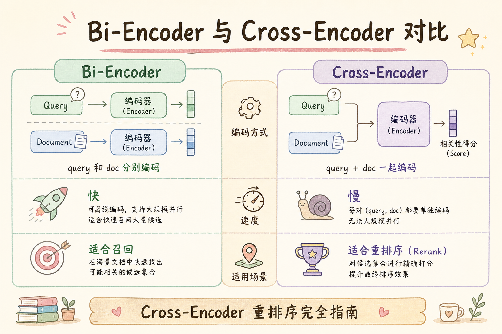
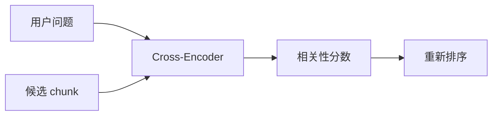
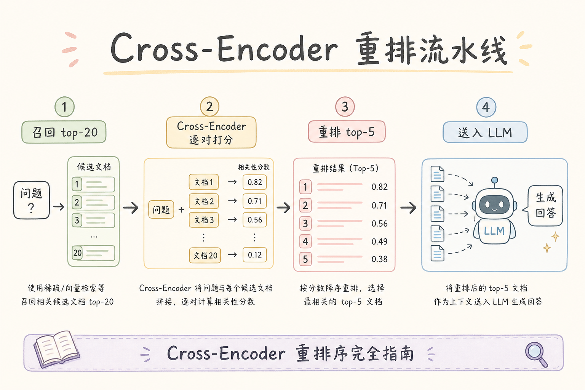
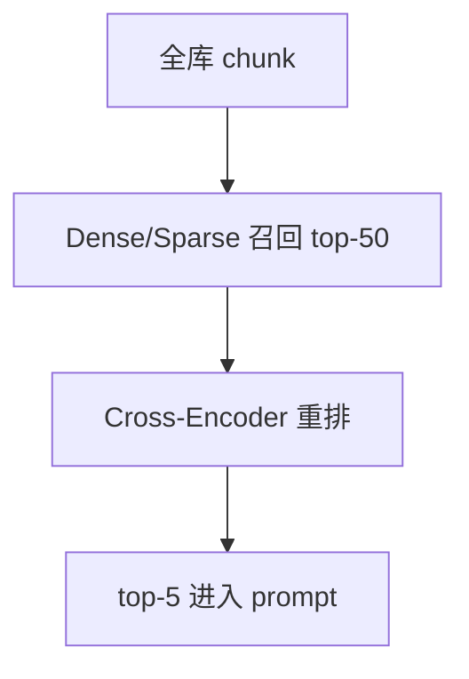
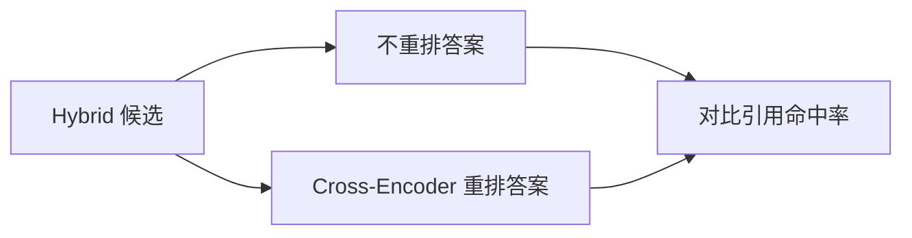
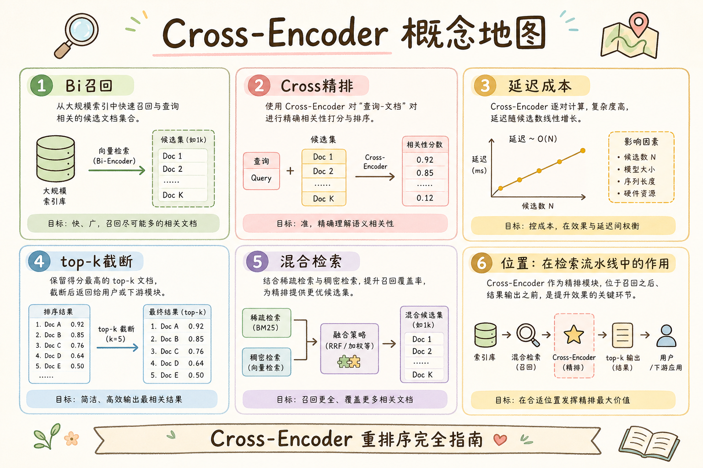

# C5 检索（五）：Cross-Encoder 重排完全指南

**Cross-Encoder Rerank**（交叉编码器重排）把用户问题和候选 chunk 放在一起输入模型，让模型直接判断“这段证据是否回答这个问题”。它通常比单纯向量相似度更准，但更慢。  
通俗说：召回先把可能相关的资料搬上桌，Cross-Encoder 再逐份判断哪几份最有用。

读完本文，你应能解释 Cross-Encoder 做什么、解决什么问题、为什么放在召回之后、如何写最小重排流程，以及它和 RRF 的分工。

---

## 目录

1. [前言：召回不等于最终排序](#1-前言召回不等于最终排序)
2. [本文边界与动手路径](#2-本文边界与动手路径)
3. [Cross-Encoder 是什么](#3-cross-encoder-是什么)
4. [它解决什么问题](#4-它解决什么问题)
5. [为什么要先召回再重排](#5-为什么要先召回再重排)
6. [最小重排流程](#6-最小重排流程)
7. [与 RRF、Dense、Sparse 的分工](#7-与-rrfdensesparse-的分工)
8. [性能与成本控制](#8-性能与成本控制)
9. [评测方法](#9-评测方法)
10. [常见翻车与 FAQ](#10-常见翻车与-faq)
11. [总结与下一步](#11-总结与下一步)

---

## 1. 前言：召回不等于最终排序

Dense、Sparse、Hybrid 能把可能相关的 chunk 找出来，但候选里仍会混入噪声。Cross-Encoder 的作用是对“问题 + 候选 chunk”做更细的相关性判断，把真正能回答问题的证据排到前面。

初学者要先区分两个动作：召回是“别漏掉可能有用的材料”，重排是“从候选里挑更能回答问题的材料”。这两个动作目标不同，不能互相替代。

### 1.1 Bi-Encoder vs Cross-Encoder（一句话）

**Bi-Encoder**（双塔）：query 和 doc 各编码一次，再比向量——快，适合全库召回。  
**Cross-Encoder**：query 和 doc **拼在一起** 进模型——慢，适合少量候选精排。RAG 典型链路是前者召回、后者重排。

## 2. 本文边界与动手路径

本文讲重排入门，不讲模型训练和 GPU 服务优化。动手路径如下：

| 步骤 | 你做什么 | 验收 |
|------|----------|------|
| A | 先召回 top-20 或 top-50 | 有候选 |
| B | 拼 query + chunk | 构造输入对 |
| C | Cross-Encoder 打分 | 得到相关性分数 |
| D | 取 top-5 | 进入 prompt |

最小交付物是：你能把 rerank 接在 Hybrid Search 之后，并保留原始候选 ID、原始排名和重排分数。

上线第一周，值班同学最常问的不是“模型选哪个”，而是“重排后引用为什么错位”。因此动手时就要把 trace 里每一步的候选列表落盘：Hybrid 出了谁、RRF 合并后顺序如何、Cross-Encoder 改了哪几位。没有这条证据链，线上 bad case 只能回到“感觉向量没搜到”，而实际可能是 pairs 顺序与数组下标不一致。建议先在 staging 用二十条真实业务 query 跑通 A～D，再谈 GPU 批大小优化。

### 2.1 每步建议花多久

| 步骤 | 建议时间 | 要点 |
|------|----------|------|
| A | 已有 Hybrid/RRF | 候选 20～50 条 |
| B～D | 2～4 小时 | 本地或 API rerank 跑通 |
| 评测 | 半天 | 对比“不重排 vs 重排”引用率 |

### 2.2 本文不展开

- Cross-Encoder 微调与训练数据构造
- GPU 批处理、TensorRT 等推理优化
- 多模态 rerank

## 3. Cross-Encoder 是什么

读下图时，注意 query 和 chunk 会一起进入模型。模型不是先分别编码两个向量再比较，而是直接看文本对。





与 embedding 双塔不同，Cross-Encoder 会同时看 query 和 chunk，因此判断更细；但每个候选都要跑一次模型，所以成本更高。

从排障视角看，Cross-Encoder 输出的分数是“问题与证据是否匹配”的相对信号，不是事实置信度。生产环境里应把它当作排序键：同一 query 下分数高的 chunk 更可能支撑答案，但跨 query、跨模型版本不宜横向比较。若你在日志里看到 rerank 分数普遍挤在 0.4～0.6 窄区间，先检查 chunk 截断是否与评测一致，再怀疑模型域不匹配，而不是急着调阈值。

## 4. 它解决什么问题

Cross-Encoder 主要解决“相似但不回答”的候选排序问题。

这类问题在制度类、财务类知识库尤其常见：用户问的是“上限”，召回却带来大量“流程说明”段落，双塔因共享“报销”“出差”等词而给高分。精排层读完全文对后，才有机会把真正含数字条款的 chunk 顶上来。排障时若发现“相似度第一但 citation 错误”，应优先看重排前后排名变化，而不是回头盲目调 embedding。



| 问题 | 只靠召回时 | 加重排后 |
|------|------------|----------|
| 候选噪声多 | 相似 chunk 排前 | 能回答问题的 chunk 更靠前 |
| Dense/Sparse 分数不同 | 不好统一排序 | 可统一按文本对相关性打分 |
| prompt 空间有限 | 可能塞入弱证据 | top-k 证据更集中 |
| 引用质量差 | 引用看似相关但不支撑答案 | 引用更贴近问题 |

它不解决“候选里根本没有正确证据”的问题。召回漏了，重排救不回来。

### 4.1 典型 bad case：相似但不回答

用户问“年假几天”，候选 A 讲 **病假**，候选 B 讲 **年假**。双塔向量可能都给高分；Cross-Encoder 读全文对后，应把 B 排到 A 前面。这类 case 适合放进 rerank 评测集。

## 5. 为什么要先召回再重排

如果全库有 100 万 chunk，不能对每个 chunk 都跑 Cross-Encoder。正确做法是：先用便宜的检索器召回几十条，再用较贵的模型重排。



上图的结论是：Cross-Encoder 是精排层，不是第一层召回。它应该处理少量候选，而不是承担全库搜索。

实际压测时可以用一个简单心算：全库一百万 chunk、单次精排二百毫秒、每条 query 精排五十候选，则仅重排就需两万秒 GPU 时间量级，链路不可接受。正确做法是把“宽召回”交给 ANN 与 BM25，把“窄精排”交给 Cross-Encoder。若业务方坚持“全库都要过一遍模型”，应回到产品需求而非工程实现——那属于重新设计检索架构，而不是调大 batch。

## 6. 最小重排流程

下面示例展示重排链路，不绑定具体模型库。重点是保留候选对象和 score 的对应关系。

```python
query = "出差酒店最多能报多少？"
candidates = hybrid_search(query, top_k=30)

pairs = [(query, item.text) for item in candidates]
scores = cross_encoder.predict(pairs)

ranked = sorted(zip(candidates, scores), key=lambda x: x[1], reverse=True)
final_chunks = [item for item, score in ranked[:5]]
```

生产中要记录候选来源、原始排名、重排分数和最终排名，方便排查 bad case。不要只保存最终文本，否则引用和调试都会丢失依据。

### 6.1 query-chunk 拼接注意

- 过长 chunk 按与模型一致的方式截断
- 可 prepend 文档标题或 `doc_id` 帮助模型辨源
- 不要把 system prompt 混进 pair，保持“问题 + 证据”纯净

### 6.2 批处理与 GPU

候选 30 条时，批大小 8～16 常见。空 batch、超长 batch 都会导致 GPU 利用率差或 OOM。压测时记录 **每条 query 的 rerank 毫秒数** 随候选数变化的斜率，用于和 [98 Top-K](98.top-k-retrieval-tutorial.md) 联合定 K。

## 7. 与 RRF、Dense、Sparse 的分工

企业 RAG 里这四层常被混在一个“检索分数”里讨论，导致排障时不知道该动哪一环。经验法则是：召回漏了找 Dense/Sparse 与 top_k；多路顺序打架找 RRF；候选都在但引用不对找 Cross-Encoder；分数都高却该拒答找阈值。每层只对自己的输入输出负责，不要在 RRF 阶段硬塞语义精排，也不要指望 Cross-Encoder 弥补召回为零的局面。联调时建议在 trace 里分别记录 `dense_rank`、`sparse_rank`、`rrf_rank`、`rerank_rank`，四列对齐后大多数“越排越差”的 case 一眼能定位。

| 模块 | 作用 |
|------|------|
| Dense | 找语义相似候选 |
| Sparse | 找精确词候选 |
| RRF | 合并多路排名 |
| Cross-Encoder | 对候选做精细相关性判断 |

RRF 解决多路融合，Cross-Encoder 解决候选精排，两者可以连续使用。常见链路是：Dense + Sparse -> RRF -> Cross-Encoder -> prompt。

发版评审时可画一条固定 query 的“排名泳道图”：同一次请求里，正确 chunk 在 Dense 第几名、Sparse 第几名、RRF 后第几名、精排后第几名。若正确证据在 RRF 后已进前五，精排却把它压到第十，问题在 rerank 模型或截断；若 RRF 后已在二十名开外，则应先加大召回 K 或改 embedding，而不是继续叠更大的 Cross-Encoder。

## 8. 性能与成本控制

Cross-Encoder 慢，主要成本取决于候选数量和模型大小。常见控制方法：

- 召回 top-20 到 top-50，不要 top-500 直接重排。
- 对短 query 和重复 query 做缓存。
- 设置超时，失败时降级用 RRF 结果。
- 监控 p95 延迟、模型错误率和降级率。

如果重排让答案质量提升很小，却显著增加延迟，应重新检查候选数量、模型选择和业务场景。

### 8.1 降级策略（必备）

| 触发 | 动作 |
|------|------|
| rerank 超时 | 用 RRF 或召回序 top-k |
| 模型 OOM | 减 batch、截断 chunk 文本 |
| API 5xx | 重试 1 次后降级并告警 |

降级路径要在 **压测环境** 演练，不能等线上第一次超时才发现没兜底。

### 8.1 成本粗算

若单次 rerank 30 候选耗时 200ms，QPS=10 时仅 rerank 就占满 2 核。用此反推候选上限，比“感觉还能扛”更可靠。缓存命中率高时，有效 QPS 压力下降，可在监控里单独看 **cache hit**。

## 9. 评测方法

评测时不要只看“模型分数更高”，而要看最终 top-k 证据是否更接近期望 chunk。



建议指标：期望 chunk 是否进入最终 top-k、答案引用是否更准确、MRR 是否提高、p95 延迟是否可接受。

### 9.1 对比实验设计

同一 query 集跑两条链路：**A** Hybrid→prompt；**B** Hybrid→Cross-Encoder→prompt。对比 citation 正确率、拒答率、p95。若 B 的 citation 仅 +1% 但延迟 +200ms，需与产品权衡。

### 9.2 检查清单

- [ ] 记录 rerank 前后排名变化
- [ ] chunk 截断策略与线上一致
- [ ] 超时降级已测通
- [ ] 分数只用于排序，不当置信度展示给用户

### 9.3 何时可以暂不上 Cross-Encoder

- 召回 hit@5 已 >95%，引用已稳定  
- 延迟预算 <100ms，无 GPU  
- 合规不允许增加推理组件  

此时 RRF + 小 prompt K 可能已够。应用数据证明 **rerank 边际收益**，再投入模型运维。

### 9.1 长文档与表格 chunk

表格、列表类 chunk 在 Cross-Encoder 里常被截断，导致分数失真。可对表格 chunk 单独模板化（保留表头+相关行）再送 rerank。此类 bad case 应进入 **领域评测集** 常驻回归。

### 9.2 多跳问题

第一跳召回若已占满 top-50，第二跳所需 chunk 可能仍不在列表。多跳场景应增大召回 K 或拆查询，不能单靠 Cross-Encoder 在固定 K 内找全证据。

### 10.1 引用与排序一致性

若产品展示“引用 #1”，应与 rerank 后顺序一致。常见 bug 是 UI 按召回序展示、LLM 按 rerank 序读入，用户看到错位引用。排序单一真相源应在 **rerank 输出**。

## 10. 常见翻车与 FAQ

**Cross-Encoder 能替代向量库吗？**  
不能。它太慢，适合对少量候选重排。

**为什么重排后反而变差？**  
可能模型不适合中文或业务领域，也可能候选文本太短、太长，或 query 和 chunk 拼接方式不合适。

**候选多少合适？**  
先从 20-50 试，用评测集找质量和延迟平衡。

**分数能直接当置信度吗？**  
谨慎。分数更多用于排序，不等于事实正确概率。

### 10.2 排错速查

| 现象 | 可能原因 |
|------|----------|
| 重排后引用错位 | pairs 顺序与候选数组不一致 |
| 中文效果差 | 模型域不匹配，需换 BGE 等 |
| 延迟尖刺 | 候选过多、未批处理、与 LLM 串行 |

### 10.3 与双塔 embedding 的协作

召回 embedding 与 rerank 模型 **不必同厂同系**。常见组合：通用 embedding 做双塔召回 + 领域 rerank 精排。换召回 embedding 时不必换 rerank，但应回归评测两者叠加效果。

### 10.4 安全与日志

rerank 输入含用户 query 与内部文档片段，日志中 **不要** 全量打印 pairs 正文；记 chunk_id、分数、排名即可。与 [195 PII](195.pii-redaction-rag-tutorial.md) 策略一致。

### 10.5 与 LLM 的串行预算

端到端 SLA 中应为 rerank 预留 **固定毫秒槽位**（如 200ms）。槽位用尽即降级，把剩余时间留给 LLM，避免“检索精排太好、生成超时”的倒挂。

Cross-Encoder 是 RAG **精排层**的标准选项之一：先召回、再融合、再重排、最后生成。掌握其边界后，可用 [96 BGE](96.bge-reranker-tutorial.md) 或 [97 Cohere](97.cohere-rerank-tutorial.md) 落地具体模型。

精排是检索链路的 **高算力环节**：宁可少候选精排透，也不要多候选草草打分。这一原则与 [98 Top-K](98.top-k-retrieval-tutorial.md) 的召回 K 设计直接相关。

### 11.0 回顾主线

召回（宽）→ RRF（融）→ Cross-Encoder（精）→ 阈值（裁）→ LLM（答）。Cross-Encoder 站中间，左右参数都影响它的输入质量。本篇至此，你应能把精排插入现有 Hybrid 管线并设好降级。

## 11. 总结与下一步

Cross-Encoder 重排让系统从“找相似”进一步变成“判断是否回答问题”。它适合放在 Hybrid 召回之后、LLM 生成之前。

落地后请把精排当作一条有 SLA、有降级、有评测的独立服务，而不是检索管道里的“黑盒加分”。每周抽五条线上差评，看重排是否把正确证据从十名外拉进前五；若没有这条闭环，精排很容易在半年后沦为“延迟变高、 citation 持平”的成本中心。与 [98 Top-K](98.top-k-retrieval-tutorial.md)、[99 阈值](99.score-threshold-tutorial.md) 联调时，三者应写在同一张参数表里发版复核，避免只改 K 不改候选上限导致精排 OOM。



### 11.1 本篇检查清单

- [ ] 明确 rerank 在召回之后、生成之前
- [ ] 候选数控制在 20～50 量级
- [ ] 有超时降级到 RRF
- [ ] 评测对比“有/无 rerank”
- [ ] 日志含原始 rank 与 rerank score

下一步读 [96 BGE Reranker](96.bge-reranker-tutorial.md)，了解一种常见开源重排模型的使用方式。
