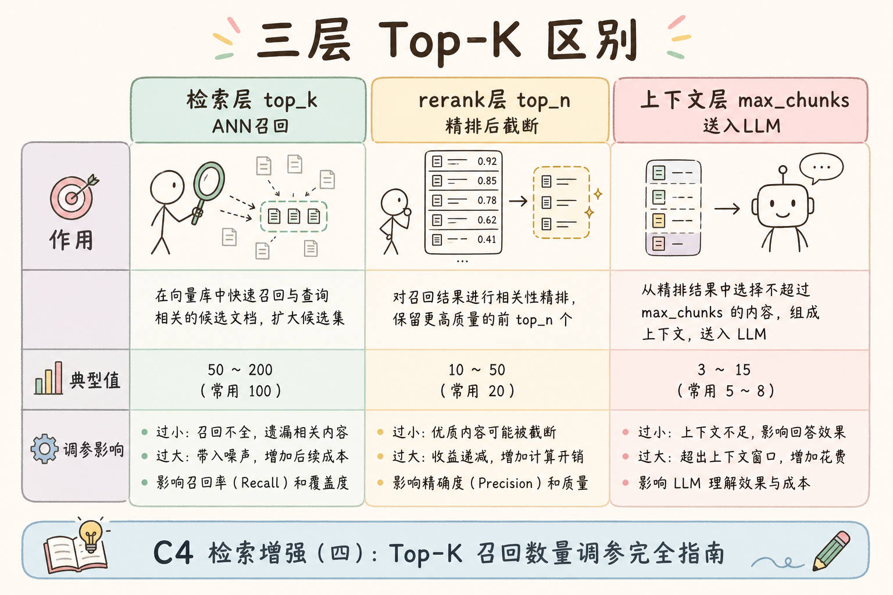
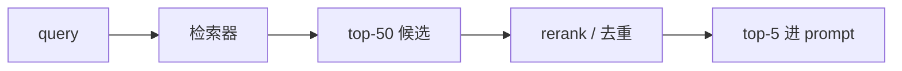
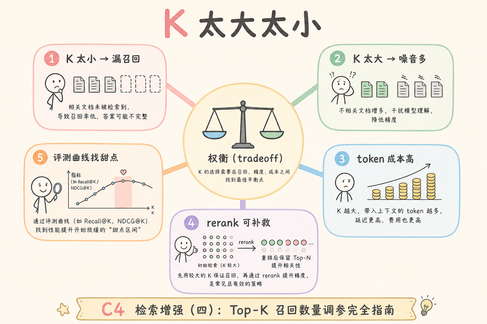
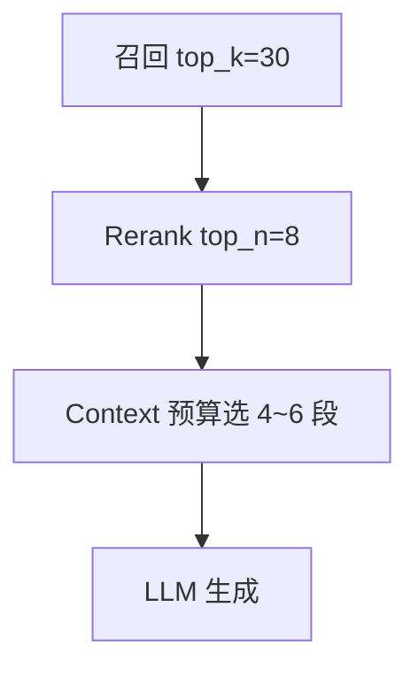

# C5 检索（八）：Top-K 检索数量选择指南

**Top-K** 是检索阶段返回候选数量的参数。它看似只是一个数字，实际会影响召回、噪声、rerank 成本、prompt 长度和最终答案质量。  
通俗说：`top_k` 决定“先把多少份可能有用的材料交给后续环节挑”。

读完本文，你应能解释 `top_k` 解决什么问题、为什么不是越大越好、如何用评测选择合适值，并知道不同阶段可以使用不同 K。

---

## 目录

1. [前言：top_k 不是随手填](#1-前言top_k-不是随手填)
2. [本文边界与动手路径](#2-本文边界与动手路径)
3. [Top-K 是什么](#3-top-k-是什么)
4. [它解决什么问题](#4-它解决什么问题)
5. [K 太小和太大的问题](#5-k-太小和太大的问题)
6. [多阶段 K：召回、重排、生成](#6-多阶段-k召回重排生成)
7. [最小实验方法](#7-最小实验方法)
8. [与 context budget 的关系](#8-与-context-budget-的关系)
9. [上线监控](#9-上线监控)
10. [常见翻车与 FAQ](#10-常见翻车与-faq)
11. [总结与下一步](#11-总结与下一步)

---

## 1. 前言：top_k 不是随手填

很多教程里直接写 `top_k=5`。但企业 RAG 中，不同问题需要的证据数量不同：一个 FAQ 可能 1 段够，制度对比可能要 5 段，多跳问题可能要更多候选给 reranker 判断。

Top-K 的本质是“先给后续阶段多少候选”。它不是答案质量的单一旋钮，而是召回、噪声、延迟和成本之间的折中点。

调参会议上常见争论是“K 越大越安全”。这在数学上只对一半：K 增大确实提高 recall@k，但也把更多 rerank 与 prompt 成本推给下游。正确流程是先画 hit@k 曲线找膝点，再在该 K 上测 p95 与 citation；若膝点在三十而 rerank 预算只允许二十条输入，应讨论是否缩小 Hybrid 某一路 K 或加预过滤，而不是简单把 K 改成五十却只精排前十——那样只是浪费向量检索算力。

### 1.1 一个常见误解

“我们 rerank 很强，所以检索 `top_k=5` 就够。”——若正确 chunk 在第 6～20 名，rerank **根本见不到它**。召回 K 决定 **天花板**；rerank 只在可见候选里排序。

## 2. 本文边界与动手路径

本文讲检索数量选择，不讲具体向量库 API。你可以把这里的方法套到 Dense、Sparse、Hybrid 或 rerank 前的候选召回。

| 步骤 | 你做什么 | 验收 |
|------|----------|------|
| A | 设多个 K 值 | 5 / 10 / 20 / 50 |
| B | 跑评测集 | 记录 hit@k 或 recall@k |
| C | 看噪声和延迟 | 不是只看召回 |
| D | 选分阶段 K | 召回 K 和生成 K 分开 |

最小交付物是：你能解释为什么“检索 top_k=50”不等于“把 50 段都塞进 prompt”。

动手时建议建一张参数表，列清召回 K、RRF 合并后条数、rerank 输入上限、prompt 段数四列。很多线上事故来自只改了其中一列：例如把召回改成五十，却忘记 rerank 仍只吃三十，导致“曲线显示 hit@50 很好、线上 citation 却像 K=30”。联调阶段用 [182 检索调试台](182.retrieval-debug-console-tutorial.md) 重放同一 query，核对 hits 条数是否与配置一致，比反复调 LLM 温度更有效。

### 2.1 每步建议花多久

| 步骤 | 建议时间 | 要点 |
|------|----------|------|
| A～D | 半天～1 天 | 扫 K 画 hit@k 曲线 |
| 联调 | 2 小时 | 与 rerank、context 预算对齐 |

### 2.2 本文不展开

- 动态 K 的机器学习策略
- 各向量库默认 K 的厂商差异
- 生成阶段 max_tokens 的 LLM 调参

## 3. Top-K 是什么

读下图时，注意有两个数量：召回阶段的 top_k，和最终进入 prompt 的证据数量。

上图的结论是：检索 top_k 和最终进 prompt 的数量不一定相同。前者给后续阶段选择空间，后者受上下文窗口和证据质量限制。

从排障话术上，请团队统一区分“未进候选”与“进了候选未进 prompt”。用户抱怨“搜不到”时，先在调试台看正确 chunk 的最低排名：若在第三十名外，是召回 K 或 embedding 问题；若在第五名却未引用，是 rerank、阈值或 token 裁剪问题。混用两种表述会让工程与内容团队互相甩锅，延误修复。

## 4. 它解决什么问题

`top_k` 解决的是候选池大小问题：给少了，正确证据可能没机会进入后续阶段；给多了，噪声、延迟和费用会增加。

| 目标 | top_k 的作用 |
|------|--------------|
| 提高召回 | 让正确 chunk 更可能进入候选 |
| 控制噪声 | 避免无关 chunk 太多 |
| 控制成本 | 降低 rerank 和 prompt 消耗 |
| 支持复杂问题 | 多跳、对比类问题需要更多候选 |

所以，Top-K 的选择必须基于问题类型和评测结果，而不是固定抄一个默认值。

上线后 K 不是常量：文档量从十万涨到百万、或从纯文本扩到扫描 PDF 时，向量路的邻居分布会变，原先 K=20 的膝点可能右移到四十。建议在发版 checklist 里写“索引规模变更 → 重扫 K 曲线”，并与 embedding 版本号绑定。否则会出现“模型没换、索引重建了，citation 却莫名下降”的幽灵回退，根因只是 K 未随库长大而调整。

### 4.1 按问题类型粗分 K

| 问题类型 | 召回 K 倾向 | 进 prompt 段数 |
|----------|-------------|----------------|
| 单点 FAQ | 10～20 | 1～3 |
| 制度对比 | 30～50 | 4～6 |
| 多跳/综合 | 50+ | 经 rerank 压到 5～8 |

## 5. K 太小和太大的问题

| K 值 | 风险 | 表现 |
|------|------|------|
| 太小 | 正确 chunk 没进候选，后续无法补救 | rerank 再强也找不到答案 |
| 太大 | 噪声多，rerank 慢，prompt 成本高 | 答案引用混乱、延迟升高 |

初学者常犯的错是把 `top_k` 当成答案质量旋钮。它确实影响质量，但必须配合 rerank、去重和 context budget，否则只是把更多杂音交给 LLM。

典型坏味道是 prompt 里塞进十几段短 chunk，模型却只引用第一段——不是 K 太小，而是 K 相对噪声太大。此时应优先收紧进 prompt 的段数、加强 rerank，而不是继续加大召回 K“赌一条有用”。压测时同时记录“每 query 候选 token 总和”，避免 K 不大但单 chunk 极长导致上下文爆窗，这类问题在制度 PDF 库尤其常见。

### 5.1 按业务线分 K 的配置

同一平台可配置 `faq_retrieval_k=10`、`policy_retrieval_k=40`，由意图分类或路由规则选择。注意 **每条链路独立评测**，不要共用一套 hit@k 曲线。

## 6. 多阶段 K：召回、重排、生成

读下图时，区分三层数量：召回多少、重排保留多少、最终放进 prompt 多少。

常见起点：召回 20-50，重排后取 5-8，最终按 token 预算放入 prompt。真正上线时要按业务评测调整，而不是让所有问题共用一个 K。

### 6.1 Hybrid 双路的 K

Dense 与 Sparse 可 **同 K 也可不同 K**（如 Sparse 20、Dense 40）。以融合后 hit@k 为准做实验；若 Sparse 路噪声大，可适当减小 Sparse 的 K，让 RRF 少纳入纯关键词噪声。

### 6.2 rerank 与 prompt 的 K

| 阶段 | 典型 K | 说明 |
|------|--------|------|
| 召回 | 20～50 | 换召回不影响 prompt 直接长度 |
| rerank 输入 | ≤ 召回 K | 可对 RRF 输出再截断 |
| prompt | 3～8 段 | 受 token 与证据完整性约束 |

**错误做法**：召回 5、prompt 也 5，却指望 rerank 提升质量——rerank 无候选可选。

### 7.1 画 hit@k 曲线的方法

对每条 query 记录正确 chunk 首次出现的名次。汇总 50 条 query，画 K=1～50 的累计命中率。曲线在 K=20 后变平，则 20 可作召回 K；若 K=40 仍陡升，应优先加 K 或改 embedding，而非只调 rerank。

## 7. 最小实验方法

准备一组 query 和期望 doc_id，分别跑不同 K：

| query | K=5 | K=10 | K=20 | K=50 |
|-------|-----|------|------|------|
| 住宿上限 | 命中 | 命中 | 命中 | 命中但噪声多 |
| 产假年假连休 | 未命中 | 命中 | 命中 | 命中 |
| AccessDenied 上传失败 | 未命中 | 未命中 | 命中 | 命中但候选杂 |

如果 K 从 20 到 50 召回提升很小但延迟明显增加，就没有必要继续加大。反过来，如果 K=5 经常漏掉正确证据，就不该为了省 token 坚持小 K。

实验记录里除 hit@k 外，建议加一列“正确 chunk 首次出现名次的中位数”。若中位数在十八而当前 K=20，说明系统在边缘上运行，任何索引抖动都可能让答案翻车。把 K 提到三十往往比换更贵的 rerank 模型更便宜。记录模板里的 p95_ms 应与候选数同表，方便向产品解释“多十名候选多花多少毫秒”。

### 7.1 实验记录模板

| 日期 | 召回K | rerank_n | prompt段数 | hit@10 | p95_ms | 备注 |
|------|-------|----------|------------|--------|--------|------|
| 示例 | 30 | 8 | 5 | 0.78 | 120 | 基线 |

## 8. 与 context budget 的关系

检索候选越多，不代表都要进 prompt。上下文预算有限，最终应选择最有证据价值的少量 chunk。

生产上常见错误是“召回五十、按召回序截前六进 prompt”，跳过了 rerank 与 [99 阈值](99.score-threshold-tutorial.md)。结果是相似度最高的噪声占满窗口，真正含答案的 chunk 排在第七被裁掉。正确漏斗是：宽 K 召回 → 融合 → 精排 → 阈值 → 再按 token 预算裁剪。任何一步颠倒，都会在 bad case 复盘里表现为“调试台明明有证据，用户却看不到”。

上图的关键是“裁剪前要排序”。如果直接按原始召回顺序截断，可能把真正有用的证据挤掉。

## 9. 上线监控

监控建议：

- 检索 top_k、rerank top_n、最终 chunk 数。
- p95 latency 与 K 的关系。
- prompt token 消耗。
- bad case 中正确 chunk 是否曾进入候选。
- 最终引用是否来自高排名候选。

最后一项很关键：如果正确 chunk 从未进入候选，问题在召回；如果进入候选但没进 prompt，问题在重排、去重或上下文裁剪。

### 9.1 告警建议

- 检索 K 被配置改成极小值
- rerank 输入候选数长期 < 预期
- prompt chunk 数突然下降（可能裁剪 bug）

### 9.1 与 ANN 参数的联动

`efSearch` 过小导致向量路 top-K 内根本没有真邻居时，加大 K 也无效。应先用 [87 ANN 评测](87.ann-recall-latency-tutorial.md) 确认索引 recall，再调大 K，否则只是把更多噪声送给 rerank。

### 10.1 FAQ：动态 K 值得做吗？

有意图分类时可为 FAQ 用小 K、为研究型问题用大 K。实现成本是 **多套配置 + 多套评测**。小团队可先用统一 K 跑通全链路，再按数据占比决定是否动态化。

### 10.1 与 rerank top_n 的乘积效应

召回 K=50、rerank 取 8，看似不大，但 50 条都送 Cross-Encoder 时成本由 **50** 决定。优化顺序往往是：先定 rerank 输入上限，再反推召回 K，而不是先拉到 50 再祈祷 rerank 够快。

### 10.1 与混合检索的双路 K

Dense K 与 Sparse K 可不同，但 **送 rerank 的合并后条数** 才是成本主因。调 K 时同时看 [93 Hybrid](93.hybrid-search-tutorial.md) 融合日志，避免两路各 50 导致 rerank 实际吃满 80+ 去重条。

### 10.1 文档化你的 K 表

在 README 或运维手册中维护一张 **经评测确认** 的 K 表：场景、召回 K、rerank n、prompt 段数、负责人、上次回归日期。新同事调参前先改表再改代码，减少 oral tradition 导致的参数漂移。

Top-K 与 [99 阈值](99.score-threshold-tutorial.md) 组合：K 决定池子大小，阈值决定池子质量下限。两者都应在发版 checklist 里，与 embedding 版本一并复核。

调 K 没有一劳永逸：文档量从 10 万到 100 万、或从纯 FAQ 扩到含 PDF 扫描件时，应 **重新扫 K 曲线**。把 K 表当成与索引规模联动的活文档，而非常量。

简单记忆：**召回 K 要大 enough to include，prompt K 要小 enough to read**。中间用 rerank 和阈值做漏斗。

每周抽 5 条线上 bad case，看正确 chunk 的 **最低排名**：若常在第 15～30 名，应提高召回 K 或改进 embedding，而不是只调 prompt。

Top-K 是检索链路里 **最便宜也最常改** 的参数之一：改前改后都跑同一评测集，把结论写进 changelog，团队才不会在 K=5 与 K=50 之间反复横跳。

记住：**先保证正确 chunk 进候选，再争论进 prompt 的段数**——顺序反了，后面所有精排与生成调参都是空中楼阁。

## 11. 总结与下一步

**top_k 越大越好吗？**  
不一定。召回可能提高，但噪声、延迟和成本也上升。

本篇核心是把 K 当作分层参数管理，而不是全局常量。发版时同时检查 ANN 的 `efSearch`、Hybrid 双路 K 与 rerank 输入上限，三者任一过小将表现为“怎么调 K 都没用”。维护一张经评测确认的 K 表，并注明上次回归日期与负责人，能避免 oral tradition 在 K=5 与 K=50 之间反复横跳。下一步读阈值时，记住 K 决定池子大小，τ 决定池子质量下限，两者应同版本复核。

**为什么 top_k=5 经常答错？**  
可能正确证据没进候选。先测试 top_k=20 或 50，再看正确 chunk 是否出现。

**最终 prompt 要放多少 chunk？**  
看 token 预算和证据完整性，通常比召回 K 小很多。最终数量应由 rerank、去重和答案类型决定。

**不同问题能用不同 K 吗？**  
可以。复杂问题、多跳问题、对比问题可用更大的召回 K；简单 FAQ 可用较小 K。

### 10.1 排错速查

| 现象 | 先查什么 |
|------|----------|
| 答错且 hit@50 为 0 | 召回 K、embedding、索引 |
| hit@50 有但 prompt 无 | rerank、阈值、token 裁剪 |
| 延迟随 K 线性升 | 是否可对两路召回并行 |

## 11. 总结与下一步

Top-K 是召回候选数量，不是越大越好。合理做法是分阶段设置：召回给 reranker 足够候选，生成阶段只放少量高质量证据，并用评测和监控持续校准。

### 11.1 本篇检查清单

- [ ] 区分召回 K、rerank n、prompt 段数三层
- [ ] 用评测扫过 K=5/10/20/50
- [ ] 监控候选数与 prompt 段数
- [ ] bad case 区分“未进候选”vs“未进 prompt”
- [ ] 与 [99 阈值](99.score-threshold-tutorial.md) 组合使用

定 K 时同时记录 **每条 query 的候选 token 总和**，避免 K 不大但单 chunk 极长导致 prompt 爆窗。长文档库应配合 chunk 切分策略一起调，而不是无限增大 K。

下一步读 [99 Score Threshold](99.score-threshold-tutorial.md)，理解除了固定 K，还可以用分数阈值控制候选进入。
