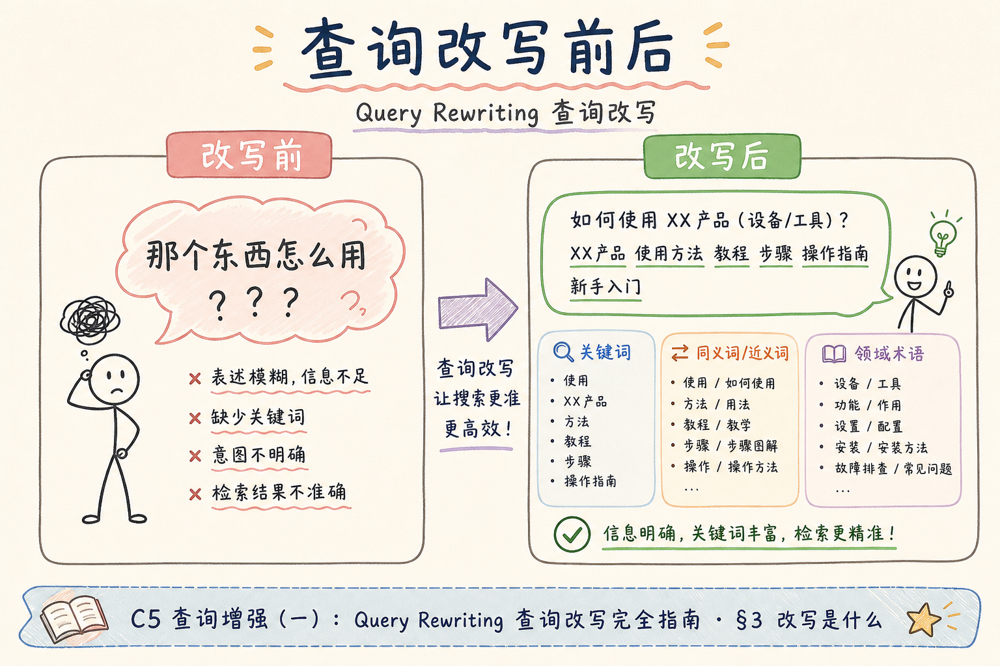
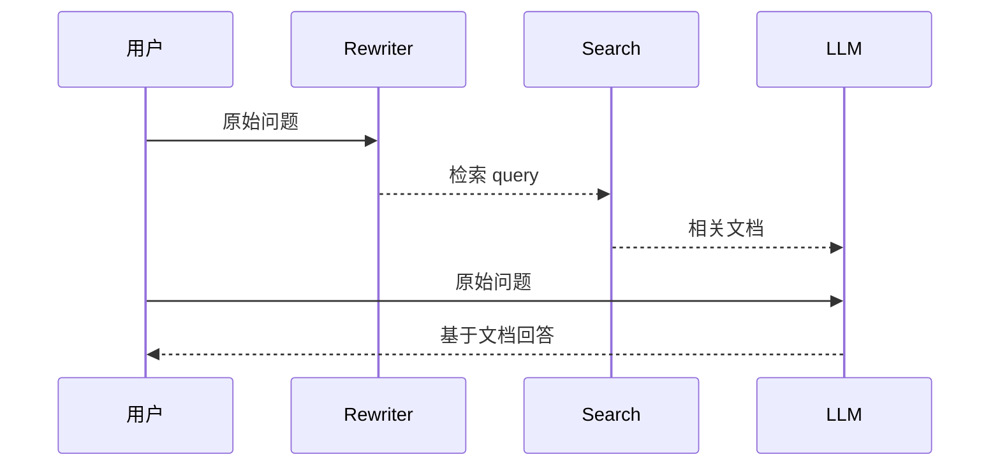
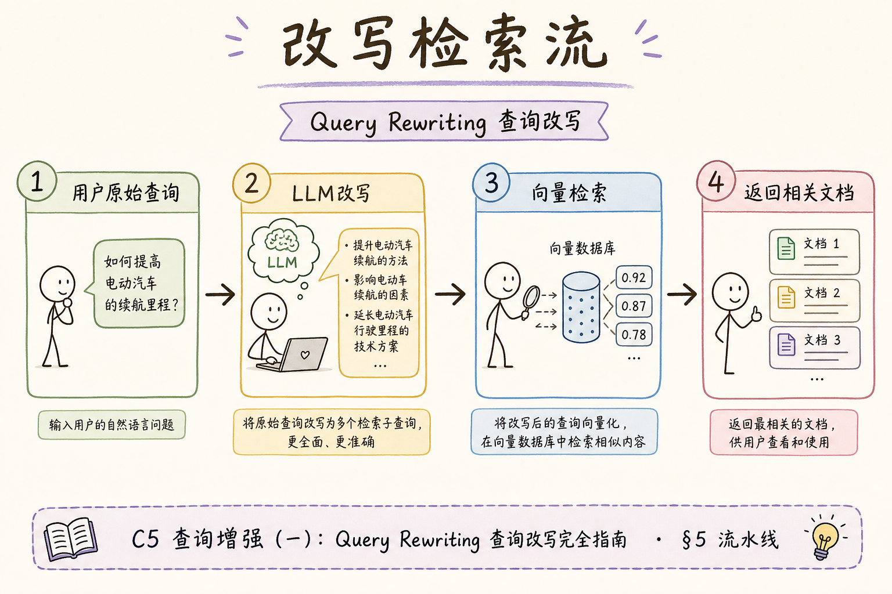
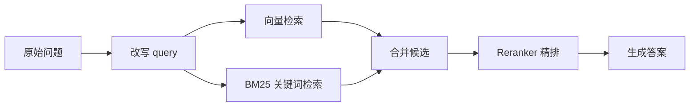
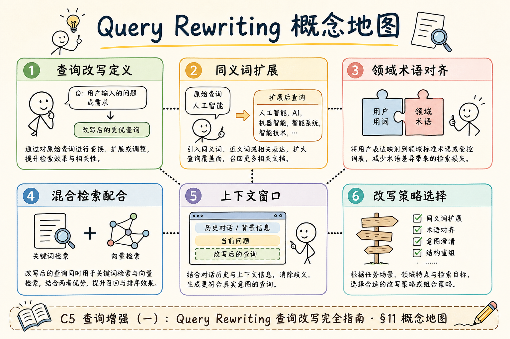

# C5 查询增强（一）：Query Rewriting 查询改写入门

用户提问时常常说得很口语，比如“这个能报吗”“上次那个政策怎么写的”。检索系统如果直接拿这句话去搜，可能找不到正确文档。**Query Rewriting**（查询改写）就是在检索前，把用户原话改写成更适合搜索的查询。

本文面向刚学完向量检索和混合检索的初学者。读完后，你应该能判断什么时候需要查询改写，写出最小规则改写和 LLM 改写，并知道它和多查询检索、精排的边界。

## 目录

- [1. 查询改写解决什么问题](#1-查询改写解决什么问题)
- [2. Query Rewriting 不是什么](#2-query-rewriting-不是什么)
- [3. 在 RAG 链路中的位置](#3-在-rag-链路中的位置)
- [4. 三种改写策略](#4-三种改写策略)
- [5. 最小实现：规则改写与 LLM 改写](#5-最小实现规则改写与-llm-改写)
- [6. 与混合检索和精排衔接](#6-与混合检索和精排衔接)
- [7. 评测与回滚](#7-评测与回滚)
- [8. 常见错误](#8-常见错误)
- [9. FAQ](#9-faq)
- [10. 总结](#10-总结)

## 1. 查询改写解决什么问题

查询改写解决的是“用户话术”和“文档话术”不一致的问题。

例如用户问：

```text
这个出差酒店能报多少？
```

制度文档里可能写的是：

```text
差旅住宿费报销标准，一线城市每晚上限 600 元。
```

如果检索系统只看原句，可能错过“差旅”“住宿费”“报销标准”这些关键词。改写后的查询可以是：

```text
差旅住宿费报销标准 酒店报销上限
```

流程上，查询改写发生在检索前：


改写的目标不是让问题更好看，而是让检索更容易命中正确资料。

## 2. Query Rewriting 不是什么

初学者容易把查询改写和其他查询增强混在一起。

| 技术 | 做什么 | 与查询改写的区别 |
| --- | --- | --- |
| Query Rewriting | 把一个问题改成更适合搜索的一句话 | 仍然是一条 query |
| Multi-Query Retrieval | 生成多个不同角度的 query | 一问多搜 |
| Query Decomposition | 把复杂问题拆成多个子问题 | 适合复合问 |
| Rerank | 对检索结果重新排序 | 发生在检索之后 |

所以查询改写不是“让模型直接回答”，也不是“把问题拆成很多个”。它只负责提高检索入口的表达质量。

## 3. 在 RAG 链路中的位置

查询改写一般放在用户问题进入检索器之前。改写后的 query 用于检索，但最终回答时仍然要保留用户原始问题。





这样做的原因是：检索 query 可以更像关键词，但回答模型需要理解用户真实意图和语气。

## 4. 三种改写策略

查询改写可以从简单到复杂分三类：

| 策略 | 说明 | 适合场景 |
| --- | --- | --- |
| 规则改写 | 用词典、同义词、模板替换 | 术语固定、成本敏感 |
| LLM 改写 | 让模型把口语变成检索语句 | 口语多、表达变化大 |
| 混合改写 | 规则先补关键词，LLM 再整理 | 生产常见起点 |

一个实用原则是：先用规则解决确定问题，再用 LLM 处理不确定表达。不要一开始把所有问题都丢给模型。

## 5. 最小实现：规则改写与 LLM 改写

下面先给一个规则改写。它不需要模型，适合补充固定业务词。



```python
SYNONYMS = {
    "酒店": "住宿费",
    "出差": "差旅",
    "能报": "报销标准",
}


def rule_rewrite(query: str) -> str:
    rewritten = query
    for source, target in SYNONYMS.items():
        if source in rewritten and target not in rewritten:
            rewritten += f" {target}"
    return rewritten


print(rule_rewrite("出差酒店能报多少"))
```

预期输出会包含“差旅”“住宿费”“报销标准”等词。规则改写可解释、便宜，但覆盖有限。

LLM 改写可以这样设计 Prompt：

```python
def build_rewrite_prompt(question: str) -> str:
    return f"""
请把用户问题改写成适合企业制度文档检索的查询语句。
要求：
1. 保留原意，不要回答问题。
2. 补充可能出现在制度文档中的正式词。
3. 输出一句话，不要解释。

用户问题：{question}
"""
```

实际调用时，建议给 LLM 输出加护栏：长度不要太长，不允许编造具体数字，不允许改变问题对象。

## 6. 与混合检索和精排衔接

查询改写后的结果通常会进入混合检索。**混合检索**是同时使用向量检索和关键词检索，再合并结果。

建议链路是：



精排阶段用哪个 query，要按目标选择：

| 阶段 | 推荐使用 |
| --- | --- |
| 召回 | 改写后的 query |
| 精排 | 原始问题 + 改写 query 都可实验 |
| 最终回答 | 原始问题 |

如果只用改写 query 回答，可能会丢失用户原始意图；如果召回只用原始问题，又可能找不到资料。

## 7. 评测与回滚

查询改写必须评测，因为错误改写会让检索方向跑偏。

最小评测表可以这样设计：

| 原始问题 | 改写 query | 期望命中文档 | 是否命中 |
| --- | --- | --- | --- |
| 出差酒店能报多少 | 差旅 住宿费 报销标准 | 差旅制度 | 是 |
| 试用期有年假吗 | 试用期 年假 休假制度 | 员工手册 | 是 |

上线时建议保留开关：

```python
def search(question: str, enable_rewrite: bool) -> list[str]:
    query = rule_rewrite(question) if enable_rewrite else question
    return retrieve(query)
```

有回滚开关，才能在改写效果变差时快速关闭，而不是紧急改代码。

## 8. 常见错误

这一节列出查询改写最常见的坑。核心判断标准很简单：改写是否帮助检索，而不是看起来是否更“聪明”。

### 8.1 改写时直接回答问题

改写器只应该输出检索 query。如果它直接回答，检索链路就被绕过了。

### 8.2 编造具体数字

用户问“住宿上限多少”，改写器不能生成“住宿上限 600 元”，除非原问题已有这个数字。数字应来自检索文档。

### 8.3 改写后丢失原始问题

最终回答仍要看用户原问题。只保留改写 query 会丢失语境、语气和约束条件。

### 8.4 所有问题都强制改写

有些问题已经很清楚，改写反而引入噪声。应通过评测决定哪些类型开启。

### 8.5 没有记录改写结果

排查召回问题时，如果日志里没有原问题和改写 query，就很难判断是改写错还是检索错。

## 9. FAQ

**Q1：查询改写一定要用大模型吗？**  
不一定。术语固定的业务系统，用规则和同义词表就能解决一部分问题。

**Q2：改写 query 越长越好吗？**  
不是。太长会引入噪声。目标是补齐关键检索词，而不是写一段解释。

**Q3：多轮对话里的“它”怎么处理？**  
这属于上下文改写，要结合历史消息把指代补全，例如把“它能报吗”改成“差旅住宿费是否可以报销”。

**Q4：怎么判断改写有效？**  
看召回率、命中文档排名、坏例数量，而不是只看改写文本是否通顺。

## 10. 总结

Query Rewriting 是检索前的“表达对齐”：把用户口语改成更容易命中文档的查询语句。



初学者先做到四件事：

1. 明确改写只服务检索，不负责回答。
2. 先用规则补确定术语，再评估是否需要 LLM。
3. 召回用改写 query，回答保留原始问题。
4. 记录原问题、改写 query、命中文档和开关状态。

当改写能稳定提高命中率，并且出错时能快速回滚，它才适合进入生产链路。
