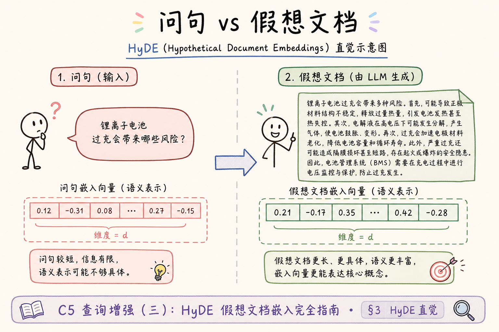
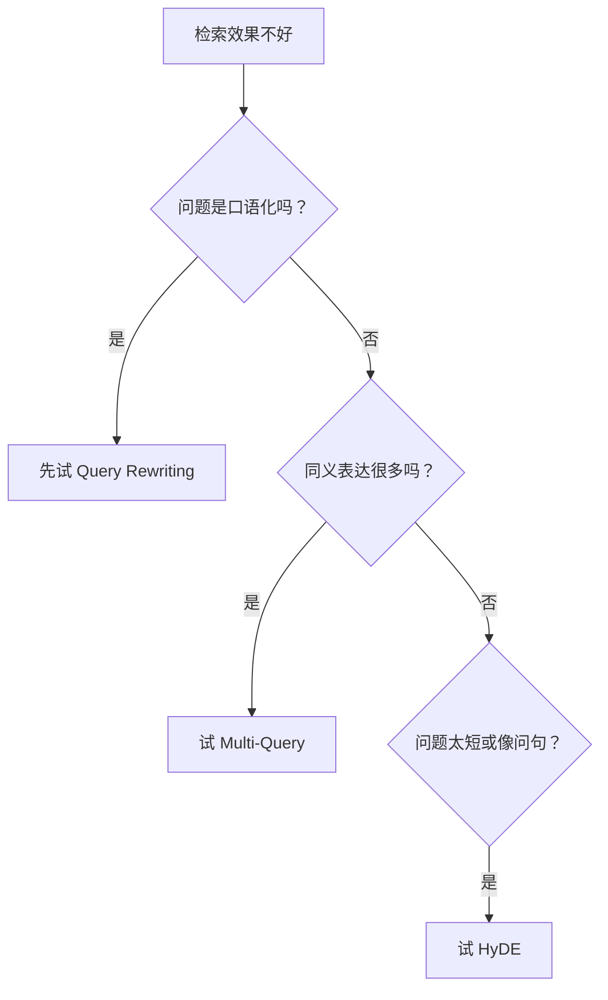
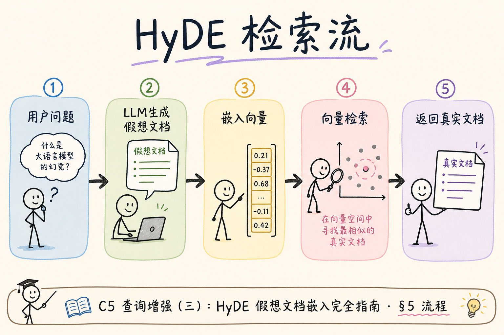
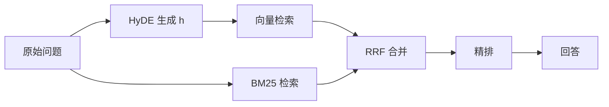

# C5 查询增强（三）：HyDE 假想文档嵌入入门

有些问题用原句去做向量检索效果不好，因为“问题”和“答案”在向量空间里不一定靠得很近。**HyDE**（Hypothetical Document Embeddings，假想文档嵌入）先让模型写一段“可能的答案式文档”，再用这段假想文档去做向量检索。

本文面向已经了解向量检索、混合检索和 Query Rewriting 的初学者。读完后，你应该能解释 HyDE 是做什么的、解决了什么问题、怎么最小实现，以及它为什么不能替代真实证据。

HyDE 在 2022 年论文提出后，常被当作「短 query 向量检索补丁」。它适合问句与文档陈述风格差异大的场景，但不适合需要精确编号、金额的问题——假想文档一旦编造数字，会把检索带偏。本文按流程、Prompt、混合检索配合与上线开关展开，并给出排错与评测方法。

## 目录

- [1. HyDE 解决什么问题](#1-hyde-解决什么问题)
- [2. HyDE 的核心流程](#2-hyde-的核心流程)
- [3. 它和查询改写、多查询的区别](#3-它和查询改写多查询的区别)
- [4. 假想文档 Prompt 怎么写](#4-假想文档-prompt-怎么写)
- [5. 最小 Python 示例](#5-最小-python-示例)
- [6. 与 BM25 和混合检索配合](#6-与-bm25-和混合检索配合)
- [7. 评测与开关](#7-评测与开关)
- [8. 常见错误](#8-常见错误)
- [9. FAQ](#9-faq)
- [10. 总结](#10-总结)

## 1. HyDE 解决什么问题

向量检索依赖语义相似度。用户问题通常很短，制度文档或技术文档通常是完整陈述，两者有时不够相似。

例如用户问：

```text
试用期能休假吗？
```

文档里可能写的是：

```text
员工在试用期内仍享有法定休假权益，但年假需按入职时长折算。
```

HyDE 会先生成一段假想答案：

```text
试用期员工是否可以休假，取决于公司休假制度和法定假期规定。员工通常仍享有法定休假权益，年假可能按入职时间折算。
```

这段假想答案更像真实文档，所以它的 embedding 可能更容易找回相关制度。

HyDE 并不保证一定更好：若知识库本身与问题领域差距大，假想文档也会「像那么回事」却检索不到真实 chunk。因此它必须和评测、开关、中间日志一起上线，而不是默认替换原始 query 向量。

## 2. HyDE 的核心流程

HyDE 的流程有四步：生成假想文档、向量化假想文档、检索真实文档、用真实文档回答。


这张图里最重要的是：假想文档只用于检索，不是最终答案。最终答案必须来自真实检索结果。

## 3. 它和查询改写、多查询的区别

HyDE、Query Rewriting、Multi-Query 都发生在检索前，但它们的输出不同。

| 技术 | 输出 | 适合场景 |
| --- | --- | --- |
| Query Rewriting | 更正式的一条 query | 用户话术和文档话术不一致 |
| Multi-Query | 多条不同表达的 query | 同一意图有多种检索入口 |
| HyDE | 一段假想答案式文档 | 问句太短，向量检索不稳定 |

可以这样判断：





这些技术可以组合，但不要一开始全开。先单独评测每个增强是否有效。

判断顺序可记：口语化 → 改写；多同义入口 → Multi-Query（[101](101.multi-query-retrieval-tutorial.md)）；短问句向量不稳 → HyDE；一句多问 → 查询分解（[103](103.query-decomposition-tutorial.md)）。HyDE 与改写常组合：BM25 用改写 query，向量用 HyDE 文档，两路在 RRF 合并（[94](94.rrf-fusion-tutorial.md)）。

## 4. 假想文档 Prompt 怎么写

HyDE Prompt 的目标是生成“像资料片段”的文本，而不是生成最终答案。

可用模板：

```text
请根据用户问题写一段可能出现在企业制度文档中的说明文字。
要求：
1. 只写用于检索的假想文档，不要回答“根据资料可知”。
2. 不要编造具体数字、日期、人名或政策条款。
3. 使用正式、客观的制度文档语气。
4. 控制在 120 字以内。

用户问题：{question}
```

为什么要禁止具体数字？因为 HyDE 生成的内容不一定是真的。如果它编出“600 元上限”，检索可能被错误数字带偏。

Prompt 里还可要求：不写「根据以上」「综上所述」等回答套话；不虚构条款号；语气接近制度正文而非客服回复。生成后可用规则截断超长输出，或检测是否含具体数字/日期，命中则重试或回退原问向量检索。

### 案例

某 HR 知识库：用户问「试用期能休假吗？」。仅用原问做 embedding，top-5 多是「员工福利概览」「入职须知」泛化页。开启 HyDE 后，假想文档写：「试用期员工休假权益按公司制度与法定假期处理，年假可能按入职时长折算。」用该段 embedding 检索，top-3 出现 `handbook-2025#088`（含试用期内享有法定休假、年假折算）。BM25 仍用原问，两路 RRF 后精排，答案可正确引用。若把假想文档直接当 context，则可能编造具体天数——这是 HyDE 最典型的误用。

### 先错对已

```text
-- ❌ 向量与 BM25 都用 hypothetical_doc 做 query
-- 问题：假想词可能不在真实文档里，BM25 反而跑偏

-- ✅ 向量：embed(hypothetical_doc)；BM25：原问或 rewrite(question)

-- ❌ 最终 prompt 里放入 hypothetical_doc 作为证据
-- 问题：假想内容未经验证，幻觉风险高

-- ✅ prompt 只含 vector_search(h) 返回的真实 chunk 文本
```

## 5. 最小 Python 示例

下面示例用假的 LLM 和假的向量检索函数演示 HyDE 流程。真实项目里把 `call_llm()` 和 `vector_search()` 换成你的模型客户端和向量库。



```python
def call_llm(prompt: str) -> str:
    return "员工在试用期内的休假权益应按公司休假制度和法定假期规定处理。"


def embed(text: str) -> list[float]:
    return [float(len(text) % 10), 0.1, 0.2]


def vector_search(query_vector: list[float]) -> list[dict]:
    return [
        {"chunk_id": "c1", "text": "试用期员工仍享有法定假期，年假按入职时长折算。", "score": 0.91}
    ]


def hyde_retrieve(question: str) -> list[dict]:
    prompt = f"请写一段用于检索的假想制度文档：{question}"
    hypothetical_doc = call_llm(prompt)
    query_vector = embed(hypothetical_doc)
    return vector_search(query_vector)


hits = hyde_retrieve("试用期能休假吗？")
print(hits)
```

这段代码展示的是结构：`question -> hypothetical_doc -> embedding -> real hits`。最终回答时，应把 `hits` 里的真实文本交给回答模型，而不是直接使用 `hypothetical_doc`。

## 6. 与 BM25 和混合检索配合

HyDE 更适合增强向量检索。关键词检索（BM25）通常仍然应该用原始问题或改写后的 query，而不是用假想文档。

推荐链路：



这样做的原因是：HyDE 可能生成不存在的词，BM25 如果直接搜假想文档，可能反而偏离真实关键词。

混合检索时建议记录两路各自命中，便于对比「HyDE 是否只帮了向量路」。若只有向量路提升、BM25 不变，说明假想文档语义有效；若两路都变差，优先检查假想文档是否编偏或过长。

## 7. 评测与开关

HyDE 必须评测，因为它可能提升召回，也可能引入幻觉噪声。

最小评测表：

| 原始问题 | 无 HyDE 命中 | HyDE 命中 | 是否改善 |
| --- | --- | --- | --- |
| 试用期能休假吗 | 员工福利概览 | 试用期休假制度 | 是 |
| 发票丢了怎么办 | 报销流程 | 发票遗失处理 | 是 |

建议记录这些字段：

| 字段 | 用途 |
| --- | --- |
| 原始问题 | 判断用户意图 |
| 假想文档 | 排查 HyDE 是否编偏 |
| 命中 chunk | 判断检索是否改善 |
| 开关状态 | 方便线上回滚 |

没有日志时，HyDE 出问题很难排查，因为你看不到模型生成的中间文本。

### 评测

从评测集分三类各 10～20 条：短问句概念题、含精确数字/编号题、长句复合题。对比「无 HyDE / 有 HyDE」的 recall@k 与最终答案人工评分。HyDE 应在第一类明显提升，第二类不应变差（变差说明假想数字污染检索）。记录字段：`question`、`hypothetical_doc`（可采样存全文）、`hit_chunk_ids`、`hyde_enabled`。灰度开关建议按问题长度或检索置信度触发：单 query 向量 top-1 分数低于阈值时再开 HyDE，控制成本。

| 观测 | 健康信号 | 告警信号 |
| --- | --- | --- |
| 假想文档长度 | 80～150 字 | 超长列举、像完整答案 |
| 向量 recall | 短问句 recall@5 升 | 精确编号题 recall 降 |
| 延迟 | +1 次 LLM 调用可接受 | 与 Multi-Query 叠满导致 P95 超标 |

## 8. 常见错误

这一节列出 HyDE 最常见的坑。核心原则是：假想文档只能帮助找证据，不能成为证据。

### 8.1 把假想文档当最终答案

HyDE 生成的内容可能不真实。最终答案必须基于检索到的真实文档。

### 8.2 Prompt 允许编造具体数字

假想数字会把检索带偏。Prompt 中应禁止编造金额、日期、比例和政策条款。

### 8.3 BM25 也使用假想文档

BM25 对具体词敏感。假想文档里的词可能和真实文档不一致，建议 BM25 保留原问或查询改写结果。

### 8.4 所有问题都开启 HyDE

清晰、关键词明确的问题不一定需要 HyDE。全量开启会增加成本和延迟。

### 8.5 不保存中间结果

不记录 hypothetical_doc，就无法判断召回变差是因为生成错、embedding 错，还是向量库问题。

### 排错

1. **HyDE 后向量 recall 下降**：打印假想文档，是否含错误专有名词或虚构金额；收紧 Prompt 或对该类问题关闭 HyDE。
2. **检索命中变泛化**：假想文档太像「百科概述」，embedding 飘到总则页；缩短长度、要求贴近企业制度用语。
3. **答案幻觉增加**：检查 prompt 是否误传入 hypothetical_doc；只允许真实 chunk 进 context。
4. **延迟尖刺**：HyDE 与 Multi-Query、分解同时开启；按问题类型互斥或串行预算（总增强 LLM 调用 ≤ 2）。
5. **与 BM25 融合后更差**：确认 BM25 未用假想文本；检查 RRF 是否被某一路噪声候选淹没，缩小每路 top_k。

## 9. FAQ

**Q1：HyDE 会不会增加幻觉？**  
会增加风险，所以它只能用于检索，不用于直接回答。最终答案要由真实文档支撑。

**Q2：HyDE 和 Query Rewriting 能一起用吗？**  
可以，但先分别评测。常见组合是 BM25 用改写 query，向量检索用 HyDE 文档。

**Q3：假想文档写多长合适？**  
初学阶段控制在 80-150 字。太短语义不够，太长容易引入噪声。

**Q4：什么时候不适合 HyDE？**  
需要精确数字、代码符号、专有 ID 的问题不一定适合。此时关键词检索和 metadata filter 往往更可靠。

## 10. 总结

HyDE 的价值是把短问句变成更像文档的语义查询，从而改善向量检索召回。


初学者先记住四点：

1. HyDE 生成的是假想文档，不是答案。
2. 假想文档用于向量检索，真实答案仍要看真实 chunk。
3. Prompt 禁止编造具体事实和数字。
4. 上线前必须记录中间文本，并保留开关。

当 HyDE 能稳定改善召回，并且坏例可追踪、可回滚时，才值得放进生产链路。

### 本篇检查清单

- [ ] 假想文档只用于向量检索，不进最终 evidence
- [ ] Prompt 禁止编造数字、日期、条款号；BM25 仍用原问或改写 query
- [ ] 日志持久化 `hypothetical_doc` 与命中 chunk，便于排错
- [ ] 30+ 条评测对比短问句 recall，精确编号题无回归
- [ ] 有 HyDE 开关或按置信度触发，可一键回滚

下一步可读 [101 Multi-Query](101.multi-query-retrieval-tutorial.md) 或 [103 查询分解](103.query-decomposition-tutorial.md)，按问题形状选增强，避免默认全开。
