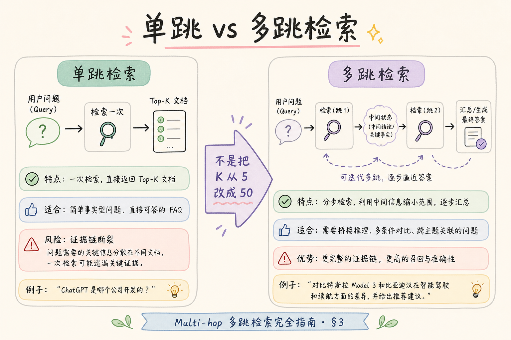
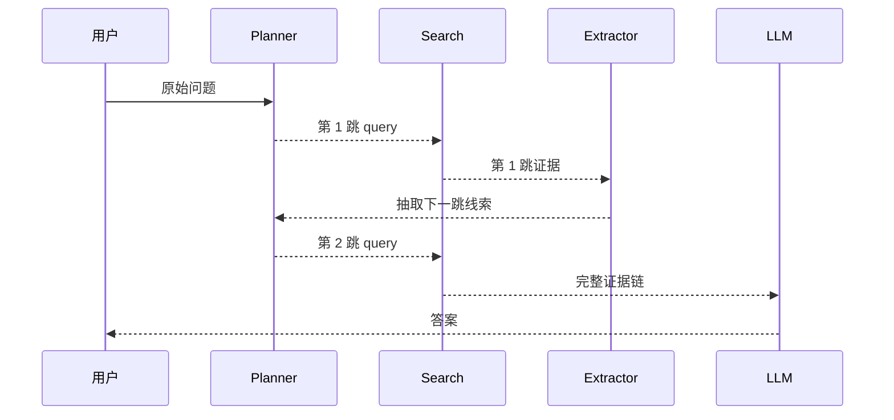
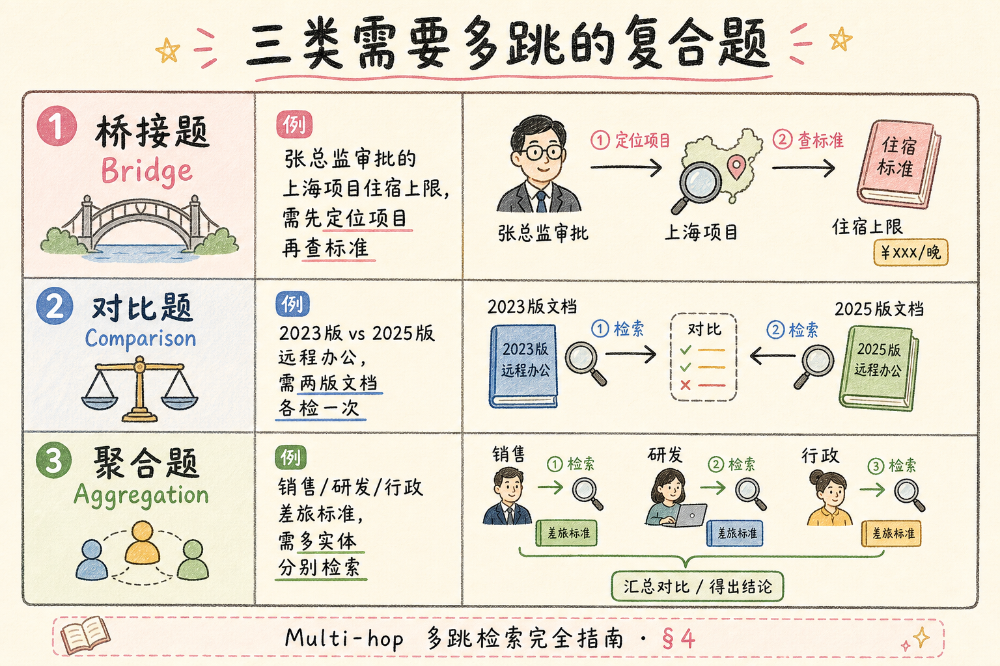
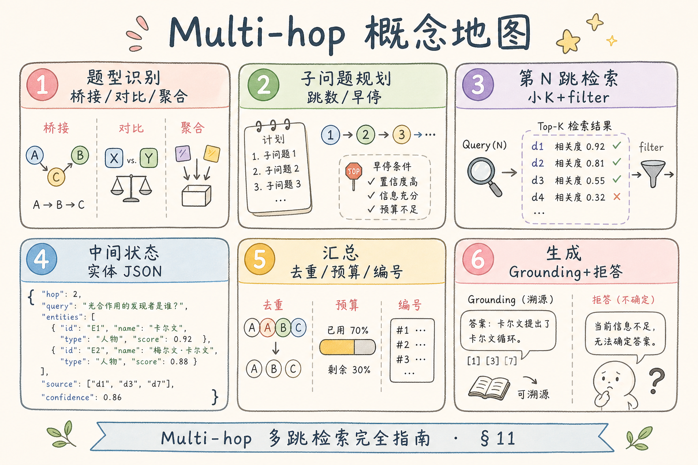

# C5 检索增强（四）：Multi-hop 多跳检索入门

有些问题不是一次检索就能回答的。比如“找到差旅制度里负责审批的人，再查这个人所在部门的报销权限”。第二步查询依赖第一步结果，这就是 **Multi-hop Retrieval**（多跳检索）：按步骤检索，把前一步证据变成下一步线索。

本文面向已经了解查询分解的初学者。读完后，你应该能分清多跳检索和普通多子问题检索，写出一个两跳 Mini-RAG，并知道何时不要把问题复杂化。

多跳检索的代价是延迟与错误累积：每一跳都可能检索失败或实体抽错。生产上应对「需要推理链」的问题才启用，并硬性限制最大跳数。本文给出两跳示例、证据链组织方式，以及评测时如何检查每一跳是否合理。

## 目录

- [1. 多跳检索解决什么问题](#1-多跳检索解决什么问题)
- [2. 单跳、分解、多跳的区别](#2-单跳分解多跳的区别)
- [3. 多跳检索的基本流程](#3-多跳检索的基本流程)
- [4. 三类常见多跳问题](#4-三类常见多跳问题)
- [5. 两跳 Mini-RAG 示例](#5-两跳-mini-rag-示例)
- [6. 证据链如何组织进上下文](#6-证据链如何组织进上下文)
- [7. 评测与停止条件](#7-评测与停止条件)
- [8. 常见错误](#8-常见错误)
- [9. FAQ](#9-faq)
- [10. 总结](#10-总结)

## 1. 多跳检索解决什么问题

多跳检索解决的是“后一步需要前一步结果”的问题。

单跳问题：

```text
北京出差住宿上限是多少？
```

多跳问题：

```text
差旅制度里规定谁审批超标住宿？这个角色还能审批机票升舱吗？
```

第一跳要找“谁审批超标住宿”，第二跳才能拿这个角色继续查“能否审批机票升舱”。


多跳的核心不是 top_k 更大，而是查询会随着中间证据变化。

与查询分解（[103](103.query-decomposition-tutorial.md)）对照：分解的两路 query 在检索前就已确定；多跳的第二跳 query 往往要用第一跳抽出的实体拼接，例如 `{role}机票升舱权限`。若第二跳 query 在用户提问时已能写死，通常不需要多跳。

## 2. 单跳、分解、多跳的区别

初学者最容易把查询分解和多跳混在一起。

| 类型 | 特征 | 示例 |
| --- | --- | --- |
| 单跳检索 | 一次查询可直接找答案 | 年假有几天 |
| 查询分解 | 多个并列子问题 | 住宿上限和机票舱位分别是什么 |
| 多跳检索 | 后一问依赖前一跳结果 | 先找审批人，再查审批权限 |

判断方法：如果子问题可以同时检索，多半是查询分解；如果必须先知道第一步答案才能构造第二步 query，就是多跳检索。

## 3. 多跳检索的基本流程

多跳检索通常包含计划、检索、抽取线索、继续检索、合并证据五步。





这里的 Extractor 可以很简单：从文本中抽取角色、部门、产品名、条款编号等实体。不要一上来就做复杂 Agent。

第一跳命中质量是多跳的瓶颈：若 top-1 分数低或证据与 query 不对齐，应停止扩展而不是硬构造第二跳。可设分数阈值或让 LLM 判断「当前证据是否足以抽取可靠线索」，再决定是否继续。

### 案例

用户问：「差旅制度里规定谁审批超标住宿？这个角色还能审批机票升舱吗？」第一跳 query「超标住宿谁审批」命中「需部门负责人审批」。Extractor 抽出 `部门负责人`，第二跳 query「部门负责人机票升舱权限」命中「商务舱需财务总监审批」。证据链清晰：住宿审批人与升舱审批人不同。若跳过第一跳直接搜「机票升舱」，可能只看到舱位标准，无法回答「该角色能否审批」。这个 case 体现依赖关系，而非简单并列分解。

### 先错对已

```text
-- ❌ 把 top_k 从 5 调到 50，指望模型自己从长 context 里推理
-- 问题：没有显式第二跳 query，不是多跳

-- ✅ hop2_query = template.format(entity=extract(hop1_evidence))

-- ❌ 第一跳分数 0.3 仍继续第二跳
-- 问题：错误实体会污染全链

-- ✅ hop1_score < 阈值 → 返回「未找到审批角色，无法继续」
```

## 4. 三类常见多跳问题

多跳问题常见有三类：



| 类型 | 说明 | 示例 |
| --- | --- | --- |
| 桥接型 | 第一跳找到桥梁实体，第二跳查实体信息 | 先找负责人，再查权限 |
| 对比型 | 分别查两边，再比较 | A 制度和 B 制度冲突时听谁的 |
| 聚合型 | 多处证据汇总后才有答案 | 某流程一共需要哪些审批 |

不是所有复杂问题都要多跳。很多“对比型”问题用查询分解就够了，只有当后续查询依赖前一步实体时，才真正需要多跳。

## 5. 两跳 Mini-RAG 示例

下面示例用字典模拟检索。它展示“第一跳结果生成第二跳 query”的结构。

```python
DOCS = {
    "超标住宿谁审批": "超出住宿标准时，需要部门负责人审批。",
    "部门负责人机票升舱权限": "部门负责人不能直接审批商务舱，需提交财务总监审批。",
}


def search(query: str) -> str:
    return DOCS.get(query, "")


def extract_role(evidence: str) -> str:
    if "部门负责人" in evidence:
        return "部门负责人"
    return ""


def multi_hop_answer() -> dict:
    hop1_query = "超标住宿谁审批"
    hop1_evidence = search(hop1_query)
    role = extract_role(hop1_evidence)

    hop2_query = f"{role}机票升舱权限"
    hop2_evidence = search(hop2_query)

    return {
        "hops": [
            {"query": hop1_query, "evidence": hop1_evidence},
            {"query": hop2_query, "evidence": hop2_evidence},
        ],
        "answer": "超标住宿由部门负责人审批，但商务舱升舱还需财务总监审批。",
    }


print(multi_hop_answer())
```

真实项目里，`search()` 会调用向量库或混合检索，`extract_role()` 可以由规则、NER 或 LLM 完成。核心结构不变：每一跳都要留下 query 和 evidence。

建议为 `multi_hop_answer` 返回结构化对象（ hops、final_answer、stopped_reason），方便日志与单测。单元测试可 mock `search` 字典，断言第二跳 query 字符串是否含第一跳实体。

## 6. 证据链如何组织进上下文

多跳回答最怕证据链断掉。建议把上下文按跳数组织，而不是简单拼接。

```text
用户问题：
{question}

证据链：
第 1 跳 query：超标住宿谁审批
第 1 跳证据：超出住宿标准时，需要部门负责人审批。
抽取线索：部门负责人

第 2 跳 query：部门负责人机票升舱权限
第 2 跳证据：部门负责人不能直接审批商务舱，需提交财务总监审批。

请基于证据链回答，不要跳过中间推理。
```

这样模型更容易解释“为什么要从住宿审批跳到机票升舱权限”，用户也能看到答案来源。

## 7. 评测与停止条件

多跳检索不能无限跳。每次跳转都会增加成本、延迟和错误累积。

建议设置停止条件：

| 条件 | 做法 |
| --- | --- |
| 最大跳数 | 初学阶段限制 2-3 跳 |
| 证据不足 | 当前跳没有可靠命中就停止 |
| 线索不明确 | 抽不出实体时不要硬跳 |
| 置信度下降 | 分数低于阈值时改为“不确定” |

评测时不要只看最终答案，还要看每一跳是否合理。多跳链路中任何一跳错，最终答案都可能看似流畅但实际错误。

### 评测

构建 20～40 条标注「每跳期望 query / 期望 chunk」的 case，比只看 end-to-end 答案更能定位问题。指标：

| 指标 | 说明 |
| --- | --- |
| hop1 recall | 第一跳是否命中桥梁 chunk |
| entity 准确率 | 抽取实体与标注是否一致 |
| hop2 recall | 给定正确实体，第二跳是否命中 |
| 链完整率 | 两跳都成功且答案正确 |

对比「强行单跳 top_k=30」与「两跳 top_k=5」的延迟与准确率，多跳应在准确上胜出才值得保留。日志字段：`hop_index`、`query`、`top_hits`、`extracted_entity`、`stop_reason`。

## 8. 常见错误

这一节列出多跳检索最常见的坑。核心原则是：每一跳都必须有明确目的和证据。

### 8.1 把 top_k 加大当多跳

top_k 变大只是拿更多候选，不会自动产生第二步查询。多跳必须利用中间证据构造下一跳。

### 8.2 没有保存中间证据

只保存最终答案，无法排查哪一跳错了。每跳的 query、hits、抽取线索都要记录。

### 8.3 过早使用 Agent

简单两跳问题用固定流程就能解决。过早上 Agent 会增加不可控行为和调试难度。

### 8.4 跳数没有上限

无限追问会拖慢系统，还可能越查越偏。生产链路必须设置最大跳数。

### 8.5 用低质量第一跳继续扩散

第一跳证据不可靠时，第二跳只会放大错误。低分命中应停止或返回不确定。

### 排错

1. **第二跳 query 为空或乱码**：Extractor 失败；检查第一跳 evidence 是否过短，或改用规则/NER。
2. **答案对但过程不可解释**：未把证据链写入 prompt；按第 6 节模板组织 context。
3. **无限循环跳检索**：未设 `max_hops`；生产必须硬上限 2～3。
4. **对比型问题误用多跳**：A、B 可并行查，应改查询分解。
5. **延迟过高**：串行两跳各含 rerank；可第一跳轻量召回，第二跳再精排，或缓存实体→权限映射表。

## 9. FAQ

**Q1：多跳检索一定要用图数据库吗？**  
不一定。图数据库适合实体关系清晰的场景，但两跳 RAG 可以先用普通检索和实体抽取实现。

**Q2：多跳和 Graph RAG 是一回事吗？**  
不是。Graph RAG 通常显式构建实体关系图；多跳检索可以只是按步骤检索，不一定有图结构。

**Q3：什么时候用查询分解就够了？**  
当多个子问题可以并行检索，且互不依赖时，用查询分解更简单。

**Q4：多跳会不会很慢？**  
会增加延迟。可以限制跳数、缓存中间结果，并只对需要推理链的问题启用。

## 10. 总结

Multi-hop Retrieval 的价值是解决“后一跳依赖前一跳证据”的问题。它不是扩大 top_k，也不是把问题简单拆成并列子问。



初学者先做到四点：

1. 只有存在依赖关系时才启用多跳。
2. 每一跳保存 query、证据和抽取线索。
3. 上下文按证据链组织，避免证据混乱。
4. 设置最大跳数和停止条件，避免错误累积。

当你能解释每一跳为什么发生、证据是什么、何时停止，多跳检索才真正可控。

### 本篇检查清单

- [ ] 能说明与查询分解、加大 top_k 的区别
- [ ] 两跳示例跑通，且每跳记录 query / evidence / 抽取线索
- [ ] context 按证据链组织，prompt 要求基于链推理
- [ ] 设 max_hops、低分停止、实体抽不出则中止
- [ ] 20+ 条多跳评测看过 hop1/hop2 分项指标

复杂 Agent 与 Graph RAG 是后续方向；先把可控两跳做稳，再考虑自动化规划。
