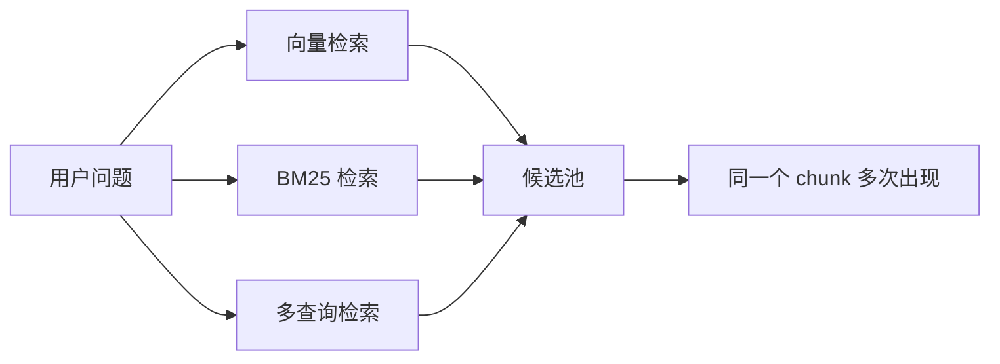
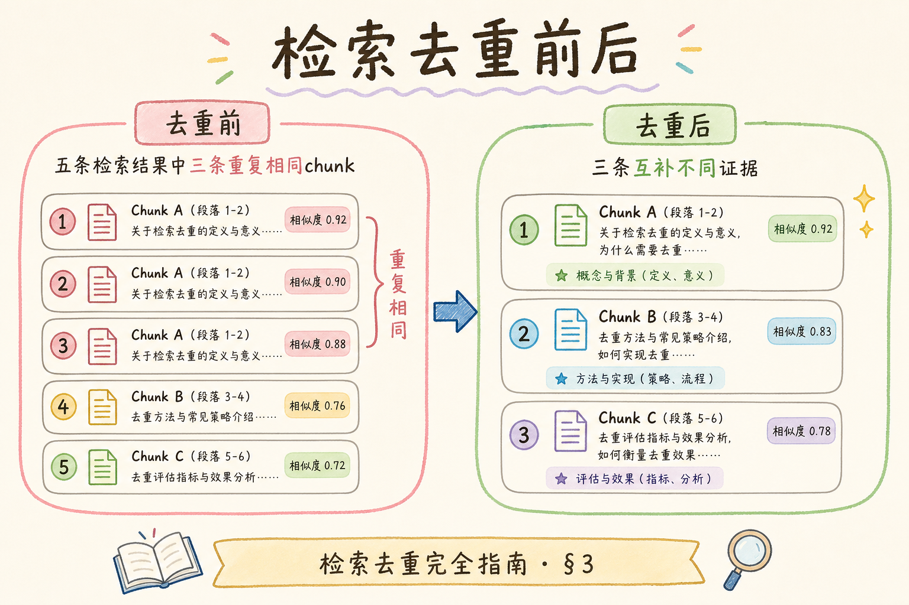
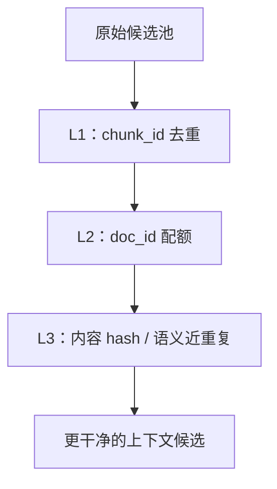
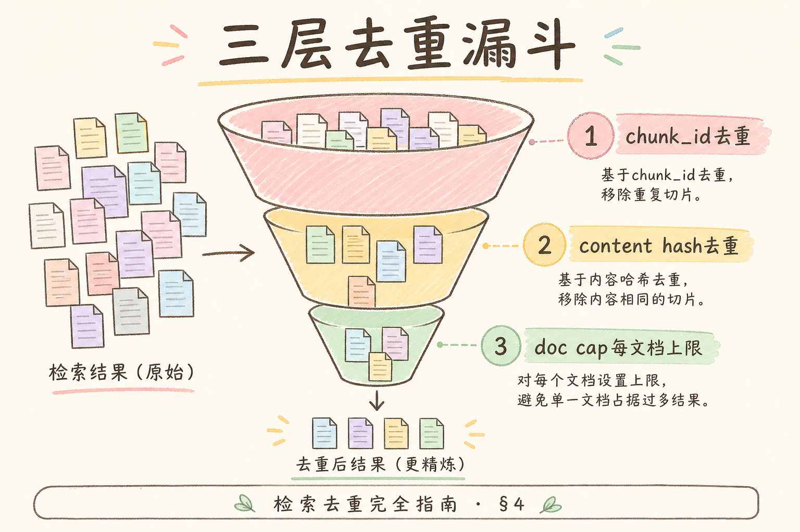
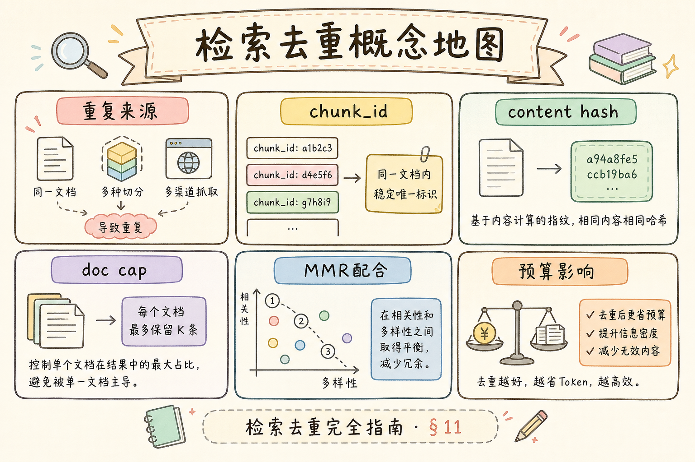

# C5 检索增强（六）：检索结果去重入门

RAG 检索结果里经常出现“看起来不同，其实内容一样”的候选。比如向量检索和 BM25 同时命中同一个 chunk，或者同一份文档的相邻片段反复出现。**检索去重**就是在组装上下文前，把重复或近重复证据压掉，让有限的上下文窗口留给更多有效信息。

本文面向已经了解混合检索、多查询和 MMR 的初学者。读完后，你应该能区分 id 去重、文档级去重和语义近重复，并写出一个最小去重管道。

## 目录

- [1. 为什么检索结果会重复](#1-为什么检索结果会重复)
- [2. 去重要解决什么问题](#2-去重要解决什么问题)
- [3. 三层去重：id、文档、语义](#3-三层去重id文档语义)
- [4. 在 RAG 链路中的位置](#4-在-rag-链路中的位置)
- [5. 最小 Python 实现](#5-最小-python-实现)
- [6. 文档级配额与多样性](#6-文档级配额与多样性)
- [7. 与 MMR 的关系](#7-与-mmr-的关系)
- [8. 常见错误](#8-常见错误)
- [9. FAQ](#9-faq)
- [10. 总结](#10-总结)

## 1. 为什么检索结果会重复

重复来源很多，尤其在混合检索和多查询检索中更明显。



重复不一定是完全相同的字符串。它可能是同一个 `chunk_id`，也可能是同一页的相邻 chunk，甚至是两个版本里几乎相同的段落。

在企业知识库里，重复往往来自 **多路召回叠加**：向量检索按语义相似度排序，BM25 按关键词命中，多查询改写又会从不同角度再搜一遍。三路结果合并后，同一段制度条文出现三次并不罕见。如果不去重，精排模型和 MMR 都要对重复 chunk 重复打分，浪费算力；更糟的是，最终上下文里前五条可能都在讲同一件事，用户问的是“住宿上限 **和** 审批流程”，模型却只看到上限。

### 案例

某差旅 RAG PoC 使用混合检索：`top_k=5` 向量 + `top_k=5` BM25 + 2 条多查询改写，合并后候选池常有 12～15 条。人工抽检发现，`travel-2025#003`（住宿上限 600 元）会以不同分数出现 3 次，而 `travel-2025#007`（超标审批）只出现 1 次。用户问“住宿上限和超标怎么办”，模型上下文前五条全在重复讲 600 元，审批流程被挤出窗口。加上 L1 `chunk_id` 去重 + 每 `doc_id` 最多 2 条配额后，同一问题能同时看到上限与审批两条证据，答案完整度明显提升。这类 case 说明：**去重不是洁癖，而是给多样性腾位置**。

## 2. 去重要解决什么问题

上下文窗口是有限的。重复内容会挤占位置，让模型少看到其他关键证据。

例如问题是“住宿上限和审批流程是什么”，如果前 6 条候选都在讲住宿上限，模型可能漏掉审批流程。

去重的目标不是把候选变少，而是让候选更有效：

| 问题 | 去重后的收益 |
| --- | --- |
| 同一 chunk 重复 | 避免浪费上下文 |
| 同文档占满 Top-K | 给其他文档机会 |
| 多版本重复 | 减少冲突和噪声 |
| 近重复段落 | 提高信息覆盖度 |

## 3. 三层去重：id、文档、语义

初学者可以把去重分三层：

| 层级 | 做法 | 是否必做 |
| --- | --- | --- |
| L1 id 去重 | 按 `chunk_id` 或主键去重 | 必做 |
| L2 文档级去重 | 限制同一 `doc_id` 出现数量 | 建议 |
| L3 语义近重复 | 用 hash 或向量相似度去近重复 | 按需 |





不要一开始就追求复杂语义去重。先把 id 去重和文档级配额做好，通常已经能解决很多问题。

## 4. 在 RAG 链路中的位置

去重通常放在多路召回合并后、MMR 或精排之前。





这样做的原因是：多路召回最容易产生重复；如果不先去重，后面的 MMR、精排和预算裁剪都会浪费计算。

## 5. 最小 Python 实现

下面代码演示按 `chunk_id` 去重，并保留最高分版本。

```python
def dedup_by_chunk_id(hits: list[dict]) -> list[dict]:
    best: dict[str, dict] = {}
    for hit in hits:
        chunk_id = hit["chunk_id"]
        if chunk_id not in best or hit["score"] > best[chunk_id]["score"]:
            best[chunk_id] = hit
    return sorted(best.values(), key=lambda x: x["score"], reverse=True)


hits = [
    {"chunk_id": "c1", "doc_id": "d1", "score": 0.91, "text": "住宿上限 600 元"},
    {"chunk_id": "c1", "doc_id": "d1", "score": 0.88, "text": "住宿上限 600 元"},
    {"chunk_id": "c2", "doc_id": "d1", "score": 0.82, "text": "超标需审批"},
]

print(dedup_by_chunk_id(hits))
```

这段代码会保留 `c1` 的最高分版本，并保留 `c2`。这是所有检索管道都应该具备的最小去重。

## 6. 文档级配额与多样性

有时 chunk_id 没重复，但同一文档占满了结果。可以给每个文档设置配额，例如每个 `doc_id` 最多保留 2 条。

```python
def limit_per_doc(hits: list[dict], max_per_doc: int = 2) -> list[dict]:
    counts: dict[str, int] = {}
    result = []
    for hit in hits:
        doc_id = hit["doc_id"]
        if counts.get(doc_id, 0) >= max_per_doc:
            continue
        counts[doc_id] = counts.get(doc_id, 0) + 1
        result.append(hit)
    return result
```

文档级配额适合需要多来源覆盖的问答。它也有风险：如果正确答案确实集中在一份文档里，配额太低会误删有用证据。因此配额要结合业务场景评测。

### 先错对已

```text
-- ❌ 用 chunk 正文做 set 去重：标点、空格、全半角不同会被当成不同条
-- ❌ 去重时保留先出现的低分版本：多路命中时丢了更可信的分数
-- ❌ 每 doc 只留 1 条且不做评测：长文档里第二段才是答案时被误删

-- ✅ L1 按 chunk_id 去重，同一 id 保留 score 最高的一条
-- ✅ L2 按 doc_id 配额（如 2），配额值用固定评测集标定
-- ✅ 有 doc_version 时，去重与过滤一起考虑，避免新旧制度混排
```

另一条隐蔽错误是 **在 MMR 之后才去重**。此时重复 chunk 已经参与多样性计算，可能占掉 MMR 的“互补”名额。推荐顺序始终是：合并 → L1/L2 去重 → MMR/精排 → Context 预算裁剪。

## 7. 与 MMR 的关系

去重和 MMR 的关系可以这样理解：

| 技术 | 重点 |
| --- | --- |
| 去重 | 删除确定重复或过度集中的候选 |
| MMR | 在剩余候选中选择相关且互补的组合 |

推荐顺序是先去重，再 MMR。因为 MMR 不应该浪费精力处理完全重复的 chunk。

## 8. 常见错误

这一节列出检索去重最常见的问题。核心原则是：先保留稳定证据，再追求多样性。

### 8.1 用文本字符串做唯一 id

文本可能有空格、标点、格式变化。稳定去重应优先使用 `chunk_id` 或主键。

### 8.2 去重后不保留最高分

同一个 chunk 多路命中时，应保留分数最高或来源最可靠的一条。

### 8.3 文档配额太激进

每份文档只留 1 条可能删掉关键上下文。配额要通过评测确定。

### 8.4 忘记版本字段

同一文档多个版本可能内容冲突。去重时要考虑 `doc_version`，不要混用旧制度和新制度。

### 8.5 只看候选数量不看答案

去重后候选变少不等于变好。要看最终答案是否更完整、更少重复、更少冲突。

### 排错

1. **去重后 recall 下降**：检查是否文档配额过严，或语义近重复误删了表述不同但信息互补的 chunk
2. **去重前后条数几乎不变**：可能只做了展示层去重，合并池里 `chunk_id` 本就不重复；应查相邻 chunk 或跨版本近重复
3. **答案仍重复啰嗦**：去重只解决检索侧；生成 prompt 若仍塞入相似段落，需在预算裁剪或 L3 语义去重继续处理
4. **分数混乱**：多路召回分数不可比时，去重保留“最高分”无意义；应先归一化或分路保留再合并
5. **线上难复现**：trace 里记录去重前后 `chunk_id` 列表与 `doc_id` 计数，对比单次请求即可定位

### 评测

不必等上千条 query。从混合检索日志里抽 30～50 条 **曾出现重复命中** 的问题，对比去重开关：

| 指标 | 说明 |
| --- | --- |
| 唯一 chunk 占比 | 进入 prompt 前 `chunk_id` 去重率 |
| 文档覆盖度 | 最终上下文里 distinct `doc_id` 数量 |
| 答案完整度 | 多子问题是否都答到（人工或 LLM-as-judge） |
| 引用冲突率 | 是否仍引用相互矛盾的重复段落 |

调参顺序：先保证 L1 必开 → 再扫 `max_per_doc`（1/2/3）→ 最后才上 L3 语义 hash。每次改动都在同一评测集上回归，避免“候选变少”被误当成“质量变好”。

## 9. FAQ

**Q1：去重会不会删掉有用证据？**  
会有可能。尤其是文档级配额和语义近重复去重，需要用评测集验证。

**Q2：近重复一定要用 embedding 判断吗？**  
不一定。可以先用文本规范化后的 hash、simhash 或 n-gram 相似度。embedding 是更重的方案。

**Q3：去重放在精排前还是后？**  
基础 id 去重应放在精排前，避免浪费精排成本。高级语义去重可以实验不同位置。

**Q4：多查询检索一定要去重吗？**  
基本一定要。多查询天然会产生重复命中，不去重会浪费上下文。

## 10. 总结

检索去重的价值是把重复候选压掉，让上下文窗口容纳更多有效证据。



初学者先做到四点：

1. 多路召回合并后按 `chunk_id` 去重。
2. 同一 chunk 保留最高分版本。
3. 视场景增加文档级配额。
4. 去重效果用最终答案质量验证。

当候选里重复内容明显、上下文总被同一文档占满时，去重是比盲目增大 top_k 更优先的修复手段。

### 本篇检查清单

- [ ] 多路召回合并后执行 L1 `chunk_id` 去重，同一 id 保留最高分
- [ ] 按场景配置 `max_per_doc`，并用评测集验证未误删关键证据
- [ ] 去重位于 MMR/精排之前，trace 记录去重前后 id 列表
- [ ] 有 `doc_version` 时新旧版本不混用，冲突版本可单独告警
- [ ] 对比去重开关的文档覆盖度与答案完整度，而非只看候选条数

下一步可读 [107 Context 预算](107.context-budget-tutorial.md)：去重腾出的窗口如何按 token 分配给证据与历史。
