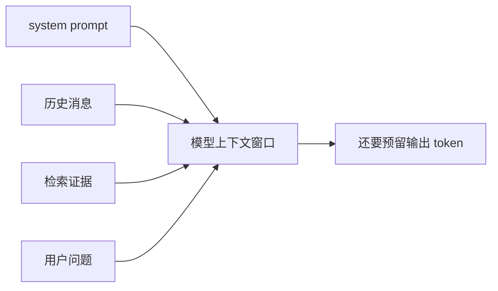
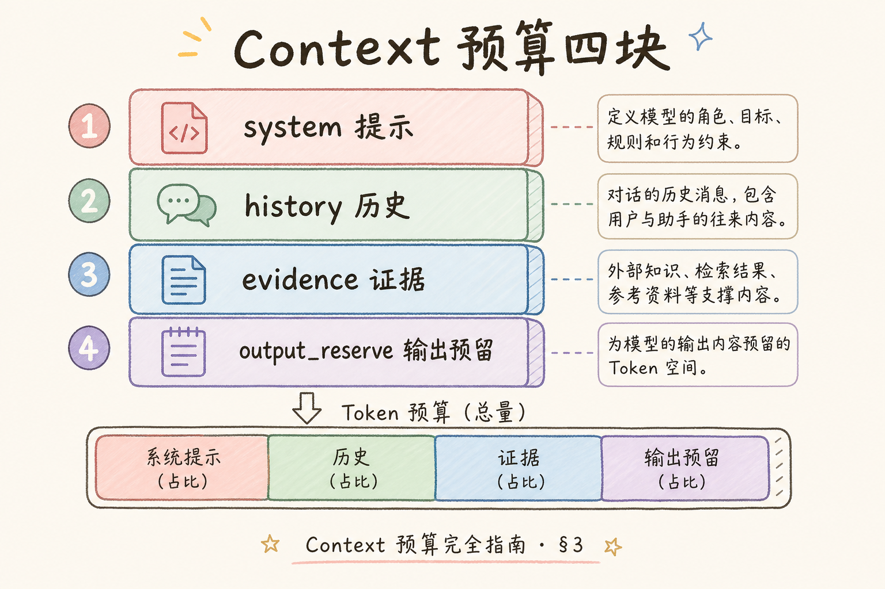
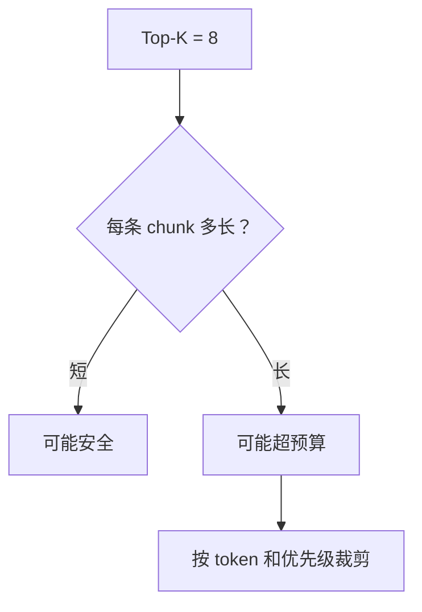
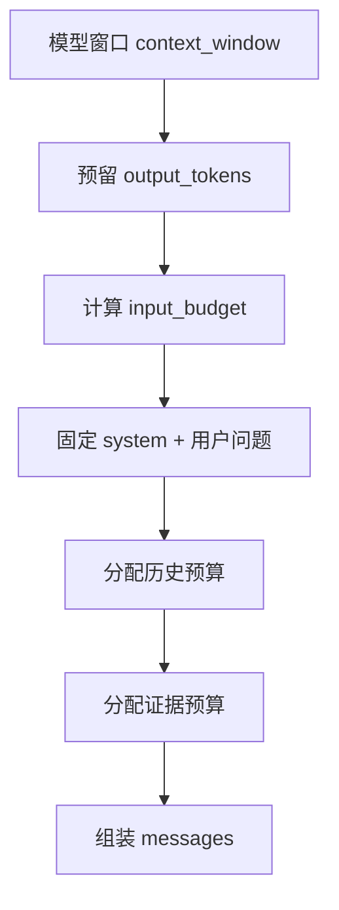
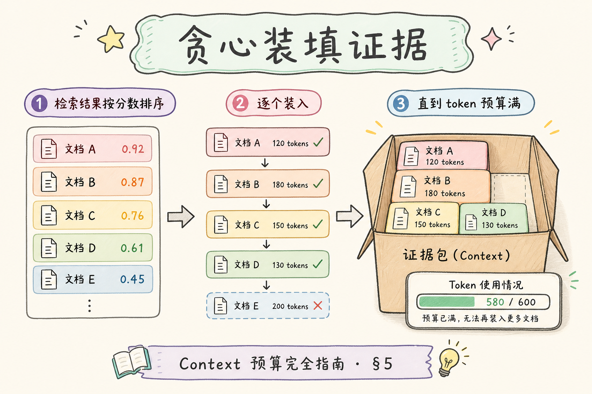
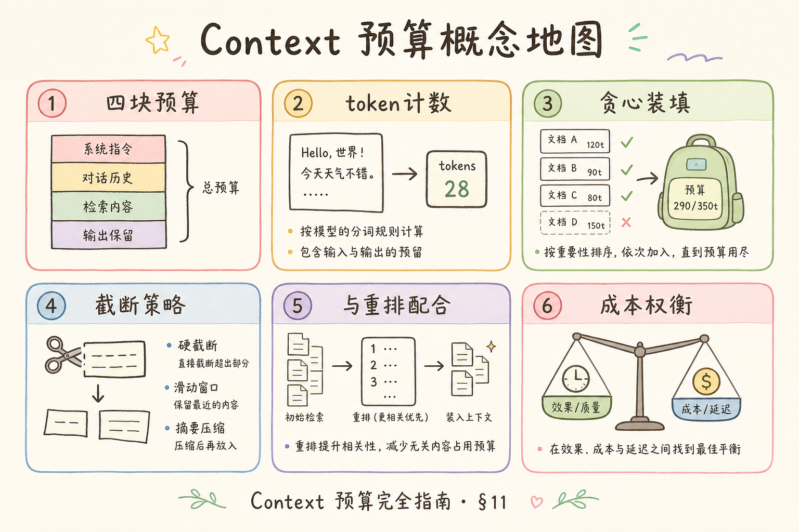

# C5 检索增强（七）：Context 预算分配入门

RAG 不是把检索到的内容全部塞进模型就好。模型上下文窗口再大，也有 token 上限；证据、历史消息、系统提示词和输出空间都要占预算。**Context 预算分配**就是在生成答案前，决定哪些内容能进上下文、每块最多占多少 token。

本文面向已经了解 Top-K、去重和 MMR 的初学者。读完后，你应该能拆分上下文预算，写出一个最小预算计算器，并知道裁剪时先砍什么、不能砍什么。

## 目录

- [1. Context 预算解决什么问题](#1-context-预算解决什么问题)
- [2. 四块账单：system、历史、证据、输出](#2-四块账单system历史证据输出)
- [3. 预算和 Top-K 的区别](#3-预算和-top-k-的区别)
- [4. 预算分配流程](#4-预算分配流程)
- [5. 最小预算计算器](#5-最小预算计算器)
- [6. 裁剪顺序：先砍谁](#6-裁剪顺序先砍谁)
- [7. 与去重、MMR 和引用的关系](#7-与去重mmr-和引用的关系)
- [8. 常见错误](#8-常见错误)
- [9. FAQ](#9-faq)
- [10. 总结](#10-总结)

## 1. Context 预算解决什么问题

**Context** 是模型本次调用能看到的全部输入，包括 system prompt、用户问题、历史消息、检索证据和格式要求。预算分配解决的是“这么多内容里，哪些最值得放进去”。



如果不做预算，常见结果是：历史消息无限追加，证据被截断，引用编号错乱，最后模型看不到关键资料。

生产环境里，预算问题往往表现为 **“检索明明命中了，答案却说不知道”**：不是召回失败，而是证据在组装 prompt 时被历史消息或过长 metadata 挤掉。另一种表现是 **引用 `[3]` 但上下文只有两条**——裁剪发生在编号之后。预算分配的目标，是让每一 token 都有明确用途，而不是把窗口当成无限垃圾桶。

### 案例

某 16K 窗口的企业助手：`system` 约 800 token，用户当前问题 100 token，多轮历史累计 6K token，检索返回 8 条 chunk 共 9K token，再预留 2K 输出——合计已超窗口。若不裁剪，框架可能静默截断 **尾部证据**，而用户第二轮问的正是尾部里的审批流程。按本文第四节表格重新分配：历史压到 2K（摘要最近三轮）、证据预算 10K、先经过去重与 MMR 再按分数贪心装填，同一问题能稳定带上审批 chunk。验收方式：在 trace 里记录 `evidence_tokens_used` 与 `history_tokens_used`，超预算请求应可告警而非静默截断。

## 2. 四块账单：system、历史、证据、输出

一次 RAG 调用至少有四块 token 账单：

| 部分 | 说明 | 是否可压缩 |
| --- | --- | --- |
| system | 行为规则、安全边界、回答格式 | 少量可压缩 |
| 历史 | 多轮对话上下文 | 可摘要或裁剪 |
| 证据 | 检索 chunk、引用编号、metadata | 可选择和裁剪 |
| 输出 | `max_tokens` 预留空间 | 必须预留 |

输出预算特别容易被忘记。如果模型窗口是 16K，你不能把输入塞满 16K，否则模型没有空间生成答案。

## 3. 预算和 Top-K 的区别

Top-K 是“取几条检索结果”，预算是“这些内容总共占多少 token”。两者不是一回事。

| 情况 | 风险 |
| --- | --- |
| Top-K 小但 chunk 很长 | 仍可能爆上下文 |
| Top-K 大但 chunk 很短 | 可能还能放下 |
| 只按条数裁剪 | 无法控制真实 token |
| 只按 token 裁剪 | 可能破坏引用和段落完整性 |





所以生产 RAG 应该记录每个 chunk 的 token 估算，而不是只记录条数。

## 4. 预算分配流程

推荐流程是先确定模型窗口，再预留输出，再给各部分分配输入预算。



一个 16K 窗口的保守起点：

| 部分 | 起点 |
| --- | --- |
| 输出 | 2K |
| system + 格式 | 1K |
| 历史 | 2K |
| 检索证据 | 10K |
| 缓冲 | 1K |

这只是起点。FAQ 型问答可以给证据更多预算，多轮助手则要给历史更多预算。

## 5. 最小预算计算器

下面用字符数粗略估算 token。真实项目建议接 tokenizer，但这个版本足够展示预算思路。



```python
def estimate_tokens(text: str) -> int:
    return max(1, len(text) // 2)


def select_chunks(chunks: list[dict], evidence_budget: int) -> list[dict]:
    selected = []
    used = 0
    for chunk in chunks:
        cost = estimate_tokens(chunk["text"])
        if used + cost > evidence_budget:
            continue
        selected.append(chunk)
        used += cost
    return selected


chunks = [
    {"id": "c1", "text": "住宿上限为 600 元。"},
    {"id": "c2", "text": "超标住宿需要部门负责人审批。"},
    {"id": "c3", "text": "发票需在 30 天内提交。"},
]

print(select_chunks(chunks, evidence_budget=20))
```

这个示例的重点是：每个 chunk 进入上下文前都要“付 token 账单”。如果预算不够，就不能简单硬塞。

真实项目应在入库或检索阶段缓存每条 chunk 的 `token_count`（用模型对应 tokenizer 计算），避免每次组装 prompt 时重复估算。字符 `// 2` 只适合教学演示；中英文混排、代码块、表格会让粗估偏差很大，缓冲区应相应加大。

### 先错对已

```text
-- ❌ Top-K=8 就认为安全：单条 3K token 的 chunk 两条就爆窗
-- ❌ 输入塞满 16K，max_tokens 仍设 2K：生成阶段被截断或报错
-- ❌ 先给证据编号 [1]～[8]，再按 token 砍掉 [6]～[8]：答案仍引用 [7]

-- ✅ 先算 input_budget = context_window - output_tokens - buffer
-- ✅ 去重、MMR、精排后再装填证据，整段丢弃低分 chunk
-- ✅ 最终入选证据确定后再生成 source_id / 引用编号
```

## 6. 裁剪顺序：先砍谁

裁剪不是随机截断。建议按优先级处理：

| 优先级 | 内容 |
| --- | --- |
| 不能砍 | 安全规则、用户当前问题、必要输出格式 |
| 优先保留 | 高分证据、带引用的关键 chunk |
| 可压缩 | 历史消息、长 metadata |
| 可丢弃 | 低分候选、重复 chunk、过长示例 |

如果必须裁剪证据，尽量整段丢弃，不要从 chunk 中间截断到引用编号和正文不一致。

## 7. 与去重、MMR 和引用的关系

预算分配不是孤立步骤，它依赖前面的检索治理：

| 前置步骤 | 对预算的帮助 |
| --- | --- |
| 去重 | 避免重复 chunk 占预算 |
| MMR | 让有限预算覆盖更多角度 |
| 精排 | 把预算留给更相关证据 |
| 引用编号 | 裁剪后要重新生成或校验编号 |

如果先编号再裁剪，很容易出现答案引用 `[4]`，但上下文里已经没有第 4 条证据。更稳妥的做法是：最终选定证据后再编号。

## 8. 常见错误

这一节列出 Context 预算最常见的问题。核心原则是：上下文窗口是资源，不是垃圾桶。

### 8.1 只数条数不算 token

Top-K 不能代表真实长度。长 chunk 一条就可能占掉大量预算。

### 8.2 忘记预留输出空间

输入塞满窗口后，模型没有空间生成答案。必须预留 `max_tokens`。

### 8.3 裁剪后引用号错乱

证据裁剪后要重新编号或校验引用。不要让答案引用不存在的来源。

### 8.4 历史消息无限追加

多轮对话需要摘要、窗口裁剪或只保留相关历史。不能把所有历史永久塞入上下文。

### 8.5 metadata 太肥

metadata 里放长路径、全文、权限列表，会挤占正文证据预算。只放生成答案必要字段。

### 排错

1. **答案漏关键事实**：查 trace 中最终进 prompt 的 chunk 列表，对比检索原始 top-k，看是预算裁掉还是去重裁掉
2. **引用编号不存在**：确认编号在 **最终装填后** 生成；若用固定模板，裁剪后应重跑 `format_context`
3. **偶发超长报错**：检查是否某条 chunk 单条大于 `evidence_budget`；应整段跳过或先摘要再装入
4. **历史越长越差**：历史未摘要时线性吃预算；对超过 N 轮的对话做 rolling summary
5. **成本突然升高**：长上下文模型 + 无预算装填会把整库片段塞入；用 `used_tokens` 指标监控 P95

### 评测

准备 20～40 条 **长 chunk 或多轮对话** 样例，固定 `context_window` 与 `output_tokens`，对比不同预算方案：

| 指标 | 说明 |
| --- | --- |
| 证据装填率 | 检索 top-k 中有多少条最终进入 prompt |
| 引用有效率 | 答案引用的 source_id 是否都在最终 context 内 |
| 拒答合理性 | 预算不足时是否提示缩窄问题，而非硬答 |
| token 成本 | 单次请求 `prompt_tokens` P50/P95 |

调参顺序：先锁定输出预留与 system 固定开销 → 再在历史与证据之间按任务类型（FAQ vs 多轮协作）分比例 → 最后微调贪心装填顺序（通常高分优先）。

## 9. FAQ

**Q1：长上下文模型是不是不用预算？**  
不是。长上下文更贵、更慢，也更容易引入噪声。预算仍然必要。

**Q2：token 估算必须完全准确吗？**  
生产最好用模型对应 tokenizer。早期可以粗估，但要留缓冲。

**Q3：历史和证据谁更重要？**  
看任务。事实问答通常证据更重要；多轮协作任务历史更重要。不要固定一刀切。

**Q4：预算不足时应该返回拒答吗？**  
如果关键证据放不下，可以提示问题过宽、建议缩小范围；不要用残缺证据硬答。

## 10. 总结

Context 预算分配的目标是把有限窗口留给最有价值的信息。



初学者先做到四点：

1. 明确 system、历史、证据、输出四块预算。
2. 按 token 估算，而不是只看 Top-K 条数。
3. 去重、MMR、精排后再组装上下文。
4. 裁剪后重新校验引用编号和证据完整性。

当答案开始漏证据、引用错乱或上下文超限时，先检查预算分配，而不是盲目换更大的模型。

### 本篇检查清单

- [ ] 明确四块账单：system、历史、证据、输出，且预留 `max_tokens`
- [ ] 每条 chunk 有 token 估算或缓存，装填按 token 而非仅条数
- [ ] 去重、MMR、精排完成后再做证据装填，低分整段丢弃
- [ ] 引用编号在最终 context 确定后生成，裁剪后校验 source_id
- [ ] trace 记录各块 `*_tokens_used`，超预算可观测、可告警

下一步可读 [108 Long Context Reorder](108.long-context-reorder-tutorial.md)：预算装填后的证据顺序如何影响模型利用率。
