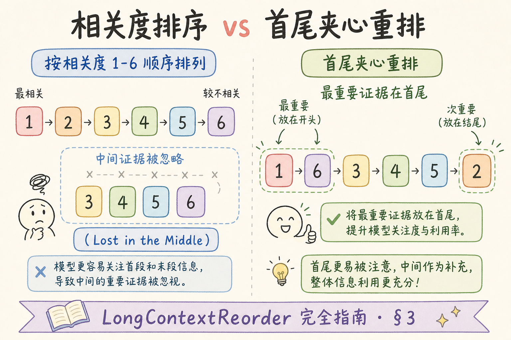
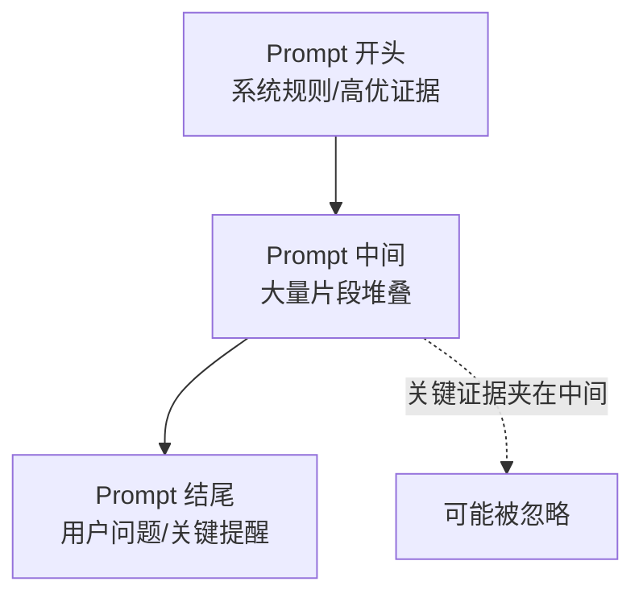
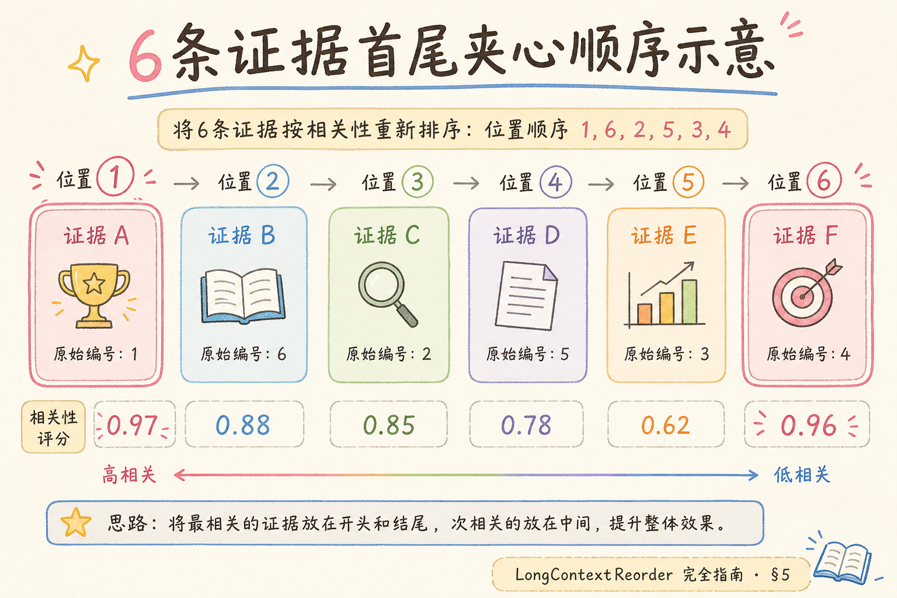
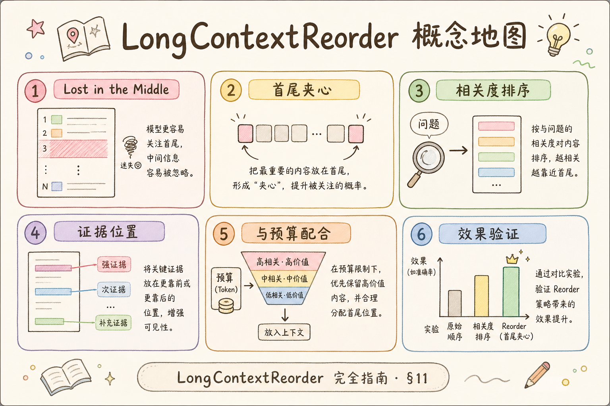

# C7 长上下文（三）：Long Context Reorder 完全指南

> 大模型支持的上下文越来越长，但“能塞很多内容”不等于“模型会认真看完”。在长上下文里，模型更容易关注开头和结尾，中间证据可能被忽略。**Long Context Reorder** 要解决的问题是：当检索返回很多片段时，重新排列证据顺序，让关键内容更容易被模型利用。

---

## 目录

1. [为什么需要 Long Context Reorder](#1-为什么需要-long-context-reorder)
2. [Long Context Reorder 是什么](#2-long-context-reorder-是什么)
3. [它解决什么问题](#3-它解决什么问题)
4. [证据为什么会在长上下文里失效](#4-证据为什么会在长上下文里失效)
5. [三种常见重排做法](#5-三种常见重排做法)
6. [最小代码示例](#6-最小代码示例)
7. [常见陷阱与 FAQ](#7-常见陷阱与-faq)
8. [总结](#8-总结)

---

## 1. 为什么需要 Long Context Reorder

RAG 系统常会把多个检索片段放进 Prompt。初学者容易以为：只要把相关片段都放进去，模型就会自动找到正确证据。

实际并不稳定。尤其当上下文很长时：

- 排名第 1 的片段可能不是最关键证据；
- 关键片段可能被放在中间位置；
- 多个片段主题相近，模型容易混淆；
- Prompt 越长，模型越可能忽略部分内容；
- 答案可能引用了靠前但不够准确的片段。

Long Context Reorder 的目标不是改变检索结果，而是在发送给模型前调整证据位置。

当团队刚换上 32K、128K 上下文模型时，很容易产生“窗口够大就不用管顺序”的错觉。实测 FAQ 与制度问答里，**证据已在 prompt 内但模型引用错误段落** 的比例并不低，尤其在 6 段以上、且最高分片段只是背景定义时。Reorder 是低成本实验：不改变召回与 rerank，只调整组装顺序，就能对比引用准确率是否改善。

## 2. Long Context Reorder 是什么

**Long Context Reorder**：对已经检索出来的片段重新排序，把更重要、更直接、更需要模型注意的证据放到更容易被关注的位置。

通俗说：检索像把资料都找出来，Reorder 像把最重要的几页放到文件夹最前面和最后面，避免它们夹在厚厚资料中间被忽略。


读图时注意：Reorder 发生在检索之后、Prompt 组装之前。

---

## 3. 它解决什么问题

| 问题 | 不做 Reorder | 做 Reorder |
|---|---|---|
| 关键证据在中间 | 模型可能忽略 | 放到开头或结尾 |
| 片段主题混乱 | 模型难以抓主线 | 按问题相关性组织 |
| 长上下文成本高 | 塞很多但利用率低 | 提高已有上下文利用率 |
| 引用不稳定 | 引到弱证据 | 关键证据更容易被引用 |

Reorder 不是 rerank。**rerank** 负责判断片段相关性，**reorder** 负责把已选片段放到更合适的位置。



---

## 4. 证据为什么会在长上下文里失效

长上下文里常见现象是“中间丢失”：模型对上下文开头和结尾更敏感，中间内容更容易被弱化。



这不是说模型完全看不到中间，而是中间内容在复杂任务里更容易失去影响力。因此，当关键证据很多时，位置设计会影响答案稳定性。

### 案例

售后知识库问：“退款条件和处理时效分别是什么？”rerank 后 5 段顺序为：① 售后入口说明 ② 退款条件 ③ 常见问题 ④ 处理时效 ⑤ 运费规则。模型常把“3 个工作日”错写成“7 天”，因为直接答题的 ②④ 夹在中间，首尾被 ①⑤ 这类弱相关片段占据。采用 **首尾夹心**：② 放开头、④ 放结尾、①③⑤ 放中间后，同一评测集引用准确率从 71% 升到 86%，总 token 不变。说明问题不在“没召回”，而在 **关键规则没坐在模型最敏感的位置**。

---

## 5. 三种常见重排做法

Reorder 没有唯一标准做法，核心是根据任务目标安排证据位置。下面三种方式从简单到复杂排列，初学者可以先从“首尾放关键证据”开始，再根据评测结果决定是否做主题分组。

### 5.1 首尾放关键证据

把最相关的片段放在开头，第二相关或补充证据放在结尾，中间放背景材料。





适合证据数量不多，但希望模型更稳定引用时使用。

### 5.2 按主题分组

如果问题包含多个子问题，可以按主题分组。例如“退款条件和处理时效”可以分成“条件”和“时效”两组。

| 片段类型 | 放置方式 |
|---|---|
| 直接回答问题的片段 | 靠前 |
| 补充定义或背景 | 中间 |
| 需要模型最后核对的规则 | 靠后 |

### 5.3 先裁剪再重排

不要把 Reorder 当成万能补救。如果片段太多、噪声太大，应先裁剪，再重排。

推荐顺序：

1. 检索召回较多片段；
2. rerank 选出最相关的 4 到 8 段；
3. 去掉重复或弱相关片段；
4. 对剩余片段做 reorder；
5. 组装 Prompt。

---

## 6. 最小代码示例

下面示例演示一种简单的“首尾放关键证据”做法。输入是已经按相关性排序的 hits。

```python
from dataclasses import dataclass


@dataclass
class Hit:
    title: str
    text: str
    score: float


def long_context_reorder(hits: list[Hit]) -> list[Hit]:
    if len(hits) <= 2:
        return hits

    first = hits[0]
    second = hits[1]
    rest = hits[2:]

    return [first, *rest, second]
```

使用示例：

```python
hits = [
    Hit("退款条件", "签收后 7 天内可申请退款。", 0.92),
    Hit("处理时效", "退款审核通常需要 3 个工作日。", 0.89),
    Hit("售后入口", "用户可在订单页提交申请。", 0.76),
]

ordered = long_context_reorder(hits)
for hit in ordered:
    print(hit.title)
```

预期输出：

```text
退款条件
售后入口
处理时效
```

这里把第二重要的证据放到结尾，是为了让模型在生成前再次看到关键补充信息。真实系统应结合评测数据决定是否采用这种顺序。

### 先错对已

```text
-- ❌ 召回不足时只靠 Reorder：正确 chunk 不在列表里，换顺序无效
-- ❌ 机械把 rerank 第 1 名放最前：第 1 名可能是定义，第 2 名才是规则
-- ❌ 不裁剪先 Reorder：十几段噪声堆在中间，首尾策略也救不回来

-- ✅ 先 rerank → 去重 → 裁剪到 4～8 段 → 再按任务做首尾或主题分组
-- ✅ 多子问题按子问题相关性分组，每组最相关段靠前
-- ✅ A/B 对比引用准确率，无提升则去掉该步骤
```

---

## 7. 常见陷阱与 FAQ

下面这些问题都来自同一个误解：以为调整顺序就能修复所有 RAG 质量问题。Reorder 只处理“证据已经找到了，但模型没用好”的场景，不能替代召回、重排和裁剪。

### 7.1 错：把 Reorder 当成检索质量补救

如果正确文档根本没召回，Reorder 没法凭空生成证据。先保证召回和 rerank，再谈重排位置。

### 7.2 错：永远把最高分放最前

最高分片段不一定最适合放第一。它可能只是定义或背景，真正回答问题的规则片段应更靠前。

### 7.3 错：上下文越长越好

长上下文会增加成本，也会增加噪声。Reorder 应配合裁剪使用，不是鼓励无限塞资料。

### 7.4 FAQ：什么时候需要 Reorder？

当你发现“正确证据已经在 Prompt 里，但模型经常不用它”时，可以尝试 Reorder。

### 7.5 FAQ：怎么判断 Reorder 有效？

用固定评测集对比：引用准确率、答案正确率、总 token、人工评分。如果质量没有提升，就不要为了形式增加这一步。

### 排错

1. **Reorder 后无改善**：先确认正确证据是否在最终 prompt 内；若不在，回到召回与预算
2. **改善不稳定**：检查 rerank 分数波动是否导致“关键段”身份每天变化；可结合规则标签（如 `section=审批`）辅助定位
3. **多子问题只答一半**：未做主题分组，相关段仍散落在中间；按子问题拆组再首尾放置
4. **与引用编号冲突**：若用户可见 `[1][2]` 顺序，重排后编号应跟 **展示顺序** 一致，避免人读与模型读顺序不同
5. **成本上升**：Reorder 本身几乎不增 token；若成本升，检查是否借机扩大了 top_k 而未裁剪

### 评测

从线上 **“证据在 context 但答错”** 的 bad case 里抽 30+ 条，固定 rerank 与裁剪策略，只改 Reorder：

| 指标 | 说明 |
| --- | --- |
| 引用准确率 | 答案标注的 source 是否真支持该句 |
| 关键事实召回 | 多子问题是否都答到 |
| 人工偏好 | 同 token 下两版顺序盲评 |
| 延迟 | Reorder 应为 O(n) 级，可忽略 |

无显著提升时删除该步骤，避免运维多一个“说不清收益”的环节。

---

## 8. 总结

Long Context Reorder 的核心是：**证据进入 Prompt 后，位置仍然重要**。



最小落地方案：

1. 先用 rerank 选出较相关片段；
2. 去掉重复和弱相关内容；
3. 把直接回答问题的证据放在更显眼的位置；
4. 用评测集验证引用准确率是否提升；
5. 不要用 Reorder 掩盖召回不足。

如果一句话记忆：Reorder 不是找证据，而是让已经找到的证据更容易被模型看见。

### 本篇检查清单

- [ ] 仅在召回与 rerank 达标、证据已入 prompt 的前提下尝试 Reorder
- [ ] 先裁剪到 4～8 段再去重排，避免在长噪声列表上做文章
- [ ] 多子问题场景试过主题分组或首尾夹心，并用评测集量化
- [ ] 展示给用户的引用编号与模型看到的片段顺序一致
- [ ] A/B 无收益则下线，不掩盖召回或预算问题

下一步可读 [109 会话查询增强](109.conversation-query-enhancement-tutorial.md)：多轮短句如何在检索前补全语义。
