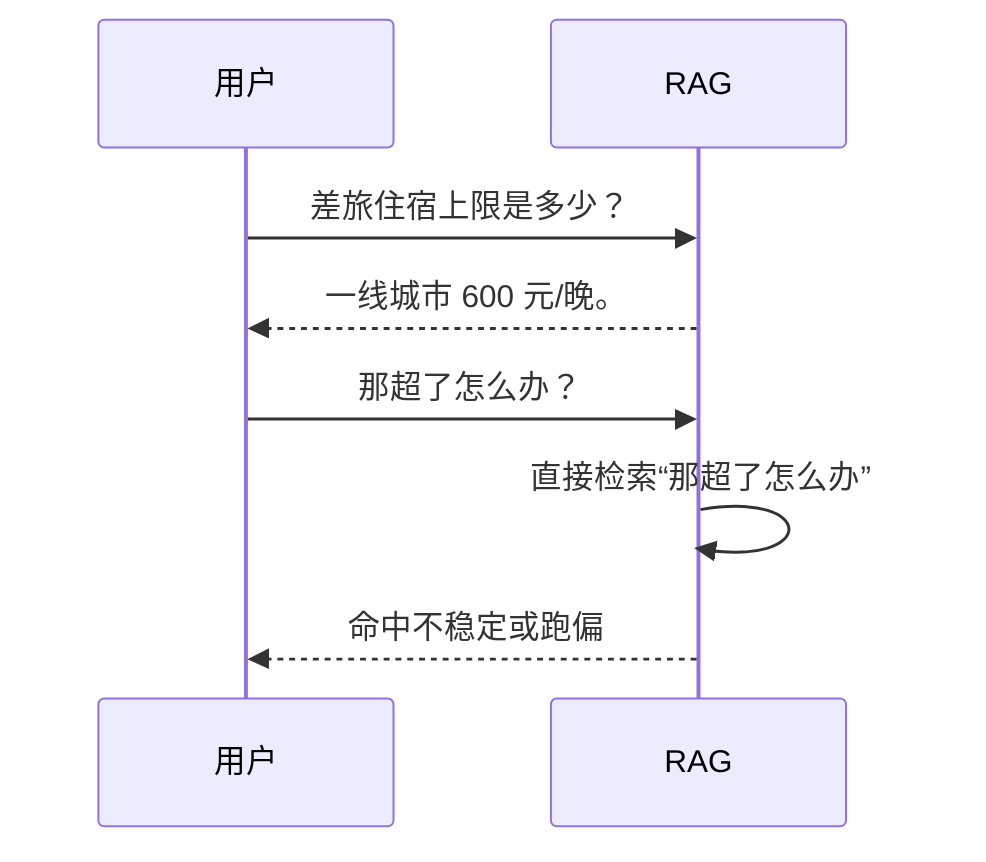
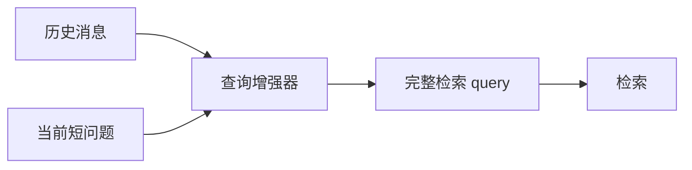
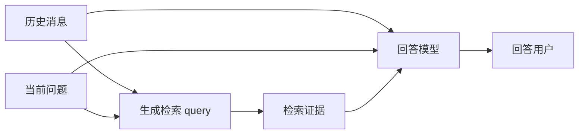
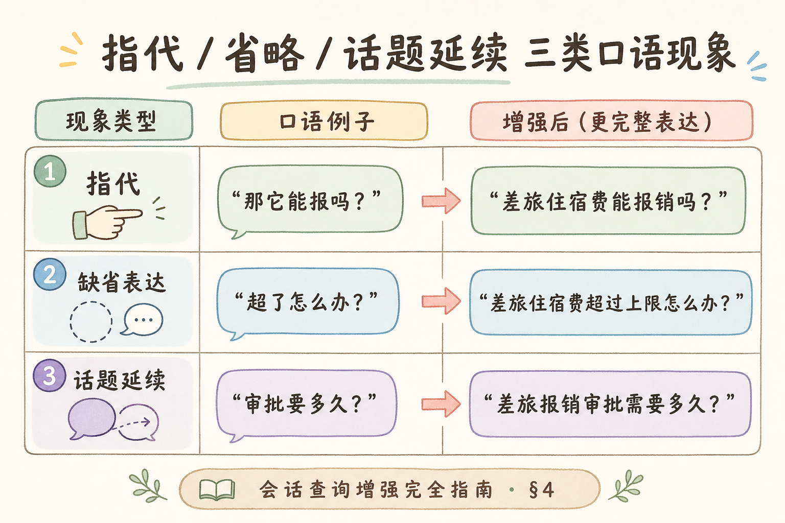

# C5 检索增强（九）：会话历史查询增强入门

多轮 RAG 里，用户经常不会把每句话都说完整。第一句问“差旅住宿上限是多少”，第二句只说“那超了怎么办？”如果第二句直接拿去检索，系统可能不知道“那”指的是差旅住宿。**会话历史查询增强**就是在检索前，用历史消息把当前问题补全。

本文面向已经了解 Query Rewriting 和 Context 预算的初学者。读完后，你应该能处理指代、缺省表达和话题延续，并知道如何避免改写时编造用户没说过的内容。

## 目录

- [1. 多轮查询为什么会翻车](#1-多轮查询为什么会翻车)
- [2. 三类口语现象](#2-三类口语现象)
- [3. 查询增强在链路中的位置](#3-查询增强在链路中的位置)
- [4. 规则改写与 LLM 改写](#4-规则改写与-llm-改写)
- [5. 最小 Python 示例](#5-最小-python-示例)
- [6. 历史裁剪与预算](#6-历史裁剪与预算)
- [7. 日志、评测和回滚](#7-日志评测和回滚)
- [8. 常见错误](#8-常见错误)
- [9. FAQ](#9-faq)
- [10. 总结](#10-总结)

## 1. 多轮查询为什么会翻车

第二轮问题经常依赖第一轮语境。用户觉得上下文很明显，但检索器只看到当前句子。



正确做法是在检索前把第二句补全成：

```text
差旅住宿费用超过报销上限时应该如何审批或处理？
```

这样检索器才能找到相关制度。

多轮场景里，用户默认 **“你记得我刚才说了什么”**，但向量检索和 BM25 都没有这种记忆。第二轮若直接检索原句，命中分布往往向“泛化问答”漂移——例如“超了怎么办”可能命中离职补偿、采购超标等无关制度。查询增强的本质是 **把对话语境翻译成检索器能理解的独立问句**，且只影响检索 query，不改变用户界面上看到的原话。

## 2. 三类口语现象

会话查询增强主要处理三类现象：

| 类型 | 例子 | 增强后 |
| --- | --- | --- |
| 指代 | “那它能报吗？” | “差旅住宿费能报销吗？” |
| 缺省表达 | “超了怎么办？” | “差旅住宿费超过上限怎么办？” |
| 话题延续 | “审批要多久？” | “差旅报销审批需要多久？” |

**指代**是用“它、这个、那种”指向前文对象。  
**缺省表达**是把前文已经出现的信息省掉。  
**话题延续**是继续沿着同一主题追问。



增强的目标是补全检索语义，不是改写最终回答。

## 3. 查询增强在链路中的位置

会话查询增强发生在检索前，且只影响检索 query。最终回答仍然应该知道用户当前原句和必要历史。




不要把“检索改写 prompt”当成最终回答的 system prompt。它们是两个不同任务。

回答模型需要知道用户原句以保持礼貌和指代自然；检索 query 则需要 **自洽、完整、可字面或语义匹配文档**。同一轮请求里，这两个字符串常常不同，这是正常现象，不是 bug。

### 案例

内部 HR 助手连续对话：用户先问“产假有多少天”，助手答“按工龄 98 天起”，用户再问“那陪产假呢”。若直接检索“那陪产假呢”，top-k 常混入产假条文。增强为“陪产假有多少天、如何申请”后，命中 `parental-leave-2025` 相关 chunk。另一例：用户问完住宿上限后说“审批要多久”——若错误继承三天前的报销话题，会检索到错误流程；此时应检测 **话题切换**（新实体、新动词）并减少历史继承。两个 case 说明：增强要 **补语境**，不能 **编语境**。

## 4. 规则改写与 LLM 改写

简单场景可以先用规则。例如当前问题包含“那”“这个”“它”，就把最近一轮主题补进去。



LLM 改写适合更复杂的自然语言。可用 Prompt：

```text
请根据会话历史，把当前问题改写成一条适合检索的完整问题。
要求：
1. 只补全历史中明确出现的信息。
2. 不要回答问题。
3. 不要引入新的主题、数字或结论。
4. 输出一句话。

会话历史：
{history}

当前问题：
{current_question}
```

关键护栏是“只补全明确出现的信息”。如果历史只谈住宿，改写器不能把“超了怎么办”扩成“交通和住宿超标怎么办”。

## 5. 最小 Python 示例

下面示例用规则方式演示补全。真实项目可以替换成 LLM 改写器。

```python
def enhance_query(history: list[str], current: str) -> str:
    last_topic = ""
    for message in reversed(history):
        if "住宿" in message:
            last_topic = "差旅住宿费"
            break

    if last_topic and ("那" in current or "超了" in current):
        return f"{last_topic}{current.replace('那', '')}"
    return current


history = [
    "用户：差旅住宿上限是多少？",
    "助手：一线城市 600 元/晚。",
]

print(enhance_query(history, "那超了怎么办？"))
```

预期输出会包含“差旅住宿费超了怎么办”。这不是完整生产方案，但能说明查询增强的输入输出。

### 先错对已

```text
-- ❌ 检索用原句，只在生成阶段把历史塞进 prompt：检索已错过正确 doc
-- ❌ LLM 改写无护栏：把“超了怎么办”扩成“交通和住宿超标”
-- ❌ 把增强后的 query 展示给用户：内部检索语句可读性差

-- ✅ 检索前增强；回答阶段仍用原句 + 必要历史
-- ✅ Prompt 强调“只补全历史中明确出现的信息”
-- ✅ trace 记录 original_query、enhanced_query、history_window
```

## 6. 历史裁剪与预算

查询增强不需要读取全部历史。通常只需要最近几轮和当前话题摘要。

| 历史类型 | 建议 |
| --- | --- |
| 最近 1-3 轮 | 优先保留 |
| 很久以前的话题 | 默认不放入改写 |
| 长对话 | 先做会话摘要 |
| 敏感信息 | 按权限和安全策略过滤 |

如果把全部历史都给改写器，容易出现两个问题：成本高；旧话题干扰当前问题。

增强器本身也消耗 token：若每轮把 10 轮全文历史塞进改写 prompt，可能还没检索就先触达上下文上限。实践上常见做法是 **最近 1～3 轮原文 + 可选话题摘要一行**，与 [107 Context 预算](107.context-budget-tutorial.md) 里给历史的额度对齐。

## 7. 日志、评测和回滚

会话查询增强必须记录：

| 字段 | 用途 |
| --- | --- |
| 当前原句 | 判断用户真实表达 |
| 使用的历史窗口 | 排查是否引用旧话题 |
| 改写后 query | 判断是否补全正确 |
| 命中文档 | 判断检索是否改善 |
| 开关状态 | 支持快速回滚 |

评测集要包含多轮样例，而不是只测单轮问题。例如“它”“这个”“上一条”“超了怎么办”都要覆盖。

### 排错

1. **第二轮起命中率骤降**：查是否跳过增强；检索 API 是否只收到 `current_question`
2. **改写后检索更差**：打印 `retrieval_query` 是否编造主题；收紧 prompt 或缩短历史窗口
3. **换话题仍继承旧主题**：加话题切换检测（新实体与历史无关时跳过增强）
4. **延迟升高**：每轮都调 LLM 改写成本高；完整问句可跳过，指代/缺省才增强
5. **权限问题**：历史消息跨租户或越权角色；增强器输入应经同一套 ACL 过滤

### 评测

构建 **多轮评测集**（每会话 2～4 轮），至少覆盖指代、缺省、话题延续、换话题四类：

| 指标 | 说明 |
| --- | --- |
| 检索 hit@k | 改写后是否命中期望 doc/chunk |
| 改写忠实度 | 是否引入历史未出现的实体（人工或规则） |
| 跳过准确率 | 完整问句是否未误改写 |
| 端到端答案 | 增强开关对最终正确率的影响 |

建议与 [Query Rewriting](105.query-rewriting-tutorial.md) 分步评测：先量化会话补全收益，再叠加术语改写，避免两个改写器同时上线无法归因。

建议保留 **增强开关**：线上 A/B 或按租户回滚，避免改写模型升级引发整体退化。

## 8. 常见错误

这一节列出多轮查询增强最常见的坑。核心原则是：补全语境，不扩写需求。

### 8.1 检索用原句，生成才带历史

这样检索阶段已经错过资料。历史补全必须发生在检索前。

### 8.2 改写器编造主题

历史没有出现的对象，不能被改写器补进去。否则检索会跑偏。

### 8.3 无限历史进入改写

旧话题会干扰当前问题。要限制历史窗口或使用会话摘要。

### 8.4 改写结果不记录

不记录改写 query，线上问题很难排查。至少要在 trace 日志里保存。

### 8.5 把改写后的 query 展示给用户

改写 query 是内部检索语句，不一定适合用户阅读。界面上通常保留用户原句。

## 9. FAQ

**Q1：每一轮都要做查询增强吗？**  
不一定。当前问题已经完整时，可以跳过。可以用规则或分类器判断是否需要增强。

**Q2：改写后还要做 Query Rewriting 吗？**  
可以。先做会话补全，再做术语改写，但要分别评测收益。

**Q3：会话历史会不会泄露权限外内容？**  
可能。多租户或权限系统里，历史消息也要按用户权限和租户边界处理。

**Q4：怎么处理用户换话题？**  
如果当前问题出现新主题，不要强行继承旧话题。可以把它作为新检索 query。

## 10. 总结

会话历史查询增强的价值是把多轮短句补成可检索的问题。


初学者先做到四点：

1. 在检索前补全指代、缺省表达和话题延续。
2. 只补全历史中明确出现的信息。
3. 控制历史窗口，避免旧话题干扰。
4. 记录原句、历史窗口、改写 query 和命中结果。

当第二轮、第三轮问题经常“单独搜不出来”时，应优先检查会话查询增强，而不是只调大 Top-K。

### 本篇检查清单

- [ ] 检索前完成查询增强，生成链路仍使用用户原句
- [ ] 改写只补全历史明确信息，prompt 含“不回答问题、不引入新主题”
- [ ] 历史窗口限制在最近 1～3 轮或话题摘要，换话题可跳过增强
- [ ] trace 记录原句、窗口、改写 query、命中结果，支持开关回滚
- [ ] 多轮评测集覆盖指代/缺省/延续/换话题，并与术语改写分步评测

下一步可读 [110 RAG Prompt 模板](110.rag-prompt-template-tutorial.md)：检索与增强完成后，如何把证据与规则交给生成模型。
