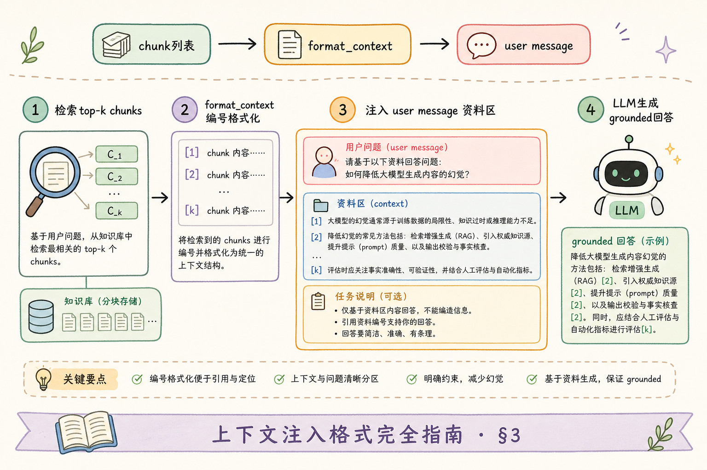
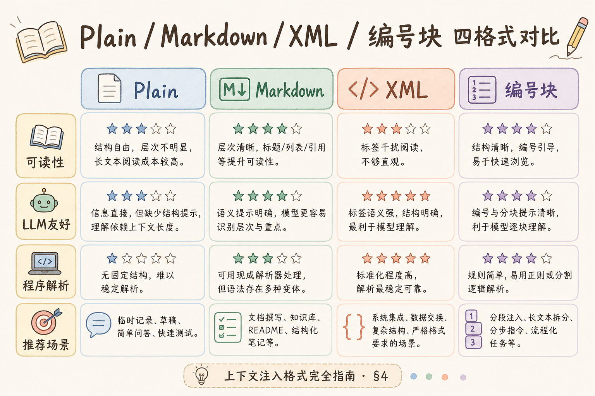
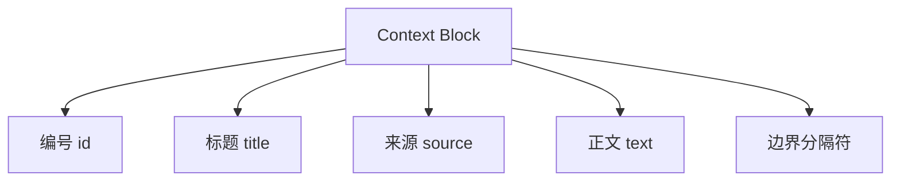
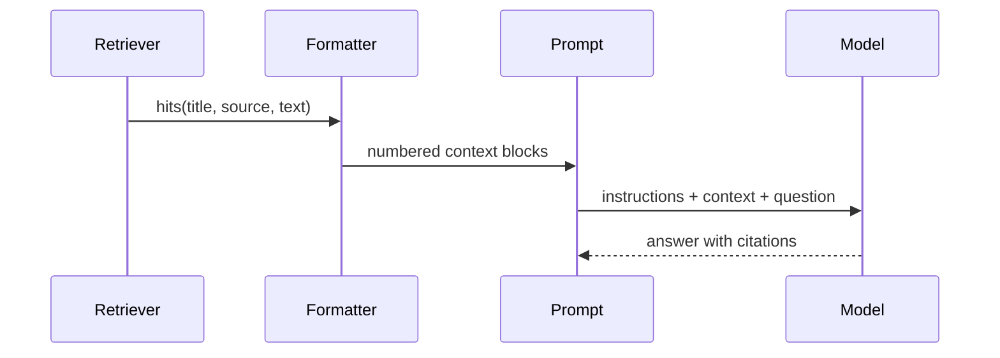

# C7 长上下文（六）：Context Injection Format 完全指南

> RAG 不是把检索片段随便粘到 Prompt 里就结束了。模型需要知道每段资料的来源、标题、边界和引用编号。**Context Injection Format** 要解决的问题是：用稳定格式把检索证据注入 Prompt，让模型更容易理解证据、引用证据，并在资料不足时拒答。

---

## 目录

1. [为什么需要 Context Injection Format](#1-为什么需要-context-injection-format)
2. [Context Injection Format 是什么](#2-context-injection-format-是什么)
3. [它解决什么问题](#3-它解决什么问题)
4. [一个好格式应该包含什么](#4-一个好格式应该包含什么)
5. [三种常见格式](#5-三种常见格式)
6. [最小代码示例](#6-最小代码示例)
7. [常见陷阱与 FAQ](#7-常见陷阱与-faq)
8. [总结](#8-总结)

---

## 1. 为什么需要 Context Injection Format

检索系统返回的通常是一个个 chunk。如果直接拼接：

```text
签收后 7 天内可申请退款。
退款审核需要 3 个工作日。
特殊商品不支持无理由退货。
```

模型可能不知道：

- 每段来自哪个文档；
- 哪些句子属于同一来源；
- 引用编号应该怎么写；
- 如果证据冲突该信哪段；
- 资料不足时应不应该拒答。

所以 RAG 需要一种稳定的上下文注入格式。

在企业知识库、制度问答、合规审查等场景里，用户追问“这句话依据哪条制度”时，如果 Prompt 里只有散乱句子，运营和法务都无法复现当时模型看到了什么。注入格式因此不只是工程细节，而是**证据可追溯**的第一道关口：同一套检索结果，用稳定模板组装后，引用编号、日志回放和坏例评测才能对齐。

---

## 2. Context Injection Format 是什么

**Context Injection Format**：把检索片段转换成模型可读、可引用、边界清晰的 Prompt 上下文格式。

通俗说：检索结果像散乱资料，注入格式像给资料装订、编号、贴标签，再交给模型阅读。


读图时重点看“添加编号/标题/来源”。这一步直接影响答案是否能正确引用。若你的 RAG 已接入 rerank，建议在 formatter 输入侧记录 rerank 前后顺序，方便对比“排序变化是否导致引用错位”。

---

## 3. 它解决什么问题

| 问题 | 随意拼接 | 稳定注入格式 |
|---|---|---|
| 来源不清 | 模型不知道引用哪段 | 每段有 source 和 id |
| 边界混乱 | 多段资料粘成一团 | 每段有明确开始和结束 |
| 引用困难 | 回答无法追溯 | 输出可写 `[1]`、`[2]` |
| Prompt 难调试 | 出错时不知道哪段影响答案 | trace 可定位 hit |
| 格式漂移 | 每个接口拼接方式不同 | 统一模板复用 |

注入格式不是排版问题，而是 RAG 可解释性的基础。很多“模型乱编”的根因，其实是上下文里看不出哪段能引用、哪段只是背景说明。格式稳定后，你可以在日志里直接对比“同一问题、不同格式化版本”对答案的影响，而不必每次手工拼 Prompt 猜原因。



---

## 4. 一个好格式应该包含什么

建议每段证据至少包含：

| 字段 | 作用 |
|---|---|
| `id` | 引用编号 |
| `title` | 文档或章节标题 |
| `source` | 来源链接或文档 ID |
| `text` | 片段正文 |
| `score` | 可选，用于调试，不一定给模型 |





对模型来说，边界非常重要。不要让两个 chunk 直接贴在一起。实践中建议把 `score`、召回排名等调试字段写在服务端日志里，而不是默认塞进给模型的 context——模型容易把分数当成“可信度说明”，反而干扰引用判断。

### 5.0 格式选型粗指南

| 信号 | 倾向 Markdown | 倾向 XML / JSON Lines |
|------|---------------|------------------------|
| 团队以人工读 Prompt 排障为主 | ✓ | |
| 需要程序解析每段字段做校验 | | ✓ |
| Token 预算紧、片段多 | ✓ | |
| 多工具链、日志要机器复现 | | JSON Lines |

三种格式可以组合：内部存储用 JSON Lines，给模型前再渲染成 Markdown 或 XML，既保留结构又兼顾可读性。

---

## 5. 三种常见格式

格式选择没有绝对答案，关键是让模型能读懂、让系统能复现、让人能排查。下面三种格式都能用，区别在于可读性、结构稳定性和 token 成本。

### 5.1 Markdown 编号格式

适合简单项目，易读易调试。

```text
[1] 退款政策
来源：docs/refund.md
内容：用户可在签收后 7 天内申请退款。

[2] 特殊商品说明
来源：docs/special.md
内容：定制商品不支持无理由退货。
```

优点是直观，缺点是字段较自由，后续解析不如 JSON 稳。

### 5.2 XML 风格标签

适合强调边界。

```xml
<document id="1" title="退款政策" source="docs/refund.md">
用户可在签收后 7 天内申请退款。
</document>
```

标签能减少片段混在一起的风险，但 token 会稍多。

### 5.3 JSON Lines 格式

适合工具链处理和日志复现。

```json
{"id":"1","title":"退款政策","source":"docs/refund.md","text":"用户可在签收后 7 天内申请退款。"}
{"id":"2","title":"特殊商品说明","source":"docs/special.md","text":"定制商品不支持无理由退货。"}
```

JSON Lines 结构稳定，但对模型阅读不一定最自然。实际项目可以内部用 JSON，给模型时转成 Markdown 或 XML。无论选哪种，都要在团队内固定“给模型的最终形态”，避免 A/B 接口各拼一套字符串。

---

## 6. 最小代码示例

下面示例把检索 hits 转成 Markdown 编号格式。

```python
from dataclasses import dataclass


@dataclass
class Hit:
    title: str
    source: str
    text: str


def build_context(hits: list[Hit]) -> str:
    blocks = []
    for index, hit in enumerate(hits, start=1):
        blocks.append(
            f"[{index}] {hit.title}\n"
            f"来源：{hit.source}\n"
            f"内容：{hit.text}"
        )
    return "\n\n".join(blocks)
```

使用方式：

```python
hits = [
    Hit("退款政策", "docs/refund.md", "用户可在签收后 7 天内申请退款。"),
    Hit("特殊商品说明", "docs/special.md", "定制商品不支持无理由退货。"),
]

context = build_context(hits)
print(context)
```

然后把它放入 Prompt：

```text
你是知识库问答助手。只能基于资料回答；资料不足时说“不确定”。
回答必须引用资料编号，例如 [1]。

资料：
{context}

问题：
{question}
```

这段示例的重点是：资料块有编号，回答规则也要求引用编号。两者要配套出现。

完整使用时，Context Injection Format 位于检索和生成之间，负责把“机器返回的 hits”变成“模型能按编号引用的资料块”。



从图里应得出的结论：引用质量不是只靠模型自觉，前面的格式化步骤必须先把证据编号和来源准备好。

### 案例

某企业差旅 FAQ：检索返回 4 条 chunk，其中两条来自旧版制度、一条来自新版、一条是无关的“报销流程概述”。若直接拼接正文，模型常把“7 天退款”和“3 个工作日审核”混成一句，且无法标明来源。

落地做法：在 `build_context` 之后固定输出如下形状（编号由服务端分配）：

- 每条含 `id`、`title`、`source`、`text`；
- 按 rerank 分数排序，截断到 token 上限；
- Prompt 明确要求“关键结论句末写 `[n]`”。

验收：同一问题连跑 10 次，答案中的 `[1][2]` 必须都能映射回日志里的 chunk_id；换一版格式化函数后，用同一批 hits 回放，引用编号不应漂移。

### 先错对已

```text
-- ❌ 检索 hits 直接 join("\n")，无编号、无来源
-- 问题：模型无法引用，排障时也不知道答案看了哪段

-- ✅ 集中在一个 formatter：编号 + 标题 + source + 空行分隔
-- 且与 Prompt 里“必须按编号引用”的规则配套出现
```

另一条常见错误：先让模型生成答案，再事后给段落贴编号。正确顺序是 **服务端先编号 → 注入 Prompt → 模型只使用已有编号**。编号契约一旦颠倒，脚注、行内引用和源文档跳转会全线错位。

---

## 7. 常见陷阱与 FAQ

这一节处理上下文注入最常见的工程失误。很多坏答案并不是检索不到资料，而是资料格式混乱，导致模型不知道哪段能引用、哪段只是背景。

### 7.1 错：只拼正文，不给来源

没有来源就无法引用，也无法排查答案来自哪个 chunk。至少保留标题和 source。

### 7.2 错：格式经常变化

今天 Markdown，明天 JSON，后天随手拼字符串，会让评测和排障变困难。格式应集中在一个函数里维护。

### 7.3 错：把 score 直接告诉用户

score 是内部信号，不是准确率。可以写日志，不一定要给模型，更不应直接展示给终端用户。

### 7.4 FAQ：Markdown、XML、JSON 选哪个？

初期推荐 Markdown 编号格式。它容易读、容易调试，也足够支撑引用。复杂工具链再考虑 XML 或 JSON Lines。

### 7.5 FAQ：资料太长怎么办？

先裁剪和重排，再注入。注入格式负责组织证据，不负责无限扩展上下文。

### 排错

1. **答案引用了不存在的 `[9]`**：检查编号是否在最终注入前被裁剪掉；裁剪后应重新从 1 连续编号，或保留空洞但在 Prompt 里禁止引用已删除编号。
2. **同一来源被拆成多段，用户搞不清**：同一 `doc_id` 可在 `title` 里加章节名，或在 metadata 里带 `section`，避免多个 `[n]` 看起来毫无关系。
3. **日志里 context 与线上答案对不上**：给 formatter 输出版本号或 hash，请求日志记录 `context_version` 与完整 context 快照（注意脱敏）。
4. **换模型后引用率骤降**：新模型可能对 XML 更敏感；保持格式不变先对比，再考虑换 Markdown 或加强“句末必须 `[n]`”的指令。
5. **证据冲突时模型随便选一边**：注入层可在 Prompt 加一句“若 `[1]` 与 `[2]` 冲突，应说明冲突并拒答”，而不是假设模型会自行仲裁。

### 评测

不必上千条 query。从业务 FAQ 抽 30～50 条，人工标注“应引用的 chunk_id”，对比：

| 指标 | 说明 |
|------|------|
| 引用存在率 | 关键事实句是否带 `[n]` |
| 编号合法率 | `[n]` 是否都在注入的 id 集合内 |
| 来源一致率 | `[n]` 映射的 chunk 是否支持该句 |
| 拒答准确率 | 无资料或冲突时是否说明不确定 |

调参顺序：先固定 formatter 模板 → 再调裁剪条数与排序 → 最后才改 Prompt 措辞。格式化变来变去会让评测曲线失去可比性。

---

## 8. 总结

Context Injection Format 的核心是：**给证据加边界、编号和来源，再交给模型**。


最小落地方案：

1. 每个 hit 转成稳定资料块；
2. 每块包含编号、标题、来源、正文；
3. Prompt 明确要求按编号引用；
4. 拼接逻辑集中在一个函数里；
5. 日志保留 context 版本，方便复现坏 case。

上线前建议做一次“格式化回归”：固定同一批 hits 与问题，对比改版 formatter 前后答案引用编号是否变化。若仅改拼接空格或字段顺序就导致引用率下降，说明模型对格式敏感，应在评测集里锁定 golden context 快照。

如果证据格式稳定，RAG 的引用、排障和评测都会更可靠。Context Injection Format 与 [113 行内引用](113.inline-citation-tutorial.md)、[112 拒答策略](112.refusal-strategy-tutorial.md) 是同一套证据契约的上游：格式乱了，后面的闸门再严也补不回来。

### 本篇检查清单

- [ ] 每个 hit 转成含 `id`、`title`、`source`、`text` 的稳定资料块
- [ ] 拼接逻辑集中在单一 `build_context`（或等价）函数，不散落各接口
- [ ] Prompt 明确要求按编号引用，且与注入编号一致
- [ ] 裁剪/重排后重新编号或校验，避免悬空 `[n]`
- [ ] 日志保留 context 版本与 hits 列表，能复现坏 case
- [ ] 用 30+ 条标注 query 测过引用存在率与编号合法率
