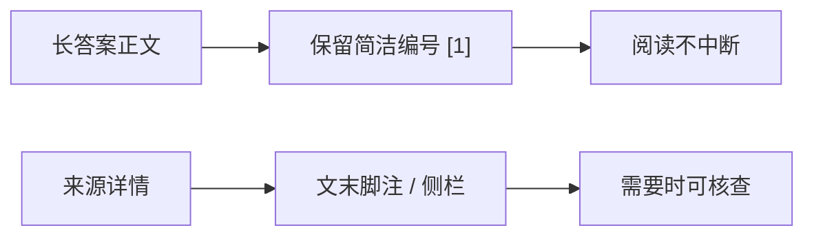
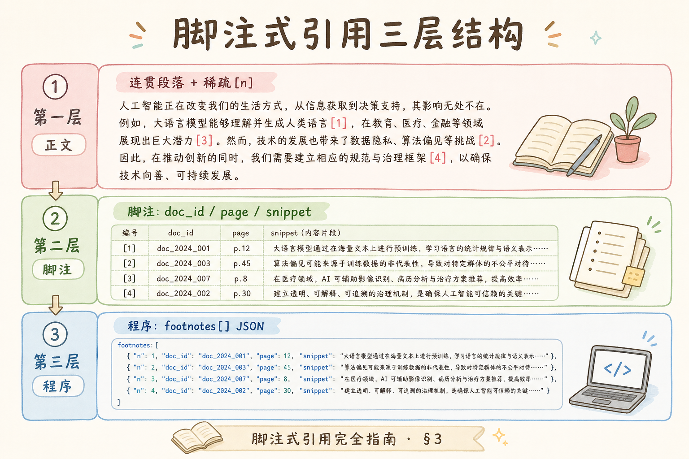
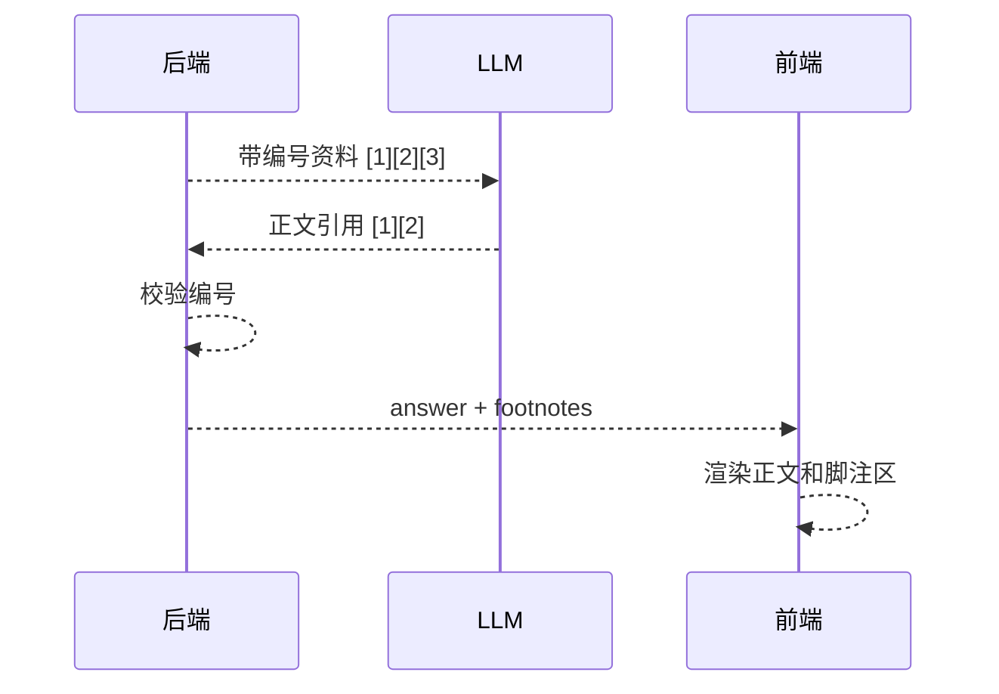
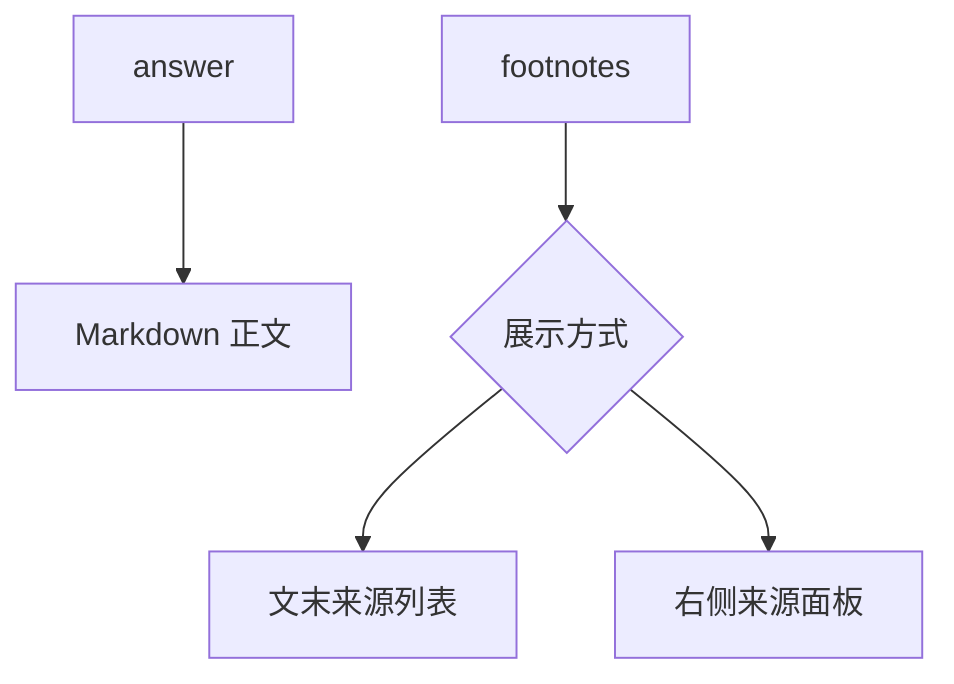
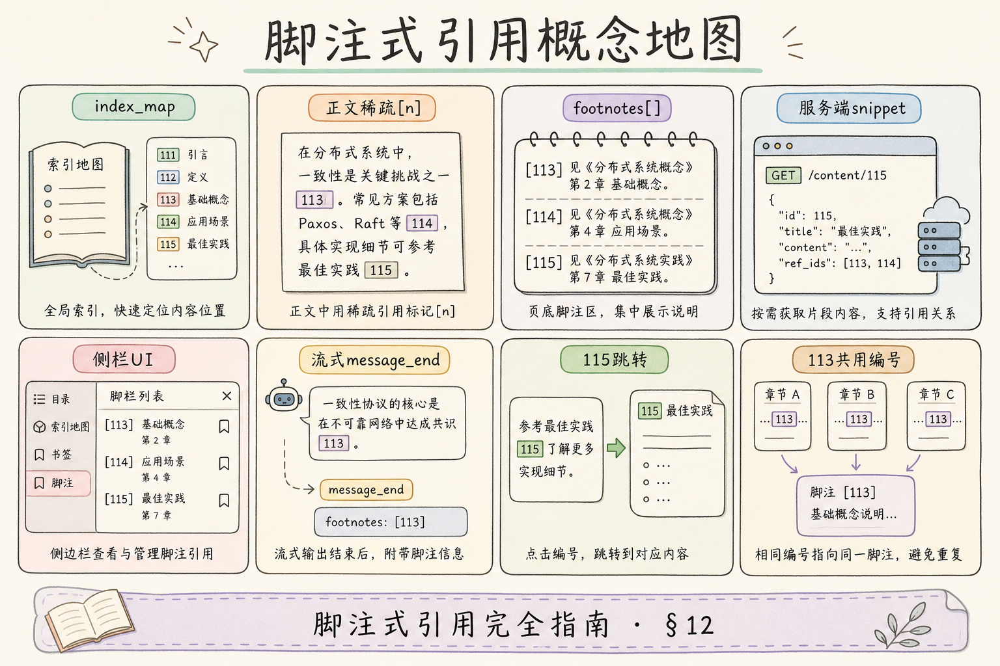

# C6 生成与 Grounding（三）：脚注式引用入门

行内引用适合短答案，但长答案里如果每句话都带 `[1][2]`，正文会变得拥挤。**脚注式引用**是在正文里保留简洁编号，并在文末或侧栏集中展示来源详情，让用户既能顺畅阅读，也能追溯证据。

本文面向已经了解行内引用的初学者。读完后，你应该能区分行内引用和脚注引用，设计 `footnotes` 数据结构，并知道脚注不是“把编号随便挪到底部”。

## 目录

- [1. 脚注式引用解决什么问题](#1-脚注式引用解决什么问题)
- [2. 行内引用和脚注引用怎么选](#2-行内引用和脚注引用怎么选)
- [3. 编号契约：正文与脚注共用](#3-编号契约正文与脚注共用)
- [4. footnotes 数据结构](#4-footnotes-数据结构)
- [5. Prompt 设计](#5-prompt-设计)
- [6. 前端展示：文末列表与侧栏](#6-前端展示文末列表与侧栏)
- [7. 流式输出时怎么处理](#7-流式输出时怎么处理)
- [8. 常见错误](#8-常见错误)
- [9. FAQ](#9-faq)
- [10. 总结](#10-总结)

## 1. 脚注式引用解决什么问题

脚注式引用解决的是“长答案阅读体验”和“来源可追溯”之间的平衡。



它适合政策解读、报告摘要、多段对比这类长答案。用户先读正文，需要核查时再看脚注区。

脚注不是去掉正文编号，而是把**来源详情**从正文旁移到集中区域。正文仍保留 `[n]` 锚点，脚注区承载 `doc_title`、`page`、`snippet` 和跳转链接，与 [113 行内引用](113.inline-citation-tutorial.md) 共用同一套服务端编号。

## 2. 行内引用和脚注引用怎么选

两者不是互斥关系，而是展示方式不同。

| 场景 | 推荐 |
| --- | --- |
| 短 FAQ | 行内引用 |
| 长段落解释 | 脚注式引用 |
| 合规问答 | 行内 + 脚注详情 |
| 移动端短答案 | 行内引用更直接 |
| 桌面端长报告 | 侧栏脚注更舒服 |

如果答案只有两三句话，脚注可能显得复杂；如果答案有多个小节，脚注能让正文更清爽。

| 答案长度（粗估） | 建议 |
|------------------|------|
| ≤3 句 | 行内引用即可 |
| 4～10 句、单主题 | 行内或文末脚注 |
| 多小节报告 | 正文编号 + 侧栏脚注 |

## 3. 编号契约：正文与脚注共用

脚注引用仍然需要编号契约。正文中的 `[1]` 必须对应 `footnotes` 中的第 1 条。





编号最好由服务端生成，模型只使用已有编号。输出后仍要校验，避免脚注引用不存在的来源。

`footnotes` 数组应与注入 Prompt 的 `[1][2][3]` 同源：由同一批 hits 映射而来，而不是模型生成正文后再“猜”脚注列表。

### 案例

政策解读题：答案分三段，共引用 4 个 chunk，正文出现 `[1][2][3][4]`。API 返回 `answer` + `footnotes`（含 `number`、`chunk_id`、`snippet`、`page`）。用户阅读正文不卡顿；点击 `[2]` 侧栏展开对应 snippet，再点“查看原文”走 [115 源文档导航](115.source-document-navigation-tutorial.md)。

验收：正文里每个 `[n]` ∈ `footnotes[].number`；脚注区条数可 ≤ 正文引用次数（复用编号时）；流式结束后脚注一次加载，无编号错位。

### 先错对已

```text
-- ❌ 模型在文末自己写“[1] 差旅制度第4页……”
-- ❌ 前端按 doc_title 排序脚注，正文 [1] 指向错误条目

-- ✅ 模型只输出正文 [n]；footnotes 由 citations 元数据渲染
-- ✅ 校验 used_numbers ⊆ footnotes；流式 complete 后再激活脚注
```

## 4. footnotes 数据结构

脚注区需要比行内引用展示更多信息。


```python
response = {
    "answer": "超标住宿需要部门负责人审批 [1]。商务舱需财务总监审批 [2]。",
    "footnotes": [
        {
            "number": 1,
            "doc_title": "差旅制度",
            "page": 4,
            "chunk_id": "c12",
            "snippet": "超出住宿标准时，需要部门负责人审批。",
        },
        {
            "number": 2,
            "doc_title": "机票报销制度",
            "page": 2,
            "chunk_id": "c31",
            "snippet": "商务舱报销需财务总监审批。",
        },
    ],
}
```

这个结构的好处是正文、来源、跳转都分开。前端不用从答案字符串里猜来源信息。

生产环境建议在 footnote 对象中预留 `navigate_url`（或由前端用 `chunk_id` 调预览 API），与行内引用的 `citations` 字段对齐，避免两套 schema 分叉。

## 5. Prompt 设计

脚注式引用的 Prompt 可以要求正文保持自然，但关键结论仍带编号。

```text
你只能根据给定资料回答。
规则：
1. 正文保持简洁自然。
2. 关键事实句末保留来源编号，如 [1]。
3. 不要生成脚注详情，脚注详情由系统根据编号渲染。
4. 如果资料不足，明确说明不能确认。

资料：
{numbered_context}

用户问题：
{question}
```

注意第 3 条：不要让模型自己写脚注详情。脚注详情应该来自结构化 citations，避免模型改写来源或伪造页码。

长答案可多段共用同一 `[n]`：正文第二次提到同一 chunk 时复用编号，脚注区不重复条目，但要在 UI 上支持“文中所有 [2] 高亮同一 footnote”。

## 6. 前端展示：文末列表与侧栏

脚注常见两种布局：

| 布局 | 适合场景 |
| --- | --- |
| 文末列表 | 简单页面、移动端、文章式答案 |
| 右侧栏 | 桌面端、长答案、多来源对照 |



不管哪种布局，都要保证点击 `[1]` 能定位到对应脚注，点击脚注也能回到正文位置。

侧栏模式适合与 PDF 预览并排：左侧正文、中间预览、右侧 footnotes 列表。移动端可退化为文末折叠列表，但 `footnotes` 数据结构保持不变，只换布局组件。

## 7. 流式输出时怎么处理

流式回答时，正文会先出现，但脚注详情可能要等完整答案生成后再校验和展示。

推荐流程：

1. 流式展示正文 token。
2. 暂时把 `[n]` 渲染为普通编号或 loading 状态。
3. 完整答案结束后，服务端校验编号。
4. 前端加载 footnotes 并激活点击。

不要在流式过程中让模型临时生成脚注详情。这样容易出现正文编号和脚注不一致。

流式场景下，API 可在 `done` 事件中一次性下发 `footnotes`，与最终 `answer` 绑定；中途仅展示正文 Markdown，避免用户点击尚未校验的编号。

### 7.1 流式与脚注激活时序

| 阶段 | 正文 | 脚注区 |
|------|------|--------|
| streaming | 渲染 token，`[n]` 可灰显 | 占位或隐藏 |
| complete + 校验通过 | 激活可点击 `[n]` | 渲染 footnotes |
| 校验失败 | 拒答或去掉非法 `[n]` | 不展示错误脚注 |

流式长答案若中途用户滚动阅读，complete 后应用轻量动画把 `[n]` 从灰显变为可点，避免“编号突然变了”的错觉；若校验删号，应同步刷新正文 Markdown。

## 8. 常见错误

这一节列出脚注式引用最常见的问题。核心原则是：正文编号和脚注数据必须来自同一套证据契约。


### 8.1 脚注详情由模型编写

模型可能改写标题、页码或片段。脚注详情应来自后端 citations 数据。

### 8.2 正文编号和脚注编号不一致

输出后必须校验正文使用的编号是否都存在于 footnotes。

### 8.3 脚注只列文档不列片段

只给文档名不够，用户仍然不知道具体依据。建议至少给页码和 snippet。

### 8.4 流式中提前固定脚注

完整答案还没结束，引用编号可能变化。脚注应在最终校验后激活。

### 8.5 脚注区排序被前端改掉

前端不要按标题或页码重新排序脚注，否则正文编号会错位。

### 排错

1. **正文 [3] 点击无反应**：查 footnotes 是否缺 `number: 3`；流式是否过早绑定点击事件。
2. **脚注 snippet 与正文结论不符**：几乎总是模型编造了脚注文案——应禁止模型写详情，只用后端 snippet。
3. **同一来源出现 [1][4] 两条脚注**：应在编号前合并同 `chunk_id`，正文复用同一 `[n]`。
4. **侧栏与文末列表编号不一致**：两套 UI 应读同一份 `footnotes`，不要各维护一份。
5. **complete 后脚注条数变少**：校验阶段删了非法编号，需同步修订正文或整段重生成。

### 评测

长答案场景单独建评测集（20～40 条），标注正文关键句与 `chunk_id`：

| 指标 | 说明 |
|------|------|
| 脚注完备率 | 正文 `used_numbers` 是否都有 footnote |
| 详情准确率 | snippet/页码是否与 chunk 一致（抽检） |
| 阅读体验 | 正文是否过密（可选：每段 `[n]` 个数） |
| 跳转成功率 | 点击脚注能否打开预览（联动 115） |

脚注评测可与行内引用评测共用标注数据：同一 `chunk_id` 标注，分别测正文 `[n]` 与 footnote 详情是否一致。长报告类答案建议单独提高抽检比例，因为模型更易在段落中段漏标。

## 9. FAQ

**Q1：脚注式引用还需要正文编号吗？**  
需要。没有正文编号，用户不知道哪条脚注支持哪个结论。

**Q2：脚注能不能合并重复来源？**  
可以，但要保持编号映射清楚。同一来源多次出现时，可以复用同一个编号。

**Q3：脚注适合所有答案吗？**  
不适合。短答案用行内引用更直接；长答案或报告型答案更适合脚注。

**Q4：脚注和源文档跳转怎么衔接？**  
footnote 里保存 `chunk_id`、页码或 `navigate_url`，前端点击后跳到源文档定位。

**Q5：能否只要脚注不要正文编号？**  
不建议。无正文编号时用户无法把结论与脚注一一对应，等同于回到“根据资料”式模糊表述。合规审阅场景下，正文编号是审计员逐句勾对的锚点，不可省略。

## 10. 总结

脚注式引用让长答案既可读又可查。



初学者先做到四点：

1. 正文编号和 footnotes 使用同一套服务端编号。
2. 模型只生成正文编号，不生成脚注详情。
3. 输出后校验编号存在性。
4. 前端支持文末或侧栏展示，并能点击定位。

与 [113 行内引用](113.inline-citation-tutorial.md) 联调时，建议共用一份 `Citation` 类型定义：`number`、`chunk_id`、`snippet`、`page`、`navigate_url` 字段一致，脚注只是多了一种 UI 布局。这样从短 FAQ 升级到长报告时，后端不必重写引用管线，只切换前端布局组件即可。

当答案变长、来源变多、正文不适合密集引用时，脚注式引用是比简单行内引用更好的展示方案。它与行内引用共享编号契约，差别主要在**来源详情的展示位置**。

### 本篇检查清单

- [ ] 正文 `[n]` 与 `footnotes[].number` 同源、可双向映射
- [ ] 模型不生成脚注详情，snippet/页码来自结构化 citations
- [ ] 输出后校验 `used_numbers ⊆ footnotes`
- [ ] 流式 complete 后再激活脚注与点击
- [ ] 前端不按标题重排脚注，避免错位
- [ ] 长答案评测集测过脚注完备率与详情准确率

上线前用同一批长答案样本对比“纯行内”与“脚注布局”的用户阅读时长与点击脚注率，确认体验收益值得额外 UI 复杂度。
