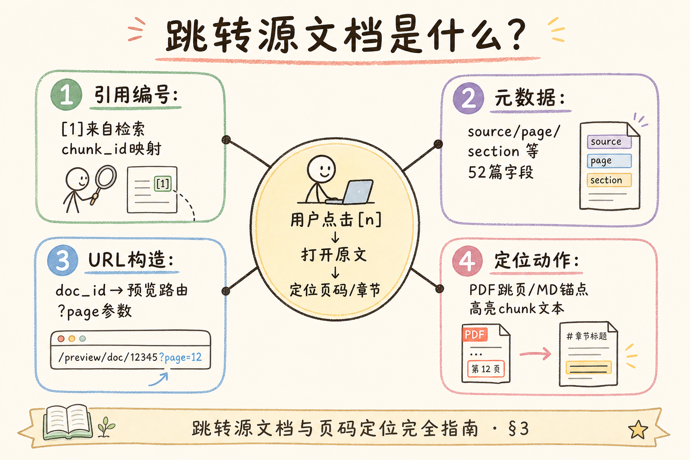
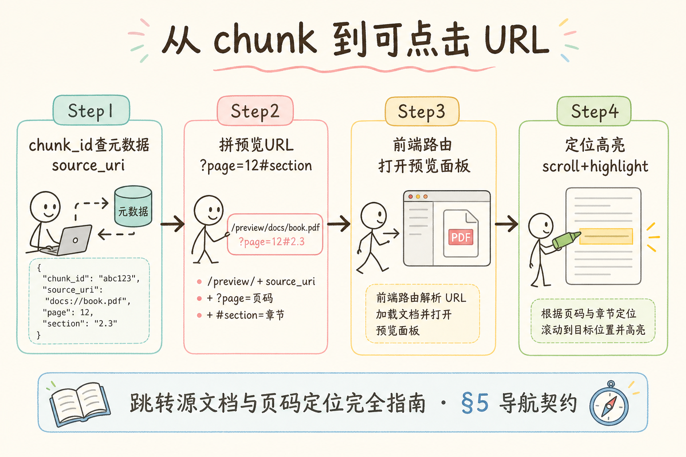
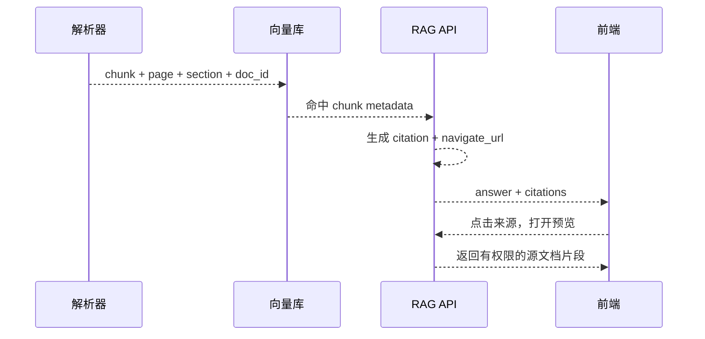
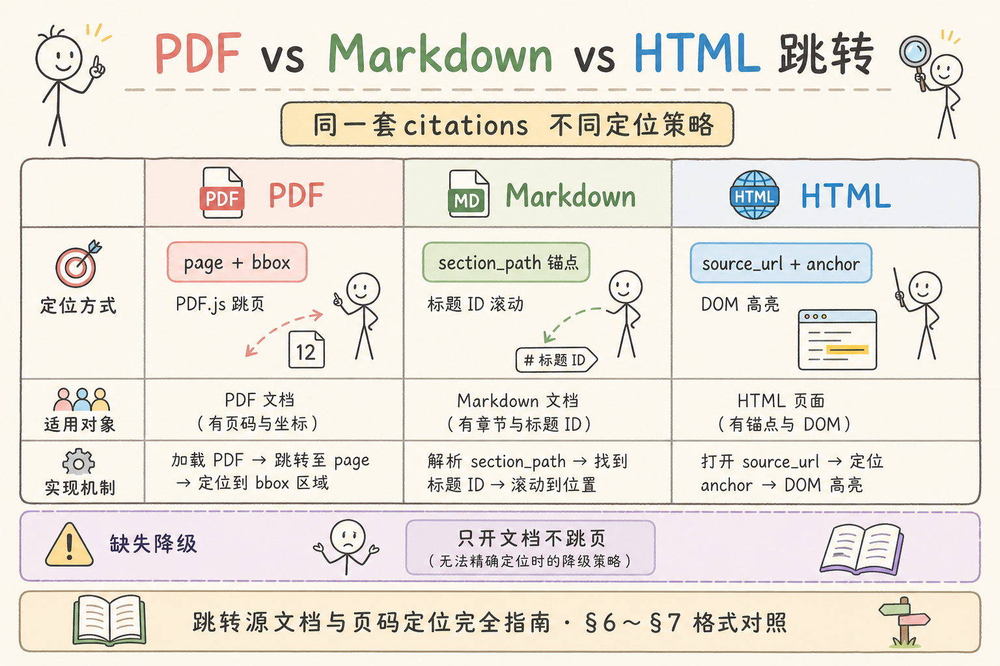
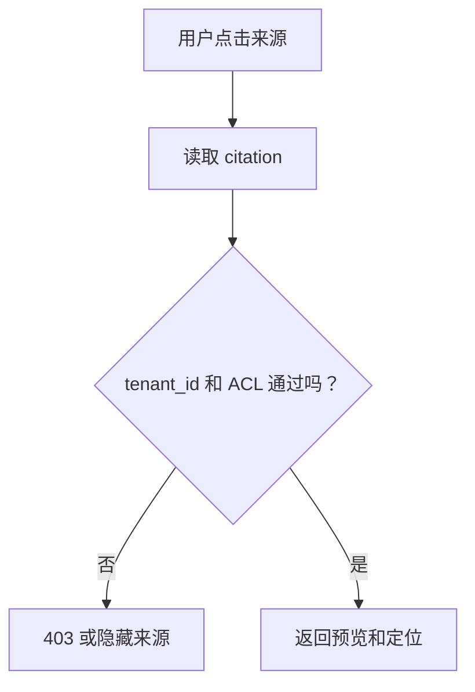

# C6 生成与 Grounding（四）：源文档跳转与页码定位入门

引用编号只能说明“答案有来源”，但用户真正核查时，还需要跳到源文档的具体页码或片段。**源文档导航**就是从答案引用跳转到 PDF、网页、文档预览或侧栏定位，让用户能看到原始上下文。

本文面向已经了解行内引用和脚注引用的初学者。读完后，你应该能设计 citation 到源文档的跳转契约，知道 metadata 需要哪些字段，并写出一个最小 `navigate_url` 生成函数。

## 目录

- [1. 为什么引用还需要跳转](#1-为什么引用还需要跳转)
- [2. 源文档导航解决什么问题](#2-源文档导航解决什么问题)
- [3. 最小 metadata 字段](#3-最小-metadata-字段)
- [4. navigate_url 怎么生成](#4-navigate_url-怎么生成)
- [5. 后端到前端的完整链路](#5-后端到前端的完整链路)
- [6. PDF、网页和纯文本的差异](#6-pdf网页和纯文本的差异)
- [7. 权限与安全检查](#7-权限与安全检查)
- [8. 常见错误](#8-常见错误)
- [9. FAQ](#9-faq)
- [10. 总结](#10-总结)

## 1. 为什么引用还需要跳转

用户看到 `[1]` 后，通常会继续问：这条来源在哪里？原文是不是这么说的？前后文有没有限制条件？

如果只能看到一个 chunk 弹窗，用户仍然难以核查完整语境。源文档导航把引用从“编号”变成“可验证路径”。


这对制度问答、合同问答、PDF 报告问答尤其重要。用户核查时往往要看例外条款、生效日期或表格脚注；仅展示 chunk 摘要无法替代原文语境。

## 2. 源文档导航解决什么问题

源文档导航解决三个问题：

| 问题 | 导航的作用 |
| --- | --- |
| 来源可核查 | 用户能打开原文 |
| 上下文可恢复 | 用户能看前后段落 |
| 信任可建立 | 答案不是孤立文本 |

它不是“再检索一次”。跳转应该基于已经命中的 citation metadata，而不是用户点击后重新搜索。重新搜索可能命中不同结果，导致引用和原文不一致。

导航是 Grounding 闭环的最后一环：[111 注入格式](111.context-injection-format-tutorial.md) 提供编号证据，[113/114](113.inline-citation-tutorial.md) 在答案中展示引用，导航把 `[n]` 变成可打开的原文位置。

## 3. 最小 metadata 字段

要跳转源文档，chunk 入库时就要保存足够 metadata。



| 字段 | 用途 |
| --- | --- |
| `doc_id` | 找到原始文档 |
| `chunk_id` | 找到具体片段 |
| `doc_title` | 展示来源标题 |
| `page` | PDF 或分页文档定位 |
| `section` | Markdown / HTML 章节定位 |
| `source_type` | pdf、html、markdown、txt |
| `tenant_id` | 权限和隔离 |

如果入库时没有页码或段落信息，后面很难准确跳转。导航能力要从解析和切分阶段就开始设计。

解析阶段应和切分策略对齐：PDF 按页提取时把 `page` 写入每条 chunk；Markdown 按 heading 切分时写 `section` anchor；缺字段的 chunk 在入库质检时报错，而不是等到用户点击才发现无法定位。

### 案例

合同 FAQ：答案引用 `[1]`，citation 含 `doc_id=contract-2025`、`chunk_id=c88`、`page=12`。用户点击后打开 `/documents/contract-2025/preview?page=12&chunk=c88`，预览器高亮该 chunk 对应段落。

验收：点击 10 次同一 `[1]` 打开位置一致；换用户无 ACL 时返回 403 而非签名 URL；日志记录 `navigate_url` 与 `chunk_id`，可复现跳转失败。

### 先错对已

```text
-- ❌ 点击 [1] 后用用户问题重新 search，打开另一段正文
-- ❌ 入库无 page，预览只能打开 PDF 首页

-- ✅ 用 citation.chunk_id + metadata 生成 navigate_url
-- ✅ 预览 API 按 chunk_id 取片段并高亮；点击时重新校验 ACL
```

## 4. navigate_url 怎么生成

`navigate_url` 是前端可以打开的跳转地址。它可以是内部路由，也可以是带参数的预览地址。

```python
def build_navigate_url(meta: dict) -> str:
    source_type = meta["source_type"]
    doc_id = meta["doc_id"]
    chunk_id = meta["chunk_id"]

    if source_type == "pdf":
        return f"/documents/{doc_id}/preview?page={meta.get('page', 1)}&chunk={chunk_id}"

    if source_type in {"markdown", "html"}:
        section = meta.get("section", "")
        return f"/documents/{doc_id}/preview?section={section}&chunk={chunk_id}"

    return f"/documents/{doc_id}/preview?chunk={chunk_id}"
```

这段代码的重点不是 URL 样式，而是统一从 metadata 生成跳转。不要在前端凭文档标题拼路径。

URL 参数建议只放稳定 id（`doc_id`、`chunk_id`、`page`），不要把用户可篡改的检索 query 写进跳转链接。预览服务根据 `chunk_id` 取存储中的片段，保证与生成答案时命中的是同一条证据。

## 5. 后端到前端的完整链路

源文档导航的链路如下：





每一步都要保留定位信息。只要其中一步丢了页码或 chunk_id，最后的跳转就只能退化成打开整篇文档。

建议在 RAG API 响应里为每个 citation 附带 `navigate_url`（实时生成），前端只打开后端给的 URL，不自行拼接 query 参数。

### 5.1 链路断点自查

| 环节 | 丢失字段时的症状 |
|------|------------------|
| 解析 | 预览无法高亮，只能整篇打开 |
| 入库 | API 无 page/section 可写进 URL |
| 生成 citation | footnote 无跳转按钮 |
| 预览服务 | 有 URL 但 404 或空白页 |

PoC 阶段可用“chunk 弹窗 + 手动打开 doc”过渡，但应在 metadata 质检清单里标明缺 `page` 的文档比例；超过阈值则阻塞上线导航功能，避免用户以为能定位实际只能看摘要。

## 6. PDF、网页和纯文本的差异

不同文档类型的定位方式不同。



| 类型 | 推荐定位 |
| --- | --- |
| PDF | 页码 + chunk 高亮 |
| Markdown | heading anchor + chunk_id |
| HTML | DOM selector 或 heading id |
| TXT | 行号或 chunk_id |
| DOCX | 段落索引或转换后的页码 |

PDF 页码尤其要注意：解析库得到的页码要和用户看到的页码一致。有些 PDF 有封面、目录或罗马数字页码，显示页码和物理页码可能不同。

建议在文档入库时记录 `page_offset` 或 `display_page` 字段，预览器用统一函数把存储页码映射为用户可见页码，并在 UI 上标注“第 N 页（含封面偏移）”以免争议。

## 7. 权限与安全检查

源文档导航必须重新做权限检查。用户能看到答案片段，不代表能下载整份原文。



不要把对象存储真实地址直接暴露给前端。后端应生成受控预览或短期签名链接，并确认当前用户仍然有权限。

预览接口应返回**最小必要片段**（当前页或章节 ± 上下文），而非默认提供整文件下载。下载若需单独权限位，与“查看引用片段”分开控制。

## 8. 常见错误

这一节列出源文档导航最常见的问题。核心原则是：跳转必须基于原命中证据，而不是点击后重新猜。

### 8.1 点击引用后重新检索

重新检索可能命中不同 chunk，导致答案引用和打开来源不一致。应使用 citation 里的 chunk_id 和 metadata。

### 8.2 入库时没保存页码

后端生成答案时再找页码通常已经太晚。页码应在解析阶段写入 metadata。

### 8.3 前端凭标题拼 URL

标题可能重复或变更。跳转应使用稳定的 doc_id、chunk_id 和后端生成的 navigate_url。

### 8.4 跳转绕过权限

引用来源也要检查 tenant、ACL 和文档权限。不能因为答案里出现过片段，就允许下载整份文档。

### 8.5 页码和用户看到的不一致

PDF 物理页码、显示页码、解析页码可能不同。需要在预览组件里统一处理。

### 排错

1. **点击打开错误页**：对比解析 `page` 与 PDF 查看器显示页；检查是否有封面偏移配置。
2. **高亮位置偏移**：chunk 切分与预览渲染是否同一套文本；DOCX 转 PDF 后段落索引是否变化。
3. **403 但答案里曾出现该片段**：正常——片段可见 ≠ 全文可读；检查预览与下载权限是否拆分。
4. **URL 有效但 chunk 不存在**：`chunk_id` 是否因重入库变化；应使用稳定 id 或版本化 doc。
5. **跨租户跳转**：`navigate_url` 生成时是否带入 `tenant_id` 校验。

### 评测

在引用评测之外增加“导航评测”（15～30 条即可）：

| 指标 | 说明 |
|------|------|
| 定位准确率 | 打开后高亮是否覆盖 citation snippet |
| 权限正确率 | 无 ACL 用户是否被拦 |
| 链路一致率 | 同一 `[n]` 多次点击是否同一 chunk |
| 退化率 | 只能打开整篇、无法定位的比例 |

导航指标应与引用指标分开看：引用全对但定位失败，用户仍会质疑答案。建议在预发环境用真实 PDF 样本跑一遍“点击每个 `[n]`”的手工脚本，记录失败 chunk 列表回填解析管线。

## 9. FAQ

**Q1：只展示 chunk 弹窗够不够？**  
早期 demo 可以，但生产场景通常还需要打开源文档，方便用户核查前后文。

**Q2：navigate_url 存库还是实时生成？**  
建议实时生成。doc_id、page、section 等 metadata 存库，URL 由后端按当前路由规则生成。

**Q3：源文档跳转和引用编号谁先做？**  
先确保 citation 数据结构稳定，再做跳转。编号只是展示，跳转依赖 metadata。

**Q4：没有页码的文档怎么办？**  
可以退化为章节、段落、行号或 chunk 高亮。关键是要给用户足够定位上下文。

**Q5：外链网页如何导航？**  
`source_type=html` 时用 `section` 或 DOM anchor；若原文站有防盗链，应通过后端代理预览并保留命中片段高亮，而不是直接跳外站搜索结果页。代理预览还能在权限变更后立即失效链接，降低外链长期暴露风险。

## 10. 总结

源文档导航让 RAG 引用从“可见”变成“可核查”。


初学者先做到四点：

1. 入库时保存 doc_id、chunk_id、页码或章节信息。
2. 后端基于 citation metadata 生成 navigate_url。
3. 前端点击引用后打开源文档并定位片段。
4. 跳转前重新做租户和 ACL 权限检查。

与 [114 脚注](114.footnote-citation-tutorial.md) 联用时，脚注里的“查看原文”按钮应直接消费同一 `navigate_url`，不要在脚注组件里再写一套跳转逻辑。单一跳转入口也便于统一打点：记录 `chunk_id`、打开耗时、权限失败原因。

当用户能从答案中的 `[1]` 一路打开原文、看到页码和高亮片段，Grounding 才真正形成闭环。导航依赖入库 metadata 与 citation 契约，宜在 PoC 阶段就与解析、切分一起设计，而不是上线前临时拼 URL。

### 本篇检查清单

- [ ] chunk 入库含 `doc_id`、`chunk_id`、`source_type` 及 page/section 等定位字段
- [ ] `navigate_url` 由后端从 metadata 生成，前端不凭标题拼接
- [ ] 点击跳转使用 citation 的 `chunk_id`，非重新检索
- [ ] 预览 API 重新校验 tenant/ACL，不暴露对象存储直链
- [ ] PDF 显示页与解析页偏移已配置并文档化
- [ ] 导航评测集测过定位准确率与权限正确率
