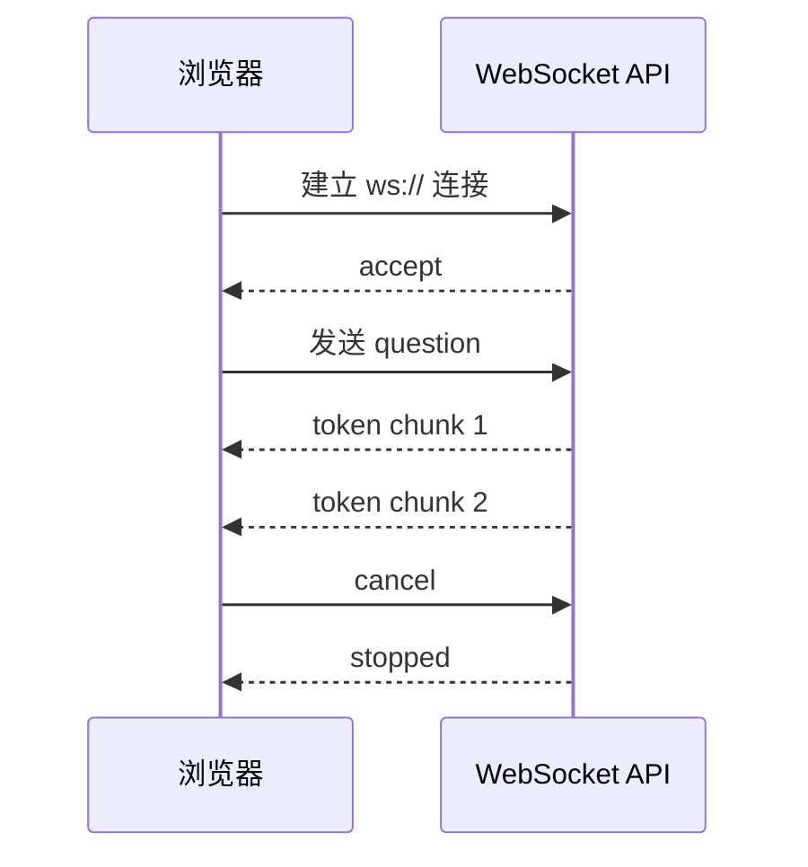
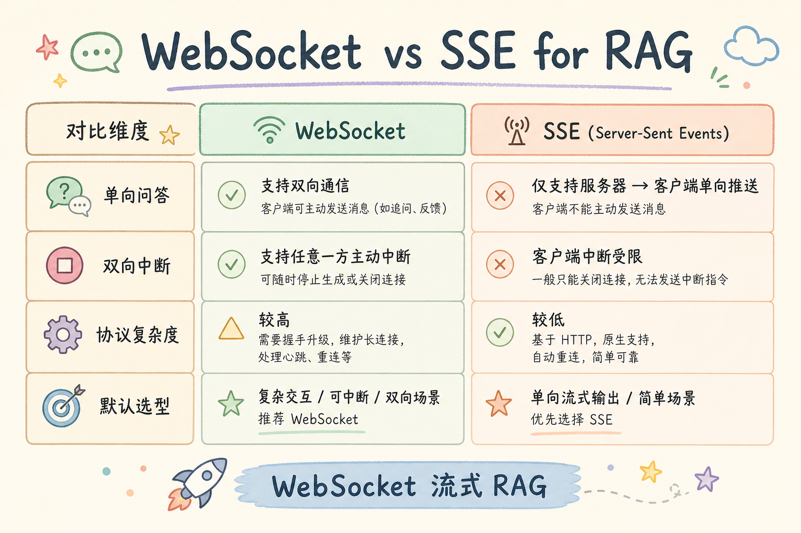
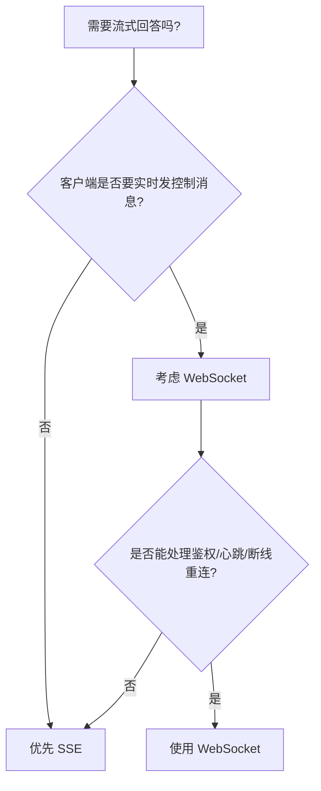
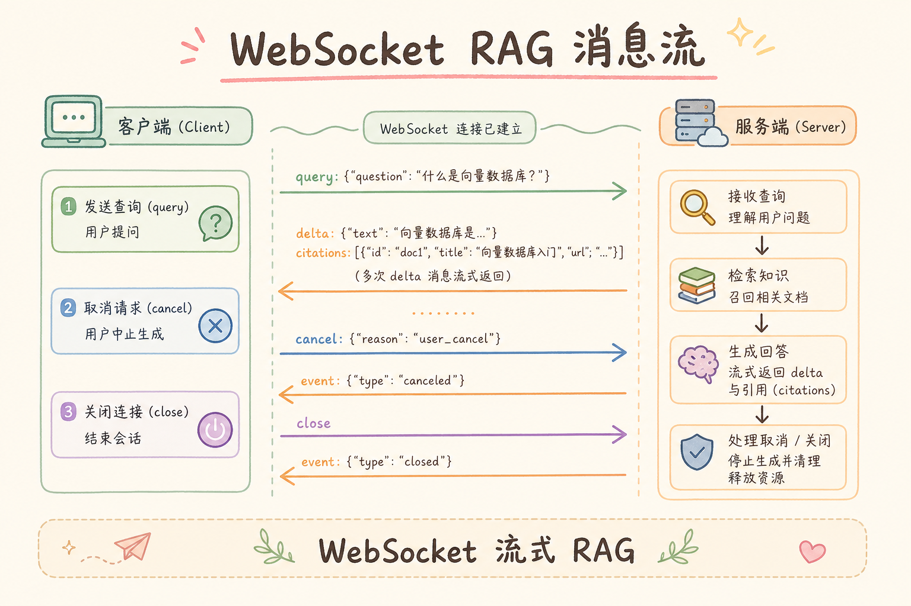
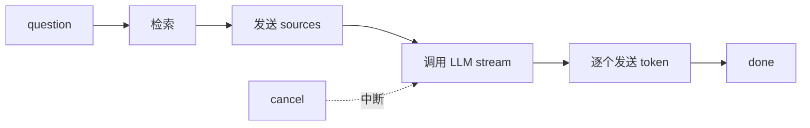
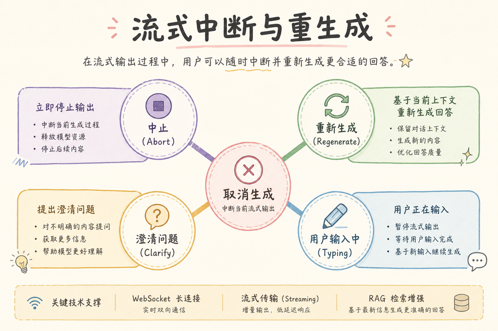

# C8 流式体验（二）：WebSocket RAG Streaming 完全指南

> SSE 适合服务端单向推送，WebSocket 更适合双向实时交互。RAG 聊天里，如果你希望用户可以边接收答案边发送取消、追问、改写、心跳或协作事件，**WebSocket** 就比普通 HTTP 更合适。本文讲清 WebSocket 是什么、解决什么问题、怎么用它做 RAG 流式回答，以及什么时候不该用它。

### 本文边界与动手路径

本文讲双向消息协议与连接生命周期，默认你已读过 [116 SSE](116.sse-rag-streaming-tutorial.md)。不讲 Kubernetes Ingress 全量模板，但会点出负载均衡与鉴权要点。

| 步骤 | 你做什么 | 验收 |
| --- | --- | --- |
| A | FastAPI `/ws/chat` 跑通 question → token → done | 浏览器控制台可见消息序列 |
| B | 实现 `cancel` 中断生成 | 点击停止后 token 停止且收到 `stopped` |
| C | 断线时取消后台 asyncio Task | 关 Tab 后服务端日志无继续 token |
| D | 约定 JSON `type` 契约并写进文档 | 前后端联调无「猜字段」 |

---

## 目录

1. [为什么需要 WebSocket](#1-为什么需要-websocket)
2. [WebSocket 是什么](#2-websocket-是什么)
3. [它解决什么问题](#3-它解决什么问题)
4. [WebSocket 与 SSE 的区别](#4-websocket-与-sse-的区别)
5. [RAG 流式链路设计](#5-rag-流式链路设计)
6. [FastAPI 最小示例](#6-fastapi-最小示例)
7. [前端最小示例](#7-前端最小示例)
8. [常见陷阱与 FAQ](#8-常见陷阱与-faq)
9. [总结](#9-总结)

---

## 1. 为什么需要 WebSocket

普通 HTTP 请求像“发一封信”：客户端发出请求，服务器处理完再返回结果。流式问答需要更像“打电话”：服务器可以不断说话，客户端也可以随时插话。

RAG 聊天里常见需求包括：

- 模型生成 token 时逐步显示；
- 用户点击“停止生成”后立刻取消后端任务；
- 前端发送心跳，后端判断连接是否还活着；
- 同一个会话里连续追问，不想反复建立连接；
- 多人协作页面里同步生成状态。

如果只是单向输出 token，SSE 通常够用；如果需要双向控制，WebSocket 更合适。

### 1.1 典型产品信号

当产品经理提出「停止生成」「同屏协作看 AI 写稿」「输入时显示对方正在检索」时，多半需要双向通道。若需求仅是聊天答案逐字显示，先问清是否真的要在**同一条连接**里发控制消息；很多团队用 SSE + 单独 REST 取消接口也能满足，复杂度更低。

---

## 2. WebSocket 是什么

**WebSocket**：一种浏览器和服务器之间的长连接协议。连接建立后，客户端和服务器都可以主动发送消息。

通俗说：HTTP 像点餐，服务员每次都要接单再送餐；WebSocket 像开着对讲机，双方都能随时说话。



从图里可以看到：WebSocket 不是一次请求一次响应，而是在同一条连接里不断交换消息。

### 2.1 握手与升级

WebSocket 起始于 HTTP Upgrade。代理必须透传 `Connection: Upgrade` 与 `Upgrade: websocket`，否则连接会降级失败。企业内网常有 SSL 卸载层，要确认 wss 证书链与 WebSocket 路径规则一致。

---

## 3. 它解决什么问题

| 问题 | HTTP/SSE 的限制 | WebSocket 的优势 |
|---|---|---|
| 取消生成 | 需要额外接口 | 同连接发送 `cancel` |
| 多轮控制 | 每轮重新请求 | 同连接维护会话 |
| 心跳检测 | 不自然 | ping/pong 或自定义 heartbeat |
| 协作状态 | 需要轮询 | 服务端主动广播 |
| 双向事件 | SSE 只适合服务端推送 | 双方都能发消息 |

WebSocket 不是为了“更高级”，而是为了双向实时控制。没有双向需求时，不要为了技术炫技而引入它。



### 案例

某客服 Copilot：坐席与 AI 共用会话。坐席点「停止」需立刻中断 LLM；下一轮追问「那特殊商品呢」走同连接 `question`，服务端保留 `session_id` 与历史策略。链路：连接时 JWT 鉴权 → `question` 触发检索 → `retrieving` → `source` → 流式 `token` → `done`；坐席点停止发 `cancel`，服务端 `task.cancel()` 并回 `stopped`。验收：停止后 500ms 内无新 token；断线后服务端日志显示任务已取消，token 账单不继续增长。

---

## 4. WebSocket 与 SSE 的区别

**SSE**（Server-Sent Events）：服务端向浏览器单向推送文本事件。

对比表：

| 维度 | SSE | WebSocket |
|---|---|---|
| 方向 | 服务端 → 客户端 | 双向 |
| 浏览器 API | `EventSource` | `WebSocket` |
| 适合场景 | 只流式展示答案 | 流式 + 取消 + 心跳 + 协作 |
| 代理兼容 | 通常更简单 | 需要处理升级协议 |
| 消息格式 | 文本事件 | 文本或二进制 |
| 实现复杂度 | 较低 | 较高 |



这张图的结论：WebSocket 的收益来自双向控制，代价是连接管理复杂度。

### 先错对已

```text
-- ❌ 为「炫技」全站 WebSocket，但产品只需逐字显示答案
-- 问题：鉴权、重连、多实例会话粘滞成本陡增

-- ✅ 仅展示用 SSE；确有 cancel/协作/同连接多轮时再上 WebSocket
```

```text
-- ❌ 消息体有时是纯字符串，有时是 JSON，type 字段名还不统一
-- 问题：前端分支爆炸，线上难以灰度

-- ✅ 全部 JSON，固定 type 枚举，版本号写在连接握手或首包
```

---

## 5. RAG 流式链路设计

RAG WebSocket 通常不是一连接上就调用模型，而是按消息类型驱动。

建议定义这些消息：

| direction | type | 作用 |
|---|---|---|
| client → server | `question` | 提交用户问题 |
| server → client | `retrieving` | 告诉前端正在检索 |
| server → client | `source` | 返回引用来源 |
| server → client | `token` | 返回生成片段 |
| client → server | `cancel` | 用户取消生成 |
| server → client | `done` | 本轮结束 |
| both | `ping/pong` | 心跳 |





消息类型要稳定，不要让前端靠字符串猜状态。

### 5.1 会话状态放哪

单进程内存存 `current_task` 适合 demo。多实例部署时，`session_id` 与进行中的生成任务应放 Redis 或带租约的分布式锁，否则用户重连到另一台机器会「丢取消能力」。最小演进：会话元数据 Redis，生成任务仍本地但绑 connection_id。

---

## 6. FastAPI 最小示例

下面示例演示最小 WebSocket 结构：接收问题、模拟检索、逐步返回 token。真实项目里要替换成你的 RAG 检索和 LLM 流式调用。

```python
import asyncio
from fastapi import FastAPI, WebSocket, WebSocketDisconnect

app = FastAPI()


@app.websocket("/ws/chat")
async def chat_ws(ws: WebSocket):
    await ws.accept()
    current_task: asyncio.Task | None = None

    async def stream_answer(question: str):
        await ws.send_json({"type": "retrieving"})
        await asyncio.sleep(0.2)
        await ws.send_json({
            "type": "source",
            "title": "退款政策",
            "source": "docs/refund.md",
        })

        for token in ["根据", "资料", "，", "7 天内", "可以申请退款。"]:
            await asyncio.sleep(0.2)
            await ws.send_json({"type": "token", "text": token})

        await ws.send_json({"type": "done"})

    try:
        while True:
            message = await ws.receive_json()

            if message["type"] == "question":
                if current_task and not current_task.done():
                    current_task.cancel()
                current_task = asyncio.create_task(stream_answer(message["text"]))

            if message["type"] == "cancel":
                if current_task and not current_task.done():
                    current_task.cancel()
                    await ws.send_json({"type": "stopped"})

    except WebSocketDisconnect:
        if current_task and not current_task.done():
            current_task.cancel()
```

代码重点：

- `question` 会启动一个后台任务；
- 新问题会取消旧任务；
- `cancel` 可以主动停止生成；
- 断线时必须取消后台任务，避免服务器继续烧 token。

### 6.1 生产加固清单（在 demo 之上）

- 连接建立时校验 JWT 或 session cookie，并绑定 `tenant_id` 做检索过滤。
- `stream_answer` 内捕获 `asyncio.CancelledError`，确保 LLM SDK 的 stream 也被关闭。
- 对 `receive_json` 做 schema 校验，非法 `type` 返回 `error` 消息而非静默忽略。

---

## 7. 前端最小示例

下面是浏览器端最小用法。真实项目应封装成 hook，并处理重连、鉴权和错误提示。



```ts
const ws = new WebSocket("ws://localhost:8000/ws/chat");

ws.onopen = () => {
  ws.send(JSON.stringify({ type: "question", text: "退款政策是什么？" }));
};

ws.onmessage = (event) => {
  const message = JSON.parse(event.data);

  if (message.type === "retrieving") {
    console.log("正在检索资料...");
  }

  if (message.type === "source") {
    console.log("引用来源：", message.title, message.source);
  }

  if (message.type === "token") {
    console.log("增量文本：", message.text);
  }

  if (message.type === "done") {
    console.log("回答结束");
  }
};

function cancelGeneration() {
  ws.send(JSON.stringify({ type: "cancel" }));
}
```

前端不要假设 token 一定连续、完整、无重复。渲染层要能处理断线、取消和服务端错误事件。

### 7.1 重连策略

断线后指数退避重连，重连成功应带 `session_id` 恢复 UI 状态，但**不要**假设服务端仍记着半条生成；未 `done` 的回合应提示用户「上次回答已中断」。避免无限重连打爆网关，设置最大次数与 jitter。

---

## 8. 常见陷阱与 FAQ

这一节集中处理 WebSocket 流式回答最容易出生产事故的地方。判断实现是否合格，不只看 token 能不能流出来，还要看断线、取消、鉴权和负载均衡是否都有明确处理。

### 8.1 错：断线后后端还在生成

如果 WebSocket 断开但 LLM 任务还在跑，会继续消耗 token。断线时必须取消任务或让任务检查连接状态。

### 8.2 错：不做鉴权

WebSocket 也需要鉴权。可以在连接 URL、Cookie 或首条消息中带 token，但后端必须校验租户和用户权限。

### 8.3 错：消息格式随手定义

前后端要约定稳定的 `type` 和字段。不要一会儿发字符串，一会儿发 JSON，一会儿发半结构化文本。

### 8.4 FAQ：RAG 流式一定要 WebSocket 吗？

不一定。只需要展示模型输出时，SSE 更简单。需要取消、心跳、协作、双向控制时，再用 WebSocket。

### 8.5 FAQ：WebSocket 怎么做负载均衡？

需要确保代理支持 WebSocket upgrade，并设置合适的超时。多实例部署时，会话状态最好放到 Redis 或后端共享存储，不要只存在单个进程内存。

### 排错

1. **握手 403/404**：检查路径、子协议、鉴权中间件是否拦截 Upgrade 请求。
2. **能连上但立刻断**：看反向代理 idle timeout；补心跳 `ping/pong` 或应用层 heartbeat。
3. **cancel 无效**：确认 `current_task.cancel()` 后 LLM 迭代器是否退出；部分 SDK 需显式 `close()`。
4. **多实例下状态错乱**：会话粘滞或 Redis 存任务句柄；不要假设用户永远打到同一 pod。
5. **消息乱序**：单连接内一般有序；若前端多 Tab 共会话，需用 `request_id` 丢弃过期 token。

### 评测

| 指标 | 说明 |
| --- | --- |
| 取消延迟 | 发 `cancel` 到末条 `token` 的时间 |
| 断线后 token 泄漏 | 关连接后 10s 内 LLM 调用次数应为 0 |
| 首 token 延迟 | 含检索，与 SSE 方案同量级对比 |
| 重连成功率 | 弱网模拟下 3 次重连内恢复 |

用脚本模拟：建立 ws → 发 question → 中途 cancel → 断言收到 `stopped` 且无多余 token。压测时关注**并发连接数**与**每连接内存**，WebSocket 比短 HTTP 更吃文件描述符与心跳开销。

---

## 9. 总结

WebSocket 在 RAG Streaming 里的核心价值是双向控制：

1. 服务器可以持续推送 token；
2. 客户端可以实时发送取消、追问、心跳；
3. 消息类型要稳定，便于前后端协作；
4. 断线要取消后台任务，避免浪费 token；
5. 没有双向需求时，优先用 SSE。

一句话记忆：**SSE 适合“服务器一直说”，WebSocket 适合“双方都要说”。**

### 本篇检查清单

- [ ] 消息全部为 JSON，且 `type` 枚举有文档与契约测试
- [ ] `cancel` 与 `WebSocketDisconnect` 都会取消 LLM 后台任务
- [ ] 连接建立时完成鉴权与租户绑定，检索带 ACL
- [ ] 多实例方案明确：粘滞或 Redis 会话，而非仅进程内存
- [ ] 预发环境验证 wss 与代理 Upgrade、心跳与 idle 超时
- [ ] 评测过取消延迟与断线后无 token 泄漏
