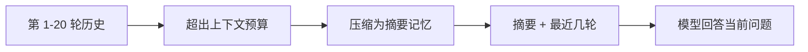
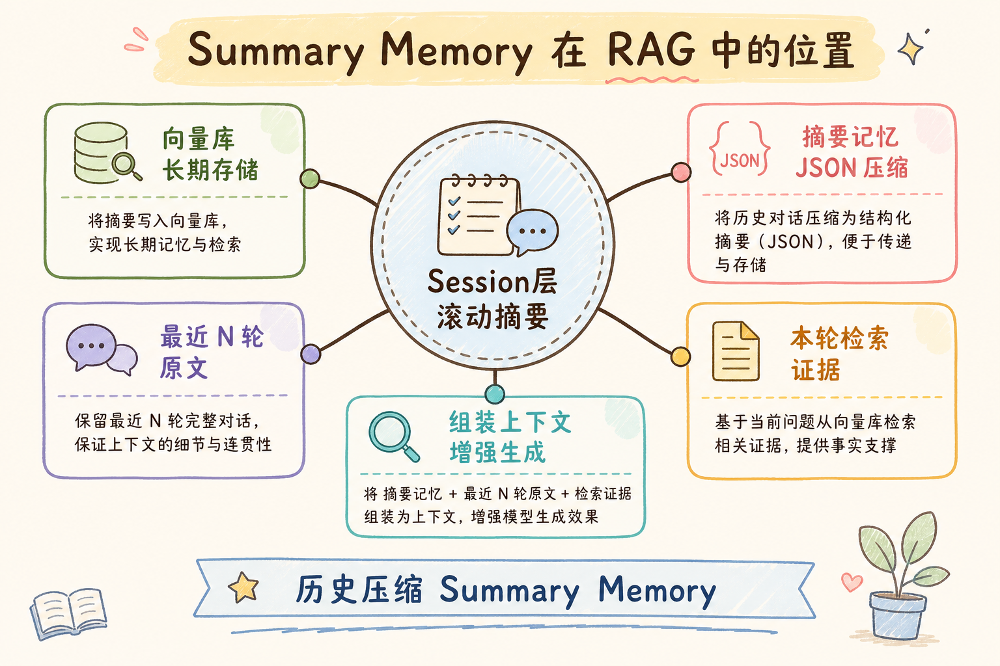
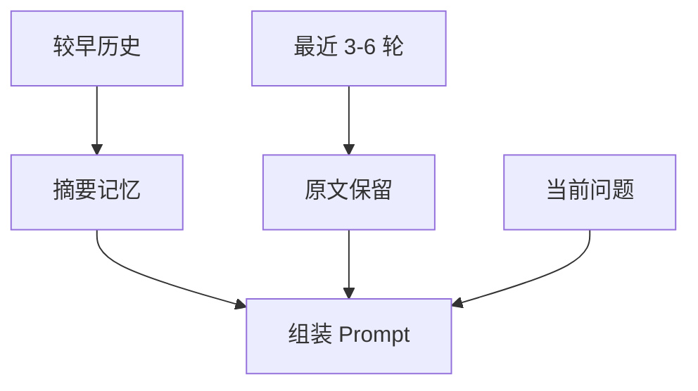
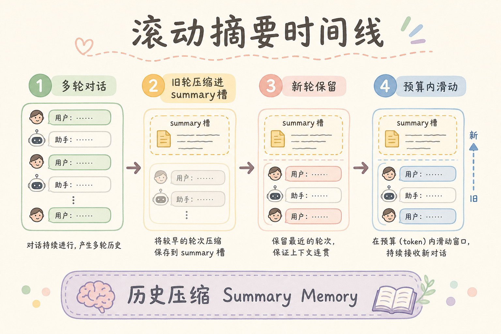
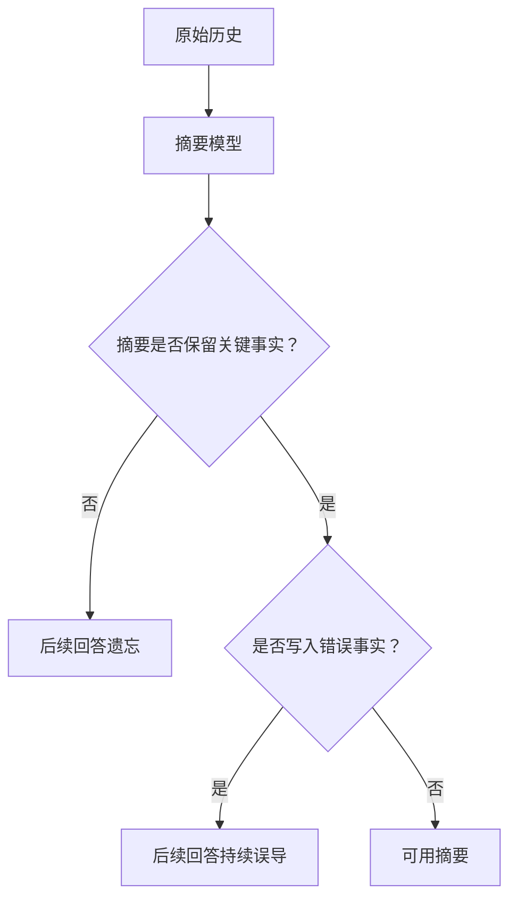
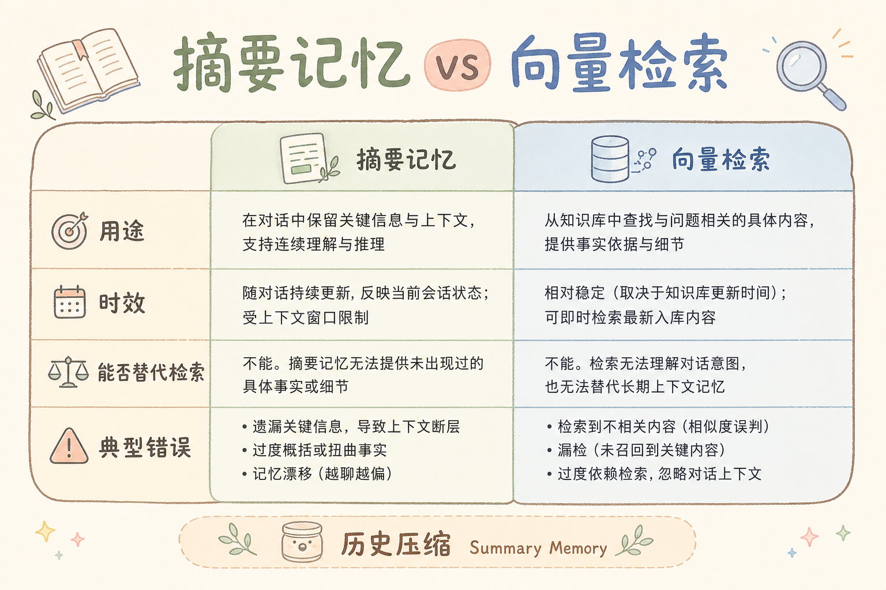

# C6 多轮对话（三）：摘要记忆入门

多轮对话越聊越长，如果把所有历史消息都塞进模型，上下文很快会超限。**摘要记忆**就是把较早的对话压缩成一段简短摘要，再和最近几轮消息一起提供给模型，让系统既记得重点，又不浪费太多 token。

本文面向已经了解多轮历史和 Context 预算的初学者。读完后，你应该能说明摘要记忆解决什么问题、何时压缩历史、如何保存和使用会话摘要。

### 本文边界与动手路径

本文聚焦单会话内的滚动摘要，与跨会话「长期记忆」区分。配合 [118 多轮历史](118.multi-turn-history-tutorial.md) 阅读。动手路径：

| 步骤 | 你做什么 | 验收 |
| --- | --- | --- |
| A | 实现 `summarize` + `build_context` | 长 history 压成摘要 + 最近轮 |
| B | 定义触发阈值（token / 轮数） | 未达阈值不调用摘要 LLM |
| C | 结构化摘要字段 | 含目标、已确认、待解决 |
| D | 记录摘要版本与源消息范围 | 出错可回滚或回查 |

## 目录

- [1. 为什么需要摘要记忆](#1-为什么需要摘要记忆)
- [2. 摘要记忆是什么](#2-摘要记忆是什么)
- [3. 滑动窗口与摘要的组合](#3-滑动窗口与摘要的组合)
- [4. 什么时候更新摘要](#4-什么时候更新摘要)
- [5. 最小 Python 示例](#5-最小-python-示例)
- [6. 摘要里应该保存什么](#6-摘要里应该保存什么)
- [7. 风险与校验](#7-风险与校验)
- [8. 常见错误](#8-常见错误)
- [9. FAQ](#9-faq)
- [10. 总结](#10-总结)

## 1. 为什么需要摘要记忆

多轮 RAG 里，用户可能连续问很多问题。最新问题常常依赖之前的信息，但完整历史又太长。



摘要记忆的目标不是保存全部原文，而是保留后续回答需要的稳定事实和用户偏好。

### 1.1 与扩大上下文窗口的对比

新模型上下文越来越长，但企业 RAG 的瓶颈常在「检索证据 + 系统指令 + 历史」总和。无限堆历史会挤占证据位，导致该引用的 chunk 进不了 Prompt。摘要记忆是**预算内**保留语义的手段，不是替代检索。

## 2. 摘要记忆是什么

摘要记忆可以理解为“对话到目前为止的可用笔记”。

它通常包含：

| 内容 | 例子 |
| --- | --- |
| 用户目标 | 用户正在搭建企业 RAG 问答系统 |
| 已确认事实 | 使用 FastAPI、Chroma、OpenAI 兼容接口 |
| 用户偏好 | 希望回答简洁并带引用 |
| 未解决问题 | 还需要处理权限过滤 |

它不应该包含每一句寒暄、重复确认或已经过期的信息。

### 2.1 摘要 vs 原文分工

| 信息类型 | 放摘要 | 放最近原文 |
| --- | --- | --- |
| 用户长期目标 | ✓ | |
| 「它」「上面那条」指代 | | ✓ |
| 已确认技术选型 | ✓ | |
| 上一轮具体数字 | | ✓ |

## 3. 滑动窗口与摘要的组合

实际系统通常同时使用摘要记忆和最近消息窗口。





这样做的原因是：摘要适合保存长期重点，最近几轮原文适合保留具体语气、指代和细节。

### 案例

企业 RAG 搭建咨询：前十五轮确认了 FastAPI、Chroma、要引用、要权限过滤。第十六轮问「多租户 metadata 怎么设计」。若只带最近两轮，可能丢掉「必须带引用」；若带全量历史，证据 chunk 装不下。滚动摘要记下目标与已确认栈，最近四轮保留原文讨论 metadata 的细节。验收：答案仍要求 citation；Prompt token 稳定在预算内；摘要表记录 `covers_messages=1-11`。

### 先错对已

```text
-- ❌ 每发一句用户消息就调用 LLM 重算全文摘要
-- 问题：成本高；临时口误被写入「长期事实」

-- ✅ token 超阈值或任务节点（话题切换、用户确认偏好）再更新
```

```text
-- ❌ 只有摘要，删掉全部最近原文
-- 问题：指代消解失败；语气与数字细节丢失

-- ✅ 摘要 + 最近 3～6 轮原文并存
```

## 4. 什么时候更新摘要

摘要不需要每轮都更新。常见触发条件：

| 触发条件 | 说明 |
| --- | --- |
| 历史 token 超过阈值 | 例如超过 3000 token |
| 话题切换 | 旧话题可以压缩保存 |
| 用户确认重要偏好 | 例如“以后都用 TypeScript” |
| 对话结束阶段 | 保存本轮任务结果 |

不要把摘要更新放在用户每输入一句后立即执行，否则成本高，也容易把临时误解写进长期记忆。

### 4.1 增量更新 vs 全量重算

长会话可只对「新进入窗口外的消息」做增量合并进摘要，而非每次从第 1 条重算。无论哪种，都要保存 `summary_version` 与 `source_message_ids`，出错时回滚上一版。

## 5. 最小 Python 示例

下面示例用假的摘要函数演示如何把旧历史压缩成摘要。



```python
def summarize(old_messages: list[str]) -> str:
    joined = "；".join(old_messages)
    return f"历史摘要：{joined[:120]}"


def build_context(summary: str, recent_messages: list[str], question: str) -> str:
    return "\n".join([
        f"会话摘要：{summary}",
        "最近消息：",
        *recent_messages,
        f"当前问题：{question}",
    ])


history = [
    "用户：我在做企业 RAG。",
    "助手：已确认技术栈是 FastAPI。",
    "用户：还要支持引用。",
]

summary = summarize(history[:2])
recent = history[2:]
prompt_context = build_context(summary, recent, "权限过滤怎么做？")
print(prompt_context)
```

真实项目里，`summarize()` 可以调用 LLM，但要有明确 Prompt，要求只保留稳定事实和待办。

### 5.1 LLM 摘要 Prompt 要点

要求模型：只列已确认事实；不写推测；保留待办；若信息不足输出「无新增」；禁止编造文档名。输出宜用结构化小标题，便于程序解析与局部更新。

## 6. 摘要里应该保存什么

一个好的摘要记忆应当结构化，而不是一大段散文。

```text
用户目标：
- 搭建企业 RAG 问答系统

已确认：
- 后端使用 FastAPI
- 需要答案引用和源文档跳转

待解决：
- 文档权限过滤
- 多轮查询补全
```

结构化摘要的好处是模型更容易读，也更容易更新。后续更新时可以替换某一块，而不是重新改写整段。

## 7. 风险与校验

摘要记忆有两个主要风险：丢信息和写错信息。



重要任务中，摘要更新后可以保存原始历史片段 id，必要时回查。不要让摘要成为唯一事实来源。

### 7.1 校验手段

- 摘要多出关键字段时，与规则抽取交叉验证（如技术栈关键字）。
- 用户显式纠正时，优先以纠正轮次覆盖摘要对应块。
- 高风险域（合规、财务）禁止仅靠摘要，须能跳转原文消息 id。

## 8. 常见错误

这一节列出摘要记忆最常见的问题。核心原则是：摘要是压缩上下文，不是替代事实来源。



### 8.1 每轮都更新摘要

这样成本高，也容易把短暂误解写进去。应按 token 阈值或任务节点触发。

### 8.2 摘要写得太文学化

长段散文不利于模型读取。建议用“目标、已确认、待解决、偏好”结构。

### 8.3 丢掉最近原文

只保留摘要会丢失指代和细节。应保留最近几轮原文。

### 8.4 把摘要当作权限来源

摘要里提到某文档，不代表当前用户有权访问。权限仍要实时检查。

### 8.5 不保存摘要版本

摘要更新出错时无法回滚。建议记录版本、更新时间和来源消息范围。

### 排错

1. **后续轮次「忘记」早期约束**：摘要未触发更新或丢字段；检查阈值与结构化模板。
2. **摘要与事实不符**：对比 `source_message_ids` 回查；收紧摘要 Prompt，禁止推测。
3. **证据被挤出 Prompt**：摘要+历史+检索总和超预算；先压缩摘要或减 `keep_last`，勿先砍检索 top-k。
4. **权限事故**：模型根据摘要提到未授权文档——摘要仅作上下文，检索仍须 ACL。
5. **成本异常**：统计 `summarize` 调用次数，避免每轮全量重算。

### 评测

| 指标 | 说明 |
| --- | --- |
| 事实保留率 | 人工标注关键事实是否仍在摘要中 |
| 误导率 | 摘要是否引入未出现的「已确认」 |
| token 节省 | 对比全量历史的平均 Prompt 长度 |
| 下游任务成功率 | 长会话末几轮问答是否仍满足约束（如必须引用） |

用 20 条长会话脚本，在「无摘要 / 假摘要 / LLM 摘要」三档对比末轮准确率与成本，再选生产策略。

## 9. FAQ

**Q1：摘要记忆和长期记忆一样吗？**  
不一样。摘要记忆通常属于当前会话；长期记忆跨会话保存用户偏好，需要更严格的权限和确认。

**Q2：摘要应该放进 system 还是 user message？**  
通常放在专门的上下文块里即可。不要让摘要覆盖系统规则。

**Q3：摘要会不会造成幻觉？**  
会。如果摘要写错，后续回答会继承错误。重要事实要能回查原始消息或文档。

**Q4：什么时候不需要摘要记忆？**  
短对话、一次性问答、上下文足够时，可以只保留最近消息。

**Q5：摘要和检索证据谁优先？**  
检索证据是 Grounding 来源；摘要是会话状态。冲突时以检索与原文消息为准，并触发摘要修正。

## 10. 总结

摘要记忆用较短文本保存长对话重点，帮助多轮 RAG 控制上下文预算。


初学者先做到四点：

1. 较早历史压缩成结构化摘要。
2. 最近几轮原文仍然保留。
3. 摘要按阈值或任务节点更新。
4. 重要事实保留可回查来源。

当历史消息开始挤占检索证据预算时，摘要记忆是比无限扩大上下文更稳妥的方案。

### 本篇检查清单

- [ ] 摘要与最近原文组合使用，非二选一
- [ ] 更新触发基于 token 阈值或任务节点，非每轮必跑
- [ ] 摘要结构化（目标/已确认/待解决），带 `version` 与源消息范围
- [ ] 权限与引用仍以实时检索为准，摘要不充当授权依据
- [ ] 长会话评测集验证事实保留率与 token 节省
- [ ] 摘要出错时可回滚上一版本或回查原始消息
