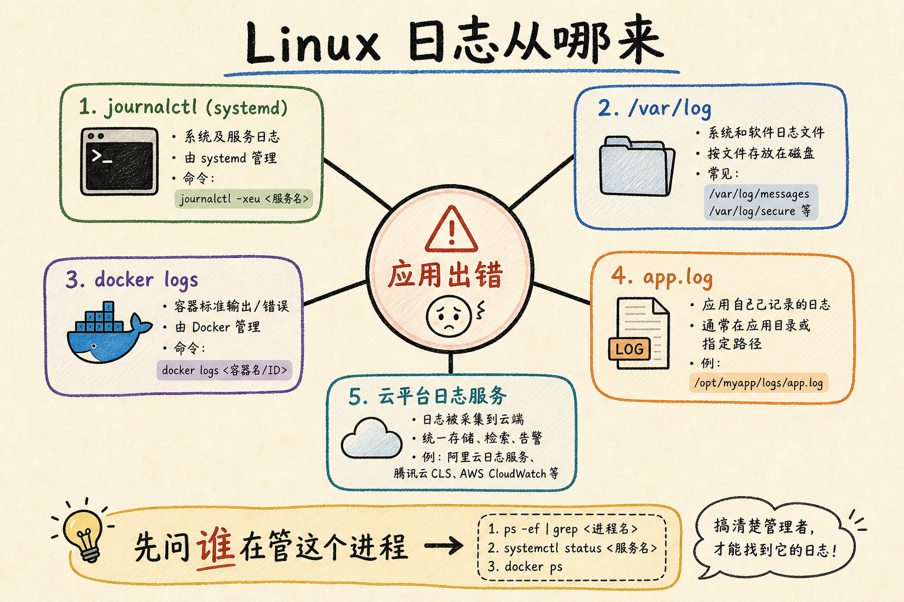
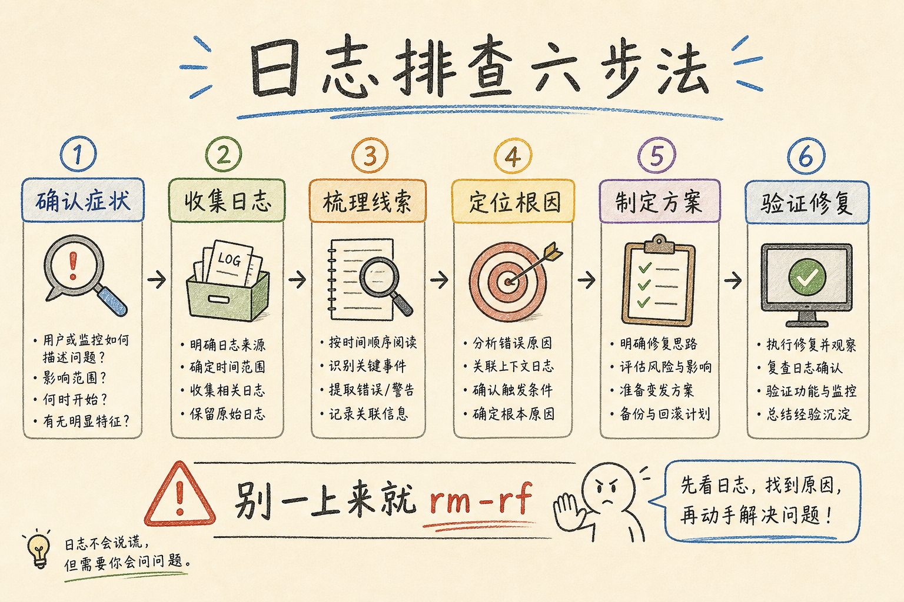
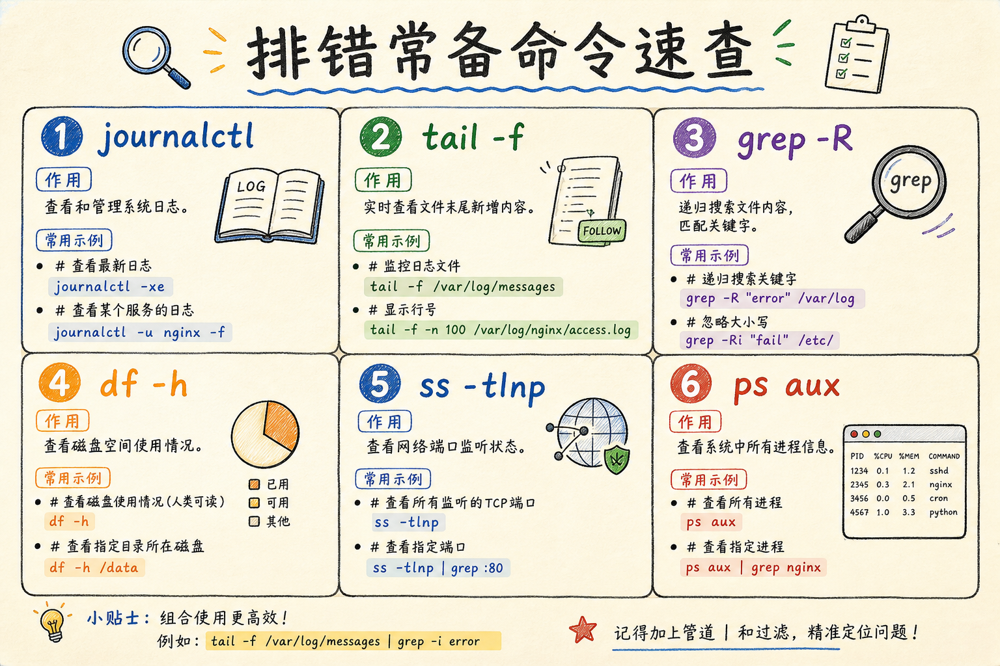

# Linux 常用命令与日志排查：从「SSH 上去一脸懵」到能独立查故障

> 线上接口突然 502，同事喊你「上服务器看看」。你 SSH 登录成功，对着黑底白字发呆：`cd` 到哪？日志在哪？`grep` 怎么用？`journalctl` 又是什么？这篇笔记从零梳理 **Linux 日常最常用的命令**（文件、进程、网络、磁盘、权限），再专门讲 **日志在哪、怎么读、怎么筛**，最后用一条完整的排错故事串起来。全程生活类比，命令能 copy-paste 练手。

---

## 目录

1. [前言：黑窗口里的第一次慌张](#1-前言黑窗口里的第一次慌张)
2. [命令行是什么：和图形界面怎么分工](#2-命令行是什么和图形界面怎么分工)
3. [命令的「语法」：先搞懂这一行在说什么](#3-命令的语法先搞懂这一行在说什么)
4. [文件与目录：在服务器里「走路」](#4-文件与目录在服务器里走路)
5. [查看与搜索文本：日志的基本功](#5-查看与搜索文本日志的基本功)
6. [权限与用户：为什么 Permission denied](#6-权限与用户为什么-permission-denied)
7. [进程与服务：谁在跑、怎么停](#7-进程与服务谁在跑怎么停)
8. [网络排查：端口通不通、请求打没打到](#8-网络排查端口通不通请求打没打到)
9. [磁盘与内存：是不是满了](#9-磁盘与内存是不是满了)
10. [日志从哪来：别在错误的地方找答案](#10-日志从哪来别在错误的地方找答案)
11. [systemd 与 journalctl：现代 Linux 的「总日志」](#11-systemd-与-journalctl现代-linux-的总日志)
12. [传统文本日志：/var/log 目录](#12-传统文本日志varlog-目录)
13. [容器日志：和 Docker 教程衔接](#13-容器日志和-docker-教程衔接)
14. [日志排查六步法：从现象到原因](#14-日志排查六步法从现象到原因)
15. [动手实战：模拟一次 502 排错](#15-动手实战模拟一次-502-排错)
16. [常见陷阱与 FAQ](#16-常见陷阱与-faq)
17. [总结：命令与排错决策速查](#17-总结命令与排错决策速查)

---

## 1. 前言：黑窗口里的第一次慌张

周五晚上，监控告警：生产环境 API 返回 **502 Bad Gateway**。  
你打开笔记本，SSH 连上云服务器：

```bash
ssh deploy@203.0.113.10
```

登录成功——然后盯着提示符 `deploy@prod-web:~$` 不知道下一步干什么。

你试过：

- 在桌面上找「日志文件夹」——服务器没有桌面
- 问同事「日志在哪」，对方说「看 nginx 和 journal」——你更懵了
- 复制网上一条 `rm -rf /*` 玩笑命令（**千万别真跑**）

**问题的本质**：后端开发在本地用 IDE、Docker Compose 时，很多运维动作被工具藏起来了；一旦上了**裸 Linux 服务器**或 **SSH 进容器**，必须靠**命令行**完成：找文件、看进程、读日志、查端口。

**Linux**（这里指服务器上常见的发行版，如 Ubuntu、Debian、CentOS）：一种操作系统，服务器领域极其常见。  
通俗说：云主机里跑的那套「管家系统」——你不直接摸鼠标，而是打字给它下指令。

读完本文，你应该能做到：

1. 用 `cd` / `ls` / `cat` / `grep` / `tail` 在服务器上找到并阅读日志。
2. 用 `ps` / `systemctl` / `ss` 判断服务有没有在跑、端口有没有在听。
3. 用 `journalctl` 和 `/var/log` 两套路径定位日志来源。
4. 按「六步法」从 502 / 磁盘满 / 进程挂掉等现象查到可行动的原因。
5. 在 WSL 或云主机上完成 §16.8 跟练清单，建立「SSH 不慌」的基本手感。

**不必一次背会所有命令**：本文是**地图 + 套路**；真机上多练几次 `tail -f` 和 `journalctl`，比死记硬背更有效。建议把本文和 [Docker Compose 教程](11.docker-compose-tutorial.md) 放在一起读：容器化解决环境一致，SSH + 日志解决线上出事后的第一小时。

**前置阅读**：会打开终端即可；若已读过 [Docker Compose 教程](11.docker-compose-tutorial.md)，§13 容器日志可直接接上。

**SSH 补充**：`ssh user@host` 登录远程服务器；`scp file user@host:/tmp/` 把本机文件拷到服务器。排错时常用 SSH；把日志文件 `scp` 回本地用编辑器看也可以，但生产大日志优先在服务器 `grep`。

**环境要求**：建议用 **Ubuntu 22.04+** 虚拟机、云主机、或 WSL2。文中 `systemctl` / `journalctl` 面向使用 **systemd** 的发行版（Ubuntu 20.04+、Debian、CentOS 7+ 等）。

### 1.2 在 Windows 上怎么练（WSL2 简述）

没有 Linux 服务器时，可在 Windows 安装 **WSL2**（Windows Subsystem for Linux）：在 Windows 里跑一个真实的 Ubuntu 子系统。  
通俗说：在 Windows 桌面上开一扇通往 Linux 世界的门。

安装后打开「Ubuntu」终端，即可练习本文所有命令（`systemctl` 在 WSL 里部分行为与真机不同，但 `ls`/`grep`/`tail` 完全一致）。真机排错前，至少应在 WSL 或云主机上**亲手敲过一遍** §4–§12。

云主机新手提示：厂商控制台提供的「网页终端」和本地 SSH 效果一样；安全组要放行 22 端口（SSH）和你对外的 80/443，否则 `curl` 本机通、外网不通。

### 1.3 读完本篇你能解决哪类问题？

| 以前的痛苦 | 学完后的做法 |
|------------|--------------|
| SSH 上去不知道进哪个目录 | `pwd` / `ls` / `cd` 三板斧 |
| 日志文件太大打不开 | `less` / `tail -f` / `grep` 组合 |
| 不知道 nginx 日志在哪 | 先 `systemctl status nginx`，再查 `/var/log/nginx/` |
| 服务明明部署了访问不了 | `ss -tlnp` 看端口，`curl` 本地探活 |
| 磁盘告警 | `df -h` 看分区，`du -sh` 找大目录 |
| 只会 GUI 不会黑窗口 | WSL 练 §16.8，建立肌肉记忆 |
| 出事先慌着手抖 | 固定走 §14 六步法，别乱敲危险命令 |

---

## 2. 命令行是什么：和图形界面怎么分工

**Shell**（壳）：你和 Linux 内核之间的「翻译官」，读你输入的文字命令并执行。  
通俗说：饭店服务员——你点菜（敲命令），厨房（系统）去做。

常见 Shell 叫 **bash**（Bourne Again Shell）。提示符里 `deploy@prod-web:~$` 表示：用户 `deploy`、主机 `prod-web`、当前在 home 目录 `~`。

| 方式 | 优点 | 典型场景 |
|------|------|----------|
| 图形界面 GUI | 直观、适合桌面 | 个人电脑上网、办公 |
| 命令行 CLI | 快、可脚本化、省带宽 | SSH 远程服务器、自动化运维 |

服务器通常**没有图形界面**——省资源、更安全。所以后端上线后排错，命令行是必修课，不是选修。

### 2.1 终端里每一截是什么意思

```text
deploy@prod-web:/var/log$  ls -la
└─┬─┘ └───┬───┘ └──┬──┘  └──┬──┘
 用户    主机名    当前目录  提示符($普通用户 #root)
```

`#` 结尾的提示符表示你已是 root，命令破坏力更大，操作前多想想。  
输错命令时 **Ctrl+C** 中断当前程序；**Ctrl+L** 或 `clear` 清屏（不删历史）。

### 2.2 和本系列怎么配合

| 你已读过 | Linux 命令帮你 |
|----------|----------------|
| [Docker Compose](11.docker-compose-tutorial.md) | `docker compose logs`、进容器 `exec` |
| [PostgreSQL](8.postgresql-tutorial.md) | 查库连不上时 `ss`、PG 日志路径 |
| [REST API](5.rest-api-design-tutorial.md) | 理解 502/504 与 HTTP 状态码 |
| [Git 分支策略](9.git-branch-strategy-tutorial.md) | 部署到服务器后验证是否在跑 |

读下图时，把五类命令当成「工具箱分区」——不必一次背完，用到再查。


对照上图：初学优先熟练 **cd / ls / cat / grep / tail / ps / systemctl / journalctl** 这八个；其余命令随排错场景慢慢补。

---

## 3. 命令的「语法」：先搞懂这一行在说什么

一条典型命令长这样：

```text
命令名   选项   参数
ls      -la    /var/log
```

- **命令名**：做什么（`ls` = 列出目录）
- **选项**（option）：以 `-` 或 `--` 开头，改行为（`-l` 长格式、`-a` 含隐藏文件）
- **参数**：操作对象（路径、文件名）

**管道**（pipe）`|``：把左边命令的输出，当作右边的输入。  
通俗说：流水线——前一个工序的输出，是后一个工序的原料。

```bash
cat /var/log/syslog | grep "error" | tail -n 20
```

含义：读 syslog → 筛含 error 的行 → 只留最后 20 行。

**重定向**：`>` 覆盖写文件，`>>` 追加。

```bash
echo "test" >> /tmp/my.log
```

**sudo**：以管理员（root）身份执行下一条命令。  
通俗说：临时借老板钥匙——改系统配置、看某些日志时常用。

```bash
sudo systemctl restart nginx
```

**副作用**：`sudo` 权限大，命令敲错可能搞挂服务；生产环境先看清再回车。

### 3.1 环境变量：echo 与 export

**环境变量**（environment variable）：进程能读到的「配置纸条」，如 `PATH`（去哪找可执行文件）、`HOME`（家目录路径）。  
通俗说：程序开机时塞进兜里的便签。

```bash
echo $HOME
echo $PATH
export MY_ENV=hello        # 当前 shell 会话有效
echo $MY_ENV
```

应用连接数据库时常用 `DATABASE_URL` 这类变量——排错时 `echo $DATABASE_URL` 可确认 shell 里是否设对（注意别把密码截图发群）。

### 3.2 命令历史与补全

```bash
history | tail -n 20    # 最近敲过的命令
```

按 **Tab** 键可自动补全命令和路径，少打字也少拼错。上/下方向键翻历史命令。

### 3.3 帮助文档：man 与 --help

```bash
man grep              # 完整手册，q 退出
grep --help           # 简短帮助
```

不必背所有选项；记住命令名，需要时 `man` 或 `--help`。

### 3.4 把常用命令写成脚本（进阶预告）

反复敲的组合可以放进 `check.sh`：

```bash
#!/bin/bash
set -e
echo "=== disk ==="
df -h
echo "=== failed services ==="
systemctl list-units --type=service --state=failed --no-pager
echo "=== listen ports ==="
ss -tlnp
```

`chmod +x check.sh` 后执行 `./check.sh`。初学先熟练单条命令，再考虑脚本化——值班巡检时常用。

---

## 4. 文件与目录：在服务器里「走路」

Linux 文件系统是一棵**倒过来的树**，根目录 `/` 在最顶上。  
通俗说：一个大柜子，从 `/` 进门，再进 `home`、`var`、`etc` 等抽屉。

| 路径 | 通俗说 | 和排错的关系 |
|------|--------|--------------|
| `/home/用户名/` | 你的家目录 | 放个人脚本、密钥（慎存） |
| `/etc/` | 配置文件柜 | nginx、ssh 配置在这 |
| `/var/log/` | 日志抽屉 | 大量文本日志 |
| `/tmp/` | 临时便签 | 重启可能清空 |
| `/var/lib/` | 程序数据 | 数据库文件等 |

### 4.1 必会命令

演示什么：在练习机上浏览目录。  
预期：能看到文件列表；`pwd` 打印当前路径。

```bash
pwd                 # Print Working Directory：我在哪
ls                  # 列出当前目录
ls -la              # 长格式 + 隐藏文件（ . 开头）
cd /var/log         # Change Directory：进日志目录
cd ..               # 上一级
cd ~                # 回家目录
mkdir -p practice/logs   # 建目录，-p 表示父目录不存在则一并创建
cp file1 file2      # 复制
mv file1 file2      # 移动或重命名
rm file2            # 删除文件——删前看清路径！
rm -r practice      # 递归删目录——极度危险，确认路径
```

**先错后对**：

```bash
# ❌ 想删 practice 目录，却写成
rm practice         # 若 practice 是目录，会报错；若误用 rm -rf 且路径错……

# ✅ 先 ls 确认，再
rm -r practice
```

生产环境**禁止**不经确认使用 `rm -rf`，尤其带 `sudo` 的。

### 4.4 路径小技巧：绝对路径与相对路径

- **绝对路径**：从 `/` 开头，如 `/var/log/nginx/error.log`，无论当前在哪都能找到  
- **相对路径**：相对当前目录，如 `logs/app.log`、 `./config.yml`  
- **`..`**：上一级；**`.`**：当前目录  
- **`~`**：当前用户家目录，常是 `/home/deploy`

```bash
cd /var/log
pwd
ls nginx/error.log      # 相对路径
ls /var/log/nginx/error.log   # 绝对路径，效果相同
```

排错时建议**日志尽量写绝对路径**，避免 `cd` 错了读错文件。

### 4.5 find：按名字找文件

```bash
find /var/log -name "*.log" -type f 2>/dev/null | head
```

`2>/dev/null` 把「无权限」的报错丢掉，避免刷屏。  
预期：列出 `/var/log` 下部分 `.log` 文件路径。

### 4.6 编辑文件：nano 与 vim（二选一入门）

改配置、临时记笔记时要**编辑器**。初学推荐 **nano**：

```bash
nano /tmp/notes.txt
# 底部有提示：^O 保存，^X 退出（^ 表示 Ctrl）
```

**vim** 功能更强但学习曲线陡，至少记住：  
`vim file` → 按 `i` 进入插入 → 改完 `Esc` → 输入 `:wq` 回车保存退出；放弃则用 `:q!`。

生产环境改 `/etc/nginx/nginx.conf` 前，先 `sudo cp` 备份一份：

```bash
sudo cp /etc/nginx/nginx.conf /etc/nginx/nginx.conf.bak.$(date +%F)
```

---

## 5. 查看与搜索文本：日志的基本功

日志大多是**纯文本**。读日志 = 读文本文件 + 筛选。

读下图时，看四列「什么时候用谁」——排错时 80% 时间在 `tail` 和 `grep` 之间切换。


对照上图：**大文件别 `cat` 一把梭**（刷屏卡死终端）；实时跟日志用 `tail -f`；找关键词用 `grep`。

### 5.1 cat：一次性倒出小文件

```bash
cat /etc/os-release
```

适合几 KB 的配置；几百 MB 的日志请换 `less` 或 `tail`。

### 5.2 less：翻页看大文件

```bash
less /var/log/syslog
```

操作：`空格` 下一页，`b` 上一页，`/error` 搜索，`q` 退出。

### 5.3 head / tail：看头尾

```bash
head -n 20 app.log    # 前 20 行
tail -n 50 app.log    # 后 50 行
tail -f app.log       # follow：持续输出新增行，Ctrl+C 退出
```

**`tail -f`** 是排错神器——重启服务后开着它，另开窗口复现问题，新日志会实时滚出来。

### 5.4 grep：按关键词筛

**grep**（Global search Regular Expression and Print）：在文本里找匹配的行。  
通俗说：全文搜索 Ctrl+F 的命令行版。

```bash
grep "ERROR" app.log
grep -i "error" app.log          # -i 忽略大小写
grep -n "Exception" app.log        # -n 显示行号
grep -C 3 "Traceback" app.log      # -C 3 前后各 3 行上下文
grep -r "Connection refused" /var/log --include="*.log" 2>/dev/null
```

`-r` 递归搜目录——磁盘大时可能慢，尽量先缩小目录或加 `--include`。

### 5.5 组合示例

演示什么：从 syslog 里找最近和 nginx 相关的行。  
预期：输出若干行，若无 nginx 则可能为空。

```bash
grep nginx /var/log/syslog | tail -n 30
```

### 5.6 统计与去重：wc、sort、uniq

日志里常问「ERROR 出现了多少次」「有哪些不同的 IP」：

```bash
grep "ERROR" app.log | wc -l                    # 行数
grep "ERROR" app.log | sort | uniq -c | sort -rn | head   # 按内容计数，最多的在前
```

`wc -l` 数行；`sort` 排序；`uniq -c` 合并相邻重复行并计数——所以通常先 `sort` 再 `uniq`。

### 5.7 解压旧日志

```bash
sudo zcat /var/log/nginx/error.log.2.gz | grep "upstream" | tail
# 或
sudo zgrep "upstream" /var/log/nginx/error.log.2.gz
```

### 5.8 用 Python logging 对齐本文级别（可选）

演示什么：本地生成带级别的日志，练习 `grep`。  
前置：Python 3.10+。

```python
import logging

logging.basicConfig(
    level=logging.INFO,
    format="%(asctime)s %(levelname)s %(message)s",
    filename="logs/app.log",
)
logging.info("server started")
logging.error("database timeout")
```

然后：`grep ERROR logs/app.log`。  
生产里更推荐打到 **stdout** 交给 systemd/Docker 收集，而不是自己管文件轮转——和 §13 呼应。

练习时可在 `logs/` 里多写几行不同级别，分别用 `grep INFO`、`grep ERROR` 感受筛选效果；再试 `grep -v INFO` 排除 INFO 行（`-v` 表示反向匹配）。

---

## 6. 权限与用户：为什么 Permission denied

每条文件/目录有三类身份：**所有者**（user）、**所属组**（group）、**其他人**（others）。  
每类又有读 `r`、写 `w`、执行 `x` 权限。

`ls -l` 第一列类似 `-rw-r--r--`：类型 + 三组权限。  
**目录**要有 `x` 权限才能 `cd` 进去——光有读权限不够，初学者常卡在这里。

```bash
ls -l /var/log/nginx/error.log
```

若提示 `Permission denied`：

1. 用 `sudo` 读：`sudo less /var/log/nginx/error.log`
2. 或把自己加进有权限的组（运维操作，初学知道即可）

```bash
chmod 644 file    # 所有者读写，其他人只读——仅举例，生产慎改
chown user:group file   # 改所有者，通常要 sudo
```

**陷阱**：不要随便 `chmod 777`「一劳永逸」——等于大门敞开，安全风险极高。

### 6.1 数字权限（了解即可）

`chmod 644` 中：所有者 6=rw-，组 4=r--，其他人 4=r--。  
初学用 `ls -l` 看字母形式更直观；改权限前问运维是否有规范。

### 6.2 whoami 与 id

```bash
whoami    # 当前用户名
id        # 用户 uid、所属组
```

排错时先确认自己是不是 `root` 或 `deploy`——权限问题往往从这里开始。

---

## 7. 进程与服务：谁在跑、怎么停

**进程**（process）：正在运行的程序实例。  
通俗说：已经打开着的那个「游戏窗口」，不是安装包本身。

### 7.1 ps：快照看进程

```bash
ps aux | grep nginx
ps aux | grep python
```

`aux` 是常用组合：看所有用户的进程。  
`grep` 会把自己也筛出来，忽略 `grep --` 那一行即可。

### 7.2 top / htop：动态看资源

```bash
top     # 按 q 退出；占 CPU 高的进程往上冒
```

`htop` 更友好，需安装：`sudo apt install htop`。

### 7.3 systemctl：管「服务」

现代 Linux 用 **systemd** 管理服务。  
**服务**（service）：后台长期运行的程序，如 nginx、ssh、postgresql。

```bash
systemctl status nginx      # 状态：active (running) 还是 failed
sudo systemctl start nginx
sudo systemctl stop nginx
sudo systemctl restart nginx
sudo systemctl enable nginx   # 开机自启
```

`status` 输出里常有最近几行日志提示——排错第一步常敲它。

示例输出里关注三行：

- **Active:** `active (running)` 还是 `failed`  
- **Main PID:** 主进程号，可配合 `ps`  
- **日志片段**：有的会直接提示 error 路径

```bash
# 查看某个服务是否跑过、重启了几次
systemctl show nginx -p NRestarts --value
```

### 7.4 kill：结束进程

```bash
kill 12345           # 礼貌结束（发 SIGTERM）
kill -9 12345        # 强制杀死（SIGKILL），慎用
```

先 `systemctl stop` / 应用自己的优雅退出；`kill -9` 是最后手段，可能导致数据半写入。

### 7.5 开机自启与最近失败

```bash
systemctl is-enabled nginx
systemctl list-units --type=service --state=failed
```

第二条列出**启动失败**的服务——机器重启后接口全挂，先扫一眼这里。

---

## 8. 网络排查：端口通不通、请求打没打到

### 8.1 curl：命令行发 HTTP 请求

```bash
curl -I http://127.0.0.1:8000/health    # 只看响应头
curl http://127.0.0.1:8000/health       # 看 body
curl -v http://127.0.0.1:8000/health    # 详细握手过程
```

在服务器上 `curl 127.0.0.1` 表示「本机访问本机」，绕过外网 DNS——判断是应用挂了还是防火墙/负载均衡问题。

```bash
# POST 带 JSON（调试 API 时常用）
curl -X POST http://127.0.0.1:8000/api \
  -H "Content-Type: application/json" \
  -d '{"name":"test"}'
```

若 `curl` 能通而用户浏览器不通，问题可能在防火墙、安全组、DNS 或 CDN，而不是应用进程本身。

### 8.2 ss / netstat：谁占了哪个端口

**ss**（socket statistics）：看网络连接和监听端口，比老命令 `netstat` 更快。  
通俗说：查「哪个程序在听 8000 端口」。

```bash
ss -tlnp | grep 8000
ss -tlnp | grep 5432
```

`-tlnp`：TCP、仅监听、数字端口、显示进程（可能要 sudo 才显示进程名）。

预期：若 uvicorn 在跑，能看到 `0.0.0.0:8000` 和 `pid`。

没有 `sudo` 时，`ss -tlnp` 可能不显示进程名，但端口是否在听仍能看到——够判断「8000 有没有人听」。

### 8.3 ping：测网络可达（不是万能）

```bash
ping -c 4 8.8.8.8
```

只能证明 ICMP 通，**不能**证明 80/443 端口通——网站挂了 ping 仍可能通。

### 8.4 502 / 504 和命令的对应关系（直觉校正）

| 用户看到 | 常见含义 | 你先查 |
|----------|----------|--------|
| 502 Bad Gateway | 反向代理连不上后端 | nginx error.log、`ss` 看后端端口 |
| 504 Gateway Timeout | 后端太慢或卡死 | 应用日志、CPU、`top` |
| Connection refused | 目标端口没有进程在听 | `ss -tlnp`、服务是否 start |

**直觉类比，决策以日志为准**：表上是常见情况，具体以 error.log 里的 `connect()` / `timeout` 字样为准。

---

## 9. 磁盘与内存：是不是满了

### 9.1 df：分区还剩多少空间

```bash
df -h
```

`-h` human-readable（G/M 显示）。若某分区 **Use% 100%**，写日志、数据库会失败，引发各种诡异报错。

### 9.2 du：哪个目录占空间

```bash
du -sh /var/log/*
du -sh /var/lib/docker/*
```

找「谁吃掉了磁盘」——日志未轮转、Docker 镜像未清理是常见原因。

### 9.3 free：内存

```bash
free -h
```

内存满时系统可能杀进程（OOM），应用突然消失——`dmesg | tail` 有时能看到 OOM 记录。

### 9.4 清理空间时的安全顺序

1. `df -h` 确认哪个分区满  
2. `du -sh /var/*` 找大户  
3. 优先清**可再生的**：旧日志（确认已归档）、Docker 未用镜像（见 Docker 教程 `docker system df`）、`/tmp` 临时文件  
4. **不要**随手删 `/var/lib/postgresql` 等数据目录

### 9.5 iostat / vmstat（了解即可）

磁盘或 CPU 飙高时，运维可能用 `iostat -x 1`、`vmstat 1` 看实时抖动。初学知道「有这类工具」即可；你先把 `df`、`top`、`journalctl` 练熟。

---

## 10. 日志从哪来：别在错误的地方找答案

**日志**（log）：程序运行过程中留下的文字记录，按时间记下「发生了什么」。  
通俗说：飞机黑匣子——出事之后靠它还原现场。

常见**日志级别**（从吵到静）：

| 级别 | 含义 | 排错时 |
|------|------|--------|
| ERROR | 错误，功能失败 | 优先看 |
| WARN | 警告，还能跑 | 次优先 |
| INFO | 正常业务流程 | 量大，常要 grep 缩小 |
| DEBUG | 调试细节 | 通常默认不开 |

**应用该打什么日志**：请求 ID、用户 ID（脱敏）、错误堆栈、耗时——方便你用 `grep` 定位。Python 里用标准库 `logging` 模块，级别设为 INFO，错误用 `logger.exception()` 会自动带堆栈。

读下图时，看中心「应用出错」连出的五条来源——先判断你的程序属于哪一种。



对照上图口诀：**先问「谁在管这个进程」**——systemd 服务 → `journalctl`；Docker → `docker compose logs`；传统 daemon → `/var/log`；你自己的 Python 可能写到项目 `logs/`。

### 10.1 现象与日志入口速查

| 用户/监控现象 | 优先查什么 | 详见 |
|---------------|------------|------|
| 502 / 504 | nginx error.log + 后端日志 | §8.4、§15 |
| 磁盘告警 | `df -h`、`du` | §9 |
| 权限不够 | `whoami`、`sudo` | §6 |
| 时区对不上 | `timedatectl` | §16.6 |

---

## 11. systemd 与 journalctl：现代 Linux 的「总日志」

**journald**：systemd 的日志守护进程，把很多服务的输出收到统一日志池。  
**journalctl**：查询 journald 日志的命令。

```bash
journalctl -xe                    # 最近日志，带解释；-x 略增可读性
journalctl -u nginx.service -n 50 # 某个服务最近 50 行
journalctl -u nginx.service -f    # 实时跟踪，类似 tail -f
journalctl --since "1 hour ago"
journalctl --since "2026-07-05 09:00" --until "2026-07-05 10:00"
journalctl -p err -u myapp.service  # 仅 error 及以上级别
```

演示什么：看 ssh 服务最近有没有异常登录。  
预期：若系统正常，多为 INFO；失败登录会出现 Failed 字样。

```bash
sudo journalctl -u ssh -n 30
```

若输出提示「No entries」，可能是服务名不对，用 `systemctl list-units --type=service | grep ssh` 查准确单元名。

看别的用户的服务日志常要 `sudo`。

### 11.1 journalctl 常用组合速查

| 你想干什么 | 命令 |
|------------|------|
| 实时跟某服务 | `journalctl -u nginx -f` |
| 最近 1 小时 | `journalctl -u nginx --since "1 hour ago"` |
| 只看错误级 | `journalctl -u nginx -p err` |
| 本次启动以来 | `journalctl -u nginx -b` |
| 导出给同事 | `journalctl -u nginx --since today > /tmp/nginx.log` |

---

## 12. 传统文本日志：/var/log 目录

很多程序仍直接写文件：

| 路径 | 常见内容 |
|------|----------|
| `/var/log/syslog` | 系统综合消息（Debian/Ubuntu） |
| `/var/log/messages` | 系统消息（部分 RHEL 系） |
| `/var/log/nginx/access.log` | HTTP 访问记录 |
| `/var/log/nginx/error.log` | nginx 错误 |
| `/var/log/postgresql/` | PostgreSQL 日志 |

```bash
sudo tail -n 100 /var/log/nginx/error.log
sudo grep "upstream" /var/log/nginx/error.log | tail -n 20
```

**日志轮转**（logrotate）：系统自动把大日志切成 `error.log.1`、`error.log.2.gz`，避免撑满磁盘。  
若排错要找「几天前」的，可能要在 `.gz` 里查：

```bash
sudo zgrep "ERROR" /var/log/nginx/error.log.2.gz
```

### 12.1 access.log 与 error.log 分工

- **access.log**：谁、何时、访问了哪个 URL、返回码多少——适合查「有没有请求打到服务器」  
- **error.log**：nginx 自己认为的错误、连不上后端、证书问题等——**502 优先看 error.log**

```bash
sudo tail -n 20 /var/log/nginx/access.log
```

若 access 里已有 502，说明请求到了 nginx；若完全没有记录，可能是 DNS、防火墙或用户访问的根本不是这台机。

### 12.2 用 tail 同时盯 access 与 error（值班技巧）

开两个 SSH 窗口，或在一个终端用 **tmux** 分屏（了解即可）：

```bash
# 窗口 A
sudo tail -f /var/log/nginx/error.log
# 窗口 B
sudo tail -f /var/log/nginx/access.log
```

一边复现用户操作，一边看 access 有没有进来、error 有没有新增——比事后翻整本日志高效得多。

---

## 13. 容器日志：和 Docker 教程衔接

若你用 [Docker Compose](11.docker-compose-tutorial.md) 部署，应用 stdout/stderr 由 Docker 收集：

```bash
docker compose logs -f web
docker compose logs --since 30m web
docker compose logs web 2>&1 | grep ERROR
```

容器里文件日志若没挂载出来，**优先看 `docker compose logs`**，而不是在宿主机乱 `find`。

若容器状态是 `Restarting`，`docker compose logs --tail 100 web` 往往能看到启动失败原因（端口占用、连不上数据库、import 错误等）。

### 13.1 Python / FastAPI 日志去哪了

若用 `uvicorn` 直接跑，**print 和 logging 默认输出到 stdout**，Docker 会收进 `docker compose logs`。  
在裸机 systemd 服务里，同样会进 `journalctl -u 你的服务名`。  
只有当你把日志 `FileHandler` 写到某个路径时，才去 `tail` 那个文件。

---

## 14. 日志排查六步法：从现象到原因

读下图时，按箭头从左走到右——这是本文推荐的固定套路，避免瞎试命令。



对照上图展开：

1. **确认症状**：用户看到 502？还是 CPU 100%？现象要具体。
2. **找日志源**：nginx 反向代理 → nginx error log + 后端应用日志；systemd 服务 → `journalctl -u`。
3. **缩小时间**：出问题大概几点？用 `--since` 或 `grep` 时间段。
4. **关键词过滤**：`ERROR`、`Exception`、`refused`、`timeout`、`No space left`。
5. **对照配置/代码**：日志说 `connect() failed` 就去查端口和 upstream 配置。
6. **验证修复**：重启或改配置后，**再看日志**是否还有新 ERROR，并 `curl` 复测。

排错时建议**从外到内**：用户浏览器 → 负载均衡 → nginx → 应用 → 数据库。每一层都有对应日志或探活命令，不要跳过 nginx 直接怀疑数据库——502 十有八九要先读 nginx error.log。

### 14.1 记录排错笔记（好习惯）

在 `/tmp/incident-20260705.txt` 里随手记：

- 现象与时间  
- 敲过的命令与关键输出  
- 最终根因与修复  

下次同类问题可 `grep` 自己的笔记；生产环境要写工单或 postmortem 时也更省力。

---

## 15. 动手实战：模拟一次 502 排错

**阅读顺序**：§7 systemctl、§8 curl/ss、§11 journalctl、§12 nginx 日志。

**场景**：Nginx 反向代理到本机 `127.0.0.1:8000` 的 FastAPI，但后端没启动，用户访问得到 502。

> 若你本地未装 nginx，可把本节当作「读日志 + 推理」练习；命令输出以你机器为准，重点学**顺序**，不是背每一行字面。

### 15.1 确认现象

```bash
curl -I http://127.0.0.1/        # 若 nginx 在 80 端口
# 预期：HTTP/1.1 502 Bad Gateway
```

### 15.2 看 nginx 是否在跑、端口是否在听

```bash
systemctl status nginx
ss -tlnp | grep -E ':80|:8000'
```

预期：nginx 在听 80；**8000 没有进程**——线索指向后端未启动。

### 15.3 读 nginx 错误日志

```bash
sudo tail -n 30 /var/log/nginx/error.log
```

典型一行（表述因版本略有不同）：

```text
connect() failed (111: Connection refused) while connecting to upstream ...
```

**解读**：nginx 活着，但连不上 upstream（后端）——不是 nginx「坏了」，是后端没起来或地址错。

此时可打开 nginx 配置确认 upstream 地址（只读，改前先备份）：

```bash
sudo grep -R "proxy_pass\|upstream" /etc/nginx/ -n
```

常见配置形如 `proxy_pass http://127.0.0.1:8000;`——若应用改端口而 nginx 未改，也会 502。

### 15.4 查后端服务日志

若后端用 systemd 管理：

```bash
sudo journalctl -u myapp.service -n 50 --no-pager
```

若用 Docker：

```bash
docker compose logs --tail 50 web
```

### 15.5 修复并验证

```bash
sudo systemctl start myapp.service   # 或 docker compose up -d web
curl http://127.0.0.1:8000/health
curl -I http://127.0.0.1/
```

预期：health 返回 200；首页不再 502。

### 15.6 若没有 nginx，只有本机应用

把步骤简化为：`ss -tlnp` → `journalctl` / 应用 log → `grep ERROR` → 修配置 → 再 `curl`。

### 15.7 案例二：磁盘满导致数据库写不进去

**症状**：接口 500，日志里 `No space left on device`。

```bash
df -h
du -sh /var/log/* | sort -h | tail -n 10
sudo journalctl --disk-usage
```

处理：清日志或扩盘；数据库服务 `sudo systemctl restart postgresql` 后再观察。  
**教训**：监控磁盘和使用率告警比事后 grep 更省心——日志排查是最后一道防线，不是唯一防线。

### 15.8 案例三：权限不足读不了日志

**症状**：`tail: cannot open '/var/log/nginx/error.log' for reading: Permission denied`

```bash
whoami
sudo tail -n 50 /var/log/nginx/error.log
```

长期方案：让运维把你加入 `adm` 组或配置只读 sudo 规则——初学用 `sudo` 读即可。

### 15.9 案例四：CPU 飙高但接口还能用

```bash
top -o %CPU    # 或 htop，按 CPU 排序
ps aux --sort=-%cpu | head -n 10
```

找到占 CPU 的进程后，再 `journalctl -u 该服务 --since "30 min ago"` 看是否在做重计算、死循环或 Full GC。  
**不要**一上来就 `kill -9` 占最高的进程——可能是数据库而不是肇事者，先确认进程名。

---

## 16. 常见陷阱与 FAQ

### 16.1 陷阱一：生产环境乱用 rm -rf

路径多一个空格可能删错盘。用 `rm -i` 交互确认，或先 `mv` 到 `/tmp` 观察。  
真实事故常来自：`rm -rf / var/log`（`/` 和 `var` 之间多了空格）这类手滑——删命令前**眼睛离开屏幕停一秒**。

### 16.2 陷阱二：cat 几 GB 日志

终端卡死、SSH 断线。用 `less`、`tail`、`grep`。

### 16.3 陷阱三：grep 不到就以为没问题

默认大小写敏感；日志可能是 `Error` 或 JSON 里字段名不同。试 `grep -i`，或换关键词 `fail`、`exception`。

### 16.4 陷阱四：忽略磁盘满

`No space left on device` 后什么都怪。先 `df -h`。

### 16.5 陷阱五：在容器里找宿主机路径

路径不对。先搞清楚「我是在宿主机还是在容器里」——`cat /etc/os-release` 或看提示符、 `docker ps`。

### 16.6 陷阱六：把时间当地时间还是 UTC 搞混

日志时间戳有的是 UTC，有的是服务器本地时区。`journalctl` 默认常用本地时区；和监控平台对时间线时，先 `timedatectl` 看系统时区，避免「日志里 10:00 其实对应监控 18:00」的乌龙。

### 16.7 FAQ

**Q：Windows 怎么练？**  
A：装 [WSL2](https://learn.microsoft.com/windows/wsl/)，在 Ubuntu 子系统里练；或开云主机按量付费。

**Q：macOS 和 Linux 命令一样吗？**  
A：日常 90% 一样；`ss`、路径 `/var/log` 在 Mac 上部分不同，服务器以 Linux 为准。

**Q：日志太多 grep 很慢？**  
A：先 `tail -n 5000` 再 grep；或用 `journalctl --since` 缩小范围。

**Q：和监控告警什么关系？**  
A：监控告诉你「有问题」；SSH + 日志告诉你「为什么」。二者互补。

**Q：日志能删吗？**  
A：开发机可以；生产先确认有轮转、有备份，或交给运维。乱删会让事故无法复盘。

**Q：看不懂英文日志怎么办？**  
A：先搜 `error`、`fail`、`refused`、`timeout` 等关键词；堆栈里文件名和行号通常比自然语言更重要。可把**单行**错误（去掉密码）贴给同事或搜索引擎，勿整库外传。

**Q：一行命令太长怎么换行？**  
A：在 bash 里行末加 `\` 再回车，下一行继续同一命令。

**Q：生产环境可以直接改配置吗？**  
A：应有变更流程；至少 `cp` 备份、改完 `nginx -t` 测配置语法，再 `reload`，并盯着 error.log 几分钟。

**Q：日志里敏感信息怎么办？**  
A：密码、token 不要打进日志；若已泄露，轮换密钥比 `grep` 删行更重要。

### 16.8 本地跟练清单（建议亲手做一遍）

在 WSL 或云主机上：

1. `mkdir -p ~/practice/logs && cd ~/practice`  
2. `echo "2026-07-05 INFO started" >> logs/app.log`  
3. `echo "2026-07-05 ERROR db timeout" >> logs/app.log`  
4. `tail -f logs/app.log`（另开终端继续 echo，观察实时输出）  
5. `grep ERROR logs/app.log`  
6. `wc -l logs/app.log`  
7. 可选：安装 nginx 后重复 §15 的 `curl` + `tail error.log`

跟练时建议**开两个终端窗口**：一个跑 `tail -f`，另一个制造新日志或重启服务，模拟真实值班时「一边盯日志一边操作」的节奏。练完用 `rm -r ~/practice` 清理（确认路径在家目录，别删错）。

### 16.9 动手自检清单

- [ ] 能用 `pwd` / `ls` / `cd` 找到 `/var/log`
- [ ] 会用 `tail -f` 实时跟日志
- [ ] 会用 `grep -i` 搜 ERROR
- [ ] 会用 `systemctl status` 和 `journalctl -u`
- [ ] 会用 `ss -tlnp` 看端口
- [ ] 会用 `df -h` 排除磁盘满
- [ ] 知道 502 先看 nginx error log 还是后端日志
- [ ] 能在 WSL 或云主机完成 §16.8 跟练清单

---

## 17. 总结：命令与排错决策速查

读下图作复习卡片；日常把 `journalctl`、`tail -f`、`grep`、`ss`、`df` 放在手边。



对照上图：在服务器上先 `whoami` 确认身份——没权限就加 `sudo`，别猜。

### 17.1 概念速记

| 术语 | 一句话 |
|------|--------|
| Shell | 读你命令的「翻译官」，常见 bash |
| 管道 `\|` | 前一个命令输出给后一个吃 |
| systemd | 现代 Linux 服务管理器 |
| journalctl | 查 systemd 收集的日志 |
| grep | 按关键词筛行 |
| tail -f | 实时跟踪文件新增行 |
| ss | 看监听端口与连接 |

### 17.2 决策树

```
SSH 登录后先干什么？
├─ 不知道服务活没活 → systemctl status / docker compose ps
├─ 端口对不对 → ss -tlnp | grep 端口
├─ 磁盘满不满 → df -h
└─ 再读日志
    ├─ systemd 服务 → journalctl -u xxx -f --since "1 hour ago"
    ├─ Docker → docker compose logs -f
    └─ nginx 等 → /var/log/nginx/error.log

日志太大？
├─ 先缩时间 journalctl --since / tail -n
└─ 再 grep 关键词
```

### 17.3 与系列教程的衔接

- 容器里排错：[Docker Compose 教程 §13](11.docker-compose-tutorial.md)
- 数据库日志：`/var/log/postgresql/` 或容器日志，见 [PostgreSQL 教程](8.postgresql-tutorial.md)
- API 返回码含义：[REST API 设计](5.rest-api-design-tutorial.md)

### 17.4 命令与场景对照表（扩展）

| 你想知道 | 首选命令 |
|----------|----------|
| 我在哪个目录 | `pwd` |
| 这个目录有什么 | `ls -la` |
| 文件最后写了啥 | `tail -n 100 file` |
| 错误实时滚屏 | `tail -f file` 或 `journalctl -f` |
| 关键词在哪行 | `grep -n "词" file` |
| 服务活没活 | `systemctl status name` |
| 端口谁在听 | `ss -tlnp \| grep 端口` |
| 本机接口通不通 | `curl -v http://127.0.0.1:端口/路径` |
| 磁盘还剩多少 | `df -h` |
| 哪个目录最大 | `du -sh /*` 或 `du -sh /var/*` |
| 复制文件到本机 | `scp user@host:/path/log ./` |

背不下全表没关系：收藏本文 §17，SSH 时打开搜「你想知道」那一列即可。第一次值班建议打印或保存 §17.7 的 60 秒清单，直到形成肌肉记忆。

### 17.5 下一步学什么

- **awk / sed**：更复杂的日志解析
- **logrotate** 配置：防止日志撑盘
- **集中日志**：Loki、ELK、云日志服务——把多台机器日志收到一个地方搜，原理仍是 `grep` 的放大版
- **可观测性**：指标（Prometheus）+ 链路追踪，与日志组成三板斧；指标回答「什么时候开始异常」，日志回答「哪一行错了」

### 17.6 初学者可能仍困惑的点

1. **vi/vim 编辑器**：改配置常会遇到；初学至少会 `i` 插入、`Esc`、`:wq` 保存退出，或用 `nano` 更友好。
2. **权限不够**：不是命令错了，是用户不对——`sudo` 或找运维开权限。
3. **日志没有 ERROR 只有 WARN**：问题可能是慢、重试、超时，换关键词 `timeout`、`refused`、`fail`。
4. **中文乱码**：终端编码与日志文件编码不一致时，用 `less` 或设置 `LANG=UTF-8`；应用日志建议统一 UTF-8。
5. **命令敲了没反应**：可能卡在等输入（如 `grep` 没给文件、`tail -f` 没 Ctrl+C）；或需要 `sudo` 密码，终端不会显示星号，输完回车即可。
6. **WSL 与真机差异**：WSL 里 `systemctl` 可能不可用或行为不同，文件与 grep 练习仍以 WSL 为准，服务管理建议在云主机上再练一遍。

### 17.7 最小复习：SSH 登录后 60 秒

```text
1. whoami && hostname
2. df -h                    # 磁盘
3. systemctl status 服务名   # 或 docker compose ps
4. ss -tlnp | grep 端口
5. journalctl -u 服务 -n 50 --no-pager   # 或 tail /var/log/...
6. grep -i error 日志文件 | tail
```

把这条链练成肌肉记忆，比背 100 个冷门命令更有用。

### 17.8 从「会敲命令」到「会排障」

会敲命令只是起点。真正排障时你在做三件事：**缩小范围**（是网络、磁盘、进程还是配置）、**建立时间线**（几点开始出错）、**验证假设**（改完用 curl 和日志确认）。  
本文的命令都是为这三件事服务的——别追求一次记全，遇到事故时带着六步法翻这篇笔记即可。

值班时可以把 §17.7 的 60 秒清单贴在便签上：先磁盘、再服务、再端口、再日志——顺序错了容易在错误方向浪费半小时。配合 §16.8 跟练清单在 WSL 里练两遍，比只读一遍正文更有把握。

---

> **系列定位**：本文覆盖 Linux 日常命令与日志排查入门，足以应对 SSH 上「服务挂了就绪、502、磁盘满」一类常见问题。内核调优、防火墙 iptables/nftables、K8s 集群级排错属于进阶——遇到再专项学习即可。
