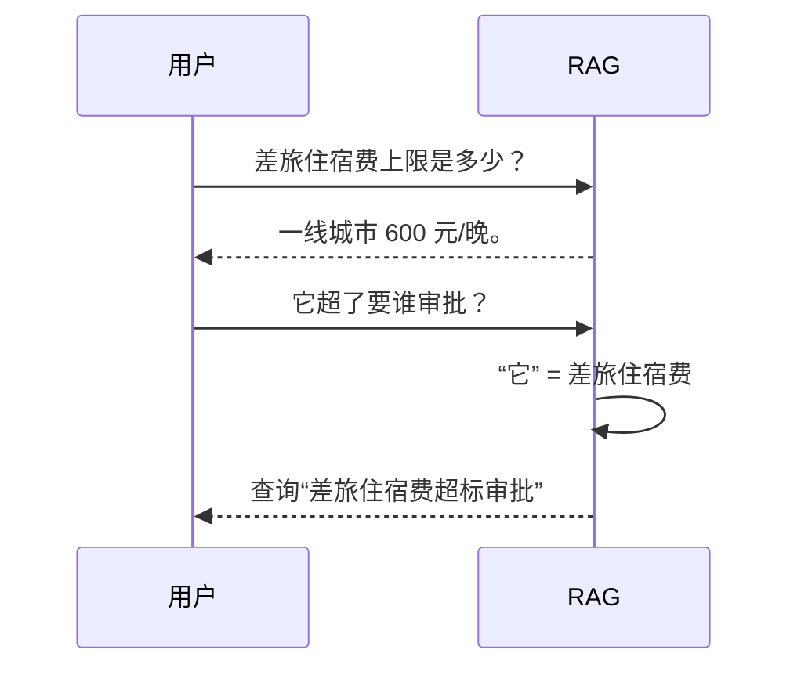
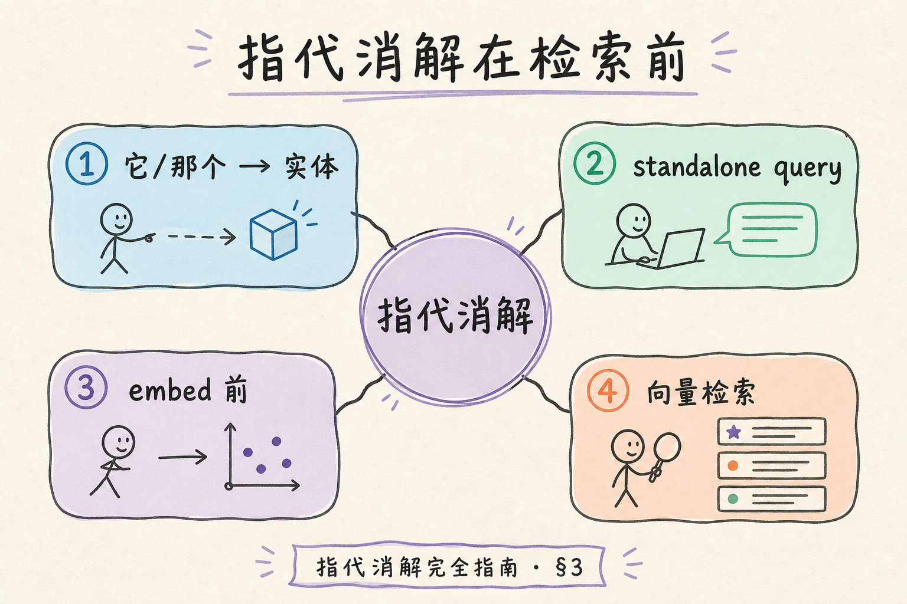
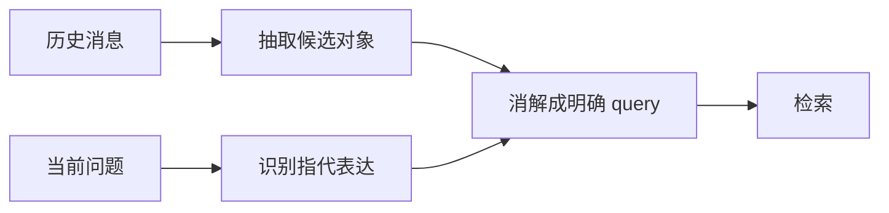
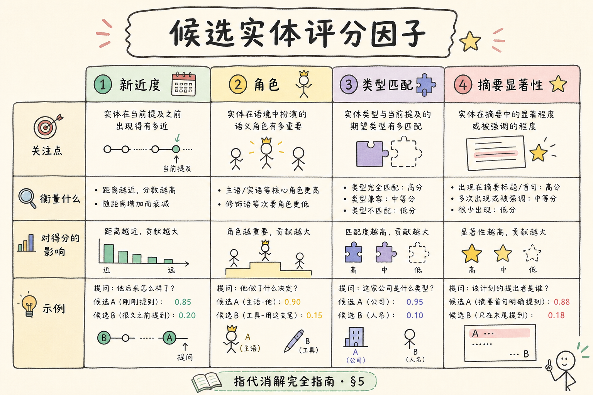
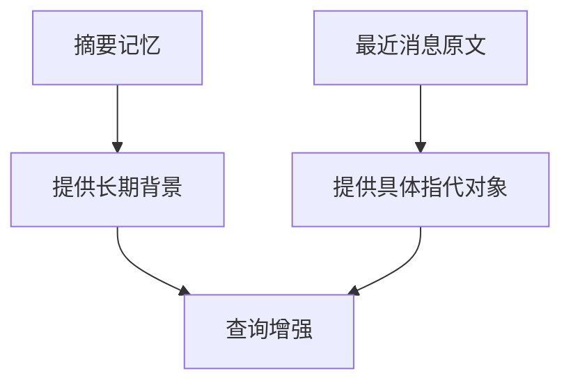
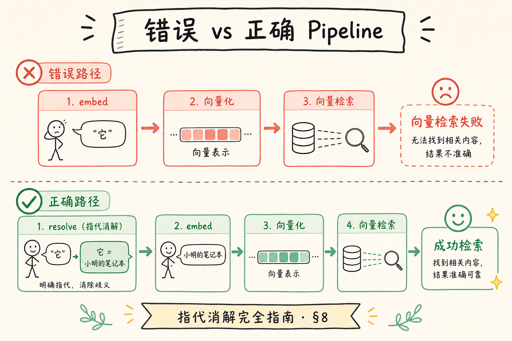

# C6 多轮对话（四）：指代消解入门

多轮对话中，用户经常说“它”“这个”“上面那个”。如果系统不知道这些词指向什么，检索就会跑偏。**指代消解**（Coreference Resolution）就是把代词或模糊表达还原成明确对象。

本文面向已经了解会话查询增强的初学者。读完后，你应该能识别常见指代，写出一个最小规则消解器，并知道何时需要交给 LLM 处理。

### 本文边界与动手路径

指代消解发生在**检索之前**，属于查询增强一环。与 [118 历史管理](118.multi-turn-history-tutorial.md)、[119 摘要记忆](119.summary-memory-tutorial.md) 配合：消解依赖最近原文，摘要仅作背景。

| 步骤 | 你做什么 | 验收 |
| --- | --- | --- |
| A | 规则替换「它/这个」为最近主题 | 评测样例通过率 > 基线 |
| B | 多实体场景返回澄清 | 不硬猜「住宿 vs 机票」 |
| C | 日志记录原句与消解 query | 线上可复盘检索词 |
| D | 复杂样例接入 LLM 消解 | 仅低置信度时调用 |

## 目录

- [1. 指代消解解决什么问题](#1-指代消解解决什么问题)
- [2. 常见指代类型](#2-常见指代类型)
- [3. 在 RAG 链路中的位置](#3-在-rag-链路中的位置)
- [4. 规则消解与 LLM 消解](#4-规则消解与-llm-消解)
- [5. 最小 Python 示例](#5-最小-python-示例)
- [6. 和摘要记忆的关系](#6-和摘要记忆的关系)
- [7. 评测与日志](#7-评测与日志)
- [8. 常见错误](#8-常见错误)
- [9. FAQ](#9-faq)
- [10. 总结](#10-总结)

## 1. 指代消解解决什么问题

用户说“它能报吗？”时，检索器不知道“它”是什么。人能从上下文推断，机器需要显式补全。



没有指代消解，后续查询可能只搜“它超了”，几乎没有检索价值。

### 1.1 症状识别

若多轮对话第二句起 recall 骤降、向量检索命中无关 chunk、或用户反复换说法「我是问住宿费」，优先怀疑指代未消解或历史窗口过短。

## 2. 常见指代类型

指代不只有“它”。

| 类型 | 例子 | 应还原为 |
| --- | --- | --- |
| 代词 | 它、这个、那个 | 最近提到的对象 |
| 省称 | 这个政策、上面那个 | 最近的制度或条款 |
| 序号 | 第一条、第二个 | 上一轮列表中的条目 |
| 角色 | 他、负责人 | 前文提到的人或角色 |

初学阶段优先处理最常见的“它/这个/那”即可。不要一开始试图覆盖所有语言现象。

### 2.1 优先级建议

| 优先级 | 类型 | 原因 |
| --- | --- | --- |
| P0 | 它/这个/那 + 单主题会话 | 出现频率最高 |
| P1 | 序号指代 | 依赖上一轮列表结构 |
| P2 | 角色指代 | 常需实体链接与 HR 数据 |

## 3. 在 RAG 链路中的位置

指代消解通常是会话查询增强的一部分，发生在检索前。





消解后的 query 用于检索，但最终回答仍然要保留用户原问题和必要历史。

### 案例

差旅助手：第一轮问住宿上限，第二轮「它超了要谁审批？」。未消解时检索 query 为原句，向量库几乎无命中。规则消解后 query 为「差旅住宿费超标审批」，命中 `travel-policy.md` 审批章节。UI 仍显示用户原问；日志记 `original` / `resolved_query` / `confidence=0.9`。若上一轮同时谈住宿与机票，置信度低则澄清「您指住宿费还是机票？」而非猜错。

### 先错对已

```text
-- ❌ 永远把「它」替换成最近出现的一个名词
-- 问题：多实体时张冠李戴

-- ✅ 单主题高置信替换；多候选时澄清或 LLM+NEED_CLARIFICATION
```

```text
-- ❌ 把消解后的句子展示给用户
-- 问题：体验怪异；暴露内部检索词

-- ✅ 消解仅用于检索；生成阶段仍用原问题+历史
```

## 4. 规则消解与 LLM 消解

规则适合明确、简单的场景。例如最近一轮主题是“差旅住宿费”，当前问题包含“它”，就替换成“差旅住宿费”。

LLM 适合更复杂的多实体场景。Prompt 可以这样写：

```text
请根据会话历史，把当前问题中的指代表达替换成明确对象。
要求：
1. 只使用历史中明确出现的对象。
2. 不要回答问题。
3. 如果无法确定指代对象，输出 NEED_CLARIFICATION。

历史：
{history}

当前问题：
{question}
```

关键是允许“不确定”。指代对象不明确时，澄清比猜测更可靠。

### 4.1 混合策略

生产常见流水线：规则高置信 → 命中则检索；否则 LLM 消解 → 仍不确定则澄清。LLM 调用应限流，并缓存同会话相似问题的消解结果。

## 5. 最小 Python 示例

下面示例用最近主题做简单消解。



```python
def resolve_coreference(history: list[str], question: str) -> str:
    topic = ""
    for message in reversed(history):
        if "差旅住宿费" in message or "住宿" in message:
            topic = "差旅住宿费"
            break

    if topic:
        return question.replace("它", topic).replace("这个", topic).replace("那", topic)
    return question


history = [
    "用户：差旅住宿费上限是多少？",
    "助手：一线城市住宿费上限为 600 元/晚。",
]

print(resolve_coreference(history, "它超了要谁审批？"))
```

预期输出是“差旅住宿费超了要谁审批？”。真实项目应结合实体抽取、最近消息窗口和置信度判断。

### 5.1 扩展方向

- 从助手回答中抽取候选实体并打分（轮次距离、词频、是否与问句动词搭配）。
- 序号指代：解析上一轮编号列表，映射「第二条」到具体条目文本。
- 返回结构体 `{query, confidence, need_clarification}` 而非纯字符串。

## 6. 和摘要记忆的关系

摘要记忆可以提供长期主题，但指代消解更依赖最近几轮原文。



如果只用摘要，不保留最近原文，可能丢失“第一条”“上面那个”这类位置关系。因此指代消解应优先看最近消息。

## 7. 评测与日志

指代消解需要专门评测多轮样例。

| 历史 | 当前问题 | 期望消解 |
| --- | --- | --- |
| 提到差旅住宿费 | 它超了怎么办 | 差旅住宿费超标怎么办 |
| 列出三个流程 | 第二个要多久 | 第二个流程的耗时 |
| 同时提到住宿和机票 | 它能报吗 | 需要澄清 |

日志要记录原问题、消解后 query、使用的历史窗口和置信度。否则很难排查“为什么搜错了”。

### 7.1 日志字段建议

| 字段 | 用途 |
| --- | --- |
| `original_question` | 用户原句 |
| `resolved_query` | 检索用文本 |
| `resolver` | rule / llm / none |
| `confidence` | 决定是否澄清 |
| `history_window_ids` | 复现当时上下文 |

结构化日志见 [190](190.structured-logging-rag-tutorial.md)。

### 评测

扩充评测集至 40～60 条多轮样例，分单实体、序号、多实体、无需消解四类：

| 指标 | 说明 |
| --- | --- |
| 消解准确率 | resolved_query 与标注一致 |
| 澄清准确率 | 该澄清时是否澄清 |
| 检索 recall@k 提升 | 消解前后对比同一批 query |
| 误消解率 | 错误替换导致更差检索 |

每周用线上失败 session 抽样补充样例，避免评测集与真实口语脱节。

## 8. 常见错误

这一节列出指代消解最常见的问题。核心原则是：能确定再补全，不能确定就澄清。



### 8.1 永远取最近名词

最近名词不一定是正确指代对象。多实体场景要结合语义和问题动作。

### 8.2 不允许澄清

指代不明确时硬猜，会让检索跑偏。应允许返回澄清问题。

### 8.3 只看摘要不看原文

摘要可能丢失列表顺序和具体表达。最近几轮原文很重要。

### 8.4 把消解结果展示给用户

消解 query 是内部检索用语。用户界面通常仍显示原始问题。

### 8.5 不记录消解过程

没有日志，线上错误很难复盘。至少记录原句和消解后 query。

### 排错

1. **消解后检索仍差**：检查是否只改了代词未补全动作对象；或 embedding 与改写风格不匹配。
2. **过度澄清**：置信度阈值过高；单主题规则未覆盖口语省略。
3. **序号指代失败**：助手上轮未输出有序列表；需在生成阶段约束列表格式。
4. **LLM 消解编造实体**：Prompt 未强调「仅历史中出现」；收紧并加 NEED_CLARIFICATION。
5. **与查询改写打架**：指代消解与改写顺序应先消解后改写，或合并为单一增强步骤并记录版本。

## 9. FAQ

**Q1：指代消解和查询改写一样吗？**  
不一样。指代消解补全“它是谁”；查询改写把问题变成更适合检索的表达。

**Q2：一定要上 NLP 模型吗？**  
不一定。业务场景简单时，最近主题规则就能覆盖一部分。

**Q3：多个对象都可能被指代怎么办？**  
不要猜。返回澄清，例如“你指的是住宿费还是机票费用？”

**Q4：消解后还需要保留历史吗？**  
最终回答阶段仍可保留必要历史，但检索 query 应尽量自足。

**Q5：英文代词 it/this 如何处理？**  
原则相同：最近主题规则 + 低置信澄清；多语言需单独评测集，勿直接移植中文规则。

## 10. 总结

指代消解让多轮 RAG 能理解“它、这个、上面那个”到底指什么。


初学者先做到四点：

1. 检索前识别当前问题中的指代表达。
2. 优先用最近几轮原文确定对象。
3. 不确定时澄清，不要硬猜。
4. 记录原问题、消解结果和使用的历史窗口。

当多轮对话第二句、第三句经常检索跑偏时，指代消解通常是第一批要补的能力。

### 本篇检查清单

- [ ] 指代消解在检索前执行，日志含原句与 resolved_query
- [ ] 单主题规则覆盖 it/这个/那，多实体可澄清
- [ ] 最近消息原文进入消解窗口，非仅摘要
- [ ] UI 展示用户原问，消解结果不直接暴露
- [ ] 40+ 条多轮评测样例，对比消解前后 recall@k
- [ ] 与查询改写/历史策略顺序明确，有 `resolver_version`
