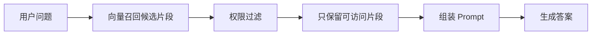
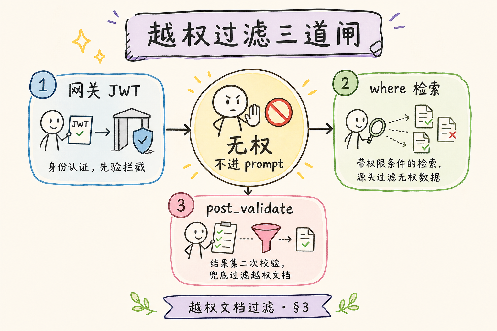
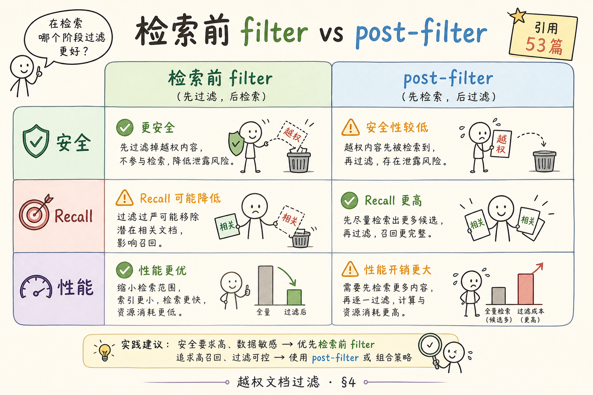
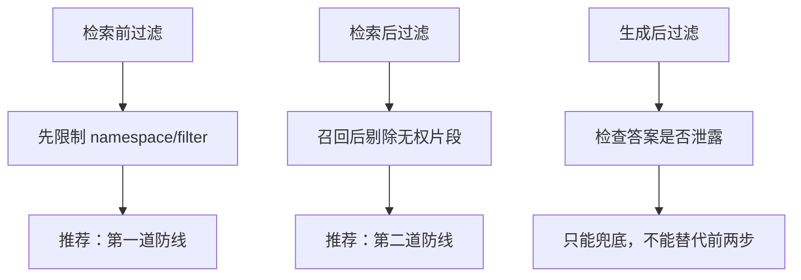
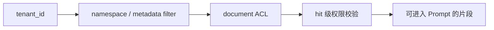
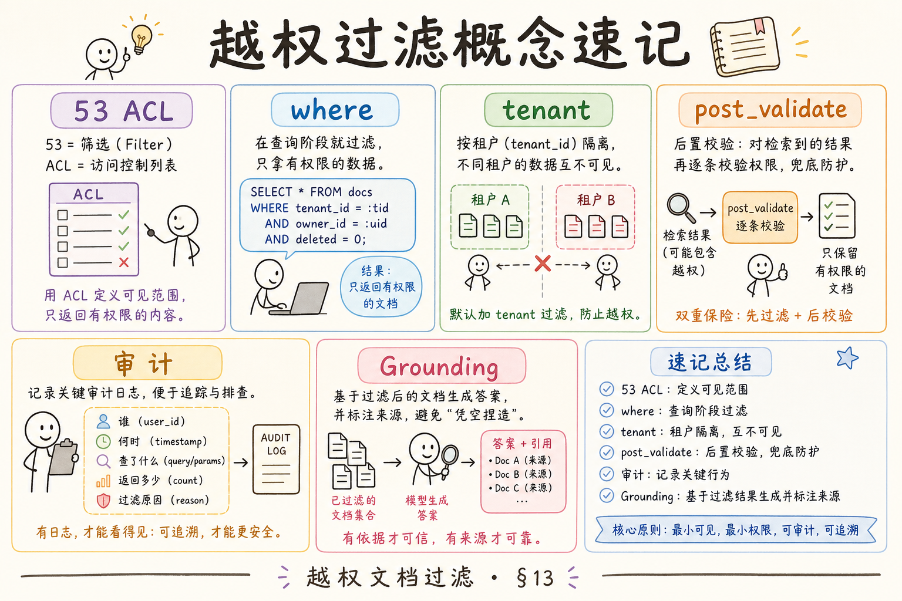
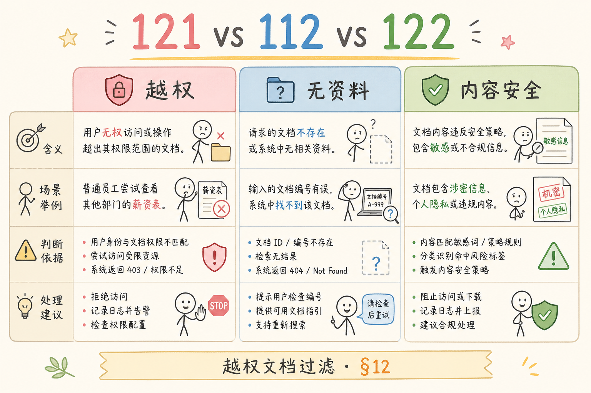

# C8 安全检索（七）：未授权文档过滤完全指南

> RAG 系统必须先回答一个安全问题：用户有没有权看到被检索出来的文档？**未授权文档过滤**要解决的问题是：即使向量检索找到了相关片段，也不能把用户无权访问的内容送进 Prompt、日志或最终答案。

---

## 目录

1. [为什么需要未授权文档过滤](#1-为什么需要未授权文档过滤)
2. [未授权文档过滤是什么](#2-未授权文档过滤是什么)
3. [它解决什么问题](#3-它解决什么问题)
4. [过滤应该发生在哪一步](#4-过滤应该发生在哪一步)
5. [权限数据怎么建模](#5-权限数据怎么建模)
6. [最小代码示例](#6-最小代码示例)
7. [常见陷阱与 FAQ](#7-常见陷阱与-faq)
8. [总结](#8-总结)

---

## 1. 为什么需要未授权文档过滤

向量检索只关心“语义是否相似”，不会天然理解权限。

假设用户问：“项目预算是多少？”  
向量库可能召回：

- 公开项目介绍；
- 财务预算表；
- 管理层会议纪要；
- 其他部门的预算说明。

如果不做权限过滤，模型可能把敏感预算写进回答。即使最终答案没有泄露，检索片段也可能已经进入 Prompt 或日志。

---

## 2. 未授权文档过滤是什么

**未授权文档过滤**：在 RAG 检索链路中，根据用户身份、租户、角色、部门、文档 ACL 等信息，移除用户无权访问的文档片段。

通俗说：检索系统像图书馆检索机，权限过滤像门禁。搜索结果里有这本书，不代表你能借阅。



从图里应得出的结论：无权片段必须在进入 Prompt 前被移除。

---

## 3. 它解决什么问题

| 风险 | 没有过滤 | 有过滤 |
|---|---|---|
| 跨部门泄露 | 用户看到其他部门文档 | 只返回授权文档 |
| 跨租户泄露 | A 客户搜到 B 客户资料 | tenant + ACL 双重限制 |
| Prompt 泄露 | 无权片段进入模型上下文 | 进入 Prompt 前剔除 |
| 日志泄露 | 调试日志保存敏感 chunk | 日志只记录授权结果 |
| 引用错误 | 答案引用无权来源 | 引用只来自可访问文档 |

安全检索的底线是：**模型不应该看到用户不能看的资料**。



---

## 4. 过滤应该发生在哪一步

权限过滤有三种位置。





推荐组合：

1. **检索前过滤**：通过 namespace、tenant、metadata filter 限制候选范围；
2. **检索后过滤**：对 hits 再做 ACL 校验；
3. **生成后检查**：作为兜底，不让模型输出明显违规内容。

不要只做生成后过滤。因为无权片段一旦进入 Prompt，就已经发生了数据暴露。

---

## 5. 权限数据怎么建模

最小模型可以包含：

| 字段 | 说明 |
|---|---|
| `tenant_id` | 租户边界 |
| `document_id` | 文档 ID |
| `owner_id` | 所有者 |
| `visibility` | public/team/private |
| `allowed_user_ids` | 可访问用户 |
| `allowed_group_ids` | 可访问用户组 |
| `classification` | internal/confidential 等级 |

文档入库时，应把必要权限信息写入 metadata：

```json
{
  "tenant_id": "tenant_a",
  "document_id": "doc_123",
  "visibility": "team",
  "allowed_group_ids": ["support", "sales"],
  "classification": "internal"
}
```

metadata 里的权限信息用于快速过滤，但最终仍建议在后端用权限服务做一次确认，避免索引里的旧 metadata 过期。

权限模型可以理解为三层门禁：租户先隔离大范围，文档 ACL 再限制可见文档，最后由检索后校验确认每个 hit 是否仍然可访问。



从图里应得出的结论：权限过滤不是单个字段，而是一组逐层收紧的约束。

---

## 6. 最小代码示例

下面示例演示检索后 ACL 过滤。真实项目中，`can_access` 应该接入你的权限系统。

```python
from dataclasses import dataclass


@dataclass
class User:
    id: str
    tenant_id: str
    group_ids: set[str]


@dataclass
class Hit:
    text: str
    metadata: dict


def can_access(user: User, hit: Hit) -> bool:
    if hit.metadata["tenant_id"] != user.tenant_id:
        return False

    visibility = hit.metadata.get("visibility")
    if visibility == "public":
        return True

    allowed_groups = set(hit.metadata.get("allowed_group_ids", []))
    return bool(user.group_ids & allowed_groups)


def filter_hits(user: User, hits: list[Hit]) -> list[Hit]:
    return [hit for hit in hits if can_access(user, hit)]
```

使用方式：

```python
safe_hits = filter_hits(current_user, retrieved_hits)
context = build_context(safe_hits)
```

这里的关键顺序是：先过滤，再构造 Prompt。不要先构造 Prompt 再试图删除敏感内容。

---

## 7. 常见陷阱与 FAQ

这一节集中处理安全检索最容易被低估的地方。权限过滤只要有一个环节偷懒，就可能让无权文档进入 Prompt；因此前端、检索、日志和调试台都要遵守同一套边界。

### 7.1 错：只在前端隐藏无权文档

前端隐藏只是展示层控制，不能保护 API。权限过滤必须在后端执行。

### 7.2 错：只靠向量库 metadata

metadata 可能过期，尤其当权限变更后索引未及时更新。重要场景要在后端权限服务再校验。

### 7.3 错：调试台显示所有 hits

内部调试台也可能泄露数据。默认只显示当前用户有权访问的 hits；跨权限调试必须审计。

### 7.4 FAQ：过滤后没有结果怎么办？

应该返回“没有找到你有权限访问的相关资料”，而不是暗示系统里存在某份无权文档。

### 7.5 FAQ：权限变更后要不要重建索引？

如果权限存在 metadata 中，通常需要更新或重建相关 chunk。更稳的做法是 metadata 快速过滤 + 权限服务实时确认。

---

## 8. 总结

未授权文档过滤的核心是：**无权内容不能进入 Prompt**。





最小落地方案：

1. 用 tenant/namespace 做第一层隔离；
2. 用 metadata filter 缩小候选范围；
3. 检索后用权限服务再校验 hits；
4. 只用授权 hits 组装 Prompt；
5. 日志和调试台也遵守同一权限边界。

如果一句话记忆：向量相似不等于用户有权看，RAG 检索必须先过权限门禁。
