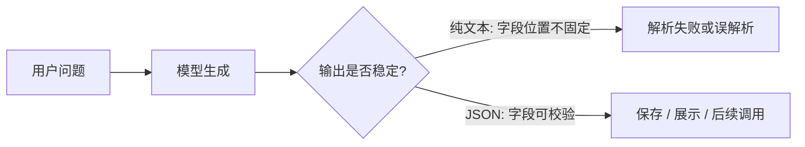
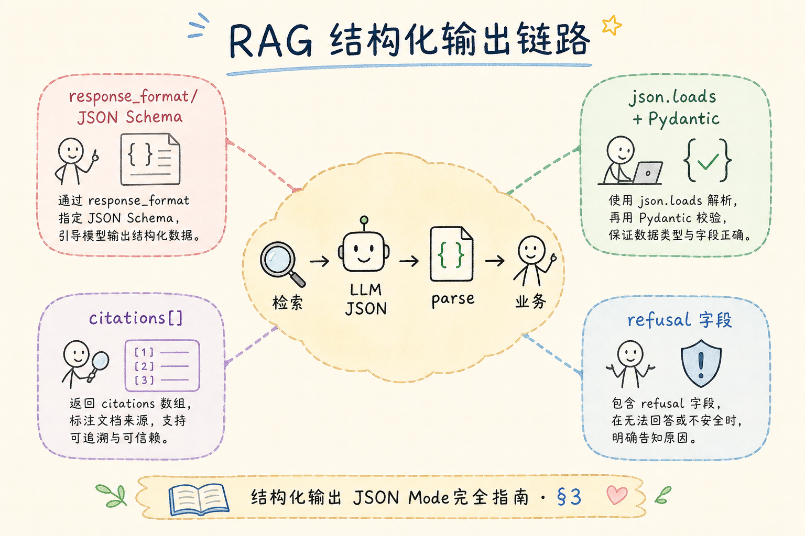
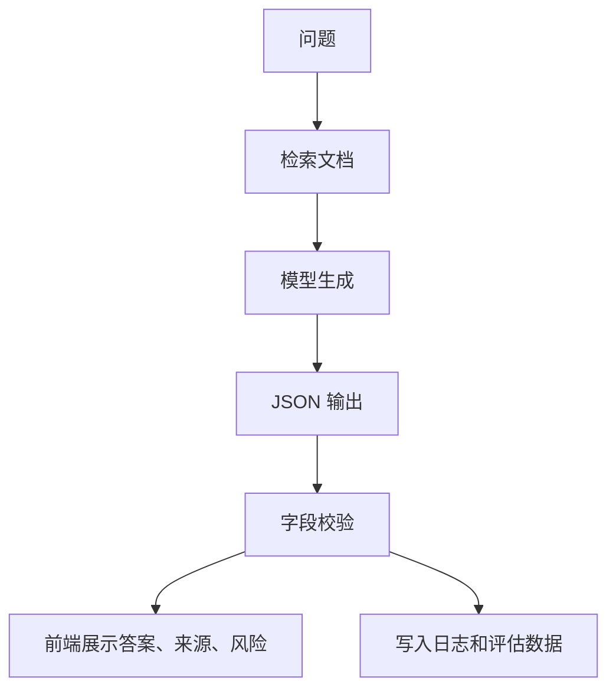
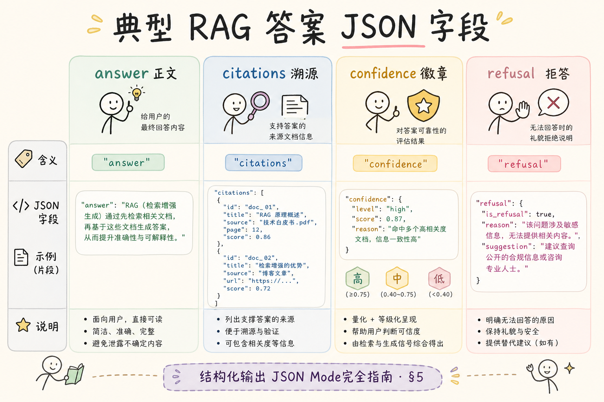
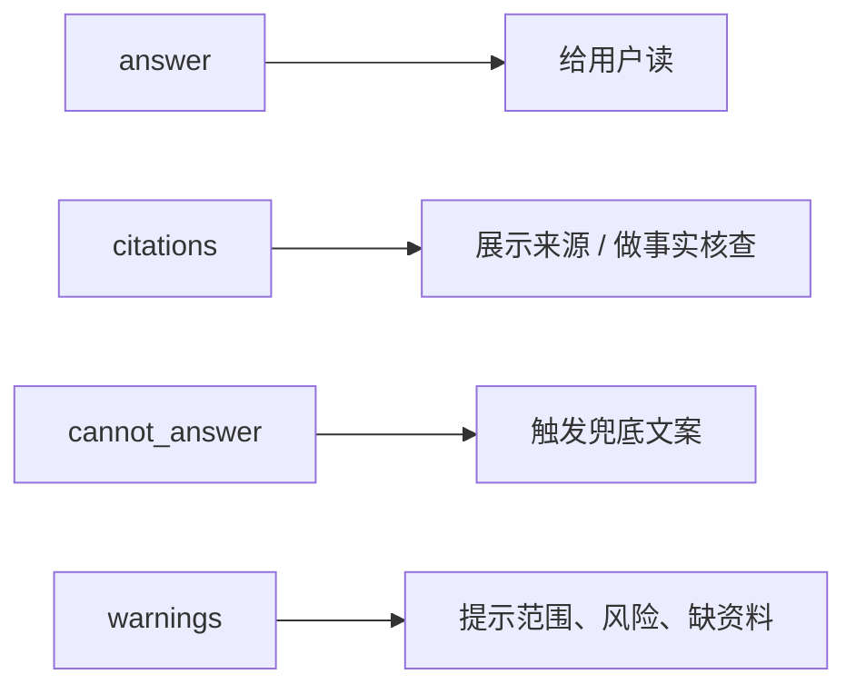
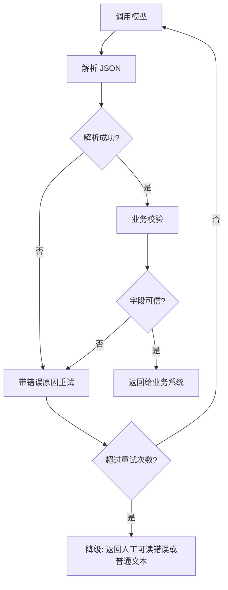

# C6 生成与 Grounding（十四）：结构化输出（JSON Mode）入门指南

做 RAG 或 AI 应用时，最常见的事故不是模型完全不会答，而是它答得“看起来对”，程序却接不住：你想要 JSON，它多写了一句解释；你想要数组，它返回了 Markdown 列表；你想把结果存进数据库，却发现字段名每次都不一样。**结构化输出**（structured output）要解决的就是这个问题：让模型的回答稳定地变成程序能读取、校验和继续处理的数据。

本文面向刚接触大模型应用的读者。读完后，你应该能判断什么时候需要 JSON Mode，知道它能保证什么、不能保证什么，并写出一个“模型输出 JSON → 程序校验 → 失败重试”的最小流程。

## 目录

- [1. 先看痛点：自然语言为什么不好接系统](#1-先看痛点自然语言为什么不好接系统)
- [2. 结构化输出是什么](#2-结构化输出是什么)
- [3. JSON Mode 解决了什么问题](#3-json-mode-解决了什么问题)
- [4. 它不能替你保证哪些事](#4-它不能替你保证哪些事)
- [5. 最小可运行示例](#5-最小可运行示例)
- [6. 给 RAG 结果加结构](#6-给-rag-结果加结构)
- [7. 校验、重试与降级](#7-校验重试与降级)
- [8. 常见错误](#8-常见错误)
- [9. FAQ](#9-faq)
- [10. 总结](#10-总结)

## 1. 先看痛点：自然语言为什么不好接系统

自然语言适合给人读，却不适合直接给程序读。人看到“置信度大概比较高”能理解，程序却需要一个明确字段，例如 `"confidence": 0.82`。只要输出格式不稳定，后面的保存、排序、过滤、前端展示都会变得脆弱。

想象一个客服系统要把模型答案展示给用户，同时保存引用来源。如果模型有时返回一段话，有时返回表格，有时把来源写成“参考资料如下”，后端就只能靠字符串截取猜测内容。这种猜测很容易在一次提示词改动后失效。



这张图的重点是：结构化输出不是为了让回答更“像代码”，而是为了让模型结果进入工程链路时更可控。

## 2. 结构化输出是什么

**结构化输出**：让模型按照约定的数据形状返回结果，例如 JSON 对象、数组或固定字段。通俗说，就是把“模型说一段话”变成“模型填写一张表”。

**JSON Mode**：一种要求模型输出合法 JSON 的生成模式。通俗说，它会尽量阻止模型在 JSON 外面加寒暄、解释、Markdown 标记等多余文本。

一个普通回答可能是这样：

```text
答案是：可以使用多查询检索。理由是它能从不同角度找资料。
```

结构化输出希望变成这样：

```json
{
  "answer": "可以使用多查询检索。",
  "reason": "它能从不同角度找资料。",
  "confidence": 0.78
}
```

第二种写法更适合程序处理，因为字段名、字段类型和层级关系都比较明确。

## 3. JSON Mode 解决了什么问题

JSON Mode 的核心价值有三个：减少格式漂移、降低解析成本、让失败更容易发现。

| 问题 | 没有结构化输出 | 使用 JSON Mode 后 |
|---|---|---|
| 程序解析 | 依赖正则或字符串截取 | 直接 `json.loads` |
| 字段稳定性 | 字段名可能混在句子里 | 字段名集中在 JSON 中 |
| 错误发现 | 很晚才在业务里暴露 | 解析或校验阶段就能发现 |
| 前端展示 | 需要猜哪些内容属于哪块 | 按字段渲染卡片、引用、按钮 |

对于 RAG 应用，结构化输出尤其重要。因为 RAG 通常不只展示一个答案，还要展示引用、命中文档、风险提示和置信度。纯文本可以“读起来还行”，但很难稳定地拆成这些模块。





图里要注意的是校验这一步。JSON Mode 让输出更像 JSON，但业务仍要检查字段是否齐全、类型是否正确、引用是否真的来自检索结果。

## 4. 它不能替你保证哪些事

JSON Mode 只能提高“格式正确”的概率，不能保证“内容正确”。一个合法 JSON 里仍然可能有编造来源、错误数字或不符合业务规则的值。

例如下面这个 JSON 格式没有问题，但内容可能有问题：

```json
{
  "answer": "产品支持离线向量检索。",
  "sources": ["不存在的文档.md"],
  "confidence": 1.2
}
```

这里至少有两个风险：`sources` 可能引用了检索结果里没有的文件，`confidence` 超出了 0 到 1 的范围。所以结构化输出后面必须接**业务校验**。业务校验就是用程序规则检查模型填的表是否可信，例如置信度范围、来源 ID 是否存在、必填字段是否为空。

## 5. 最小可运行示例

下面的示例演示一个本地流程：假设模型已经返回了一段 JSON 字符串，程序负责解析并校验它。这里不依赖具体模型 SDK，便于先理解工程骨架。



运行环境：Python 3.10+。

```python
import json

raw = """
{
  "answer": "结构化输出让模型结果更容易被程序读取。",
  "sources": ["rag-intro.md", "json-mode.md"],
  "confidence": 0.86
}
"""

data = json.loads(raw)

required = {"answer", "sources", "confidence"}
missing = required - data.keys()
if missing:
    raise ValueError(f"缺少字段: {missing}")

if not isinstance(data["answer"], str) or not data["answer"].strip():
    raise ValueError("answer 必须是非空字符串")

if not isinstance(data["sources"], list):
    raise ValueError("sources 必须是数组")

if not 0 <= data["confidence"] <= 1:
    raise ValueError("confidence 必须在 0 到 1 之间")

print(data["answer"])
```

这段代码展示了一个重要习惯：不要只要 `json.loads` 成功就认为完成了。解析成功只说明格式像 JSON；字段含义是否符合你的业务，还需要自己检查。

## 6. 给 RAG 结果加结构

在 RAG 问答中，一个实用的输出结构通常至少包含答案、引用、无法回答时的说明，以及可选的风险提示。初学者可以先从下面这个结构开始。

```json
{
  "answer": "面向用户的简短答案",
  "citations": [
    {
      "source_id": "doc-001",
      "quote": "支持答案的原文片段"
    }
  ],
  "cannot_answer": false,
  "warnings": []
}
```

这个结构背后的思路是：不要把所有内容都塞进 `answer`。引用应该单独放，不能回答也应该单独放，否则前端和评估脚本都难以判断模型到底做了什么。



如果你的检索结果里有 `source_id`，就要求模型只能引用这些 ID。程序校验时也要检查 citations 中的 ID 是否出现在本次检索结果里。

## 7. 校验、重试与降级

生产流程里建议把结构化输出当成一个小管道，而不是一次调用结束。最简单的管道是：生成、解析、校验、失败后重试，仍失败就降级。



重试提示词不要只写“请重新输出 JSON”。更好的做法是把错误原因告诉模型，例如：“`confidence` 必须是 0 到 1 之间的数字，你刚才返回了 1.2”。这样模型更容易修正具体字段。

## 8. 常见错误

第一个错误是把 JSON Mode 当成事实校验器。它只管格式，不会自动确认答案是否来自资料。RAG 场景里，引用 ID、原文片段、答案是否越界，都要靠检索结果和业务规则检查。

第二个错误是字段设计太随意。例如有时用 `source`，有时用 `sources`，有时用 `references`。字段名一变，调用方就要写很多兼容逻辑。新项目应该先定一份小 schema，再围绕它写提示词和校验。

第三个错误是让模型输出过深的嵌套。初学阶段尽量使用一层对象加少量数组。结构越复杂，模型越容易漏字段，程序也越难给出清楚的错误提示。

第四个错误是失败后直接把原始内容展示给用户。如果 JSON 解析失败，页面上不应该出现一大段半截 JSON。更稳妥的做法是记录日志，对用户返回简短的兜底说明。

## 9. FAQ

**Q：只要提示词里写“请输出 JSON”可以吗？**  
可以作为最小尝试，但不够稳。提示词约束容易被上下文干扰，JSON Mode 或 schema 校验能把格式要求放到更明确的位置。

**Q：JSON Mode 和 schema 是一回事吗？**  
不是。JSON Mode 关注“输出是不是 JSON”；schema 关注“JSON 里有哪些字段、字段是什么类型、哪些字段必填”。实际项目通常两者一起用。

**Q：字段越多越好吗？**  
不是。字段要服务于后续动作。如果没有代码会读取某个字段，就不要为了“看起来完整”强行加入它。

**Q：RAG 引用可以让模型自由写文件名吗？**  
不建议。更稳的方式是检索阶段给每个片段分配 `source_id`，生成阶段只能从这些 ID 里选择，校验阶段再检查 ID 是否存在。

## 10. 总结

结构化输出的目标是让模型结果进入工程系统：能解析、能校验、能展示、能记录。JSON Mode 能减少格式问题，但不能替你保证事实正确，也不能替你设计业务字段。


初学者可以记住一条主线：先把输出设计成一张小表，再让模型填写这张表，最后用程序检查这张表。只要这个闭环建立起来，RAG、工具调用、自动摘要、工单分类等场景都会更稳定。
