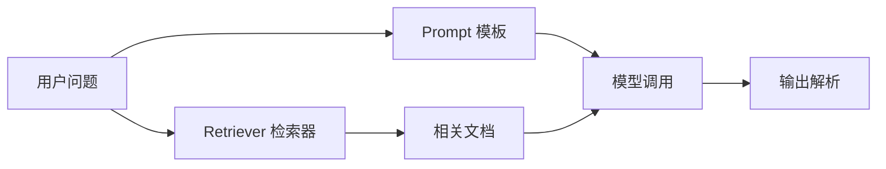
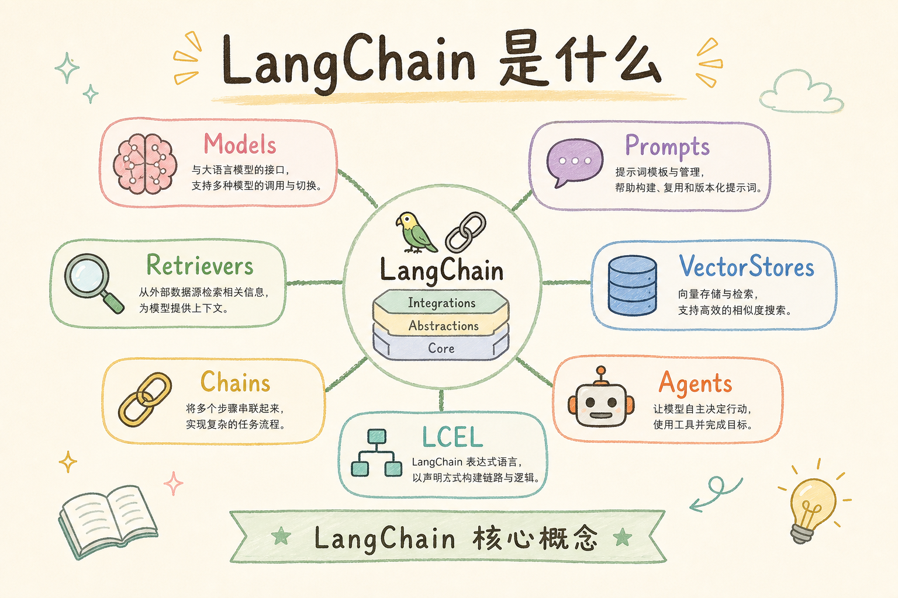
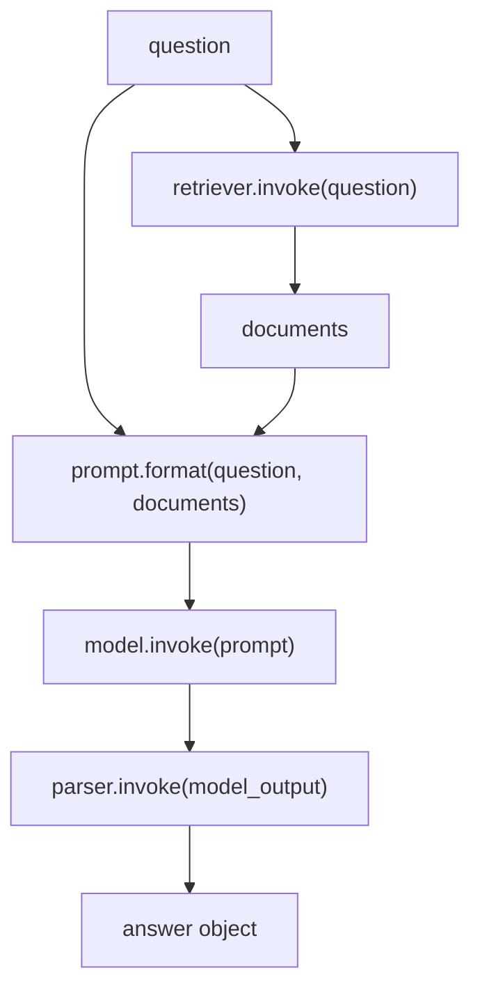
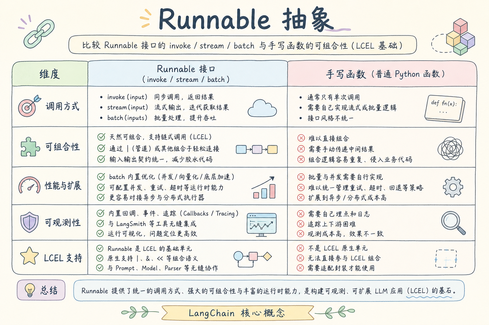
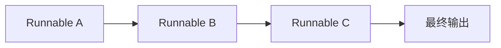
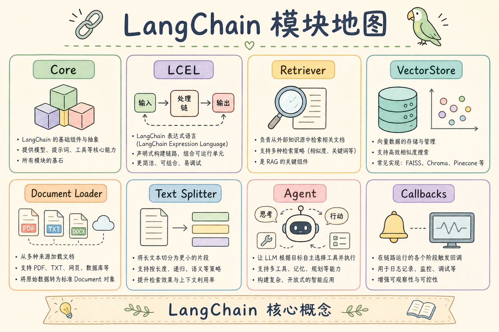

# D 框架与架构（一）：LangChain 核心概念入门指南

写一个最小 RAG Demo 时，你可以手写每一步：切文档、做向量、检索、拼 prompt、调用模型。项目变大后，问题会变成另一种：每个步骤都能跑，但流程散在不同函数里，换模型、换检索器、加日志和测试都很麻烦。LangChain 要解决的就是这类“把大模型应用组织起来”的问题。

本文不把 LangChain 当神秘框架讲，而是把它拆成几个初学者必须理解的积木：Model、Prompt、Retriever、Document、Runnable 和 Chain。读完后，你应该能看懂 LangChain 示例代码为什么这样拼，也能判断什么时候该用框架、什么时候手写更简单。

## 目录

- [1. 为什么需要 LangChain](#1-为什么需要-langchain)
- [2. LangChain 是什么](#2-langchain-是什么)
- [3. 核心积木速查](#3-核心积木速查)
- [4. 一条 RAG 链路如何被拆开](#4-一条-rag-链路如何被拆开)
- [5. Runnable：统一的调用接口](#5-runnable统一的调用接口)
- [6. 最小示例：不用真实模型先理解形状](#6-最小示例不用真实模型先理解形状)
- [7. 什么时候适合用 LangChain](#7-什么时候适合用-langchain)
- [8. 常见错误](#8-常见错误)
- [9. FAQ](#9-faq)
- [10. 总结](#10-总结)

## 1. 为什么需要 LangChain

大模型应用很少只有一次模型调用。一个稍微真实的问答系统，通常要先拿用户问题，检索资料，整理上下文，构造 prompt，调用模型，再解析输出。手写当然可以，但当你需要替换某个步骤时，散乱代码会迅速变难维护。

LangChain 的价值不是“让模型更聪明”，而是提供一套组织方式，让这些步骤可以用比较一致的接口串起来。它更像应用层胶水，而不是模型本身。



这张图展示的是大多数 LLM 应用的基本形状。LangChain 的核心概念基本都围绕这些节点展开。

## 2. LangChain 是什么

**LangChain**：一个用于构建大模型应用的工具库。通俗说，它把 prompt、模型、检索器、输出解析器等常见组件包装成可以组合的积木。

它不是模型，也不是向量数据库。你仍然需要选择模型供应商、存储方案和业务逻辑。LangChain 主要帮你做三件事：

| 能力 | 说明 |
|---|---|
| 统一接口 | 不同模型和组件用相似方式调用 |
| 组合流程 | 把 prompt、检索、模型、解析串成链 |
| 工程辅助 | 更容易加入日志、回调、批处理和流式输出 |

如果你只写一个十几行脚本，LangChain 可能显得重。如果你要维护一条会变化的 AI 工作流，它的组织能力会更有价值。

## 3. 核心积木速查

初学 LangChain 时，不要先背所有包名。先把几个核心名词放到一张表里。



| 概念 | 白话解释 | 在 RAG 里常做什么 |
|---|---|---|
| Document | 带内容和元数据的文档片段 | 保存切分后的资料 |
| PromptTemplate | 带变量的提示词模板 | 把问题和上下文拼成 prompt |
| ChatModel | 聊天模型封装 | 调用大模型生成答案 |
| Retriever | 检索器 | 根据问题找相关文档 |
| OutputParser | 输出解析器 | 把模型文本转成结构化结果 |
| Runnable | 可运行组件 | 统一 `.invoke()`、`.batch()` 等调用 |

这些概念不是孤立的。它们共同服务于一个目标：把“问题进来、答案出去”的流程拆成可替换的小块。

## 4. 一条 RAG 链路如何被拆开

不用框架时，你可能写一个 `answer(question)` 函数，里面什么都做。这样开始很快，但函数会越来越长。LangChain 更鼓励把流程拆成多个清楚的组件。



拆开之后，每一块都可以单独替换。例如检索效果不好时，你可以只换 Retriever；输出格式不稳定时，可以只换 OutputParser；模型成本太高时，可以只换 ChatModel。

这种拆分也让测试更容易。你可以用固定 documents 测 prompt，用假模型测 parser，用少量问题测 retriever，而不是每次都跑完整链路。

## 5. Runnable：统一的调用接口

**Runnable**：LangChain 中“可以被运行的东西”的统一抽象。通俗说，只要一个组件能接收输入并产生输出，就可以被当成 Runnable。

常见调用方式包括：

| 方法 | 用途 |
|---|---|
| `invoke(input)` | 处理单个输入 |
| `batch(inputs)` | 批量处理多个输入 |
| `stream(input)` | 流式返回结果 |

为什么要有这个抽象？因为 prompt、模型、检索器、解析器虽然做的事情不同，但在链路里都像“输入 → 输出”的节点。统一接口后，它们更容易组合。





这张图看起来简单，却是 LangChain 的关键心智模型：把复杂应用拆成一串可运行节点。

## 6. 最小示例：不用真实模型先理解形状

下面用普通 Python 函数模拟一条链路。它不是 LangChain 真实 API，但可以帮助你先理解“组件化”的形状。

```python
def retrieve(question: str) -> list[str]:
    docs = {
        "json": "JSON Mode 可以减少格式漂移，但仍需业务校验。",
        "tool": "Function Calling 让模型请求调用外部工具。"
    }
    return [text for key, text in docs.items() if key in question.lower()]


def build_prompt(question: str, docs: list[str]) -> str:
    context = "\n".join(docs) or "没有找到相关资料。"
    return f"基于资料回答问题。\n资料：{context}\n问题：{question}"


def fake_model(prompt: str) -> str:
    return "答案：结构化输出和工具调用都需要程序侧校验。"


def parse_output(text: str) -> dict:
    return {"answer": text.removeprefix("答案：")}


def answer(question: str) -> dict:
    docs = retrieve(question)
    prompt = build_prompt(question, docs)
    model_output = fake_model(prompt)
    return parse_output(model_output)


print(answer("json 和 tool 有什么共同点？"))
```

这个例子没有使用真实 LangChain，却呈现了 LangChain 想帮你管理的结构。学习框架前先看懂这个流程，比直接背一堆类名更稳。

## 7. 什么时候适合用 LangChain

是否使用 LangChain，取决于你的复杂度，而不是取决于“做 AI 就必须用框架”。

| 场景 | 建议 |
|---|---|
| 一次性脚本、只有一个 prompt | 手写更直接 |
| 多模型、多检索器、多输出格式 | LangChain 更合适 |
| 需要批处理、流式、回调、追踪 | LangChain 更合适 |
| 团队还没理解基本 RAG 流程 | 先手写最小版本，再引入框架 |

框架能降低组合成本，但也会引入抽象成本。初学者最容易犯的错是还没理解流程，就被框架名字绕晕。建议先画清楚自己的链路，再决定哪些节点用 LangChain 表达。

## 8. 常见错误

第一个错误是把 LangChain 当成效果保证。框架不会自动让检索更准，也不会自动防止幻觉。检索质量、prompt 设计、引用校验仍然要自己负责。

第二个错误是过早抽象。一个简单脚本如果只有 20 行，硬塞 Chain、Retriever、Parser 反而更难读。先让流程跑通，再在重复和复杂度出现时引入框架。

第三个错误是只复制示例，不理解输入输出类型。每个组件接收什么、返回什么，是调试 LangChain 的核心。遇到错误时，先打印每一步输出，不要只看最终报错。

第四个错误是把业务逻辑塞进 prompt。权限判断、字段校验、计费、日志等应由程序控制，不能交给模型用自然语言承诺。

## 9. FAQ

**Q：学习 LangChain 前必须懂向量数据库吗？**  
不必须，但如果你要做 RAG，至少要理解“文档切分、向量化、相似度检索”的基本流程。

**Q：LangChain 和 LangGraph 是什么关系？**  
LangChain 更适合线性或局部组合的链路；LangGraph 更适合有状态、多分支、循环控制的工作流。初学者可以先掌握 LangChain 核心积木。

**Q：用了 LangChain 还需要自己写 prompt 吗？**  
需要。框架只提供模板和组合方式，不会替你理解业务目标。

**Q：为什么很多示例代码版本不同？**  
LangChain 迭代较快，导入路径和推荐写法可能变化。学习时要关注核心概念，不要只记某个版本的包路径。

## 10. 总结

LangChain 的核心价值是把大模型应用拆成可组合、可替换、可观察的组件。它不能替你解决检索质量和业务正确性，但能帮助你组织复杂流程。



初学时抓住一句话：LangChain 是把“输入 → 检索 → prompt → 模型 → 解析”的链路积木化。只要每块的输入输出清楚，框架就会从一堆陌生名词变成可维护的工程工具。
