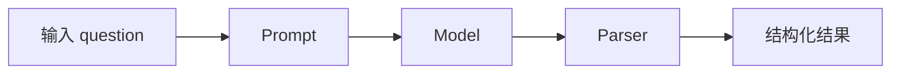
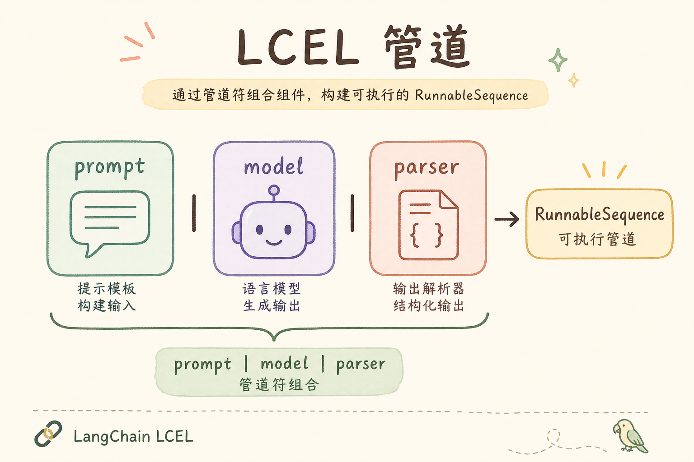
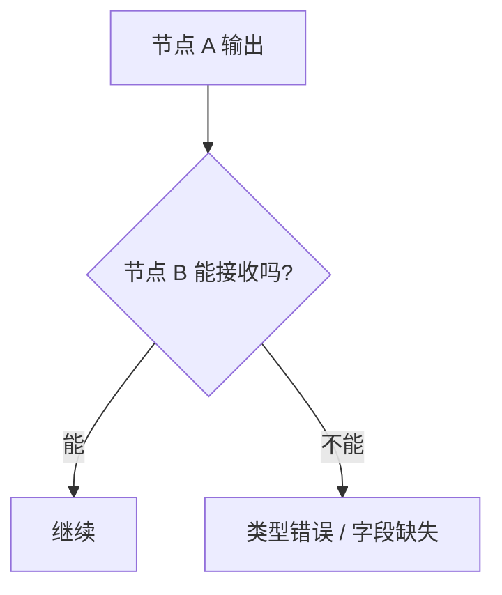
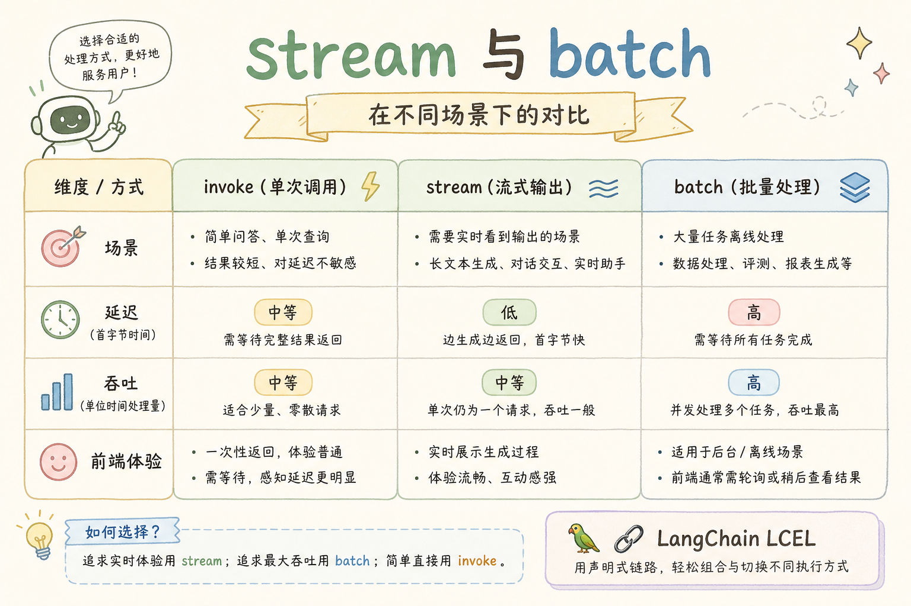
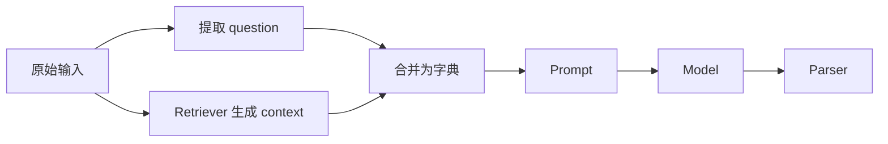
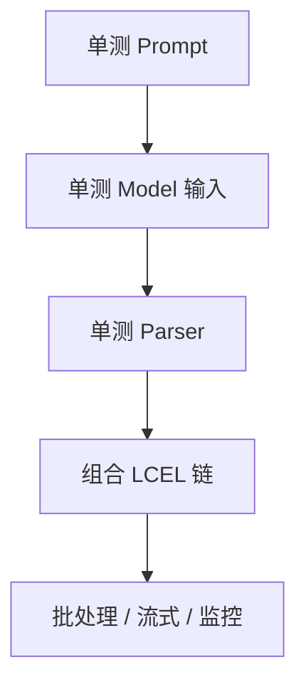
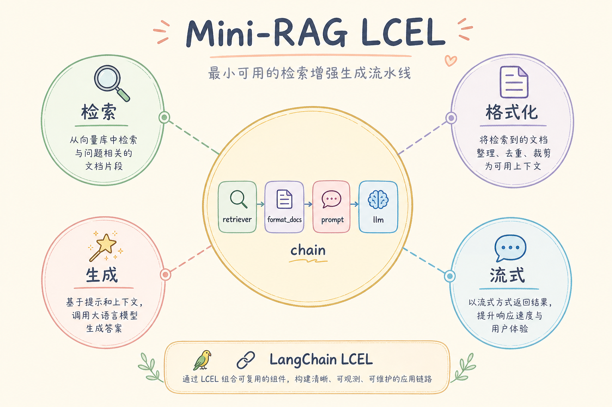

# D 框架与架构（二）：LangChain LCEL 入门指南

上一篇讲 LangChain 核心概念时，我们把大模型应用拆成 Prompt、Model、Retriever、Parser 等积木。LCEL 要解决的是下一步问题：这些积木怎样用一种清晰、可组合的写法串起来。**LCEL**（LangChain Expression Language）可以把一条链路写得像管道：上一步输出，流向下一步输入。

本文面向刚看过 LangChain 核心概念的读者。读完后，你应该能理解 `prompt | model | parser` 这类写法是什么意思，知道它和手写函数调用的等价关系，并能判断什么时候该用 LCEL，什么时候普通函数更清楚。

## 目录

- [1. 为什么需要 LCEL](#1-为什么需要-lcel)
- [2. LCEL 是什么](#2-lcel-是什么)
- [3. 管道写法怎么读](#3-管道写法怎么读)
- [4. 与手写调用的等价关系](#4-与手写调用的等价关系)
- [5. 分支、并行与字典输入](#5-分支并行与字典输入)
- [6. 在 RAG 中使用 LCEL 的思路](#6-在-rag-中使用-lcel-的思路)
- [7. 调试 LCEL 链路](#7-调试-lcel-链路)
- [8. 常见错误](#8-常见错误)
- [9. FAQ](#9-faq)
- [10. 总结](#10-总结)

## 1. 为什么需要 LCEL

当一条 AI 链路只有两三步时，手写函数调用很直观。随着步骤增加，代码容易变成一长串临时变量：`docs`、`context`、`prompt_text`、`raw_answer`、`parsed`。变量本身没有错，但流程结构不够显眼。

LCEL 的目标是让链路结构直接体现在代码里。你看到 `A | B | C`，就能知道数据从 A 流到 B，再流到 C。



这张图对应的就是最常见的 LCEL 心智模型：把多个 Runnable 串成一条流水线。

## 2. LCEL 是什么

**LCEL**：LangChain 提供的一套链式表达方式，用来组合 Runnable。通俗说，它让你用类似管道的写法描述“先做什么，再做什么”。

最常见的形式是：

```python
chain = prompt | model | parser
result = chain.invoke({"question": "什么是 JSON Mode？"})
```

这段代码可以读成：先把输入交给 prompt 生成提示词，再交给 model 调用模型，最后交给 parser 解析输出。`|` 不是数学里的“或”，在这里可以理解为“接到下一步”。

## 3. 管道写法怎么读

初学者读 LCEL 时，可以按三件事检查：每一步吃什么、吐什么、下一步能不能接住。

| 节点 | 输入 | 输出 |
|---|---|---|
| Prompt | 字典，例如 `{question}` | prompt 消息或字符串 |
| Model | prompt 消息或字符串 | 模型原始响应 |
| Parser | 模型原始响应 | 字符串、JSON 或业务对象 |

如果链路报错，大多数时候不是 `|` 本身的问题，而是某一步输出的类型和下一步期望的类型对不上。例如上一节点输出列表，下一节点却期望字符串。





所以学习 LCEL 的重点不是记写法，而是理解每个节点的输入输出契约。

## 4. 与手写调用的等价关系

LCEL 看起来像新语法，但它背后的逻辑和普通函数调用一样。下面先用手写方式表达一条链路：

```python
def run_chain(inputs: dict) -> str:
    prompt_value = prompt.invoke(inputs)
    model_value = model.invoke(prompt_value)
    parsed_value = parser.invoke(model_value)
    return parsed_value
```

用 LCEL 表达就是：

```python
chain = prompt | model | parser
parsed_value = chain.invoke(inputs)
```

两者的区别主要在表达方式。手写函数更显式，适合调试和初学；LCEL 更紧凑，适合稳定链路、批处理、流式和复用。

这也是学习 LCEL 的关键：不要把它当魔法。遇到不懂的链，先把它翻译成“第一步 invoke、第二步 invoke、第三步 invoke”，基本就能看清楚。

## 5. 分支、并行与字典输入

真实 RAG 链路里，prompt 往往同时需要用户问题和检索上下文。这个时候 LCEL 常用字典来组织多个输入来源。

概念上可以理解为：

```python
rag_inputs = {
    "question": get_question,
    "context": retriever
}
chain = rag_inputs | prompt | model | parser
```

这段伪代码表示：`question` 走一个来源，`context` 走检索器，然后合并成字典交给 prompt。真实代码会根据 LangChain 版本有具体类名差异，但心智模型就是“多路输入先凑齐，再进入下一步”。





这张图说明 LCEL 不只适合一条直线，也可以表达“先并行准备字段，再汇总”的流程。

## 6. 在 RAG 中使用 LCEL 的思路

把 LCEL 用在 RAG 里，最重要的是先设计清楚 prompt 需要哪些字段。常见字段包括 `question`、`context`、`chat_history` 和 `format_instructions`。

一个简化版 RAG 链路可以按下面的表拆：

| 字段 | 来源 | 用途 |
|---|---|---|
| `question` | 用户输入 | 明确要回答的问题 |
| `context` | Retriever | 提供可引用资料 |
| `format_instructions` | OutputParser | 约束输出结构 |
| `chat_history` | 会话记录 | 保留必要上下文 |

LCEL 的好处是这些字段可以由不同 Runnable 准备，再统一进入 prompt。这样你换检索器、换输出格式时，不必重写整条链。

## 7. 调试 LCEL 链路

LCEL 链路写得越短，越要重视调试。建议初学者使用“三段式”排查：先单独跑 prompt，再单独跑 model，最后接 parser。

```python
prompt_value = prompt.invoke({"question": "什么是 LCEL？", "context": "LCEL 是链式表达语言。"})
print(prompt_value)

model_value = model.invoke(prompt_value)
print(model_value)

parsed_value = parser.invoke(model_value)
print(parsed_value)
```

确认每一步都正常后，再组合成：

```python
chain = prompt | model | parser
```

这个顺序很重要。不要一开始就写一条很长的链，出错后只看到最终异常。逐段确认输入输出，调试成本会低很多。



## 8. 常见错误

第一个错误是只看链路写得短，不看类型是否清楚。`prompt | model | parser` 很漂亮，但如果 prompt 需要 `context`，你只传了 `question`，链路仍然会失败。

第二个错误是把业务判断塞进 LCEL 链里。权限校验、计费、用户状态判断更适合放在应用程序层。LCEL 负责组合模型相关流程，不应该承担所有业务控制。

第三个错误是过度追求一行写完。初学阶段宁愿多拆几个变量，也不要写一条自己三天后看不懂的链。可维护性比炫技更重要。

第四个错误是忽略版本差异。LangChain 的 API 变化较快，示例里的导入路径可能过时。学习时要抓住 Runnable、输入输出、管道组合这些稳定概念。

## 9. FAQ

**Q：LCEL 必须学吗？**  


如果你只写简单脚本，可以先不学。但如果你阅读 LangChain 新示例、做 RAG 链路组合、使用批处理或流式输出，LCEL 很快会遇到。

**Q：`|` 是不是 Python 原生管道？**  
不是传统 shell 管道。它是 LangChain 对对象组合运算的封装，用来生成新的 Runnable 链。

**Q：LCEL 和 LangGraph 怎么选？**  
线性流程或少量分支用 LCEL 更轻。需要循环、状态机、多节点代理流程时，LangGraph 更合适。

**Q：调试 LCEL 有没有简单原则？**  
有。把链拆开，逐段 `.invoke()`，确认每段输入输出类型，再重新组合。

## 10. 总结

LCEL 的本质是用管道方式组合 LangChain 的 Runnable。它让链路结构更清晰，也方便批处理、流式和复用，但前提是你理解每个节点的输入输出。

初学者可以这样记：先能用普通函数写清楚流程，再把稳定流程改成 LCEL。不要为了使用 LCEL 而使用 LCEL；当链路开始需要组合、替换和复用时，它才真正有价值。
