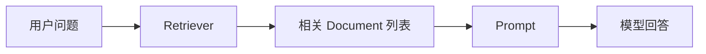
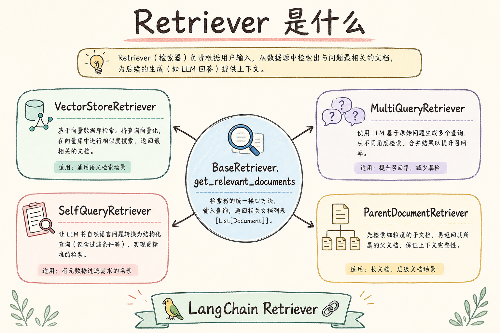
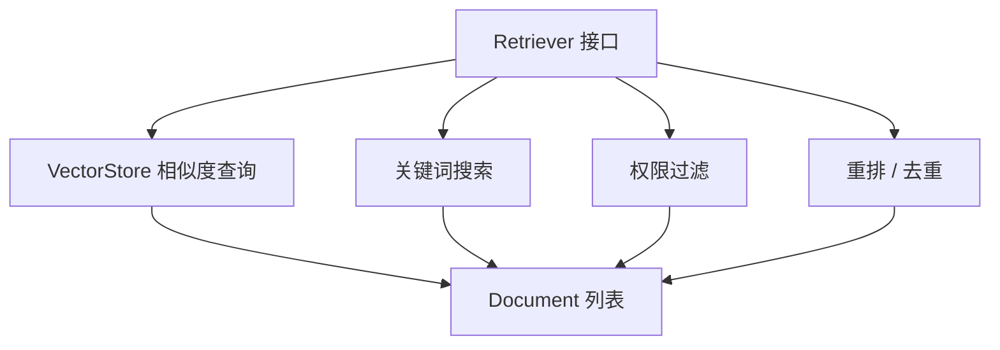
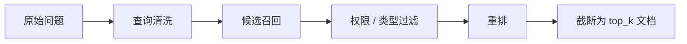
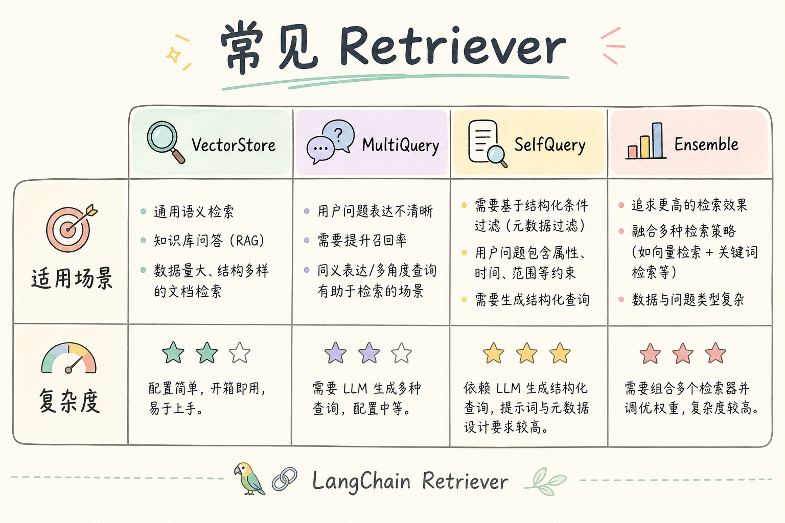
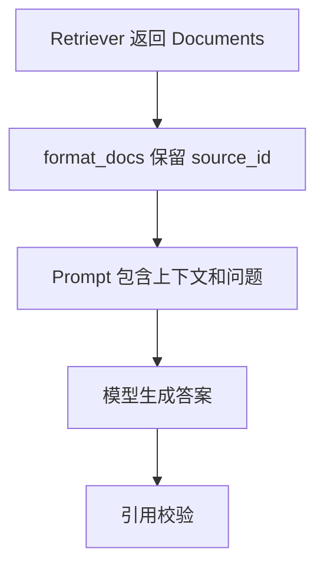
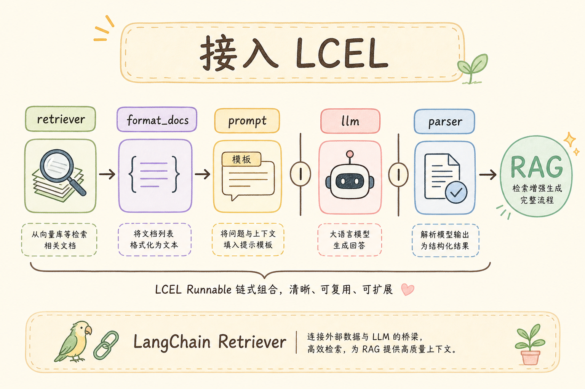

# D 框架与架构（三）：LangChain Retriever 入门指南

RAG 系统里最容易被误解的一步是“检索”。很多初学者以为只要有向量数据库，就等于有了检索能力。实际项目中，应用真正需要的是一个稳定接口：输入用户问题，返回相关文档。LangChain 里的 **Retriever** 就是这个接口抽象。

本文面向刚学完 LangChain 核心概念和 LCEL 的读者。读完后，你应该能理解 Retriever 是什么、它解决什么工程问题、和 VectorStore 有什么区别，并能写出一个最小可运行的自定义检索器。

## 目录

- [1. 为什么需要 Retriever](#1-为什么需要-retriever)
- [2. Retriever 是什么](#2-retriever-是什么)
- [3. Retriever 和 VectorStore 的区别](#3-retriever-和-vectorstore-的区别)
- [4. 一次检索的完整流程](#4-一次检索的完整流程)
- [5. 最小可运行示例](#5-最小可运行示例)
- [6. 在 RAG 链路中使用 Retriever](#6-在-rag-链路中使用-retriever)
- [7. 如何评估 Retriever](#7-如何评估-retriever)
- [8. 常见错误](#8-常见错误)
- [9. FAQ](#9-faq)
- [10. 总结](#10-总结)

## 1. 为什么需要 Retriever

RAG 的生成质量很大程度取决于检索质量。如果检索器没有找回关键资料，模型后面再努力也只能基于错误或缺失的上下文回答。对初学者来说，Retriever 的意义可以先理解成“资料入口”。

没有统一 Retriever 时，代码里可能直接散落着向量查询、关键词搜索、权限过滤、重排等逻辑。这样会导致两个问题：第一，链路很难替换；第二，模型层和存储层耦合太紧。



这张图说明 Retriever 的位置：它不负责生成答案，只负责把适合回答问题的资料交给后续步骤。

## 2. Retriever 是什么

**Retriever**：一个接收查询并返回文档列表的组件。通俗说，它像图书馆管理员：你提出问题，它帮你找几页最可能有用的资料。

在 LangChain 语境中，Retriever 通常返回 `Document` 列表。`Document` 是带正文和元数据的文档片段，元数据可以包含来源、标题、权限、更新时间等信息。

| 概念 | 白话解释 | 典型内容 |
|---|---|---|
| Query | 用户问题或改写后的检索词 | “退款多久到账” |
| Retriever | 找资料的组件 | 向量检索、关键词检索、混合检索 |
| Document | 找回的资料片段 | `page_content` + `metadata` |
| Metadata | 文档附加信息 | `source_id`、`title`、`tenant_id` |

理解 Retriever 的关键是：它是接口，不限定底层算法。底层可以是向量库，也可以是全文搜索、数据库查询，甚至是多个检索策略的组合。

## 3. Retriever 和 VectorStore 的区别

**VectorStore**：向量存储，负责保存向量并按相似度查询。通俗说，它像一个按“语义距离”找资料的仓库。

Retriever 比 VectorStore 更靠近应用层。VectorStore 只是一种可能的数据来源，而 Retriever 可以在它外面包一层业务逻辑，例如过滤租户、限制文档类型、做多路召回和重排。





这张图的结论是：VectorStore 是工具，Retriever 是面向 RAG 链路的统一入口。不要把两者混为一谈。

## 4. 一次检索的完整流程

实际项目中的一次检索通常不只是“问题进向量库，结果出来”。更稳妥的流程包括查询清洗、召回、过滤、重排和截断。

| 步骤 | 作用 | 初学者要注意 |
|---|---|---|
| 查询清洗 | 去掉无关口头语或补全上下文 | 多轮对话要先消解指代 |
| 召回 | 找到候选文档 | 可以向量、关键词或混合 |
| 过滤 | 去掉无权限或不适合的文档 | 权限不能交给模型判断 |
| 重排 | 把更相关的文档放前面 | 高成本步骤要控制数量 |
| 截断 | 控制传给模型的上下文长度 | 不能把所有候选都塞进 prompt |



这张图展示的是 Retriever 内部可以包含的逻辑。初学阶段可以先只做召回，项目变复杂后再逐步增加过滤和重排。

## 5. 最小可运行示例

下面不用真实 LangChain，也不用向量库，先用普通 Python 写一个“接口形状像 Retriever”的组件。这样可以先理解输入输出，再迁移到框架。



运行环境：Python 3.10+。

```python
from dataclasses import dataclass


@dataclass
class Document:
    page_content: str
    metadata: dict


class KeywordRetriever:
    def __init__(self, documents: list[Document]):
        self.documents = documents

    def invoke(self, query: str) -> list[Document]:
        words = [w.lower() for w in query.split()]
        results = []
        for doc in self.documents:
            text = doc.page_content.lower()
            if any(word in text for word in words):
                results.append(doc)
        return results[:3]


docs = [
    Document("JSON Mode 可以让模型输出合法 JSON。", {"source_id": "doc-1"}),
    Document("Retriever 负责根据问题找回相关文档。", {"source_id": "doc-2"}),
    Document("LCEL 可以把 Prompt、Model、Parser 串成管道。", {"source_id": "doc-3"}),
]

retriever = KeywordRetriever(docs)
for doc in retriever.invoke("Retriever 文档"):
    print(doc.metadata["source_id"], doc.page_content)
```

这段代码的重点不是关键词算法，而是接口形状：输入一个查询，返回一组 `Document`。只要这个形状稳定，后面就可以把内部实现换成向量检索或混合检索。

## 6. 在 RAG 链路中使用 Retriever

Retriever 的输出通常不会直接展示给用户，而是先整理成上下文，再交给 prompt。一个简单做法是把多个文档片段拼成带来源的文本。

```python
def format_docs(docs: list[Document]) -> str:
    blocks = []
    for doc in docs:
        source = doc.metadata.get("source_id", "unknown")
        blocks.append(f"[{source}] {doc.page_content}")
    return "\n".join(blocks)


question = "Retriever 在 RAG 中做什么？"
docs = retriever.invoke(question)
context = format_docs(docs)
prompt = f"请基于资料回答。\n资料：\n{context}\n问题：{question}"
print(prompt)
```

这个例子体现了一个好习惯：在上下文里保留来源 ID。后续模型回答时，才有机会输出可校验的引用。



如果没有来源 ID，模型即使写出“参考文档 1”，程序也很难确认它指的是哪份资料。

## 7. 如何评估 Retriever

评估 Retriever 不要只看“返回了几条”。更关键的是：关键文档有没有被找回来，排在第几位，是否混入了无权限或无关文档。

| 指标 | 问的问题 | 初学阶段怎么做 |
|---|---|---|
| Recall@K | 正确文档是否出现在前 K 条 | 准备 20 个问题和标准来源 |
| Precision@K | 前 K 条里有多少真的相关 | 人工抽查并打标 |
| MRR | 第一个正确结果排多靠前 | 关注用户最可能看到的上下文 |
| 权限正确率 | 是否返回了不该看的文档 | 用跨租户样例强测 |

初学者可以先做一个小评估集：每个问题标注 1 到 3 个应该命中的 `source_id`。每次改切分、embedding 或重排策略，都跑一遍这个评估集。

## 8. 常见错误

第一个错误是把 `top_k` 调大当成万能解法。返回更多文档可能提高召回，但也会挤占上下文窗口，把噪声带给模型。更好的做法是改进查询、切分和重排。

第二个错误是忽略权限过滤。文档能被向量库搜到，不代表当前用户能看。权限过滤必须在进入 prompt 前完成。

第三个错误是只做向量检索。产品名、错误码、订单号这类精确词，关键词检索往往更可靠。很多项目会把向量检索和关键词检索结合起来。

第四个错误是不保存检索日志。没有日志，你无法知道模型答错是因为检索没找回资料，还是模型没有正确使用资料。

## 9. FAQ

**Q：Retriever 一定要用向量数据库吗？**  


不一定。只要能根据查询返回文档列表，都可以封装成 Retriever。向量数据库只是常见实现之一。

**Q：Retriever 返回多少条最合适？**  
没有固定答案。初学阶段可以从 3 到 5 条开始，再根据上下文长度和评估结果调整。

**Q：Retriever 会改写用户问题吗？**  
有些系统会在 Retriever 前增加 Query Rewriting。严格说改写不一定属于 Retriever，但可以放在检索管道里统一管理。

**Q：检索结果不好时先改什么？**  
先看日志，确认是切分问题、查询问题、embedding 问题、过滤问题还是排序问题。不要直接换框架或换模型。

## 10. 总结

Retriever 是 RAG 链路里的资料入口：输入问题，返回相关 Document。它把底层搜索、向量库、过滤和重排统一成一个接口，让后续 prompt 和模型调用更稳定。

初学者可以记住一句话：VectorStore 是一种存储和查询工具，Retriever 是应用层检索入口。先把 Retriever 的输入输出设计清楚，再讨论向量库、混合检索和重排，系统会更容易维护。
