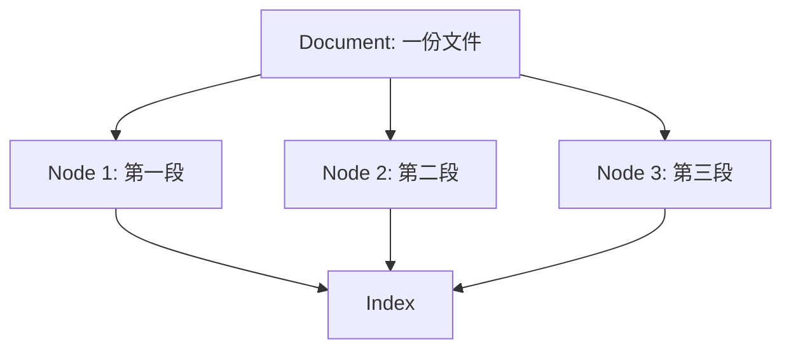
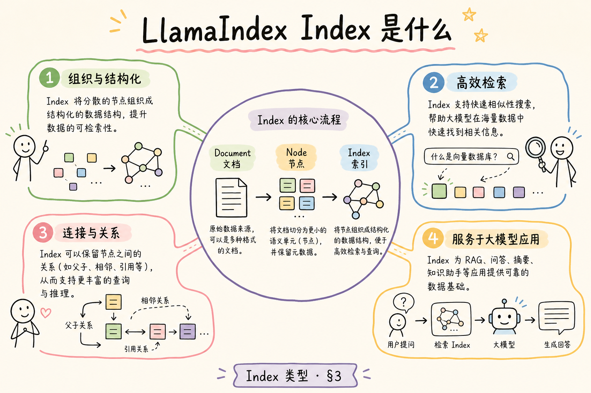
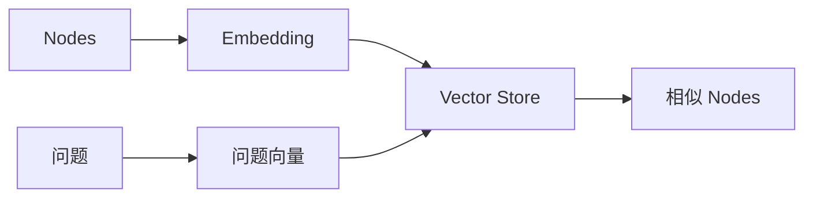
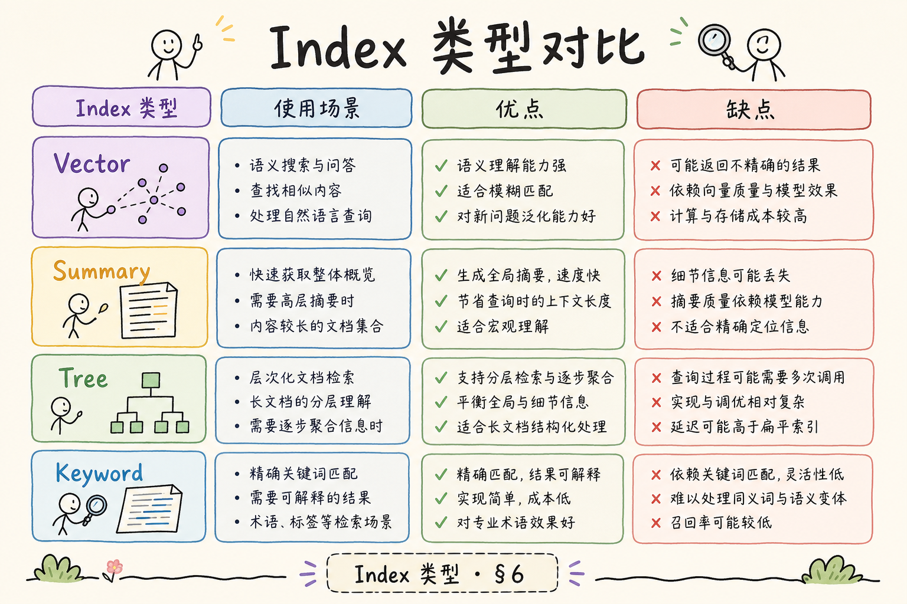
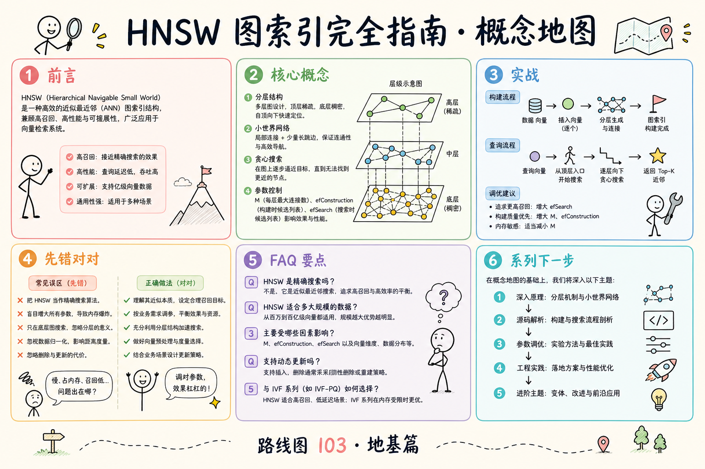

# D 框架与架构（七）：LlamaIndex Index 类型入门指南

学习 LlamaIndex 时，最容易被 “Index 类型” 绕住。VectorStoreIndex、SummaryIndex、DocumentSummaryIndex 这些名字看起来像一组必须背下来的类，但对初学者来说，真正重要的问题只有一个：**你的资料应该用什么方式组织，才能被后面的查询引擎有效使用？**

本文面向刚接触 RAG 框架的读者。读完后，你应该能理解 Index 在 LlamaIndex 中做什么，Document、Node、Index 三者是什么关系，常见 Index 类型分别适合什么场景，并能写出一个最小的“文档 → 节点 → 索引 → 查询”心智模型。

## 目录

- [1. 为什么需要 Index](#1-为什么需要-index)
- [2. LlamaIndex 中的 Document、Node、Index](#2-llamaindex-中的-documentnodeindex)
- [3. 常见 Index 类型怎么选](#3-常见-index-类型怎么选)
- [4. VectorStoreIndex 的位置](#4-vectorstoreindex-的位置)
- [5. Summary 类索引适合什么](#5-summary-类索引适合什么)
- [6. 最小可运行示例](#6-最小可运行示例)
- [7. Index 与 Query Engine 的关系](#7-index-与-query-engine-的关系)
- [8. 常见错误](#8-常见错误)
- [9. FAQ](#9-faq)
- [10. 总结](#10-总结)

## 1. 为什么需要 Index

原始文档不能直接高效回答问题。系统需要先把文档整理成一种可查询的结构，这个结构就是 Index。通俗说，Index 像图书馆的目录系统：书本是原始资料，目录和索引帮助你快速找到相关章节。

在 RAG 中，Index 的作用是把资料变成后续检索或总结能使用的形态。它不等于模型，也不等于答案生成器。它更像资料组织层。


这张图说明：Index 位于资料进入系统之后、查询发生之前。前面的解析和切分质量，会直接影响 Index 的效果。

## 2. LlamaIndex 中的 Document、Node、Index

先分清三个基础概念。

| 概念 | 白话解释 | 作用 |
|---|---|---|
| Document | 一份原始资料或加载后的文档 | 保存正文和来源信息 |
| Node | 从 Document 切出来的小片段 | 成为检索和索引的基本单位 |
| Index | 组织 Node 的查询结构 | 支持检索、总结或组合查询 |

**Document** 更接近文件或资料来源，**Node** 更接近一个可检索片段，**Index** 是围绕这些 Node 建起来的查询结构。



如果把 Node 切得不合理，Index 再高级也很难找回完整答案。因此不要只关注 Index 类型，也要关注文档解析和切分。

## 3. 常见 Index 类型怎么选

初学阶段不需要背完整类型表。先抓几个常见方向：向量检索、顺序总结、文档级总结。



| Index 类型 | 适合场景 | 初学者理解 |
|---|---|---|
| VectorStoreIndex | 根据语义相似度找片段 | 最常见的 RAG 检索索引 |
| SummaryIndex | 按顺序汇总多个 Node | 适合总结整份资料 |
| DocumentSummaryIndex | 先给文档做摘要，再按文档查 | 适合多文档概览和路由 |

选择 Index 时，先问：用户的问题是“找一段相关资料”，还是“总结整份文档”，还是“先判断应该看哪份文档”？不同问题对应不同资料组织方式。

## 4. VectorStoreIndex 的位置

VectorStoreIndex 是最常见的 RAG 入口。它把 Node 转成向量，存入向量存储，再按语义相似度找回相关片段。



它适合回答“资料里哪里提到了这个问题”。例如用户问上传状态、JWT 权限、Retriever 区别，VectorStoreIndex 可以找回相关片段。

但它不擅长自动总结整本长文档。如果问题是“帮我总结这份 100 页报告”，单纯相似度检索可能只找回几个局部片段，不适合全局概括。

## 5. Summary 类索引适合什么

SummaryIndex 更适合需要阅读多个 Node 并组织整体答案的场景。它可以按顺序处理资料，适合“总结全文”“列出全文要点”这类任务。

DocumentSummaryIndex 则更偏多文档场景。它先为每份文档保留摘要，查询时可以先判断哪几份文档更相关，再进入更细的查询。

| 问题类型 | 更合适的方向 |
|---|---|
| “退款规则在哪里写了？” | VectorStoreIndex |
| “总结这份上传设计文档” | SummaryIndex |
| “这批文档里哪几份讲权限？” | DocumentSummaryIndex |

Index 不是越复杂越好。简单语义检索能解决的问题，不需要强行上复杂索引。

## 6. 最小可运行示例

下面用纯 Python 模拟 Index 的概念，不依赖 LlamaIndex。它展示文档切成 Node 后，如何用一个简单索引查找相关片段。



运行环境：Python 3.10+。

```python
from dataclasses import dataclass


@dataclass
class Node:
    text: str
    metadata: dict


class SimpleIndex:
    def __init__(self, nodes: list[Node]):
        self.nodes = nodes

    def query(self, question: str, k: int = 2) -> list[Node]:
        words = set(question.lower().split())

        def score(node: Node) -> int:
            return len(words & set(node.text.lower().split()))

        ranked = sorted(self.nodes, key=score, reverse=True)
        return [node for node in ranked if score(node) > 0][:k]


nodes = [
    Node("VectorStoreIndex 适合语义检索。", {"source": "index-guide"}),
    Node("SummaryIndex 适合总结长文档。", {"source": "index-guide"}),
]

index = SimpleIndex(nodes)
for node in index.query("VectorStoreIndex 检索"):
    print(node.metadata["source"], node.text)
```

真实 LlamaIndex 会提供更完整的 Node、Index 和 Query Engine，但这个例子能帮你先理解 Index 的基本责任：组织 Node，并支持查询。

## 7. Index 与 Query Engine 的关系

Index 本身是资料结构，Query Engine 是面向用户问题的查询接口。你可以把 Index 理解为“建好的目录”，Query Engine 理解为“拿着问题去查目录的人”。


实际开发中，你经常会先构建 Index，再把它转换成 Query Engine。调试时也要分清：如果资料找不回来，可能是 Index 构建或切分问题；如果资料找回来但回答差，可能是 Query Engine、Prompt 或模型问题。

## 8. 常见错误

第一个错误是把所有场景都用 VectorStoreIndex。它很常用，但不是全文总结和多文档路由的唯一答案。

第二个错误是忽略 Node 切分。Index 使用的是 Node，Node 切坏了，查询效果就会受限。

第三个错误是只看示例类名，不看问题类型。选择 Index 前先明确用户会问什么，而不是先决定用哪个类。

第四个错误是把 Index 当数据库。Index 组织的是查询结构，仍要配合元数据、存储、版本和权限管理。

## 9. FAQ

**Q：初学者先学哪个 Index？**  
先从 VectorStoreIndex 开始，因为它最贴近常见 RAG 问答。理解后再看 Summary 类索引。

**Q：Index 建好后能直接回答问题吗？**  
通常要通过 Query Engine 或 Retriever 使用。Index 是资料结构，不是完整问答应用。

**Q：换 Index 类型能解决所有幻觉吗？**  
不能。幻觉还和检索、prompt、模型、引用校验有关。

**Q：同一批资料能建多个 Index 吗？**  
可以。比如一个用于局部检索，一个用于文档级总结。关键是清楚每个 Index 的用途。

## 10. 总结

LlamaIndex 的 Index 是资料组织结构，帮助系统把 Document 和 Node 变成可查询能力。不同 Index 类型适合不同问题：语义检索、全文总结、多文档路由。



初学者不要先背类名，而要先判断用户问题类型。能明确“我是在找片段、总结全文，还是选择文档”，Index 类型就容易选得多。
