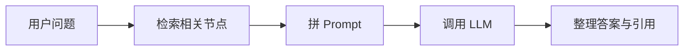
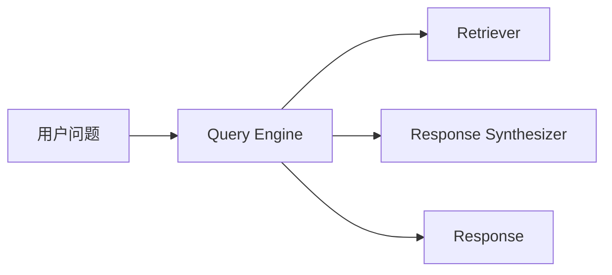
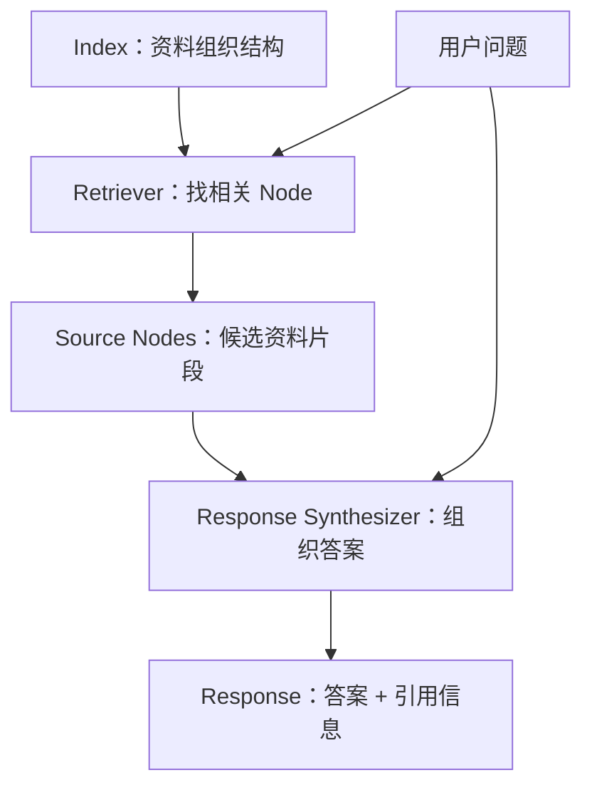
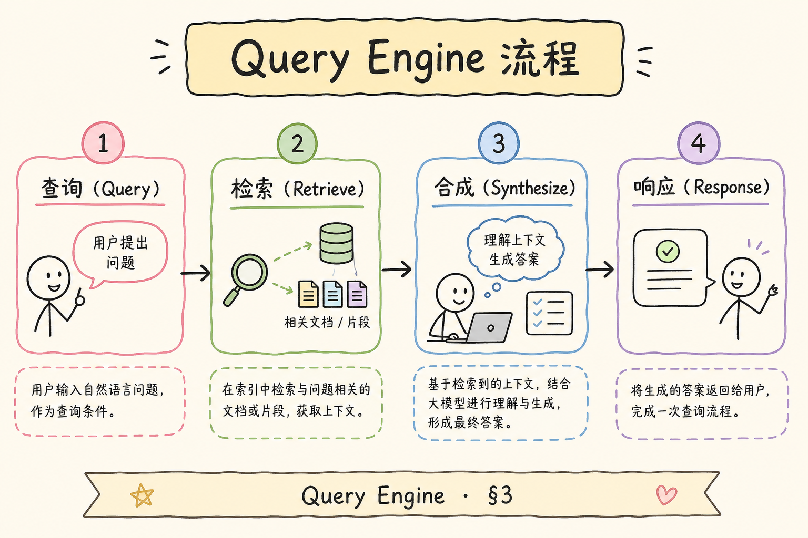
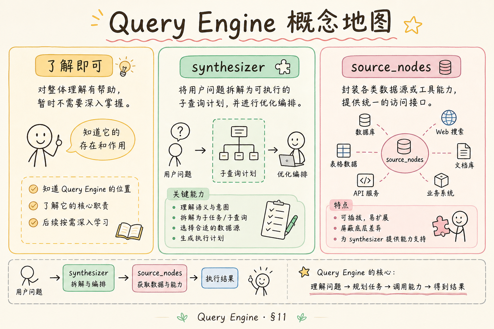
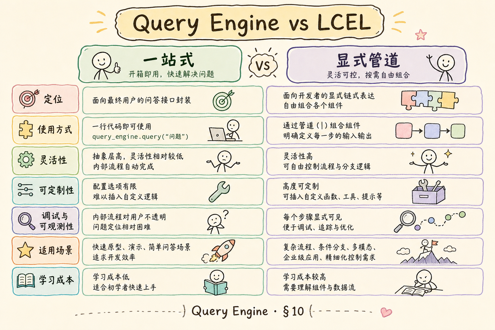

# D 框架与架构（八）：LlamaIndex Query Engine 入门

很多初学者第一次用 LlamaIndex 时，会把 **Index**、**Retriever**、**Query Engine** 混在一起。最简单的区分是：Index 负责组织资料，Retriever 负责找资料，Query Engine 负责把“找资料 + 组织答案”封装成一次问答调用。

本文不追求覆盖 LlamaIndex 的所有高级能力，而是讲清楚 Query Engine 是什么、解决什么问题、如何做一个最小可运行问答，以及什么时候不该把它当黑盒。

## 目录

- [1. Query Engine 解决什么问题](#1-query-engine-解决什么问题)
- [2. 三个核心对象](#2-三个核心对象)
- [3. 从 Index 创建 Query Engine](#3-从-index-创建-query-engine)
- [4. 最小可运行示例](#4-最小可运行示例)
- [5. RetrieverQueryEngine：拆开黑盒](#5-retrieverqueryengine拆开黑盒)
- [6. 流式和引用](#6-流式和引用)
- [7. 与 LangChain LCEL 的对照](#7-与-langchain-lcel-的对照)
- [8. 常见误解](#8-常见误解)
- [9. FAQ](#9-faq)
- [10. 总结](#10-总结)

## 1. Query Engine 解决什么问题

**Query Engine** 可以直译为“查询引擎”。通俗说，它是一个帮你完成问答流程的入口：你给它一个问题，它负责检索相关文档片段，再把片段交给大模型整理成答案。

如果不用 Query Engine，你通常要自己写这些步骤：



Query Engine 把这条链封装成一个 `.query()` 调用：



封装的好处是上手快；代价是初学者容易看不见内部步骤。所以学习 Query Engine 的重点不是背 API，而是知道它里面包了哪些动作。

## 2. 三个核心对象

先解释三个常见术语：

**Node**：LlamaIndex 里的文本片段。它通常来自一篇文档被切分后的结果，类似 RAG 里的 chunk。

**Retriever**：检索器。它根据问题找出最相关的 Node。

**Response Synthesizer**：答案合成器。它把检索到的 Node 和用户问题组合起来，生成最终答案。

Query Engine 的内部关系可以这样看：



如果只记一句话：Query Engine 是把 Retriever 和 Synthesizer 绑在一起的问答入口。

## 3. 从 Index 创建 Query Engine

LlamaIndex 最常见的写法是先构建 Index，再从 Index 创建 Query Engine。



```python
query_engine = index.as_query_engine(similarity_top_k=3)
response = query_engine.query("公司的年假规则是什么？")
print(response)
```

这段代码背后发生了三件事：

1. `similarity_top_k=3` 表示最多取 3 个相关片段。
2. `query()` 会触发检索和答案合成。
3. `response` 不只是字符串，通常还包含来源节点等元信息。

初学者最容易漏掉的是第 1 点。Query Engine 不是魔法，它仍然依赖检索参数；参数太小可能漏资料，参数太大可能把噪声塞进上下文。

## 4. 最小可运行示例

下面示例用内存里的两段文本创建一个最小问答。运行前需要准备：

```bash
pip install llama-index
```

如果你的环境需要调用 OpenAI 或兼容模型，请提前配置对应 API Key。不同版本的 LlamaIndex 包名和导入路径可能略有差异，本文用的是 0.10 之后常见写法。

```python
from llama_index.core import Document, VectorStoreIndex

documents = [
    Document(text="公司年假规则：入职满一年后，每年有 5 天年假。"),
    Document(text="报销规则：差旅报销需要在 30 天内提交发票。"),
]

index = VectorStoreIndex.from_documents(documents)
query_engine = index.as_query_engine(similarity_top_k=1)

response = query_engine.query("入职满一年有几天年假？")
print(response)

for node in response.source_nodes:
    print("来源片段：", node.node.get_text())
```

这段代码的预期行为是：答案会围绕“5 天年假”，来源片段应该来自第一条文档。最后的 `source_nodes` 很重要，因为它让你检查模型答案是否真的有依据。

## 5. RetrieverQueryEngine：拆开黑盒

如果你想更清楚地控制检索器和答案合成器，可以使用 `RetrieverQueryEngine`。它适合在你需要自定义检索参数、过滤条件或合成方式时使用。

概念上，它等价于手动把两个零件拼起来：

```python
from llama_index.core.query_engine import RetrieverQueryEngine

retriever = index.as_retriever(similarity_top_k=2)
query_engine = RetrieverQueryEngine.from_args(retriever)

response = query_engine.query("报销需要多久内提交？")
print(response)
```

这段代码和 `index.as_query_engine()` 的差别是：Retriever 被显式拿出来了。以后你要换成带 metadata filter 的检索器、混合检索器或自定义检索器，就更容易改。

可以按这个决策表选择：

| 场景 | 建议 |
| --- | --- |
| 第一次上手、本地 demo | `index.as_query_engine()` |
| 要调 `top_k`、过滤条件 | 显式创建 retriever |
| 要换答案合成策略 | 配置 response synthesizer |
| 要接企业权限过滤 | 不要只依赖默认 Query Engine，要检查 retriever 过滤逻辑 |

## 6. 流式和引用

**流式输出**（streaming）是指答案边生成边返回，用户不必等完整回答结束。Query Engine 通常可以开启流式模式，但不同版本 API 可能略有差异。

```python
query_engine = index.as_query_engine(streaming=True)
streaming_response = query_engine.query("年假和报销规则分别是什么？")

for token in streaming_response.response_gen:
    print(token, end="")
```

流式只改变“答案怎么返回”，不改变“资料是否可靠”。因此引用检查仍然要做。

**引用**在 LlamaIndex 里常见为 `source_nodes`。它表示参与回答的来源片段，但不等于“答案每句话都已严格引用”。如果你要做可追溯 RAG，还需要在答案中显示来源、页码、文档标题，并避免把不可见文档放进检索结果。

## 7. 与 LangChain LCEL 的对照

Query Engine 和 LCEL 都能搭 RAG，但抽象层级不同。

| 维度 | LlamaIndex Query Engine | LangChain LCEL |
| --- | --- | --- |
| 主要感觉 | 一站式问答入口 | 显式拼接流程 |
| 上手速度 | 快 | 稍慢 |
| 流程可见性 | 默认较隐藏 | 每一步更清楚 |
| 适合场景 | 快速搭资料问答 | 需要强控制和复杂编排 |

对初学者来说，可以先用 Query Engine 跑通最小问答，再学习如何拆出 Retriever、Prompt、LLM、Parser。不要一开始就沉迷框架对比，先确认你的检索结果是否正确。

## 8. 常见误解

下面这些误解都来自“把 Query Engine 当成万能黑盒”。排查答案质量问题时，可以按这些点逐个拆开检查。

### 8.1 以为 Query Engine 负责构建索引

Query Engine 负责查询，不负责把原始文件变成索引。文档加载、切分、embedding、入库通常发生在构建 Index 阶段。

### 8.2 以为默认参数一定合理

默认参数只是能跑，不代表适合你的数据。`similarity_top_k`、过滤条件、答案合成模式都需要用实际问题集验证。

### 8.3 以为 source_nodes 就是完美引用

`source_nodes` 是“模型看过哪些片段”的记录，不一定能证明答案中的每句话都来自这些片段。严肃场景要做引用展示和人工抽检。

### 8.4 以为封装越高越省事

封装越高，排查问题时越需要知道内部结构。答案不对时，要能拆开看：是切分错、检索错、Prompt 错，还是模型合成错。

## 9. FAQ

**Q1：Query Engine 和 ChatEngine 有什么区别？**  
Query Engine 偏一次性问答；ChatEngine 更关注多轮对话，会处理历史消息。多轮并不只是把历史拼上去，还要考虑上下文窗口和指代消解。

**Q2：Query Engine 能不能做权限过滤？**  
能接，但要看过滤发生在哪里。企业 RAG 里建议在 retriever 阶段做 metadata filter，确保不可见文档不会进入上下文。

**Q3：response_mode 要不要一开始就学？**  
可以先了解。它影响多个片段如何合成答案，比如逐步 refine 还是集中 compact。初学阶段先跑通默认模式，再根据答案质量调整。

**Q4：为什么同一个问题多问几次答案不同？**  
可能来自模型采样、检索结果变化或上下文拼接差异。先固定检索参数和模型温度，再排查内容。

## 10. 总结

LlamaIndex Query Engine 的价值是让 RAG 问答快速成型：你不必手写每个检索和合成步骤，就能从 Index 得到答案。





但它不是黑盒魔法。初学者要抓住四个检查点：

1. Index 是否正确构建。
2. Retriever 找到的 Node 是否相关。
3. Synthesizer 是否按资料回答。
4. Response 是否能展示来源并接受验证。

掌握这四点后，再去比较 LCEL、Haystack Pipeline 或自研流程，才不会只是在框架名词之间打转。
