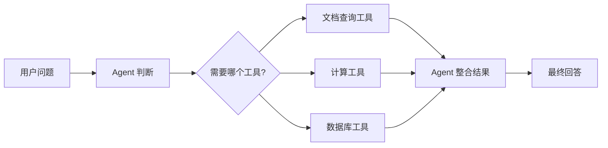
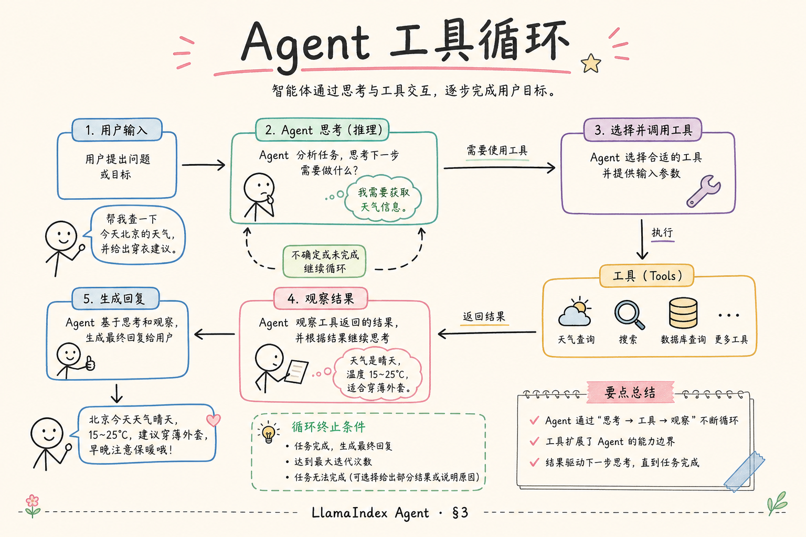
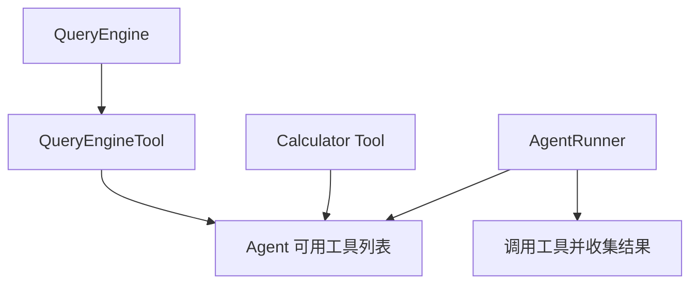
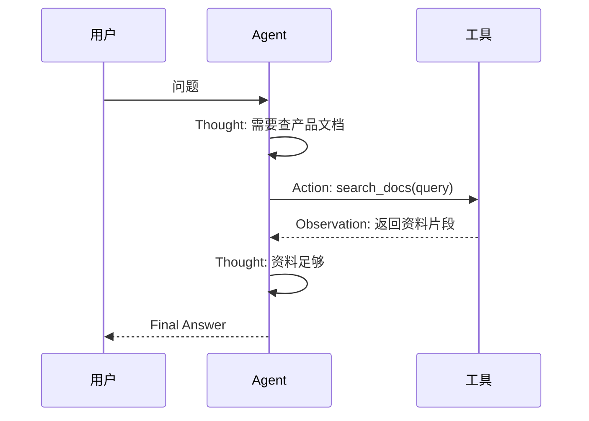
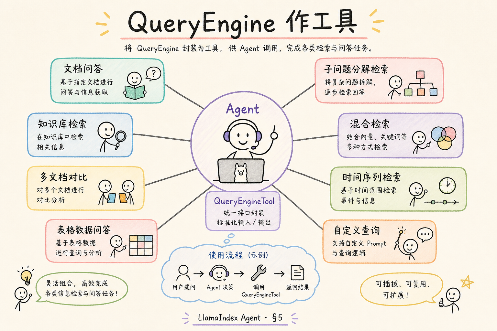
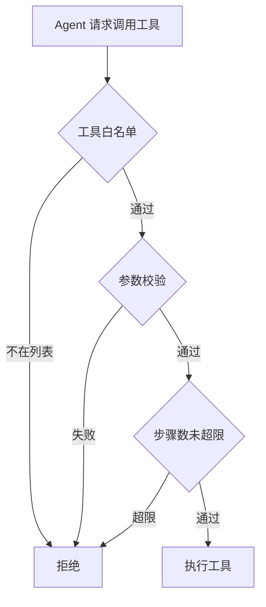
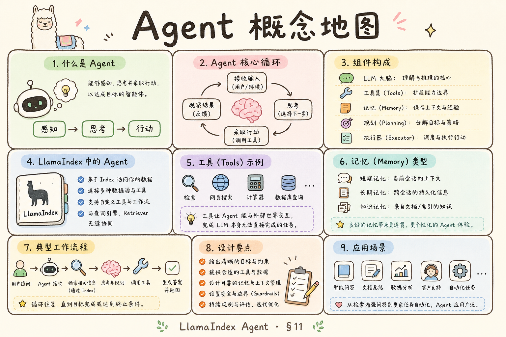

# D 框架与架构（九）：LlamaIndex Agent 入门指南

前面讲 Query Engine 时，系统的动作比较固定：用户提问，检索资料，生成答案。到了 Agent，流程会多一步判断：这个问题要不要调用工具？调用哪个工具？调用结果是否足够回答？**Agent** 要解决的是“让模型在多个工具之间做选择，并按步骤完成任务”的问题。

本文面向刚接触 LlamaIndex 的初学者。读完后，你应该能理解 Agent 在 RAG 中的位置，知道 Tool、AgentRunner、ReAct 这些概念各做什么，并能写出一个不依赖真实模型的最小 Agent 心智模型。

## 目录

- [1. 为什么 RAG 会需要 Agent](#1-为什么-rag-会需要-agent)
- [2. Agent 是什么](#2-agent-是什么)
- [3. Tool、QueryEngineTool 与 AgentRunner](#3-toolqueryenginetool-与-agentrunner)
- [4. ReAct 思路怎么读](#4-react-思路怎么读)
- [5. 最小可运行示例](#5-最小可运行示例)
- [6. Agent 和普通 RAG 链路的边界](#6-agent-和普通-rag-链路的边界)
- [7. 如何控制 Agent 风险](#7-如何控制-agent-风险)
- [8. 常见错误](#8-常见错误)
- [9. FAQ](#9-faq)
- [10. 总结](#10-总结)

## 1. 为什么 RAG 会需要 Agent

普通 RAG 链路适合处理“去一个知识库找资料并回答”的问题。但真实产品里，用户可能同时问多个来源：先查产品文档，再查价格表；先判断问题类型，再决定是否调用数据库；先检索，再计算。

如果每种情况都写死在后端流程里，代码会越来越多。Agent 的价值是让模型参与“下一步做什么”的决策，但真正执行工具的仍然是程序。



这张图的重点是：Agent 不是单纯回答器，而是一个会选择工具的调度者。

## 2. Agent 是什么

**Agent**：能根据目标和上下文选择工具、观察结果、继续决定下一步的组件。通俗说，它像一个会安排步骤的助手，而不是只会一次性回答的文本生成器。

Agent 通常包含三件事：

| 组成 | 白话解释 | 作用 |
|---|---|---|
| LLM | 做判断和生成 | 决定下一步、组织答案 |
| Tools | 可调用能力 | 查询、计算、搜索、业务接口 |
| Runner | 执行循环 | 把“思考、调用、观察”串起来 |

初学者要特别注意：Agent 的“聪明”来自工具设计和边界控制，不是把所有能力都丢给模型就会自动可靠。

## 3. Tool、QueryEngineTool 与 AgentRunner

**Tool** 是 Agent 可以使用的能力。一个 Tool 至少要有名字、描述和执行函数。描述很重要，因为模型会根据描述判断什么时候该用它。

**QueryEngineTool** 可以理解成“把一个查询引擎包装成工具”。例如你有一个产品文档 Query Engine，就可以把它包装成 `product_docs_search`，让 Agent 在需要查产品文档时调用。

**AgentRunner** 是执行 Agent 流程的组件。它负责接收用户问题，让模型选择工具，执行工具，再把工具结果交回模型。





这张图说明：Query Engine 本身只会回答某类资料问题，包装成 Tool 后，Agent 才能在多工具场景中选择它。

## 4. ReAct 思路怎么读

**ReAct** 是 Reason + Act 的组合思路。白话说，就是让模型交替进行“想一下”和“做一步”：先判断要查什么，再调用工具，看到结果后再决定是否继续。

一个简化流程如下：



读 ReAct 日志时，重点看三件事：模型为什么选这个工具，工具输入是否合理，观察结果是否真的支持最终答案。

## 5. 最小可运行示例

下面用纯 Python 模拟一个极简 Agent。它不会调用真实大模型，只展示“选择工具 → 执行工具 → 组织答案”的流程。



运行环境：Python 3.10+。

```python
def search_docs(query: str) -> str:
    docs = {
        "refund": "退款规则：发货前可直接退款，发货后需先退货。",
        "upload": "上传文件后会进入索引队列，完成后才能问答。",
    }
    for key, value in docs.items():
        if key in query.lower():
            return value
    return "没有找到相关资料。"


def calculate(expression: str) -> str:
    if expression == "2+2":
        return "4"
    return "只支持演示表达式。"


TOOLS = {
    "search_docs": search_docs,
    "calculate": calculate,
}


def simple_agent(question: str) -> str:
    if "refund" in question.lower() or "upload" in question.lower():
        tool_name = "search_docs"
        observation = TOOLS[tool_name](question)
        return f"我查了文档：{observation}"
    if "2+2" in question:
        tool_name = "calculate"
        observation = TOOLS[tool_name]("2+2")
        return f"计算结果是：{observation}"
    return "这个问题不需要工具，我可以直接回答。"


print(simple_agent("upload 后为什么不能马上问答？"))
```

真实 Agent 会用模型来做工具选择，但程序仍要负责注册工具、执行工具和限制工具边界。

## 6. Agent 和普通 RAG 链路的边界

不是所有 RAG 问答都需要 Agent。固定知识库问答通常用普通链路更稳定；需要多工具、多步骤或条件分支时，Agent 才更有价值。

| 场景 | 更适合 |
|---|---|
| 单知识库问答 | 普通 RAG 链路 |
| 多知识库按意图选择 | Agent 或路由器 |
| 需要计算、查询、检索组合 | Agent |
| 严格可控的生产流程 | 明确工作流优先 |

Agent 的自由度更高，也意味着测试和安全成本更高。初学者不要为了“高级”而把简单问答改成 Agent。

## 7. 如何控制 Agent 风险

Agent 最大风险是工具调用失控：选错工具、传错参数、重复调用、把工具结果误读成事实。

| 风险 | 控制方式 |
|---|---|
| 选错工具 | 工具描述写清楚，工具数量不要太多 |
| 参数错误 | 程序侧做 schema 校验 |
| 无限循环 | 限制最大步骤数 |
| 越权访问 | 工具内部做权限校验 |
| 编造结论 | 要求最终答案引用工具观察结果 |



安全边界必须在工具执行层，而不是只靠提示词提醒模型。

## 8. 常见错误

第一个错误是给 Agent 太多工具。工具越多，模型越容易选错。早期可以只给 2 到 5 个高价值工具。

第二个错误是工具描述太抽象。例如“查询信息”不如“查询产品文档中的退款、上传、权限说明”清楚。

第三个错误是没有最大步数。Agent 可能不断尝试工具，导致成本和延迟失控。

第四个错误是让 Agent 处理权限。权限必须在工具和后端层校验，不能让模型自己决定用户能不能看资料。

## 9. FAQ

**Q：Agent 一定比普通 RAG 更好吗？**  
不是。Agent 更灵活，但更难控。固定问答链路能解决的问题，优先用固定链路。

**Q：QueryEngineTool 是必须的吗？**  
不是。它只是把 Query Engine 包装成 Agent 工具的一种方式。你也可以包装普通函数或 API。

**Q：ReAct 日志要给用户看吗？**  
通常不直接展示。它更适合开发者调试。用户需要看到的是清楚答案和引用来源。

**Q：Agent 能自动学会业务规则吗？**  
不能。业务规则要写进工具描述、参数校验、权限控制和评估用例里。

## 10. 总结

LlamaIndex Agent 的核心是让模型在多个工具之间做步骤决策。它适合多工具、多分支、多步任务，但不适合替代所有普通 RAG 链路。



初学者可以记住：Tool 是能力，Agent 是调度者，Runner 是执行循环。先把工具边界、参数校验和最大步骤数做好，再考虑把更多能力交给 Agent。
