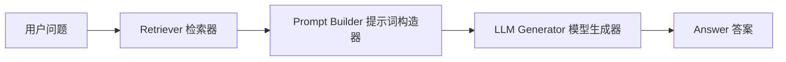
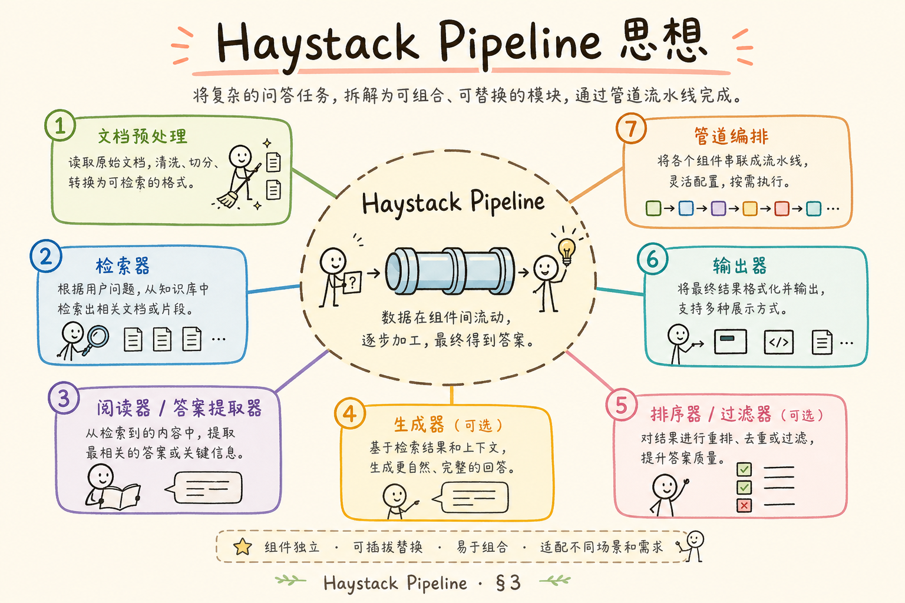
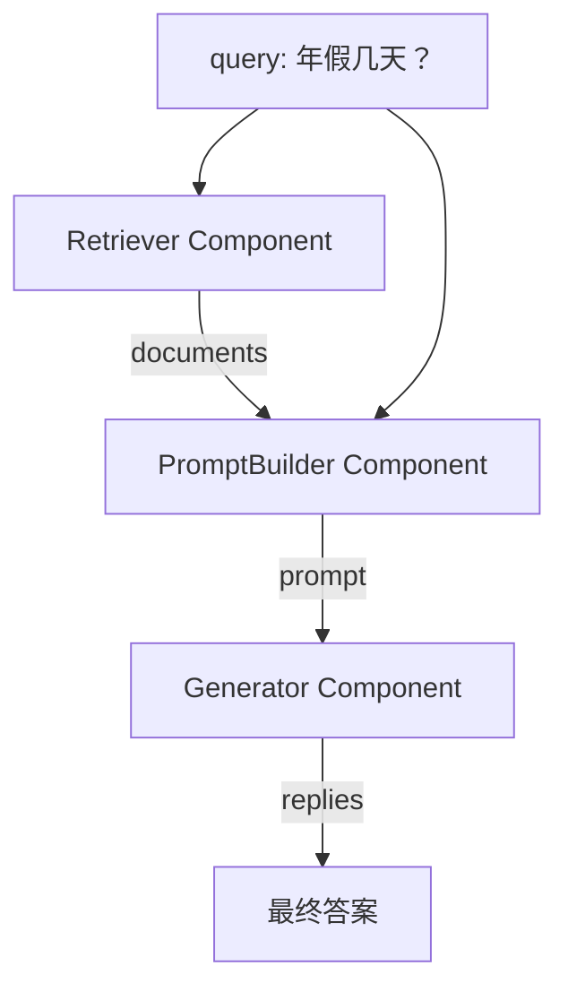
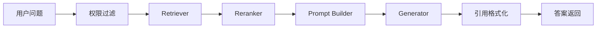
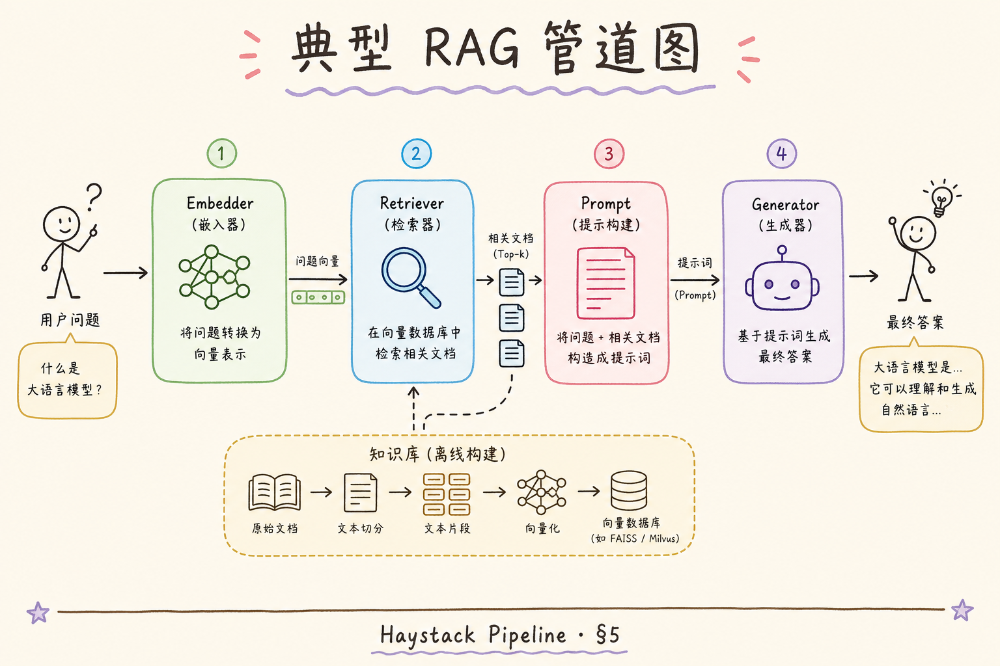
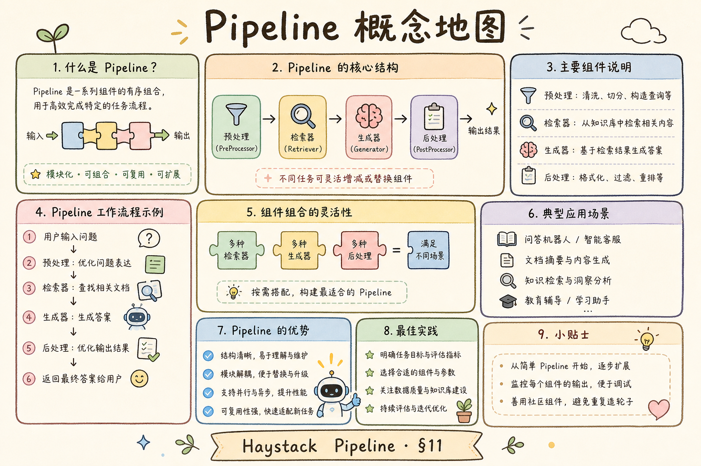

# D 框架与架构（十）：Haystack Pipeline 思想入门

Haystack 是一个构建搜索、问答和 RAG 应用的框架。本文不要求你立刻在项目里使用 Haystack，而是借它的 **Pipeline** 思想学会一件事：把 RAG 流程拆成清晰的组件，并用显式连接描述数据怎么流动。

对初学者来说，Pipeline 的价值不在“多一个框架名词”，而在它能让你看清：问题从哪里进来，文档从哪里出来，Prompt 在哪里组装，LLM 在哪里生成答案。

## 目录

- [1. 为什么要学 Pipeline 思想](#1-为什么要学-pipeline-思想)
- [2. Haystack Pipeline 是什么](#2-haystack-pipeline-是什么)
- [3. Component 与 Connection](#3-component-与-connection)
- [4. 一个典型 RAG Pipeline](#4-一个典型-rag-pipeline)
- [5. 最小伪代码示例](#5-最小伪代码示例)
- [6. 与 LCEL 的对照](#6-与-lcel-的对照)
- [7. 什么时候借鉴 Haystack](#7-什么时候借鉴-haystack)
- [8. 常见误解](#8-常见误解)
- [9. FAQ](#9-faq)
- [10. 总结](#10-总结)

## 1. 为什么要学 Pipeline 思想

很多 RAG demo 会写成一个很长的函数：读取问题、检索文档、拼 Prompt、调用模型、返回答案全塞在一起。能跑，但一旦出错就难排查。

**Pipeline** 可以理解成“流水线”：每个步骤只做一件事，步骤之间用明确的输入输出连接起来。



从图里可以看出，Pipeline 的重点不是“写得更酷”，而是让系统边界更清楚。检索差就看 Retriever，答案跑题就看 Prompt 或 Generator。

## 2. Haystack Pipeline 是什么

**Haystack Pipeline** 是 Haystack 中用来编排组件的对象。它把多个组件连成一张图，然后让数据按连接关系流动。

通俗说，你可以把 Pipeline 想成一个可执行流程图：

| 术语 | 白话解释 |
| --- | --- |
| Component | 一个处理步骤，比如检索、拼 Prompt、生成答案 |
| Connection | 两个步骤之间的数据连线 |
| Pipeline | 把组件和连线组织起来的整体流程 |
| Run | 把输入丢进流程，让它跑出结果 |

Pipeline 的好处是显式。你不用猜一个函数里面第几行做了什么，而是能看到组件之间的连接关系。

## 3. Component 与 Connection

**Component** 是组件。一个组件应该有清楚的输入和输出，例如：Retriever 输入 query，输出 documents；Prompt Builder 输入 query 和 documents，输出 prompt。

**Connection** 是连接。它说明一个组件的输出要送到另一个组件的哪个输入。

下面这张图把两个概念放在一起：





初学时要养成一个习惯：每加一个组件，都问自己“它输入什么，输出什么，下游谁消费它”。

## 4. 一个典型 RAG Pipeline

RAG Pipeline 通常至少包含三个核心组件：

1. Retriever：从知识库里找相关文档。
2. Prompt Builder：把问题和文档拼成模型能理解的提示词。
3. Generator：调用大模型生成答案。

如果要做企业项目，还会继续加权限过滤、重排、引用格式化、日志记录等组件。



这张图说明 Pipeline 不一定是直线，也可以是带分支和扩展节点的流程。关键是每个节点的职责要单一。

## 5. 最小伪代码示例

下面是 Haystack 2.x 风格的伪代码，用来展示“先加组件，再连组件，再运行”的思路。不同版本的真实导入路径会变化，所以这里重点看结构。



```python
from haystack import Pipeline

pipeline = Pipeline()

pipeline.add_component("retriever", retriever)
pipeline.add_component("prompt_builder", prompt_builder)
pipeline.add_component("generator", generator)

pipeline.connect("retriever.documents", "prompt_builder.documents")
pipeline.connect("prompt_builder.prompt", "generator.prompt")

result = pipeline.run({
    "retriever": {"query": "公司年假几天？"},
    "prompt_builder": {"query": "公司年假几天？"},
})

print(result["generator"]["replies"][0])
```

这段代码体现了 Pipeline 的三个动作：

1. `add_component`：告诉流程有哪些步骤。
2. `connect`：告诉流程数据怎么传。
3. `run`：给入口组件输入，让整条流程跑起来。

如果你不使用 Haystack，也可以借鉴这个结构，把自己的 RAG 代码拆成类似的函数或类。

## 6. 与 LCEL 的对照

LCEL 是 LangChain Expression Language，用表达式把多个 Runnable 串起来。Haystack Pipeline 更像显式流程图。

| 维度 | Haystack Pipeline | LangChain LCEL |
| --- | --- | --- |
| 表达方式 | 组件加连接 | Runnable 链式组合 |
| 可视化感觉 | 更像流程图 | 更像函数管道 |
| 适合排查 | 看组件输入输出 | 看链路每步返回 |
| 初学重点 | 明确组件边界 | 明确数据变换 |

两者不是“谁淘汰谁”的关系，而是不同风格的编排方式。真正重要的是：你的 RAG 流程能否拆开、测试、替换和回滚。

## 7. 什么时候借鉴 Haystack

即使项目不用 Haystack，也可以在这些场景借鉴 Pipeline 思想：

| 场景 | 为什么 Pipeline 有帮助 |
| --- | --- |
| RAG 步骤超过 4 个 | 避免一个函数变成流程黑洞 |
| 需要替换检索器或模型 | 组件边界清楚，替换成本低 |
| 需要日志和评测 | 每个组件都能记录输入输出 |
| 团队协作 | 后端、算法、评测能围绕同一流程图沟通 |

如果只是一个 30 行以内的实验 demo，不必急着上框架。先写清楚函数边界，比引入框架更重要。

## 8. 常见误解

Pipeline 思想能让流程更清楚，但它不会自动解决所有 RAG 问题。下面几类误解尤其容易让初学者把工具价值放大。

### 8.1 以为必须用 Haystack 才能做 Pipeline

Pipeline 是一种组织思想，不是某个框架独占的能力。你可以用 Haystack，也可以用普通 Python 函数实现类似结构。

### 8.2 以为图越复杂越专业

复杂图不等于好架构。初学者应该先从“检索、Prompt、生成”三段式开始，确认每段能独立测试，再逐步加节点。

### 8.3 以为 Pipeline 会自动提升答案质量

Pipeline 只让流程更清楚，不会自动让检索更准。答案质量仍然取决于切分、embedding、检索、重排、Prompt 和模型。

### 8.4 以为组件边界可以随便定

边界太粗，排查问题困难；边界太细，代码又会过度工程化。一个实用标准是：这个步骤是否需要单独测试、替换或记录日志。

## 9. FAQ

**Q1：Haystack 适合生产吗？**  
可以用于生产，但要评估团队熟悉度、部署方式、监控能力和版本稳定性。框架只是工具，不替代工程治理。

**Q2：SuperComponent 是什么？**  
可以粗略理解为把多个组件封装成一个更大的组件。初学阶段知道它用于复用复杂流程即可，不必一开始深入。

**Q3：Pipeline 和工作流引擎一样吗？**  
不完全一样。Pipeline 更偏模型应用内部的数据处理流程；工作流引擎通常还处理人工审批、定时任务、失败重试等业务流程。

**Q4：我应该先学 Haystack 还是 LangChain？**  
先学 RAG 的基本步骤，再学框架。框架只是把这些步骤用不同方式组织起来。

## 10. 总结

Haystack Pipeline 的核心价值是让 RAG 流程可见、可拆、可替换。初学者不需要一开始掌握所有 API，只要先抓住三件事：



1. Component 是单一职责的处理步骤。
2. Connection 是组件之间的数据流。
3. Pipeline 是可执行的流程图。

当你能画出自己的 RAG 流程，并解释每个节点输入输出时，再去选择 Haystack、LCEL 或自研，就会更有判断力。
