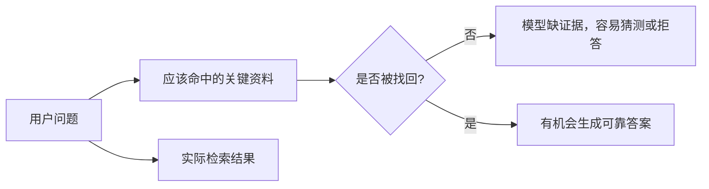
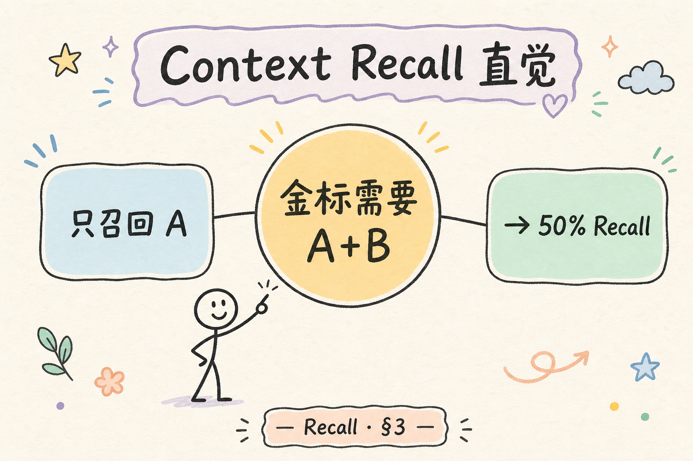
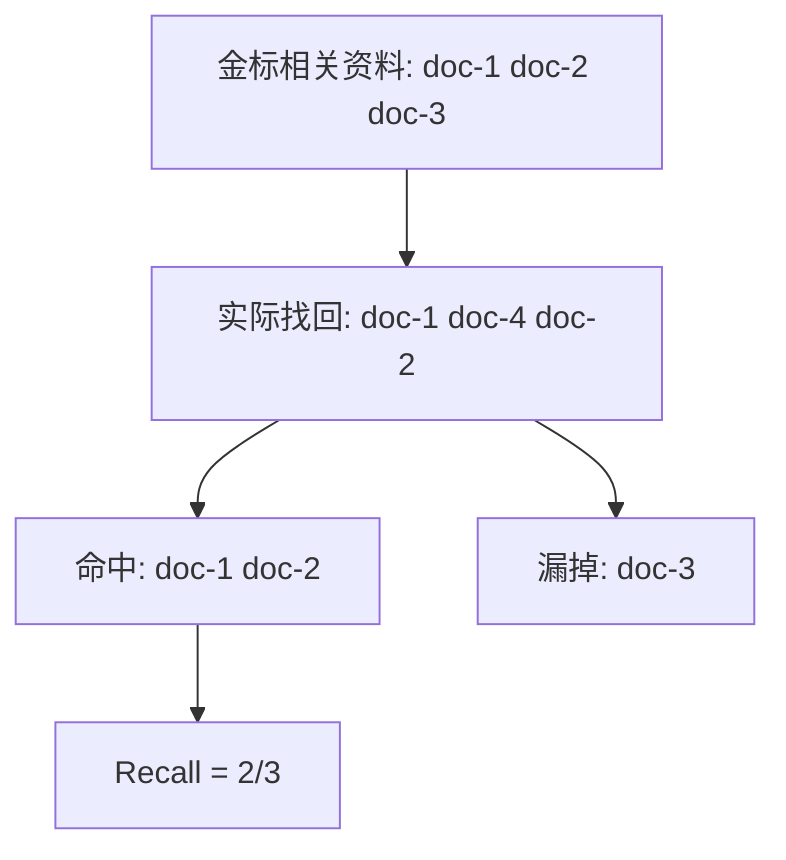
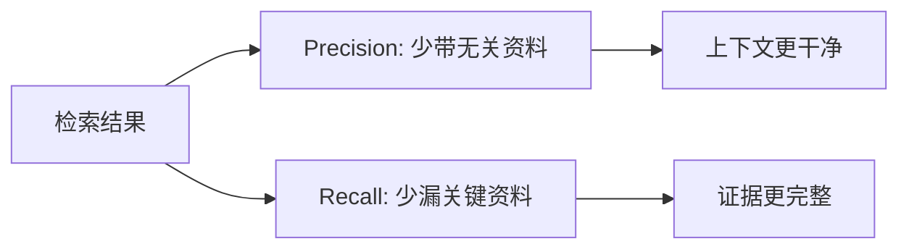
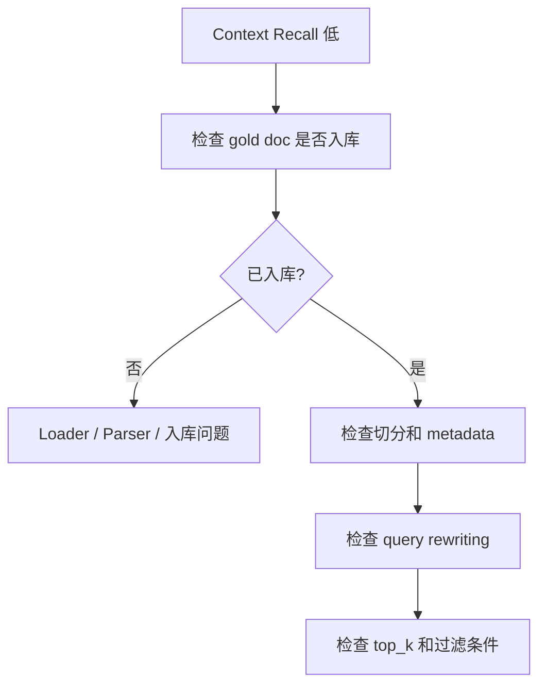
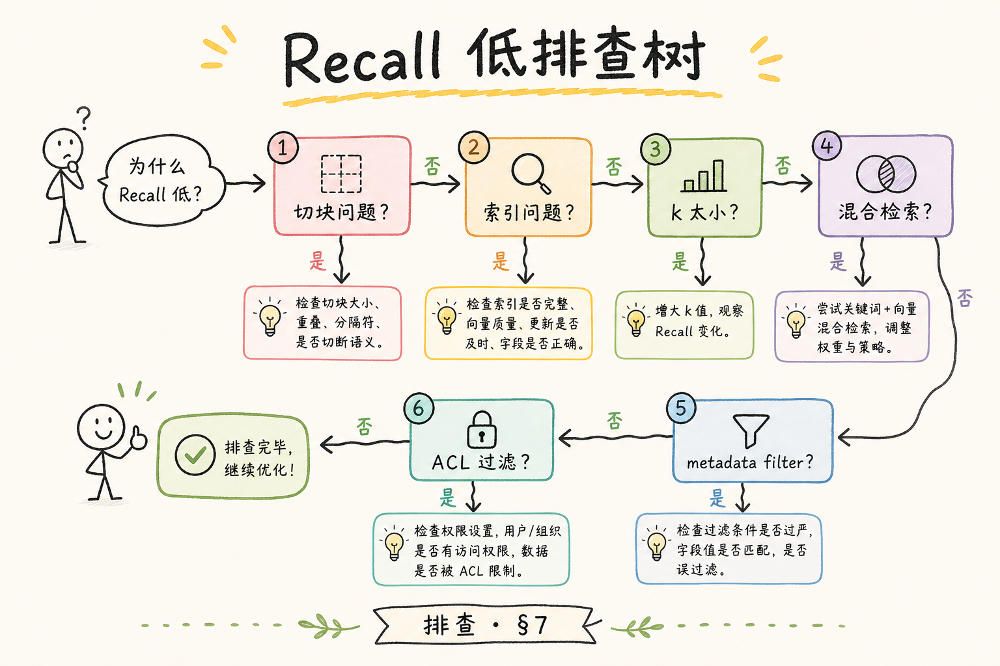
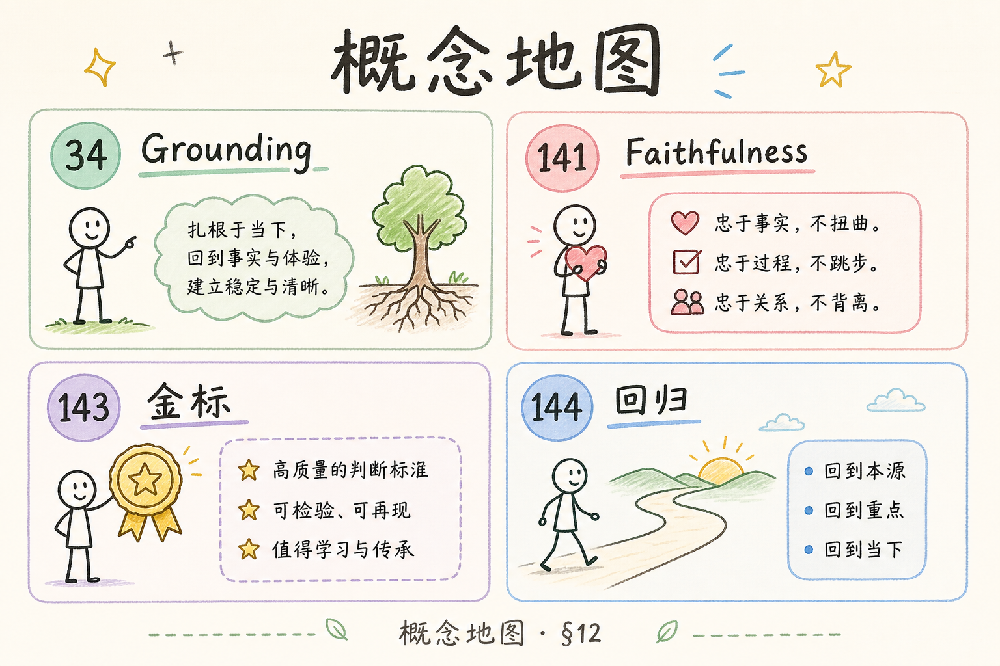

# E 评测与观测（二）：RAGAS Context Recall 入门指南

Context Precision 关注“找回来的资料准不准”，而 **Context Recall** 关注另一个问题：**该找回的关键资料有没有漏掉**。在 RAG 系统中，漏检往往比噪声更致命，因为模型没有看到关键证据，就只能猜或拒答。

本文面向刚开始做 RAG 评测的读者。读完后，你应该能理解 Context Recall 是什么、它解决什么问题、如何准备金标资料，并能用一个小例子手算召回。

## 目录

- [1. 为什么漏检很危险](#1-为什么漏检很危险)
- [2. Context Recall 是什么](#2-context-recall-是什么)
- [3. 手算一个例子](#3-手算一个例子)
- [4. 它和 Context Precision 的区别](#4-它和-context-precision-的区别)
- [5. 金标 relevant 集合怎么标](#5-金标-relevant-集合怎么标)
- [6. 如何定位 Recall 低的问题](#6-如何定位-recall-低的问题)
- [7. 如何改进 Context Recall](#7-如何改进-context-recall)
- [8. 常见错误](#8-常见错误)
- [9. FAQ](#9-faq)
- [10. 总结](#10-总结)

## 1. 为什么漏检很危险

假设用户问“Access Token 和 Refresh Token 有什么区别”。知识库里明明有一段资料解释两者生命周期，但检索结果没有把它找回来。模型即使能力很强，也看不到证据，只能靠通用知识回答。

在企业 RAG 中，这很危险。因为用户期待的是“基于当前资料的答案”，不是模型记忆里的常识。



Context Recall 的目的就是发现这类“关键资料被漏掉”的问题。

## 2. Context Recall 是什么

**Context Recall**：衡量应该用于回答问题的关键上下文，有多少被检索系统找回。通俗说，它问的是：“该拿给模型看的证据，拿全了吗？”

它适合发现这些问题：

| 问题 | 表现 |
|---|---|
| 查询改写失败 | 用户问法和文档用词不同，没找回 |
| 切分不合理 | 关键答案被切散或缺标题 |
| embedding 不匹配 | 语义相近但向量没召回 |
| 过滤过严 | 正确资料被权限或类型条件过滤掉 |
| top_k 太小 | 正确资料排在后面但没进入上下文 |

Context Recall 低时，后续 prompt 和模型通常很难补救，因为证据没有进入上下文。

## 3. 手算一个例子

假设某个问题有 3 条金标相关资料：

```text
gold relevant: doc-1, doc-2, doc-3
```

系统实际检索到：

```text
retrieved: doc-1, doc-4, doc-2
```

找回了 `doc-1` 和 `doc-2`，漏掉 `doc-3`。那么 Recall 是：

```text
2 / 3 = 0.67
```

如果系统只返回 `doc-4, doc-5, doc-6`，Recall 就是 0，因为没有任何关键资料被找回。





这个例子虽然简单，但能说明 Context Recall 的核心：分母是应该找回的关键资料，分子是实际找回的关键资料。

## 4. 它和 Context Precision 的区别

这两个指标经常一起看，但关注点不同。

| 指标 | 关注点 | 低分含义 |
|---|---|---|
| Context Precision | 找回来的资料是否大多有用 | 噪声太多或排序差 |
| Context Recall | 关键资料是否找全 | 漏掉了必要证据 |



高 Recall 低 Precision 表示关键资料在里面，但噪声多。高 Precision 低 Recall 表示返回的资料很干净，但可能漏了关键证据。

## 5. 金标 relevant 集合怎么标

Context Recall 需要知道“哪些资料本该被找回”。这就是 relevant 集合，通常需要人工标注或从 golden dataset 中整理。

标注时建议遵守一个规则：只有能直接支持答案关键结论的片段，才算 relevant。

| 标注项 | 说明 |
|---|---|
| 问题 | 用户真实或模拟问题 |
| 标准答案要点 | 答案必须包含哪些结论 |
| 相关资料 ID | 哪些文档片段支持这些结论 |
| 备注 | 为什么这些资料算相关 |

不要把“主题相近”都标成 relevant。比如问题问 Refresh Token，用一段泛泛介绍 JWT 的资料可能不够直接支持答案。

## 6. 如何定位 Recall 低的问题

Recall 低时，先不要直接换模型。要沿着检索链路排查。



很多漏检不是向量模型问题，而是资料根本没入库、标题丢失、权限过滤误伤，或者 top_k 太小。

## 7. 如何改进 Context Recall

提升 Recall 的方法通常围绕“让关键资料更容易被召回”。



| 问题来源 | 改进方式 |
|---|---|
| 用户问法和文档用词不同 | query rewriting、多查询检索 |
| 文档切得太碎 | 增加 overlap，保留标题 |
| 只用向量检索 | 加关键词或混合检索 |
| top_k 太小 | 适度增加 top_k，再用 rerank 控噪 |
| 过滤误伤 | 检查权限和类型过滤逻辑 |

Recall 提升后要重新看 Precision。因为找得更多可能带来更多噪声，通常需要配合重排和过滤。

## 8. 常见错误

第一个错误是没有金标资料，却声称在评估 Recall。没有“应该找回什么”，就无法判断漏没漏。

第二个错误是把主题相关都算相关。相关资料必须能支撑答案关键结论。

第三个错误是只调大 top_k。top_k 变大可能提高 Recall，但也会降低 Precision，增加模型上下文噪声。

第四个错误是忽略入库问题。资料没被正确解析或写入，再好的检索策略也找不到。

## 9. FAQ

**Q：Context Recall 高就代表答案一定对吗？**  
不一定。它只说明关键资料被找回了，模型还要正确使用这些资料。

**Q：没有人工标注能算 Recall 吗？**  
可以用评测模型辅助判断，但初期最好人工标注小集合，建立可信基准。

**Q：Recall 和 top_k 有什么关系？**  
top_k 增大通常有机会提高 Recall，但也可能引入噪声。需要和 Precision 一起看。

**Q：漏检优先查哪一层？**  
先确认资料是否入库，再看切分、metadata、查询改写、过滤条件和排序。

## 10. 总结

Context Recall 衡量关键证据有没有被检索系统找回来。它解决的是“模型有没有看到该看的资料”这个基础问题。



初学者可以先准备一小批问题和金标资料 ID，手算 Recall，再接入自动评测。Recall 低时沿入库、切分、查询、过滤、top_k 逐层排查，通常比盲目换模型更有效。
