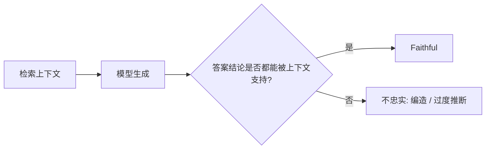
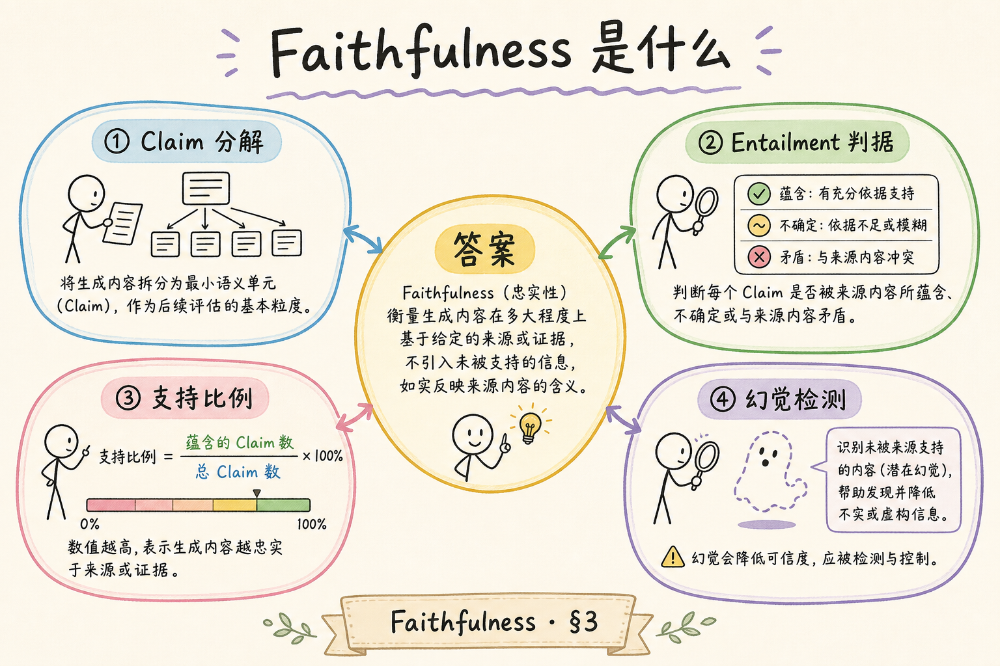
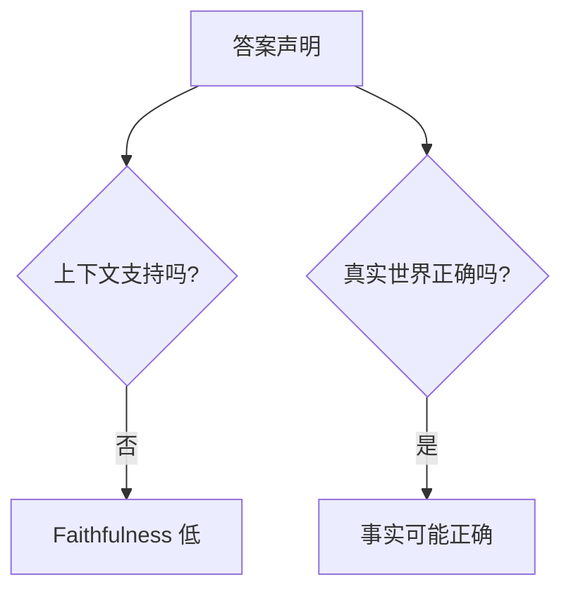
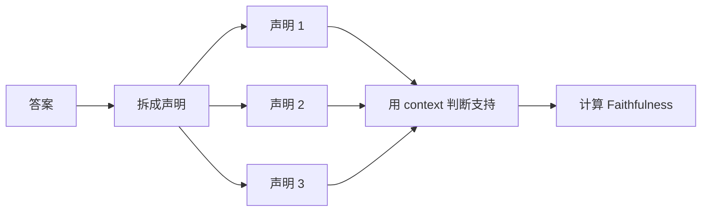
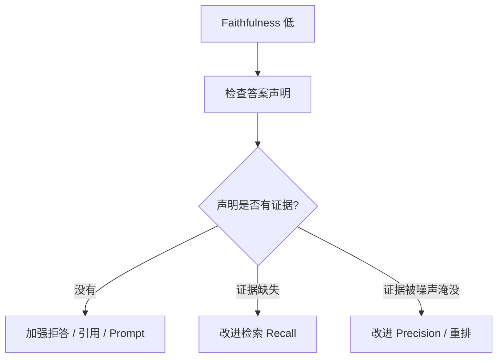
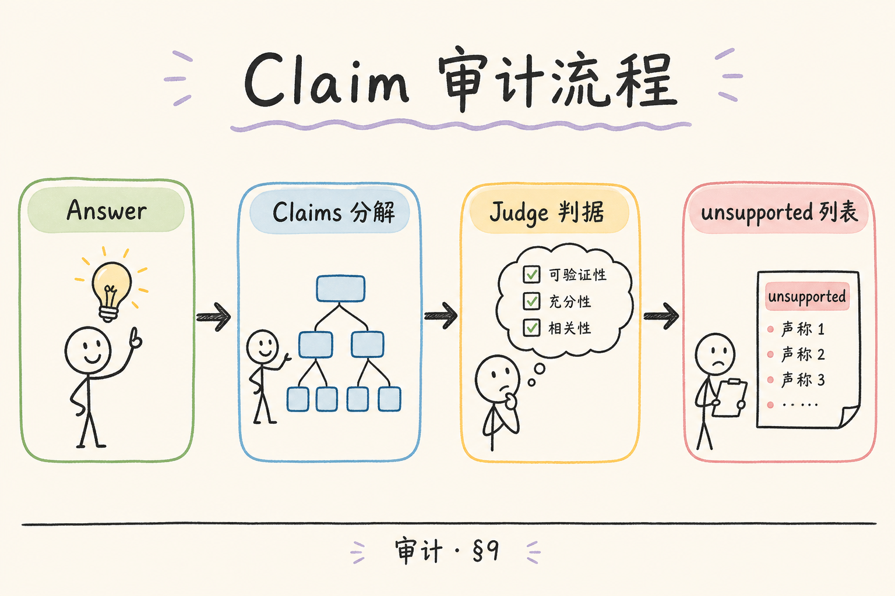

# E 评测与观测（三）：RAGAS Faithfulness 入门指南

RAG 系统最怕一种回答：看起来很顺，但资料里没有依据。检索结果可能已经找对了，模型却在生成时补充了资料没有说的内容。**Faithfulness** 要衡量的就是答案是否忠实于给定上下文，也就是“答案里的关键结论能不能从资料中找到证据”。

本文面向刚开始做 RAG 评测的读者。读完后，你应该能理解 Faithfulness 是什么、它和事实正确性的区别、如何手工检查一条回答是否忠实，并知道如何改进低 Faithfulness 的系统。

## 目录

- [1. 为什么检索命中仍会编](#1-为什么检索命中仍会编)
- [2. Faithfulness 是什么](#2-faithfulness-是什么)
- [3. 它和事实正确性的区别](#3-它和事实正确性的区别)
- [4. 手工检查一条回答](#4-手工检查一条回答)
- [5. RAGAS 如何评估 Faithfulness](#5-ragas-如何评估-faithfulness)
- [6. 如何准备评测样本](#6-如何准备评测样本)
- [7. 如何提升 Faithfulness](#7-如何提升-faithfulness)
- [8. 常见错误](#8-常见错误)
- [9. FAQ](#9-faq)
- [10. 总结](#10-总结)

## 1. 为什么检索命中仍会编

很多人以为“检索到了正确文档，答案就一定可靠”。实际不是这样。模型可能会把资料中的一句话扩展成更强的结论，也可能把自己的常识和上下文混在一起。

例如资料只说“上传后进入索引队列”，模型却回答“通常 10 秒内完成索引”。如果资料里没有 10 秒这个信息，这就是不忠实。



Faithfulness 关注的是“答案有没有越过资料边界”。

## 2. Faithfulness 是什么

**Faithfulness**：衡量答案中的声明是否能被检索上下文支持。通俗说，就是检查模型有没有“照着资料说”，而不是自己加戏。

它常用于发现这些问题：

| 问题 | 例子 |
|---|---|
| 编造数字 | 资料无时长，答案写“10 秒完成” |
| 过度承诺 | 资料说“可能支持”，答案说“一定支持” |
| 错误归因 | 把 A 文档的结论说成 B 文档来源 |
| 忽略限制 | 资料说“仅管理员可用”，答案省掉限制 |

Faithfulness 不是要求答案逐字复制资料，而是要求关键结论能被资料支撑。

## 3. 它和事实正确性的区别

Faithfulness 和事实正确性相近，但不是一回事。

| 维度 | 关注点 | 例子 |
|---|---|---|
| Faithfulness | 是否被当前上下文支持 | 资料没说 10 秒，答案写 10 秒 |
| Factual Correctness | 是否符合真实世界 | 真实系统确实 10 秒完成 |

即使一个答案在真实世界中是对的，只要当前 RAG 上下文没有提供依据，它在 RAG 评测里仍然可能是不忠实的。





企业知识库问答更看重上下文依据，因为用户需要知道答案来自当前资料，而不是模型常识。

## 4. 手工检查一条回答

手工评估 Faithfulness 可以按三步做：拆声明、找证据、判断是否支持。

| 步骤 | 做什么 |
|---|---|
| 拆声明 | 把答案拆成几个关键结论 |
| 找证据 | 在 context 中寻找支撑片段 |
| 判断 | 支持、部分支持、不支持 |

示例：

```text
context:
上传成功后，文件状态为 uploaded。后台任务会解析、切分、向量化，完成后状态变为 ready。

answer:
上传后不能马上问答，因为文件还要经过解析、切分、向量化，完成后才可用。通常 10 秒内完成。
```

前半句能被 context 支持；“通常 10 秒内完成”没有证据，因此这条回答不是完全 faithful。

## 5. RAGAS 如何评估 Faithfulness

RAGAS 通常会把答案拆成多个声明，再判断每个声明是否能从 context 推出。最终分数可以理解为“被支持的声明比例”。



这个过程常借助评测模型完成，所以评测结果仍可能有波动。关键问题建议人工抽查。

## 6. 如何准备评测样本

Faithfulness 评测至少需要问题、检索上下文和实际回答。

| 字段 | 说明 |
|---|---|
| `question` | 用户问题 |
| `contexts` | 检索系统返回的资料 |
| `answer` | 模型实际生成的答案 |
| `reference` | 可选标准答案 |

建议选择容易发生过度推断的样本：包含数字、权限、时间、价格、版本、限制条件的问题。这些地方最容易出现不忠实回答。

## 7. 如何提升 Faithfulness

Faithfulness 低通常说明生成阶段没有守住资料边界，也可能是 context 太乱。

| 问题来源 | 改进方式 |
|---|---|
| Prompt 过宽 | 明确“只能基于 context 回答” |
| 缺拒答规则 | 资料不足时要求说明无法确认 |
| 引用不可校验 | 每个关键结论要求 source_id |
| context 噪声多 | 提升 Context Precision |
| 资料缺关键限制 | 提升 Context Recall 或修文档 |



不要只靠一句“不要编造”。要用引用、拒答和校验共同约束。

## 8. 常见错误

第一个错误是把 Faithfulness 当作“答案好不好”的唯一指标。答案可能很忠实，但没有回答用户真正的问题，还需要看 Answer Relevancy。

第二个错误是 context 本身包含错误资料。Faithfulness 只检查答案是否忠实于上下文，不保证上下文本身正确。

第三个错误是只评测最终答案，不保存 context。没有 context 就无法判断答案是否有依据。

第四个错误是忽略限制条件。资料中的“仅管理员”“测试环境”“暂不支持”这类限制，答案必须保留。

## 9. FAQ

**Q：Faithfulness 高就代表答案一定正确吗？**  


不一定。它只说明答案被当前上下文支持。如果上下文本身错了，答案也可能跟着错。

**Q：答案换一种说法算不忠实吗？**  
不算。只要关键结论能从资料推出，表述可以不同。

**Q：资料不足时怎样算 faithful？**  
如果答案明确说无法确认，并说明资料不足，通常比硬答更忠实。

**Q：要和哪些指标一起看？**  
建议和 Context Recall、Context Precision、Answer Relevancy 一起看。

## 10. 总结

Faithfulness 衡量答案是否忠实于检索上下文。它帮助你发现模型在资料之外补充、夸大、编造或遗漏限制条件的问题。


初学者可以先手工练习“拆声明、找证据、判支持”。一旦能看懂不忠实来自哪里，再用 RAGAS 批量评估，改进 Prompt、引用、拒答和检索质量。
