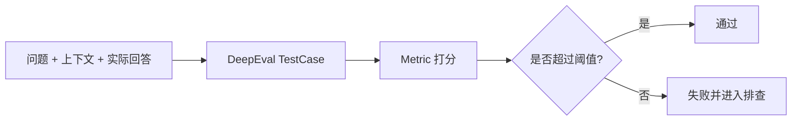
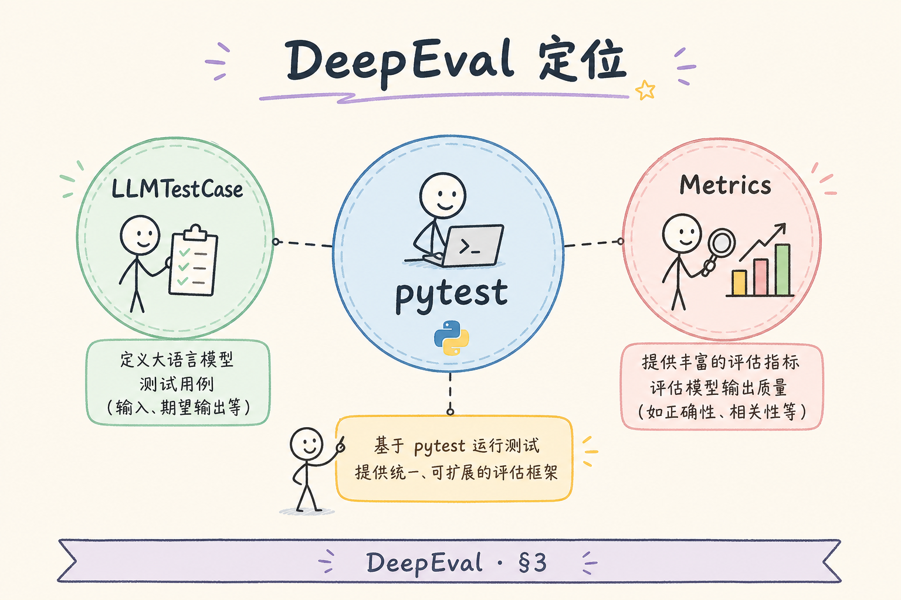
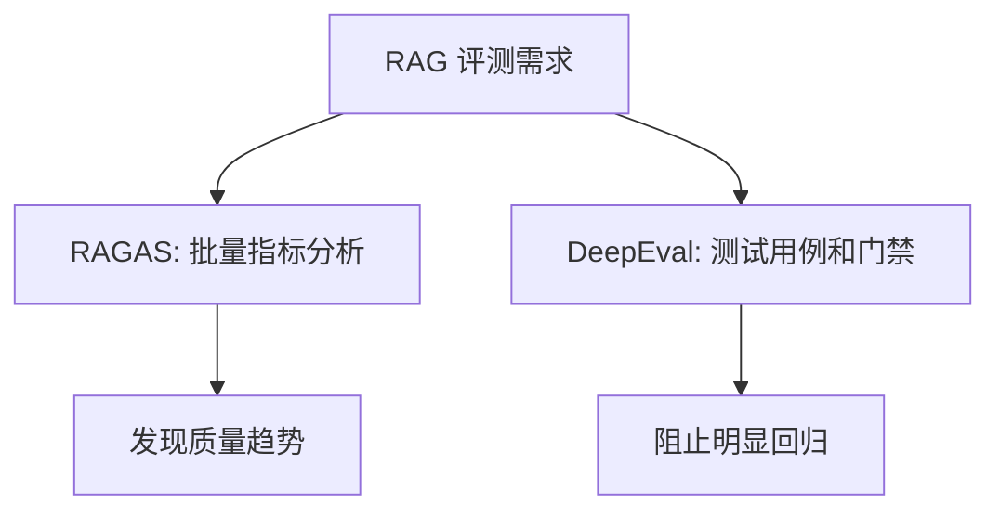
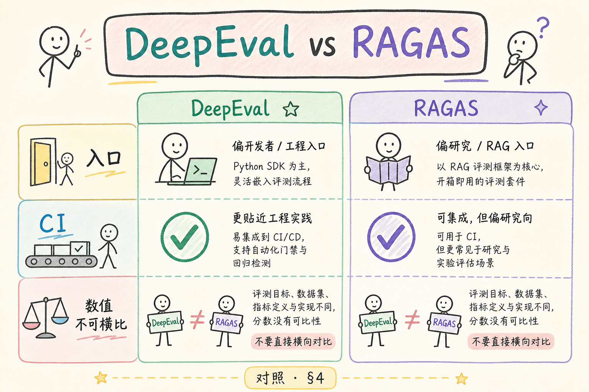
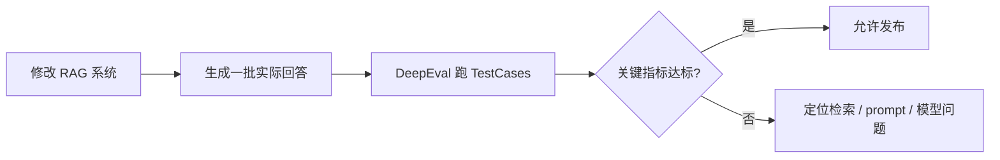

# E 评测与观测（七）：DeepEval 入门指南

做 RAG 评测时，很多团队先接触 RAGAS，然后又看到 DeepEval。初学者容易困惑：为什么还需要另一个评测库？DeepEval 要解决的核心问题是把 LLM 应用评测写成更像测试用例的形式，让你能在本地、CI 或回归流程里反复检查回答质量。

本文面向刚开始做 RAG 评测的读者。读完后，你应该能理解 DeepEval 是什么、它和 RAGAS 的关系、Metric 与 LLMTestCase 如何配合，并能写出一个最小的评测用例骨架。

## 目录

- [1. 为什么需要 DeepEval](#1-为什么需要-deepeval)
- [2. DeepEval 是什么](#2-deepeval-是什么)
- [3. 它和 RAGAS 的关系](#3-它和-ragas-的关系)
- [4. Metric 与 LLMTestCase](#4-metric-与-llmtestcase)
- [5. 最小评测示例](#5-最小评测示例)
- [6. 如何用于 RAG 回归测试](#6-如何用于-rag-回归测试)
- [7. 阈值、成本与稳定性](#7-阈值成本与稳定性)
- [8. 常见错误](#8-常见错误)
- [9. FAQ](#9-faq)
- [10. 总结](#10-总结)

## 1. 为什么需要 DeepEval

传统单元测试很擅长判断“函数输出是否等于某个值”。但 LLM 应用的答案往往不是固定字符串。你更关心的是：答案是否相关，是否基于上下文，是否遗漏关键点，是否包含有害内容。

DeepEval 的价值是把这些质量判断包装成测试用例。你可以像跑测试一样跑评测，把结果接入 CI 或发布前检查。



这张图说明：DeepEval 不是替代人工判断，而是把可重复检查的质量项自动化。

## 2. DeepEval 是什么

**DeepEval**：一个用于评测 LLM 应用的测试框架。通俗说，它让你把“这条回答好不好”写成可运行的测试。

DeepEval 通常围绕三类对象工作：

| 概念 | 白话解释 | 例子 |
|---|---|---|
| TestCase | 一条待评测样本 | 输入、实际输出、上下文 |
| Metric | 评分规则 | Faithfulness、Answer Relevancy |
| Threshold | 通过线 | 分数低于 0.7 就失败 |

它适合用于回归测试：当你换检索策略、prompt、模型或切分参数后，用同一批测试集看看质量有没有下降。

## 3. 它和 RAGAS 的关系

RAGAS 更像一组专门面向 RAG 的指标集合，DeepEval 更像一个通用评测和测试框架。两者关注点有重叠，但使用方式不同。

| 对比点 | RAGAS | DeepEval |
|---|---|---|
| 侧重点 | RAG 指标 | 测试框架和多类指标 |
| 使用形态 | 数据集评估 | TestCase + Metric |
| 常见场景 | 批量评估 RAG 质量 | CI、回归、单样本测试 |
| 初学者理解 | “算一批指标” | “写质量测试” |





实际项目可以同时使用两者：用 RAGAS 做离线分析，用 DeepEval 做发布前回归门禁。

## 4. Metric 与 LLMTestCase

**Metric** 是评分规则。比如 Answer Relevancy 关注答案是否回应了问题，Faithfulness 关注答案是否被上下文支持。



**LLMTestCase** 是一条评测样本。它通常包含：

| 字段 | 含义 |
|---|---|
| `input` | 用户问题 |
| `actual_output` | 系统实际回答 |
| `expected_output` | 可选的参考答案 |
| `retrieval_context` | RAG 检索到的上下文 |

一个 TestCase 不一定要有标准答案。很多 RAG 指标可以基于问题、上下文和实际回答做判断。但如果你有 golden dataset，加入 expected_output 会更稳。

## 5. 最小评测示例

下面是一个 DeepEval 风格的最小示例。不同版本的导入路径可能变化，学习时重点看结构：准备 TestCase，选择 Metric，执行评测。

安装依赖：

```bash
pip install deepeval
```

示例代码：

```python
from deepeval import evaluate
from deepeval.metrics import AnswerRelevancyMetric, FaithfulnessMetric
from deepeval.test_case import LLMTestCase

test_case = LLMTestCase(
    input="上传文件后为什么不能马上问答？",
    actual_output="因为文件上传后还要解析、切分、向量化并写入知识库。",
    retrieval_context=[
        "上传成功只表示文件已保存，后台索引完成后才可问答。"
    ],
)

metrics = [
    AnswerRelevancyMetric(threshold=0.7),
    FaithfulnessMetric(threshold=0.7),
]

evaluate(test_cases=[test_case], metrics=metrics)
```

这段代码展示了评测闭环：问题、回答、上下文进入测试用例，指标负责判断回答质量是否过线。

## 6. 如何用于 RAG 回归测试

DeepEval 最适合做回归门禁。你可以把关键问题整理成测试集，每次改检索、prompt 或模型后都跑一遍。



建议先从 20 到 50 条关键问题开始，不要一上来追求几千条。早期测试集要覆盖最重要、最容易出错、最影响用户信任的问题。

## 7. 阈值、成本与稳定性

LLM 评测通常会调用模型做裁判，因此有成本和波动。阈值不能随便设得过高，否则会出现大量不稳定失败。

| 问题 | 建议 |
|---|---|
| 阈值太高 | 从 0.7 或业务可接受线开始 |
| 评测成本高 | 先跑关键集，再跑全量集 |
| 结果波动 | 固定评测模型和参数 |
| 失败难排查 | 保存问题、上下文、回答和分数 |

如果某条用例经常忽高忽低，不要急着删掉。先检查问题是否模糊、上下文是否不足、评分标准是否不清。

## 8. 常见错误

第一个错误是把 DeepEval 分数当绝对真理。自动评测是辅助信号，不是最终裁判。关键场景仍要人工抽查。

第二个错误是没有保存输入和上下文。只保存分数无法排查问题，至少要记录问题、检索结果、回答和指标分。

第三个错误是测试集太泛。比如只有“介绍一下产品”这类宽泛问题，很难发现真实回归。测试集应该覆盖具体业务风险。

第四个错误是每次换系统又换测试集。回归测试的核心是同一批问题反复跑，才能比较变化。

## 9. FAQ

**Q：DeepEval 能替代人工评审吗？**  
不能。它适合自动发现明显问题和趋势，人工仍要负责关键质量判断。

**Q：没有 expected_output 能评测吗？**  
可以。很多指标依赖 input、actual_output 和 retrieval_context。但有参考答案会更利于稳定评估。

**Q：CI 里跑 DeepEval 会不会太慢？**  
可能会。可以分层：PR 跑小集合，夜间跑全量集合。

**Q：DeepEval 和 RAGAS 选哪个？**  
如果你想做 RAG 指标分析，可以先用 RAGAS；如果你想把质量检查写进测试和门禁，DeepEval 更合适。两者可以并用。

## 10. 总结

DeepEval 的核心价值是把 LLM 应用质量写成可运行测试。它让 RAG 系统在改 prompt、换模型、调检索后，有一套可重复的回归检查。


初学者可以先准备一小批关键问题，用 Answer Relevancy 和 Faithfulness 这类基础指标跑起来。先形成“改动后必测”的习惯，再逐步扩展指标和测试集。
