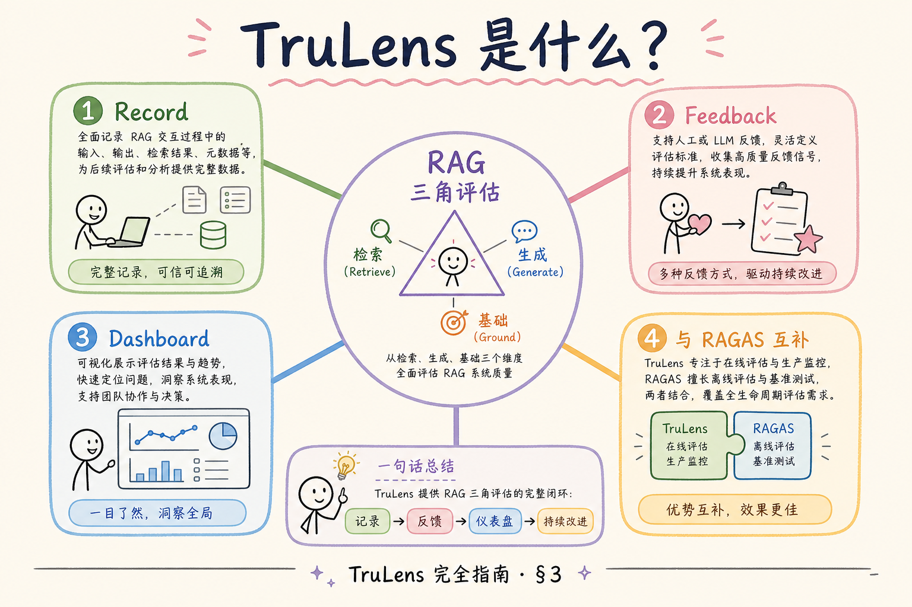
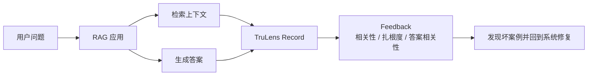
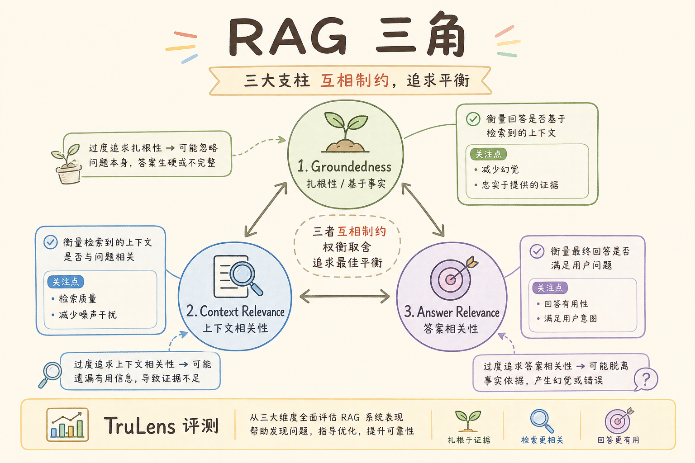
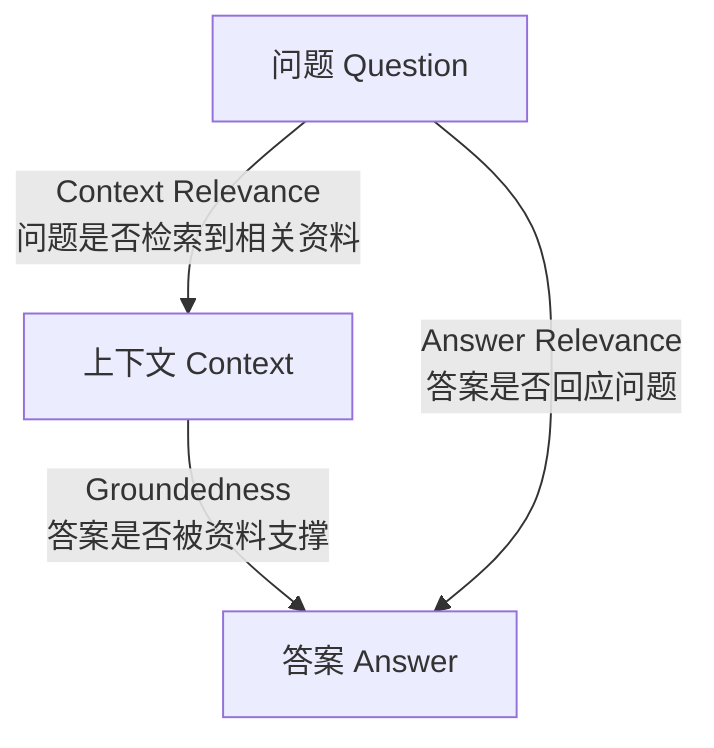
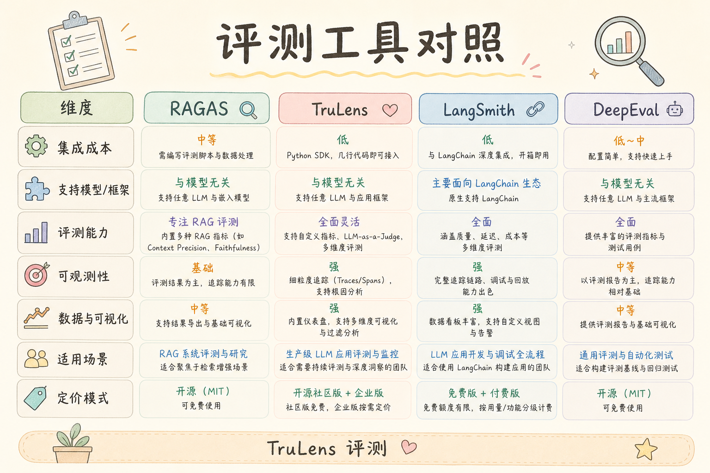
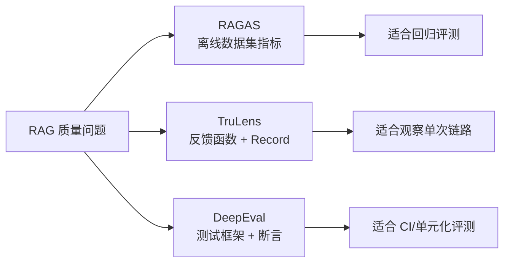
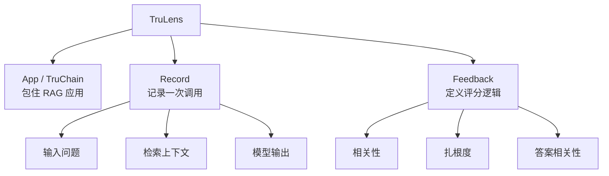

# E 评测与观测（八）：TruLens 反馈驱动评估完全指南

> [141 RAGAS Faithfulness](141.ragas-faithfulness-tutorial.md) 教你 **离线算分**；[145 DeepEval](145.deepeval-tutorial.md) 把 pytest 式断言接进 CI。还有一类工具强调 **「每次调用都可评」**——在真实链路上挂 **反馈函数（Feedback Functions）**，把检索、生成拆成可解释的三角关系。 **TruLens** 就是这样一套 **RAG 三角评估** 框架：Context Relevance、Groundedness、Answer Relevance。这篇是 [企业 RAG 路线图](ENTERPRISE_RAG_ROADMAP.md) **E 模块了解篇**（路线图第 **163** 条），定位 **「知道有这把尺子、会最小集成」**；主线排障仍靠 [147 LangSmith](147.langsmith-tracing-tutorial.md)、[148 Langfuse](148.langfuse-observability-tutorial.md) 与 149～152 bad case 系列。前置：[158 Faithfulness](141.ragas-faithfulness-tutorial.md)、[160 Golden Dataset](143.golden-dataset-tutorial.md)。

---

## 目录

1. [前言：离线分数之外，还要「在线反馈」](#1-前言离线分数之外还要在线反馈)
2. [本文边界与动手路径](#2-本文边界与动手路径)
3. [TruLens 是什么](#3-trulens-是什么)
4. [RAG 三角：三个反馈在量什么](#4-rag-三角三个反馈在量什么)
5. [与 RAGAS、DeepEval 的分工](#5-与-ragasdeepeval-的分工)
6. [核心对象：App、Record、Feedback](#6-核心对象apprecordfeedback)
7. [最小集成：给 LangChain 链挂 TruLens](#7-最小集成给-langchain-链挂-trulens)
8. [用 LLM 当评判员：成本与护栏](#8-用-llm-当评判员成本与护栏)
9. [先错对对：四种典型翻车](#9-先错对对四种典型翻车)
10. [从分数到 bad case 工单](#10-从分数到-bad-case-工单)
11. [综合概念地图](#11-综合概念地图)
12. [常见陷阱与 FAQ](#12-常见陷阱与-faq)
13. [总结与系列下一步](#13-总结与系列下一步)

---

## 1. 前言：离线分数之外，还要「在线反馈」

周报里 RAGAS Faithfulness 从 0.82 升到 0.85，产品经理却仍能随手截一张图：**「机器人说报销上限 800，手册写 500。」** 离线集没覆盖这句口语问法，或者 **检索其实漏了**，Faithfulness 在「空上下文胡编」与「有上下文歪曲」之间 **分不清责任**。

TruLens 的切入点是 **RAG Triad（RAG 三角）**：

1. **上下文是否相关**（Context Relevance）——检索有没有找对方向；  
2. **回答是否扎根上下文**（Groundedness / Ground Truth Agreement）——生成有没有瞎编；  
3. **回答是否切题**（Answer Relevance）——答的是不是用户问的。

**TruLens**：开源评估框架，在应用运行时记录 LLM 应用调用，并用 **反馈函数** 对中间产物（检索结果、提示、答案）自动打分或打标签。  
通俗说：**给 RAG 链路装三个「课后小测」，每道题问不同环节。**

**读完本文，你应该能做到：**

1. 画出 RAG 三角三边分别对应链路哪一步。  
2. 说明 TruLens 与 RAGAS batch 评测的 **互补关系**。  
3. 完成 §7 最小 `TruChain` / `TruApp` 集成（概念 + 伪代码可跑）。  
4. 识别 §9 四种翻车：评判模型与生产模型相同、全量评判成本、把分数当 KPI 不看分布、无金标校准。  
5. 把低 Groundedness 记录对接到 [152 胡编归因](152.bad-case-hallucination-tutorial.md) 工单模板。

### 1.1 E 模块位置

先把 TruLens 放回路线图中看：它不是第一天就必须掌握的框架，但它能帮助你把线上样本按质量问题分桶。

```text
156～159 RAGAS 四指标
160 Golden Dataset · 161 回归集
162 DeepEval · 163 TruLens ← 本篇（了解）
164 LangSmith · 165 Langfuse
166～169 Bad Case 归因四篇
170 A/B · 171 参数版本
```

### 1.2 术语双轨速查

| 中文 | English | 一句话 |
|------|---------|--------|
| 反馈函数 | Feedback Function | 对某步输出打分的可复用规则 |
| 记录 | Record | 一次调用的完整轨迹 |
| 扎根度 | Groundedness | 答案是否被上下文支撑 |
| 评判 LLM | Judge LLM | 用来打分的另一个模型 |
| 三角 | RAG Triad | 检索-扎根-切题三边 |

---

## 2. 本文边界与动手路径

**档位：E 了解篇（路线图 163）。**

**本文讲：** TruLens 定位、RAG 三角、与 RAGAS/DeepEval 对照、最小集成、评判成本、对接 bad case。  
**本文不讲：** TruLens 全部 Dashboard 源码、私有化部署高可用、替代完整 MLOps 平台。

### 2.1 动手路径表

| 步骤 | 你做什么 | 验收 |
|------|----------|------|
| A | 读 §4 三角图 | 白板能画三边 |
| B | `pip install trulens-eval` | 环境 OK |
| C | 跟做 §7 最小链 | 产生 1 条 Record |
| D | 看 Groundedness 低的一条 | 写出归因假设 |
| E | 对照 §5 选型表 | 团队 wiki 一段 |

**环境：** Python 3.10+；可选 OpenAI API（评判 LLM）；有 LangChain 更佳。

### 2.2 沿用前文

| 概念 | 来自 |
|------|------|
| Faithfulness | [141 RAGAS Faithfulness](141.ragas-faithfulness-tutorial.md) |
| 金标 | [160 Golden Dataset](143.golden-dataset-tutorial.md) |
| 幻觉归因 | [33 幻觉](33.llm-hallucination-tutorial.md)、[152 篇](152.bad-case-hallucination-tutorial.md) |
| 检索漏 | [151 篇](151.bad-case-retrieval-miss-tutorial.md) |
| 链路追踪 | [147 LangSmith](147.langsmith-tracing-tutorial.md) |

---

## 3. TruLens 是什么

读下图时，先看「TruLens RAG 三角是什么」想表达的主线：它把本节的概念关系压缩成一张可对照的图。



下面这张图把 TruLens 的作用放回 RAG 链路里看。读图时重点看：TruLens 不替你生成答案，而是在每次问答后记录过程，并用反馈函数给关键环节打分。



结论是：TruLens 更像一台评测记录仪。它把一次回答拆开看，让你知道问题出在检索、上下文还是生成。

对照上图：

- **应用包装**：把你的 RAG 链包成 `TruApp` / `TruChain`，自动 **记录** 输入、检索结果、提示、输出；  
- **反馈层**：在 Record 上跑 **Feedback Functions**——可用 **启发式**（长度、包含关系）或 **LLM 评判**；  
- **可视化**：本地或 TruLens Dashboard 浏览 **低分样本**；  
- **定位**：不是向量库、不是观测全栈——是 **「评估透镜」** 叠在现有链上。

### 3.1 为什么叫「反馈驱动」

传统评测：**跑完一批 Excel 再看分**。TruLens 强调 **每次用户问话** 都可产生 **可追踪反馈**，适合：

- PoC 期快速看 **哪类问题三角失衡**；  
- 与 [147/148 观测](147.langsmith-tracing-tutorial.md) 并用：trace 看 **时序**，TruLens 看 **质量三角**。

### 3.2 了解档也要会「最小一条链」

面试常问：「你们怎么知道 RAG 坏了？」只答 RAGAS 不够——要说 **在线采样 + 三角分桶**。本篇最小集成就是为此准备。

---

## 4. RAG 三角：三个反馈在量什么

读下图时，先看「RAG 三角三边」想表达的主线：它把本节的概念关系压缩成一张可对照的图。



下面这张图把 RAG 三角拆成三条边。读图时重点看：三个分数不是重复指标，而是分别检查“问题、资料、答案”之间的关系。



如果 Context Relevance 低，先查检索；如果 Groundedness 低，查 prompt 和引用；如果 Answer Relevance 低，查问题理解和生成约束。

对照上图可以得出一个实用结论：先确认「RAG 三角三边」里的主流程，再去调整具体参数或实现细节。

### 4.1 Context Relevance（上下文相关性）

**问**：检索回来的 chunk，和用户问题 **同一主题吗**？  
**低分典型**：问「年假」，检索到「差旅报销」——后面生成再流利也 **救不了**。  
**对接**：[151 检索遗漏/误召](151.bad-case-retrieval-miss-tutorial.md)、[93 混合检索](93.hybrid-search-tutorial.md)。

### 4.2 Groundedness（扎根度 / 忠实度）

**问**：答案里的 **事实陈述** 能否在上下文里找到支撑？  
**低分典型**：上下文写「10 天」，答案说「15 天」——[33 幻觉](33.llm-hallucination-tutorial.md) 里的 **忠实性胡编**。  
**对接**：[141 Faithfulness](141.ragas-faithfulness-tutorial.md)、[152 篇](152.bad-case-hallucination-tutorial.md)。

### 4.3 Answer Relevance（答案相关性）

**问**：最终回答 **有没有答非所问**？  
**低分典型**：问「如何申请」，答了一堆「年假历史沿革」——检索可能对，但 **生成跑题**。

### 4.4 三角失衡决策速查

| 低分边 | 优先怀疑 | 先查 trace 哪段 |
|--------|----------|----------------|
| Context Relevance | 检索、改写、索引 | `retriever` spans |
| Groundedness | 生成、提示、上下文截断 | `llm` + prompt |
| Answer Relevance | 提示模板、多轮历史 | `prompt` + history |

---

## 5. 与 RAGAS、DeepEval 的分工

读下图时，先看「TruLens vs RAGAS vs DeepEval」想表达的主线：它把本节的概念关系压缩成一张可对照的图。



下面用一张对照图说明三个工具的分工。读图时重点看：它们不是互斥关系，而是偏向不同使用场景。



初学者可以这样记：RAGAS 像成绩单，TruLens 像诊断记录，DeepEval 像自动化测试。

| 维度 | RAGAS | DeepEval | TruLens |
|------|-------|----------|---------|
| 典型场景 | 离线 batch 金标 | CI 断言 | 在线/近线反馈 |
| 指标 | CP/CR/Faith/AR | 多种 metric 类 | RAG 三角 + 自定义 |
| 集成 | 数据集脚本 | pytest | 包装 App/Chain |
| 成本 | 评判 LLM 批跑 | 同左 | 可按采样控制 |
| 强项 | 论文对齐、汇报 | 门禁 | 三角归因直觉 |

**建议组合**：

1. [160 金标](143.golden-dataset-tutorial.md) + RAGAS **定版本基线**；  
2. DeepEval **挡回归**；  
3. TruLens **抽样看三角分布**；  
4. [147/148](147.langsmith-tracing-tutorial.md) **下钻单次请求**。

---

## 6. 核心对象：App、Record、Feedback
TruLens 的三个核心对象可以按“应用、一次调用、评价指标”理解：App 包住你的 RAG 流程，Record 记录一次真实运行，Feedback 用规则或模型给这次运行打分。先理解这三层，后面的追踪和评估才不会混在一起。

### 6.1 TruApp / TruChain

包装现有可调用对象。LangChain 用户常用 `TruChain`；纯函数用 `TruApp`。包装后 **不改业务逻辑**，只多 **记录与可选反馈**。

### 6.2 Record

一次端到端调用产物：`input`、`output`、中间 `calls`（检索列表、提示文本等）。是 **bad case 复盘的原子单位**。

### 6.3 Feedback Function

签名形如：给定 Record 的某些字段 → 返回 **0～1 分数** 或 **布尔** + **理由文本**（若用 LLM 评判）。可内置 `f_context_relevance`、`f_groundedness` 等，也可自定义。

### 6.4 数据落盘

本地默认 SQLite + 可选导出。企业若已有 [148 Langfuse](148.langfuse-observability-tutorial.md)，可 **双写**：trace 在 Langfuse，三角分在 TruLens——或逐步统一到一家。

---

## 7. 最小集成：给 LangChain 链挂 TruLens

```python
# 概念示例：版本以 trulens-eval 官方文档为准
from trulens.core import TruSession
from trulens.apps.langchain import TruChain
from trulens.core import Feedback
from langchain_openai import ChatOpenAI
from langchain_core.prompts import ChatPromptTemplate
from langchain_core.output_parsers import StrOutputParser

# 假设已有 retriever
prompt = ChatPromptTemplate.from_messages([
    ("system", "仅根据上下文回答。上下文：{context}"),
    ("human", "{question}"),
])

chain = (
    {"context": retriever, "question": lambda x: x["question"]}
    | prompt
    | ChatOpenAI(model="gpt-4o-mini")
    | StrOutputParser()
)

session = TruSession()
tc = TruChain(chain, app_name="handbook_rag", app_version="v0.1.0")

# 注册反馈（示意）
# f_groundedness = Feedback(...).on_output().on(context=...)
# tc.add_feedback(f_groundedness)

with tc as recorder:
    answer = recorder.invoke({"question": "年假有多少天？"})

# 在 TruLens UI 或 session 中查看 recorder 对应 Record
print(answer)
```

**验收**：同一问题跑两次，Record 数 +1；能在 UI 看到 **检索列表与最终答案**。

### 7.1 无 LangChain 时

用 `TruApp` 包装 Python 函数：函数内手写 `retrieve → prompt → llm`，TruLens 同样记录 **只要你在包装内调用**。

### 7.2 与观测 trace 对齐

给 `invoke` 传入与 [147 LangSmith](147.langsmith-tracing-tutorial.md) 相同的 `run_id` / `metadata`（若框架支持），方便 **三角低分 → 点 trace**。

---

## 8. 用 LLM 当评判员：成本与护栏
这一节不再只看功能是否能跑，而是补上成本、风险和验收标准，帮助你判断方案能不能进入真实项目。

### 8.1 评判模型选择

选择 judge 模型时先看稳定性和成本，再看它是否足够聪明。它的任务是按规则打分，不是替生产模型重新回答一次问题。

- **不必与生产模型相同**；常用 **便宜 + 稳定** 的模型做 judge；  
- 评判 prompt 要 **短、结构化输出**（JSON 分数 + 一句理由）；  
- 与 [29 采样](29.llm-sampling-tutorial.md) 一样，judge 用 **低 temperature**。

### 8.2 采样策略

全量评判 = 成本翻倍。生产建议：

- 新上线 **前 7 天 20% 采样**；  
- 稳定后 **5%**；  
- **用户点踩 / 低置信** 强制全评。

### 8.3 评判本身会错

定期用 [160 金标](143.golden-dataset-tutorial.md) 校准：**人标三角 vs 机器三角** 的一致性。偏差大则改 judge prompt 或换 judge 模型。

---

## 9. 先错对对：四种典型翻车
下面的错法适合当排障清单看：它们不是语法问题，而是会让评估、追踪或坏例分析失去证据链，最后只能靠猜测定位问题。

### 9.1 错：三角低分一律怪模型

**对**：先看 Context Relevance——多数「胡编」是 **检索空或偏**（[151](151.bad-case-retrieval-miss-tutorial.md)）。

### 9.2 错：评判与生产用同一模型且同 prompt

**对**：评判独立模型；避免 **自我背书**。

### 9.3 错：把平均分写进 OKR 不看 P95

**对**：看 **低分尾部分布** 与 **按意图分桶**（报销类、年假类）。

### 9.4 错：没有 Record 保留策略

**对**：低分 Record **保留 90 天**；高分可只留聚合。对齐 [171 参数版本](154.param-version-management-tutorial.md) 知道当时 `top_k`、chunk 策略。

---

## 10. 从分数到 bad case 工单

推荐工单字段：

| 字段 | 来源 |
|------|------|
| `trace_id` | LangSmith / Langfuse |
| `question` | Record input |
| `low_feedback` | 如 groundedness < 0.5 |
| `top_chunk_ids` | 检索结果 |
| `hypothesis` | 149～152 决策树 |
| `param_version` | [171 篇](154.param-version-management-tutorial.md) |

每周例会：**按三角哪边低分最多排优先级**——Context 低分周优先搞检索与 [93 混合](93.hybrid-search-tutorial.md)；Groundedness 低分周优先搞提示与 [112 拒答](112.refusal-strategy-tutorial.md)。

---

## 11. 综合概念地图

读下图时，先看「TruLens 概念地图」想表达的主线：它把本节的概念关系压缩成一张可对照的图。


下面这张概念地图把本文关键对象串起来。读图时重点看：App、Record、Feedback 是最小三件套。



掌握这张图后，再看 TruLens 的代码示例会清楚很多：先包应用，再记录调用，最后看反馈分数。

```text
用户问题
  → TruApp 记录
  → 检索 chunks ──→ Context Relevance
  → 拼 prompt
  → LLM 答案 ──→ Groundedness + Answer Relevance
  → 低分样本 → bad case 工单 → 149～152 / A/B
```

---


## 12. 常见陷阱与 FAQ
最后用 FAQ 把观测和评估拉回日常使用。真正要检查的是：一次回答能不能被追踪、能不能被打分、能不能定位到具体失败环节。

### 12.1 初学者最常踩的三坑

如果你刚接触观测和评估，先避开下面三类误区。它们都会让 TruLens 分数失去排障价值。

1. **只看最终答案，不看链路**——TruLens 的价值在 **可复现的中间态**。  
2. **没有金标就调参**——没有 [160 Golden Dataset](143.golden-dataset-tutorial.md) 时，A/B 只是 **主观吵架**。  
3. **工具买了不用**——装了 LangSmith/Langfuse 却不给每次请求打 `trace_id`，等于 **黑盒上线**。

### 12.2 FAQ 精选

**Q1：PoC 阶段要不要上观测？**  
要。**最小集**：`request_id` + 检索 Top-5 `chunk_id` + 模型名 + 延迟。完整平台可后补，但 **字段契约** 第一天就定。

**Q2：和 RAGAS 指标怎么配合？**  
RAGAS 回答 **「好不好」**；观测平台回答 **「哪一步坏了」**。建议：金标跑 RAGAS 批次，线上 bad case 用 trace 下钻。

**Q3：成本会不会爆？**  
Trace 存全文 context 很贵。生产用 **采样**（如 5%）+ **摘要字段**（chunk_id、score、前 200 字预览），全文按需拉取。

**Q4：多环境怎么隔离？**  
`project` / `environment` 标签：`dev` / `staging` / `prod` 分开；**禁止** 把 prod trace 当训练数据未经脱敏。

**Q5：谁负责看板？**  
工程搭管道，**产品 + 领域专家** 每周过 bad case；研发负责 **归因到模块**（解析/切块/检索/生成）。

**Q6：失败请求要不要记 trace？**  
**更要记**。超时、空检索、解析异常——没有失败 trace，你永远在猜。

**Q7：和 [147 LangSmith](147.langsmith-tracing-tutorial.md) / [148 Langfuse](148.langfuse-observability-tutorial.md) 二选一？**  
LangChain 深度用 LangSmith 顺手；要 **自托管、开源、多框架** 看 Langfuse。也可 **双写** 过渡期，但统一 `trace_id`。

**Q8：如何证明一次修复有效？**  
回归集 [161](144.regression-test-set-tutorial.md) 上 **同题同参** 对比；再看线上 **7 日 bad case 率**。

**Q9：实习生能维护吗？**  
把 **归因决策树** 贴在 wiki（本篇系列 149～152）；观测 UI 只读权限给全员，写权限限研发。

**Q10：面试怎么讲？**  
30 秒：**「RAG 上线后我用 trace 把 bad case 分到 ingest/retrieve/generate，用金标 + A/B 验证改动，参数版本可回滚。」**

**Q11：TruLens 能替代 Langfuse 吗？**  
不能。TruLens 强在 **RAG 三角评估**；Langfuse 强在 **全链路 trace、成本、多框架观测**。生产常见 **组合使用**。
## 13. 总结与系列下一步
最后把本篇的关键判断整理成清单，方便你回头复习，也方便继续阅读系列里的下一篇。

### 13.1 本篇要点回顾

本篇是 [企业 RAG 路线图](ENTERPRISE_RAG_ROADMAP.md) **E 模块** 的一环。E 模块主线是：**先有金标与指标 → 再有观测 → 再会归因 bad case → 再用实验与版本管理迭代**。

### 13.2 系列下一步

读完 TruLens 后，下一步要把分数和真实链路连起来。下面这几篇分别补上 trace、观测、坏例归因和实验验证。

| 目标 | 阅读 |
|------|------|
| LangSmith 链路追踪 | [147 LangSmith](147.langsmith-tracing-tutorial.md) |
| Langfuse 观测 | [148 Langfuse](148.langfuse-observability-tutorial.md) |
| Bad Case：解析 | [149 解析归因](149.bad-case-parsing-tutorial.md) |
| A/B 实验 | [153 A/B](153.ab-experiment-rag-tutorial.md) |

### 13.3 学习目标自检

这一节用于检查你是否已经把 TruLens 当成“质量分桶工具”，而不是只把它当成一个看板。

- [ ] 能口述本篇在 E 模块中的位置  
- [ ] 能列出至少三个与前序文章的衔接点  
- [ ] 能完成一篇中的「动手路径」验收  
- [ ] 能在观测 UI 或日志里找到一次完整 RAG trace  
- [ ] 能把一个真实 bad case 写到归因树的一叶子上  

### 13.4 面试 30 秒版

见 §12 FAQ Q10。

### 13.5 30 分钟作业

1. 选一条你项目里的 **真实用户问题**；  
2. 在 LangSmith 或 Langfuse（或最小 JSON 日志）里拉出 **完整 trace**；  
3. 用 149～152 决策树写 **归因假设**；  
4. 写一条 **可验证的修复实验**（对接 [170 A/B](153.ab-experiment-rag-tutorial.md)）；  
5. 在 [171 参数版本](154.param-version-management-tutorial.md) 表里登记本次改动的参数。

---

> **初学者可能仍困惑的点**  
> - **观测 ≠ 评测**：前者定位，后者打分。  
> - **了解档** 也要会 **最小集成**，否则面试说不清。  
> - Bad case 系列要 **交叉验证**：解析错会像检索漏，生成胡编有时是检索空。  
> - 任何改动 **必须可回滚**——见参数版本篇。


### 13.6 TruLens 深度补充：反馈函数编写要点

**Context Relevance** 反馈可检查：检索 chunk 与用户问题的 **主题重叠**——用 LLM judge 时 prompt 写清「仅判断主题是否相关，不判断答案正确性」。**Groundedness** 要把 **答案句子** 与 **上下文句子** 做 entailment 判断；企业场景建议 **按句拆分** 再聚合分数，避免长答案一句胡编拉低整段平均。**Answer Relevance** 要对照 **用户原问**，不是对照改写后的检索 query。

**Dashboard 使用**：按 `app_version` 筛选（对接 [171 param_version](154.param-version-management-tutorial.md)）；导出 CSV 与 [160 金标](143.golden-dataset-tutorial.md)  join。低分 Record 自动生成 Jira 标题模板：`[RAG][TruLens][groundedness<0.5] {question前30字}`。

**与 CI**：TruLens 不适合替代 [145 DeepEval](145.deepeval-tutorial.md) 门禁，但可在 **staging** 环境 **100% 评判** 跑一夜，筛明日上线风险。


## 14. TruLens 团队落地细则

TruLens 在团队里的最佳角色是 **「在线抽样质检员」**，而不是取代 [141 Faithfulness](141.ragas-faithfulness-tutorial.md) 的离线考官。建议周一早上由算法同学导出上周 **Groundedness 最低二十条** Record，和产品、领域专家过一遍，每条用两分钟定责：是检索偏了、上下文被截断了，还是模型无视资料。

集成时务必把 **app_version** 与 [171 参数版本](154.param-version-management-tutorial.md) 对齐，否则你无法回答「这周分数下降是不是因为换了 chunk 策略」。评判 LLM 建议与生产模型 **不同厂商或不同尺寸**，避免「自己给自己满分」。评判 temperature 固定为 0，输出强制 JSON，理由字段限制在一百字内，防止评判员话太多拖慢流水线。

Context Relevance 低分时，不要急着训 Embedding，先到 [147 LangSmith](147.langsmith-tracing-tutorial.md) 看 Top-K 是否主题跑偏；Answer Relevance 低分时，检查 [110 Prompt](110.rag-prompt-template-tutorial.md) 是否要求「详尽背景介绍」导致跑题。Groundedness 低分且上下文含 gold 句时，转入 [152 胡编归因](152.bad-case-hallucination-tutorial.md)。

PoC 阶段可 100% 评判，生产建议 5% 采样，用户点踩必评。低分 Record 保留九十天，与 bad case 工单同库。面试回答 TruLens：强调 **RAG 三角**、与 RAGAS 互补、低分驱动 149～152 归因，而非「我们又多了一个看板」。


## 15. 与观测平台联调

Record 与 trace 用同一 **request_id** 互链，方便从三角分数跳到检索原文。若只用 TruLens 不用 LangSmith/Langfuse，至少自研日志要有 **chunk 预览**。

每周对比：RAGAS Faithfulness 批次均值 vs TruLens Groundedness 抽样均值，差距过大说明 **评判 prompt 需校准** 或金标与线上分布脱节。

DeepEval 挡 CI，TruLens 看线上尾部，RAGAS 报版本基线——三者混用是成熟团队常态，而非工具堆砌。


## 16. 练习与自检

动手一：用 TruChain 包装现有 RAG，跑十条金标，导出 Groundedness 最低三条，写归因。动手二：画 RAG 三角白板给同事。动手三：写评判 JSON prompt 十行版。

自检：能否说清三角低分各对应 149～152 哪一篇？能否解释 TruLens 与 [145 DeepEval](145.deepeval-tutorial.md) 边界？能否在 Record 里找到检索列表？

常见误区：把 Answer Relevance 低当成检索问题；全量评判不控成本；评判与生产同模型；无 app_version 无法对照 [170 实验](153.ab-experiment-rag-tutorial.md)。

与 C4/C5 衔接：检索质量见 [93](93.hybrid-search-tutorial.md)，生成质量见 [33](33.llm-hallucination-tutorial.md)，版本见 [171](154.param-version-management-tutorial.md)。E 模块闭环离不开观测 [147](147.langsmith-tracing-tutorial.md)。

## 17. 从零到一的 TruLens 周计划

**周一**：安装 trulens-eval，阅读官方 RAG Triad 文档，对照本篇 §4 画三角图。**周二**：用 TruChain 包装现有 PoC 链，不开评判，只确认 Record 落库。**周三**：加 Groundedness 反馈，用十条金标人工核对评判是否靠谱。**周四**：与 [147 LangSmith](147.langsmith-tracing-tutorial.md) 互写 request_id，在 UI 两侧能跳转。**周五**：例会过最低分十条，尝试归因到 [151 检索](151.bad-case-retrieval-miss-tutorial.md) 或 [152 胡编](152.bad-case-hallucination-tutorial.md)。

第二周目标：把三角低分桶做成看板四象限：Context 低、Groundedness 低、Answer 低、多边低。多边低往往是 **系统性 prompt 问题** 或 **资料库整体过期**（[48 文档版本](48.doc-versioning-tutorial.md)）。Context 单低说明 **检索链路** 要优先于生成调参。Answer 单低可能是 **多轮历史** 干扰（[118 历史](118.multi-turn-history-tutorial.md)），需结合 [109 对话增强](109.conversation-query-enhancement-tutorial.md)。

TruLens 评判成本估算：假设每条评判消耗五百评判 token，一万条/月全量评判 ≈ 五百万 token，PoC 可接受，生产必须采样。用户点踩、Faithfulness 自动评低于阈值、随机抽样三股合并，通常能把评判量压在 **真实请求量的百分之五到十五**。

与面试官对话：「我们离线用 RAGAS 守版本，CI 用 DeepEval 挡回归，线上用 TruLens 三角抽样发现检索-生成断裂，再用 LangSmith trace 下钻到 chunk。」——这条链路比单点工具更能体现 **E 模块整体观**。

扩展阅读：RAGAS 四指标 [156～159](139.ragas-context-precision-tutorial.md)；混合检索 [93](93.hybrid-search-tutorial.md)；拒答 [112](112.refusal-strategy-tutorial.md)；参数版本 [171](154.param-version-management-tutorial.md)。TruLens 是了解档，但 **最小集成** 是面试与周会的基础动作，不可只会 PPT。

## 18. 综合案例：报销上限三角失衡

**背景**：员工问「一线城市住宿能报多少」，TruLens 显示 Context Relevance 0.35、Groundedness 0.4、Answer Relevance 0.7。**Record 显示** 检索 Top-3 全是差旅交通补贴，无住宿费 chunk。**归因**：[151 检索遗漏](151.bad-case-retrieval-miss-tutorial.md)，非生成胡编。**trace**（[147 LangSmith](147.langsmith-tracing-tutorial.md)）复现：dense 未命中「住宿费」口语。**修复**：开 [93 hybrid](93.hybrid-search-tutorial.md) + [100 改写](100.query-rewriting-tutorial.md)，新 pv 登记 [171](154.param-version-management-tutorial.md)。**一周后** Context Relevance 升至 0.82，Groundedness 0.91。

**反例**：若 Top-1 已含「五百元」仍答八百，Context 高 Groundedness 低，转 [152 胡编](152.bad-case-hallucination-tutorial.md)，调 [110 prompt](110.rag-prompt-template-tutorial.md) 与 temperature [29](29.llm-sampling-tutorial.md)。

**反例二**：检索含报销但答「公司未规定」，Answer Relevance 低，检查是否 prompt 要求过短拒答冲突 [112](112.refusal-strategy-tutorial.md)。

本案例说明：**三角分桶决定 sprint 优先级**，避免 Groundedness 一低就换 GPT。TruLens 价值在 **分边**，不是单分数。

## 19. 深度专题：评判校准与抽样统计

评判 LLM 会系统性 **偏宽松或偏严**。每月用五十条人工标注与 TruLens 评判对比，算 Cohen's kappa 或简单一致率。低于 0.7 则改 judge prompt 或换 judge 模型。生产三角分数 **不可直接当薪酬 KPI**，应看 **趋势与相对排序**。

抽样设计：分层抽样——按意图（报销、人事、IT）、按用户类型（新员工、老员工）、按 param_version 分层，避免只看全局平均。新 pv 上线首周抽样率提至 20%，稳定后降至 5%。与 [170 A/B](153.ab-experiment-rag-tutorial.md) 结合时，control/treatment 抽样率相同，否则对比失真。

Record 保留策略：Groundedness 低于 0.5 的永久保留（脱敏）；0.5～0.8 保留九十天；高于 0.8 仅留聚合统计。存储成本可控，且满足合规审计抽样需求。

与 ingest 联动：若 Context Relevance 批量偏低且集中在某 doc_id，先查 [149 解析](149.bad-case-parsing-tutorial.md) 与 [48 版本](48.doc-versioning-tutorial.md)，而非全员加训 Embedding。TruLens 是 **告警雷达**，指向 149～152 与 C1/C2/C4/C5 具体文章。

**30 分钟作业扩展**：导出十条 Record，手工标三角三边 0/1，与机器分对比，写一页「评判偏差报告」。这是了解档进阶到 **能带队** 的分水岭。

## 20. E 模块联动与职业素养

企业 RAG 的成熟度不靠「是否用上向量库」，而靠 **能否把一次用户差评还原成可复现链路**。RAG 三角与 TruLens Record 是其中一环。你必须熟悉：**金标** [160](143.golden-dataset-tutorial.md)、**回归** [161](144.regression-test-set-tutorial.md)、**RAGAS** [156～159](139.ragas-context-precision-tutorial.md)、**观测** [164 LangSmith](147.langsmith-tracing-tutorial.md) / [165 Langfuse](148.langfuse-observability-tutorial.md)、**归因四步** [166～169](149.bad-case-parsing-tutorial.md)、**实验** [170](153.ab-experiment-rag-tutorial.md)、**版本** [171](154.param-version-management-tutorial.md)。

**ingest 段** 回到 C1：[36 PDF](36.pdf-text-extraction-tutorial.md) 到 [56 多模态](56.multimodal-image-text-tutorial.md)。**chunk 段** 回到 C2：[57](57.fixed-size-chunking-tutorial.md) 到 [65 Parent](65.parent-document-retriever-tutorial.md)。**检索段** 回到 [91 Dense](91.dense-retrieval-tutorial.md)、[92 Sparse](92.sparse-retrieval-rag-tutorial.md)、[93 Hybrid](93.hybrid-search-tutorial.md)、[100 改写](100.query-rewriting-tutorial.md)。**生成段** 回到 [33 幻觉](33.llm-hallucination-tutorial.md)、[110 Prompt](110.rag-prompt-template-tutorial.md)、[112 拒答](112.refusal-strategy-tutorial.md)、[141 Faithfulness](141.ragas-faithfulness-tutorial.md)。

每周五用三十分钟做 **E 模块例会**：一个指标（Faithfulness 或点踩率）、五条 trace、一个实验结论、一个 pv 变更。坚持八周，团队会形成 **共同语言**，不再为「模型笨」争吵。

**面试最后一问**：讲一次你亲历的 bad case，如何从 trace 定位到解析/切块/检索/胡编，如何单变量实验验证，如何 param_version 回滚。能讲清楚者，已超越多数「只会调 top_k」的候选人。

**合规提醒**：trace 与 Record 可能含用户 query 中的个人信息，脱敏与保留周期遵守公司安全政策（路线图 G 轨 PII、审计）。观测不是 **无限记日志**，而是 **记对字段、记够排障、记到合规**。

**下一步学习**：人工评测 [172](155.human-evaluation-rag-tutorial.md)；检索调试台（路线图 199）；全栈看板（路线图 201）。E 模块学完后，你已具备 **生产化迭代闭环**，可进入 F 轨工程交付。

**背诵卡片（可选）**：观测回答「哪一步坏了」；评测回答「好不好」；实验回答「改动是否有效」；版本回答「当时用的啥配置」。四句话覆盖 E 模块面试八十分。动手时永远 **先 trace 后改参**，先 **单变量** 后组合，先 **离线回归** 后线上灰度——三条纪律比任何工具名字都重要。

**交付物检查**：读完本篇后，你应能在自己的 RAG 项目里指出：观测字段是否含 chunk_id 与 param_version；是否能在十五分钟内用 149～152 树归因一条真实差评；是否能为下一次参数变更写出实验假设与回滚条件。三项都能做到，本篇才算 **真正读完**，而非收藏夹吃灰。

## 21. 全系列复盘：E 模块九篇一张图

```text
163 TruLens（了解）── 在线三角抽样
164 LangSmith（主线）─┐
165 Langfuse（主线）──┴─ 观测：trace 下钻
166 解析 bad case ── C1 轨 36～56
167 切块 bad case ── C2 轨 57～65
168 检索遗漏（主线）── 93 hybrid、100 改写
169 生成胡编（主线）── 33 理论、141 Faithfulness
170 A/B 实验 ── 单变量 + 护栏
171 参数版本 ── manifest + 回滚
```

**一周冲刺计划**：周一 147+148 接通 trace；周二 149 源文 diff；周三 150 chunk 边界；周四 151 gold 探针；周五 152 Faithfulness 核验；周末 170+171 写实验与 manifest。第二周用 TruLens 抽样验证三角分桶是否与人工归因一致。

**与 DeepEval、RAGAS 关系**：离线 RAGAS 定基线，DeepEval 挡 CI，TruLens 看尾部，LangSmith/Langfuse 定位链路——五件套各司其职，不是「选一个就够」。

**常见团队分工**：数据工程负责 166～167 与 ingest；算法负责 168～169 与检索生成；平台负责 164～165 与 171；产品负责 170 实验设计与金标维护。单人学习则按文件编号顺序推进。

**质量门禁建议**：新版本 pv 上线前——回归集 Faithfulness 不降超过 1pp；P95 延迟不超旧版 10%；点踩率周环比不升。任一失败则回滚 parent_version。

**引用与溯源**：生成侧见 [113 行内](113.inline-citation-tutorial.md)、[115 导航](115.source-document-navigation-tutorial.md)；流式见 [116 SSE](116.sse-rag-streaming-tutorial.md)。观测与引用结合，用户才能从差评走到可点击证据。

**最后强调**：bad case 不是耻辱，是 **迭代燃料**。没有 trace 的 bad case 是八卦；有 trace 与 param_version 的 bad case 是 **数据集与实验假设来源**。把 166～169 决策树贴在显示器旁，比再买一个向量库更能提升答案质量。

## 22. 实操巩固（必读）

请你现在打开自己的 RAG 项目或教程 PoC，完成三件事：第一，为最近一次问答找到或构造等价于 LangSmith trace 的完整记录，至少包含检索结果列表与最终 prompt。第二，用 166～169 四篇的决策树对一条差评分类，写下证据而不是猜测。第三，在纸上写出当前系统的 param_version 字符串，若写不出，说明版本管理尚未开始，请优先阅读 171 并创建 manifest。

观测平台选型无需纠结：LangChain 为主选 LangSmith，自研或合规选 Langfuse，亦可短期双写。关键是 chunk_id、param_version、experiment_id 字段统一。TruLens 作了解档，适合在 staging 对三角分桶，引导团队讨论「检索坏还是生成坏」。

解析与切块问题常被误当成模型问题。只要 trace 里原文与源文件不一致，或 chunk 语义不完整，就不要调 temperature。检索遗漏时 hybrid 与改写是第一档手段，胡编且 context 含 gold 时才盯 prompt 与拒答。每次改动走 A/B，每次上线记 pv，每次回滚有 parent。

金标与回归集是 **前提**，不是可选项。没有 160 与 161，实验只是争论。RAGAS 指标与线上点踩率应同向变动；若背离，检查评判 prompt、抽样或产品入口变化。

面向面试：用三分钟讲清「一次 bad case 如何从 trace 定位到模块、如何用实验验证、如何回滚」。这比背诵向量库 API 更能体现 E 模块素养。

面向生产：trace 脱敏、保留周期、失败请求必记、客服会贴链接。E 模块不是实验室装饰，是上线后的操作系统。

若你刚学完 163～171，下一步建议 172 人工评测，并把路线图 199 检索调试台列入 backlog。坚持每周例会三十分钟，八周后团队答复质量通常会显著稳定，因为你们不再盲人摸象。

E 模块与 C 轨、D 轨的衔接：ingest 出问题回到 36～56，检索出问题回到 91～103，生成出问题回到 29～34 与 110～112。不要跨模块乱调参。文档版本 48 与参数版本 171 同时维护，避免「内容新、管道旧」或相反。

TruLens 三角、RAGAS 四指标、点踩率、Faithfulness 自动评——指标多时要 **分桶看**，不要合成一个神秘分数。实验 170 只改一把尺，版本 171 记下每一次尺的长度。这是本批九篇最核心的纪律，请写入团队 wiki 首页。

## 23. 术语对照与读者服务

初学者常混淆观测与评测：LangSmith 与 Langfuse 记录「发生了什么」，RAGAS 与 TruLens 评判「好不好」。混淆会导致工具买重复或互相推诿。bad case 四篇是「为什么不好」的归因手册，不是新的工具广告。A/B 与 param_version 是「如何安全地变好」的制度。

阅读顺序建议：先 164 或 165 接通 trace，再 166～169 练归因，再 170～171 做变更。163 TruLens 可插读。每篇动手路径表的验收项务必打勾，否则只读不练等于未学。

感谢你把 E 模块学完。企业 RAG 的护城河往往不是最大模型，而是 **可追溯、可实验、可回滚** 的工程习惯。愿你在真实项目里用 trace 终结扯皮，用金标终结拍脑袋，用 param_version 终结「上周那个配置谁还记得」。


## 附录：工程化 RAG 迭代宣言（系列共用）

我们承诺：每一次线上用户差评都能在七十二小时内对应到一条 trace 或等价日志；每一个 param_version 都能在 Git 找到 manifest；每一次参数变更都有离线回归或 A/B 证据。我们拒绝「感觉好像好了」的上线方式。

解析阶段对照第三十六至五十六篇：PDF、表格、HTML、DOCX、编码、OCR、多模态各有一套失败信号。切块阶段对照第五十七至六十五篇：固定、递归、句子、重叠、结构、Markdown、Parent。检索阶段对照第九十一至一百零三篇：稠密、稀疏、混合、改写、多查询。生成阶段对照第三十三篇幻觉理论与第一百一十至一百一十二篇 prompt 与拒答。

LangSmith 与 Langfuse 是主线观测工具，不是可选项。TruLens 与 RAGAS 是质量尺子，不是装饰品。bad case 四篇是团队共同语言，不是算法私藏。A/B 与 param_version 是变更法律，不是事后补票。

每周例会四问：点踩率变了吗？Faithfulness 变了吗？P95 延迟变了吗？本周实验结论是什么？四问答不清，说明观测或版本管理仍欠债。

单人学习者：用一周接通 trace，一周练四篇归因，一周写第一个 manifest 与实验设计书。三周后你应能独立处理一条真实差评全流程。

多人团队：数据对 ingest，算法对 retrieve 与 generate，平台对观测与版本，产品对金标与实验。边界清晰可减少互相甩锅。

合规：trace 脱敏，保留周期书面化，用户删除权对接会话与日志删除 API。观测数据也是个人数据载体。

图文要求：如本篇加入信息图，图前要说明读图重点，图后要给结论；不要让图片脱离所在小节。

路线图 E 模块完结后，你已进入「能迭代」阶段，而非「能 demo」阶段。下一阶段 F 轨将把能力封装为 API 与界面。请带着 param_version 与 trace 习惯进入全栈篇。

如果你只记住一句话：先 trace，后归因，再实验，终版本。其余工具名都会随生态演变，这条纪律不会过时。

本批九篇对应路线图第一百六十三至一百七十一条，文件编号第一百四十六至一百五十四。档位标注「了解」「主线」「地基」见 batch mapping 文档。初学者按编号顺序阅读，遇到 ingest 疑问跳 C1，遇到检索疑问跳 C4C5，遇到生成疑问跳 C6 与第三十三篇。

动手验收再强调：接通一次 trace，完成一次源文 diff，完成一次 gold 探针，完成一次 Faithfulness 人工核验，写出一份实验设计书，写出一份 manifest YAML。六项齐，E 模块毕业。

与同事协作时，把 trace 链接当作 bad case 第一附件，把 param_version 当作变更第一字段，把回归集 diff 当作上线第一门禁。文化比工具更难，但文化靠重复仪式养成。

祝你在企业 RAG 路上，少踩「黑盒调参」的坑，多建「可复盘」的系统。坚持学习。

再读一遍本篇核心章节摘要，对照你当前项目打勾：我能否在观测 UI 找到检索 Top-K？我能否解释本次问答的 param_version？我能否把最近一条差评归入四步归因之一？我能否在改动前写出 A/B 假设？四问皆能，本篇目标达成；若有否，带着问题重读对应小节，比盲目刷下一篇更有效。请继续阅读系列相关篇章。

最后提醒：生成胡编、检索遗漏、切块错误、解析错误四类问题在用户侧都表现为「机器人胡说」，只有 trace 与归因树能把争论变成工程任务。把第一百六十六至一百六十九篇打印成决策树贴在工位旁，配合第一百六十四或一百六十五篇的观测链接，你的 RAG 团队会少开很多无效会议。版本管理第一百七十一条不是官僚主义，而是事故后十分钟回滚的保险绳。感谢阅读，欢迎反馈改进建议。
