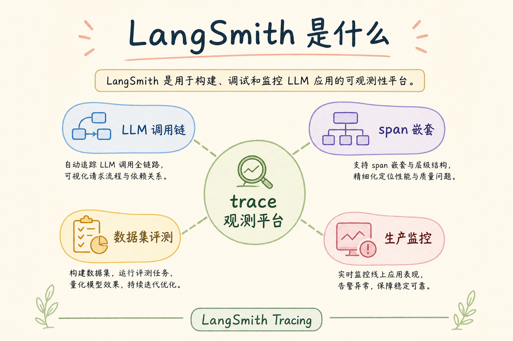
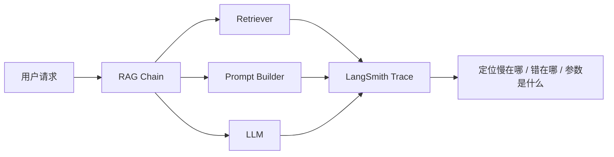
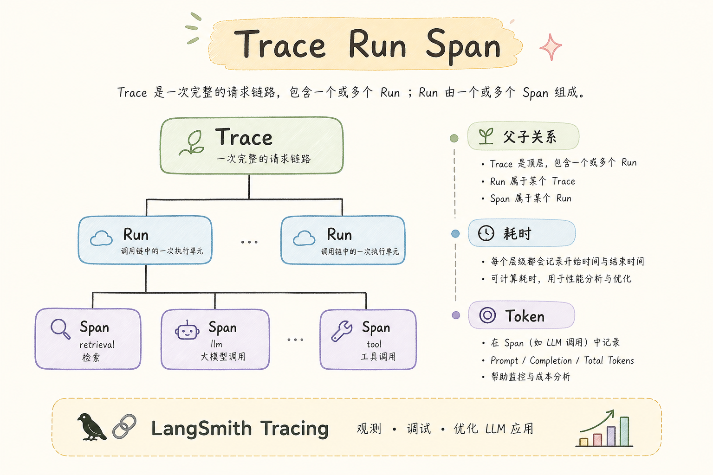
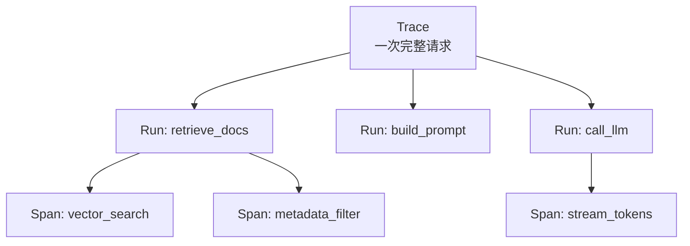
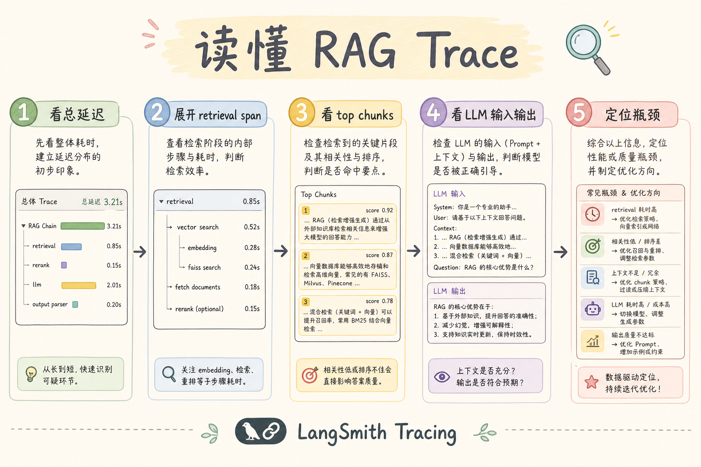
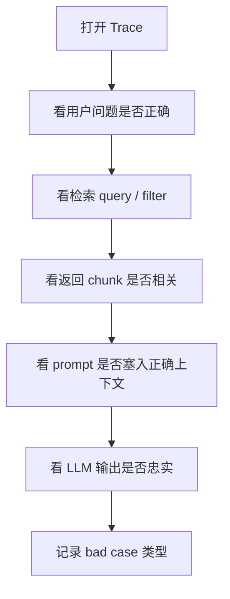
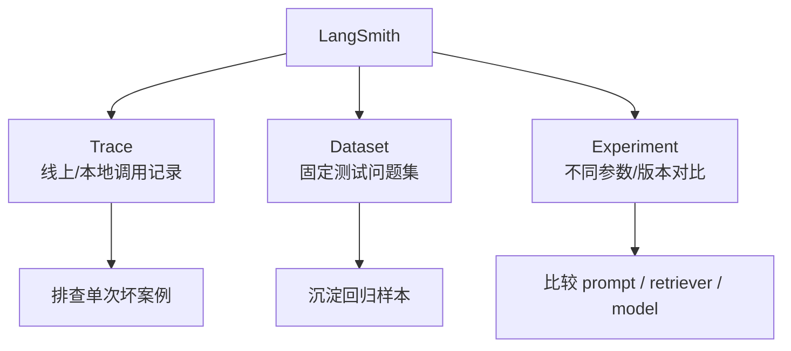

# E 评测与观测（九）：LangSmith 链路追踪完全指南

> RAG 上线后，用户一句「报销不对」背后可能是 **解析乱序、切块切断、检索漏召、模型胡编** 四件事之一。没有 **按时间展开的调用链（Trace）**，团队只能在群里猜。 **LangSmith** 是 LangChain 生态的 **链路追踪与评测平台**：每次 `invoke` / `stream` 变成可搜索的 trace，检索、提示、LLM 调用各占一层 **Span**。这篇是 [企业 RAG 路线图](ENTERPRISE_RAG_ROADMAP.md) **E 模块主线篇**（路线图第 **164** 条），教你 **从 0 接通 RAG 链、读懂 trace、用 trace 驱动 bad case 归因**。前置：[125 LangChain 核心](125.langchain-core-tutorial.md)、[141 Faithfulness](141.ragas-faithfulness-tutorial.md)；对照 [148 Langfuse](148.langfuse-observability-tutorial.md)。Bad case 落地见 149～152。

---

## 目录

1. [前言：没有 trace 的 RAG 排障是盲人摸象](#1-前言没有-trace-的-rag-排障是盲人摸象)
2. [本文边界与动手路径](#2-本文边界与动手路径)
3. [LangSmith 是什么](#3-langsmith-是什么)
4. [Trace、Run、Span：三层心智模型](#4-tracerunspan三层心智模型)
5. [环境变量与项目组织](#5-环境变量与项目组织)
6. [给 RAG 链接入：自动与手动](#6-给-rag-链接入自动与手动)
7. [读懂一次 RAG Trace](#7-读懂一次-rag-trace)
8. [流式 RAG 的 trace 注意点](#8-流式-rag-的-trace-注意点)
9. [数据集、实验与回归](#9-数据集实验与回归)
10. [先错对对：五种典型翻车](#10-先错对对五种典型翻车)
11. [与 Langfuse 及自建日志对照](#11-与-langfuse-及自建日志对照)
12. [综合概念地图](#12-综合概念地图)
13. [常见陷阱与 FAQ](#13-常见陷阱与-faq)
14. [总结与系列下一步](#14-总结与系列下一步)

---

## 1. 前言：没有 trace 的 RAG 排障是盲人摸象

典型线上对话：

- 客服：「第 3 条引用打开是空白。」  
- 后端：「我这边 LLM 返回正常啊。」  
- 算法：「是不是检索错了？」  
- 数据：「PDF 我看过没问题。」  

若只有 **最终 JSON 响应**，四人永远对不上 **同一次请求的中间态**。LangSmith 的价值是把一次 RAG 问答拆成 **可点击的时间线**：

```text
trace (一次用户问答)
  ├─ span: retriever     → 输入 query、输出 documents + scores
  ├─ span: format_docs   → 拼进 prompt 的文本
  ├─ span: ChatOpenAI    → 输入 messages、输出 tokens、latency
  └─ span: (optional) query_rewrite
```

**LangSmith**：LangChain 提供的 LLM 应用 **可观测性平台**，记录链式调用的输入输出、延迟、错误，并支持数据集评测与 A/B 实验。  
通俗说：**RAG 的「飞机黑匣子」**——事故后按秒回放。

**读完本文，你应该能做到：**

1. 配置 `LANGCHAIN_TRACING_V2` 等环境变量，在 UI 看到 trace。  
2. 解释 Trace / Run / Span 关系，并映射到 RAG 四段。  
3. 从 trace 判断问题在 **ingest、retrieve、prompt 还是 generate**。  
4. 对接 [149～152](149.bad-case-parsing-tutorial.md) 归因树。  
5. 识别 §10 五种翻车：忘开 tracing、PII 泄露、采样率为 0、流式未关联 run、prod/dev 混项目。

### 1.1 E 模块主线

```text
163 TruLens（了解）
164 LangSmith ← 本篇（主线）
165 Langfuse（主线，自托管对照）
166～169 Bad Case 四篇（用 trace 下钻）
170 A/B · 171 参数版本
```

---

## 2. 本文边界与动手路径

**档位：E 主线篇（164，厚实现导向）。**

**本文讲：** LangSmith 概念、接入、读 trace、流式、数据集、与 bad case 衔接。  
**本文不讲：** LangSmith 计费细则全文、替代 Datadog 基础设施监控、非 LangChain 框架的每一行 SDK。

### 2.1 动手路径

| 步骤 | 验收 |
|------|------|
| A | 注册项目，拿到 API Key | 控制台可登录 |
| B | 设环境变量，跑一条 LCEL 链 | UI 出现 1 trace |
| C | 点开 retriever span | 看到 chunk 文本与 metadata |
| D | 故意空库检索 | trace 证明 hits=0 |
| E | 写一条 bad case 工单 | 含 trace URL |

**环境：** Python 3.10+、`langsmith`、`langchain-core`；可选 `langchain-openai`。

### 2.2 沿用前文

| 概念 | 来自 |
|------|------|
| LCEL 链 | [126 LCEL](126.langchain-lcel-tutorial.md) |
| Retriever | [127 Retriever](127.langchain-retriever-tutorial.md) |
| 混合检索 | [93 Hybrid](93.hybrid-search-tutorial.md) |
| SSE 流式 | [116 SSE RAG](116.sse-rag-streaming-tutorial.md) |
| 金标 | [160 Golden](143.golden-dataset-tutorial.md) |

---

## 3. LangSmith 是什么

读下图时，先看「LangSmith 链路追踪是什么」想表达的主线：它把本节的概念关系压缩成一张可对照的图。



下面这张图说明 LangSmith 在 RAG 排障里的位置。读图时重点看：它记录的是一次调用的内部路径，而不是只保存最终答案。



结论：没有 trace 时只能猜；有 trace 时可以顺着每一步查输入、输出、耗时和 metadata。

核心能力：

1. **Tracing**：自动记录 LangChain Runnable 的嵌套调用；  
2. **Projects**：按环境/产品隔离 trace；  
3. **Datasets & Evaluations**：把 [160 金标](143.golden-dataset-tutorial.md) 搬进平台跑批；  
4. **Annotation**：人工标 **好/坏** 回灌迭代；  
5. **监控**：错误率、延迟聚合（非完整 APM，但够 LLM 层）。

### 3.1 何时必须用主线工具

- 团队 **已选 LangChain** 作编排（[125～127](125.langchain-core-tutorial.md)）；  
- 需要 **半天内** 让全员能在 UI 看检索结果；  
- 要把 trace 链接贴进 **飞书/Jira bad case 工单**。

---

## 4. Trace、Run、Span：三层心智模型

读下图时，先看「Trace Run Span 关系」想表达的主线：它把本节的概念关系压缩成一张可对照的图。



下面这张图解释 Trace、Run、Span 的层级关系。读图时重点看：一次用户请求是一棵树，不是单行日志。



初学者可以把 Trace 理解为整张病历，Run 是一次检查项目，Span 是检查里的具体步骤。

| 层级 | 含义 | RAG 例子 |
|------|------|----------|
| Trace | 一次端到端用户请求 | POST `/api/rag/ask` 全链路 |
| Run | 同 trace 内一个组件执行 | `VectorStoreRetriever` 一次调用 |
| Span | 更细粒度子步骤（视 SDK） | embedding query 子调用 |

**初学者口诀**：**Trace 是一次问答；Run 是链上每一环；Retriever 那环决定你漏没漏。**

### 4.1 与 OpenTelemetry 的关系

LangSmith 概念上类似 **OTel trace**，但字段针对 LLM 优化（`token_usage`、`prompt` 等）。若公司强制 OTel，可用导出或 **双写**；PoC 阶段 **先 LangSmith 再统一** 更现实。

---

## 5. 环境变量与项目组织

```bash
export LANGCHAIN_TRACING_V2=true
export LANGCHAIN_API_KEY=lsv2_pt_...
export LANGCHAIN_PROJECT=handbook-rag-dev
```

| 变量 | 作用 |
|------|------|
| `LANGCHAIN_TRACING_V2` | 开启 v2 追踪 |
| `LANGCHAIN_API_KEY` | 认证 |
| `LANGCHAIN_PROJECT` | 项目名，建议 `产品-环境` |
| `LANGCHAIN_ENDPOINT` | 私有化/区域端点（若有） |

**生产**：`handbook-rag-prod` 与 dev **严格分项目**；API Key **按项目 RBAC**（见路线图 F 轨 RBAC）。

---

## 6. 给 RAG 链接入：自动与手动
给 RAG 链接入 tracing 的目的，是把一次问答拆成可观察的步骤：检索用了什么 query，召回了哪些 chunk，提示词怎么拼，模型最后怎么回答。自动接入适合快速开始，手动打点适合把关键业务字段记录清楚。

### 6.1 自动：包装 LangChain Runnable

LCEL 链 `chain.invoke({"question": q})` 在 tracing 开启时 **默认上报**。确保 retriever、prompt、llm **皆 LangChain 组件** 或 `@traceable` 包装。

### 6.2 手动：`@traceable` 纯函数

```python
from langsmith import traceable

@traceable(run_type="retriever", name="hybrid_search")
def hybrid_search(query: str, top_k: int = 5):
    dense = dense_index.search(query, top_k)
    sparse = bm25.search(query, top_k)
    return rrf_fuse(dense, sparse)  # 见 [93](93.hybrid-search-tutorial.md)

@traceable(run_type="chain", name="rag_answer")
def rag_answer(question: str):
    docs = hybrid_search(question)
    context = format_docs(docs)
    return llm.invoke(build_messages(context, question))
```

**验收**：UI 中 `hybrid_search` 与 `rag_answer` 分层可见。

### 6.3 Metadata：对接参数版本

每次 invoke 传：

```python
rag_answer(
    question,
    langsmith_extra={
        "metadata": {
            "param_version": "pv-2025-07-01",
            "chunk_policy": "markdown-ast-v2",
            "top_k": 5,
        }
    },
)
```

与 [171 篇](154.param-version-management-tutorial.md) 字段对齐，日后 A/B 才能 **按版本筛 trace**。

---

## 7. 读懂一次 RAG Trace

读下图时，先看「读懂 RAG Trace」想表达的主线：它把本节的概念关系压缩成一张可对照的图。



下面这张图给出读 RAG trace 的固定顺序。读图时重点看：排障要先看输入和检索，再看生成，不要一上来就怪模型。



按这个顺序查，可以减少“模型不行”这类过早结论。很多问题实际来自 query 改写、过滤条件或上下文拼接。

对照上图可以得出一个实用结论：先确认「读懂 RAG Trace」里的主流程，再去调整具体参数或实现细节。

### 7.1 排障顺序（固定套路）

第一次看 trace 时不要从最深的 LLM 输出开始，而要按链路顺序排除问题。下面这套顺序能避免你把检索空、prompt 截断和模型胡编混在一起。

1. **总延迟**：检索 vs 生成谁慢；  
2. **Retriever 输出**：`documents` 几条？`page_content` 是否相关？  
3. **metadata**：`doc_id`、`page`、`chunk_id`（[51](51.metadata-chunk-id-tutorial.md)）是否指向 **错误版本**（[48 文档版本](48.doc-versioning-tutorial.md)）；  
4. **Prompt 输入**：上下文是否被 [107 预算](107.context-budget-tutorial.md) 截断；  
5. **LLM 输出**：是否无视上下文（[152 胡编](152.bad-case-hallucination-tutorial.md)）。

### 7.2 映射到 Bad Case 系列

trace 现象要能落到具体文章，否则排障会停在“感觉不对”。下面这张表把常见现象和优先阅读路径对齐。

| Trace 现象 | 优先读 |
|------------|--------|
| 正文乱码、页码错 | [149 解析](149.bad-case-parsing-tutorial.md) |
| 关键词在库但 chunk 不含 | [150 切块](150.bad-case-chunking-tutorial.md) |
| hits=0 或分数极低 | [151 检索遗漏](151.bad-case-retrieval-miss-tutorial.md) |
| hits 对但答案错 | [152 胡编](152.bad-case-hallucination-tutorial.md) |

### 7.3 与解析链交叉验证

若 retriever 返回的 `page_content` **本身乱序**（双栏 PDF 拼错），根因在 [36 PDF 提取](36.pdf-text-extraction-tutorial.md)、[37 版面](37.pdf-layout-tables-tutorial.md)、[42 PyMuPDF](42.pymupdf-tutorial.md)——不是调 `top_k` 能救的。

---

## 8. 流式 RAG 的 trace 注意点

[116 SSE RAG](116.sse-rag-streaming-tutorial.md) 下，生成阶段是 **多 delta**。LangSmith 通常聚合成 **一条 LLM run**，注意：

- **检索仍应完整记录**（非流式）；  
- `citations` 若在流末尾发送，trace 的 **最终输出** 应含引用元数据；  
- 前端 `request_id` = 后端 `trace_id` 便于客服截图定位。

---

## 9. 数据集、实验与回归

LangSmith **Datasets** 可导入 [160 金标](143.golden-dataset-tutorial.md) JSONL。对同一 dataset：

- 跑 **v1 vs v2** 参数（[171](154.param-version-management-tutorial.md)）；  
- 挂 [141 Faithfulness](141.ragas-faithfulness-tutorial.md) 等 evaluator；  
- 结果进 **Experiments** 视图——与 [170 A/B](153.ab-experiment-rag-tutorial.md) 互补（平台内实验 vs 产品分流）。

---

## 10. 先错对对：五种典型翻车
下面的错法适合当排障清单看：它们不是语法问题，而是会让评估、追踪或坏例分析失去证据链，最后只能靠猜测定位问题。

### 10.1 错：生产忘开 tracing

**对**：默认开；用 **采样** 控成本，而非全关。

### 10.2 错：trace 存全文含 PII

**对**：metadata 只留 `chunk_id`；正文 **脱敏** 或 **哈希**（路线图 G 轨 PII）。

### 10.3 错：Retriever 不用 LangChain 包装导致「黑洞」

**对**：`@traceable` 或自写 span 导出。

### 10.4 错：只存 LLM 不存检索

**对**：RAG trace **必须可展开 Top-K 原文**。

### 10.5 错：bad case 只截图不贴 trace 链接

**对**：工单模板强制 `https://smith.langchain.com/.../runs/...`。

---

## 11. 与 Langfuse 及自建日志对照

| 维度 | LangSmith | [148 Langfuse](148.langfuse-observability-tutorial.md) |
|------|-----------|--------------------------------------------------------|
| 生态 | LangChain 原生 | 多框架 |
| 部署 | 云为主 | 可自托管 |
| 成本 | 按量 | 自托管 infra |
| 学习 | 本篇主线 | 下一篇主线 |

**自建 JSON 日志** 最小字段：`trace_id`、`span`、`latency_ms`、`chunk_ids[]`、`model`、`param_version`——平台是 **壳**，字段契约是 **魂**。

---

## 12. 综合概念地图

读下图时，先看「LangSmith 概念地图」想表达的主线：它把本节的概念关系压缩成一张可对照的图。


下面这张概念地图把 LangSmith 的核心对象放在一起。读图时重点看：trace 用于排障，dataset 和 experiment 用于回归。



这张图的结论是：LangSmith 不只是日志面板，它还可以把排障发现沉淀成后续实验。

---


## 13. 常见陷阱与 FAQ
最后用 FAQ 把观测和评估拉回日常使用。真正要检查的是：一次回答能不能被追踪、能不能被打分、能不能定位到具体失败环节。

### 13.1 初学者最常踩的三坑

下面三坑都不是语法问题，而是观测习惯问题：如果只在系统出错后才想起来补日志，trace 就很难还原当时发生了什么。

1. **只看最终答案，不看链路**——LangSmith 的价值在 **可复现的中间态**。  
2. **没有金标就调参**——没有 [160 Golden Dataset](143.golden-dataset-tutorial.md) 时，A/B 只是 **主观吵架**。  
3. **工具买了不用**——装了 LangSmith/Langfuse 却不给每次请求打 `trace_id`，等于 **黑盒上线**。

### 13.2 FAQ 精选

**Q1：PoC 阶段要不要上观测？**  
要。**最小集**：`request_id` + 检索 Top-5 `chunk_id` + 模型名 + 延迟。完整平台可后补，但 **字段契约** 第一天就定。

**Q2：和 RAGAS 指标怎么配合？**  
RAGAS 回答 **「好不好」**；观测平台回答 **「哪一步坏了」**。建议：金标跑 RAGAS 批次，线上 bad case 用 trace 下钻。

**Q3：成本会不会爆？**  
Trace 存全文 context 很贵。生产用 **采样**（如 5%）+ **摘要字段**（chunk_id、score、前 200 字预览），全文按需拉取。

**Q4：多环境怎么隔离？**  
`project` / `environment` 标签：`dev` / `staging` / `prod` 分开；**禁止** 把 prod trace 当训练数据未经脱敏。

**Q5：谁负责看板？**  
工程搭管道，**产品 + 领域专家** 每周过 bad case；研发负责 **归因到模块**（解析/切块/检索/生成）。

**Q6：失败请求要不要记 trace？**  
**更要记**。超时、空检索、解析异常——没有失败 trace，你永远在猜。

**Q7：和 [147 LangSmith](147.langsmith-tracing-tutorial.md) / [148 Langfuse](148.langfuse-observability-tutorial.md) 二选一？**  
LangChain 深度用 LangSmith 顺手；要 **自托管、开源、多框架** 看 Langfuse。也可 **双写** 过渡期，但统一 `trace_id`。

**Q8：如何证明一次修复有效？**  
回归集 [161](144.regression-test-set-tutorial.md) 上 **同题同参** 对比；再看线上 **7 日 bad case 率**。

**Q9：实习生能维护吗？**  
把 **归因决策树** 贴在 wiki（本篇系列 149～152）；观测 UI 只读权限给全员，写权限限研发。

**Q10：面试怎么讲？**  
30 秒：**「RAG 上线后我用 trace 把 bad case 分到 ingest/retrieve/generate，用金标 + A/B 验证改动，参数版本可回滚。」**

**Q11：不用 LangChain 还能用 LangSmith 吗？**  
可以 `@traceable` 包装任意 Python；但体验最佳仍是 LangChain Runnable。纯自研管道更常选 [148 Langfuse](148.langfuse-observability-tutorial.md)。
**Q12：trace 保留多久？**  
按合规与成本：一般 30～90 天；低分 trace 可标记 **永久保留** 作回归样本。
## 14. 总结与系列下一步

1. **LangSmith = RAG 黑匣子**：Trace 串起检索、提示、生成。  
2. **接入成本低**：环境变量 + LCEL 即可见 первый trace。  
3. **排障顺序固定**：延迟 → 检索内容 → prompt → 输出。  
4. **与 bad case 系列绑定**：149～152 是「看 trace 后的决策树」。  
5. **与 171 参数版本绑定**：metadata 带 `param_version` 才能做实验对比。

| 目标 | 阅读 |
|------|------|
| Langfuse 自托管观测 | [148 Langfuse](148.langfuse-observability-tutorial.md) |
| 解析 bad case | [149 篇](149.bad-case-parsing-tutorial.md) |
| A/B 实验 | [153 篇](153.ab-experiment-rag-tutorial.md) |
| 参数版本 | [154 篇](154.param-version-management-tutorial.md) |

---

*系列：E 评测与观测 · 路线图第 164 条 · 主线篇*


### 14.1 LangSmith 深度补充：生产排障剧本

**周一例会剧本**（30 分钟）：(1) 过去 7 天 error rate；(2) P95 检索延迟；(3) 抽 5 条用户点踩 trace；(4) 用 149～152 树归因；(5) 对齐本周 [170 A/B](153.ab-experiment-rag-tutorial.md) 是否冲突。

**Retriever span 必展字段**：`page_content` 前 300 字、`metadata.doc_id`、`metadata.page`、`metadata.chunk_id`、`score`。与 [52 source/page](52.metadata-source-page-tutorial.md) 一致才能跳转 [115 导航](115.source-document-navigation-tutorial.md)。

**跨团队协作**：给客服 **只读 trace 链接** + 「复制 chunk 原文」按钮；算法改参数必须 **留言 param_version**（[171](154.param-version-management-tutorial.md)）。安全：trace 中 **手机号、身份证** 走 [212 PII](ENTERPRISE_RAG_ROADMAP.md) 脱敏规则。


## 15. LangSmith 生产排障剧本

接到客服截图后，第一步要 **trace 链接**，不是让后端「查一下日志」。固定排障顺序：总延迟 → retriever 条数与分数 → 每条 page_content 前两百字 → 完整 prompt → LLM 输出。

若 page_content 与 PDF 肉眼不一致，停止调 top_k，转 [149 解析归因](149.bad-case-parsing-tutorial.md)。若关键词在库但 chunk 只有半句话，转 [150 切块](150.bad-case-chunking-tutorial.md)。若 gold 句在库、用户 query 捞不到，转 [151 检索遗漏](151.bad-case-retrieval-miss-tutorial.md)。若 Top-K 含 gold 答案仍错，转 [152 胡编](152.bad-case-hallucination-tutorial.md)。

环境变量 `LANGCHAIN_PROJECT` 必须区分 dev/staging/prod。API Key 按项目发放，离职同收。trace 中手机号、身份证脱敏，只留 chunk_id 回源。

流式 RAG 见 [116 SSE](116.sse-rag-streaming-tutorial.md)：检索非流式、生成流式，trace 在流结束后要有 **最终答案与 citations**。前端 request_id 必须等于后端 trace_id。

Datasets 导入 [160 金标](143.golden-dataset-tutorial.md)，Experiments 对比两个 [171 param_version](154.param-version-management-tutorial.md)，与 [170 A/B](153.ab-experiment-rag-tutorial.md) 线上实验互为补充。


## 16. 跨团队协同

给客服只读权限 + 「复制 trace 链接」按钮。算法改参数必须在变更单写 param_version。周一例会三十分钟：错误率、P95 检索延迟、五条点踩 trace、本周实验是否冲突。

纯自研管道可用 `@traceable` 包装检索与生成，体验略逊于全 LCEL，但远好于黑盒。


## 17. 练习与自检

动手一：配置环境变量，LCEL 链跑通，截图 retriever span。动手二：故意空库，看 trace。动手三：写含 trace URL 的 bad case 工单模板。

自检：Trace/Run/Span 各举 RAG 例子？排障五步顺序？与 Langfuse 选型差异？

误区：生产关 tracing；trace 存 PII；检索不包装进 trace；流式不关联 run_id。

精读 [149～152](149.bad-case-parsing-tutorial.md) 四篇，每次排障必问：解析、切块、检索、胡编各排除了吗？

## 18. 从零到一的 LangSmith 周计划

**周一**：注册项目，配置三个环境变量，跑 [126 LCEL](126.langchain-lcel-tutorial.md) hello world trace。**周二**：接入真实 retriever，确认 Top-K 含 metadata。**周三**：metadata 加 param_version，对接 [171 篇](154.param-version-management-tutorial.md)。**周四**：导入二十条金标到 Datasets。**周五**：模拟 bad case 五条，练 149～152 归因。

检索 span 是 **RAG 排障的圣杯**。务必教会全员：点击 retriever → 展开 documents → 复制 page_content。很多「模型胡编」五分钟变「检索没捞到」。若 documents 本身乱，回到 **ingest**（[36～56](36.pdf-text-extraction-tutorial.md)），不是换 GPT。

延迟治理：检索 P95 超两百毫秒先查 [87 ANN](87.ann-recall-latency-tutorial.md) 与 top_k；生成 P95 超两秒查模型与 [28 窗口](28.context-window-tutorial.md)。trace 让「慢」可分解，避免笼统「优化 RAG」。

安全：生产 trace 默认脱敏；研发临时开全文需审批；三十天自动归档。合规场景保留 **低分 trace 一年** 作审计样本。

与 [148 Langfuse](148.langfuse-observability-tutorial.md) 共存期：统一 trace_id 字段，双写至多四周。LangChain 深度团队最终常 **以 LangSmith 为主、Langfuse 作自托管备份** 或反过来，取决于合规，但字段契约必须一致。

练习验收：给同事一条 trace 链接，对方能在三分钟说出「检索几条、最相关 chunk 讲什么、答案是否被 context 支撑」。做不到说明 trace 埋点不合格。

## 19. 综合案例：trace 五分钟定责

**背景**：客服称引用空白。**trace** 显示 retriever 返回 chunk，`metadata.page=12` 但 `page_content` 为空串。**归因**：[149 解析](149.bad-case-parsing-tutorial.md)，该页扫描未 OCR。**行动**：走 [55 OCR](55.ocr-scanned-docs-tutorial.md)，重 ingest，升 doc 版本 [48](48.doc-versioning-tutorial.md)。

**案例二**：trace 显示 Top-5 含 gold，答案错误。**归因**：[152 胡编](152.bad-case-hallucination-tutorial.md)。展开 prompt，gold 在 context 第 8000 字后被截断，转 [107 预算](107.context-budget-tutorial.md)。

**案例三**：latency 3.2s，检索 2.8s。**行动**：查 [98 top_k](98.top-k-retrieval-tutorial.md)、ANN [87](87.ann-recall-latency-tutorial.md)，非 LLM 问题。

LangSmith 让 **五分钟定责** 成为可能。工单只贴 trace URL，减少群里扯皮。

## 20. E 模块联动与职业素养

企业 RAG 的成熟度不靠「是否用上向量库」，而靠 **能否把一次用户差评还原成可复现链路**。LangSmith trace 排障 是其中一环。你必须熟悉：**金标** [160](143.golden-dataset-tutorial.md)、**回归** [161](144.regression-test-set-tutorial.md)、**RAGAS** [156～159](139.ragas-context-precision-tutorial.md)、**观测** [164 LangSmith](147.langsmith-tracing-tutorial.md) / [165 Langfuse](148.langfuse-observability-tutorial.md)、**归因四步** [166～169](149.bad-case-parsing-tutorial.md)、**实验** [170](153.ab-experiment-rag-tutorial.md)、**版本** [171](154.param-version-management-tutorial.md)。

**ingest 段** 回到 C1：[36 PDF](36.pdf-text-extraction-tutorial.md) 到 [56 多模态](56.multimodal-image-text-tutorial.md)。**chunk 段** 回到 C2：[57](57.fixed-size-chunking-tutorial.md) 到 [65 Parent](65.parent-document-retriever-tutorial.md)。**检索段** 回到 [91 Dense](91.dense-retrieval-tutorial.md)、[92 Sparse](92.sparse-retrieval-rag-tutorial.md)、[93 Hybrid](93.hybrid-search-tutorial.md)、[100 改写](100.query-rewriting-tutorial.md)。**生成段** 回到 [33 幻觉](33.llm-hallucination-tutorial.md)、[110 Prompt](110.rag-prompt-template-tutorial.md)、[112 拒答](112.refusal-strategy-tutorial.md)、[141 Faithfulness](141.ragas-faithfulness-tutorial.md)。

每周五用三十分钟做 **E 模块例会**：一个指标（Faithfulness 或点踩率）、五条 trace、一个实验结论、一个 pv 变更。坚持八周，团队会形成 **共同语言**，不再为「模型笨」争吵。

**面试最后一问**：讲一次你亲历的 bad case，如何从 trace 定位到解析/切块/检索/胡编，如何单变量实验验证，如何 param_version 回滚。能讲清楚者，已超越多数「只会调 top_k」的候选人。

**合规提醒**：trace 与 Record 可能含用户 query 中的个人信息，脱敏与保留周期遵守公司安全政策（路线图 G 轨 PII、审计）。观测不是 **无限记日志**，而是 **记对字段、记够排障、记到合规**。

**下一步学习**：人工评测 [172](155.human-evaluation-rag-tutorial.md)；检索调试台（路线图 199）；全栈看板（路线图 201）。E 模块学完后，你已具备 **生产化迭代闭环**，可进入 F 轨工程交付。

**背诵卡片（可选）**：观测回答「哪一步坏了」；评测回答「好不好」；实验回答「改动是否有效」；版本回答「当时用的啥配置」。四句话覆盖 E 模块面试八十分。动手时永远 **先 trace 后改参**，先 **单变量** 后组合，先 **离线回归** 后线上灰度——三条纪律比任何工具名字都重要。

**交付物检查**：读完本篇后，你应能在自己的 RAG 项目里指出：观测字段是否含 chunk_id 与 param_version；是否能在十五分钟内用 149～152 树归因一条真实差评；是否能为下一次参数变更写出实验假设与回滚条件。三项都能做到，本篇才算 **真正读完**，而非收藏夹吃灰。

## 21. 全系列复盘：E 模块九篇一张图

```text
163 TruLens（了解）── 在线三角抽样
164 LangSmith（主线）─┐
165 Langfuse（主线）──┴─ 观测：trace 下钻
166 解析 bad case ── C1 轨 36～56
167 切块 bad case ── C2 轨 57～65
168 检索遗漏（主线）── 93 hybrid、100 改写
169 生成胡编（主线）── 33 理论、141 Faithfulness
170 A/B 实验 ── 单变量 + 护栏
171 参数版本 ── manifest + 回滚
```

**一周冲刺计划**：周一 147+148 接通 trace；周二 149 源文 diff；周三 150 chunk 边界；周四 151 gold 探针；周五 152 Faithfulness 核验；周末 170+171 写实验与 manifest。第二周用 TruLens 抽样验证三角分桶是否与人工归因一致。

**与 DeepEval、RAGAS 关系**：离线 RAGAS 定基线，DeepEval 挡 CI，TruLens 看尾部，LangSmith/Langfuse 定位链路——五件套各司其职，不是「选一个就够」。

**常见团队分工**：数据工程负责 166～167 与 ingest；算法负责 168～169 与检索生成；平台负责 164～165 与 171；产品负责 170 实验设计与金标维护。单人学习则按文件编号顺序推进。

**质量门禁建议**：新版本 pv 上线前——回归集 Faithfulness 不降超过 1pp；P95 延迟不超旧版 10%；点踩率周环比不升。任一失败则回滚 parent_version。

**引用与溯源**：生成侧见 [113 行内](113.inline-citation-tutorial.md)、[115 导航](115.source-document-navigation-tutorial.md)；流式见 [116 SSE](116.sse-rag-streaming-tutorial.md)。观测与引用结合，用户才能从差评走到可点击证据。

**最后强调**：bad case 不是耻辱，是 **迭代燃料**。没有 trace 的 bad case 是八卦；有 trace 与 param_version 的 bad case 是 **数据集与实验假设来源**。把 166～169 决策树贴在显示器旁，比再买一个向量库更能提升答案质量。

## 22. 实操巩固（必读）

请你现在打开自己的 RAG 项目或教程 PoC，完成三件事：第一，为最近一次问答找到或构造等价于 LangSmith trace 的完整记录，至少包含检索结果列表与最终 prompt。第二，用 166～169 四篇的决策树对一条差评分类，写下证据而不是猜测。第三，在纸上写出当前系统的 param_version 字符串，若写不出，说明版本管理尚未开始，请优先阅读 171 并创建 manifest。

观测平台选型无需纠结：LangChain 为主选 LangSmith，自研或合规选 Langfuse，亦可短期双写。关键是 chunk_id、param_version、experiment_id 字段统一。TruLens 作了解档，适合在 staging 对三角分桶，引导团队讨论「检索坏还是生成坏」。

解析与切块问题常被误当成模型问题。只要 trace 里原文与源文件不一致，或 chunk 语义不完整，就不要调 temperature。检索遗漏时 hybrid 与改写是第一档手段，胡编且 context 含 gold 时才盯 prompt 与拒答。每次改动走 A/B，每次上线记 pv，每次回滚有 parent。

金标与回归集是 **前提**，不是可选项。没有 160 与 161，实验只是争论。RAGAS 指标与线上点踩率应同向变动；若背离，检查评判 prompt、抽样或产品入口变化。

面向面试：用三分钟讲清「一次 bad case 如何从 trace 定位到模块、如何用实验验证、如何回滚」。这比背诵向量库 API 更能体现 E 模块素养。

面向生产：trace 脱敏、保留周期、失败请求必记、客服会贴链接。E 模块不是实验室装饰，是上线后的操作系统。

若你刚学完 163～171，下一步建议 172 人工评测，并把路线图 199 检索调试台列入 backlog。坚持每周例会三十分钟，八周后团队答复质量通常会显著稳定，因为你们不再盲人摸象。

E 模块与 C 轨、D 轨的衔接：ingest 出问题回到 36～56，检索出问题回到 91～103，生成出问题回到 29～34 与 110～112。不要跨模块乱调参。文档版本 48 与参数版本 171 同时维护，避免「内容新、管道旧」或相反。

TruLens 三角、RAGAS 四指标、点踩率、Faithfulness 自动评——指标多时要 **分桶看**，不要合成一个神秘分数。实验 170 只改一把尺，版本 171 记下每一次尺的长度。这是本批九篇最核心的纪律，请写入团队 wiki 首页。

## 23. 术语对照与读者服务

初学者常混淆观测与评测：LangSmith 与 Langfuse 记录「发生了什么」，RAGAS 与 TruLens 评判「好不好」。混淆会导致工具买重复或互相推诿。bad case 四篇是「为什么不好」的归因手册，不是新的工具广告。A/B 与 param_version 是「如何安全地变好」的制度。

阅读顺序建议：先 164 或 165 接通 trace，再 166～169 练归因，再 170～171 做变更。163 TruLens 可插读。每篇动手路径表的验收项务必打勾，否则只读不练等于未学。

感谢你把 E 模块学完。企业 RAG 的护城河往往不是最大模型，而是 **可追溯、可实验、可回滚** 的工程习惯。愿你在真实项目里用 trace 终结扯皮，用金标终结拍脑袋，用 param_version 终结「上周那个配置谁还记得」。


### 附录：E 模块联动速查

本篇属于路线图 **E. 评测、观测与迭代**（163～171）。推荐闭环：**金标（160）→ RAGAS 离线分（156～159）→ 观测 trace（164 LangSmith / 165 Langfuse）→ bad case 四步归因（166～169）→ A/B 验证（170）→ param_version 登记（171）**。解析阶段问题回跳 **C1 轨 [36 PDF](36.pdf-text-extraction-tutorial.md)～[56 多模态](56.multimodal-image-text-tutorial.md)**；切块问题回跳 **[57 固定分块](57.fixed-size-chunking-tutorial.md)～[65 Parent](65.parent-document-retriever-tutorial.md)**；检索遗漏优先 **[93 混合检索](93.hybrid-search-tutorial.md)** 与 **[100 查询改写](100.query-rewriting-tutorial.md)**；生成胡编对照 **[33 幻觉](33.llm-hallucination-tutorial.md)** 与 **[141 Faithfulness](141.ragas-faithfulness-tutorial.md)**。每次线上变更在 trace metadata 写 `param_version`，在 Git 提交 manifest，在回归集留 before/after 分数——三线对齐才称得上工程化 RAG。初学者请把本篇与相邻编号文章串读一周：工具篇（163～165）建立观测，归因篇（166～169）建立排障肌肉记忆，实验与版本篇（170～171）建立变更纪律。缺任何一块，线上都会退回「凭感觉调 top_k」的作坊状态。配图见 `image/langsmith-tracing/prompts/`，风格 hand-drawn-edu、16:9 中文，与全系列一致。

## 附录：工程化 RAG 迭代宣言（系列共用）

我们承诺：每一次线上用户差评都能在七十二小时内对应到一条 trace 或等价日志；每一个 param_version 都能在 Git 找到 manifest；每一次参数变更都有离线回归或 A/B 证据。我们拒绝「感觉好像好了」的上线方式。

解析阶段对照第三十六至五十六篇：PDF、表格、HTML、DOCX、编码、OCR、多模态各有一套失败信号。切块阶段对照第五十七至六十五篇：固定、递归、句子、重叠、结构、Markdown、Parent。检索阶段对照第九十一至一百零三篇：稠密、稀疏、混合、改写、多查询。生成阶段对照第三十三篇幻觉理论与第一百一十至一百一十二篇 prompt 与拒答。

LangSmith 与 Langfuse 是主线观测工具，不是可选项。TruLens 与 RAGAS 是质量尺子，不是装饰品。bad case 四篇是团队共同语言，不是算法私藏。A/B 与 param_version 是变更法律，不是事后补票。

每周例会四问：点踩率变了吗？Faithfulness 变了吗？P95 延迟变了吗？本周实验结论是什么？四问答不清，说明观测或版本管理仍欠债。

单人学习者：用一周接通 trace，一周练四篇归因，一周写第一个 manifest 与实验设计书。三周后你应能独立处理一条真实差评全流程。

多人团队：数据对 ingest，算法对 retrieve 与 generate，平台对观测与版本，产品对金标与实验。边界清晰可减少互相甩锅。

合规：trace 脱敏，保留周期书面化，用户删除权对接会话与日志删除 API。观测数据也是个人数据载体。

图文要求：如本篇加入信息图，图前要说明读图重点，图后要给结论；不要让图片脱离所在小节。

路线图 E 模块完结后，你已进入「能迭代」阶段，而非「能 demo」阶段。下一阶段 F 轨将把能力封装为 API 与界面。请带着 param_version 与 trace 习惯进入全栈篇。

如果你只记住一句话：先 trace，后归因，再实验，终版本。其余工具名都会随生态演变，这条纪律不会过时。

本批九篇对应路线图第一百六十三至一百七十一条，文件编号第一百四十六至一百五十四。档位标注「了解」「主线」「地基」见 batch mapping 文档。初学者按编号顺序阅读，遇到 ingest 疑问跳 C1，遇到检索疑问跳 C4C5，遇到生成疑问跳 C6 与第三十三篇。

动手验收再强调：接通一次 trace，完成一次源文 diff，完成一次 gold 探针，完成一次 Faithfulness 人工核验，写出一份实验设计书，写出一份 manifest YAML。六项齐，E 模块毕业。

与同事协作时，把 trace 链接当作 bad case 第一附件，把 param_version 当作变更第一字段，把回归集 diff 当作上线第一门禁。文化比工具更难，但文化靠重复仪式养成。

祝你在企业 RAG 路上，少踩「黑盒调参」的坑，多建「可复盘」的系统。坚持学习。

再读一遍本篇核心章节摘要，对照你当前项目打勾：我能否在观测 UI 找到检索 Top-K？我能否解释本次问答的 param_version？我能否把最近一条差评归入四步归因之一？我能否在改动前写出 A/B 假设？四问皆能，本篇目标达成；若有否，带着问题重读对应小节，比盲目刷下一篇更有效。请继续阅读系列相关篇章。

最后提醒：生成胡编、检索遗漏、切块错误、解析错误四类问题在用户侧都表现为「机器人胡说」，只有 trace 与归因树能把争论变成工程任务。把第一百六十六至一百六十九篇打印成决策树贴在工位旁，配合第一百六十四或一百六十五篇的观测链接，你的 RAG 团队会少开很多无效会议。版本管理第一百七十一条不是官僚主义，而是事故后十分钟回滚的保险绳。感谢阅读，欢迎反馈改进建议。
